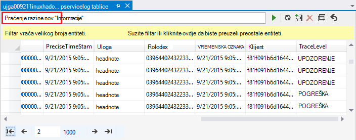

<properties
    pageTitle="Ispravljanje pogrešaka Hadoop u HDInsight: prikaz zapisnika i tumačenje poruke o pogreškama | Microsoft Azure"
    description="Informirajte se o poruke o pogreškama koje se mogu prikazati dok administriranje HDInsight pomoću komponente PowerShell i koraci koje možete poduzeti da biste oporavili."
    services="hdinsight"
    tags="azure-portal"
    editor="cgronlun"
    manager="jhubbard"
    authors="mumian"
    documentationCenter=""/>

<tags
    ms.service="hdinsight"
    ms.workload="big-data"
    ms.tgt_pltfrm="na"
    ms.devlang="na"
    ms.topic="article"
    ms.date="09/02/2016"
    ms.author="jgao"/>

# Analiza HDInsight zapisnika

Svaki Hadoop klaster u Azure HDInsight ima račun za Azure prostora za pohranu koji se koristi kao zadani datotečni sustav. Račun za pohranu naziva kao zadani račun za pohranu. Klaster koristi tablice Azure prostora za pohranu i spremište blobova platforme na zadani račun za pohranu za pohranu njegov zapisnika.  Da biste saznali zadanog računa za pohranu za svoj klaster, potražite u članku [Upravljanje Hadoop klastere u HDInsight](hdinsight-administer-use-management-portal.md#find-the-default-storage-account). Zapisnike zadržati na računu za pohranu, čak i nakon brisanja klaster.

##Zapisnici zapisivanje Azure tablice

Zapisnike zapisivanje Azure tablice omogućuju jednu razinu uvid u što se događa s programa klaster HDInsight.

Kada stvorite programa HDInsight klaster, 6 tablice se automatski stvaraju za sustavom Linux klastere u spremište tablica zadane:

- hdinsightagentlog
- syslog
- daemonlog
- hadoopservicelog
- ambariserverlog
- ambariagentlog

3 tablice se stvaraju za klastere utemeljen na sustavu Windows:

- setuplog: zapisnik događaja/iznimke u dodjele resursa i postavljanje sustava klastere HDInsight.
- hadoopinstalllog: zapisnik događaja/iznimke naišao na prilikom instaliranja Hadoop na klaster. Ova tablica može biti korisno u problema vezanih uz klastere koje su stvorene pomoću prilagođenih parametara za ispravljanje pogrešaka.
- hadoopservicelog: zapisnik događaja/iznimke snimio sve Hadoop servise. Ova tablica može biti korisno u ispravljanje pogrešaka problema vezanih uz neuspjelim na klastere HDInsight.

Nazivi tablica datoteke **u<ClusterName>DDMonYYYYatHHMMSSsss<TableName>**.

U ovim su tablicama sadrži sljedeća polja:

- ClusterDnsName
- ComponentName
- EventTimestamp
- Glavno računalo
- MALoggingHash
- Poruka
- N
- PreciseTimeStamp
- Uloga
- Indeks redaka
- Klijent
- VREMENSKA OZNAKA
- TraceLevel

### Alati za pristup zapisnike

Za pristup podacima u tim tablicama dostupne su mnoge Alati:

-  Visual Studio
-  Explorer Azure prostora za pohranu
-  Power Query za Excel

#### Pomoću dodatka Power Query za Excel

Power Query moguće je instalirati sa [www.microsoft.com/en-us/download/details.aspx?id=39379]( http://www.microsoft.com/en-us/download/details.aspx?id=39379). U odjeljku stranica za sistemske preduvjete za preuzimanje

**Da biste otvorili i analizirati zapisnika servis pomoću dodatka Power Query**

1. Otvaranje **Programa Microsoft Excel**.
2. Na izborniku **Power Query** kliknite **Iz Azure**, a zatim **iz tablice za Microsoft Azure prostora za pohranu**.
 
    
3. Unesite naziv računa za pohranu. To se može biti kratki naziv ili FQDN.
4. Unesite ključ za račun za pohranu. Prikazat će se popis tablica:

    
5. Desnom tipkom miša kliknite tablicu hadoopservicelog **navigacijskog** okna, a zatim odaberite **Uređivanje**. Prikazat će 4 stupca. Po želji, izbrišite **Ključ particije**, **Ključ retka**i **vremenske oznake** stupaca tako da ih odaberete, a zatim kliknite **Ukloni stupce** iz mogućnosti na vrpci.
6. Kliknite ikonu Proširi sadržaja stupac da biste odabrati stupce koje želite uvesti u proračunsku tablicu programa Excel. U ovom pokazni koju sam odabrao TraceLevel i ComponentName: možete omogućit me neke osnovne podatke, na kojem komponente imali problema.

    
7. Kliknite **u redu** da biste uvezli podatke.
8. Odaberite stupce **TraceLevel**, uloge i **ComponentName** , a zatim kliknite **Grupiraj po** kontrole na vrpci.
9. U pritisnite **u redu** u dijaloškom okviru Grupiraj prema
10. Kliknite** Primijeni i Zatvori**.
 
Excel sada možete koristiti za filtriranje i sortiranje prema potrebi. Pogrešno, preporučujemo vam da biste dodali druge stupce (npr. poruka) da bi se naniže na probleme kada se pojavljuju, ali označavanjem i grupiranjem stupaca navedenih nudi što se događa sa servisima Hadoop decent sliku. Isti ideja primjenjuje se na tablice setuplog i hadoopinstalllog.

#### Pomoću programa Visual Studio

**Da biste koristili Visual Studio**

1. Otvorite Visual Studio.
2. Na izborniku **Prikaz** kliknite **Explorer oblaka**. Ili jednostavno kliknite **CTRL +\, CTRL + X**.
3. **Oblak Explorer**odaberite **Vrste resursa**.  Druga mogućnost dostupna je **Grupa resursa**.
4. Proširite **Račune za pohranu**, zadani račun za pohranu za svoj klaster, a zatim **tablica**.
5. Dvokliknite **hadoopservicelog**.
6. Dodajte filtar. Ako, na primjer:
    
        TraceLevel eq 'ERROR'

    

    Dodatne informacije o izgradnje filtara potražite u članku [Sastavljanje nizove filtra za dizajnera tablice](../vs-azure-tools-table-designer-construct-filter-strings.md).
 
##Zapisnici zapisivanje blobova platforme Azure

[Zapisnike zapisivanje Azure tablice](#log-written-to-azure-tables) omogućuju jednu razinu uvid u što se događa s programa klaster HDInsight. No u ovim su tablicama nude zapisnike razini zadatka, što može biti korisno u detaljne daljnje na probleme kada se pojavljuju. Da bi ovaj sljedeću razinu detalja, HDInsight klastere konfigurirani tako da pisanje zapisnika zadatka na račun za spremište blobova platforme za bilo koji zadatak koji se šalju kroz Templeton. Gotovo, to znači da poslove poslane pomoću cmdleta ljuske PowerShell za Microsoft Azure ili .NET posao slanje API-ji, ne šalje putem RDP/command-line pristup klaster zadatke. 

Da biste pogledali zapisnike, potražite u članku [aplikacije programa Access YARN prijavi sustavom Linux HDInsight](hdinsight-hadoop-access-yarn-app-logs-linux.md).

Dodatne informacije o zapisnicima aplikacije potražite u članku [Upravljanje Simplifying korisnik zapisnika i pristupa u YARN](http://hortonworks.com/blog/simplifying-user-logs-management-and-access-in-yarn/).
 
 
## U zapisnicima klaster stanja i posla

###Pristup Hadoop korisničkog Sučelja

Na portalu Azure klikom na naziv HDInsight klaster otvorite plohu klaster. Iz plohu klaster kliknite **nadzorna ploča**.

Kada se to od vas zatraži, unesite klaster administratorske vjerodajnice. Na konzoli upit koji će se otvoriti kliknite **Hadoop korisničkog Sučelja**.

###Pristup Yarn korisničkog Sučelja

Na portalu Azure klikom na naziv HDInsight klaster otvorite plohu klaster. Iz plohu klaster kliknite **nadzorna ploča**. Kada se to od vas zatraži, unesite klaster administratorske vjerodajnice. Na konzoli upit koji će se otvoriti kliknite **YARN korisničkog Sučelja**.

Korisničko Sučelje YARN možete koristiti da biste učinili sljedeće:

* **Dohvatite klaster status**. U lijevom oknu proširite **klaster**, a zatim kliknite **o**. Ova prezentacija skupine status detalje kao što je zbroj dodijeliti memorije, jezgri koristi, stanje Voditelj resursa klaster, skupine verziju itd.

    

* **Dohvatite čvor status**. U lijevom oknu proširite **klaster**pa kliknite **čvorove**. Sadrži popis svih čvorove u klasteru HTTP adrese svaki čvor resursi dodijeliti svakom čvor itd.

* **Status zadatka monitor**. U lijevom oknu proširite **klaster**, a zatim **aplikacije** da biste dobili popis svih zadataka u klasteru. Ako želite pogledati zadacima u određenim stanju (kao što su novi, poslane, pokretanje, itd.), kliknite odgovarajuće veze u odjeljku **aplikacije**. Dodatno možete kliknuti naziv zadatka da biste saznali više o poslu takve uključujući Izlaz, zapisnika, itd.

###Pristup HBase korisničkog Sučelja

Na portalu Azure klikom na naziv HDInsight HBase klaster otvorite plohu klaster. Iz plohu klaster kliknite **nadzorna ploča**. Kada se to od vas zatraži, unesite klaster administratorske vjerodajnice. Na konzoli upit koji će se otvoriti kliknite **HBase korisničkog Sučelja**.

## Kodovi pogrešaka HDInsight

Poruka o pogrešci detaljni popis u ovom odjeljku služe za pomoć za korisnike Hadoop u Azure HDInsight razumijevanje moguću pogrešku uvjeta koje možete naići kada administriranje servisa pomoću komponente PowerShell Azure i savjeta ih na korake koji se može preuzeti otkloniti pogrešku.

Neke od sljedećih poruka o pogrešci nije također vide na portalu za Azure kada se koristi za upravljanje klastere HDInsight. No druge poruke o pogreškama koje možete naići postoje manje zrnastog zbog ograničenja remedial akcije moguće u ovom kontekstu. Druge poruke o pogreškama nalaze se u kontekstu pri čemu je očite na ublažiti. 

### AtleastOneSqlMetastoreMustBeProvided
- **Opis**: Navedite Detalji baze podataka Azure SQL barem jedan komponente da biste mogli koristiti prilagođene postavke za grozd i Oozie metastores.
- **Ublažiti**: korisnik mora navesti valjani metastore SQL Azure i ponovno pokušajte zahtjev.  

### AzureRegionNotSupported
- **Opis**: nije moguće stvoriti klaster u regiji *nameOfYourRegion*. Koristite valjane HDInsight regija i pokušajte ponovno zahtjev.
- **Ublažiti**: kupca potrebno stvoriti regiju klaster koju trenutno podržava: Jugoistočne Azije, Zapad Europe, Sjeverna Europa, Istočni SAD-a ili Zapad SAD-a.  

### ClusterContainerRecordNotFound
- **Opis**: poslužitelj nije moguće pronaći tražene klaster zapis.  
- **Ublažiti**: Ponovite postupak.

### ClusterDnsNameInvalidReservedWord
- **Opis**: klaster DNS naziv *yourDnsName* nije valjana. Provjerite je li ime započinje, a završava pitanjem alfanumerički i mogu sadržavati samo "-" posebnog znaka  
- **Ublažiti**: pripazite da ste koristili valjani naziv DNS-a za svoj klaster koji počinje i završava alfanumerički i sadrži bez posebnih znakova osim crticu "-" i pokušajte ponovno.

### ClusterNameUnavailable
- **Opis**: naziv klaster *yourClusterName* nije dostupan. Odaberite drugi naziv.  
- **Ublažiti**: korisnik treba navesti clustername koja je jedinstvena i ne postoji pa pokušajte ponovno. Ako korisnik koristi portalu, korisničkog Sučelja će ih obavijestiti ako naziv klaster već se koristi tijekom postupka stvaranje.

### ClusterPasswordInvalid
- **Opis**: klaster lozinka nije valjana. Lozinka mora imati najmanje 10 znakova i mora sadržavati barem jedan broj, velika slova, mala slova i posebnog znaka bez razmaka i ne smiju sadržavati korisničko ime kao dio.  
- **Ublažiti**: lozinku za valjani klaster, a zatim ponovite postupak.

### ClusterUserNameInvalid
- **Opis**: korisničko ime klaster nije valjano. Provjerite je li korisničko ime ne smije sadržavati posebne znakove ili razmake.  
- **Ublažiti**: Navedite valjani klaster korisničko ime i ponovite postupak.

### ClusterUserNameInvalidReservedWord
- **Opis**: klaster DNS naziv *yourDnsClusterName* nije valjana. Provjerite je li ime započinje, a završava pitanjem alfanumerički i mogu sadržavati samo "-" posebnog znaka  
- **Ublažiti**: Navedite valjani DNS klaster korisničko ime i ponovite postupak.

### ContainerNameMisMatchWithDnsName
- **Opis**: naziv spremnika u URI *yourcontainerURI* i DNS naziva *yourDnsName* u tijelu zahtjeva moraju biti iste.  
- **Ublažiti**: Provjerite je li spremnik ime i naziv DNS isti i ponovite postupak.

### DataNodeDefinitionNotFound
- **Opis**: Konfiguriranje klaster koji nisu valjani. Nije moguće pronaći sve definicije čvor podataka čvor veličine.  
- **Ublažiti**: Ponovite postupak.

### DeploymentDeletionFailure
- **Opis**: nije uspjelo brisanje implementacije za klaster  
- **Ublažiti**: Ponovite postupak brisanja.

### DnsMappingNotFound
- **Opis**: pogreške u konfiguraciji za servis. Potrebne informacije za mapiranje DNS nije pronađen.  
- **Ublažiti**: izbrišite klaster i stvorite novu klaster.

### DuplicateClusterContainerRequest
- **Opis**: dupliciranje klaster spremnik stvaranja pokušaj. Postoji zapis za *nameOfYourContainer* , ali ne odgovaraju Etags.
- **Ublažiti**: Navedite jedinstveni naziv za spremnik i ponovite postupak stvaranja.

### DuplicateClusterInHostedService
- **Opis**: servis *nameOfYourHostedService* već sadrži klaster. Servis za ne smije sadržavati više klastere  
- **Ublažiti**: hostira klaster u neki drugi servis.

### FailureToUpdateDeploymentStatus
- **Opis**: poslužitelj nije moguće ažurirati stanje klaster implementacije.  
- **Ublažiti**: Ponovite postupak. Ako se to dogodi više puta, obratite se CSS-a.

### HdiRestoreClusterAltered
- **Opis**: klaster *yourClusterName* izbrisana kao dio održavanja. Provjerite ponovno stvorite klaster.
- **Ublažiti**: ponovno stvorite klaster.

### HeadNodeConfigNotFound
- **Opis**: Konfiguriranje klaster koji nisu valjani. Konfiguracija navedeni glavni čvor nije pronađen u čvor veličine.
- **Ublažiti**: Ponovite postupak.

### HostedServiceCreationFailure
- **Opis**: nije moguće stvoriti servis *nameOfYourHostedService*. Pokušajte ponovno zahtjev.  
- **Ublažiti**: Ponovite zahtjev.

### HostedServiceHasProductionDeployment
- **Opis**: servis *nameOfYourHostedService* već ima radnog implementacije. Servis za ne smije sadržavati više radnih implementacije. Ponovno zahtjev pod nazivom različite.
- **Ublažiti**: nazovite različite i ponovno pokušajte zahtjev.

### HostedServiceNotFound
- **Opis**: hostira servisa *nameOfYourHostedService* za skupine nije moguće pronaći.  
- **Ublažiti**: Ako klaster je u stanju pogreške, izbrišite je, a zatim pokušajte ponovno.

### HostedServiceWithNoDeployment
- **Opis**: servis *nameOfYourHostedService* sadrži povezane implementacija.  
- **Ublažiti**: Ako klaster je u stanju pogreške, izbrišite je, a zatim pokušajte ponovno.

### InsufficientResourcesCores
- **Opis**: U SubscriptionId *yourSubscriptionId* nema jezgri lijevo da biste stvorili klaster *yourClusterName*. Obavezno: *resourcesRequired*, dostupno: *resourcesAvailable*.  
- **Ublažiti**: oslobodili resurse za pretplatu ili povećati dostupnih na pretplatu resursa i pokušajte ponovno stvoriti klaster.

### InsufficientResourcesHostedServices
- **Opis**: ID pretplate *yourSubscriptionId* nema kvote za nove HostedService da biste stvorili klaster *yourClusterName*.  
- **Ublažiti**: oslobodili resurse za pretplatu ili povećati dostupnih na pretplatu resursa i pokušajte ponovno stvoriti klaster.

### InternalErrorRetryRequest
- **Opis**: poslužitelja naišao na Interna pogreška. Pokušajte ponovno zahtjev.  
- **Ublažiti**: Ponovite zahtjev.

### InvalidAzureStorageLocation
- **Opis**: mjesto za pohranu za Azure *dataRegionName* nije valjano mjesto. Provjerite je li područje točni i pokušajte ponovno zahtjev.
- **Ublažiti**: Odaberite mjesto za pohranu koje podržava HDInsight, provjerite je li svoj klaster Suradnja nalazi, a zatim ponovite postupak.

### InvalidNodeSizeForDataNode
- **Opis**: veličina koji nisu valjani VM za čvorove podataka. Samo veličina 'Velike VM' nije podržana za sve čvorove podataka.  
- **Ublažiti**: odredite veličinu podržani čvor za čvor podataka i ponovite postupak.

### InvalidNodeSizeForHeadNode
- **Opis**: veličina koji nisu valjani VM za glavni čvor. Samo veličina 'ExtraLarge VM' nije podržana za glavni čvor.  
- **Ublažiti**: odredite veličinu podržani čvor za glavni čvor i ponovite postupak

### InvalidRightsForDeploymentDeletion
- **Opis**: ID pretplate *yourSubscriptionId* koristi nema potrebne dozvole za izvršavanje operacija brisanja za klaster *yourClusterName*.  
- **Ublažiti**: Ako klaster je u stanju pogreške, ispustite ga, a zatim pokušajte ponovno.  

### InvalidStorageAccountBlobContainerName
- **Opis**: Vanjsko pohranjivanje računa blob spremnik naziv *yourContainerName* nije valjana. Provjerite je li naziv počinje slovom i sadrži samo mala slova, brojeve i crtica.  
- **Ublažiti**: Navedite naziv spremnik blob račun valjani prostor za pohranu, a zatim ponovite postupak.

### InvalidStorageAccountConfigurationSecretKey
- **Opis**: konfiguracija računa vanjskog prostora za pohranu *yourStorageAccountName* mora imati tajnu ključne detalje želite postaviti.  
- **Ublažiti**: Navedite valjani tajnu ključ za račun za pohranu i ponovite postupak.

### InvalidVersionHeaderFormat
- **Opis**: verzija zaglavlja *yourVersionHeader* nije valjani format gggg mm dd.  
- **Ublažiti**: Navedite valjani oblik za zaglavlje verzije i ponovno pokušajte zahtjev.

### MoreThanOneHeadNode
- **Opis**: Konfiguriranje klaster koji nisu valjani. Pronaći više od jedne glavni čvor konfiguracije.  
- **Ublažiti**: uređivanje konfiguraciju tako da se taj onloy jedan glavni čvor je naveden.

### OperationTimedOutRetryRequest
- **Opis**: nije moguće dovršiti postupak unutar dopušteno vrijeme ili maksimalan broj pokušaja pokušava moguće. Pokušajte ponovno zahtjev.  
- **Ublažiti**: Ponovite zahtjev.

### ParameterNullOrEmpty
- **Opis**: parametar *yourParameterName* ne može biti null ili prazan.  
- **Ublažiti**: odredite valjana vrijednost za parametar.

### PreClusterCreationValidationFailure
- **Opis**: jedan ili više unosa zahtjev za stvaranje klaster nije valjan. Provjerite je li ulazne vrijednosti ispravni i ponovno pokušajte zahtjev.  
- **Ublažiti**: Provjerite je li ulazne vrijednosti ispravne i pokušajte ponovno zahtjev.

### RegionCapabilityNotAvailable
- **Opis**: regija mogućnost nije dostupna za regije *yourRegionName* i ID pretplate *yourSubscriptionId*.  
- **Ublažiti**: Navedite regiju koji podržava klastere HDInsight. Su javno podržanih regija: Jugoistočne Azije, Zapad Europe, Sjeverna Europa, Istočni SAD-a ili Zapad SAD-a.

### StorageAccountNotColocated
- **Opis**: račun za pohranu *yourStorageAccountName* je u regiji *currentRegionName*. Mora biti isti kao regija klaster *yourClusterRegionName*.  
- **Ublažiti**: Navedite račun za pohranu na istom području koje se svoj klaster ili ako se vaši podaci već račun za pohranu, stvorite novi klaster u području isti kao postojećeg računa za pohranu. Ako koristite portalu korisničkog Sučelja obavijestit će ih problem unaprijed.

### SubscriptionIdNotActive
- **Opis**: navedeni ID pretplate *yourSubscriptionId* još nije aktivna.  
- **Ublažiti**: ponovno aktivirati pretplatu ili pak zatražite novu pretplatu za valjane.

### SubscriptionIdNotFound
- **Opis**: nije moguće pronaći ID pretplate *yourSubscriptionId* .  
- **Ublažiti**: Provjerite je li valjana identifikacijskog Broja za pretplatu, a zatim ponovite postupak.

### UnableToResolveDNS
- **Opis**: nije moguće razriješiti DNS *yourDnsUrl*. Provjerite je li navedeni su potpuno kvalificirani URL za krajnju točku blob.  
- **Ublažiti**: Navedite valjani blob URL-a. URL-a mora biti potpuno valjan, uključujući počinju s *http://* , a koji završava na *.com*.

### UnableToVerifyLocationOfResource
- **Opis**: moguće provjeriti mjesto resursa *yourDnsUrl*. Provjerite je li navedeni su potpuno kvalificirani URL za krajnju točku blob.  
- **Ublažiti**: Navedite valjani blob URL-a. URL-a mora biti potpuno valjan, uključujući počinju s *http://* , a koji završava na *.com*.

### VersionCapabilityNotAvailable
- **Opis**: verzija mogućnost nije dostupna za verziju *specifiedVersion* i ID pretplate *yourSubscriptionId*.  
- **Ublažiti**: Odaberite verziju koja je dostupna, a zatim ponovite postupak.

### VersionNotSupported
- **Opis**: verzija *specifiedVersion* nije podržana.
- **Ublažiti**: Odaberite verziju koja je podržana, a zatim ponovite postupak.

### VersionNotSupportedInRegion
- **Opis**: verzija *specifiedVersion* nije dostupna u regiji Azure *specifiedRegion*.  
- **Ublažiti**: Odaberite verziju koja je podržana u navedeno područje, a zatim ponovite postupak.

### WasbAccountConfigNotFound
- **Opis**: Konfiguriranje klaster koji nisu valjani. Potrebna WASB konfiguracija računa nije pronađen u vanjskim računi.  
- **Ublažiti**: Provjerite je li račun postoji, ali je ispravno naveden u konfiguraciji i ponovite postupak.

## Daljnji koraci

- [Korištenje prikaza Ambari za ispravljanje pogrešaka Tez poslove na HDInsight](hdinsight-debug-ambari-tez-view.md)
- [Omogućivanje skupova ispisi za Hadoop usluge na sustavom Linux HDInsight](hdinsight-hadoop-collect-debug-heap-dump-linux.md)
- [Upravljanje klastere HDInsight pomoću korisničkog Sučelja Web Ambari](hdinsight-hadoop-manage-ambari.md)
