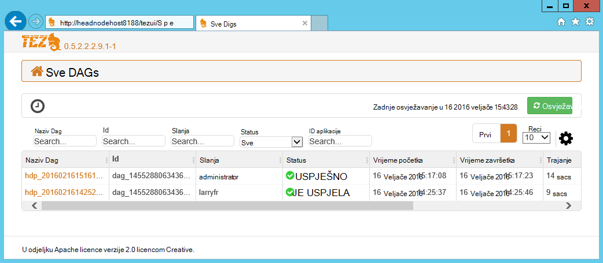

<properties
pageTitle="Korištenje Tez korisničko Sučelje s HDInsight utemeljen na sustavu Windows | Azure"
description="Saznajte kako koristiti korisničko Sučelje Tez za ispravljanje pogrešaka Tez poslove na utemeljen na sustavu Windows HDInsight HDInsight."
services="hdinsight"
documentationCenter=""
authors="Blackmist"
manager="jhubbard"
editor="cgronlun"/>

<tags
ms.service="hdinsight"
ms.devlang="na"
ms.topic="article"
ms.tgt_pltfrm="na"
ms.workload="big-data"
ms.date="10/04/2016"
ms.author="larryfr"/>

# Korištenje Tez korisničko Sučelje za ispravljanje pogrešaka Tez poslove na HDInsight utemeljen na sustavu Windows

Korisničko Sučelje Tez je web-stranice koje je moguće koristiti za razumijevanje i zadacima koje koriste Tez kao modul izvođenja na klastere HDInsight utemeljen na sustavu Windows za ispravljanje pogrešaka. Korisničko Sučelje Tez omogućuje vizualizacija posla kao grafikon povezanih stavki, dubinski analizirati svake stavke i dohvaćanje Statistika i Zapisnički podaci za.

> [AZURE.NOTE] Informacije u ovom dokumentu je za klastere HDInsight utemeljen na sustavu Windows. Informacije na pregled i ispravljanje pogrešaka Tez na sustavom Linux HDInsight potražite u članku [Korištenje Ambari prikaza za ispravljanje pogrešaka Tez poslove na HDInsight](hdinsight-debug-ambari-tez-view.md).

## Preduvjeti

* Klaster HDInsight utemeljen na sustavu Windows. Upute o stvaranju nove klaster potražite u članku [Prvi koraci pri korištenju HDInsight utemeljen na sustavu Windows](hdinsight-hadoop-tutorial-get-started-windows.md).

    > [AZURE.IMPORTANT] Korisničko Sučelje Tez dostupan je samo na klastere utemeljen na sustavu Windows HDInsight stvorene nakon veljača 8, 2016.

* Klijent utemeljen na sustavu Windows udaljene radne površine.

## Razumijevanje Tez

Tez je extensible framework za obradu podataka u Hadoop koja omogućuje brzine veći od tradicionalni obrada MapReduce. Za klastere utemeljen na sustavu Windows HDInsight je neobavezno modul koji možete omogućiti za grozd pomoću sljedeće naredbe kao dio grozd upit:

    set hive.execution.engine=tez;

Radni je poslan na Tez, stvara na usmjereni Acyclic grafikon (DAG) koji opisuje redoslijed izvršavanja od akcija potrebnih posao. Pojedinačne akcije nazivaju vrhovi i izvršavanje dio ukupnog posao. Stvarni izvođenja rada opisan vrha naziva zadatka, a možda raspodijeliti više čvorovi u klasteru.

### Objašnjenje Tez korisničkog Sučelja

Korisničko Sučelje Tez je web-stranica sadrži informacije o postupaka koji se izvode ili ste već pokrenuli pomoću Tez. Omogućuje prikaz DAG generira Tez, mjerača kako distribuirati preko klastere, kao što su memorije koristi za zadatke i vrhovi i informacije o pogrešci. Može ponuditi korisne informacije u sljedećim scenarijima:

* Nadzor dugoročnih procesa, Prikaz tijeka karte web-mjesta i smanjivanje zadatke.

* Analiza povijesne podataka da biste saznali kako se mogu poboljšati obrada ili Zašto nije uspjelo ili nije uspjelo procesa.

## Generiranje na DAG

Korisničko Sučelje Tez samo sadrže podatke ako zadatak koji koristi modul Tez je u tijeku ili je pokrenuta u prošlosti. Jednostavne upite grozd može obično riješi bez korištenja Tez, no složenije upite koji rade filtriranja, grupiranje, redoslijed, spojevi i itd obično zahtijevaju Tez.

Poduzmite sljedeće korake da biste pokrenuli upit grozd koje ćete izvršiti pomoću Tez.

1. U web-pregledniku otvorite https://CLUSTERNAME.azurehdinsight.net, pri čemu je __CLUSTERNAME__ svoj klaster HDInsight.

2. Na izborniku pri vrhu stranice odaberite __Vrste Hive uređivač__. Time će se prikazati na stranicu s sljedeći ogledni upit.

        Select * from hivesampletable

    Brisanje upita primjer i zamijeniti ga sljedeće.

        set hive.execution.engine=tez;
        select market, state, country from hivesampletable where deviceplatform='Android' group by market, country, state;

3. Odaberite gumb __Pošalji__ . U odjeljku __Sesiju posao__ pri dnu stranice prikazat će se stanje upita. Kada se status promijeni u __Dovršeno__, odaberite __Prikaz detalja o__ veze za prikaz rezultata. __Izlaz posao__ mora biti sličnu ovoj:
        
        en-GB   Hessen      Germany
        en-GB   Kingston    Jamaica
        en-GB   Nairobi Area    Kenya

## Korištenje Tez korisničkog Sučelja

> [AZURE.NOTE] Korisničko Sučelje Tez dostupna samo na radnoj površini čvorove glavni klaster da morate koristiti udaljene radne površine povezati glavni čvorove.

1. [Portal za Azure](https://portal.azure.com)odaberite svoj klaster HDInsight. Vrh plohu HDInsight, odaberite ikonu __Udaljene radne površine__ . Time će se prikazati udaljene radne površine plohu

    

2. Odaberite __Poveži__ s čvor glavni klaster plohu udaljene radne površine. Kada se to od vas zatraži, koristiti klaster udaljene radne površine korisničko ime i lozinku za provjeru autentičnosti vezu.

    

    > [AZURE.NOTE] Ako niste omogućili povezivanje udaljene radne površine, navedite korisničko ime, lozinku i datum isteka, a zatim odaberite __Omogući__ da biste omogućili udaljene radne površine. Kada je omogućena, koristite prethodne korake za povezivanje.

3. Nakon uspostave otvorite Internet Explorer na udaljene radne površine, odaberite ikonu zupčanika u gornjem desnom kutu preglednika i odaberite __Postavke prikaza za kompatibilnost__.

4. Od dna __Postavke kompatibilnosti prikaza__, poništite potvrdni okvir za __Prikaz intranetska mjesta u prikazu kompatibilnosti__ i __popise koristi Microsoft compatibility__, a zatim odaberite __Zatvori__.

5. U pregledniku Internet Explorer dođite tezui/http://headnodehost:8188 / #/. Time će se prikazati Tez korisničkog Sučelja

    

    Kada se korisničko Sučelje Tez učita, vidjet ćete popis DAGs koje su trenutno pokrenuti ili su pokrenuli na klaster. Zadani prikaz sadrži Dag naziv, Id, slanja, stanje, vrijeme početka, vrijeme završetka, trajanje, ID aplikacije i red. Više stupaca možete dodati pomoću ikone zupčanika u desnom kutu stranice.

    Ako imate samo jednu stavku, bit će za upit koji ste pokrenuli u prethodnom odjeljku. Ako imate više stavki, možete pretraživati unosom kriterija za pretraživanje u poljima iznad u DAGs, a zatim pritisnite __Enter__.

4. Odaberite __Naziv Dag__ najnovijeg unosa DAG. Time će se prikazati informacije o na DAG, kao i mogućnost da biste preuzeli zip JSON datoteka koje sadrže podatke o na DAG.

    

5. Iznad __Pojedinosti DAG__ su nekoliko veza koje je moguće koristiti za prikaz informacija o na DAG.

    * __DAG mjerača__ prikazuje mjerača podatke za ovu DAG.
    
    * __Grafički prikaz__ prikazuje grafički prikaz u ovom DAG.
    
    * __Sve vrhovi__ prikazuje popis na vrhovi u ovom DAG.
    
    * __Svi se zadaci__ prikazuje popis zadataka za sve vrhovi u ovom DAG.
    
    * __Sve TaskAttempts__ prikazuje informacije o pokušava pokretanje zadataka za ovaj DAG.
    
    > [AZURE.NOTE] Ako pomičete prikaz stupca za vrhovi, zadaci i TaskAttempts, imajte na umu da postoje veze za prikaz __brojača__ i __Prikaz ili preuzimanje zapisnika__ za svaki redak.

    Ako pojavila se pogreška s posla, pojedinosti DAG prikazat će se status nije uspjelo, te veze na informacije o zadatku nije uspjelo. Informacije za dijagnostiku će se prikazati ispod DAG detalje.

7. Odabir __grafičkog prikaza__. Prikazat će se grafički prikaz u DAG. Možete postaviti miša preko svake vrh u prikazu za prikaz informacija o njemu.

    

8. Klikom na vrh učitavaju se __Vrh detalja__ za tu stavku. Kliknite na vrh __1 karte__ da biste prikazali detalje o za tu stavku. Odaberite __Potvrdi__ da biste potvrdili navigacije.

    

9. Imajte na umu sada sadrži veze pri vrhu stranice koji se odnose na vrhovi i zadatke.

    > [AZURE.NOTE] Možete i dođete na ovu stranicu tako da odete __DAG detalje__, odaberete __Vrh detalje__, a zatim odaberite vrh __karte 1__ .

    * __Vrh mjerača__ prikazuje brojač podatke za ovu vrh.
    
    * __Zadaci__ prikazat će se zadaci za ovaj vrh.
    
    * __Zadatak pokušava__ prikazuje informacije o pokušaje izvršavanja zadataka za ovaj vrh.
    
    * __Izvori & primatelji__ prikazuje izvore podataka i primatelja za ovu vrh.

    > [AZURE.NOTE] Kao prethodni izbornik, možete se pomicati prikaz stupca za zadatke, prilikom pokušaja zadatka, izvora i Sinks__ da biste prikazali veze na dodatne informacije za svaku stavku.

10. Odaberite __Zadaci__, a zatim odaberite stavku pod nazivom __00_000000__. To će prikazati __Detalje o zadatku__ za taj zadatak. U ovaj zaslon možete vidjeti __Mjerača zadataka__ i __Zadataka pokušaja__.

    

## Daljnji koraci

Sad kad ste naučili kako koristiti prikaz Tez, Saznajte više o [Korištenju vrste Hive HDInsight](hdinsight-use-hive.md).

Detaljnije tehničke informacije o Tez, potražite u članku [Tez stranicu na Hortonworks](http://hortonworks.com/hadoop/tez/).
