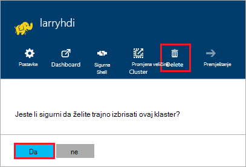

<properties
pageTitle="Kako izbrisati programa HDInsight klaster | Azure"
description="Informacije na različite načine na koje možete izbrisati programa klaster HDInsight."
services="hdinsight"
documentationCenter=""
authors="Blackmist"
manager="jhubbard"
editor="cgronlun"/>

<tags
ms.service="hdinsight"
ms.devlang="na"
ms.topic="article"
ms.tgt_pltfrm="na"
ms.workload="big-data"
ms.date="10/28/2016"
ms.author="larryfr"/>

#Kako izbrisati programa HDInsight klaster

HDInsight klaster naplata pokreće kad Klaster se stvara i prestaje kada Klaster se briše i je raspodijeliti u minuti, tako da je potrebno uvijek izbrisati svoj klaster kada se više ne koristi. U ovom dokumentu ćete naučiti da biste izbrisali klaster pomoću portala za Azure, Azure PowerShell i EŽA Azure.

> [AZURE.IMPORTANT] Brisanje programa HDInsight klaster izbrišite račune za pohranu Azure pridružene klaster. Time da biste sačuvali i ponovno korištenje podatke pohraniti klaster.

##Portal za Azure

1. Prijavite se na [portal za Azure](https://portal.azure.com) i odaberite svoj klaster HDInsight. Ako svoj klaster HDInsight nije prikvačena na nadzornu ploču, možete pretraživati za nju prema nazivu pomoću polje za pretraživanje (ikona povećalo), na desnoj strani navigacijske trake.

    

2. Kada u plohu Otvori za klaster, odaberite ikonu za __Brisanje__ . Kada se to od vas zatraži, odaberite __da__ da biste izbrisali klaster.

    

##Azure PowerShell

U odzivniku komponente PowerShell sustava da biste izbrisali klaster koristite sljedeću naredbu:

    Remove-AzureRmHDInsightCluster -ClusterName CLUSTERNAME

Zamijenite __CLUSTERNAME__ naziv svoj klaster HDInsight.

##Azure EŽA

Iz upita, koristite sljedeće da biste izbrisali skupine:

    azure hdinsight cluster delete CLUSTERNAME
    
Zamijenite __CLUSTERNAME__ naziv svoj klaster HDInsight.
