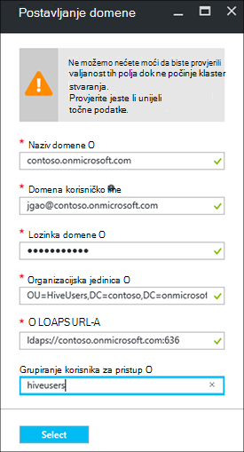

<properties
    pageTitle="Konfiguriranje domena pridruženo HDInsight klastere | Microsoft Azure"
    description="Saznajte kako postaviti i konfigurirati klastere domene pridruženo HDInsight"
    services="hdinsight"
    documentationCenter=""
    authors="saurinsh"
    manager="jhubbard"
    editor="cgronlun"
    tags=""/>

<tags
    ms.service="hdinsight"
    ms.devlang="na"
    ms.topic="article"
    ms.tgt_pltfrm="na"
    ms.workload="big-data"
    ms.date="10/26/2016"
    ms.author="saurinsh"/>

# Konfiguriranje domena pridruženo HDInsight klastere (pretpregled)

Saznajte kako postaviti programa Azure HDInsight klaster s Azure Active Directory (Azure AD) i [Apache Ranger](http://hortonworks.com/apache/ranger/) da iskoristite prednost Jaka provjera autentičnosti i obogaćeni pristupa na temelju uloga pravilnici kontrole (RBAC).  Domene pridruženo HDInsight može se konfigurirati na klastere sustavom Linux. Dodatne informacije potražite u članku [klastere predstavljanje domene pridruženo HDInsight](hdinsight-domain-joined-introduction.md).

Ovaj je članak vodič za prvi u nizu:

- Stvorite programa HDInsight klaster povezan s Azure AD (putem mogućnost Azure Directory Domain Services) s Ranger Apache omogućena.
- Stvaranje i Primjena pravilnika o grozd kroz Apache Ranger i korisnicima (na primjer, podataka fizičari) da biste se povezali grozd alatima za ODBC-poštu, na primjer, Excel, Tableau itd. Microsoft surađuje o dodavanju drugih radnih opterećenja, kao što su HBase, Spark i oluja, za domenu pridruženo HDInsight uskoro.

Primjer konačni topologije izgleda na sljedeći način:

Budući da Azure AD trenutno podržava samo klasični virtualne mreže (VNets) i sustavom Linux HDInsight klaster samo podršku Voditelj resursa Azure temelji VNets, HDInsight Azure AD za integraciju potrebna dva VNets i peering između njih. Informacije za usporedbu između dva implementacije modela potražite u članku [Voditelj resursa Azure nasuprot uvođenje klasičnog: razumjeti implementacije modela i stanje resursa](../resource-manager-deployment-model.md). Dva VNets mora biti u istom području kao Azure AD DS.

Nazivi servisa Azure mora biti globalno jedinstveni. Sljedeća imena koriste ovog praktičnog vodiča. Contoso je izmišljeni naziv. Kada dođete do vodič morate zamijeniti *contoso* pod drugim nazivom. 
    
**Nazivi:**

|Svojstvo|Vrijednost|
|--------|-----|
| Azure AD VNet|contosoaadvnet|
| Azure AD virtualnog računala (VM)|contosoaadadmin. U ovom VM služi za konfiguriranje Organizacijska jedinica i obrnuti DNS zone.|
| Azure AD direktorija|contosoaaddirectory|
| Naziv domene za Azure AD|Contoso (contoso.onmicrosoft.com)|
| HDInsight VNet|contosohdivnet|
| Grupa resursa HDInsight VNet|contosohdirg|
| HDInsight klaster|contosohdicluster|

Pomoću ovog praktičnog vodiča sadrži korake za konfiguriranje HDInsight klaster domene pridružili. Svaki odjeljak sadrži veze na druge članke s dodatnim informacijama za pozadinu.

## Preduvjeta:

- Upoznajte se s [Azure servisa Active Directory Domain Services](https://azure.microsoft.com/services/active-directory-ds/) njenu strukturu [cijene](https://azure.microsoft.com/pricing/details/active-directory-ds/) .
- Provjerite je li vaša pretplata whitelisted za taj javno pretpregled. To možete učiniti tako da pošaljete poruku e-pošte da biste hdipreview@microsoft.com koristeći ID pretplate.
- SSL certifikat koji je potpisao za izdavanje certifikata za potpisivanje za svoju domenu. Certifikat potreban je konfiguriranjem sigurne LDAP. Nije moguće koristiti samopotpisane potvrde.

## Postupci

1. Stvaranje Azure klasični VNet za Azure AD.  
2. Stvaranje i konfiguriranje Azure AD i Azure AD DS.
3. Dodajte na VM klasični VNet za stvaranje Organizacijska jedinica. 
4. Stvaranje Organizacijska jedinica za Azure AD DS.
5. Stvaranje programa HDInsight VNet u načinu rada za upravljanje Azure resursa.
6. Postavljanje obrnuti DNS zone za Azure AD DS.
6. Ravnopravni dva VNets.
7. Stvaranje programa klaster HDInsight.

> [AZURE.NOTE] Pomoću ovog praktičnog vodiča pretpostavlja da ste Azure AD. Ako nemate, možete preskočiti dijelu u koraku 2.
    
## Stvaranje Azure klasični VNet

U ovom ćete odjeljku stvoriti klasični VNet pomoću portala za Azure. U sljedećem odjeljku Omogućivanje Azure AD DS za vaše Azure AD u klasični VNet. Dodatne informacije o sljedeći postupak i neki drugi način stvaranja VNet potražite u članku [Stvaranje virtualne mreže (klasični) pomoću portala za Azure](../virtual-network/virtual-networks-create-vnet-classic-portal.md).

**Da biste stvorili klasični VNet**

1. Prijavite se [portal za Azure](https://portal.azure.com). 
2. Kliknite **Novi** > **umrežavanje** > **virtualne mreže**.
3. U **Odaberite model implementacije**, odaberite **Klasični**pa zatim kliknite **Stvori**.
4. Unesite ili odaberite sljedeće vrijednosti:

    - **Naziv**: contosoaadvnet
    - **Prostor adrese**: 10.1.0.0/16
    - **Naziv podmreže**: Subnet1
    - **Raspon adresu podmreže**: 10.1.0.0/24
    - **Pretplate**: (odaberite pretplatu koristiti za stvaranje ovaj VNet.)
    - **ResourceGroup**:
    - **Lokacija**: (odaberite područje za svoj klaster HDInsight.)

        > [AZURE.IMPORTANT] Morate odabrati mjesto koje podržava Azure AD DS. Dodatne informacije potražite u članku [proizvode dostupne po regijama](https://azure.microsoft.com/en-us/regions/services/). 
        >
        > U području isti kao Azure AD DS mora biti klasični VNet i VNet grupu resursa.

5. Kliknite **Stvori** da biste stvorili na VNet.

## Stvaranje i konfiguriranje Azure AD DS za Azure AD

U ovom odjeljku ćete:

1. Stvaranje Azure AD.
2. Stvaranje Azure AD korisnika. Ti korisnici su korisnici domene. Korištenje prvog korisnika za konfiguriranje klaster HDInsight s Azure AD.  Drugi korisnici dva obavezno za ovog praktičnog vodiča. Oni će se koristiti za [Konfiguriranje vrste Hive pravila za klastere domene pridruženo HDInsight](hdinsight-domain-joined-run-hive.md) prilikom konfiguriranja Apache Ranger pravila.
3. Stvaranje grupe administratora Kontroler AAD i Azure AD korisnika dodao u grupu. Pomoću ovog korisnika da biste stvorili Organizacijska jedinica.
4. Omogućivanje Azure servisa Active Directory Domain Services (Azure AD DS) za Azure AD.
7. Konfiguriranje LDAPS za Azure AD. Lightweight Directory Access Protocol (LDAP) koristi se za čitanja i pisanja Azure AD.

Ako biste radije da biste koristili postojeći Azure AD, možete preskočiti korake 1 i 2.

**Da biste stvorili Azure AD**

1. S [portala za Azure klasični](https://manage.windowsazure.com), kliknite **Novo** > **Aplikacije servisa** > **Servisa Active Directory** > **direktorija** > **Stvoriti prilagođene**. 
3. Unesite ili odaberite sljedeće vrijednosti:

    - **Naziv**: contosoaaddirectory
    - **Naziv domene**: contoso.  Taj naziv mora biti globalno jedinstveni.
    - **Država ili regija**: Odaberite državu ili regiju.
4. Kliknite **dovrši**.

**Stvaranje Azure AD korisnik**

1. [Azure klasični portal](https://manage.windowsazure.com)kliknite **Servisa Active Directory** -> **contosoaaddirectory**. 
3. Kliknite **korisnici** iz gornji izbornik.
4. Kliknite **Dodaj korisnika**.
4. Unesite **Korisničko ime**, a zatim kliknite **Dalje**. 
5. Konfiguriranje korisničkog profila; U **ulogu**, odaberite **Globalni administrator**; a zatim kliknite **Dalje**.  Da biste stvorili Organizacijska jedinica potreban je uloga globalnog administratora.
6. Kliknite **Stvori** da biste dobili privremenu lozinku.
7. Napravite njezinu kopiju lozinku, a zatim kliknite **dovrši**. U nastavku ovog praktičnog vodiča će koristiti taj korisnik globalni administrator da biste se prijavili administratore VM za stvaranje Organizacijska jedinica i konfiguriranje obrnutim DNS-a.

Slijedite isti postupak da biste stvorili dva više korisnika na ulozi **korisnika** , hiveuser1 i hiveuser2. Sljedeći korisnici će se koristiti za [Konfiguriranje vrste Hive pravila za klastere domene pridruženo HDInsight](hdinsight-domain-joined-run-hive.md).

**Kako stvoriti grupe u AAD Kontroler administratora i dodati Azure AD korisnik**

1. [Azure klasični portal](https://manage.windowsazure.com)kliknite **Servisa Active Directory** > **contosoaaddirectory**. 
3. Na gornjoj izborniku kliknite **grupe** .
4. Kliknite **Dodaj grupu** ili **Dodaj grupu**.
5. Unesite ili odaberite sljedeće vrijednosti:

    - **Naziv**: AAD Kontroler administratori.  Nemojte mijenjati naziv grupe.
    - **Vrsta grupe**: sigurnost.
6. Kliknite **dovrši**.
7. Kliknite **Administratori Kontroler AAD** da biste otvorili grupu.
8. Kliknite **Dodaj članove**.
9. Odaberite prvu korisnika koji ste stvorili u prethodnom koraku, a zatim **Dovršeno**.
10. Ponovite iste korake da biste stvorili drugu grupu naziva **HiveUsers**pa dodajte dva grozd korisnika u grupu.

Dodatne informacije potražite u članku [Azure servisa Active Directory Domain Services (pretpregled) – Stvaranje grupe "AAD Kontroler administratori"](../active-directory-domain-services/active-directory-ds-getting-started.md).

**Da biste omogućili Azure AD DS za Azure AD**

1. [Azure klasični portal](https://manage.windowsazure.com)kliknite **Servisa Active Directory** > **contosoaaddirectory**. 
3. Na gornjoj izborniku kliknite **Konfiguriraj** .
4. Pomaknite se do odjeljka **Domain Services**i postaviti na sljedeće vrijednosti:

    - **Omogućivanje domenske servise za taj imenik**: da.
    - **DNS naziva domene domenske servise**: prikazuje zadani naziv DNS Azure direktorija. Na primjer, contoso.onmicrosoft.com.
    - **Povezivanje domenske servise ovaj virtualni mrežu**: Odaberite klasični virtualne mreže koju ste ranije stvorili, odnosno **contosoaadvnet**.
    
6. Kliknite **Spremi** na dno stranice. Prikazat će se **na čekanju...** uz stavku **Omogući domenske servise za taj imenik**.  
7. Pričekajte dok se ne **na čekanju...** nestane, i dobiti ispunjavaju **IP adresa** . Dva IP adrese će se unose. To su IP adrese kontrolera domene dodjeli po domenske servise. Svaka IP adresa bit će vidljivi nakon kontrolerom domene odgovarajuće spreman i dodjela resursa. Zapišite dva IP adrese. Morate ih kasnije.

Dodatne informacije potražite u članku [Azure AD Domain Services (pretpregled) – Omogućivanje domenske Azure AD servise](../active-directory-domain-services/active-directory-ds-getting-started-enableaadds.md).

**Da biste sinkronizirali lozinke**

Ako koristite vlastitu domenu, morate sinkronizirati lozinku. U odjeljku [Omogući sinkronizaciju lozinke za Azure AD domenske servise za samo oblak Azure AD direktorija](../active-directory-domain-services/active-directory-ds-getting-started-password-sync.md).

**Da biste konfigurirali LDAPS za Azure AD**

1. Nabavite SSL certifikat koji je potpisao za izdavanje certifikata za potpisivanje za svoju domenu. Nije moguće koristiti samopotpisane potvrde. Ako se ne pojavi SSL certifikata, provjerite stupili u hdipreview@microsoft.com za iznimku.
1. [Azure klasični portal](https://manage.windowsazure.com)kliknite **Servisa Active Directory** > **contosoaaddirectory**. 
3. Na gornjoj izborniku kliknite **Konfiguriraj** .
4. Pomaknite se do **domenske servise**.
5. Kliknite **Konfiguriraj certifikat**.
6. Slijedite upute da biste odredili datoteka certifikata i lozinku. Prikazat će se **na čekanju...** uz stavku **Omogući domenske servise za taj imenik**.  
7. Pričekajte dok se ne **na čekanju...** nestane, i imate ispunjavaju **Sigurne LDAP certifikata** .  To može potrajati gore 10 minuta ili više njih.
 
>[AZURE.NOTE] Ako su neke zadatke u pozadini pokrenut na Azure AD DS, može se pojaviti pogreška tijekom prijenosa certifikat – <i>došlo je postupak koji se izvodi za tog klijenta. Pokušajte ponovno kasnije</i>.  U slučaju da se pojave tu pogrešku, pokušajte se ponovno nakon određenog vremena. Drugi IP kontroler domene može proći do 3 sata dodjeljivanje resursa.

Dodatne informacije potražite u članku [Konfiguriranje sigurne LDAP (LDAPS) za domenu Azure AD domenske servise koji se upravlja](../active-directory-domain-services/active-directory-ds-admin-guide-configure-secure-ldap.md).

## Konfiguriranje Organizacijska jedinica i obrnuti DNS-a

U ovom se odjeljku Dodavanje virtualnog računala VNet za Azure AD, i instalirajte Administrativni alati na ovom VM da biste mogli konfigurirati Organizacijska jedinica i obrnuti DNS-a. Obrnuto DNS pretraživanje je potreban za provjeru autentičnosti Kerberos.

**Da biste stvorili virtualnog računala u virtualne mreže**

1. S [portala za Azure klasični](https://manage.windowsazure.com), kliknite **Novo** > **izračunati** > **virtualnog računala** > **Iz galerije**.
3. Odaberite sliku, a zatim kliknite **Dalje**.  Ako ne znate koji će se koristiti, odaberite po zadanom, **Windows Server 2012 R2 podatkovnog centra**.
4. Unesite ili odaberite sljedeće vrijednosti:

    - Naziv virtualnog računala: **contosoaadadmin**
    - Razina: **Osnovni**
    - Novo korisničko ime: (Unesite korisničko ime)
    - Lozinka: (Unesite lozinku)
    
    Imajte na umu korisničko ime i lozinka je lokalni administrator.
    
5. Kliknite **Dalje**
6. U **Regiji/virtualne mreže**odaberite novi virtualne mreže koju ste stvorili u posljednjem koraku (contosoaadvnet), a zatim kliknite **Dalje**.
7. Kliknite **dovrši**.

**Da biste RDP da biste na VM**

1. [Azure klasični portal](https://manage.windowsazure.com)kliknite **virtualnim strojevima** > **contosoaadadmin**.
3. Na gornjoj izborniku kliknite **nadzorna ploča** .
4. Kliknite **Poveži se** s dna stranice.
5. Pratite upute i razmjenjujte lokalnog administratorskog korisničkog imena i lozinke.

**Da biste se pridružili VM domenu Azure AD**

1. Iz sesije RDP kliknite **Start**, a zatim **Upravitelj poslužitelja**.
2. Na lijevom izborniku kliknite **Lokalni poslužitelj** .
3. Radna grupa, kliknite **radna grupa**.
4. Kliknite **Promijeni**.
5. Kliknite **domene**, unesite **contoso.onmicrosoft.com**i zatim kliknite **u redu**.
6. Unesite korisničke vjerodajnice za domenu, a zatim kliknite **u redu**.
7. Kliknite **u redu**.
8. Kliknite **u redu** da biste pristajete da ponovno pokrenuti računalo.
9. Kliknite **Zatvori**.
10. Kliknite **sad**.

Dodatne informacije potražite u članku [Uključivanje virtualnog računala za Windows Server upravljanih domenu](../active-directory-domain-services/active-directory-ds-admin-guide-join-windows-vm.md).

**Da biste instalirali alate za administraciju servisa Active Directory i alate za DNS-a**

1. RDP u **contosoaadadmin** putem Azure AD korisničkog računa.
2. Kliknite **Start**, a zatim kliknite **Upravitelj poslužitelja**.
3. Kliknite **nadzorna ploča** na lijevom izborniku.
4. Kliknite **Upravljanje**, a zatim kliknite **Dodaj uloga i značajki**.
5. Kliknite **Dalje**.
6. Odaberite **ulogu ili značajku instalaciju**, a zatim kliknite **Dalje**.
7. Odaberite trenutnu virtualnog računala na resurse poslužitelja pa kliknite **Dalje**.
8. Kliknite **Dalje** da biste preskočili uloge.
9. Proširite **Alati za administraciju Remote Server**, proširite **Alati za administraciju uloge**, odaberite ** **Alati AD polja i AD DS** DNS poslužitelja Alati**i, a zatim **sljedeće**. 
10. Kliknite **Dalje**
10. Kliknite **Instaliraj**.

Dodatne informacije potražite u članku [Instaliranje servisa Active Directory Alati za administraciju na virtualnog računala](../active-directory-domain-services/active-directory-ds-admin-guide-administer-domain.md#task-2---install-active-directory-administration-tools-on-the-virtual-machine).

**Da biste konfigurirali obrnutim DNS-a**

1. RDP da biste contosoaadadmin putem Azure AD korisničkog računa.
2. Kliknite **Start**, kliknite **Stavku Administrativni alati**, a zatim **DNS-a**. 
3. Kliknite **ne** da biste preskočili dodavanjem ContosoAADAdmin.
4. Odaberite **sljedeće računalo**, upišite IP adresu prvi DNS poslužitelja ste prethodno konfigurirali i zatim kliknite **u redu**.  Prikazat će Kontroler/DNS dodaje se u lijevom oknu.
3. Proširite Kontroler/DNS poslužitelj, desnom tipkom miša kliknite **Obrnuti zone za pretraživanje**, a zatim kliknite **Nova Zone**. Otvorit će se čarobnjak za novo Zone.
4. Kliknite **Dalje**.
5. Odaberite **primarni zonu**, a zatim kliknite **Dalje**.
6. Odaberite **sve DNS poslužitelje na kontrolera tu domenu**, a zatim kliknite **Dalje**.
6. Zoni **IPv4 obrnuti pretraživanja**, a zatim kliknite **Dalje**.
7. U **ID mrežnog**unesite prefiks u rasponu HDInsight VNET mreže i zatim kliknite **Dalje**. U sljedećem odjeljku će stvoriti HDInsight VNet.
8. Kliknite **Dalje**.
9. Kliknite **Dalje**.
10. Kliknite **Završi**.

Organizacijska jedinica stvorite sljedeća će se koristiti pri stvaranju klaster HDInsight. Hadoop korisnika sustava i računi računala će biti smješten u ovom OU.

**Stvaranje je Organizacijska jedinica (Organizacijska Jedinica) na domeni upravljanih programa Azure servisa Active Directory Domain Services**

1. RDP u **contosoaadadmin** pomoću računa za domenu koja je u grupi **Administratora Kontroler AAD** .
2. Kliknite **Start**, kliknite **Stavku Administrativni alati**, a zatim **Centar za Administrativni imenika Active**.
5. Kliknite naziv domene u lijevom oknu. Na primjer, contoso.
6. Kliknite **Novo** u odjeljku naziv domene u oknu **zadatka** , a zatim kliknite **Organizacijsku jedinicu**.
7. Unesite naziv, primjerice **HDInsightOU**, a zatim kliknite **u redu**. 

Dodatne informacije potražite u članku [Stvaranje je Organizacijska jedinica (Organizacijska Jedinica) na programa Azure AD domene upravlja domenskih servisa](../active-directory-domain-services/active-directory-ds-admin-guide-create-ou.md).

## Stvaranje VNet resursima za HDInsight klaster

U ovom ćete odjeljku stvarate VNet resursima za Azure koja će se koristiti za klaster HDInsight. Dodatne informacije o stvaranju VNET Azure pomoću druge načine potražite u članku [Stvaranje virtualne mreže](../virtual-network/virtual-networks-create-vnet-arm-pportal.md)

Nakon stvaranja u VNet će konfigurirati VNet resursima za korištenje DNS poslužitelji isti kao VNet za Azure AD. Ako ste pratili korake ovog praktičnog vodiča da biste stvorili klasični VNet i Azure AD, DNS poslužitelji su 10.1.0.4 i 10.1.0.5.

**Da biste stvorili resursima VNet**

1. Prijavite se [portal za Azure](https://portal.azure.com).
2. Kliknite **Novo**, **Povezivanje s mrežom**, a zatim **virtualne mreže**. 
3. U **Odaberite model implementacije**, odaberite **Upravitelj resursa**pa kliknite **Stvori**.
4. Upišite ili odaberite sljedeće vrijednosti:

    - **Naziv**: contosohdivnet
    - **Prostor adrese**: 10.2.0.0/16. Provjerite je li raspon adresu ne preklapa s rasponu IP adresa klasični VNet.
    - **Naziv podmreže**: Subnet1
    - **Raspon adresu podmreže**: 10.2.0.0/24
    - **Pretplate**: (Odabir pretplate za Azure).
    - **Grupa resursa**: contosohdirg
    - **Lokacija**: (odaberite na isto mjesto kao Azure AD VNet, odnosno contosoaadvnet.)

5. Kliknite **Stvori**.

**Konfiguriranje DNS-a za VNet Voditelj resursa**

1. S [portala za Azure](https://portal.azure.com), kliknite **više usluge** -> **virtualne mreže**. Provjerite je li da se ne kliknite **virtualne mreže (klasični)**.
2. Kliknite **contosohdivnet**.
4. Kliknite **DNS poslužitelji** s lijeve strane novi plohu.
6. Kliknite **Prilagođeno**, a zatim unesite sljedeće vrijednosti:

    - 10.1.0.4
    - 10.1.0.5

    Ove IP adrese DNS poslužitelja mora se podudarati DNS poslužitelji u AD VNet Azure (klasični VNet).
7. Kliknite **Spremi**.

## Ravnopravni Azure AD VNet i HDInsight VNet

**Da biste ravnopravni dva VNet**

1. Prijavite se [portal za Azure](https://portal.azure.com).
2. Kliknite **Dodatne usluge** na lijevom izborniku.
3. Kliknite **virtualne mreže**. Nemojte kliknuti **virtualne mreža (klasični)**.
4. Kliknite **contosohdivnet**.  Ovo je HDInsight VNet.
5. Na lijevom izborniku u plohu kliknite **Peerings** .
6. Na gornjoj izborniku kliknite **Dodaj** . Otvara se plohu **Dodavanje peering** .
7. Na plohu **Dodavanje peering** postavljanje ili odaberite sljedeće vrijednosti:

    - **Naziv**: ContosoAADHDIVNetPeering
    - **Model za uvođenje virtualne mreže**: klasični
    - **Pretplate**: odaberite naziv pretplate za vnet klasični (Azure AD).
    - **Virtualna mreže**: contosoaadvnet.
    - **Dopusti pristup virtualne mreže**: (Provjera)
    - **Dopusti prosljeđuju promet**: (Provjera). Ostavite poništen druge dvije potvrdne okvire.

8. Kliknite **u redu**.

## Stvaranje HDInsight klaster

U ovom ćete odjeljku stvoriti klaster sustavom Linux Hadoop u HDInsight pomoću portala za Azure ili [predloška Azure Voditelj resursa](../resource-group-template-deploy.md). Drugi načini stvaranja klaster i razumijevanje postavke, potražite u članku [Stvaranje HDInsight klastere](hdinsight-hadoop-provision-linux-clusters.md). Dodatne informacije o korištenju upravitelja resursa predloška za stvaranje klastere Hadoop u HDInsight potražite u članku [Stvaranje Hadoop klastere u HDInsight pomoću predložaka Voditelj resursa](hdinsight-hadoop-create-windows-clusters-arm-templates.md)

**Da biste stvorili pomoću portala za Azure HDInsight domene pridruženo klaster**

1. Prijavite se [portal za Azure](https://portal.azure.com).
2. Kliknite **Novo**, **Obavještavanje + analize**, a zatim **HDInsight**.
3. Iz plohu **klaster novi HDInsight** unesite ili odaberite sljedeće vrijednosti:

    - **Naziv klaster**: Unesite novi naziv klaster klaster domene pridruženo HDInsight.
    - **Pretplate**: Odaberite Azure pretplatu koji se koriste za stvaranje ovoj grupi.
    - **Konfiguriranje klaster**:

        - **Vrsta klaster**: Hadoop. Domene pridruženo HDInsight trenutno podržava Hadoop klaster.
        - **Operacijski sustav**: Linux.  Domene pridruženo HDInsight podržana samo za klastere sustavom Linux HDInsight.
        - **Verzija**: Hadoop 2.7.3 (HDI 3,5). Domene pridruženo HDInsight podržano je samo na HDInsight klaster verzije 3.5.
        - **Vrsta klaster**: PREMIUM

        Kliknite **Odaberite** da biste spremili promjene.

    - **Vjerodajnice**: Konfiguriranje vjerodajnica za klaster korisnika i SSH korisnika.
    - **Izvor podataka**: Stvaranje novog računa za pohranu ili pak iskoristite postojeći račun za pohranu kao zadani račun za pohranu za klaster HDInsight. Mjesto mora biti jednak dva VNets.  Mjesto je i mjesto klaster HDInsight.
    - **Određivanje cijena**: Odaberite broj radnih čvorove svoj klaster.
    - **Dodatna konfiguracija**: 

        - **Pridruživanje za domenu i Vnet/podmreže**: 

            - **Postavke domene**: 

                - **Naziv domene**: contoso.onmicrosoft.com
                - **Domena korisničko ime**: Unesite korisničko ime za domenu. Ovu domenu mora imati sljedeće ovlasti: uključivanje strojeva na domenu i potvrdite Organizacijska jedinica ste konfigurirali ranije; Stvaranje servisa upravitelji unutar Organizacijska jedinica ste konfigurirali ranije; Stvaranje obrnutim DNS stavke. Ovog korisnika domene će postati administrator ovu domenu pridruženo klaster HDInsight.
                - **Lozinka domene**: Unesite lozinku za korisnika domene.
                - **Organizacijska jedinica**: Unesite Razlikovni naziv parametra OU tht ste prethodno konfigurirali. Na primjer: OU = HDInsightOU, Kontroler = contoso, Kontroler = onmicrosoft, Kontroler = com
                - **LDAPS URL**: ldaps://contoso.onmicrosoft.com:636
                - **Grupiranje korisnika za pristup**: odredite sigurnost grupiranje čije korisnika u nastavku sinkronizaciju da biste klaster. Na primjer, HiveUsers.

                Kliknite **Odaberite** da biste spremili promjene.

                
            - **Virtualne mreže**: contosohdivnet
            - **Podmreže**: Subnet1

            Kliknite **Odaberite** da biste spremili promjene.       
        Kliknite **Odaberite** da biste spremili promjene.
    - **Grupa resursa**: odaberite grupu resursa koji se koriste za HDInsight VNet (contosohdirg).

4. Kliknite **Stvori**.  

Da biste koristili predložak Upravljanje resursima Azure je i mogućnost za stvaranje klaster domene pridruženo HDInsight. Sljedeći postupak pokazuje kako:

**Da biste stvorili domene pridruženo HDInsight klaster pomoću predloška za upravljanje resursima**

1. Kliknite na sljedećoj slici da biste otvorili upravitelj resursa predloška Azure portalu. Voditelj resursa predložak nalazi se u spremniku javno blob. 

    

2. Iz plohu **parametara** unesite sljedeće vrijednosti:

    - **Pretplate**: (Odabir pretplate za Azure).
    - **Grupa resursa**: kliknite **Koristi postojeću**, navedite u grupu resursa koji koristite.  Na primjer contosohdirg. 
    - **Lokacija**: Navedite mjesto grupu resursa.
    - **Naziv klaster**: Unesite naziv klaster Hadoop koje ćete stvoriti. Na primjer contosohdicluster.
    - **Klaster vrsta**: Odaberite vrstu klaster.  Zadana vrijednost je **hadoop**.
    - **Lokacija**: Odaberite mjesto za klaster.  Zadani račun za pohranu koristi na isto mjesto.
    - **Count klaster tempiranja čvor**: Odaberite broj čvorove tempiranja.
    - **Klaster korisničko ime i lozinku**: ime za prijavu zadani je **administrator**.
    - **SSH korisničko ime i lozinku**: korisničko ime zadani je **sshuser**.  Možete je preimenovati. 
    - **Id virtualne mreže**: /subscriptions/&lt;SubscriptionID > /resourceGroups/&lt;ResourceGroupName > /providers/Microsoft.Network/virtualNetworks/&lt;VNetName >
    - **Virtualna podmreže mreže**: /subscriptions/&lt;SubscriptionID > /resourceGroups/&lt;ResourceGroupName > /providers/Microsoft.Network/virtualNetworks/&lt;VNetName >/podmreže/Subnet1
    - **Naziv domene**: contoso.onmicrosoft.com
    - **Tvrtka ili ustanova jedinica DN**: OU = HDInsightOU, Kontroler = contoso, Kontroler = onmicrosoft, Kontroler = com
    - **Klaster korisnika grupi D Ns**: "\"CN = HiveUsers, OU = AADDC korisnika, Kontroler =<DomainName>, Kontroler = onmicrosoft, Kontroler = com\""
    - **LDAPUrls**: ["ldaps://contoso.onmicrosoft.com:636"]
    - **DomainAdminUserName**: (unesite korisničko ime administrator domene)
    - **DomainAdminPassword**: (unesite domenu administratorsku lozinku za korisnika)
    - **Se slažete uvjete i odredbe naveden iznad**: (Provjera)
    - **Prikvači na nadzornoj ploči**: (Provjera)

6. Kliknite **kupite**. Prikazat će se novi pločicu pod naslovom **implementacije uvođenje predloška**. Potrebno je oko oko 20 minuta da biste stvorili klaster. Nakon stvaranja klaster, možete kliknuti plohu klaster na portalu da biste ga otvorili.

Kada dovršite vodič, možda ćete morati izbrisati klaster. S HDInsight, vaši podaci se pohranjuju u Azure prostor za pohranu, da biste mogli sigurno izbrisati klaster kada se ne koristi. Također se naplatiti klaster programa HDInsight čak i ako se ne koristi. Budući da su naknade za klaster više puta veći od naknade za pohranu, je li bolje Ekonomske da biste izbrisali klastere kada se ne nalaze u upotrebi. Upute o brisanju klaster, potražite u članku [Upravljanje Hadoop klastere u HDInsight pomoću portala za Azure](hdinsight-administer-use-management-portal.md#delete-clusters).

## Daljnji koraci

- Konfiguriranje pravilnika grozd i pokretanje upita grozd, potražite u članku [Konfiguriranje vrste Hive pravila za klastere domene pridruženo HDInsight](hdinsight-domain-joined-run-hive.md).
- Izvodi grozd upita pomoću SSH na klastere domene pridruženo HDInsight potražite u članku [Korištenje SSH s operacijskim sustavom Linux Hadoop na HDInsight Linux, Unix, ili OS X](hdinsight-hadoop-linux-use-ssh-unix.md#connect-to-a-domain-joined-hdinsight-cluster).
