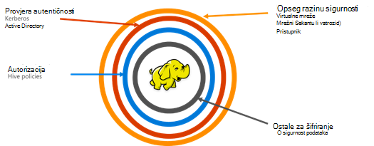

<properties
    pageTitle="Sigurne pregled HDInsight | Microsoft Azure"
    description="Saznajte..."
    services="hdinsight"
    documentationCenter=""
    authors="saurinsh"
    manager="jhubbard"
    editor="cgronlun"
    tags="azure-portal"/>

<tags
    ms.service="hdinsight"
    ms.devlang="na"
    ms.topic="hero-article"
    ms.tgt_pltfrm="na"
    ms.workload="big-data"
    ms.date="10/24/2016"
    ms.author="saurinsh"/>

# Predstavljanje domene pridruženo HDInsight klastere (pretpregled)

Azure HDInsight dok danas podržani samo u jednom korisniku lokalni administrator. Time ste radili great za manje timovima aplikacije ili odjela. Kao što je Hadoop temelji radnih opterećenja stekli više popularnosti u sektora enterprise, potrebe za enterprise ocjene mogućnosti kao servisa active directory na temelju provjeru autentičnosti, podrška za više korisnika i kontrola pristupa uloga temelji postala sve važne. Pomoću domene pridruženo HDInsight klastere, možete stvoriti programa HDInsight Klaster se pridružite se domene servisa Active Directory, konfigurirajte popis svih zaposlenika iz tvrtke koji možete provjeriti autentičnost kroz Azure Active Directory za prijavu na HDInsight klaster. Svima izvan tvrtke ne možete prijaviti ni pristupiti klaster HDInsight. Administrator tvrtke možete konfigurirati uloge koje se temelje kontrola pristupa za sigurnost grozd pomoću [Apache Ranger](http://hortonworks.com/apache/ranger/), stoga ograničavanje pristupa podacima samo kao potrebne. Na kraju, administrator može nadzor pristupa podacima zaposlenike i promjene gotovo pravilnici kontrole programa access, stoga postizanje veliku upravljanja svoje tvrtke resursa.

[AZURE.NOTE]> Nove značajke opisane u pretpregledu su dostupne samo na klastere sustavom Linux HDInsight za radno opterećenje grozd. Na drugim radnih opterećenja, kao što su HBase, Spark, oluja i Kafka, će biti omogućen u buduća izdanja. 

## Prednosti

Sigurnost Enterprise sadrži četiri veliki stupovima – sigurnost opseg, provjere autentičnosti, autorizacije i šifriranje.

.

### Opseg sigurnosti

Opseg sigurnost u HDInsight je postići pomoću virtualne mreže i servis za pristupnik. Danas, administrator tvrtke možete stvoriti na HDInsight klaster unutar virtualne mreže i koristite mrežni sigurnosnih grupa (pravila za dolazne i odlazne vatrozida) da biste ograničili access virtualne mreže. Samo IP adrese definirano u pravila vatrozida za unutarnje moći možete komunicirati s HDInsight klaster, što pruža opseg sigurnost. Razinu zaštite opseg se postiže putem servisa za pristupnik. Pristupnik je servis koji funkcionira kao prvi redak obrane za sve dolazne zahtjev klaster HDInsight. Je prihvatio zahtjev, Provjeri valjanost ga i samo omogućuje zahtjev za prosljeđivanje ostale čvorove klaster, što pruža opseg sigurnost da biste ostale čvorove ime i podataka u klasteru.

### Provjera autentičnosti

Uz ovaj javno pretpregled administrator tvrtke možete Dodjela domene pridruženo HDInsight klaster, [virtualne mreže](https://azure.microsoft.com/services/virtual-network/). Čvorovi klaster HDInsight će biti pridruženo domene upravlja tvrtki. To možete postići pomoću koristite [Azure Active Directory Domain Services](https://technet.microsoft.com/library/cc770946.aspx). Čvorovi u klasteru spojeni na domeni koja upravlja tvrtki. Uz ovaj će instalacijski program, zaposlenika tvrtke mogu prijaviti na čvorove klaster pomoću vjerodajnica za domenu. Za provjeru s drugim odobrene krajnje točke kao što su nijanse, Ambari prikazi, ODBC, JDBC, PowerShell i REST API-ji za interakciju s klaster on mogao koristiti svoja uvjerenja domene. Administrator mora potpunu kontrolu nad ograničavanje broja korisnika interakcija s klaster putem te krajnje točke.

### Autorizacija

Preporučenim načinom rada slijedi većini tvrtki je da se svi zaposlenika ima pristup svim resursima enterprise. Isto tako, s ovom izdanju administrator možete definirati ulogu temelji pristup kontrola pravila za resurse klaster. Na primjer, administrator možete konfigurirati [Apache Ranger](http://hortonworks.com/apache/ranger/) da biste postavili pravilnici kontrole programa access za grozd. Ta je funkcija osigurava da zaposlenici će moći pristupiti samo koliko podataka kao što je moraju biti uspješno u svoje zadatke. Pristup SSH klaster je ograničeno na samo administrator.

### Nadzor

Uz zaštitu klaster resursi HDInsight od neovlaštenog korisnika i zaštiti podataka, nadzor pristupa resursima klaster i podatke je potrebno pratiti neovlaštenog ili slučajni pristup resursa. Pomoću ovog pretpregleda administrator možete pogledati i izvješća pristupa za HDInsight klaster resurse i podatke. Administrator možete pogledati i sve promjene dojavite pravilnici kontrole programa access u Apache Ranger podržani krajnje točke. Domene pridruženo HDInsight klaster koristi poznatih Apache Ranger korisničko Sučelje za pretraživanje zapisnika nadzora. U pozadinskom sustavu Ranger koristi [Apache Solr]( http://hortonworks.com/apache/solr/) za spremanje i traženje zapisnike.

### Šifriranje

Zaštita podataka je važno za sastanak tvrtke ili ustanove sigurnost i zahtjeve za usklađenosti, a uz ograničavanje pristupa podacima od neovlaštenog zaposlenika, on mora i zaštiti je šifrira. Oba podataka one za klastere, blobova platforme Azure prostora za pohranu i Lake pohrana podataka za Azure HDInsight podržava prozirne poslužiteljsko [šifriranje podataka](../storage/storage-service-encryption.md) na ostale. Sigurne HDInsight klastere jednostavno funkcioniraju s ovom šifriranja na strani poslužitelja podataka na ostale mogućnosti.

## Daljnji koraci

- Konfiguriranje domena pridruženo HDInsight klaster, potražite u članku [Konfiguriranje domene pridruženo HDInsight klastere](hdinsight-domain-joined-configure.md).
- Upravljanje klastere na domeni pridruženo HDInsight potražite u članku [Upravljanje domenom pridruženo HDInsight klastere](hdinsight-domain-joined-manage.md).
- Konfiguriranje pravilnika grozd i pokretanje upita grozd, potražite u članku [Konfiguriranje vrste Hive pravila za klastere domene pridruženo HDInsight](hdinsight-domain-joined-run-hive.md).
- Izvodi grozd upita pomoću SSH na klastere domene pridruženo HDInsight potražite u članku [Korištenje SSH s operacijskim sustavom Linux Hadoop na HDInsight Linux, Unix, ili OS X](hdinsight-hadoop-linux-use-ssh-unix.md#connect-to-a-domain-joined-hdinsight-cluster).