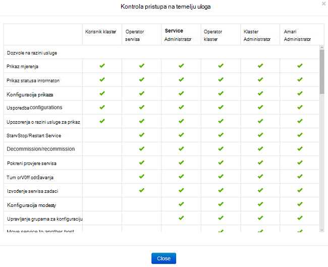
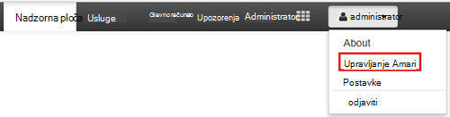
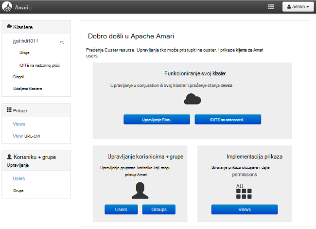
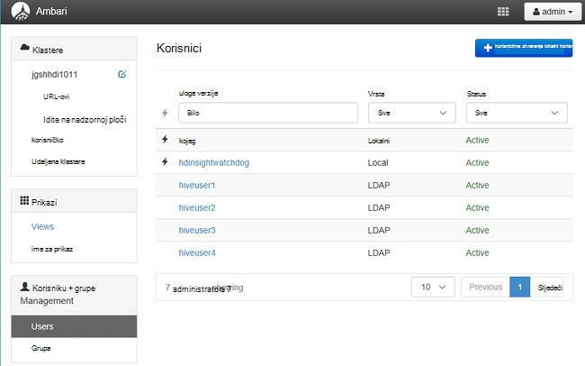
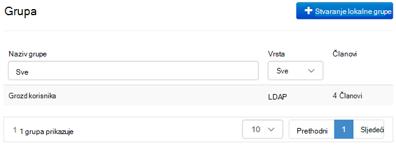
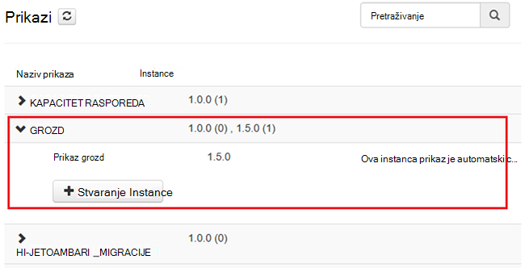
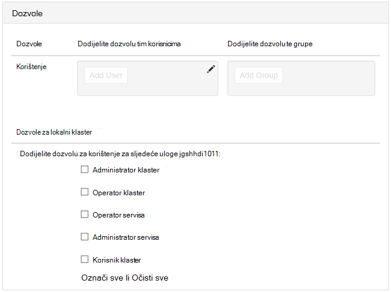

<properties
    pageTitle="Upravljanje klastere domene pridruženo HDInsight | Microsoft Azure"
    description="Informirajte se o upravljanju klastere domene pridruženo HDInsight"
    services="hdinsight"
    documentationCenter=""
    authors="saurinsh"
    manager="jhubbard"
    editor="cgronlun"
    tags=""/>

<tags
    ms.service="hdinsight"
    ms.devlang="na"
    ms.topic="article"
    ms.tgt_pltfrm="na"
    ms.workload="big-data"
    ms.date="10/25/2016"
    ms.author="saurinsh"/>

# Upravljanje domene pridruženo HDInsight klastere (pretpregled)

Saznajte na korisnika i uloga u domene pridruženo HDInsight i kako upravljati domene pridruženo klastere HDInsight.

## Korisnici klastere domene pridruženo HDInsight

Klaster programa HDInsight koji nije domene-pridružen sastoji se od dva korisničke račune stvorene tijekom stvaranja klaster:

- **Administrator Ambari**: se nazivaju i *Hadoop korisnika* ili *korisnik HTTP*. Taj račun može se koristiti za https:// prijavite na Ambari&lt;clustername >. azurehdinsight.net. Može se koristiti i pokretanje upita na prikazima Ambari, izvršavanje zadataka putem vanjskim alatima (odnosno PowerShell Templeton, Visual Studio) i provjeru autentičnosti s vrste Hive ODBC upravljački program i alatima za Poslovno obavještavanje (odnosno programa Excel, PowerBI ili Tableau).

- **SSH korisnika**: ovaj račun može se koristiti s SSH i izvršavanje naredbe sudo. Ima ovlasti korijenski Linux VMs.

HDInsight klaster domene pridruženo ima tri nove korisnike osim Ambari administrator i SSH korisnika.

- **Administrator ranger**: se lokalni Apache Ranger administratorskog računa. Nije li korisnik domene servisa active directory. Postavljanje pravila i donošenje drugih korisnika i administratora za ovlaštenih administratora (kako bi ti korisnici mogu upravljati pravilima) mogu se taj račun. Prema zadanim postavkama, korisničko ime koje je *administrator* i lozinka je isti kao Ambari administratorsku lozinku. Na stranici Postavke u Ranger moguće je ažurirati lozinku.

- **Klaster administrator domene korisnika**: ovaj račun je označen kao administrator klaster Hadoop uključujući Ambari i Ranger korisnik domene servisa active directory. Tijekom stvaranja klaster, morate unijeti vjerodajnice za tog korisnika. Taj korisnik ima ovlasti za sljedeće:

    - Uključite strojeva domeni i smjestiti unutar organizacijsku jedinicu koju navedete tijekom stvaranja klaster.
    - Stvaranje servisa upravitelji unutar organizacijsku jedinicu koju navedete tijekom stvaranja klaster. 
    - Stvaranje obrnutim DNS stavke.

    Imajte na umu drugim korisnicima AD imati ovlasti. 

    Postoje neka krajnje točke unutar klaster (na primjer, Templeton) koje ne upravlja Ranger i zato nisu sigurne. Ove krajnje točke za sve korisnike osim korisnik domene za administratore klaster su zaključane prema dolje. 

- **Uobičajeni**: tijekom stvaranja klaster, možete unijeti više grupa servisa active directory. Korisnici u te grupe će se sinkronizirati s Ranger i Ambari. Ti korisnici su korisnici domene i će imati pristup samo Ranger upravlja krajnje točke (na primjer, Hiveserver2). Pravila RBAC i nadzor neće moći primijeniti na tim korisnicima.

## Uloge klastere domene pridruženo HDInsight

Domene pridruženo HDInsight imati sljedeće uloge:

- Administrator klaster
- Operator klaster
- Administrator servisa
- Operator servisa
- Korisnik klaster

**Da biste vidjeli dozvole te uloge**

1. Otvorite Upravljanje Ambari korisničkog Sučelja.  U odjeljku [otvorite Upravljanje Ambari korisničkog Sučelja](#open-the-ambari-management-ui).
2. Na lijevom izborniku kliknite **uloge**.
3. Kliknite na plavi upitnik potražite u članku dozvole:

    

## Otvorite Upravljanje Ambari korisničkog Sučelja

1. Prijavite se [portal za Azure](https://portal.azure.com).
2. Otvorite svoj klaster HDInsight u na plohu. Pogledajte [popis i prikaz klastere](hdinsight-administer-use-management-portal.md#list-and-show-clusters).
3. Kliknite **nadzorna ploča** s gornji izbornik da biste otvorili Ambari.
4. Prijavite se na Ambari pomoću klaster administrator domene korisničkog imena i lozinke.
5. Kliknite padajući izbornik **administrator** u gornjem desnom kutu, a zatim kliknite **Upravljanje Ambari**.

    

    Korisničko Sučelje izgleda ovako:

    

## Popis korisnici domene koji se sinkroniziraju iz servisa Active Directory

1. Otvorite Upravljanje Ambari korisničkog Sučelja.  U odjeljku [otvorite Upravljanje Ambari korisničkog Sučelja](#open-the-ambari-management-ui).
2. Na lijevom izborniku kliknite **korisnicima**. Prikazat će svi korisnici koji se sinkroniziraju iz servisa Active Directory klaster HDInsight.

    

## Popis grupe domena koji se sinkroniziraju iz servisa Active Directory

1. Otvorite Upravljanje Ambari korisničkog Sučelja.  U odjeljku [otvorite Upravljanje Ambari korisničkog Sučelja](#open-the-ambari-management-ui).
2. Na lijevom izborniku kliknite **grupe**. Moraju vidjeli sve grupe sinkronizirali iz servisa Active Directory klaster HDInsight.

    

## Konfigurirajte dozvole za vrste Hive prikazi

1. Otvorite Upravljanje Ambari korisničkog Sučelja.  U odjeljku [otvorite Upravljanje Ambari korisničkog Sučelja](#open-the-ambari-management-ui).
2. Na lijevom izborniku kliknite **prikaza**.
3. Kliknite **vrste HIVE** slajdove.

    

4. Kliknite vezu **Prikaz vrste Hive** da biste konfigurirali vrste Hive prikaza.
5. Pomaknite se prema dolje do odjeljka **dozvole** .

    

6. Kliknite **Dodaj korisnika** ili **Dodaj grupu**, a zatim navedite korisnike ili grupe koje možete koristiti vrste Hive prikaze. 

## Konfiguriranje korisnika za uloge

 Da biste vidjeli popis uloge i dozvole, potražite u članku [klastere uloge domene pridruženo HDInsight](#roles-of-domain---joined-hdinsight-clusters).

1. Otvorite Upravljanje Ambari korisničkog Sučelja.  U odjeljku [otvorite Upravljanje Ambari korisničkog Sučelja](#open-the-ambari-management-ui).
2. Na lijevom izborniku kliknite **uloge**.
3. Kliknite **Dodaj korisnika** ili **Dodaj grupu** korisnici i grupe dodijeliti različite uloge.
 
## Daljnji koraci

- Konfiguriranje domena pridruženo HDInsight klaster, potražite u članku [Konfiguriranje domene pridruženo HDInsight klastere](hdinsight-domain-joined-configure.md).
- Konfiguriranje pravilnika grozd i pokretanje upita grozd, potražite u članku [Konfiguriranje vrste Hive pravila za klastere domene pridruženo HDInsight](hdinsight-domain-joined-run-hive.md).
- Izvodi grozd upita pomoću SSH na klastere domene pridruženo HDInsight potražite u članku [Korištenje SSH s operacijskim sustavom Linux Hadoop na HDInsight Linux, Unix, ili OS X](hdinsight-hadoop-linux-use-ssh-unix.md#connect-to-a-domain-joined-hdinsight-cluster).
