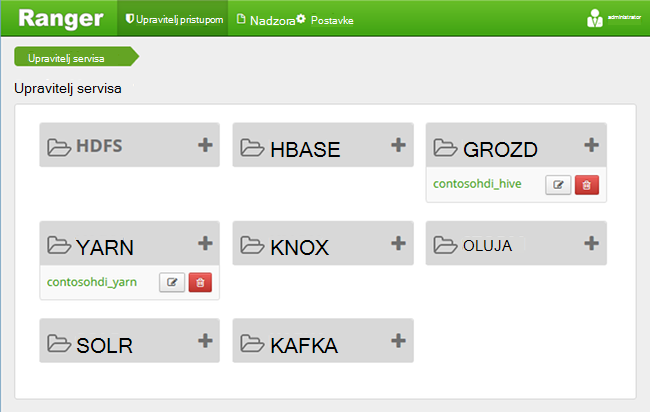
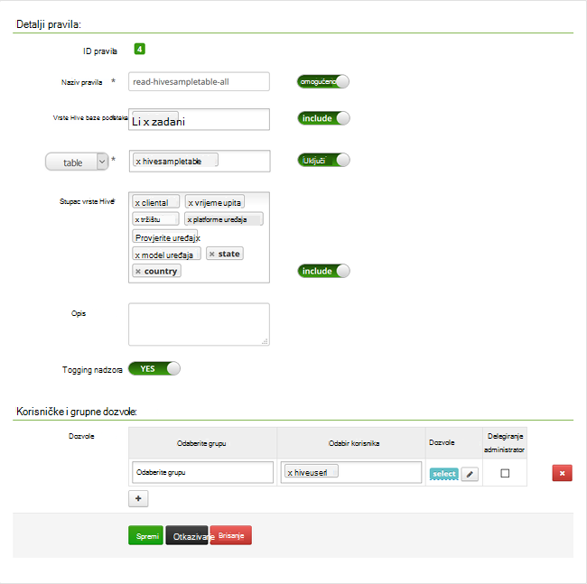

<properties
    pageTitle="Konfiguriranje pravilnika grozd u domene pridruženo HDInsight | Microsoft Azure"
    description="Saznajte..."
    services="hdinsight"
    documentationCenter=""
    authors="saurinsh"
    manager="jhubbard"
    editor="cgronlun"
    tags="azure-portal"/>

<tags
    ms.service="hdinsight"
    ms.devlang="na"
    ms.topic="hero-article"
    ms.tgt_pltfrm="na"
    ms.workload="big-data"
    ms.date="10/25/2016"
    ms.author="saurinsh"/>

# Konfiguriranje pravilnika grozd u domene pridruženo HDInsight (pretpregled)

Saznajte kako konfigurirati pravila Apache Ranger grozd. U ovom se članku stvorite dva Ranger pravila da biste ograničili pristup na hivesampletable. U sklopu sustava hivesampletable klastere HDInsight. Nakon što ste konfigurirali pravilnike, pomoću programa Excel i ODBC upravljački program za povezivanje s grozd tablica u HDInsight.

## Preduvjeti

- Klaster domene pridruženo HDInsight. Potražite u članku [Konfiguriranje domene pridruženo HDInsight klastere](hdinsight-domain-joined-configure.md).
- Radne stanice pomoću sustava Office 2016, Office 2013 Professional Plus, Office 365 Pro Plus, samostalno izdanje programa Excel 2013 i Office 2010 Professional Plus.

## Povezivanje s Apache Ranger Admin UI

**Povezivanje s Ranger Admin UI**

1. U pregledniku se povezati s Ranger Admin UI. URL je https://&lt;ClusterName >.azurehdinsight.net/Ranger/. 

    >[AZURE.NOTE] Ranger koristi se vjerodajnica za različite od Hadoop klaster. Da biste spriječili preglednici pomoću predmemoriranih vjerodajnica Hadoop, koristite novi prozor preglednika inprivate povezati korisničkog Sučelja za administratore Ranger.
4. Prijavite se pomoću klaster administrator domene korisničko ime i lozinku:

    

    Trenutno Ranger funkcionira samo s Yarn i grozd.

## Stvaranje korisnika domene

U [klastere HDInsight pridruženo za konfiguriranje domene](hdinsight-domain-joined-configure.md#create-and-configure-azure-ad-ds-for-your-azure-ad), stvorite hiveruser1 i hiveuser2. U ovom ćete praktičnom vodiču će se koristiti dva korisnički račun.

## Stvaranje pravila Ranger

U ovom ćete odjeljku će stvoriti dvije Ranger pravila za pristup hivesampletable. Odaberite dozvole dati na drugačiji skup stupaca. I korisnici su stvorene u [klastere pridruženo za konfiguriranje domene HDInsight](hdinsight-domain-joined-configure.md#create-and-configure-azure-ad-ds-for-your-azure-ad).  U sljedećem odjeljku će testirajte dva pravila u programu Excel.

**Da biste stvorili Ranger pravila**

1. Otvorite Ranger Admin UI. Potražite u članku [Povezivanje s Apache Ranger Admin UI](#connect-to-apache-ranager-admin-ui).
2. Kliknite ** &lt;ClusterName > _hive**, u odjeljku **vrste Hive**. Dva unaprijed konfiguriranje pravilnika o moraju vidjeti.
3. Kliknite **Dodavanje novog pravila**, a zatim unesite sljedeće vrijednosti:

    - Naziv pravila: čitanje hivesampletable sve
    - Vrste Hive baze podataka: zadani
    - Tablica: hivesampletable
    - Vrste Hive stupac: *
    - Odaberite korisnika: hiveuser1
    - Dozvole: odaberite

    .

    >[AZURE.NOTE] Ako korisnik domene ne unose u odabir korisnika, pričekajte nekoliko sekundi dok se Ranger sinkronizirati s AAD.

4. Kliknite **Dodaj** da biste spremili pravilo.
5. Ponavljanje zadnje dvije korake za stvaranje drugog pravila sljedeća svojstva:

    - Naziv pravila: čitanje hivesampletable devicemake
    - Vrste Hive baze podataka: zadani
    - Tablica: hivesampletable
    - Vrste Hive stupac: clientid, devicemake
    - Odaberite korisnika: hiveuser2
    - Dozvole: odaberite

## Stvaranje vrste Hive ODBC izvora podataka

Upute pronaći ćete u [Stvaranje vrste Hive ODBC izvora podataka](hdinsight-connect-excel-hive-odbc-driver.md).  

    Svojstvo|Opis
    ---|---
    Naziv izvora podataka|Dodijelite naziv s izvorom podataka
    Glavno računalo|Unesite &lt;HDInsightClusterName >. azurehdinsight.net. Na primjer, myHDICluster.azurehdinsight.net
    Priključak|Koristite <strong>443</strong>. (Priključak promijenjen iz 563 443.)
    Baze podataka|Koristite <strong>zadani</strong>.
    Vrsta poslužitelja grozd|Odabir <strong>vrste Hive poslužitelja 2</strong>
    Mehanizam|Odabir <strong>Servisa Azure HDInsight</strong>
    HTTP put|Ostavite prazno.
    Korisničko ime|Unesite hiveuser1@contoso158.onmicrosoft.com. Ažurirajte naziv domene neka druga.
    Lozinke|Unesite lozinku za hiveuser1.
    </table>

Provjerite jeste li kliknite **Testiraj** prije spremanja izvora podataka.

##Uvoz podataka u programu Excel iz servisa HDInsight

U odjeljku zadnju ste konfigurirali dva skupa pravila.  hiveuser1 s dozvolom za odabir na sve stupce i hiveuser2 s dozvolom za odaberite dva stupca. U ovom ćete odjeljku oponašati dva korisnika da biste uvezli podatke u Excel.

1. Otvorite novu ili postojeću radnu knjigu u programu Excel.
2. Na kartici **Podaci** kliknite **Iz drugih izvora podataka**, a zatim **Iz čarobnjaka za povezivanje podataka** da biste pokrenuli **Čarobnjak za povezivanje podataka**.

    ! [Čarobnjaka za povezivanje podataka otvaranja] [img-hdi-simbahiveodbc.excel.dataconnection]

3. Odaberite **ODBC DSN** kao izvor podataka, a zatim kliknite **Dalje**.
4. Iz ODBC izvora podataka, odaberite naziv izvora podataka koji ste stvorili u prethodnom koraku, a zatim kliknite **Dalje**.
5. Ponovno unesite lozinku za klaster u čarobnjaku, a zatim kliknite **u redu**. Pričekajte dijaloškom okviru **Odaberite bazu podataka i tablicu** da biste otvorili. To može potrajati nekoliko sekundi.
8. Odaberite **hivesampletable**, a zatim kliknite **Dalje**. 
8. Kliknite **Završi**.
9. U dijaloškom okviru **Uvoz podataka** možete promijeniti i naveli upit. Da biste to učinili, kliknite **Svojstva**. To može potrajati nekoliko sekundi. 
10. Kliknite karticu **definicija** . Naredba tekst je:

        SELECT * FROM "HIVE"."default"."hivesampletable"

    Pravilnici Ranger ste definirali, hiveuser1 s dozvolom za odabir na sve stupce.  Tako da funkcionira ovaj upit s vjerodajnicama hiveuser1 korisnika, ali ovaj upit ne ne funkcionira s vjerodajnicama hiveuser2 korisnika.

    ! [Svojstva veze] [img-hdi-simbahiveodbc-excel – connectionproperties]

11. Kliknite **u redu** da biste zatvorili dijaloški okvir svojstva veze.
12. Kliknite **u redu** da biste zatvorili dijaloški okvir **Uvoz podataka** .  
13. Ponovno unesite lozinku za hiveuser1, a zatim kliknite **u redu**. U svega nekoliko sekundi prije nego što se podaci uvoze u Excel. Kada završi, prikazat će 11 stupaca s podacima.

Da biste testirali drugog pravila (čitanje-hivesampletable-devicemake) koju ste stvorili u odjeljku zadnju

1. Dodajte novi list u programu Excel.
2. Slijedite postupak za posljednje da biste uvezli podatke.  Samo promjene koje ćete izvršiti je da biste koristili vjerodajnice hiveuser2, umjesto hiveuser1 korisnika. To se neće uspjeti jer hiveuser2 samo s dozvolom za da biste vidjeli dva stupca. Prikazat će se sljedeća pogreška:

        [Microsoft][HiveODBC] (35) Error from Hive: error code: '40000' error message: 'Error while compiling statement: FAILED: HiveAccessControlException Permission denied: user [hiveuser2] does not have [SELECT] privilege on [default/hivesampletable/clientid,country ...]'.

3. Slijedite isti postupak da biste uvezli podatke. Ovaj put pomoću vjerodajnica hiveuser2 korisnika i izmijeniti iskaza select iz:

        SELECT * FROM "HIVE"."default"."hivesampletable"

    Da biste:

        SELECT clientid, devicemake FROM "HIVE"."default"."hivesampletable"

    Kada završi, prikazat će dva stupca s podacima koji su uvezeni.

## Daljnji koraci

- Konfiguriranje domena pridruženo HDInsight klaster, potražite u članku [Konfiguriranje domene pridruženo HDInsight klastere](hdinsight-domain-joined-configure.md).
- Upravljanje klastere na domeni pridruženo HDInsight potražite u članku [Upravljanje domenom pridruženo HDInsight klastere](hdinsight-domain-joined-manage.md).
- Izvodi grozd upita pomoću SSH na klastere domene pridruženo HDInsight potražite u članku [Korištenje SSH s operacijskim sustavom Linux Hadoop na HDInsight Linux, Unix, ili OS X](hdinsight-hadoop-linux-use-ssh-unix.md#connect-to-a-domain-joined-hdinsight-cluster).
- Povezivanje vrste Hive pomoću JDBC vrste Hive, potražite u članku [Povezivanje grozd na Azure HDInsight pomoću vrste Hive JDBC upravljački program](hdinsight-connect-hive-jdbc-driver.md)
- Povezivanje programa Excel s Hadoop pomoću ODBC vrste Hive, potražite u članku [Povezivanje programa Excel sa Hadoop pomoću ODBC vrste Hive Microsoft pogona](hdinsight-connect-excel-hive-odbc-driver.md)
- Za povezivanje programa Excel Hadoop pomoću dodatka Power Query potražite u članku [Povezivanje programa Excel sa Hadoop pomoću dodatka Power Query](hdinsight-connect-excel-power-query.md)