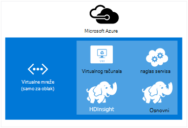
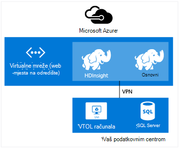
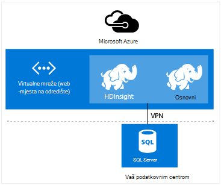

<properties
    pageTitle="Proširivanje servisa HDInsight s virtualne mreže | Microsoft Azure"  
    description="Saznajte kako koristiti virtualne mreže Azure HDInsight povezati ostale resurse oblaka ili resursa u vašem podatkovnog centra"
    services="hdinsight"
    documentationCenter=""
    authors="Blackmist"
    manager="jhubbard"
    editor="cgronlun"/>

<tags
   ms.service="hdinsight"
   ms.devlang="na"
   ms.topic="article"
   ms.tgt_pltfrm="na"
   ms.workload="big-data"
   ms.date="10/21/2016"
   ms.author="larryfr"/>


#<a name="extend-hdinsight-capabilities-by-using-azure-virtual-network"></a>Proširivanje mogućnosti HDInsight pomoću Azure virtualne mreže

Azure virtualne mreže omogućuje vam da biste proširili Hadoop rješenja uključivanje lokalnog resursa kao što je SQL Server da biste kombinirali više vrsta klaster HDInsight ili da biste stvorili sigurne privatne mreže između resursa u oblak.

[AZURE.INCLUDE [upgrade-powershell](../../includes/hdinsight-use-latest-powershell-and-cli.md)]


##<a id="whatis"></a>Što je Azure virtualne mreže?

[Azure virtualne mreže](https://azure.microsoft.com/documentation/services/virtual-network/) omogućuje stvaranje sigurnog, stalni mreže koja sadrži resursa koji vam je potrebna za rješenje. Virtualne mreže omogućuje vam da:

* Povezivanje oblaka resursa zajedno u privatne mreže (samo za oblak).

    

    Da biste se povezali Azure servisa sa servisom Azure HDInsight pomoću virtualne mreže omogućuje sljedeće scenarije:

    * **Pozivanje HDInsight servise ili zadatke** iz Azure web-mjesta ili servise na Azure virtualnim računalima sustava.

    * **Izravno prijenos podataka** između HDInsight i baze podataka SQL Azure, SQL Server ili drugo rješenje za pohranu podataka radi na virtualnog računala.

    * **Kombiniranje više HDInsight poslužitelja** u jednu rješenja. HDInsight klastere Dođite na razne vrste koji odgovara radno opterećenje ni tehnologija koja klaster postavljen je za. Ne postoji podržani način da biste stvorili klaster koji kombinira više vrsta, kao što su oluja i HBase na jedan klaster. Virtualne mreže omogućuje više klastere izravno komunikaciju s drugom.

* Povezati resursa u oblak lokalne podatkovnog centra mrežom (web-mjesto ili točke na mjestu) putem virtualne privatne mreže (VPN-a).

    Konfiguracija web-mjesto omogućuje vam da biste se povezali više resursa iz vaše podatkovnog centra Azure virtualne mreže pomoću hardvera VPN-a ili servis za usmjeravanje i daljinski pristup.

    

    Konfiguracija točke mjesta omogućuje vam povezati određeni resurs Azure virtualne mreže pomoću softvera VPN-a.

    

    Putem virtualne mreže za povezivanje s oblakom i vaše podatkovnog centra omogućuje sličnih scenarija samo oblak konfiguracije. No umjesto ograničen je na rad s resursima u oblaku, možete i u suradnji s resursima u vašem podatkovnog centra.

    * **Izravno prijenos podataka** između HDInsight i vaše podatkovnog centra. Primjer koristi Sqoop za prijenos podataka u ili iz sustava SQL Server ili čitanja podataka koji su generirani aplikacija (LOB) redak tvrtke.

    * **Pozivanje HDInsight servise ili zadatke** iz aplikacije LOB. Primjer koristi HBase Java API-ji za pohranu i dohvaćanje podataka iz programa klaster HDInsight HBase.

Dodatne informacije o značajkama virtualne mreže, prednosti i mogućnostima potražite u članku [Pregled Azure virtualne mreže](../virtual-network/virtual-networks-overview.md).

> [AZURE.NOTE] Prije dodjele resursa za HDInsight klaster morate stvoriti Azure virtualne mreže. Dodatne informacije potražite u članku [Zadaci Konfiguracija virtualne mreže](https://azure.microsoft.com/documentation/services/virtual-network/).

## <a name="virtual-network-requirements"></a>Virtualne mreže

> [AZURE.IMPORTANT] Stvaranje programa HDInsight klaster virtualne mreže potreban je određeni Konfiguracija virtualne mreže koji su opisani u ovom odjeljku.

###<a name="location-based-virtual-networks"></a>Temeljena virtualne mreža

Azure HDInsight podržava samo temeljena virtualne mreže, a trenutno ne funkcionira s virtualne mreže na temelju afinitet grupe.

###<a name="classic-or-v2-virtual-network"></a>Klasični ili v2 virtualne mreže

Utemeljen na sustavu Windows klastere zahtijevaju klasični virtualne mreže dok sustavom Linux klastere zahtijevaju programa virtualne mreže resursima Azure. Ako nemate odgovarajuće vrste mreže, neće biti moguće koristiti prilikom stvaranja klaster.

Ako imate resursa na virtualne mreže koja se ne može koristiti klaster planirate o stvaranju, stvorite novu virtualne mrežu koja se može koristiti klaster i povežite ga s kompatibilan virtualne mreže. Zatim stvorite klaster u mrežnu verziju koju je potrebno, a zatim ga moći pristupa resursima servisa s mrežom jer se spajaju dvije. Dodatne informacije o povezivanje classic i nova virtualne mreža, potražite u članku [Povezivanje classic VNets nove VNets](../vpn-gateway/vpn-gateway-connect-different-deployment-models-portal.md).

###<a name="custom-dns"></a>Prilagođeni DNS-a

Prilikom stvaranja virtualne mreže Azure nudi zadani naziv rješenje Azure servise kao što je HDInsight koji su instalirani u mreži. No možda trebate koristiti vlastite DNS Domain Name System () za situacije kao što su unakrsni razlučivanje naziva domene mreže. Na primjer, kada komunikaciju između servisa nalazi u dva pridruženo virtualne mreže. HDInsight podržava i na zadanu razlučivost Azure naziv kao i prilagođeni DNS kada se koristi s Azure virtualne mreže.

Dodatne informacije o korištenju vlastite DNS poslužitelj s Azure virtualne mreže, u odjeljku __razlučivanje naziva korištenjem vlastite DNS poslužitelj__ [Razlučivanje naziva za VMs i uloga instance](../virtual-network/virtual-networks-name-resolution-for-vms-and-role-instances.md#name-resolution-using-your-own-dns-server) dokumenta.

###<a name="secured-virtual-networks"></a>Osigurano virtualne mreže

Servis za HDInsight je servis za upravljane i potreban je pristup Internetu tijekom dodjele resursa i tijekom rada. To je da bi se taj Azure možete nadzirati stanje klaster, pokretanje prebacivanje klaster resursa, promijenite broj čvorove u klaster kroz skaliranja operacije te druge zadatke upravljanja.

Ako je potrebno instalirati HDInsight u zaštićenom virtualne mreže morate dopustiti pristup ulaznog putem priključak 443 za sljedeće IP adrese, koje omogućuju Azure upravljanja klaster HDInsight.

* 168.61.49.99
* 23.99.5.239
* 168.61.48.131
* 138.91.141.162

Dopuštanja pristupa ulaznog iz priključak 443 za te adrese će vam omogućiti da biste uspješno instalirali HDInsight u zaštićenom virtualne mreže.

> [AZURE.IMPORTANT] HDInsight ne podržava ograničavanje odlazni promet, dolazni promet. Pri definiranju mreže sigurnosne grupe pravila za podmreže koja sadrži HDInsight koristiti samo ulazna pravila.

Sljedeći primjeri prikazuju kako stvoriti nove grupe sigurnost mreže koja omogućuje potrebne adrese i sigurnosne grupe pripada podmreže unutar virtualne mreže. Ove se pretpostavlja da ste već stvorili virtualne mreže i podmreže koje želite instalirati HDInsight u.

__Pomoću Azure komponente PowerShell__

    $vnetName = "Replace with your virtual network name"
    $resourceGroupName = "Replace with the resource group the virtual network is in"
    $subnetName = "Replace with the name of the subnet that HDInsight will be installed into"
    # Get the Virtual Network object
    $vnet = Get-AzureRmVirtualNetwork `
        -Name $vnetName `
        -ResourceGroupName $resourceGroupName
    # Get the region the Virtual network is in.
    $location = $vnet.Location
    # Get the subnet object
    $subnet = $vnet.Subnets | Where-Object Name -eq $subnetName
    # Create a new Network Security Group.
    # And add exemptions for the HDInsight health and management services.
    $nsg = New-AzureRmNetworkSecurityGroup `
        -Name "hdisecure" `
        -ResourceGroupName $resourceGroupName `
        -Location $location `
        | Add-AzureRmNetworkSecurityRuleConfig `
            -name "hdirule1" `
            -Description "HDI health and management address 168.61.49.99" `
            -Protocol "*" `
            -SourcePortRange "*" `
            -DestinationPortRange "443" `
            -SourceAddressPrefix "168.61.49.99" `
            -DestinationAddressPrefix "VirtualNetwork" `
            -Access Allow `
            -Priority 300 `
            -Direction Inbound `
        | Add-AzureRmNetworkSecurityRuleConfig `
            -Name "hdirule2" `
            -Description "HDI health and management 23.99.5.239" `
            -Protocol "*" `
            -SourcePortRange "*" `
            -DestinationPortRange "443" `
            -SourceAddressPrefix "23.99.5.239" `
            -DestinationAddressPrefix "VirtualNetwork" `
            -Access Allow `
            -Priority 301 `
            -Direction Inbound `
        | Add-AzureRmNetworkSecurityRuleConfig `
            -Name "hdirule3" `
            -Description "HDI health and management 168.61.48.131" `
            -Protocol "*" `
            -SourcePortRange "*" `
            -DestinationPortRange "443" `
            -SourceAddressPrefix "168.61.48.131" `
            -DestinationAddressPrefix "VirtualNetwork" `
            -Access Allow `
            -Priority 302 `
            -Direction Inbound `
        | Add-AzureRmNetworkSecurityRuleConfig `
            -Name "hdirule4" `
            -Description "HDI health and management 138.91.141.162" `
            -Protocol "*" `
            -SourcePortRange "*" `
            -DestinationPortRange "443" `
            -SourceAddressPrefix "138.91.141.162" `
            -DestinationAddressPrefix "VirtualNetwork" `
            -Access Allow `
            -Priority 303 `
            -Direction Inbound
    # Set the changes to the security group
    Set-AzureRmNetworkSecurityGroup -NetworkSecurityGroup $nsg
    # Apply the NSG to the subnet
    Set-AzureRmVirtualNetworkSubnetConfig `
        -VirtualNetwork $vnet `
        -Name $subnetName `
        -AddressPrefix $subnet.AddressPrefix `
        -NetworkSecurityGroupId $nsg

__Korištenje Azure EŽA__

1. Koristite sljedeću naredbu da biste stvorili novi mrežni sigurnosne grupe s nazivom `hdisecure`. Grupa resursa koji sadrži Azure virtualne mreže i lokaciji (regiji,) stvorenu u grupu u zamijenite __RESOURCEGROUPNAME__ i __mjesto__ .

        azure network nsg create RESOURCEGROUPNAME hdisecure LOCATION
    
    Nakon što u grupu, primit ćete informacije o novoj grupi. Pronađite redak sličnu ovoj i spremanje na `/subscriptions/GUID/resourceGroups/RESOURCEGROUPNAME/providers/Microsoft.Network/networkSecurityGroups/hdisecure` informacije. Će se koristiti u noviji koraku.
    
        data:    Id                              : /subscriptions/GUID/resourceGroups/RESOURCEGROUPNAME/providers/Microsoft.Network/networkSecurityGroups/hdisecure

2. Koristite sljedeće da biste dodali pravila u novu grupu sigurnost mreže koje omogućuju ulaznog komunikacije na priključak 443 iz servisa Azure HDInsight stanja i upravljanje njima. Zamijenite __RESOURCEGROUPNAME__ naziv grupe resursa koji sadrži Azure virtualne mreže.

        azure network nsg rule create RESOURCEGROUPNAME hdisecure hdirule1 -p "*" -o "*" -u "443" -f "168.61.49.99" -e "VirtualNetwork" -c "Allow" -y 300 -r "Inbound"
        azure network nsg rule create RESOURCEGROUPNAME hdisecure hdirule2 -p "*" -o "*" -u "443" -f "23.99.5.239" -e "VirtualNetwork" -c "Allow" -y 301 -r "Inbound"
        azure network nsg rule create RESOURCEGROUPNAME hdisecure hdirule3 -p "*" -o "*" -u "443" -f "168.61.48.131" -e "VirtualNetwork" -c "Allow" -y 302 -r "Inbound"
        azure network nsg rule create RESOURCEGROUPNAME hdisecure hdirule4 -p "*" -o "*" -u "443" -f "138.91.141.162" -e "VirtualNetwork" -c "Allow" -y 303 -r "Inbound"

3. Nakon što stvorite pravila, koristite sljedeće da biste primijenili novi mrežni sigurnosne grupe podmreži. Zamijenite __RESOURCEGROUPNAME__ naziv grupe resursa koji sadrži Azure virtualne mreže. Zamijenite __VNETNAME__ i __SUBNETNAME__ naziv Azure virtualne mreže i podmreže koju ćete koristiti prilikom instalacije servisa HDInsight.

        azure network vnet subnet set RESOURCEGROUPNAME VNETNAME SUBNETNAME -w "/subscriptions/GUID/resourceGroups/RESOURCEGROUPNAME/providers/Microsoft.Network/networkSecurityGroups/hdisecure"
    
    Kada se dovrši tu naredbu, uspješno instalirajte HDInsight u zaštićenom virtualne mreže na podmreži koristi u sljedećim koracima.

> [AZURE.IMPORTANT] Pomoću gore navedene korake samo otvoreni pristup sa servisom HDInsight stanja i upravljanje na Azure oblaka. To vam omogućuje da biste uspješno instalirali na HDInsight klaster u podmreži, no po zadanom blokirane pristup klaster HDInsight iz izvan virtualne mreže. Morat ćete dodati dodatni mrežni sigurnosne grupe pravila ako želite omogućiti pristup s izvan virtualne mreže.
>
> Na primjer, da biste omogućili pristup SSH s Interneta, morat ćete dodati pravilo sličnu ovoj: 
>
> * Azure PowerShell –```Add-AzureRmNetworkSecurityRuleConfig -Name "SSSH" -Description "SSH" -Protocol "*" -SourcePortRange "*" -DestinationPortRange "22" -SourceAddressPrefix "*" -DestinationAddressPrefix "VirtualNetwork" -Access Allow -Priority 304 -Direction Inbound```
> * Azure EŽA-```azure network nsg rule create RESOURCEGROUPNAME hdisecure hdirule4 -p "*" -o "*" -u "22" -f "*" -e "VirtualNetwork" -c "Allow" -y 304 -r "Inbound"```

Dodatne informacije o sigurnosnim grupama s mrežom potražite u članku [Pregled mreže sigurnosne grupe](../virtual-network/virtual-networks-nsg.md). Informacije o kontroliranje usmjeravanju u Azure virtualne mreže, potražite u članku [korisnički definirana usmjerava i IP prosljeđivanje](../virtual-network/virtual-networks-udr-overview.md).

##<a id="tasks"></a>Zadaci i informacije

Ova sekcija sadrži podatke o na uobičajene zadatke i morat ćete prilikom korištenja servisa HDInsight s virtualne mreže.

###<a name="determine-the-fqdn"></a>Određivanje FQDN

HDInsight klaster dodijelit će se određene potpuno kvalificirani naziv domene (FQDN) sučelja virtualne mreže. To je adresa koju koristite prilikom povezivanja s klaster iz drugih resursa na virtualne mreže. Da biste utvrdili FQDN, koristite sljedeće URL upita servisa za upravljanje Ambari:

    https://<clustername>.azurehdinsight.net/ambari/api/v1/clusters/<clustername>.azurehdinsight.net/services/<servicename>/components/<componentname>

> [AZURE.NOTE] Dodatne informacije o korištenju Ambari sa servisa HDInsight potražite u članku [Hadoop monitora klastere u HDInsight pomoću Ambari API -JA](hdinsight-monitor-use-ambari-api.md).

Morate navesti naziv klaster i servisa te komponente pokrenuti na klaster, kao što je upravitelj YARN resursa.

> [AZURE.NOTE] Vraća podaci JavaScript objekt notaciju (JSON) dokument koji sadrži mnogo informacije o komponentu. Da biste izdvojili samo FQDN, poslužite se JSON analizatora za dohvaćanje u `host_components[0].HostRoles.host_name` vrijednost.

Ako, na primjer, da biste vratili FQDN iz programa HDInsight Hadoop klaster, možete koristiti jedan od sljedećih načina za dohvaćanje podataka o upravitelju YARN resursa:

* [Azure PowerShell](../powershell-install-configure.md)

        $ClusterDnsName = <clustername>
        $Username = <cluster admin username>
        $Password = <cluster admin password>
        $DnsSuffix = ".azurehdinsight.net"
        $ClusterFQDN = $ClusterDnsName + $DnsSuffix

        $webclient = new-object System.Net.WebClient
        $webclient.Credentials = new-object System.Net.NetworkCredential($Username, $Password)

        $Url = "https://" + $ClusterFQDN + "/ambari/api/v1/clusters/" + $ClusterFQDN + "/services/yarn/     components/resourcemanager"
        $Response = $webclient.DownloadString($Url)
        $JsonObject = $Response | ConvertFrom-Json
        $FQDN = $JsonObject.host_components[0].HostRoles.host_name
        Write-host $FQDN

* [cURL](http://curl.haxx.se/) i [jq](http://stedolan.github.io/jq/)

        curl -G -u <username>:<password> https://<clustername>.azurehdinsight.net/ambari/api/v1/clusters/<clustername>.azurehdinsight.net/services/yarn/components/resourcemanager | jq .host_components[0].HostRoles.host_name

###<a name="connecting-to-hbase"></a>Povezivanje s HBase

Da biste povezali HBase daljinski pomoću Java API-JA, određivanje adrese kvorum ZooKeeper za klaster HBase i odrediti u aplikaciji.

Da biste na ZooKeeper kvorum adresu, koristite neku od sljedećih metoda upit servisa za upravljanje Ambari:

* [Azure PowerShell](../powershell-install-configure.md)

        $ClusterDnsName = <clustername>
        $Username = <cluster admin username>
        $Password = <cluster admin password>
        $DnsSuffix = ".azurehdinsight.net"
        $ClusterFQDN = $ClusterDnsName + $DnsSuffix

        $webclient = new-object System.Net.WebClient
        $webclient.Credentials = new-object System.Net.NetworkCredential($Username, $Password)

        $Url = "https://" + $ClusterFQDN + "/ambari/api/v1/clusters/" + $ClusterFQDN + "/configurations?type=hbase-site&tag=default&fields=items/properties/hbase.zookeeper.quorum"
        $Response = $webclient.DownloadString($Url)
        $JsonObject = $Response | ConvertFrom-Json
        Write-host $JsonObject.items[0].properties.'hbase.zookeeper.quorum'

* [cURL](http://curl.haxx.se/) i [jq](http://stedolan.github.io/jq/)

        curl -G -u <username>:<password> "https://<clustername>.azurehdinsight.net/ambari/api/v1/clusters/<clustername>.azurehdinsight.net/configurations?type=hbase-site&tag=default&fields=items/properties/hbase.zookeeper.quorum" | jq .items[0].properties[]

> [AZURE.NOTE] Dodatne informacije o korištenju Ambari sa servisa HDInsight potražite u članku [Hadoop monitora klastere u HDInsight pomoću Ambari API -JA](hdinsight-monitor-use-ambari-api.md).

Kada prikupite podatke kvorum, je koristiti u klijentskoj aplikaciji.

Na primjer, Java aplikacije koja koristi HBase API koju želite dodati datoteku **hbase site.xml** u projekt pa navedite kvorum informacije u datoteku na sljedeći način:

```
<configuration>
  <property>
    <name>hbase.cluster.distributed</name>
    <value>true</value>
  </property>
  <property>
    <name>hbase.zookeeper.quorum</name>
    <value>zookeeper0.address,zookeeper1.address,zookeeper2.address</value>
  </property>
  <property>
    <name>hbase.zookeeper.property.clientPort</name>
    <value>2181</value>
  </property>
</configuration>
```

###<a name="verify-network-connectivity"></a>Provjerite je li veza s mrežom

Neki servisi, primjerice, SQL Server, možete ograničiti ulazne mrežne veze. To će spriječiti da HDInsight uspješno rad s tih servisa.

Ako naiđete na probleme prilikom pristupa usluge iz servisa HDInsight, potražite u dokumentaciji za servis da biste bili sigurni da ste omogućili pristup mreži. Možete provjerite je li pristup mreži stvaranjem Azure virtualnog računala na istom virtualne mreže i koristiti klijent uslužni programi da biste provjerili je li virtualnog računala možete se povezati sa servisom putem virtualne mreže.

##<a id="nextsteps"></a>Daljnji koraci

Sljedeći primjeri prikazuju kako pomoću servisa HDInsight pomoću Azure virtualne mreže:

* [Analiza podataka senzor s oluja i HBase u HDInsight](hdinsight-storm-sensor-data-analysis.md) – pokazuje kako konfigurirati oluja i HBase klaster u virtualne mreže, kao i upute za daljinsko zapisivanje podataka HBase iz oluja.

* [Dodjeljivanje Hadoop klastere u HDInsight](hdinsight-hadoop-provision-linux-clusters.md) - opisi dodjele resursa Hadoop klastere, uključujući informacije o korištenju Azure virtualne mreže.

* [Korištenje Sqoop s Hadoop u HDInsight](hdinsight-use-sqoop-mac-linux.md) - pruža informacije o korištenju Sqoop za prijenos podataka sa sustavom SQL Server putem virtualne mreže.

Da biste saznali više o Azure virtualne mreže, potražite u članku [Pregled Azure virtualne mreže](../virtual-network/virtual-networks-overview.md).
