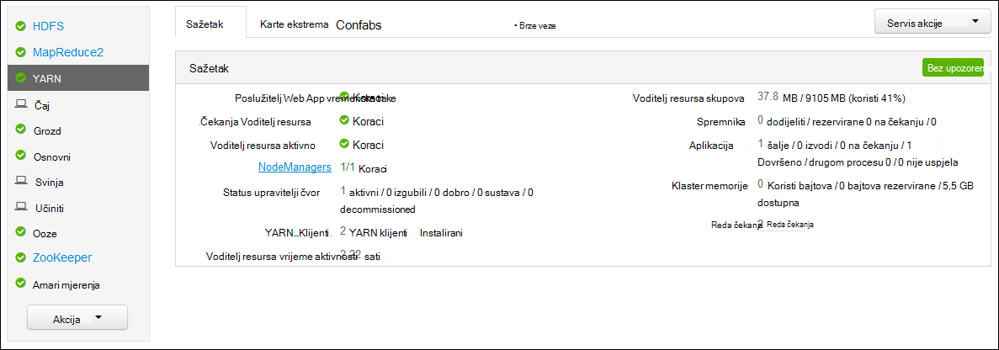
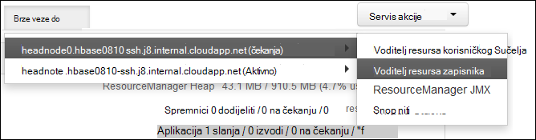

<properties
    pageTitle="Aplikaciju programa Access Hadoop YARN prijavi Linux temelje HDInsight | Microsoft Azure"
    description="Saznajte kako pristupiti YARN zapisnika aplikacije na sustavom Linux HDInsight (Hadoop) klaster pomoću naredbenog retka i web-pregledniku."
    services="hdinsight"
    documentationCenter=""
    tags="azure-portal"
    authors="Blackmist" 
    manager="jhubbard"
    editor="cgronlun"/>

<tags
    ms.service="hdinsight"
    ms.workload="big-data"
    ms.tgt_pltfrm="na"
    ms.devlang="na"
    ms.topic="article"
    ms.date="10/21/2016"
    ms.author="larryfr"/>

# Aplikaciju programa Access YARN prijavi sustavom Linux HDInsight 

Ovaj dokument objašnjava kako pristupiti u zapisnicima YARN (još neki drugi resurs Negotiator) aplikacije koje ste završili na Hadoop klaster u Azure HDInsight.

> [AZURE.NOTE] Informacije u ovom dokumentu je za klastere sustavom Linux HDInsight. Informacije o klastere utemeljen na sustavu Windows potražite u članku [aplikacije programa Access YARN prijavi HDInsight utemeljen na sustavu Windows](hdinsight-hadoop-access-yarn-app-logs.md)

## Preduvjeti

* Klaster sustavom Linux HDInsight.

* Morate [stvoriti programa tunelom SSH](hdinsight-linux-ambari-ssh-tunnel.md) mogli pristupiti web ResourceManager zapisnika korisničkog Sučelja.

## Poslužitelj YARN vremenske trake

[YARN vremenske trake Server](http://hadoop.apache.org/docs/r2.4.0/hadoop-yarn/hadoop-yarn-site/TimelineServer.html) nudi generički informacije o dovršene aplikacija, kao i informacije o aplikaciji specifične za framework putem dvije različite sučelja. Konkretno:

* Prostor za pohranu i Dohvaćanje informacija generički aplikacije na klastere HDInsight je omogućen verzijom 3.1.1.374 ili noviji.
* Komponenta informacije specifične za framework aplikacije poslužitelja za vremenske trake nije dostupan na klastere HDInsight.

Generički informacije o aplikacijama obuhvaća sljedeće vrste podataka:

* ID aplikacije, Jedinstveni identifikator aplikacije
* Korisnik koji je pokrenuo aplikacije
* Informacije o pokušao isporučiti da biste dovršili aplikacije
* Spremnici koristi bilo koji pokušaj određene aplikacije

## Zapisnici programa YARN i

YARN podržava više programiranje modelima (MapReduce se jedna od njih) tako da decoupling Upravljanje resursima iz aplikacije planiranje i praćenje. To možete učiniti putem globalni *ResourceManager* (upravitelja Resursa), po – tempiranja-čvor *NodeManagers* (NMs) i po aplikacije *ApplicationMasters* (AMs). Prijepodne po aplikacije pregovara resursa (CPU-a, memorije, disk, mreže) za pokretanje aplikacije s na RM. Upravitelj Resursa funkcionira s NMs da biste dodijelili tih resursa koje odobravaju kao *spremnike*. Na AM je zadužen za praćenje tijeka spremnika dodijelila ga na RM. Aplikacije sustava može zahtijevati više spremnika ovisno o prirode aplikacije.

Osim toga, sve aplikacije mogu sastojati od više *aplikacija pokušava* da biste dovršili x. ruši ili zbog gubitak komunikaciju između programa AM i programa RM. Dakle, spremnika odobravaju određene pokušaj aplikacije. U smislu spremnik omogućuje kontekst za osnovna jedinica ono što ste napravili YARN aplikacija, a sve posla koji obavlja u kontekstu spremnik izvodi na čvor jednog suradnika na kojem je spremnik dodijeliti. Potražite u članku [YARN koncepata] [ YARN-concepts] za daljnje referencu.

Zapisnici aplikacije (i zapisnike pridružene spremnik) su ključnim za ispravljanje pogrešaka problematična Hadoop aplikacije. YARN daje bolje okvir za prikupljanje, Zbrajanje i spremanje zapisnika aplikacije pomoću [Prikupljanja zapisnika] [ log-aggregation] značajku. Značajka prikupljanja zapisnika omogućuje pristupanju zapisnika aplikacije više deterministic objedinjuje zapisnika preko svih spremnika na čvor tempiranja i sprema ih kao jedan Zbrojeno datoteku zapisnika po tempiranja čvor na zadani datotečni sustav završetku aplikacije. Aplikacije mogu koristiti stotine ili tisuće spremnika, ali zapisnicima sve spremnike izvoditi na jednom tempiranja čvor se uvijek pridružuje u jednu datoteku, rezultira jedan zapisnik po tempiranja čvor koristi aplikacija. Prikupljanja zapisnika je po zadanom omogućena na HDInsight klastere (verzije 3.0 i noviji), a Zbrojeno zapisnike moguće je pronaći u zadanom spremnik svoj klaster na sljedećem mjestu:

    wasbs:///app-logs/<user>/logs/<applicationId>

U tom mjesto, *korisničko* ime korisnika koja je pokrenula aplikacija, a *applicationId* Jedinstveni identifikator programa kao što je dodijelio YARN RM.

Zapisnike Zbrojeno nisu izravno čitljiv, kao što su zapisuju u [TFile][T-file], [binarnom obliku] [ binary-format] indeksirati kontejner. Morate koristiti YARN ResourceManager zapisnika ili Alati za EŽA da biste pogledali ti zapisnici obliku običnog teksta za aplikacije ili spremnika koji vas zanimaju. 

##Alati za YARN EŽA

Da biste koristili alate dodatka YARN EŽA, najprije morate povezati s klaster HDInsight pomoću SSH. Informacije o korištenju SSH s HDInsight, koristite jedan od sljedećih dokumenata:

- [Korištenje SSH sa sustavom Linux Hadoop na HDInsight Linux, Unix ili OS X](hdinsight-hadoop-linux-use-ssh-unix.md)

- [Korištenje SSH sa sustavom Linux Hadoop na HDInsight iz sustava Windows](hdinsight-hadoop-linux-use-ssh-windows.md)
    
Ti zapisnici kao običan tekst možete prikazati tako da pokrenete jednu od sljedećih naredbi:

    yarn logs -applicationId <applicationId> -appOwner <user-who-started-the-application>
    yarn logs -applicationId <applicationId> -appOwner <user-who-started-the-application> -containerId <containerId> -nodeAddress <worker-node-address>
    
Morate navesti na &lt;applicationId >, &lt;-tko-rada-u – aplikacije korisničkih >, &lt;containerId >, i & ltworker čvor adrese > podataka kada se pokrene te naredbe.

##Korisničko Sučelje ResourceManager YARN

Korisničko Sučelje ResourceManager YARN pokreće na headnode klaster te se može pristupiti putem weba Ambari korisničkog Sučelja; Međutim, morate prvi [Stvaranje programa tunelom SSH](hdinsight-linux-ambari-ssh-tunnel.md) mogli pristupiti ResourceManager korisničkog Sučelja.

Nakon stvaranja programa tunelom SSH, poduzmite sljedeće korake da biste pogledali zapisnike YARN:

1. U web-pregledniku idite do https://CLUSTERNAME.azurehdinsight.net. Zamijenite CLUSTERNAME naziv svoj klaster HDInsight.

2. Na popisu usluge na lijevoj strani odaberite __YARN__.

    

3. Na padajućem izborniku __Brze veze__ , odaberite jednu od čvorove glavni klaster, a zatim odaberite __ResourceManager zapisnika__.

    
    
    Primit ćete s popisom veze na YARN zapisnika.

[YARN-timeline-server]:http://hadoop.apache.org/docs/r2.4.0/hadoop-yarn/hadoop-yarn-site/TimelineServer.html
[log-aggregation]:http://hortonworks.com/blog/simplifying-user-logs-management-and-access-in-yarn/
[T-file]:https://issues.apache.org/jira/secure/attachment/12396286/TFile%20Specification%2020081217.pdf
[binary-format]:https://issues.apache.org/jira/browse/HADOOP-3315
[YARN-concepts]:http://hortonworks.com/blog/apache-hadoop-yarn-concepts-and-applications/
