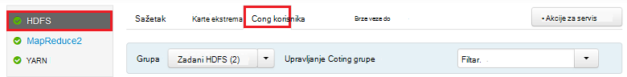
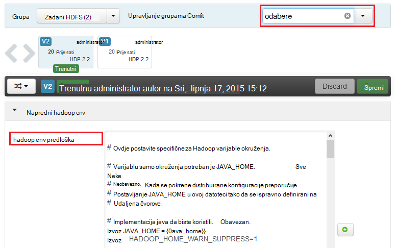
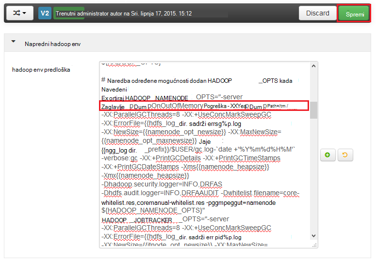
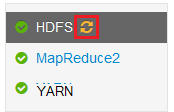
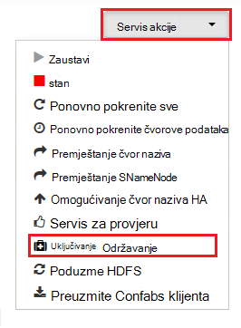
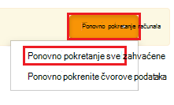

<properties
    pageTitle="Omogućivanje skupova ispisi za usluge Hadoop na HDInsight | Microsoft Azure"
    description="Omogućivanje skupova ispisi za servise Hadoop sa sustavom Linux HDInsight klastere za ispravljanje pogrešaka i analize."
    services="hdinsight"
    documentationCenter=""
    authors="Blackmist"
    manager="jhubbard"
    editor="cgronlun"
    tags="azure-portal"/>

<tags
    ms.service="hdinsight"
    ms.workload="big-data"
    ms.tgt_pltfrm="na"
    ms.devlang="na"
    ms.topic="article"
    ms.date="09/27/2016"
    ms.author="larryfr"/>

#Omogućivanje skupova ispisi za Hadoop usluge na sustavom Linux HDInsight (pretpregled)

[AZURE.INCLUDE [heapdump-selector](../../includes/hdinsight-selector-heap-dump.md)]

Ispisi skupova sadrže snimku memorije aplikacije, uključujući vrijednosti varijabli trenutku stvorena na ispis. Da biste ih vrlo koristan i za dijagnosticiranje problema koji se pojavljuju pri izvođenju.

> [AZURE.NOTE] Informacije u ovom članku odnosi se samo na operacijskim sustavom Linux HDInsight. Informacije o HDInsight utemeljen na sustavu Windows potražite u odjeljku [Omogućivanje skupova ispisi za usluge Hadoop na HDInsight utemeljen na sustavu Windows](hdinsight-hadoop-collect-debug-heap-dumps.md)

## Usluge

Možete omogućiti skupova ispisi za sljedeći servisi:

*  **hcatalog** - tempelton
*  **grozd** - hiveserver2, metastore, derbyserver
*  **mapreduce** - jobhistoryserver
*  **yarn** - resourcemanager, nodemanager, timelineserver
*  **hdfs** - datanode, secondarynamenode, namenode

Omogućivanje skupova ispisi karte i smanjivanje procesa pokrenuli po HDInsight.

## Razumijevanje skupova ispisa konfiguraciju

Ispisi skupova omogućeni prosljeđivanjem mogućnosti (poznatih kao odabere, ili parametara) da biste JVM prilikom pokretanja servisa. Za većinu Hadoop servise, to je moguće napraviti izmjenom Jezgrena skripta za pokretanje servisa.

U svakom skripti je izvoz za ** \* \_OPTS**, koja sadrži mogućnosti proslijeđen u JVM. Ako, na primjer, u skripti **hadoop env.sh** u retku koji počinje `export HADOOP_NAMENODE_OPTS=` sadrži mogućnosti za servis NameNode.

Mapiranje i smanjiti su procesi malo drugačiju, kao što su podređeni proces MapReduce servisa. Svaki mapiranje ili smanjivanje proces odvija se u spremniku podređeni i postoje dvije stavke koje sadrže JVM mogućnosti za to. Obje se nalazi u **mapred site.xml**:

* **mapreduce.Admin.Map.child.Java.opts**
* **mapreduce.Admin.Reduce.child.Java.opts**

> [AZURE.NOTE] Preporučujemo korištenje Ambari da biste izmijenili skripte i postavke mapred site.xml, kao što je Ambari rukovati replikaciju promjene preko čvorovi u klasteru. Konkretne upute potražite u odjeljku [Korištenje Ambari](#using-ambari) .

###Omogućivanje skupova ispisi

Sljedeća mogućnost omogućuje skupova ispisi kada se pojavi na OutOfMemoryError:

    -XX:+HeapDumpOnOutOfMemoryError

Na **+** označava je li omogućen tu mogućnost. Zadani je onemogućen.

> [AZURE.WARNING] Ispisi skupova nisu omogućeni za usluge Hadoop na HDInsight prema zadanim postavkama, kao što je ispis datoteke mogu biti velike. Ako omogućite ih za otklanjanje poteškoća, imajte na umu da biste onemogućili kad ste reproducirati problem i prikupili datoteke ispisa.

###Mjesto za ispis

Zadano mjesto datoteke ispis je aktivni radni imenik. Možete kontrolirati gdje je datoteka spremljena pomoću sljedećih mogućnosti:

    -XX:HeapDumpPath=/path

Na primjer, pomoću `-XX:HeapDumpPath=/tmp` uzrokovat će ispisi biti pohranjena u direktoriju /tmp.

###Skripte

Skriptu možete pokrenuti i kada se pojavi **OutOfMemoryError** . Na primjer, pokretanje obavijest da biste znali pojavila se pogreška. Time se kontrolira pomoću sljedećih mogućnosti:

    -XX:OnOutOfMemoryError=/path/to/script

> [AZURE.NOTE] Budući da Hadoop je raspodijeljeno sustava, na sve čvorove u skupini koja se pokreće servis na se sve skripta koja se koristi staviti.
>
> Skripta mora također biti na mjestu na kojemu se može pristupiti tako da na račun servisa izvodi kao i navedite izvršavanje dozvole. Na primjer, možda želite pohraniti skripte u `/usr/local/bin` i korištenje `chmod go+rx /usr/local/bin/filename.sh` Dodjela dozvole za čitanje i izvršenje dozvole.

##Korištenje Ambari

Da biste izmijenili konfiguraciju za uslugu, poduzmite sljedeće korake:

1. Otvorite web Ambari korisničkog Sučelja za svoj klaster. URL će biti https://YOURCLUSTERNAME.azurehdinsight.net.

    Kada se to od vas zatraži, provjere autentičnosti na web-mjesto s nazivom HTTP račun (zadani: administrator) i lozinku za svoj klaster.

    > [AZURE.NOTE] Možete dobiti upit drugi put po Ambari za korisničko ime i lozinku. Ako je tako, jednostavno ponovno unesite ime i lozinku

2. Pomoću popisa na lijevoj strani, odaberite područje servis koji želite izmijeniti. Na primjer, **HDFS**. U području centar odaberite karticu **Configs** .

    

3. Pomoću stavku **filtriranje...** , unesite **odabere**. To će filtrirati popis stavki za konfiguraciju na samo one koji sadrže tekst, a to je brz način pronalaženja Jezgrena skripta ili **predložak** koji možete koristiti da biste postavili te mogućnosti.

    

4. Pronalaženje u ** \* \_OPTS** unosa za servis koji želite omogućiti skupova ispisi za i dodavanje mogućnosti koje želite omogućiti. Na sljedećoj slici, Dodao sam `-XX:+HeapDumpOnOutOfMemoryError -XX:HeapDumpPath=/tmp/` da biste na **HADOOP\_NAMENODE\_OPTS** unosa:

    

    > [AZURE.NOTE] Kada omogućivanjem skupova ako ste za mapu ili smanjivanje podređeni proces, će izgledati umjesto polja označena **mapreduce.admin.map.child.java.opts** i **mapreduce.admin.reduce.child.java.opts**.

    Pomoću gumba **Spremi** da biste spremili promjene. Će moći upišite kratku poruku s opisom promjene.

5. Kad se primjenjuje promjene ikonu **potrebno je ponovno pokretanje** prikazat će se pokraj jedne ili više usluga.

    

6. Odaberite svaku uslugu koju je potrebno ponovno pokretanje računala, a pomoću gumba **Akcije usluga** za **Uključivanje u načinu za održavanje**. To sprječava upozorenja generira iz ove usluge kad ste ga ponovno pokrenite.

    

7. Kada ste omogućili održavanja, poslužite se gumbom **ponovno pokrenite** za servis da biste **Ponovno pokrenite sve Effected**

    

    > [AZURE.NOTE] stavke za gumb **ponovno pokrenite** mogu se razlikovati za druge servise.

8. Nakon pokretanja servisa pomoću gumba **Akcije servisa** da biste **Uključili isključivanje održavanja**. U ovom Ambari da biste nastavili nadzor za upozorenja za servis.
