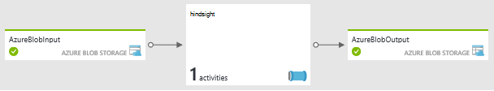
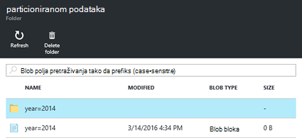
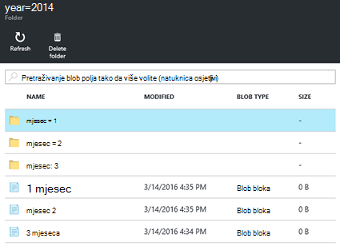

<properties
   pageTitle="Stvaranje klastere Hadoop Linux utemeljen na zahtjev u HDInsight pomoću Azure podataka tvorničke | Microsoft Azure"
    description="Saznajte kako stvoriti na zahtjev HDInsight klastere pomoću tvorničke Azure podataka."
   services="hdinsight"
   documentationCenter=""
   tags="azure-portal"
   authors="mumian"
   manager="jhubbard"
   editor="cgronlun"/>

<tags
   ms.service="hdinsight"
   ms.devlang="na"
   ms.topic="article"
   ms.tgt_pltfrm="na"
   ms.workload="big-data"
   ms.date="10/06/2016"
   ms.author="jgao"/>

# Stvaranje klastere Hadoop Linux utemeljen na zahtjev u HDInsight pomoću tvorničke Azure podataka

[AZURE.INCLUDE [selector](../../includes/hdinsight-selector-create-clusters.md)]

[Azure podataka tvorničke](../data-factory/data-factory-introduction.md) je oblaku podataka Integracija servis orchestrates i automatizira premještanja i transformacije podataka. U ovom se članku saznati kako Azure tvorničke podataka da biste stvorili [povezane usluge na zahtjev za Azure HDInsight](../data-factory/data-factory-compute-linked-services.md#azure-hdinsight-on-demand-linked-service)i pomoću klaster Pokreni grozd. Evo protok više razine:

1. Stvaranje programa HDInsight klaster na zahtjev.
2. Pokrenite grozd zadatak za čitanje podaci iz zapisnika neobrađenog web s računa spremišta blobova platforme izvora, pretvaranje podataka i pisanje izlaz s računom za spremište blobova platforme odredište. 
3. Brisanje klaster ovisno o postavci vrijeme važenja.

Aktivnosti grozd definirano u pozivi kanal na tvorničke podataka unaprijed definirane HiveQL skriptu. Skripta stvara vanjsku tablicu koja se odnosi na neobrađenog web zapisnika podataka pohranjenih u spremište blobova platforme Azure, a zatim po godini i mjesecu partitions sirovim podacima.

Evo oglednih redaka za svaki mjesec u ulaznoj datoteci.

    2014-01-01,02:01:09,SAMPLEWEBSITE,GET,/blogposts/mvc4/step2.png,X-ARR-LOG-ID=2ec4b8ad-3cf0-4442-93ab-837317ece6a1,80,-,1.54.23.196,Mozilla/5.0+(Windows+NT+6.3;+WOW64)+AppleWebKit/537.36+(KHTML,+like+Gecko)+Chrome/31.0.1650.63+Safari/537.36,-,http://weblogs.asp.net/sample/archive/2007/12/09/asp-net-mvc-framework-part-4-handling-form-edit-and-post-scenarios.aspx,\N,200,0,0,53175,871 
    2014-02-01,02:01:10,SAMPLEWEBSITE,GET,/blogposts/mvc4/step7.png,X-ARR-LOG-ID=d7472a26-431a-4a4d-99eb-c7b4fda2cf4c,80,-,1.54.23.196,Mozilla/5.0+(Windows+NT+6.3;+WOW64)+AppleWebKit/537.36+(KHTML,+like+Gecko)+Chrome/31.0.1650.63+Safari/537.36,-,http://weblogs.asp.net/sample/archive/2007/12/09/asp-net-mvc-framework-part-4-handling-form-edit-and-post-scenarios.aspx,\N,200,0,0,30184,871
    2014-03-01,02:01:10,SAMPLEWEBSITE,GET,/blogposts/mvc4/step7.png,X-ARR-LOG-ID=d7472a26-431a-4a4d-99eb-c7b4fda2cf4c,80,-,1.54.23.196,Mozilla/5.0+(Windows+NT+6.3;+WOW64)+AppleWebKit/537.36+(KHTML,+like+Gecko)+Chrome/31.0.1650.63+Safari/537.36,-,http://weblogs.asp.net/sample/archive/2007/12/09/asp-net-mvc-framework-part-4-handling-form-edit-and-post-scenarios.aspx,\N,200,0,0,30184,871

Skripta stvara tri izlazne mape koji se temelji na prethodni unos. Svakoj mapi sadrži datoteku sa stavkama svaki mjesec.

    adfgetstarted/partitioneddata/year=2014/month=1/000000_0
    adfgetstarted/partitioneddata/year=2014/month=2/000000_0
    adfgetstarted/partitioneddata/year=2014/month=3/000000_0

Popis aktivnosti podataka tvorničke podataka transformaciju osim aktivnosti grozd, potražite u članku [Pretvaranje i analizirati pomoću tvorničke Azure podataka](../data-factory/data-factory-data-transformation-activities.md).

Postoje brojne prednosti s HDInsight pomoću tvorničke podataka:

- HDInsight klastere naplata je raspodijeliti u minuti, bez obzira koristite li ih ili ne. Korištenje tvorničke podataka, skupina se stvaraju na zahtjev. I skupina brišu se automatski kada se dovrše zadatke.  Stoga samo plaćate za posao izvodi vrijeme i kratko vrijeme neaktivnosti (vrijeme važenja).
- Možete stvoriti tijek rada pomoću podataka tvorničke kanal.
- Mogu zakazivati zadatke rekurzivne.  

> [AZURE.NOTE] Trenutno, možete stvoriti samo verzije klaster HDInsight koji se temelji na Linux 3,2 na tvorničke Azure podataka.

##Preduvjeti:

Prije nego počnete upute u ovom članku, morate imati sljedeće stavke:

- [Azure pretplate](https://azure.microsoft.com/documentation/videos/get-azure-free-trial-for-testing-hadoop-in-hdinsight/).
- Azure EŽA ili Azure PowerShell. 

    [AZURE.INCLUDE [use-latest-version](../../includes/hdinsight-use-latest-powershell-and-cli.md)]

##Priprema za pohranu računa

Možete koristiti do tri računa za pohranu u ovom scenariju:

- Zadani prostor za pohranu računa za HDInsight klaster
- račun za pohranu za unos podataka
- račun za pohranu za izlazne podatke

Da biste pojednostavnili vodič pomoću jednog računa za pohranu da bi služio tri svrhe. Azure EŽA i Azure PowerShell ogledne skripte pronaći u ovom odjeljku izvedite sljedeće zadatke:

1. Prijavite se u sustav Azure.
2. Stvaranje grupe sustava Azure resursa.
3. Stvorite račun za Azure prostora za pohranu.
4. Stvaranje spremnika Blob na računu za pohranu
5. Kopirajte sljedeće dvije datoteke spremniku Blob:

    - Unos podatkovna datoteka: [https://hditutorialdata.blob.core.windows.net/adfhiveactivity/inputdata/input.log](https://hditutorialdata.blob.core.windows.net/adfhiveactivity/inputdata/input.log)
    - Skripta HiveQL: [https://hditutorialdata.blob.core.windows.net/adfhiveactivity/script/partitionweblogs.hql](https://hditutorialdata.blob.core.windows.net/adfhiveactivity/script/partitionweblogs.hql)

    Obje datoteke spremaju se u spremniku javno Blob. 

>[AZURE.IMPORTANT] Zapišite naziv grupe resursa, naziv računa za pohranu i ključ za račun za pohranu koriste u skriptu.  Ćete ih u sljedećem odjeljku.

**Priprema prostora za pohranu i kopirajte datoteke pomoću EŽA Azure**

    azure login
    
    azure config mode arm

    azure group create --name "<Azure Resource Group Name>" --location "East US 2"

    azure storage account create --resource-group "<Azure Resource Group Name>" --location "East US 2" --type "LRS" <Azure Storage Account Name>

    azure storage account keys list --resource-group "<Azure Resource Group Name>" "<Azure Storage Account Name>"
    azure storage container create "adfgetstarted" --account-name "<Azure Storage AccountName>" --account-key "<Azure Storage Account Key>"

    azure storage blob copy start "https://hditutorialdata.blob.core.windows.net/adfhiveactivity/inputdata/input.log" --dest-account-name "<Azure Storage Account Name>" --dest-account-key "<Azure Storage Account Key>" --dest-container "adfgetstarted" 
    azure storage blob copy start "https://hditutorialdata.blob.core.windows.net/adfhiveactivity/script/partitionweblogs.hql" --dest-account-name "<Azure Storage Account Name>" --dest-account-key "<Azure Storage Account Key>" --dest-container "adfgetstarted" 

Naziv spremnik je *adfgetstarted*.  Zadrži kao što je. U suprotnom ćete morati ažurirati predložak Upravljanje resursima.

Ako vam je potrebna pomoć za tu skriptu EŽA, pogledajte odjeljak [Korištenje EŽA Azure s Azure prostora za pohranu](../storage/storage-azure-cli.md).

**Da biste pripremili prostora za pohranu i kopiranje datoteka pomoću komponente PowerShell Azure**

    $resourceGroupName = "<Azure Resource Group Name>"
    $storageAccountName = "<Azure Storage Account Name>"
    $location = "East US 2"

    $sourceStorageAccountName = "hditutorialdata"  
    $sourceContainerName = "adfhiveactivity"

    $destStorageAccountName = $storageAccountName
    $destContainerName = "adfgetstarted" # don't change this value.

    ####################################
    # Connect to Azure
    ####################################
    #region - Connect to Azure subscription
    Write-Host "`nConnecting to your Azure subscription ..." -ForegroundColor Green
    try{Get-AzureRmContext}
    catch{Login-AzureRmAccount}
    #endregion

    ####################################
    # Create a resource group, storage, and container
    ####################################

    #region - create Azure resources
    Write-Host "`nCreating resource group, storage account and blob container ..." -ForegroundColor Green

    New-AzureRmResourceGroup -Name $resourceGroupName -Location $location 
    New-AzureRmStorageAccount `
        -ResourceGroupName $resourceGroupName `
        -Name $destStorageAccountName `
        -type Standard_LRS `
        -Location $location 

    $destStorageAccountKey = (Get-AzureRmStorageAccountKey `
        -ResourceGroupName $resourceGroupName `
        -Name $destStorageAccountName)[0].Value

    $sourceContext = New-AzureStorageContext `
        -StorageAccountName $sourceStorageAccountName `
        -Anonymous
    $destContext = New-AzureStorageContext `
        -StorageAccountName $destStorageAccountName `
        -StorageAccountKey $destStorageAccountKey

    New-AzureStorageContainer -Name $destContainerName -Context $destContext
    #endregion

    ####################################
    # Copy files
    ####################################
    #region - copy files
    Write-Host "`nCopying files ..." -ForegroundColor Green

    $blobs = Get-AzureStorageBlob `
        -Context $sourceContext `
        -Container $sourceContainerName 

    $blobs|Start-AzureStorageBlobCopy `
        -DestContext $destContext `
        -DestContainer $destContainerName

    Write-Host "`nCopied files ..." -ForegroundColor Green
    Get-AzureStorageBlob -Context $destContext -Container $destContainerName 
    #endregion

    Write-host "`nYou will use the following values:" -ForegroundColor Green
    write-host "`nResource group name: $resourceGroupName"
    Write-host "Storage Account Name: $destStorageAccountName"
    write-host "Storage Account Key: $destStorageAccountKey"

    Write-host "`nScript completed" -ForegroundColor Green

Ako vam je potrebna pomoć za tu skriptu PowerShell potražite u članku [pomoću komponente PowerShell Azure s Azure prostora za pohranu](../storage/storage-powershell-guide-full.md).

**Da biste pregledali račun za pohranu i sadržaj**

1. Prijavite se [portal za Azure](https://portal.azure.com).
2. U lijevom oknu kliknite **grupe resursa** .
3. Dvokliknite naziv grupe resursa koje ste stvorili u skriptu EŽA ili PowerShell. Ako imate previše grupa resursa na popisu, koristite filtar. 
4. Na pločici **Resursi** moraju imati jedan resurs na popisu osim ako je grupa resursa zajedničko korištenje s drugim projektima. Koji je resurs je račun za pohranu pod nazivom koje ste prethodno naveli. Kliknite naziv računa za pohranu.
5. Kliknite pločice **blob-ova** .
6. Kliknite kontejner **adfgetstarted** . Pogledajte dvije mape: **unos podataka** i **skriptu**.
7. Otvorite mapu, a zatim Provjera datoteka u mape.
 
## Stvaranje tvorničke podataka

S računom za pohranu, ulaznih podataka i skripte HiveQL pripremljeni, spremni ste za stvaranje na tvorničke Azure podataka. Za stvaranje tvorničke podataka na nekoliko načina. Pomoću portala za Azure poziva prilagođeni predložak Upravljanje resursima pomoću ovog praktičnog vodiča. Upravljanje resursima predložak možete nazvati i [EŽA Azure](../resource-group-template-deploy.md#deploy-with-azure-cli-for-mac-linux-and-windows) i [Azure PowerShell](../resource-group-template-deploy.md#deploy-with-powershell). Druge načine za stvaranje tvorničke podataka potražite u članku [Praktični vodič: Stvaranje vaš prvi tvorničke podataka](../data-factory/data-factory-build-your-first-pipeline.md).

Upravljanje resursima predlošku najviše razine sadrži:

    {
        "contentVersion": "1.0.0.0",
        "$schema": "http://schema.management.azure.com/schemas/2015-01-01/deploymentTemplate.json#",
        "parameters": { ...
        },
        "variables": { ...
        },
        "resources": [
            {
                "name": "[parameters('dataFactoryName')]",
                "apiVersion": "[variables('apiVersion')]",
                "type": "Microsoft.DataFactory/datafactories",
                "location": "westus",
                "resources": [
                    { ... },
                    { ... },
                    { ... },
                    { ... }
                ]
            }
        ]
    }

Sadrži jedan resurs tvorničke podataka naziva *hdinsight grozd na zahtjev* (naziva se ne prikazuju na snimku zaslona). Tvorničke podataka trenutno podržava samo u području Zapad SAD-a i regija Sjeverne Europe. 

*Hdinsight grozd na zahtjev* resursa sadrži četiri resurse:

- Linkedservice račun prostora za pohranu koji se koristi kao zadanog računa za HDInsight prostora za pohranu, ulaznih podataka za pohranu i spremište podataka za izlaz.
- Linkedservice klaster HDInsight će biti stvoren:

        {
            "dependsOn": [ ... ],
            "type": "linkedservices",
            "name": "[variables('hdInsightOnDemandLinkedServiceName')]",
            "apiVersion": "[variables('apiVersion')]",
            "properties": {
                "type": "HDInsightOnDemand",
                "typeProperties": {
                    "osType": "linux",
                    "version": "3.2",
                    "clusterSize": 1,
                    "sshUserName": "myuser",                            
                    "sshPassword": "MyPassword!",
                    "timeToLive": "00:30:00",
                    "linkedServiceName": "[variables('storageLinkedServiceName')]"
                }
            }
        },

    Čak i ako nije naveden, Klaster se stvara u području isti kao račun za pohranu.
    
    Obratite pozornost na postavku *timeToLive* . Tvorničke podataka automatski brišu skupine nakon Klaster se neaktivne za 30 minuta.
- Skup podataka za unos podataka. Ovdje su definirani naziv datoteke i mape:

        "fileName": "input.log",
        "folderPath": "adfgetstarted/inputdata",
        
- Skup podataka za izlazne podatke, a zatim kanal za obradu podataka. Izlaz put definirana je ovdje:
        
        "folderPath": "adfgetstarted/partitioneddata",

    Postavljanje [dostupnosti skupa podataka](../data-factory/data-factory-create-datasets.md#Availability) je na sljedeći način:
    
        "availability": {
            "frequency": "Month",
            "interval": 1,
            "style": "EndOfInterval"
        },

    U Azure tvorničke podataka, izlazna dataset dostupnost pogoni kanal. To znači da je isječak proizvodi mjesečno na posljednji dan u mjesecu. Dodatne informacije potražite u članku [Planiranje tvorničke podataka i izvršavanje](../data-factory/data-factory-scheduling-and-execution.md).

    Definiciju kanal je na sljedeći način:
    
        {
            "dependsOn": [ ... ],
            "type": "datapipelines",
            "name": "[parameters('dataFactoryName')]",
            "apiVersion": "[variables('apiVersion')]",
            "properties": {
                "description": "Azure Data Factory pipeline with an Hadoop Hive activity",
                "activities": [
                    { ...}
                ],
                "start": "2016-01-01T00:00:00Z",
                "end": "2016-01-31T00:00:00Z",
                "isPaused": false
            }
        }
                
    Sadrži jedan aktivnosti. *Početak* i *Kraj* aktivnosti imaju proteklih datum, što znači da je samo jedan isječak. Ako je na kraj datum u budućnosti, tvorničke podataka stvara drugi isječak kada se vrijeme. Dodatne informacije potražite u članku [Planiranje tvorničke podataka i izvršavanje](../data-factory/data-factory-scheduling-and-execution.md).

    Sljedeću skriptu Json je definiciju aktivnosti:
    
        "activities": [
            {
                "type": "HDInsightHive",
                "typeProperties": {
                    "scriptPath": "adfgetstarted/script/partitionweblogs.hql",
                    "scriptLinkedService": "[variables('storageLinkedServiceName')]",
                    "defines": {
                        "inputtable": "[concat('wasbs://adfgetstarted@', parameters('storageAccountName'), '.blob.core.windows.net/inputdata')]",
                        "partitionedtable": "[concat('wasbs://adfgetstarted@', parameters('storageAccountName'), '.blob.core.windows.net/partitioneddata')]"
                    }
                },
                "inputs": [
                    {
                        "name": "AzureBlobInput"
                    }
                ],
                "outputs": [
                    {
                        "name": "AzureBlobOutput"
                    }
                ],
                "policy": {
                    "concurrency": 1,
                    "retry": 3
                },
                "name": "RunSampleHiveActivity",
                "linkedServiceName": "HDInsightOnDemandLinkedService"
            }
        ],
    
    Definiraju se ulaza, izlaze i put skripte.
    
**Da biste stvorili podataka tvorničke**

1. Kliknite na sljedećoj slici se prijaviti Azure i otvorite predložak Upravljanje resursima na portalu za Azure. Predložak se nalazi u https://hditutorialdata.blob.core.windows.net/adfhiveactivity/data-factory-hdinsight-on-demand.json. 

    

2. Unesite **DATAFACTORYNAME**, **STORAGEACCOUNTNAME** i **STORAGEACCOUNTKEY** za račun koji ste stvorili u odjeljku zadnju, a zatim kliknite **u redu**. Naziv tvorničke podataka mora biti globalno jedinstveni.
3. U **Grupi resursa**, odaberite istoj grupi resursa koje ste koristili u odjeljku zadnju.
4. Kliknite **pravne uvjete**, a zatim kliknite **Stvori**.
5. Kliknite **Stvori**. Pogledajte na pločici na nadzornoj ploči naziva **implementacije uvođenje predloška**. Pričekajte dok se ne mijenja se tekst pločica naziv grupe resursa. Obično vodi otprilike 20 minuta da biste stvorili programa klaster HDInsight.
6. Kliknite pločicu da biste otvorili grupu resursa. Sada će vidjeti jedan više podataka tvorničke resurs naveden uz račun resursa za pohranu.
7. Kliknite **hdinsight grozd na zahtjev**.
8. Kliknite pločicu **dijagrama** . Dijagram prikazuje jednu aktivnosti s unos skup podataka i na izlazni skup podataka:

    
    
    Imena su definirani u predlošku Upravljanje resursima.
9. Dvokliknite **AzureBlobOutput**.
10. Na na **nedavno ažurirati isječaka**, moraju vidjeti jednog isječka. Ako je status **u tijeku**, pričekajte dok se ne mijenja se u **spreman**.

**Da biste provjerili tvorničke izlaz podataka**

1. Slijedite isti postupak u posljednju sesiju da biste provjerili spremnika spremnik adfgetstarted. Postoje dva nova spremnika osim **adfgetsarted**:

    - adfhdinsight-Hive-on-Demand-hdinsightondemandlinked-xxxxxxxxxxxxx: to je zadana spremnik za klaster HDInsight. Zadani naziv spremnik slijedi uzorak: "adf<yourdatafactoryname>- linkedservicename datetimestamp". 
    - adfjobs: to je spremnik za posao zapisnike ADF.
    
    Izlaz tvorničke podataka se pohranjuju u afgetstarted konfigurirani u predlošku Upravljanje resursima. 
2. Kliknite **adfgetstarted**.
3. Dvokliknite **partitioneddata**. Prikazat će se na **godine = 2014** mapu jer su sve zapisnike web datirana u godini 2014.. 

    

    Ako naniže na popisu vidjet će tri mape za siječanj, veljača i ožujak. I nema zapisnik za svaki mjesec.

    

##Čišćenje vodič

HDInsight povezana uslugom na zahtjev za HDInsight klaster stvara se svaki put kad isječak treba obraditi osim ako postoji postojeće uživo klaster (timeToLive); a Klaster se briše nakon dovršetka obrade. Za svaki klaster tvorničke podataka Azure stvara sustava blobova platforme Azure koristiti kao zadani datotečni sustav za klaster.  Iako se briše HDInsight klaster, spremnik zadani blobova platforme za pohranu i račun povezan pohranu neće se izbrisati. To je namjerno. Dok se obrađuju više isječaka, vidjet ćete mnogo spremnika u Azure blobova. Ako ne morate ih za otklanjanje poteškoća s zadataka, preporučujemo vam da biste izbrisali im smanjiti resursa za pohranu. Imena tih spremnika uzorcima: "adfyourdatafactoryname-linkedservicename-datetimestamp". 

[Voditelj resursa Azure](../azure-resource-manager/resource-group-overview.md) koristi se za implementaciju, upravljanje i praćenje rješenje grupno.  Brisanje grupe resursa izbrisat će se sve komponente unutar grupe.  

**Da biste izbrisali grupu resursa**

1. Prijavite se [portal za Azure](https://portal.azure.com).
2. U lijevom oknu kliknite **grupe resursa** .
3. Dvokliknite naziv grupe resursa koje ste stvorili u skriptu EŽA ili PowerShell. Ako imate previše grupa resursa na popisu, koristite filtar. Grupa resursa otvara se u novi plohu.
4. Na pločici **Resursi** moraju imati zadani račun za pohranu i tvorničke podataka na popisu osim ako je grupa resursa zajedničko korištenje s drugim projektima.
5. Pri vrhu stranice na plohu kliknite **Izbriši** . Time će možete izbrisati račun za pohranu i podatke pohranjene u račun za pohranu.
6. Unesite naziv grupe resursa, a zatim kliknite **Izbriši**.

U slučaju da ne želite da biste izbrisali račun za pohranu kad izbrišete grupu resursa, razmislite o sljedeće arhitektura dizajna tako što poslovnih podataka od zadanog računa za pohranu. U ovom slučaju, imat ćete jedne grupe resursa za pohranu račun s poslovnim podacima i druge grupe resursa za zadani račun za pohranu i tvorničke podataka.  Kada izbrišete u drugu grupu resursa, ne utječe račun prostora za pohranu poslovnih podataka.  Da biste to učinili: 

- Dodajte sljedeće grupe najviše razine resursa uz Microsoft.DataFactory/datafactories resursa u predlošku Upravljanje resursima. Stvara novi prostor za pohranu račun:

        {
            "name": "[parameters('defaultStorageAccountName')]",
            "type": "Microsoft.Storage/storageAccounts",
            "location": "[parameters('location')]",
            "apiVersion": "[variables('defaultApiVersion')]",
            "dependsOn": [ ],
            "tags": {

            },
            "properties": {
                "accountType": "Standard_LRS"
            }
        },

- Dodajte novi točku povezane usluge novi prostor za pohranu račun:

        {
            "dependsOn": [ "[concat('Microsoft.DataFactory/dataFactories/', parameters('dataFactoryName'))]" ],
            "type": "linkedservices",
            "name": "[variables('defaultStorageLinkedServiceName')]",
            "apiVersion": "[variables('apiVersion')]",
            "properties": {
                "type": "AzureStorage",
                "typeProperties": {
                    "connectionString": "[concat('DefaultEndpointsProtocol=https;AccountName=',parameters('defaultStorageAccountName'),';AccountKey=',listKeys(resourceId('Microsoft.Storage/storageAccounts', variables('defaultStorageAccountName')), variables('defaultApiVersion')).key1)]"
                }
            }
        },
    
- Konfiguriranje servisa HDInsight zahtjev povezan s dodatnim dependsOn i programa additionalLinkedServiceNames:

        {
            "dependsOn": [
                "[concat('Microsoft.DataFactory/dataFactories/', parameters('dataFactoryName'))]",
                "[concat('Microsoft.DataFactory/dataFactories/', parameters('dataFactoryName'), '/linkedservices/', variables('defaultStorageLinkedServiceName'))]",
                "[concat('Microsoft.DataFactory/dataFactories/', parameters('dataFactoryName'), '/linkedservices/', variables('storageLinkedServiceName'))]"
                
            ],
            "type": "linkedservices",
            "name": "[variables('hdInsightOnDemandLinkedServiceName')]",
            "apiVersion": "[variables('apiVersion')]",
            "properties": {
                "type": "HDInsightOnDemand",
                "typeProperties": {
                    "osType": "linux",
                    "version": "3.2",
                    "clusterSize": 1,
                    "sshUserName": "myuser",                            
                    "sshPassword": "MyPassword!",
                    "timeToLive": "00:30:00",
                    "linkedServiceName": "[variables('storageLinkedServiceName')]",
                    "additionalLinkedServiceNames": "[variables('defaultStorageLinkedServiceName')]"
                }
            }
        },            

##Daljnji koraci
U ovom se članku ste naučili kako koristiti tvorničke Azure podataka da biste stvorili klaster HDInsight na zahtjev za obradu grozd zadatke. Za dodatne informacije:

- [Hadoop Praktični vodič: početak rada s operacijskim sustavom Linux Hadoop u HDInsight](hdinsight-hadoop-linux-tutorial-get-started.md)
- [Stvaranje klastere sustavom Linux Hadoop u HDInsight](hdinsight-hadoop-provision-linux-clusters.md)
- [Dokumentacija HDInsight](https://azure.microsoft.com/documentation/services/hdinsight/)
- [Dokumentacija tvorničke podataka](https://azure.microsoft.com/documentation/services/data-factory/)

