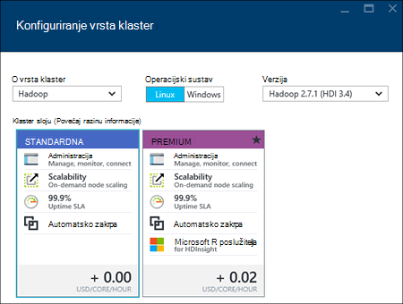

<properties
    pageTitle="Stvaranje Hadoop, HBase, oluja ili Spark klastere na Linux u HDInsight pomoću portala za | Microsoft Azure"
    description="Saznajte kako stvoriti Hadoop, HBase, oluja ili Spark klastere na Linux za HDInsight pomoću web-preglednika i portalu Azure pretpregled."
    services="hdinsight"
    documentationCenter=""
    authors="nitinme"
    manager="jhubbard"
    editor="cgronlun"
    tags="azure-portal"/>

<tags
    ms.service="hdinsight"
    ms.devlang="na"
    ms.topic="article"
    ms.tgt_pltfrm="na"
    ms.workload="big-data"
    ms.date="10/05/2016"
    ms.author="nitinme"/>

#Stvaranje sustavom Linux klastere u HDInsight pomoću portala za Azure

[AZURE.INCLUDE [selector](../../includes/hdinsight-selector-create-clusters.md)]

Portal za Azure je alat za upravljanje utemeljen na webu za usluge i resurse smješten u oblak Microsoft Azure. U ovom članku će Saznajte kako stvoriti klastere sustavom Linux HDInsight pomoću portala za.

## Preduvjeti

[AZURE.INCLUDE [delete-cluster-warning](../../includes/hdinsight-delete-cluster-warning.md)]

- **Mogući Azure pretplate**. Pogledajte [Početak Azure besplatnu probnu verziju](https://azure.microsoft.com/documentation/videos/get-azure-free-trial-for-testing-hadoop-in-hdinsight/).
- __Moderna web-pregledniku__. Portal za Azure koristi HTML5 i Javascript i možda se neće pravilno funkcionirati u starije web-preglednika.

### Preduvjeti za kontrolu pristupa

[AZURE.INCLUDE [access-control](../../includes/hdinsight-access-control-requirements.md)]

##Stvaranje klastere

Portal za Azure izlaže Većina klaster svojstava. Pomoću predloška Azure Voditelj resursa, možete sakriti mnogo pojedinosti. Dodatne informacije potražite u članku [utemeljen na stvaranje Linux Hadoop klaster u HDInsight pomoću predložaka Azure Voditelj resursa](hdinsight-hadoop-create-linux-clusters-arm-templates.md).

1. Prijavite se na [portal za Azure](https://portal.azure.com).

2. Kliknite **NOVO**, kliknite **Analize podataka**, a zatim **HDInsight**.

    ![Stvaranje nove klaster na portalu za Azure] (./media/hdinsight-hadoop-create-linux-cluster-portal/HDI.CreateCluster.1.png "Stvaranje nove klaster na portalu za Azure")
3. Unesite **Naziv klaster**: taj naziv mora biti globalno jedinstveni.
4. Kliknite **Odaberite vrstu klaster**, a zatim odaberite:

    - **Vrsta klaster**: Ako ne znate što da biste odabrali, odaberite **Hadoop**. To je najčešće korištene vrsta klaster.

        > [AZURE.IMPORTANT] HDInsight klastere Dođite na razne vrste koji odgovara radno opterećenje ni tehnologija koja klaster postavljen je za. Ne postoji podržani način da biste stvorili klaster koji kombinira više vrsta, kao što su oluja i HBase na jedan klaster. 

    - **Operacijski sustav**: odaberite **Linux**.
    - **Verzija**: koristite zadanu verziju ako ne znate što da biste odabrali. Dodatne informacije potražite u članku [HDInsight klaster verzije](hdinsight-component-versioning.md).
    - **Klaster sloju**: Azure HDInsight nudi ponude oblaka velikih skupova podataka u dvije kategorije: standardne sloju i Premium sloju. Dodatne informacije potražite u članku [klaster razine](hdinsight-hadoop-provision-linux-clusters.md#cluster-tiers).
    
    

4. Kliknite **pretplatu** da biste odabrali Azure pretplatu koja će se koristiti za klaster.

5. Kliknite **Grupu resursa** da biste odabrali postojeću grupu resursa ili kliknite **Novo** da biste stvorili novu grupu resursa

    > [AZURE.NOTE] Stavka će prema zadanim postavkama neke postojeće grupe resursa, ako su neki dostupni.

6. Kliknite **vjerodajnice** , a zatim unesite lozinku za korisnika za administratore. Morate unijeti i **SSH korisničko ime** i ili **lozinku** ili **JAVNI KLJUČ**, koji će se koristiti za provjeru autentičnosti korisnika SSH. Javni ključ je preporučeni način. Kliknite **Odaberi** pri dnu da biste spremili konfiguracije vjerodajnice.

    ![Osiguraj klaster vjerodajnice] (./media/hdinsight-hadoop-create-linux-cluster-portal/HDI.CreateCluster.3.png "Osiguraj klaster vjerodajnice")

    Dodatne informacije o korištenju SSH sa servisa HDInsight potražite u nekom od sljedećih članaka:

    * [Korištenje SSH sa sustavom Linux Hadoop na HDInsight Linux, Unix ili OS X](hdinsight-hadoop-linux-use-ssh-unix.md)
    * [Korištenje SSH sa sustavom Linux Hadoop na HDInsight iz sustava Windows](hdinsight-hadoop-linux-use-ssh-windows.md)

7. Kliknite **Izvor podataka** da biste odabrali postojećeg izvora podataka za klaster ili stvorite novi.

    ![Plohu izvora podataka] (./media/hdinsight-hadoop-create-linux-cluster-portal/HDI.CreateCluster.4.png "Izvor podataka osiguraj konfiguracija")

    Trenutno možete odabrati račun za pohranu Azure kao izvor podataka za programa klaster HDInsight. Koristite sljedeće da biste shvatili stavke na plohu **Izvora podataka** .

    - **Odabir načina**: postaviti na **iz svih pretplata** da biste omogućili pregledavanje računa za pohranu iz svoje pretplate. Postavite to na **Tipkovnog** ako želite unijeti **Naziv prostora za pohranu** i **Tipkovni prečac** postojećeg računa za pohranu.

    - **Odaberite račun za pohranu / novi**: kliknite Pregledaj, a zatim odaberite postojeći račun za pohranu koji želite pridružiti klaster **Odaberite račun za pohranu** . Ili kliknite **Novo** da biste stvorili novi račun za pohranu. Pomoću polja koji se pojavljuje unesite naziv računa za pohranu. Zelena kvačica pojavit će se ako je naziv dostupan.

    - **Odaberite zadani spremnik**: tom se mogućnošću poslužite da biste unijeli naziv spremnika zadanog želite koristiti za klaster. Iako možete unijeti bilo koje ime, preporučujemo da koriste isti naziv kao klaster tako da možete jednostavno prepoznati spremnik služi za ovaj određene klaster.

    - **Lokacija**: koji se računa za pohranu ili stvorit će se u regiji.

        > [AZURE.IMPORTANT] Odabir mjesta za zadani izvor podataka i postavljanje mjesta klaster HDInsight. Izvor podataka za klaster i zadane moraju nalaziti u istom području.
        
    - **Identitet AAD klaster**: konfiguriranjem ga, napravite klaster pristupačnim trgovine Azure podataka Lake ovisno o konfiguraciji AAD.

    Kliknite da biste spremili konfiguracije izvora podataka **Odaberite** .

8. Kliknite **Čvor cijene razine** za prikaz informacija o čvorove za ovaj klaster stvorit će se. Postavite broj radnih čvorove koje su vam potrebne za klaster. Procijenjena trošak klaster prikazat će se unutar na plohu.

    ![Čvor cijene razine plohu] (./media/hdinsight-hadoop-create-linux-cluster-portal/HDI.CreateCluster.5.png "Navedite broj čvorove klaster")
    
    > [AZURE.IMPORTANT] Ako planirate na više od 32 tempiranja čvorove na klaster stvaranja ili tako da skaliranje skupine nakon stvaranja, morate odabrati glavni čvor veličina s najmanje 8 jezgri i 14GB RAM-a.
    >
    > Dodatne informacije o čvor veličine i pridruženi troškova potražite u članku [HDInsight cijene](https://azure.microsoft.com/pricing/details/hdinsight/).

    Kliknite **Odaberite** da biste spremili čvor konfiguraciju cijene.

9. Kliknite **Neobavezno konfiguracije** odaberite verziju klaster, kao i konfigurirajte ostale neobavezne postavke kao što su pridruživanje **Virtualne mreže**, postavljanje **Vanjskog Metastore** veličini podataka za grozd i Oozie, koristite akcije skripte da biste prilagodili klaster da biste instalirali prilagođene komponente ili dodatni prostor za pohranu računa s klaster.

    * **Virtualne mreže**: Odaberite Azure virtualne mreže i podmreži ako želite smjestiti klaster u virtualne mreže.  

        ![Plohu virtualne mreže] (./media/hdinsight-hadoop-create-linux-cluster-portal/HDI.CreateCluster.6.png "Odredite virtualna mreža detalja")

        Informacije o korištenju servisa HDInsight s virtualne mreže, uključujući određenu konfiguraciju preduvjeti za virtualne mreže potražite u članku [Mogućnosti proširivanje servisa HDInsight pomoću Azure virtualne mreže](hdinsight-extend-hadoop-virtual-network.md).

    * Kliknite **Vanjski Metastores** da biste odredili SQL baze podataka koji želite koristiti da biste spremili grozd i Oozie metapodataka povezanih sa klaster.
    
        > [AZURE.NOTE] Konfiguracija Metastore nije dostupna za HBase klaster vrste.

        ![Prilagođeni metastores plohu] (./media/hdinsight-hadoop-create-linux-cluster-portal/HDI.CreateCluster.7.png "Navedite vanjske metastores")

        Za **Korištenje postojeće baze podataka SQL za grozd** metapodatke kliknite **da**i odaberite bazom podataka SQL, a zatim unesite korisničko ime i lozinku za bazu podataka. Ako želite koristiti **Postojeće baze podataka SQL za Oozie metapodatke**, ponovite te korake. Kliknite **Odaberi** dok ne provjerite jesu ponovno uključite plohu **Neobavezno konfiguracije** .

        >[AZURE.NOTE] Baze podataka Azure SQL koristi za na metastore morate dopustiti veza s drugih Azure servisa, uključujući Azure HDInsight. Na Azure SQL baza podataka nadzorne ploče, na desnoj strani kliknite naziv poslužitelja. Ovo je poslužitelja na kojem se izvodi instanca baze podataka SQL. Kad se na prikaz poslužitelja kliknite **Konfiguriraj**, a zatim za **Servisa Azure**kliknite **da**i zatim kliknite **Spremi**.

        &nbsp;

        > [AZURE.IMPORTANT] Kada stvarate na metastore, nemojte koristiti naziv baze podataka koja sadrži crtice ili crtice, kao što je to može uzrokovati postupak stvaranja klaster uvoza.

    * **Akcije skripte** ako želite koristiti prilagođenu skriptu da biste prilagodili klaster, kao klaster je stvoren. Dodatne informacije o akcije skripte potražite u članku [Prilagodba HDInsight klastere pomoću skripte akcije](hdinsight-hadoop-customize-cluster-linux.md). Na plohu akcije skripte sadrže detalje kao što je prikazano u snimku zaslona.

        ![Skripta akcija plohu] (./media/hdinsight-hadoop-create-linux-cluster-portal/HDI.CreateCluster.8.png "Navedite skripte akcija")

    * Kliknite **Povezane poslovne subjekte prostora za pohranu** da biste naveli dodatni prostor za pohranu račune želite pridružiti klaster. U plohu **Azure prostora za pohranu tipke** kliknite **Dodaj ključa za pohranu**i odaberite postojeći račun za pohranu ili stvorite novi račun.

        ![Dodatni prostor za pohranu plohu] (./media/hdinsight-hadoop-create-linux-cluster-portal/HDI.CreateCluster.9.png "Navedite dodatni prostor za pohranu računa")

        Dodatni prostor za pohranu račune možete dodati i nakon stvaranja klaster.  Potražite u članku [Prilagodba Linux sustavom HDInsight klastere pomoću skripte akcije](hdinsight-hadoop-customize-cluster-linux.md).

        Dok se ponovno uključite plohu **Novi HDInsight klaster** , kliknite **Odaberi** .
        
        Osim računa spremišta blobova platforme, možete povezati i služi za pohranu Lake Azure podataka. Može biti konfiguraciju tako da konfigurirate AAD iz izvora podataka koje ste konfigurirali zadanog računa za pohranu i zadane spremnik.

10. Na plohu **Novi HDInsight klaster** provjerite je li odabran **Prikvači na Startboard** , a zatim kliknite **Stvori**. To će stvoriti klaster i dodavanje pločice za njega Startboard portalom Azure. Ikona označava je dodjeljivanje klaster, a promijenit će se prikazati ikona HDInsight nakon dodjele resursa dovrši.

  	| Prilikom dodjele resursa | Dodjeljivanje dovršeno |
  	| ------------------ | --------------------- |
  	|  |  |

    > [AZURE.NOTE] To će potrajati nekoliko klaster će biti stvoren obično oko 15 minuta. Koristite pločicu na Startboard ili stavku **obavijesti** na lijevoj strani stranice da biste provjerili na postupka dodjele resursa.

11. Kada završi postupak stvaranja, kliknite pločicu za klaster iz Startboard da biste pokrenuli plohu klaster. Plohu klaster sadrži ključne informacije o klaster kao što su ime, grupa resursa koji pripada, mjesto, operacijskom sustavu, URL-a za klaster nadzorne ploče, itd.

    ![Plohu klaster] (./media/hdinsight-hadoop-create-linux-cluster-portal/HDI.Cluster.Blade.png "Svojstva klaster")

    Da biste razumjeli ikone pri vrhu ovog plohu pa u odjeljku **Osnove** , koristite sljedeće:

    * **Postavke** i **Sve**: prikazuje plohu **Postavke** za klaster, koji vam omogućuje pristup konfiguracije detaljne informacije o klaster.

    * **Nadzorna ploča**, **Klaster nadzorne ploče**i **URL**: to su svi načini pristupa nadzorne ploče klaster, što je web-portal za izvođenje zadataka na klaster.

    * **Sigurne ljuske**: informacije potrebne za pristup klaster pomoću SSH.

    * **Brisanje**: briše klaster HDInsight.

    * **Brzi početak rada** (): prikazuje informacije koje će vam olakšati početak rada s HDInsight.

    * **Korisnici** (): omogućuje postavljanje dozvola za _Upravljanje portala_ ovom klasteru za druge korisnike u sklopu Azure pretplate.

        > [AZURE.IMPORTANT] U ovom _samo_ utječe pristup i dozvole za ovaj klaster na portalu za Azure i ne utječe na koji možete povezati s ili slanje poslove klaster HDInsight.

    * **Oznaka** (): oznake omogućuje postavljanje parove ključa vrijednosti da biste odredili prilagođene taksonomiju oblak servisa. Na primjer, možda stvaranje ključ naziva __projekta__, a zatim pomoću zajednička vrijednost za sve servise povezane s određeni projekt.

##Prilagodba klastere

- U odjeljku [Prilagodba HDInsight klastere pomoću samopokretanja programa](hdinsight-hadoop-customize-cluster-bootstrap.md).
- Potražite u članku [Prilagodba Linux sustavom HDInsight klastere pomoću skripte akcije](hdinsight-hadoop-customize-cluster-linux.md).

##Brisanje klaster

[AZURE.INCLUDE [delete-cluster-warning](../../includes/hdinsight-delete-cluster-warning.md)]

##Daljnji koraci

Sad kad ste stvorili uspješno je HDInsight klaster, koristite sljedeće da biste saznali kako raditi s svoj klaster:

###Hadoop klastere

* [Korištenje grozd s HDInsight](hdinsight-use-hive.md)
* [Korištenje Svinja s HDInsight](hdinsight-use-pig.md)
* [Korištenje MapReduce s HDInsight](hdinsight-use-mapreduce.md)

###HBase klastere

* [Početak rada s HBase na HDInsight](hdinsight-hbase-tutorial-get-started-linux.md)
* [Razvoj aplikacija Java HBase na HDInsight](hdinsight-hbase-build-java-maven-linux.md)

###Klastere oluja

* [Razvoj Java topologija za oluja na HDInsight](hdinsight-storm-develop-java-topology.md)
* [Korištenje komponente Python oluja na HDInsight](hdinsight-storm-develop-python-topology.md)
* [Implementacija i nadzirati topologija s oluja na HDInsight](hdinsight-storm-deploy-monitor-topology-linux.md)

###Spark klaster

* [Stvaranje samostalne aplikacije pomoću Scala](hdinsight-apache-spark-create-standalone-application.md)
* [Pokretanje zadataka na Spark klaster pomoću Livije](hdinsight-apache-spark-livy-rest-interface.md)
* [Spark bi: izvođenje analiza interaktivnih podataka pomoću Spark u HDInsight s alatima za Poslovno obavještavanje](hdinsight-apache-spark-use-bi-tools.md)
* [Spark s strojnog učenja: korištenje Spark u HDInsight za predviđanje rezultata provjere za hranu](hdinsight-apache-spark-machine-learning-mllib-ipython.md)
* [Spark strujeće: Korištenje Spark u HDInsight za izgradnju u stvarnom vremenu strujanje aplikacije](hdinsight-apache-spark-eventhub-streaming.md)
