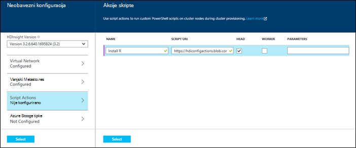
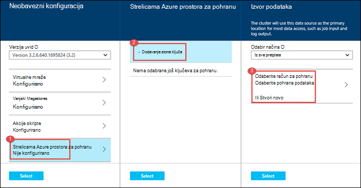

<properties
   pageTitle="Stvaranje klastere Hadoop u HDInsight | Microsoft Azure"
    description="Saznajte kako stvoriti klastere za Azure HDInsight pomoću portala za Azure."
   services="hdinsight"
   documentationCenter=""
   tags="azure-portal"
   authors="mumian"
   manager="jhubbard"
   editor="cgronlun"/>

<tags
   ms.service="hdinsight"
   ms.devlang="na"
   ms.topic="article"
   ms.tgt_pltfrm="na"
   ms.workload="big-data"
   ms.date="09/02/2016"
   ms.author="jgao"/>

# Stvaranje klastere utemeljen na sustavu Windows Hadoop u HDInsight pomoću portala za Azure

[AZURE.INCLUDE [selector](../../includes/hdinsight-selector-create-clusters.md)]

Saznajte kako stvoriti programa klaster Hadoop u HDInsight pomoću portala za Azure. Microsoft [Azure portal](../azure-portal-overview.md) je središnje mjesto gdje možete Dodjela resursa i upravljanje Azure resurse. Portal za Azure je jedan od alata koji omogućuju stvaranje sustavom Linux ili utemeljen na sustavu Windows klaster Hadoop u HDInsight. Radi stvaranja druge klaster alata i značajki kliknite Odaberi kartica pri vrhu stranice ovu stranicu ili pogledajte [načina stvaranja klaster](hdinsight-provision-clusters.md#cluster-creation-methods).

##Preduvjeti:

[AZURE.INCLUDE [delete-cluster-warning](../../includes/hdinsight-delete-cluster-warning.md)]

Prije nego počnete upute u ovom članku, morate imati sljedeće:

- Azure pretplate. Pogledajte [Početak Azure besplatnu probnu verziju](https://azure.microsoft.com/documentation/videos/get-azure-free-trial-for-testing-hadoop-in-hdinsight/).

### Preduvjeti za kontrolu pristupa

[AZURE.INCLUDE [access-control](../../includes/hdinsight-access-control-requirements.md)]

## Stvaranje klastere

**Da biste stvorili programa HDInsight klaster**

1. Prijava na [Portal za Azure](https://portal.azure.com).
2. Kliknite **NOVO**, kliknite **Analize podataka**, a zatim **HDInsight**.

    ![Stvaranje nove klaster na portalu za Azure] (./media/hdinsight-provision-clusters/HDI.CreateCluster.1.png "Stvaranje nove klaster na portalu za Azure")

3. Upišite ili odaberite sljedeće vrijednosti:

    * **Naziv klaster**: Unesite naziv za klaster. Zelena kvačica pojavit će se pokraj naziva klaster Ako naziv nije dostupan.

    * **Klaster vrsta**: odaberite **Hadoop**. Druge mogućnosti inclue **HBase**, **oluja**i **Spark**.

        > [AZURE.IMPORTANT] HDInsight klastere Dođite na razne vrste koji odgovara radno opterećenje ni tehnologija koja klaster postavljen je za. Ne postoji podržani način da biste stvorili klaster koji kombinira više vrsta, kao što su oluja i HBase na jedan klaster.

    * **Klaster operacijski sustav**: odaberite **sustava Windows**. Da biste stvorili Linux osnovni klaster, odaberite **Linux**.
    * **Verzija**: [verzija servisa HDInsight](hdinsight-component-versioning.md)potražite u članku.
    * **Pretplate**: Odaberite Azure pretplatu koja će se koristiti za stvaranje ovoj grupi.
    * **Grupa resursa**: Odaberite postojeću ili stvoriti novu grupu resursa. Stavka će prema zadanim postavkama neke postojeće grupe resursa, ako su neki dostupni.
    * **Vjerodajnice**: Konfiguriranje korisničko ime i lozinku za korisnika Hadoop (HTTP korisnik). Ako omogućite udaljene radne površine za klaster, morat ćete konfigurirati udaljenog računala korisnika korisničko ime i lozinku, a datum isteka računa. Kliknite **Odaberi** pri dnu da biste spremili promjene.

        ![Osiguraj klaster vjerodajnice] (./media/hdinsight-provision-clusters/HDI.CreateCluster.3.png "Osiguraj klaster vjerodajnice")

    * **Izvor podataka**: Stvorite novu ili odaberite postojeći račun za Azure pohranu će se koristiti kao zadani datotečni sustav za klaster.

        ![Plohu izvora podataka] (./media/hdinsight-provision-clusters/HDI.CreateCluster.4.png "Izvor podataka osiguraj konfiguracija")

        * **Odabir načina**: postaviti na **iz svih pretplata** da biste omogućili pregledavanje računa za pohranu iz svoje pretplate. Postavite to na **Tipkovnog** ako želite unijeti **Naziv prostora za pohranu** i **Tipkovni prečac** postojećeg računa za pohranu.
        * **Odaberite račun za pohranu / Stvori novo**: kliknite Pregledaj, a zatim odaberite postojeći račun za pohranu koji želite pridružiti klaster **Odaberite račun za pohranu** . Možete i kliknuti **Stvori novo** da biste stvorili novi račun za pohranu. Pomoću polja koji se pojavljuje unesite naziv računa za pohranu. Zelena kvačica pojavit će se ako je naziv dostupan.
        * **Odaberite zadani spremnik**: tom se mogućnošću poslužite da biste unijeli naziv spremnika zadanog želite koristiti za klaster. Iako možete unijeti bilo koje ime, preporučujemo da koriste isti naziv kao klaster tako da možete jednostavno prepoznati spremnik služi za ovaj određene klaster.
        * **Lokacija**: koji se računa za pohranu ili stvorit će se u regiji. To mjesto će odrediti mjesto klaster.  Klaster i njegov zadanog računa za pohranu morate zajednički pronađite u istom Azure podatkovnog centra.
    
    * **Razine cijena čvor**: Postavljanje broja radnih čvorove koje su vam potrebne za klaster. Procijenjena trošak klaster prikazat će se unutar na plohu.
  

        ![Čvor cijene razine plohu] (./media/hdinsight-provision-clusters/HDI.CreateCluster.5.png "Navedite broj čvorove klaster")

    * **Neobavezni konfiguracije** odaberite verziju klaster, kao i konfigurirajte ostale neobavezne postavke kao što su pridruživanje **Virtualne mreže**, postavljanje **Vanjskog Metastore** veličini podataka za grozd i Oozie, koristite akcije skripte da biste prilagodili klaster da biste instalirali prilagođene komponente ili dodatni prostor za pohranu računa s klaster.

    * **HDInsight verzija**: Odaberite verziju koju želite koristiti za klaster. Dodatne informacije potražite u članku [HDInsight klaster verzije](hdinsight-component-versioning.md).
    * **Virtualne mreže**: Odaberite Azure virtualne mreže i podmreži ako želite smjestiti klaster u virtualne mreže.  

        ![Plohu virtualne mreže] (./media/hdinsight-provision-clusters/HDI.CreateCluster.6.png "Odredite virtualna mreža detalja")

        Informacije o korištenju servisa HDInsight s virtualne mreže, uključujući određenu konfiguraciju preduvjeti za virtualne mreže potražite u članku [capbilities proširivanje servisa HDInsight pomoću Azure virtualne mreže](hdinsight-extend-hadoop-virtual-network.md).
  

        
    * **Vanjski Metastores**: odredite baze podataka Azure SQL za pohranu grozd i Oozie metapodataka povezanih sa klaster.
 
        > [AZURE.NOTE] Konfiguracija Metastore nije dostupna za HBase klaster vrste.

    ![Prilagođeni metastores plohu] (./media/hdinsight-provision-clusters/HDI.CreateCluster.7.png "Navedite vanjske metastores")

    Za **Korištenje postojeće baze podataka SQL za grozd** metapodatke kliknite **da**i odaberite bazom podataka SQL, a zatim unesite korisničko ime i lozinku za bazu podataka. Ako želite koristiti **Postojeće baze podataka SQL za Oozie metapodatke**, ponovite te korake. Kliknite **Odaberi** dok ne provjerite jesu ponovno uključite plohu **Neobavezno konfiguracije** .

    >[AZURE.NOTE] Baze podataka Azure SQL koristi za na metastore morate dopustiti veza s drugih Azure servisa, uključujući Azure HDInsight. Na Azure SQL baza podataka nadzorne ploče, na desnoj strani kliknite naziv poslužitelja. Ovo je poslužitelja na kojem se izvodi instanca baze podataka SQL. Kad se na prikaz poslužitelja kliknite **Konfiguriraj**, a zatim za **Servisa Azure**kliknite **da**i zatim kliknite **Spremi**.

            &nbsp;

            > [AZURE.IMPORTANT] Kada stvarate na metastore, nemojte koristiti naziv baze podataka koja sadrži crtice ili crtice, kao što je to može uzrokovati postupak stvaranja klaster uvoza.
        
        * **Script Actions** if you want to use a custom script to customize a cluster, as the cluster is being created. For more information about script actions, see [Customize HDInsight clusters using Script Action](hdinsight-hadoop-customize-cluster.md). On the Script Actions blade provide the details as shown in the screen capture.
    

            

        * **Azure Storage Keys**: Specify additional storage accounts to associate with the cluster. In the **Azure Storage Keys** blade, click **Add a storage key**, and then select an existing storage account or create a new account.
    

            

4. Kliknite **Stvori**. Odabir **Prikvači na Startboard** će dodati pločicu klaster Startboard Portal. Ikona označava stvoren je klaster, a promijenit će se prikazati ikonu HDInsight nakon stvaranja je dovršena.
    
    To će potrajati nekoliko klaster će biti stvoren obično oko 15 minuta. Koristite pločicu na Startboard ili stavku **obavijesti** na lijevoj strani stranice da biste provjerili na postupka dodjele resursa.
    

5. Nakon stvaranja dovrši, kliknite pločicu za klaster iz Startboard da biste pokrenuli plohu klaster. Plohu klaster sadrži ključne informacije o klaster kao što su ime, grupa resursa koji pripada, mjesto, operacijskom sustavu, URL-a za klaster nadzorne ploče, itd.

    ![Plohu klaster] (./media/hdinsight-provision-clusters/HDI.Cluster.Blade.png "Svojstva klaster")

    Da biste razumjeli ikone pri vrhu ovog plohu pa u odjeljku **Osnove** , koristite sljedeće:

    * **Postavke** i **Sve**: prikazuje plohu **Postavke** za klaster, koji vam omogućuje pristup konfiguracije detaljne informacije o klaster.
    * **Nadzorna ploča**, **Klaster nadzorne ploče**i **URL**: to su svi načini pristupa nadzorne ploče klaster, što je web-portal za izvođenje zadataka na klaster.
    * **Udaljena radna površina**: omogućuje vam omogućiti ili onemogućiti udaljene radne površine na čvorove klaster.
    * **Promjena veličine klaster**: omogućuje vam da biste promijenili broj radnih čvorove za ovaj klaster.
    * **Brisanje**: briše klaster HDInsight.
    * **Brzi početak rada** (): prikazuje informacije koje će vam olakšati početak rada s HDInsight.
    * **Korisnici** (): omogućuje postavljanje dozvola za _Upravljanje portala_ ovom klasteru za druge korisnike u sklopu Azure pretplate.
    

        > [AZURE.IMPORTANT] U ovom _samo_ utječe pristup i dozvole za ovaj klaster na portalu i ne utječe na koji možete povezati s ili slanje poslove klaster HDInsight.
        
    * **Oznaka** (): oznake omogućuje postavljanje parove ključa vrijednosti da biste odredili prilagođene taksonomiju oblak servisa. Na primjer, možda stvaranje ključ naziva __projekta__, a zatim pomoću zajednička vrijednost za sve servise povezane s određeni projekt.

##Prilagodba klastere

- U odjeljku [Prilagodba HDInsight klastere pomoću samopokretanja programa](hdinsight-hadoop-customize-cluster-bootstrap.md).
- U odjeljku [klastere utemeljen na sustavu Windows za prilagođavanje HDInsight pomoću skripte akcije](hdinsight-hadoop-customize-cluster.md).

##Daljnji koraci
U ovom se članku ste naučili nekoliko načina stvaranja programa klaster HDInsight. Dodatne informacije potražite u sljedećim člancima:

* [Početak rada sa servisom Azure HDInsight](hdinsight-hadoop-linux-tutorial-get-started.md) – upute za početak rada s svoj klaster HDInsight
* [Slanje Hadoop poslovi programski](hdinsight-submit-hadoop-jobs-programmatically.md) – Saznajte kako programski slanje zadataka HDInsight
* [Upravljanje Hadoop klastere u HDInsight pomoću portala za Azure](hdinsight-administer-use-management-portal.md)

