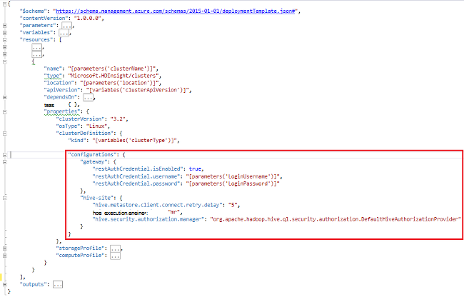

<properties
    pageTitle="Prilagodba klastere HDInsight pomoću samopokretanja programa | Microsoft Azure"
    description="Saznajte kako prilagoditi klastere HDInsight pomoću samopokretanja programa."
    services="hdinsight"
    documentationCenter=""
    authors="mumian"
    manager="jhubbard"
    editor="cgronlun"
    tags="azure-portal"/>

<tags
    ms.service="hdinsight"
    ms.workload="big-data"
    ms.tgt_pltfrm="na"
    ms.devlang="na"
    ms.topic="article"
    ms.date="09/02/2016"
    ms.author="jgao"/>

# Prilagodba klastere HDInsight pomoću samopokretanja programa

Ponekad želite konfigurirati konfiguracijskoj datoteci koji obuhvaćaju:

- clusterIdentity.xml
- Osnovni site.xml
- Gateway.XML
- hbase env.xml
- hbase site.xml
- hdfs site.xml
- Grozd env.xml
- Grozd site.xml
- mapred web-mjesta
- oozie site.xml
- oozie env.xml
- oluja site.xml
- tez site.xml
- webhcat site.xml
- yarn site.xml

Skupina ne možete zadržati promjene zbog ponovno obradu slike. Dodatne informacije o ponovno obradu slike, potražite u članku [Uloga Instance pokreće zbog nadogradnje OS](http://blogs.msdn.com/b/kwill/archive/2012/09/19/role-instance-restarts-due-to-os-upgrades.aspx). Da biste zadržali promjene putem na klastere vijek, možete koristiti HDInsight klaster prilagodbu tijekom procesa stvaranja. To je preporučeni način da biste promijenili konfiguracije klaster te zadržava preko te ponovno pokretanje događaja za Azure reimage ponovno pokrenite računalo. Promjene konfiguracije primjenjuju se prije početka servisa tako da se ne mora ponovno pokrenuti servise. 

Da biste koristili samopokretanja programa 3 načina:

- Koristite Azure PowerShell

    [AZURE.INCLUDE [upgrade-powershell](../../includes/hdinsight-use-latest-powershell.md)]
    
- Korištenje .NET SDK
- Korištenje predloška Azure Voditelj resursa

Informacije o instaliranju dodatne komponente na HDInsight klaster vrijeme stvaranja potražite u članku:

- [Prilagodba klastere HDInsight pomoću skripte Akcije (Linux)](hdinsight-hadoop-customize-cluster-linux.md)
- [Prilagodba klastere HDInsight pomoću skripte Akcije (Windows)](hdinsight-hadoop-customize-cluster.md)

## Koristite Azure PowerShell

Sljedeći kod PowerShell prilagođava grozd konfiguracije:

    # hive-site.xml configuration
    $hiveConfigValues = @{ "hive.metastore.client.socket.timeout"="90" }
    
    $config = New-AzureRmHDInsightClusterConfig `
        | Set-AzureRmHDInsightDefaultStorage `
            -StorageAccountName "$defaultStorageAccountName.blob.core.windows.net" `
            -StorageAccountKey $defaultStorageAccountKey `
        | Add-AzureRmHDInsightConfigValues `
            -HiveSite $hiveConfigValues 
    
    New-AzureRmHDInsightCluster `
        -ResourceGroupName $existingResourceGroupName `
        -ClusterName $clusterName `
        -Location $location `
        -ClusterSizeInNodes $clusterSizeInNodes `
        -ClusterType Hadoop `
        -OSType Windows `
        -Version "3.2" `
        -HttpCredential $httpCredential `
        -Config $config 

Dovršavanje rad skriptu PowerShell pronaći ćete u [Dodatak-A](#hdinsight-hadoop-customize-cluster-bootstrap.md/appx-a:-powershell-sample).

**Da biste potvrdili promjene:**

1. Prijavite se [portal za Azure](https://portal.azure.com).
2. U lijevom oknu kliknite **Pregledaj**, a zatim **Klastere HDInsight**.
3. Kliknite klaster koji ste upravo stvorili pomoću skriptu PowerShell.
4. Kliknite **nadzorna ploča** s vrha na plohu da biste otvorili Ambari korisničkog Sučelja.
5. Kliknite **vrste Hive** na lijevom izborniku.
6. Kliknite **HiveServer2** iz **sažetka**.
7. Kliknite karticu **Configs** .
8. Kliknite **vrste Hive** na lijevom izborniku.
9. Kliknite karticu **Napredno** .
10. Pomaknite se prema dolje, a zatim proširite **Napredne grozd web-mjesta**.
11. Potražite **hive.metastore.client.socket.timeout** u sekciji.

Neke dodatne uzorka za prilagodbu druge konfiguracijske datoteke:

    # hdfs-site.xml configuration
    $HdfsConfigValues = @{ "dfs.blocksize"="64m" } #default is 128MB in HDI 3.0 and 256MB in HDI 2.1

    # core-site.xml configuration
    $CoreConfigValues = @{ "ipc.client.connect.max.retries"="60" } #default 50

    # mapred-site.xml configuration
    $MapRedConfigValues = @{ "mapreduce.task.timeout"="1200000" } #default 600000

    # oozie-site.xml configuration
    $OozieConfigValues = @{ "oozie.service.coord.normal.default.timeout"="150" }  # default 120

Dodatne informacije potražite u članku blog Azim Uddin pod naslovom [Stvaranje prilagodbu klaster HDInsight](http://blogs.msdn.com/b/bigdatasupport/archive/2014/04/15/customizing-hdinsight-cluster-provisioning-via-powershell-and-net-sdk.aspx).

## Korištenje .NET SDK

Potražite u članku [Stvaranje Linux sustavom klastere u HDInsight pomoću .NET SDK](hdinsight-hadoop-create-linux-clusters-dotnet-sdk.md#use-bootstrap).

## Upravljanje resursima pomoću predloška

Samopokretanja programa možete koristiti u predlošku Voditelj resursa:

    "configurations": {
        …
        "hive-site": {
            "hive.metastore.client.connect.retry.delay": "5",
            "hive.execution.engine": "mr",
            "hive.security.authorization.manager": "org.apache.hadoop.hive.ql.security.authorization.DefaultHiveAuthorizationProvider"
        }
    }

## Vidi također

- [Stvaranje klastere Hadoop u HDInsight] [ hdinsight-provision-cluster] sadrži upute o stvaranju programa klaster HDInsight pomoću drugih prilagođene mogućnosti.
- [Razvoj skripti skripte akcija za HDInsight][hdinsight-write-script]
- [Instaliranje i korištenje Spark na klastere HDInsight][hdinsight-install-spark]
- [Instaliranje i korištenje R na klastere HDInsight][hdinsight-install-r]
- [Instalacija i korištenje klaster Solr na HDInsight](hdinsight-hadoop-solr-install.md).
- [Instalacija i korištenje klaster Giraph na HDInsight](hdinsight-hadoop-giraph-install.md).

[hdinsight-install-spark]: hdinsight-hadoop-spark-install.md
[hdinsight-install-r]: hdinsight-hadoop-r-scripts.md
[hdinsight-write-script]: hdinsight-hadoop-script-actions.md
[hdinsight-provision-cluster]: hdinsight-provision-clusters.md
[powershell-install-configure]: powershell-install-configure.md

[img-hdi-cluster-states]: ./media/hdinsight-hadoop-customize-cluster/HDI-Cluster-state.png "Faza tijekom stvaranja klaster"

## Ogledna PowerShell Appx-A:

Ovu skriptu PowerShell stvara sustava HDInsight klaster i prilagođava grozd postavka:

    ####################################
    # Set these variables
    ####################################
    #region - used for creating Azure service names
    $nameToken = "<ENTER AN ALIAS>" 
    #endregion

    #region - cluster user accounts
    $httpUserName = "admin"  #HDInsight cluster username
    $httpPassword = "<ENTER A PASSWORD>" #"<Enter a Password>"

    $sshUserName = "sshuser" #HDInsight ssh user name
    $sshPassword = "<ENTER A PASSWORD>" #"<Enter a Password>"
    #endregion

    ####################################
    # Service names and varialbes
    ####################################
    #region - service names
    $namePrefix = $nameToken.ToLower() + (Get-Date -Format "MMdd")

    $resourceGroupName = $namePrefix + "rg"
    $hdinsightClusterName = $namePrefix + "hdi"
    $defaultStorageAccountName = $namePrefix + "store"
    $defaultBlobContainerName = $hdinsightClusterName

    $location = "East US 2"
    #endregion

    # Treat all errors as terminating
    $ErrorActionPreference = "Stop"

    ####################################
    # Connect to Azure
    ####################################
    #region - Connect to Azure subscription
    Write-Host "`nConnecting to your Azure subscription ..." -ForegroundColor Green
    try{Get-AzureRmContext}
    catch{Login-AzureRmAccount}
    #endregion

    #region - Create an HDInsight cluster
    ####################################
    # Create dependent components
    ####################################
    Write-Host "Creating a resource group ..." -ForegroundColor Green
    New-AzureRmResourceGroup `
        -Name  $resourceGroupName `
        -Location $location

    Write-Host "Creating the default storage account and default blob container ..."  -ForegroundColor Green
    New-AzureRmStorageAccount `
        -ResourceGroupName $resourceGroupName `
        -Name $defaultStorageAccountName `
        -Location $location `
        -Type Standard_GRS

    $defaultStorageAccountKey = (Get-AzureRmStorageAccountKey `
                                    -ResourceGroupName $resourceGroupName `
                                    -Name $defaultStorageAccountName)[0].Value
    $defaultStorageContext = New-AzureStorageContext `
                                    -StorageAccountName $defaultStorageAccountName `
                                    -StorageAccountKey $defaultStorageAccountKey
    New-AzureStorageContainer `
        -Name $defaultBlobContainerName `
        -Context $defaultStorageContext #use the cluster name as the container name

    ####################################
    # Create a configuration object
    ####################################
    $hiveConfigValues = @{ "hive.metastore.client.socket.timeout"="90" }
        
    $config = New-AzureRmHDInsightClusterConfig `
        | Set-AzureRmHDInsightDefaultStorage `
            -StorageAccountName "$defaultStorageAccountName.blob.core.windows.net" `
            -StorageAccountKey $defaultStorageAccountKey `
        | Add-AzureRmHDInsightConfigValues `
            -HiveSite $hiveConfigValues 

    ####################################
    # Create an HDInsight cluster
    ####################################
    $httpPW = ConvertTo-SecureString -String $httpPassword -AsPlainText -Force
    $httpCredential = New-Object System.Management.Automation.PSCredential($httpUserName,$httpPW)

    $sshPW = ConvertTo-SecureString -String $sshPassword -AsPlainText -Force
    $sshCredential = New-Object System.Management.Automation.PSCredential($sshUserName,$sshPW)

    New-AzureRmHDInsightCluster `
        -ResourceGroupName $resourceGroupName `
        -ClusterName $hdinsightClusterName `
        -Location $location `
        -ClusterSizeInNodes 1 `
        -ClusterType Hadoop `
        -OSType Linux `
        -Version "3.2" `
        -HttpCredential $httpCredential `
        -SshCredential $sshCredential `
        -Config $config

    ####################################
    # Verify the cluster
    ####################################
    Get-AzureRmHDInsightCluster -ClusterName $hdinsightClusterName

    #endregion
