<properties
    pageTitle="Prilagodba klastere HDInsight pomoću akcije skripte | Microsoft Azure"
    description="Saznajte kako dodati prilagođene komponente klastere sustavom Linux HDInsight pomoću skripte akcije. Akcije skripte su tulumu skripte koje na čvorove klaster, a možete koristiti da biste prilagodili klaster konfiguraciju ili dodajte dodatne usluge i uslužnih programa kao što su nijanse, Solr ili R."
    services="hdinsight"
    documentationCenter=""
    authors="Blackmist"
    manager="jhubbard"
    editor="cgronlun"
    tags="azure-portal"/>

<tags
    ms.service="hdinsight"
    ms.workload="big-data"
    ms.tgt_pltfrm="na"
    ms.devlang="na"
    ms.topic="article"
    ms.date="09/06/2016"
    ms.author="larryfr"/>

# Prilagodba klastere sustavom Linux HDInsight pomoću skripte akcije

HDInsight nudi konfiguracije mogućnost pod nazivom **Akcija skripte** poziva prilagođene skripte Prilagodba klaster. Te skripte može se koristiti tijekom stvaranja klaster ili na već izvodi klaster, a koriste se za instaliranje dodatne komponente ili promjena postavki konfiguracije.

> [AZURE.NOTE] Mogućnost korištenja akcije skripte na već izvodi klaster dostupna je samo za klastere sustavom Linux HDInsight. Informacije o korištenju akcije skripte s klastere utemeljen na sustavu Windows, potražite u članku [Prilagodba HDInsight klastere pomoću skripte Akcije (Windows)](hdinsight-hadoop-customize-cluster.md).

Akcije skripte i moguće objavljivati trgovine Windows Azure kao aplikaciju HDInsight. Neke se primjerima u ovom dokumentu pokazuju kako instalirati aplikaciju HDInsight pomoću naredbi akcija skriptu PowerShell i .NET SDK. Dodatne informacije o aplikacijama servisa HDInsight potražite u članku [Objavljivanje HDInsight aplikacije u trgovine Windows Azure](hdinsight-apps-publish-applications.md). 

## Razumijevanje skripte akcije

Akcija za skripte je jednostavno tulumu koji skriptu da navedete URL-a i parametri za, a zatim je pokrenut na čvorove klaster HDInsight. Sljedeće su značajke i značajke akcije skripte.

* Mora biti pohranjena na URI koji se može pristupiti iz klaster HDInsight. Slijede mjesta za pohranu moguće:

    * Račun za blob prostora za pohranu koji je primarni ili dodatni prostor za pohranu računa za HDInsight klaster. Budući da HDInsight je omogućen pristup od ove vrste računa za pohranu tijekom stvaranja klaster, te omogućuje akcijom skriptu koja nije javna.
    
    * Javno čitljiv URI kao što je blobova platforme Azure GitHub, OneDrive, Dropbox, itd.
    
    Primjeri URI za skripte pohranjene u spremniku blob (javno čitljivi), u odjeljku [primjer skripte akcije skripte](#example-script-action-scripts) .

* Možete ograničiti __pokrenuti samo određene vrste čvor__, primjerice glavni čvorove ili čvorove tempiranja.

    > [AZURE.NOTE] Kada se koristi s HDInsight Premium, možete odrediti hoće li se skripte koristiti na rub čvor.

* Može se __ista i__ ili __ad-hoc__.

    __Persisted__ skripte su skripte koje se primjenjuju na čvorove tempiranja i bit će automatski pokrenuli na novi čvorovi stvorena prilikom promjene veličine gore klaster.

    Postojanog skripte i naplata promjene na neku drugu vrstu čvora, kao što su glavni čvor, dok je iz perspektive funkcionalnost samo razloga održati skriptu tako da se odnosi na novi tempiranja čvorovi stvara kada je klaster neproporcionalno odgovor.

    > [AZURE.IMPORTANT] Akcije postojanog skripte mora imati jedinstveni naziv.

    __Ad hoc__ skripte su dosljedan; No možete naknadno Promicanje ad-hoc skripte postojanog skriptu ili smanjenje razine postojanog skripta za ad hoc skripte.

    > [AZURE.IMPORTANT] Akcije skripte tijekom stvaranja klaster koriste se automatski ista i.
    >
    > Skripte koje nije uspjelo nisu dosljedan, čak i ako izričito ukazujete da mora biti.

* Možete prihvatiti __parametre__ koje koriste skripte tijekom izvođenja.

* Pokrenuli s __korijenski razine ovlasti__ na čvorove klaster su.

* Mogu se putem __portala za Azure__, __Azure PowerShell__, __Azure EŽA__ili __HDInsight.NET SDK__

    [AZURE.INCLUDE [upgrade-powershell](../../includes/hdinsight-use-latest-powershell-cli-and-dotnet-sdk.md)]

Pomoć za razumijevanje koje skripte primijenjeni na klaster, a prilikom određivanja ID skripte za povećavanje razine ili smanjivanje razine, skupine ostavlja povijest sve skripte koje su pokrenuli.

> [AZURE.IMPORTANT] Ne postoji automatski način da biste poništili promjene skripte akcija. Ako vam je potrebna da biste Zrcalili efekata skriptu, morate razumjeti koje su promjene izvršene i ručno ih obrnuti (ili pružaju akciju skripte koji Obrće ih.)

### Skripta akcija u postupku stvaranja klaster

Akcije skripte koristi tijekom stvaranja klaster su malo razlikovati od skripte akcije pokrenut na postojeće klaster:

* Skripta je __ista i automatski__.

* __Pogreška__ u skripti mogu prouzročiti postupak stvaranja klaster uvoza.

Na sljedećem su dijagramu ilustrira prilikom izvršenja akcije skripte tijekom procesa stvaranja:

![HDInsight klaster prilagodbe i faze tijekom stvaranja klaster][img-hdi-cluster-states]

Skripta je pokrenuo dok je konfiguriran HDInsight. U ovoj fazi skriptu pokrenuli paralelno na navedeni čvorovi u klasteru i pokrenuli s ovlastima korijenski na čvorove.

> [AZURE.NOTE] Jer skriptu je pokrenuo s korijenskog Razina ovlasti na čvorove klaster, možete izvesti radnje kao što su zaustavljanje i pokretanje servisa, uključujući vezane uz Hadoop usluge. Ako prestanete services, koje morate servis Ambari i drugim servisima za vezane uz Hadoop provjerite jesu li s radom prije skriptu završi s radom. Ove usluge moraju uspješno određivanje stanja i stanje klaster dok je stvoren.

Tijekom stvaranja klaster, možete odrediti više akcija skriptu koja se poziva redoslijedom u kojem su navedeni.

> [AZURE.IMPORTANT] Akcije skripte morate dovršiti nekoliko 60 minuta ili neće biti vremenskog ograničenja. Prilikom dodjele resursa klaster, skripta pokrenut će se čine istovremeno s drugim procesa instalacije i konfiguracije. Konkurencije za resurse kao što su procesora vremena ili mreže propusnosti može uzrokovati skripta za dulje da biste dovršili nego u razvojno okruženje.
>
> Da biste minimizirali na vrijeme potrebno za pokretanje skriptu, nemojte zadatke kao što su preuzimanje i Kompiliranje aplikacije iz izvora. Umjesto toga unaprijed Kompiliranje aplikacije i spremiti u binarnom obliku u spremište blobova platforme Azure tako da se brzo se preuzeti i na klaster.

###Skripta akcija izvodi klaster

Za razliku od skripte akcije koje se koriste prilikom stvaranja klaster, pogreške u skripti pokrenuli na već izvodi klaster automatski uzrokuje klaster da biste promijenili nije uspjelo stanje. Nakon dovršetka skriptu klaster će se vratiti na stanje "izvodi".

> [AZURE.IMPORTANT] To znači da je svoj klaster izvodi immune za skripte koje neispravni stvari. Na primjer, skripta nije moguće izbrisati datoteke koje su potrebne klaster, promjena konfiguraciju tako da se neće uspjeti services, itd.
>
> Akcije skripte pokrenuti s ovlastima korijenski pa provjerite je li razumijevanje skriptu funkcija prije primjene svoj klaster.

Kada primijenite skripte na klaster, stanje klaster će promijenite u __izvodi__ __prihvaćena__, zatim __HDInsight konfiguracija__i na kraju natrag na __pokrenut__ za uspješan skripte. Status skripte prijavljen je na povijest akcija skripte, a to možete koristiti da biste odredili Ako skriptu je uspjelo ili nije uspjelo. Na primjer, u `Get-AzureRmHDInsightScriptActionHistory` cmdlet ljuske PowerShell može se koristiti za prikaz statusa skriptu. To će vratiti informacije sličnu ovoj:

    ScriptExecutionId : 635918532516474303
    StartTime         : 2/23/2016 7:40:55 PM
    EndTime           : 2/23/2016 7:41:05 PM
    Status            : Succeeded

> [AZURE.NOTE] Ako ste promijenili lozinke korisničkog (administratorskog) klaster nakon stvaranja klaster, to može uzrokovati skripte akcije pokrenuli u odnosu na ovom klasteru uvoza. Ako imate radnje postojanog skripte te čvorove tempiranja cilj, te možda neće uspjeti kada dodate čvorove klaster kroz promjena veličine operacije.

## Primjer skripte akcija skripti

Skripta akcija skripte može se koristiti Azure, na portalu Azure PowerShell, Azure EŽA ili HDInsight .NET SDK. HDInsight omogućuje skripte na HDInsight klastere instalirati sljedeće komponente:

Ime | Skripta
----- | -----
**Dodavanje računa za pohranu za Azure** | https://hdiconfigactions.blob.Core.Windows.NET/linuxaddstorageaccountv01/Add-Storage-Account-v01.SH. Potražite u članku [Primjena akcije za skripte izvodi klaster](#apply-a-script-action-to-a-running-cluster).
**Instalacija nijanse** | https://hdiconfigactions.blob.Core.Windows.NET/linuxhueconfigactionv02/Install-Hue-uber-v02.SH. Potražite u članku [Instalacija i korištenje klaster nijanse na HDInsight](hdinsight-hadoop-hue-linux.md).
**Instalacija R** | https://hdiconfigactions.blob.Core.Windows.NET/linuxrconfigactionv01/r-Installer-v01.SH. Potražite u članku [Instalacija i korištenje R na klastere HDInsight](hdinsight-hadoop-r-scripts-linux.md).
**Instalacija Solr** | https://hdiconfigactions.blob.Core.Windows.NET/linuxsolrconfigactionv01/solr-Installer-v01.SH. Potražite u članku [Instalacija i korištenje klaster Solr na HDInsight](hdinsight-hadoop-solr-install-linux.md).
**Instalacija Giraph** | https://hdiconfigactions.blob.Core.Windows.NET/linuxgiraphconfigactionv01/giraph-Installer-v01.SH. Potražite u članku [Instalacija i korištenje klaster Giraph na HDInsight](hdinsight-hadoop-giraph-install-linux.md).
| **Unaprijed učitati grozd biblioteke** | https://hdiconfigactions.blob.Core.Windows.NET/linuxsetupcustomhivelibsv01/Setup-customhivelibs-v01.SH. Potražite u članku [Dodavanje vrste Hive biblioteka na klastere HDInsight](hdinsight-hadoop-add-hive-libraries.md) |

## Akcijom skripte tijekom stvaranja klaster

U ovom se odjeljku nalaze Primjeri na različite načine na koje možete koristiti akcije skripte prilikom stvaranja programa klaster HDInsight - s portala sustava Azure pomoću predloška Voditelj resursa Azure pomoću cmdleta ljuske PowerShell te pomoću .NET SDK.

### Akcijom skripte tijekom stvaranja klaster s portala za Azure

1. Stvaranje klaster kao što je opisano na [Stvaranje Hadoop klastere u HDInsight](hdinsight-provision-clusters.md#portal).

2. U odjeljku __Neobavezno konfiguracije__plohu **Akcije skripte** kliknite **dodajte akciju skripte** možete unijeti detalje o akciju skripte kao što je prikazano u nastavku:

    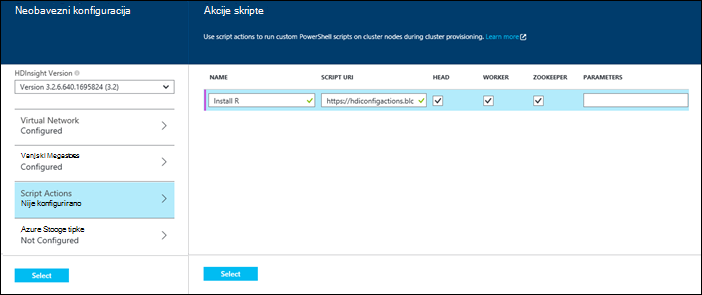

  	| Svojstvo | Vrijednost |
  	| -------- | ----- |
  	| Ime | Unesite naziv za skripte akciju. |
  	| Skripta URI-JA | Navedite URI za skriptu koja se poziva da biste prilagodili klaster. |
  	| Zaglavlje/tempiranja | Odredite čvorove (**Zaglavlje**, **tempiranja**ili **ZooKeeper**) na koji je pokrenuti skriptu prilagodbe. |
  	| Parametri | Navedite parametre, ako je potrebno skripta. |

    Pritisnite ENTER da biste dodali više akcija skriptu da biste instalirali više komponenti na klaster.

3. Kliknite da biste spremili konfiguraciju i nastavak stvaranja klaster **Odaberite** .

### Akcijom skripte iz predložaka Voditelj resursa za Azure

U ovom odjeljku da biste stvorili programa HDInsight klaster i koristiti skripte akcije da biste instalirali prilagođene komponente (R, u ovom primjeru) na klaster koristimo Voditelj resursa Azure predložaka. U ovom se odjeljku nalaze oglednog predloška za stvaranje klaster pomoću skripte akcije.

> [AZURE.NOTE] Koraci u ovom odjeljku pokazuju stvaranje klaster pomoću skripte akcije. Primjer stvaranja klaster iz predloška pomoću aplikacije servisa HDInsight potražite u članku [Instalacija prilagođenih aplikacija HDInsight](hdinsight-apps-install-custom-applications.md).

#### Prije početka

* Informacije o konfiguriranju radne stanice da biste pokrenuli cmdleta ljuske Powershell servisa HDInsight potražite u članku [instalirati i konfigurirati Azure PowerShell](../powershell-install-configure.md).
* Upute za stvaranje predložaka, potražite u članku [Upravitelj resursa za Azure za izradu predložaka](../resource-group-authoring-templates.md).
* Ako niste prije koristili Azure PowerShell s Voditelj resursa, potražite u članku [Korištenje Azure PowerShell s Azure Voditelj resursa](../powershell-azure-resource-manager.md).

#### Stvaranje klastere pomoću skripte akcije

1. Kopirajte sljedeći predložak na mjesto na računalu. Ovaj predložak instalira Giraph na na headnodes te tempiranja čvorovi u klasteru. Možete provjeriti i predložak JSON vrijedi. Zalijepite sadržaj predloška u [JSONLint](http://jsonlint.com/), online JSON alat za provjeru valjanosti.

            {
            "$schema": "http://schema.management.azure.com/schemas/2015-01-01/deploymentTemplate.json#",
            "contentVersion": "1.0.0.0",
            "parameters": {
                "clusterLocation": {
                    "type": "string",
                    "defaultValue": "West US",
                    "allowedValues": [ "West US" ]
                },
                "clusterName": {
                    "type": "string"
                },
                "clusterUserName": {
                    "type": "string",
                    "defaultValue": "admin"
                },
                "clusterUserPassword": {
                    "type": "securestring"
                },
                "sshUserName": {
                    "type": "string",
                    "defaultValue": "username"
                },
                "sshPassword": {
                    "type": "securestring"
                },
                "clusterStorageAccountName": {
                    "type": "string"
                },
                "clusterStorageAccountResourceGroup": {
                    "type": "string"
                },
                "clusterStorageType": {
                    "type": "string",
                    "defaultValue": "Standard_LRS",
                    "allowedValues": [
                        "Standard_LRS",
                        "Standard_GRS",
                        "Standard_ZRS"
                    ]
                },
                "clusterStorageAccountContainer": {
                    "type": "string"
                },
                "clusterHeadNodeCount": {
                    "type": "int",
                    "defaultValue": 1
                },
                "clusterWorkerNodeCount": {
                    "type": "int",
                    "defaultValue": 2
                }
            },
            "variables": {
            },
            "resources": [
                {
                    "name": "[parameters('clusterStorageAccountName')]",
                    "type": "Microsoft.Storage/storageAccounts",
                    "location": "[parameters('clusterLocation')]",
                    "apiVersion": "2015-05-01-preview",
                    "dependsOn": [ ],
                    "tags": { },
                    "properties": {
                        "accountType": "[parameters('clusterStorageType')]"
                    }
                },
                {
                    "name": "[parameters('clusterName')]",
                    "type": "Microsoft.HDInsight/clusters",
                    "location": "[parameters('clusterLocation')]",
                    "apiVersion": "2015-03-01-preview",
                    "dependsOn": [
                        "[concat('Microsoft.Storage/storageAccounts/', parameters('clusterStorageAccountName'))]"
                    ],
                    "tags": { },
                    "properties": {
                        "clusterVersion": "3.2",
                        "osType": "Linux",
                        "clusterDefinition": {
                            "kind": "hadoop",
                            "configurations": {
                                "gateway": {
                                    "restAuthCredential.isEnabled": true,
                                    "restAuthCredential.username": "[parameters('clusterUserName')]",
                                    "restAuthCredential.password": "[parameters('clusterUserPassword')]"
                                }
                            }
                        },
                        "storageProfile": {
                            "storageaccounts": [
                                {
                                    "name": "[concat(parameters('clusterStorageAccountName'),'.blob.core.windows.net')]",
                                    "isDefault": true,
                                    "container": "[parameters('clusterStorageAccountContainer')]",
                                    "key": "[listKeys(resourceId('Microsoft.Storage/storageAccounts', parameters('clusterStorageAccountName')), '2015-05-01-preview').key1]"
                                }
                            ]
                        },
                        "computeProfile": {
                            "roles": [
                                {
                                    "name": "headnode",
                                    "targetInstanceCount": "[parameters('clusterHeadNodeCount')]",
                                    "hardwareProfile": {
                                        "vmSize": "Large"
                                    },
                                    "osProfile": {
                                        "linuxOperatingSystemProfile": {
                                            "username": "[parameters('sshUserName')]",
                                            "password": "[parameters('sshPassword')]"
                                        }
                                    },
                                    "scriptActions": [
                                        {
                                            "name": "installGiraph",
                                            "uri": "https://hdiconfigactions.blob.core.windows.net/linuxgiraphconfigactionv01/giraph-installer-v01.sh",
                                            "parameters": ""
                                        }
                                    ]
                                },
                                {
                                    "name": "workernode",
                                    "targetInstanceCount": "[parameters('clusterWorkerNodeCount')]",
                                    "hardwareProfile": {
                                        "vmSize": "Large"
                                    },
                                    "osProfile": {
                                        "linuxOperatingSystemProfile": {
                                            "username": "[parameters('sshUserName')]",
                                            "password": "[parameters('sshPassword')]"
                                        }
                                    },
                                    "scriptActions": [
                                        {
                                            "name": "installR",
                                            "uri": "https://hdiconfigactions.blob.core.windows.net/linuxrconfigactionv01/r-installer-v01.sh",
                                            "parameters": ""
                                        }
                                    ]
                                }
                            ]
                        }
                    }
                }
            ],
            "outputs": {
                "cluster":{
                    "type" : "object",
                    "value" : "[reference(resourceId('Microsoft.HDInsight/clusters',parameters('clusterName')))]"
                }
            }
        }

2. Pokrenite Azure PowerShell i Prijava na račun za Azure. Nakon unošenja vjerodajnice, naredba vraća podatke o vašem računu.

        Add-AzureRmAccount

        Id                             Type       ...
        --                             ----
        someone@example.com            User       ...

3. Ako imate više pretplata, unesite id pretplate koju želite koristiti za implementaciju.

        Select-AzureRmSubscription -SubscriptionID <YourSubscriptionId>

    > [AZURE.NOTE] Možete koristiti `Get-AzureRmSubscription` da biste dobili popis svih pretplata povezanu s računom koji sadrži Id pretplate za svaku grupu.

5. Ako nemate postojeću grupu resursa, stvorite novu grupu resursa. Navedite naziv grupe resursa i mjesto na koje su vam potrebne za rješenje. Vraća se sažetak novu grupu resursa.

        New-AzureRmResourceGroup -Name myresourcegroup -Location "West US"

        ResourceGroupName : myresourcegroup
        Location          : westus
        ProvisioningState : Succeeded
        Tags              :
        Permissions       :
                            Actions  NotActions
                            =======  ==========
                            *
        ResourceId        : /subscriptions/######/resourceGroups/ExampleResourceGroup

6. Da biste stvorili novu implementaciju za grupu resursa, pokrenite naredbu **Novo AzureRmResourceGroupDeployment** i navedite potrebne parametre. Parametri neće sadržavati naziv za implementaciju sustava naziv grupe resursa, a put ili URL za predložak koji ste stvorili. Ako je vaš predložak zahtijeva parametre, mora proći te parametre. U ovom slučaju akcija skriptu da biste instalirali R na klasteru potrebna parametre.

        New-AzureRmResourceGroupDeployment -Name mydeployment -ResourceGroupName myresourcegroup -TemplateFile <PathOrLinkToTemplate>

    Će zatražiti unesite vrijednosti za parametre definiran u predlošku.

7. Kada je uveden u grupu resursa, vidjet ćete sažetak implementacije.

          DeploymentName    : mydeployment
          ResourceGroupName : myresourcegroup
          ProvisioningState : Succeeded
          Timestamp         : 8/17/2015 7:00:27 PM
          Mode              : Incremental
          ...

8. Implementaciju sustava ne uspije, možete koristiti sljedeće Cmdlete da biste saznali o na pogreške.

        Get-AzureRmResourceGroupDeployment -ResourceGroupName myresourcegroup -ProvisioningState Failed

### Akcijom skripte tijekom stvaranja klaster iz Azure PowerShell

U ovom ćete odjeljku cmdlet za [Dodavanje AzureRmHDInsightScriptAction](https://msdn.microsoft.com/library/mt603527.aspx) koristimo za pozivanje skripte korištenjem akcije skriptu da biste prilagodili klaster. Prije nego što nastavite, provjerite je li ste instalirali i konfigurirali Azure PowerShell. Informacije o konfiguriranju radne stanice da biste pokrenuli cmdleta ljuske PowerShell servisa HDInsight potražite u članku [instalirati i konfigurirati Azure PowerShell](../powershell-install-configure.md).

Poduzmite sljedeće korake:

1. Otvorite konzolu za Azure PowerShell, koristite sljedeće da biste se prijavili u pretplatu za Azure i deklariranje neke varijable PowerShell:

        # LOGIN TO ZURE
        Login-AzureRmAccount

        # PROVIDE VALUES FOR THESE VARIABLES
        $subscriptionId = "<SubscriptionId>"        # ID of the Azure subscription
        $clusterName = "<HDInsightClusterName>"         # HDInsight cluster name
        $storageAccountName = "<StorageAccountName>"    # Azure storage account that hosts the default container
        $storageAccountKey = "<StorageAccountKey>"      # Key for the storage account
        $containerName = $clusterName
        $location = "<MicrosoftDataCenter>"             # Location of the HDInsight cluster. It must be in the same data center as the storage account.
        $clusterNodes = <ClusterSizeInNumbers>          # The number of nodes in the HDInsight cluster.
        $resourceGroupName = "<ResourceGroupName>"      # The resource group that the HDInsight cluster will be created in

2. Navedite konfiguracijskih vrijednosti (kao što su čvorovi u klasteru) i pohranu zadana će se koristiti.

        # SPECIFY THE CONFIGURATION OPTIONS
        Select-AzureRmSubscription -SubscriptionId $subscriptionId
        $config = New-AzureRmHDInsightClusterConfig
        $config.DefaultStorageAccountName="$storageAccountName.blob.core.windows.net"
        $config.DefaultStorageAccountKey=$storageAccountKey

3. Pomoću cmdleta **Dodaj AzureRmHDInsightScriptAction** pozvati skriptu. Sljedeći primjer koristi skriptu koja se instalira Giraph na skupine:

        # INVOKE THE SCRIPT USING THE SCRIPT ACTION FOR HEADNODE AND WORKERNODE
        $config = Add-AzureRmHDInsightScriptAction -Config $config -Name "Install Giraph"  -NodeType HeadNode -Uri https://hdiconfigactions.blob.core.windows.net/linuxgiraphconfigactionv01/giraph-installer-v01.sh
        $config = Add-AzureRmHDInsightScriptAction -Config $config -Name "Install Giraph"  -NodeType WorkerNode -Uri https://hdiconfigactions.blob.core.windows.net/linuxgiraphconfigactionv01/giraph-installer-v01.sh

    Cmdlet za **Dodavanje AzureRmHDInsightScriptAction** uzima sljedećih parametara:

  	| Parametar | Definicija |
  	| --------- | ---------- |
  	| Konfiguracija | Konfiguriranje objekt koji skriptu akcija dodaju. |
  	| Ime | Naziv akcije skripte. |
  	| NodeType | Određuje čvor na kojem se izvodi skriptu prilagodbe. Valjane vrijednosti su **HeadNode** (da biste instalirali na glavni čvora) **WorkerNode** (da biste instalirali na sve čvorove podataka) ili **ZookeeperNode** (da biste instalirali na čvor zookeeper). |
  	| Parametri | Parametri potrebnih skriptu. |
  	| URI-ja | Određuje URI skriptu koja se izvršava. |

4. Postavljanje korisnika administratore/HTTPS skupine:

        $httpCreds = get-credential

    Kada se to od vas zatraži, unesite "administrator" kao naziv, a lozinku.

5. Postavljanje vjerodajnica SSH:

        $sshCreds = get-credential

    Kada se to od vas zatraži, unesite SSH korisničko ime i lozinku. Želite li secure SSH račun s potvrdom umjesto lozinke, koristite praznu lozinku i postavite `$sshPublicKey` sadržaj javni ključ certifikat koji želite koristiti. Ako, na primjer:

        $sshPublicKey = Get-Content .\path\to\public.key -Raw

4. Na kraju, stvorite skupine:

        New-AzureRmHDInsightCluster -config $config -clustername $clusterName -DefaultStorageContainer $containerName -Location $location -ResourceGroupName $resourceGroupName -ClusterSizeInNodes $clusterNodes -HttpCredential $httpCreds -SshCredential $sshCreds -OSType Linux

    Ako koristite javni ključ za osiguranje SSH računa, morate navesti `-SshPublicKey $sshPublicKey` kao parametar.

To može potrajati nekoliko minuta prije stvaranja klaster.

### Akcijom skripte tijekom stvaranja klaster iz HDInsight .NET SDK

HDInsight .NET SDK nudi biblioteke klijenta koji olakšava rad s HDInsight iz aplikacije za .NET. Kod uzorka, potražite u članku [Stvaranje Linux sustavom klastere u HDInsight pomoću .NET SDK](hdinsight-hadoop-create-linux-clusters-dotnet-sdk.md#use-script-action).

## Primjena akcije za skripte izvodi klaster

U ovom se odjeljku nalaze Primjeri na različite načine možete primijeniti akcije skripte izvodi klaster HDInsight; na portalu Azure pomoću cmdleta ljuske PowerShell pomoću EŽA za različite platforme Azure i pomoću .NET SDK. Akcija postojanog skripte koristi u ovom odjeljku dodaje postojećeg računa za Azure prostora za pohranu izvodi klaster. Možete koristiti i druge akcije skripte, pogledajte [primjer skripte akcije skripte](#example-script-action-scripts).

### Primjena akcije za skripte izvodi klaster s portala za Azure

1. [Portal za Azure](https://portal.azure.com)odaberite svoj klaster HDInsight.

2. Odaberite pločicu __Akcije skripte__ klaster plohu HDInsight.

    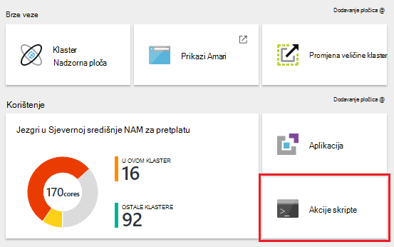

    > [AZURE.NOTE] Možete i odabrati __sve postavke__ i zatim odaberite __Akcije skripte__ plohu postavke.

4. Vrh plohu akcije skripte, odaberite __Pošalji nove__.

    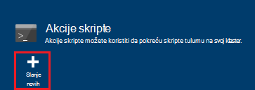

5. Iz plohu dodavanje akcije skripte unesite sljedeće podatke.

    * __Naziv__: neslužbeni naziv koji želite koristiti za ovu akciju skripte. U ovom primjeru `Add Storage account`.
    * __SKRIPTA URI__: U URI za skripte. U ovom primjeru`https://hdiconfigactions.blob.core.windows.net/linuxaddstorageaccountv01/add-storage-account-v01.sh`
    * __Zaglavlje__, __tempiranja__i __Zookeeper__: Provjera čvorove ovu skriptu zatvara. U ovom primjeru glave, tempiranja i Zookeeper provjeravaju.
    * __Parametri__: Ako skriptu prihvaća parametre, unesite ih u nastavku. U ovom primjeru unesite naziv računa za pohranu i ključ za pohranu računa:

        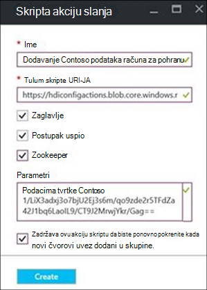

        Na snimku zaslona, `contosodata` je postojeći račun Azure prostora za pohranu, u drugom retku je prostora za pohranu ključ za račun.
    * __PERSISTED__: Potvrdite taj unos ako želite održati skripta pa ga će se primijeniti na nove čvorove tempiranja kada proširenja klaster.

6. Na kraju, koristite gumb __Stvori__ da biste primijenili skriptu klaster.

### Primjena akcije za skripte izvodi klaster iz Azure PowerShell

Prije nego što nastavite, provjerite je li ste instalirali i konfigurirali Azure PowerShell. Informacije o konfiguriranju radne stanice da biste pokrenuli cmdleta ljuske PowerShell servisa HDInsight potražite u članku [instalirati i konfigurirati Azure PowerShell](../powershell-install-configure.md).

1. Otvorite konzolu za Azure PowerShell, koristite sljedeće da biste se prijavili u pretplatu za Azure i deklariranje neke varijable PowerShell:

        # LOGIN TO ZURE
        Login-AzureRmAccount

        # PROVIDE VALUES FOR THESE VARIABLES
        $clusterName = "<HDInsightClusterName>"         # HDInsight cluster name
        $saName = "<ScriptActionName>"                  # Name of the script action
        $saURI = "<URI to the script>"                  # The URI where the script is located
        $nodeTypes = "headnode", "workernode"
        
    > [AZURE.NOTE] Ako koristite programa HDInsight Premium klaster, možete koristiti nodetype od `"edgenode"` pokrenuti skriptu čvor ruba.

2. Da biste primijenili skriptu klaster, koristite sljedeću naredbu:

        Submit-AzureRmHDInsightScriptAction -ClusterName $clusterName -Name $saName -Uri $saURI -NodeTypes $nodeTypes -PersistOnSuccess

    Nakon dovršetka posla, trebali biste dobiti informacije sličnu ovoj:

        OperationState  : Succeeded
        ErrorMessage    :
        Name            : Giraph
        Uri             : https://hdiconfigactions.blob.core.windows.net/linuxgiraphconfigactionv01/giraph-installer-v01.sh
        Parameters      :
        NodeTypes       : {HeadNode, WorkerNode}

### Primjena akcije za skripte izvodi klaster iz EŽA Azure

Prije nego što nastavite, provjerite je li ste instalirali i konfigurirali EŽA Azure. Dodatne informacije potražite u članku [Instalacija EŽA Azure](../xplat-cli-install.md).

    [AZURE.INCLUDE [use-latest-version](../../includes/hdinsight-use-latest-cli.md)] 

1. Otvorite sesije ljuske, terminal, naredbeni redak ili druge naredbenog retka za sustav i koristite sljedeću naredbu da biste prešli u način upravljanja resursima Azure.

        azure config mode arm

2. Pomoću sljedeće provjere autentičnosti u pretplatu za Azure.

        azure login

3. Koristite sljedeću naredbu da biste primijenili akciju za skripte izvodi klaster

        azure hdinsight script-action create <clustername> -g <resourcegroupname> -n <scriptname> -u <scriptURI> -t <nodetypes>

    Ako izostavite parametara za tu naredbu, zatražit će se za njih. Ako skriptu navedete s `-u` prihvaća parametre, možete ih odrediti pomoću na `-p` parametar.

    Valjani __nodetypes__ su __headnode__, __workernode__i __zookeeper__. Ako se više vrsta čvor primjenjivati skriptu, navedite vrste odvojene na ';'. Na primjer, `-n headnode;workernode`.

    Da biste skripte i dalje pojavljuje, dodajte na `--persistOnSuccess`. Skripta možete zadržava kasnije pomoću `azure hdinsight script-action persisted set`.
    
    Kada se posao dovrši, primit ćete izlaz otprilike ovako.
    
        info:    Executing command hdinsight script-action create
        + Executing Script Action on HDInsight cluster
        data:    Operation Info
        data:    ---------------
        data:    Operation status:
        data:    Operation ID:  b707b10e-e633-45c0-baa9-8aed3d348c13
        info:    hdinsight script-action create command OK

### Primjena akcije za skripte izvodi klaster pomoću REST API-JA

Potražite u članku [Pokretanje akcije skripte na tekući klaster](https://msdn.microsoft.com/library/azure/mt668441.aspx).
### Primjena akcije za skripte izvodi klaster iz HDInsight .NET SDK

Primjer korištenja .NET SDK da biste primijenili skripte klaster, potražite u članku [https://github.com/Azure-Samples/hdinsight-dotnet-script-action](https://github.com/Azure-Samples/hdinsight-dotnet-script-action).

## Prikaz povijesti povećanje i smanjenje razine akcije skripte

### Pomoću portala za Azure

1. [Portal za Azure](https://portal.azure.com)odaberite svoj klaster HDInsight.

2. Klaster plohu HDInsight odaberite __Postavke__.

    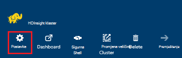

3. Plohu postavke odaberite __Akcije skripte__.

    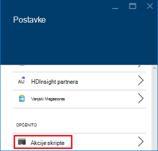

4. Popis postojanog skripte, kao i povijest skripte primjenjuje se na klaster, prikazuje se na plohu akcije skripte. U nastavku snimka vidjet ćete da Solr skripte je pokrenut na ovom klasteru, ali ste nije dosljedan nema skripte akcija.

    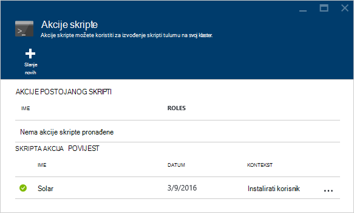

5. Odabir skriptu iz povijesti prikazat će se svojstva plohu za ovu skriptu. Na vrhu na plohu možete ponovno pokrenite skriptu ili ga promovirati.

    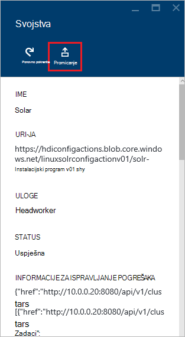

6. Možete koristiti i __…__ s desne strane stavke na plohu akcije skripte za izvođenje akcija kao što je ponovno pokrenite zadržava i (za postojanog akcije) brisanje.

    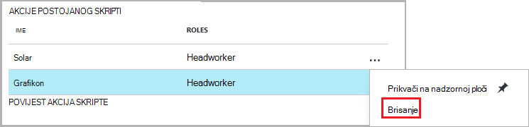

### Pomoću Azure komponente PowerShell

| Koristite sljedeće... | Da biste... |
| ----- | ----- |
| Get-AzureRmHDInsightPersistedScriptAction | Dohvaćanje informacija na Akcije postojanog skripte |
| Get-AzureRmHDInsightScriptActionHistory | Dohvaćanje povijest akcije skripte primjenjuje klaster ili detalja za određenu skripte |
| Postavljanje AzureRmHDInsightPersistedScriptAction | Podiže akciju ad-hoc skripte postojanog skripte akciju |
| Uklanjanje AzureRmHDInsightPersistedScriptAction | Degradira akciju postojanog skripte za ad hoc akcije |

> [AZURE.IMPORTANT] Korištenje `Remove-AzureRmHDInsightPersistedScriptAction` ne ne Poništi akcije obavlja skriptu, samo uklanja postojanog zastavice tako da se skripta će biti pokrenuli na novi tempiranja čvorovi dodali klaster.

Sljedeći primjer skripte pokazuje korištenju na cmdleta za povećanje, a zatim smanjenje razine skriptu.

    # Get a history of scripts
    Get-AzureRmHDInsightScriptActionHistory -ClusterName mycluster

    # From the list, we want to get information on a specific script
    Get-AzureRmHDInsightScriptActionHistory -ClusterName mycluster -ScriptExecutionId 635920937765978529

    # Promote this to a persisted script
    # Note: the script must have a unique name to be promoted
    # if the name is not unique, you will receive an error
    Set-AzureRmHDInsightPersistedScriptAction -ClusterName mycluster -ScriptExecutionId 635920937765978529

    # Demote the script back to ad hoc
    # Note that demotion uses the unique script name instead of
    # execution ID.
    Remove-AzureRmHDInsightPersistedScriptAction -ClusterName mycluster -Name "Install Giraph"

### Korištenje Azure EŽA

| Koristite sljedeće... | Da biste... |
| ----- | ----- |
| `azure hdinsight script-action persisted list <clustername>` | Dohvaćanje popisa postojanog skripte akcija |
| `azure hdinsight script-action persisted show <clustername> <scriptname>` | Dohvaćanje informacija na određene postojanog skripte akcija |
| `azure hdinsight script-action history list <clustername>` | Dohvaćanje povijest akcije skripte primjenjuje se na klaster |
| `azure hdinsight script-action history show <clustername> <scriptname>` | Dohvaćanje informacija na određene skripte akcija |
| `azure hdinsight script action persisted set <clustername> <scriptexecutionid>` | Podiže akciju ad-hoc skripte postojanog skripte akciju |
| `azure hdinsight script-action persisted delete <clustername> <scriptname>` | Degradira akciju postojanog skripte za ad hoc akcije |

> [AZURE.IMPORTANT] Korištenje `azure hdinsight script-action persisted delete` ne ne Poništi akcije obavlja skriptu, samo uklanja postojanog zastavice tako da se skripta će biti pokrenuli na novi tempiranja čvorovi dodali klaster.

### Korištenje HDInsight .NET SDK

Primjer korištenja .NET SDK dohvatiti skripte povijest iz klaster, Povećanje ili smanjenje razine skripte potražite [https://github.com/Azure-Samples/hdinsight-dotnet-script-action](https://github.com/Azure-Samples/hdinsight-dotnet-script-action).

> [AZURE.NOTE] U ovom se primjeru pokazuje i kako instalirati aplikaciju HDInsight pomoću .NET SDK-a.

## Otklanjanje poteškoća

Da biste pregledali informacije zapisuje akcije skripte možete koristiti web Ambari korisničkog Sučelja. Ako skriptu koristila tijekom skupine stvaranja i stvaranje klaster nije uspjela zbog pogreške u skripti, zapisnike dostupne su i u zadani prostor za pohranu račun povezan s klaster. Ovo poglavlje sadrži informacije o tome kako dohvatiti zapisnike pomoću obje mogućnosti.

### Korištenje weba Ambari korisničkog Sučelja

1. U pregledniku dođite do https://CLUSTERNAME.azurehdinsight.net. Zamijenite CLUSTERNAME naziv svoj klaster HDInsight.

    Kada se to od vas zatraži, unesite naziv računa admin (administrator) i lozinku za klaster. Možda ćete morati ponovno unesite vjerodajnice za administratore u web-obrasca.

2. Na traci pri vrhu stranice odaberite stavku __ops__ . Prikazat će popis trenutni i prethodni operacije obavljene na klasteru kroz Ambari.

    

3. Pronađite stavke koje sadrže __pokrenite\_customscriptaction__ u stupcu __operacije__ . Ove se stvaraju kada su pokrenuli akcije skripte.

    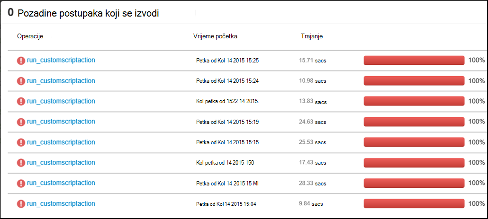

    Odaberite tu stavku, a dubinske analize prema dolje kroz veze da biste pogledali STDOUT i STDERR izlaz koji su generirani prilikom skriptu je pokrenut na klaster.

### Zapisnike s pristupom od zadanog računa za pohranu

Li klaster stvaranja nije uspjela zbog pogreške u skripti akciju, akcije zapisnike skripte i dalje može pristupiti izravno iz zadanog računa za pohranu pridružene klaster.

* Spremanje zapisnika dostupne su na `\STORAGE_ACOCUNT_NAME\DEFAULT_CONTAINER_NAME\custom-scriptaction-logs\CLUSTER_NAME\DATE`.

    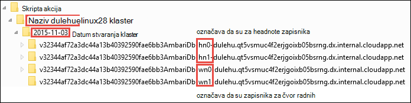

    U odjeljku toga zapisnike su organizirane zasebno za headnode, workernode i zookeeper čvorove. Primjeri su:
    * **Headnode** - `<uniqueidentifier>AmbariDb-hn0-<generated_value>.cloudapp.net`
    * **Čvor tempiranja** - `<uniqueidentifier>AmbariDb-wn0-<generated_value>.cloudapp.net`
    * **Zookeeper čvor** - `<uniqueidentifier>AmbariDb-zk0-<generated_value>.cloudapp.net`

* Sve stdout i stderr odgovarajuće glavnog računala prenijeti na račun za pohranu. Postoji **Izlaz -\*.txt** i **pogreške –\*.txt** za svaku akciju skripte. Izlaz *.txt datoteka sadrži podatke o URI skriptu koja imate pokrenuti na glavnom računalu. Na primjer

        'Start downloading script locally: ', u'https://hdiconfigactions.blob.core.windows.net/linuxrconfigactionv01/r-installer-v01.sh'

* Je moguće više puta stvorite klaster skripte akciju s istim nazivom. U tom slučaju možete razlikovali zapisnike odgovarajući naziv mape DATUMA na temelju. Na primjer, bit će struktura mapa za klaster (mycluster) stvorene na različitim datumima:
    * `\STORAGE_ACOCUNT_NAME\DEFAULT_CONTAINER_NAME\custom-scriptaction-logs\mycluster\2015-10-04`
    * `\STORAGE_ACOCUNT_NAME\DEFAULT_CONTAINER_NAME\custom-scriptaction-logs\mycluster\2015-10-05`

* Ako stvorite klaster skripte akciju s istim nazivom na isti dan, jedinstveni prefiks možete koristiti da biste odredili odgovarajuće zapisničke datoteke.

* Ako stvorite klaster na kraju dan, moguće je da se datoteka zapisnika ponavljali preko dva dana. U tim slučajevima, vidjet ćete dvije mape drugi datum za istu klaster.

* Prijenos datoteke zapisnika spremniku zadani može potrajati najviše 5 minuta, posebice za velike klastere. Tako, ako želite da biste pristupili zapisnike, nemojte odmah brisati klaster ne uspijete skripte akcija.

## Podrška za Otvori izvor softver koji se koriste na klastere HDInsight

Servis Microsoft Azure HDInsight je fleksibilne platformu koja vam omogućuje sastavljanje aplikacije velikih skupova podataka u oblak pomoću programa zajednici Otvori izvor tehnologije oblikovan oko Hadoop. Microsoft Azure nudi Općenito razina podrške za tehnologije Otvori izvor, kako je opisano u odjeljku **Podržava doseg** [Azure podržava najčešća pitanja vezana uz web-mjesta](https://azure.microsoft.com/support/faq/). Servis za HDInsight nudi dodatnu razinu podrške za neke komponente, prema uputama u nastavku.

Postoje dvije vrste Otvori izvor komponente koje su dostupne u servisa HDInsight:

- **Ugrađene komponente** - ove komponente unaprijed instaliranih na klastere HDInsight i funkcionalnosti core od klaster. Ako, na primjer, YARN ResourceManager, jezika za upite grozd (HiveQL) i biblioteku Mahout pripada kategoriju. Potpuni popis komponenata klaster dostupna je u [što je novo u verzijama klaster Hadoop nudi HDInsight?](hdinsight-component-versioning.md).

- **Prilagođeno komponente** -, kao korisnik klaster, možete instalirati ili koristiti u svoje radno opterećenje bilo koju komponentu dostupni u zajednici ili koje ste stvorili.

> [AZURE.WARNING] Komponente dao klaster HDInsight potpuno podržane, a Microsoft Support pomoći će vam da biste izdvojili i rješavanje problema vezanih uz te komponente.
>
> Prilagođene komponente dobili komercijalno pametnije podršku radi daljnje rješavanje problema. To može rezultirati rješavanju problema ili s pitanjem želite li sudjelovati dostupnih kanala tehnologija Otvori izvor gdje se nalazi niže stručna znanja za taj tehnologiju. Na primjer, postoje mnogo web-mjesta zajednice koje je moguće koristiti, npr.: [MSDN forum za HDInsight](https://social.msdn.microsoft.com/Forums/azure/en-US/home?forum=hdinsight), [http://stackoverflow.com](http://stackoverflow.com). Projekti Apache imaju web-mjesta projekta na [http://apache.org](http://apache.org), na primjer: [Hadoop](http://hadoop.apache.org/).

Servis za HDInsight nudi nekoliko načina za korištenje prilagođene komponente. Bez obzira na to kako koristiti ili instalirano klaster komponentu, istu razinu podrške odnosi. Slijedi popis Najčešći su načini prilagođene komponente može se koristiti u HDInsight klastere:

1. Predavanje posla - Hadoop ili drugih vrsta zadataka koji se izvoditi ili koristiti prilagođene komponente mogu poslati klaster.

2. Prilagodba klaster – tijekom stvaranja klaster možete navesti dodatne postavke i prilagođene komponente koje će biti instalirana na čvorove klaster.

3. Uzorke - za popularne prilagođene komponente, Microsoft i drugi korisnici mogu uzoraka kako koristiti te komponente na klastere HDInsight. Ta uzorka postoje bez podrške.

##Otklanjanje poteškoća

###Povijest ne prikazuje skripte koje se koriste prilikom stvaranja klaster

Ako svoj klaster stvorena prije ožujak 15th, 2016, možda nećete vidjeti stavku u povijesti akcija skripte za sve skripte koji se koriste prilikom stvaranja klaster. Međutim, ako promijenite veličinu skupine nakon ožujak 15th, 2016, skripte koje koriste prilikom stvaranja klaster pojavit će se u povijesti kao što su primijenjeni na novi čvorovi u klasteru kao dio postupak za promjenu veličine.

Postoje dvije iznimke:

* Ako svoj klaster stvorena prije rujan 1st, 2015. Ovo je kad su predstavljena akcije skripte, tako da sve klaster stvorena prije tog datuma nije ste koristiti akcije skripte za stvaranje klaster.

* Ako koristi više akcija skripte tijekom stvaranja klaster, a koriste isti naziv za više skripte ili na isti naziv, iste URI, ali druge parametre za više skripti. U tim slučajevima, primit ćete sljedeću pogrešku.

    Nove akcije prikazivale skripte izvršavaju na ovom klasteru zbog sukobljenih skripte imena u postojeće skripte. Nazivi skripte na klaster stvaranje mora biti sve jedinstvene. Postojeće skripte i dalje će se izvršavati na promjenu veličine.

## Daljnji koraci

Pogledajte sljedeće informacije i primjeri o stvaranju i korištenju skripte da biste prilagodili klaster:

- [Razvoj skripti skripte akcija za HDInsight](hdinsight-hadoop-script-actions-linux.md)
- [Instaliranje i korištenje Solr na klastere HDInsight](hdinsight-hadoop-solr-install-linux.md)
- [Instaliranje i korištenje Giraph na klastere HDInsight](hdinsight-hadoop-giraph-install-linux.md)

[img-hdi-cluster-states]: ./media/hdinsight-hadoop-customize-cluster-linux/HDI-Cluster-state.png "Faza tijekom stvaranja klaster"
