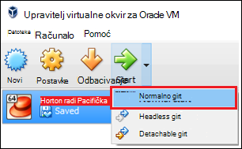

<properties
    pageTitle="Korištenje memorije za testiranje Hadoop dodatne informacije o Hadoop | Microsoft Azure"
    description="Da biste pokrenuli više informacija o korištenju zajednici Hadoop, možete postaviti Hadoop izdvojeni iz Hortonworks na Azure virtualnog računala. "
    keywords="hadoop emulator, hadoop s memorijom za testiranje"
    editor="cgronlun"
    manager="jhubbard"
    services="hdinsight"
    authors="nitinme"
    documentationCenter=""
    tags="azure-portal"/>

<tags
    ms.service="hdinsight"
    ms.workload="big-data"
    ms.tgt_pltfrm="na"
    ms.devlang="na"
    ms.topic="article"
    ms.date="08/24/2016"
    ms.author="nitinme"/>

# Početak rada u zajednici Hadoop s Hadoop izdvojeni na virtualnog računala

Saznajte kako instalirati izdvojeni Hadoop iz Hortonworks na virtualnog računala dodatne informacije o Hadoop zajednici. U memoriji za testiranje nudi lokalne platforme dodatne informacije o Hadoop Distributed datoteke Hdps sustava (HADOOP), a predavanje posla.

## Preduvjeti

* [Oracle VirtualBox](https://www.virtualbox.org/)

Kada ste upoznati s Hadoop, možete početi koristiti Hadoop na Azure stvaranjem programa klaster HDInsight. Dodatne informacije o tome kako početi potražite u članku [Početak rada s Hadoop na HDInsight](hdinsight-hadoop-linux-tutorial-get-started.md).

## Preuzmite i instalirajte virtualnog računala

1. [Http://hortonworks.com/downloads/#sandbox](http://hortonworks.com/downloads/#sandbox), odaberite stavku __Preuzimanje VIRTUALBOX__ za HDP 2.4 u memoriji za testiranje Hortonworks. Zatražit će se da biste registrirali s Hortonworks prije početka preuzimanja.

    

2. Na istoj web-stranici odaberite __VirtualBox instalacija vodiča__ za HDP 2.4 u memoriji za testiranje Hortonworks. To će se preuzeti PDF-a koji sadrži upute za instalaciju za virtualnog računala.

    

## Pokretanje virtualnog računala

1. Pokretanje VirtualBox, odaberite izdvojeni Hortonworks, odaberite __Start__, a zatim __Pokrenite normalno__.

    

2. Kada virtualnog računala Završi proces pokretanja, ona će se prikazivati upute za prijavu. Otvorite web-preglednik i idite na URL prikazan (obično http://127.0.0.1:8888).

## Postavljanje lozinke

1. Korak __Početak rada__ s memorijom za testiranje Hortonworks stranice odaberite __Dodatne mogućnosti prikaza__. Koristite informacije na ovoj stranici za prijavu pomoću SSH memorije za testiranje. Koristi ime i lozinku koju ste dobili.

    > [AZURE.NOTE] Ako nemate instaliran klijent za SSH, možete koristiti pri nudi virtualnog računala na SSH utemeljenom na webu __http://localhost:4200 /__.

    Prvo povezivanje pomoću SSH, zatražit će se da biste promijenili lozinku za račun korijen. Unesite novu lozinku koja će se koristiti prilikom prijave pomoću SSH u budućnosti.

2. Kada prijavljeni, unesite sljedeću naredbu:

        ambari-admin-password-reset
    
    Kada se to od vas zatraži, upišite lozinku za administratorski račun Ambari. To će se koristiti prilikom pristupa Ambari Web korisničkog Sučelja.

## Koristite naredbu grozd

1. Iz SSH veze da biste u memoriji za testiranje, koristite sljedeću naredbu da biste pokrenuli ljuske grozd:

        hive

2. Kada je pokrenut ljuske, koristite sljedeće da biste prikazali tablice koje se isporučuju sa u memoriji za testiranje:

        show tables;

3. Koristite sljedeće radi dohvaćanja 10 stupaca iz na `sample_07` tablice:

        select * from sample_07 limit 10;

## Daljnji koraci

* [Saznajte kako pomoću programa Visual Studio sa Hortonworks memorije za testiranje](hdinsight-hadoop-emulator-visual-studio.md)
* [Učenje ropes Hortonworks memorije za testiranje](http://hortonworks.com/hadoop-tutorial/learning-the-ropes-of-the-hortonworks-sandbox/)
* [Praktični vodič Hadoop – prvi koraci s HDP](http://hortonworks.com/hadoop-tutorial/hello-world-an-introduction-to-hadoop-hcatalog-hive-and-pig/)