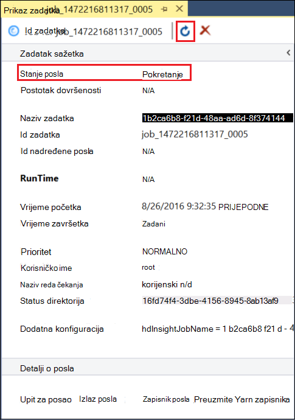

<properties
pageTitle="Korištenje alata za Microsoft Azure podataka Lake za Visual Studio sa izdvojeni Hortonworks | Microsoft Azure"
description="Saznajte kako pomoću alata za Lake Azure podataka za VIsual Studio sa izdvojeni Hortonworks (izvodi u lokalnom VM.) Pomoću tih alata možete stvoriti i izvoditi grozd i Svinja na posao izlaza izdvojeni i prikaz i povijest."
services="hdinsight"
documentationCenter=""
authors="Blackmist"
manager="paulettm"
editor="cgronlun"/>

<tags
ms.service="hdinsight"
ms.devlang="na"
ms.topic="article"
ms.tgt_pltfrm="na"
ms.workload="big-data"
ms.date="08/26/2016"
ms.author="larryfr"/>

# Pomoću alata za Lake Azure podataka za Visual Studio sa Hortonworks memorije za testiranje

Alati za Azure podataka Lake za Visual Studio sadrži alate za rad s generički klastere Hadoop, osim alate za rad s Lake Azure podataka i HDInsight. Ovaj dokument sadrži korake potrebne za korištenje alata za Azure podataka Lake s izdvojeni Hortonworks izvodi u lokalnom virtualnog računala.

Korištenje memorije za testiranje Hortonworks omogućuje rad s Hadoop lokalno na razvojno okruženje. Nakon što ste razvili rješenje i želite uvesti na razini, možete premjestiti na klaster HDInsight.

## Preduvjeti

* Izdvojeni Hortonworks radi u virtualnog računala na razvojno okruženje. Ovaj dokument je napisan i s izvodi u VirtualBox Oracle koji je konfiguriran pomoću informacija u dokumentu [početi s radom u zajednici Hadoop](hdinsight-hadoop-emulator-get-started.md) memorije za testiranje.

* Visual Studio 2013 ili 2015, bilo koje izdanje.

* [Azure SDK za .NET](https://azure.microsoft.com/downloads/) 2.7.1 ili noviji

* [Azure Data Lake Tools za Visual Studio](https://www.microsoft.com/download/details.aspx?id=49504)

## Konfiguriranje lozinke u memoriji za testiranje

Provjerite je li izdvojeni Hortonworks sustavom, a zatim slijedite korake u [početi s radom u zajednici Hadoop](hdinsight-hadoop-emulator-get-started.md#set-passwords) da biste konfigurirali lozinku za u SSH `root` račun, a u Ambari `admin` računa. Takve lozinke će se koristiti prilikom povezivanja s Visual Studio u memoriji za testiranje.

## Povezivanje alata u memoriji za testiranje

1. Otvorite Visual Studio i odaberite __Prikaz__, a zatim __Explorer poslužitelja__.

2. Iz programa __Explorer poslužitelj__, desnom tipkom miša kliknite stavku __HDInsight__ , a zatim __Poveži se s HDInsight Emulator__.

    

3. U dijaloškom okviru __za povezivanje s HDInsight Emulator__ unesite lozinku koju ste konfigurirali za Ambari.

    

    Odaberite __Dalje__ da biste nastavili.

4. Pomoću polje __lozinke__ unesite lozinku ste konfigurirali za na `root` računa. Ostavite ostala polja na zadane vrijednosti.

    

    Odaberite __Dalje__ da biste nastavili.

5. Pričekajte provjere valjanosti servisa da biste dovršili. U nekim slučajevima, provjera valjanosti možda neće uspjeti i od vas zatražiti da Ažurirajte konfiguraciju. Kada se to dogodi, odaberite gumb __Ažuriranje__ i pričekajte konfiguraciju i provjere valjanosti za uslugu da biste dovršili.

    

    > [AZURE.NOTE] Postupak ažuriranja koristi Ambari da biste izmijenili konfiguracija Hortonworks izdvojeni da očekivanim pomoću alata za Azure podataka Lake za Visual Studio.

    Kada završi je provjera valjanosti, odaberite __Završi__ da biste dovršili konfiguriranje.

    

    > [AZURE.NOTE] Ovisno o brzini razvojno okruženje i memorija dodijeliti virtualnog računala može potrajati nekoliko minuta možete konfigurirati i servise za provjeru valjanosti.

Kada slijedite korake u nastavku, sada imate stavku "HDInsight lokalne klaster" u programu Explorer poslužitelja u odjeljku HDInsight.

## Pisanje grozd upita

Grozd nudi jezika za upite SQL nalik (HiveQL), za rad s strukturiranih podataka. Poduzmite sljedeće korake da biste saznali kako izvoditi ad hoc upite na lokalni klaster.

1. U programu __Explorer poslužitelj__, desnom tipkom miša kliknite stavku za lokalni klaster koje ste prethodno dodali, a zatim __Pisanje grozd upita__.

    

    Otvorit će se novi prozor upit koji vam omogućuje da brzo upišite prema gore i slanje upita za lokalni klaster.

2. U novom prozoru upit, unesite sljedeće:

        select count(*) from sample_08;
    
    Na vrhu prozora upit, provjerite je li tu konfiguraciju za lokalni klaster odabran pa odaberite __Pošalji__. Ostaviti druge vrijednosti (__grupe__ i naziv poslužitelja,) na zadane vrijednosti.

    

    Imajte na umu da vam može poslužiti padajući izbornik pokraj __Pošalji__ da biste odabrali __Dodatno__. Otvorit će se dijaloški okvir koji će vam pružiti dodatne mogućnosti prilikom slanja posao.

    

3. Kada pošaljete upit, pojavit će se status zadatka. To navedene su informacije na poslu kao što je obradili Hadoop. Stavka __Stanja posla__ sadrži trenutni status zadatka. Stanje ažurirat će se povremeno ili ikonu osvježavanja možete koristiti da biste ručno osvježili stanje.

    

    Nakon što __Status zadatka__ mijenja se u __dovršen__, prikazat će se na usmjereni Acyclic grafikon (DAG). To opisuje put izvođenja koji je određen Tez (zadani izvođenja modul za grozd na lokalni klaster.) 
    
    > [AZURE.NOTE] Tez je zadani prilikom korištenja klastere sustavom Linux HDInsight. Nije zadani na HDInsight utemeljen na sustavu Windows Da biste ga koristili postoji, morate dodati redak `set hive.execution.engine = tez;` na početku grozd upit. 

    Koristite __Posao izlazne__ veze za prikaz izlaz. U ovom slučaju je __823__; broj redaka u tablici sample_08. Možete pogledati Dijagnostika informacije o posla pomoću veze __Posao zapisnika__ i __Preuzimanje YARN zapisnika__ .

4. Možete pokrenuti poslovi grozd interaktivno tako da promijenite polje __obradu__ __Interactive__, a zatim __izvrši__. 

    

    To strujanja izlazni zapisnik generira tijekom obrade da biste __HiveServer2 izlaznom__ prozoru.
    
    > [AZURE.NOTE] Ovo je iste podatke koji je dostupan iz __Zapisnika za posao__ vezu nakon dovršetka posla.

    

## Stvaranje projekta grozd

Možete stvoriti i projekt koji sadrži više grozd skripti. To je korisno kada ste povezani skripte koje ćete morati razdvajati ili održavati pomoću kontrola sustavi za verziju.

1. U Visual Studio, odaberite __datoteku__, __Novi__i then__Project__.

2. Na popisu projekata proširite __predložaka__ __Lake Azure podataka__ , a zatim odaberite __GROZD (HDInsight)__. Popis predložaka, odaberite __Vrste Hive uzorka__. Unesite naziv i mjesto, a zatim odaberite __u redu__.

    

__Vrste Hive uzorka__ projekt sadrži dvije skripte, __WebLogAnalysis.hql__ i __SensorDataAnalysis.hql__. Možete poslati te pomoću istog gumba __Pošalji__ pri vrhu prozora.

## Stvaranje projekta Svinja

Dok grozd omogućuje SQL nalik jezik za rad s strukturiranih podataka te Svinja nudi jezik (latinica Svinja), koji omogućuje razvoj na kanal transformacije koji se primjenjuju na podatke. Poduzmite sljedeće korake da biste koristili Svinja s lokalnom klaster.

1. Otvorite Visual Studio i odaberite __datoteku__, __Novo__, a zatim __projekta__. Na popisu projekata proširite __predložaka__ __Lake Azure podataka__, a zatim odaberite __Svinja (HDInsight)__. Popis predložaka, odaberite __Svinja aplikacije__. Unesite naziv, mjesto, a zatim odaberite __u redu__.

    

2. Unesite sljedeće kao sadržaj datoteke __script.pig__ koji je stvoren taj projekt.

        a = LOAD '/demo/data/Website/Website-Logs' AS (
            log_id:int, 
            ip_address:chararray, 
            date:chararray, 
            time:chararray, 
            landing_page:chararray, 
            source:chararray);
        b = FILTER a BY (log_id > 100);
        c = GROUP b BY ip_address;
        DUMP c;

    Svinja koristi na drugom jeziku od grozd, kako pokrenuti zadatke je dosljedan oba jezika putem gumba __Pošalji__ . Odabir na padajućem izborniku prema dolje pokraj __Pošalji__ prikazuje je dijaloški okvir napredne slanja za Svinja.

    
    
3. Status zadatka i izlaz ujedno prikazuje isti kao grozd upita.

    

## Prikaz poslova

Azure Alati podataka Lake omogućuju vam da jednostavno prikaz informacija o zadacima koje su pokrenuli na Hadoop. Poduzmite sljedeće korake da biste vidjeli poslove koje su pokrenuli na lokalni klaster.

1. Iz programa __Explorer poslužitelj__, desnom tipkom miša kliknite na lokalni klaster, a zatim __Prikaz poslova__. To će prikazati popis zadataka koji su poslani klaster.

    

2. Na popisu zadataka, odaberite jednu da biste vidjeli detalje posao.

    

    Prikazani su podaci slične da biste vidjeli nakon pokretanja grozd ili Svinja upita s vezama na prikaz izlazne i zapisivanje podataka.

3. Možete izmijeniti i pošaljite zadatak na tom mjestu.

## Prikaz grozd baze podataka

1. U __Programu Explorer poslužitelja__proširite stavku __HDInsight lokalne klaster__ , a zatim __Vrste Hive baze podataka__. Otkriti će __zadane__ i __xademo__ baze podataka na lokalni klaster. Proširivanje baze podataka otkriva tablica u bazi podataka.

    

2. Proširivanje tablice prikazuje stupce za tu tablicu. Možete desnom tipkom miša kliknite tablicu i odaberite __Prikaz redaka s vrha 100__ da biste brzo prikazali podatke.

    

### Svojstva baze podataka i tablice

Možda ste primijetili koje možete odabrati da biste pogledali __Svojstva__ na baze podataka ili tablice. To će prikazati detalje za odabranu stavku u prozoru svojstva.

### Stvaranje tablice

Da biste stvorili novu tablicu, desnom tipkom miša kliknite bazu podataka, a zatim odaberite __Create Table__.

Zatim stvorite tablicu pomoću obrasca. Vidjet ćete neobrađenog HiveQL koja će se koristiti za stvaranje tablice pri dnu ove stranice.

## Daljnji koraci

* [Učenje ropes Hortonworks memorije za testiranje](http://hortonworks.com/hadoop-tutorial/learning-the-ropes-of-the-hortonworks-sandbox/)
* [Praktični vodič Hadoop – prvi koraci s HDP](http://hortonworks.com/hadoop-tutorial/hello-world-an-introduction-to-hadoop-hcatalog-hive-and-pig/)