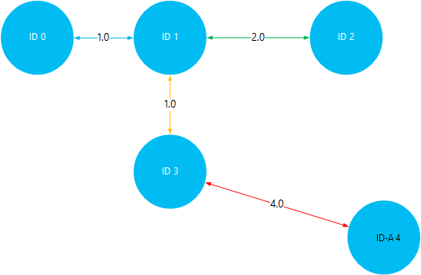

<properties
    pageTitle="Instaliranje i korištenje Giraph na sustavom Linux HDInsight (Hadoop) | Microsoft Azure"
    description="Saznajte kako instalirati Giraph na klastere sustavom Linux HDInsight pomoću skripte akcije. Akcije skripte omogućuju vam prilagodbu klaster tijekom stvaranja, promjenom klaster konfiguraciju ili prilikom instalacije servisa i uslužni programi."
    services="hdinsight"
    documentationCenter=""
    authors="Blackmist"
    manager="jhubbard"
    editor="cgronlun"
    tags="azure-portal"/>

<tags
    ms.service="hdinsight"
    ms.workload="big-data"
    ms.tgt_pltfrm="na"
    ms.devlang="na"
    ms.topic="article"
    ms.date="10/17/2016"
    ms.author="larryfr"/>

# Instalacija Giraph na HDInsight Hadoop klastere i korištenje Giraph za obradu veliki grafikona

Giraph možete instalirati na bilo koju vrstu klaster u Hadoop na Azure HDInsight pomoću **Akcije skriptu** da biste prilagodili klaster.

U ovoj se temi će Saznajte kako instalirati Giraph putem skripte akcija. Nakon instalacije Giraph ćete saznati i kako koristiti Giraph za Najčešći aplikacije koji je za obradu veliki grafikona.

> [AZURE.NOTE] Informacije u ovom članku je za klastere sustavom Linux HDInsight. Informacije o radu s klastere utemeljen na sustavu Windows potražite u članku [Instalacija Giraph na klastere HDInsight Hadoop (Windows)](hdinsight-hadoop-giraph-install.md)

## Što je Giraph?

[Apache Giraph](http://giraph.apache.org/) omogućuje izvođenje grafikonu obrade pomoću Hadoop, a mogu koristiti u sklopu Azure HDInsight. Grafikoni model odnose između objekte, primjerice veze između usmjerivača na velikom mrežom kao što je s Internetom ili odnosa među korisnicima na društvenim mrežama (ponekad se nazivaju društvenih grafikonu). Obrada grafikonu omogućuje vam razloga o odnosima između objekata u grafikon, kao što su:

- Označavanje potencijalne prijatelji na temelju trenutnog odnosa.
- Označavanje pretraživanje po najkraćoj usmjeravanje između dvaju računala u mreži.
- Izračunavanje rang stranice web-stranice.

> [AZURE.WARNING] Komponente dao klaster HDInsight potpuno podržane, a Microsoft Support pomoći će vam da biste izdvojili i rješavanje problema vezanih uz te komponente.
>
> Prilagođene komponente, kao što su Giraph, dobili komercijalno pametnije podršku radi daljnje rješavanje problema. To može rezultirati rješavanju problema ili s pitanjem želite li sudjelovati dostupnih kanala tehnologija Otvori izvor gdje se nalazi niže stručna znanja za taj tehnologiju. Na primjer, postoje mnogo web-mjesta zajednice koje je moguće koristiti, npr.: [MSDN forum za HDInsight](https://social.msdn.microsoft.com/Forums/azure/en-US/home?forum=hdinsight), [http://stackoverflow.com](http://stackoverflow.com). Projekti Apache imaju web-mjesta projekta na [http://apache.org](http://apache.org), na primjer: [Hadoop](http://hadoop.apache.org/).

##Funkcija skripta

Ova skripta izvršava sljedeće radnje:

* Instalira Giraph da biste`/usr/hdp/current/giraph`
* Kopija na `giraph-examples.jar` datoteke na zadani prostor za pohranu (WASB) za svoj klaster:`/example/jars/giraph-examples.jar`

## Instalacija Giraph pomoću akcije skripte

Ogledne skripte da biste instalirali Giraph na programa HDInsight klaster dostupna je na sljedećem mjestu.

    https://hdiconfigactions.blob.core.windows.net/linuxgiraphconfigactionv01/giraph-installer-v01.sh

U ovom se odjeljku daju upute o korištenju ogledne skripte prilikom stvaranja klaster pomoću portala za Azure. 

> [AZURE.NOTE] Azure PowerShell, EŽA Azure, HDInsight .NET SDK ili Voditelj resursa Azure predložaka također se poslužite da biste primijenili akcije skripte. Akcije skripte možete primijeniti i na već pokrenut klastere. Dodatne informacije potražite u članku [Prilagodba HDInsight klastere s akcijama skripte](hdinsight-hadoop-customize-cluster-linux.md).

1. Stvaranje klaster pomoću koraka u [klastere utemeljen na stvaranje Linux HDInsight](hdinsight-hadoop-create-linux-clusters-portal.md), ali ne dovrši stvaranje.

2. Na plohu **Neobavezno konfiguracije** odaberite **Akcije skripte**i unijeti podatke u nastavku:

    * __Naziv__: Upišite neslužbeni naziv za skripte akciju.
    * __SKRIPTA URI__: https://hdiconfigactions.blob.core.windows.net/linuxgiraphconfigactionv01/giraph-installer-v01.sh
    * __LAKŠI__: Odaberite ovu mogućnost
    * __TEMPIRANJA__: ostavite poništen
    * __ZOOKEEPER__: ostavite poništen
    * __Parametri__: to polje ostavite prazno

3. Pri dnu **Akcije skripte**, pomoću gumba **Odaberite** spremanje konfiguracije. Na kraju, pomoću gumba **Odaberite** pri dnu plohu **Neobavezno konfiguracije** da biste spremili informacije o konfiguraciji nije obavezno.

4. Nastavak stvaranja klaster, kao što je opisano u [klastere utemeljen na stvaranje Linux HDInsight](hdinsight-hadoop-create-linux-clusters-portal.md).

## Kako koristiti Giraph u HDInsight?

Nakon dovršetka klaster stvaranja, poduzmite sljedeće korake da biste pokrenuli primjer SimpleShortestPathsComputation uključene Giraph. To implementira osnovni <a href = "http://people.apache.org/~edwardyoon/documents/pregel.pdf">Pregel</a> implementaciju za pronalaženje pretraživanje po najkraćoj put između objekata u grafikon.

1. Povezivanje s klaster HDInsight pomoću SSH:

        ssh USERNAME@CLUSTERNAME-ssh.azurehdinsight.net

    Dodatne informacije o korištenju SSH sa servisa HDInsight potražite u sljedećim člancima:

    * [Korištenje SSH sa sustavom Linux Hadoop na HDInsight Linux, Unix ili OS X](hdinsight-hadoop-linux-use-ssh-unix.md)

    * [Korištenje SSH sa sustavom Linux Hadoop na HDInsight iz sustava Windows](hdinsight-hadoop-linux-use-ssh-windows.md)

1. Da biste stvorili novu datoteku pod nazivom __tiny_graph.txt__, koristite sljedeće:

        nano tiny_graph.txt

    Sadržaj ove datoteke upotrijebili na sljedeći način:

        [0,0,[[1,1],[3,3]]]
        [1,0,[[0,1],[2,2],[3,1]]]
        [2,0,[[1,2],[4,4]]]
        [3,0,[[0,3],[1,1],[4,4]]]
        [4,0,[[3,4],[2,4]]]

    Ove podatke u članku se opisuje odnos između objekata u usmjerenog graph, koristeći oblik [izvora\_id, izvora\_vrijednosti, [[odredišne\_id], [rub\_vrijednost],...]]. Svaki redak predstavlja odnos između programa **izvora\_id** objekta i jedan ili više **odredišne\_id** objekte. Na **rub\_vrijednost** (ili težina) možete smatrati granica lomljenja ili udaljenost veze između **source_id** i **odredišne\_id**.

    Crta, a pomoću vrijednost (ili težina) kao udaljenost između objekata, iznad podataka može izgledati ovako:

    

2. Da biste spremili datoteku, koristite __Ctrl + X__, a zatim __Y__i na kraju __Enter__ da biste prihvatili naziv datoteke.

3. Da biste pohranili podatke u primarni prostora za pohranu za svoj klaster HDInsight, koristite sljedeće:

        hdfs dfs -put tiny_graph.txt /example/data/tiny_graph.txt

4. Pokrenite primjeru SimpleShortestPathsComputation koristi sljedeću naredbu.

         yarn jar /usr/hdp/current/giraph/giraph-examples.jar org.apache.giraph.GiraphRunner org.apache.giraph.examples.SimpleShortestPathsComputation -ca mapred.job.tracker=headnodehost:9010 -vif org.apache.giraph.io.formats.JsonLongDoubleFloatDoubleVertexInputFormat -vip /example/data/tiny_graph.txt -vof org.apache.giraph.io.formats.IdWithValueTextOutputFormat -op /example/output/shortestpaths -w 2

    U sljedećoj tablici opisane su parametri koji se koristi s ta naredba.

  	| Parametar | Funkcija |
  	| --------- | ------------ |
  	| `jar /usr/hdp/current/giraph/giraph-examples.jar` | Posudu datoteku koja sadrži primjere. |
  	| `org.apache.giraph.GiraphRunner` | Klase koji se koristi za pokretanje primjeri. |
  	| `org.apache.giraph.examples.SimpleShortestPathsCoputation` | Primjer u kojem će se pokrenuo. U ovom slučaju je izračunati pretraživanje po najkraćoj put između ID-a 1 i sve druge ID-a u grafikonu. |
  	| `-ca mapred.job.tracker=headnodehost:9010` | Headnode klaster. |
  	| `-vif org.apache.giraph.io.formats.JsonLongDoubleFloatDoubleVertexInputFromat` | Unos oblik za unos podataka. |
  	| `-vip /example/data/tiny_graph.txt` | Unos podatkovne datoteke. |
  	| `-vof org.apache.giraph.io.formats.IdWithValueTextOutputFormat` | Izlazni oblik. U ovom slučaju ID i vrijednosti u obliku običnog teksta. |
  	| `-op /example/output/shortestpaths` | Mjesto izlaz. |
  	| `-w 2` | Broj zaposlenici zaduženi za korištenje. U ovom slučaju, 2. |

    Dodatne informacije o te i druge parametri korišteni uzorcima Giraph potražite u članku [brzi početak rada Giraph](http://giraph.apache.org/quick_start.html).

5. Po dovršetku posao rezultati će se spremati na __wasbs: / / / primjer/izlaz/shotestpaths__ direktorija. Datoteke stvorene će početi sa __dio – m -__ i završetka s broj koji označava prvi, drugi, datoteka itd. Da biste pogledali Izlaz, koristite sljedeće:

        hdfs dfs -text /example/output/shortestpaths/*

    Izlaz trebao izgledati otprilike ovako:

        0   1.0
        4   5.0
        2   2.0
        1   0.0
        3   1.0

    SimpleShortestPathComputation primjer teško je zadan započeti s objekt ID 1 i pronaći pretraživanje po najkraćoj put s drugim objektima. Da bi se rezultat trebaju biti `destination_id distance`, pri čemu je udaljenost vrijednost (ili težina) rubova putovali između objekt ID 1 i ID ciljne

    Vizualizacija to, možete provjeriti rezultate prema putovanje pretraživanje po najkraćoj putova između ID 1 i druge objekte. Imajte na umu da pretraživanje po najkraćoj put između ID-a 1 i ID 4 5. Ovo je ukupna udaljenost između ID -a 1 i 3, a zatim ID 3 i 4.

    

## Daljnji koraci

- [Instalacija i korištenje klaster nijanse na HDInsight](hdinsight-hadoop-hue-linux.md). Nijanse je korisničkog Sučelja koja olakšava stvaranje, pokrenuti i spremanje Svinja i grozd zadataka, kao i pregled zadani prostor za pohranu za vaše HDInsight skupine web-mjesto.

- [Instalacija R na klastere HDInsight](hdinsight-hadoop-r-scripts-linux.md): upute o tome kako koristiti skupine prilagodbe za instalaciju i korištenje R na klastere HDInsight Hadoop. R je Otvori izvor jezik i okruženje za računalstvo Statistika. Pruža stotine ugrađene statističke funkcije i vlastitu programski jezik koji kombinira aspekte funkcionirati i vezanima uz objekt programiranje. Također nudi proširenom grafička mogućnosti.

- [Instalacija Solr na klastere HDInsight](hdinsight-hadoop-solr-install-linux.md). Da biste instalirali Solr na HDInsight Hadoop klastere pomoću klaster prilagodbe. Solr omogućuje izvođenje operacija napredna pretraživanja na podataka koji su pohranjeni.
