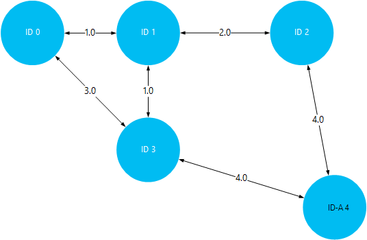

<properties
    pageTitle="Instaliranje i korištenje Giraph na klastere Hadoop u HDInsight | Microsoft Azure"
    description="Saznajte kako prilagoditi HDInsight klaster s Giraph te kako koristiti Giraph."
    services="hdinsight"
    documentationCenter=""
    authors="nitinme"
    manager="jhubbard"
    editor="cgronlun"
    tags="azure-portal"/>

<tags
    ms.service="hdinsight"
    ms.workload="big-data"
    ms.tgt_pltfrm="na"
    ms.devlang="na"
    ms.topic="article"
    ms.date="02/05/2016"
    ms.author="nitinme"/>

# Instaliranje i korištenje Giraph u HDInsight

Saznajte kako prilagoditi Windows na temelju HDInsight klaster s Giraph pomoću akcije skripte i kako koristiti Giraph za obradu veliki grafikona. Informacije o korištenju Giraph sa sustavom Linux klaster, potražite u članku [Instalacija Giraph na klastere HDInsight Hadoop (Linux)](hdinsight-hadoop-giraph-install-linux.md).
 
Giraph na bilo koju vrstu klaster (Hadoop, oluja, HBase, Spark) možete instalirati na Azure HDInsight pomoću *Skripte akcija*. Ogledne skripte da biste instalirali Giraph na programa HDInsight klaster dostupna samo za čitanje Azure spremišta blobova na [https://hdiconfigactions.blob.core.windows.net/giraphconfigactionv01/giraph-installer-v01.ps1](https://hdiconfigactions.blob.core.windows.net/giraphconfigactionv01/giraph-installer-v01.ps1). Ogledne skripte funkcionira samo s HDInsight klaster verzijom 3.1. Dodatne informacije o verzijama klaster servisa HDInsight potražite u članku [HDInsight klaster verzije](hdinsight-component-versioning.md).

**Povezani članci**

- [Kliknite pločicu Giraph klastere HDInsight Hadoop (Linux)](hdinsight-hadoop-giraph-install-linux.md)
- [Stvaranje Hadoop klastere u HDInsight](hdinsight-provision-clusters.md): opće informacije o stvaranju klastere HDInsight.
- [Prilagodba klaster HDInsight pomoću skripte akcije][hdinsight-cluster-customize]: opće informacije o prilagođavanju klastere HDInsight pomoću skripte akcije.
- [Razvoj akcija skripte skripte za HDInsight](hdinsight-hadoop-script-actions.md).

## Što je Giraph?

<a href="http://giraph.apache.org/" target="_blank">Apache Giraph</a> omogućuje izvođenje grafikonu obrade pomoću Hadoop, a mogu koristiti u sklopu Azure HDInsight. Grafikoni model odnose između objekte, primjerice veze između usmjerivača na velikom mrežom kao što je s Internetom ili odnosa među korisnicima na društvenim mrežama (ponekad se nazivaju društvenih grafikonu). Obrada grafikonu omogućuje vam razloga o odnosima između objekata u grafikon, kao što su:

- Označavanje potencijalne prijatelji na temelju trenutnog odnosa.
- Označavanje pretraživanje po najkraćoj usmjeravanje između dvaju računala u mreži.
- Izračunavanje rang stranice web-stranice.

## Instalacija Giraph pomoću portala

1. Stvaranje klaster pomoću mogućnosti za **Stvaranje PRILAGOĐENE** kao što je opisano na [Stvaranje Hadoop klastere u HDInsight](hdinsight-provision-clusters.md#portal).
2. Na stranici čarobnjaka **Akcije skripte** kliknite **dodajte akciju skripte** možete unijeti detalje o akciju skripte kao što je prikazano u nastavku:

    ![Korištenje akcija skriptu da biste prilagodili klaster] (./media/hdinsight-hadoop-giraph-install/hdi-script-action-giraph.png "Korištenje akcija skriptu da biste prilagodili klaster")

    <table border='1'>
        <tr><th>Svojstvo</th><th>Vrijednost</th></tr>
        <tr><td>Ime</td>
            <td>Unesite naziv za skripte akciju. Na primjer, <b>Instalirajte Giraph</b>.</td></tr>
        <tr><td>Skripta URI-JA</td>
            <td>Navedite Uniform Resource Identifier (URI) da biste skriptu koja se poziva da biste prilagodili klaster. Na primjer, <i>https://hdiconfigactions.blob.core.windows.net/giraphconfigactionv01/giraph-installer-v01.ps1</i></td></tr>
        <tr><td>Vrsta čvora</td>
            <td>Navedite čvorove na kojem se izvodi skriptu prilagodbe. Možete odabrati <b>sve čvorove</b>, <b>samo čvorove glave</b>ili <b>samo čvorove tempiranja</b>.
        <tr><td>Parametri</td>
            <td>Navedite parametre, ako je potrebno skripta. Skripta za instalaciju Giraph nisu potrebne parametre, pa možete ostaviti to prazno.</td></tr>
    </table>

    Možete dodati više akcija skriptu da biste instalirali više komponenti na klaster. Nakon što dodate skripte, kliknite kvačicu da biste započeli stvarati klaster.

## Korištenje Giraph

Primjer SimpleShortestPathsComputation koristimo da bismo pokazali osnovni <a href = "http://people.apache.org/~edwardyoon/documents/pregel.pdf">Pregel</a> implementaciju za pronalaženje pretraživanje po najkraćoj put između objekata u grafikon. Slijedite ove korake da biste prenijeli ogledne podatke i posudu uzorka, Pokreni pomoću primjer SimpleShortestPathsComputation, a zatim prikažite rezultate.

1. Prenesite datoteku s oglednim podacima spremište blobova platforme Azure. Na vašem lokalnom radne stanice, stvorite novu datoteku pod nazivom **tiny_graph.txt**. Ona mora sadržavati sljedeće retke:

        [0,0,[[1,1],[3,3]]]
        [1,0,[[0,1],[2,2],[3,1]]]
        [2,0,[[1,2],[4,4]]]
        [3,0,[[0,3],[1,1],[4,4]]]
        [4,0,[[3,4],[2,4]]]

    Prijenos datoteke tiny_graph.txt primarni za pohranu za svoj klaster HDInsight. Upute za prijenos podataka, potražite u članku [prijenos podataka za Hadoop poslove u HDInsight](hdinsight-upload-data.md).

    Ove podatke u članku se opisuje odnos između objekata u usmjerenog graph, koristeći oblik [izvora\_id, izvora\_vrijednosti, [[odredišne\_id], [rub\_vrijednost],...]]. Svaki redak predstavlja odnos između programa **izvora\_id** objekta i jedan ili više **odredišne\_id** objekte. Na **rub\_vrijednost** (ili težina) možete smatrati granica lomljenja ili udaljenost veze između **source_id** i **odredišne\_id**.

    Crta, a pomoću vrijednost (ili težina) kao udaljenost između objekata, iznad podataka može izgledati ovako:

    

4. Pokrenite primjer SimpleShortestPathsComputation. Pomoću sljedeće Cmdlete Azure PowerShell pokrenite primjeru pomoću datoteke tiny_graph.txt kao ulaz. 

    [AZURE.INCLUDE [upgrade-powershell](../../includes/hdinsight-use-latest-powershell.md)]

        $clusterName = "clustername"
        # Giraph examples jar
        $jarFile = "wasbs:///example/jars/giraph-examples.jar"
        # Arguments for this job
        $jobArguments = "org.apache.giraph.examples.SimpleShortestPathsComputation",
                        "-ca", "mapred.job.tracker=headnodehost:9010",
                        "-vif", "org.apache.giraph.io.formats.JsonLongDoubleFloatDoubleVertexInputFormat",
                        "-vip", "wasbs:///example/data/tiny_graph.txt",
                        "-vof", "org.apache.giraph.io.formats.IdWithValueTextOutputFormat",
                        "-op",  "wasbs:///example/output/shortestpaths",
                        "-w", "2"
        # Create the definition
        $jobDefinition = New-AzureHDInsightMapReduceJobDefinition
          -JarFile $jarFile
          -ClassName "org.apache.giraph.GiraphRunner"
          -Arguments $jobArguments

        # Run the job, write output to the Azure PowerShell window
        $job = Start-AzureHDInsightJob -Cluster $clusterName -JobDefinition $jobDefinition
        Write-Host "Wait for the job to complete ..." -ForegroundColor Green
        Wait-AzureHDInsightJob -Job $job
        Write-Host "STDERR"
        Get-AzureHDInsightJobOutput -Cluster $clusterName -JobId $job.JobId -StandardError
        Write-Host "Display the standard output ..." -ForegroundColor Green
        Get-AzureHDInsightJobOutput -Cluster $clusterName -JobId $job.JobId -StandardOutput

    U primjeru iznad zamijenite **clustername** naziv svoj klaster HDInsight koji ima Giraph instaliran.

5. Prikaz rezultata. Po dovršetku posao rezultati će se spremiti u dva Izlazna datoteka u na __wasbs: / / / primjer/izlaz/shotestpaths__ mapu. Datoteke se nazivaju __dio m 00001__ i __dio m 00002__. Poduzmite sljedeće korake da biste preuzeli i prikaz izlaz:

        $subscriptionName = "<SubscriptionName>"       # Azure subscription name
        $storageAccountName = "<StorageAccountName>"   # Azure Storage account name
        $containerName = "<ContainerName>"             # Blob storage container name

        # Select the current subscription
        Select-AzureSubscription $subscriptionName

        # Create the Storage account context object
        $storageAccountKey = Get-AzureStorageKey $storageAccountName | %{ $_.Primary }
        $storageContext = New-AzureStorageContext -StorageAccountName $storageAccountName -StorageAccountKey $storageAccountKey

        # Download the job output to the workstation
        Get-AzureStorageBlobContent -Container $containerName -Blob example/output/shortestpaths/part-m-00001 -Context $storageContext -Force
        Get-AzureStorageBlobContent -Container $containerName -Blob example/output/shortestpaths/part-m-00002 -Context $storageContext -Force

    To će stvoriti strukturu direktorija __Izlaz/primjer/shortestpaths__ u trenutnog direktorija na vaše radne stanice i preuzimanje datoteka dva Izlaz na tom mjestu.

    Pomoću cmdleta __mačka__ prikazuje sadržaj datoteke:

        Cat example/output/shortestpaths/part*

    Izlaz trebao izgledati otprilike ovako:

        0   1.0
        4   5.0
        2   2.0
        1   0.0
        3   1.0

    SimpleShortestPathComputation primjer teško je zadan započeti s objekt ID 1 i pronaći pretraživanje po najkraćoj put s drugim objektima. Da bi se rezultat trebaju biti `destination_id distance`, pri čemu je udaljenost vrijednost (ili težina) rubova putovali između objekt ID 1 i ID ciljne

    Vizualizacija to, možete provjeriti rezultate prema putovanje pretraživanje po najkraćoj putova između ID 1 i druge objekte. Imajte na umu da pretraživanje po najkraćoj put između ID-a 1 i ID 4 5. Ovo je ukupna udaljenost između ID -a 1 i 3, a zatim ID 3 i 4.

    

## Instalacija Giraph pomoću komponente Aure PowerShell

U odjeljku [Prilagodba HDInsight klastere pomoću skripte akcije](hdinsight-hadoop-customize-cluster.md#call_scripts_using_powershell).  Na primjer pokazuje kako instalirati Spark pomoću komponente PowerShell Azure. Morate li prilagoditi skriptu da biste koristili [https://hdiconfigactions.blob.core.windows.net/giraphconfigactionv01/giraph-installer-v01.ps1](https://hdiconfigactions.blob.core.windows.net/giraphconfigactionv01/giraph-installer-v01.ps1).

## Instalacija Giraph pomoću .NET SDK-a

U odjeljku [Prilagodba HDInsight klastere pomoću skripte akcije](hdinsight-hadoop-customize-cluster.md#call_scripts_using_azure_powershell). Uzorak pokazuje kako se instalira Spark pomoću .NET SDK-a. Morate li prilagoditi skriptu da biste koristili [https://hdiconfigactions.blob.core.windows.net/giraphconfigactionv01/giraph-installer-v01.ps1](https://hdiconfigactions.blob.core.windows.net/giraphconfigactionv01/giraph-installer-v01.ps1).

## Vidi također

- [Kliknite pločicu Giraph klastere HDInsight Hadoop (Linux)](hdinsight-hadoop-giraph-install-linux.md)
- [Stvaranje Hadoop klastere u HDInsight](hdinsight-provision-clusters.md): opće informacije o stvaranju klastere HDInsight.
- [Prilagodba klaster HDInsight pomoću skripte akcije][hdinsight-cluster-customize]: opće informacije o prilagođavanju klastere HDInsight pomoću skripte akcije.
- [Razvoj akcija skripte skripte za HDInsight](hdinsight-hadoop-script-actions.md).
- [Instaliranje i korištenje Spark na klastere HDInsight][hdinsight-install-spark]: ogledne skripte akcija o instaliranju Spark.
- [Kliknite pločicu R klastere HDInsight][hdinsight-install-r]: ogledne skripte akcija o instaliranju R.
- [Instalacija Solr na HDInsight klastere](hdinsight-hadoop-solr-install.md): ogledne skripte akcija o instaliranju Solr.

[tools]: https://github.com/Blackmist/hdinsight-tools
[aps]: http://azure.microsoft.com/documentation/articles/install-configure-powershell/

[powershell-install]: ../powershell-install-configure.md
[hdinsight-provision]: hdinsight-provision-clusters.md
[hdinsight-install-r]: hdinsight-hadoop-r-scripts.md
[hdinsight-install-spark]: hdinsight-hadoop-spark-install.md
[hdinsight-cluster-customize]: hdinsight-hadoop-customize-cluster.md
