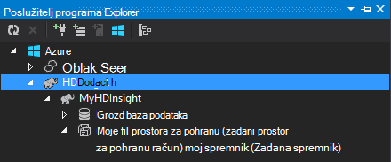

<properties
    pageTitle="Korištenje C# s grozd i Svinja na Hadoop u HDInsight | Microsoft Azure"
    description="Saznajte kako koristiti C# korisnički definirane funkcije (UDF) s grozd i Svinja strujanje u Azure HDInsight."
    services="hdinsight"
    documentationCenter=""
    authors="Blackmist"
    manager="jhubbard"
    editor="cgronlun"
    tags="azure-portal"/>

<tags
    ms.service="hdinsight"
    ms.workload="big-data"
    ms.tgt_pltfrm="na"
    ms.devlang="dotnet"
    ms.topic="article"
    ms.date="10/28/2016"
    ms.author="larryfr"/>

#Korištenje C# korisnički definirane funkcije sa grozd i Svinja strujanja Hadoop u HDInsight

Grozd i Svinja odlični su za rad s podacima u Azure HDInsight, ali ponekad morate dodatne općenite namjene jezik. Grozd i Svinja omogućuju da biste pozvali vanjske kod kroz korisnički definirane funkcije (UDF) ili strujanje.

U ovom dokumentu, Saznajte kako koristiti C# grozd i Svinja.

##Preduvjeti

* Windows 7 ili noviji.

* Visual Studio sljedeće verzije:

    * Visual Studio 2012 Professional/Premium/Ultimate s [obnove 4](http://www.microsoft.com/download/details.aspx?id=39305)

    * Visual Studio 2013 zajednice/Professional/Premium/Ultimate s [obnove 4](https://www.microsoft.com/download/details.aspx?id=44921)

    * Visual Studio 2015.

* Hadoop na HDInsight klaster – potražite u članku [Dodjela resursa za HDInsight klaster](hdinsight-provision-clusters.md) korake da biste stvorili klaster

* Hadoop Alati za Visual Studio. U odjeljku [Prvi koraci pri korištenju HDInsight Hadoop alate za Visual Studio](hdinsight-hadoop-visual-studio-tools-get-started.md) upute za instaliranje i konfiguriranje alata.

##.NET na HDInsight

.NET zajedničkog jezika (CLR) i okviri instaliraju se po zadanom na klastere HDInsight utemeljen na sustavu Windows. To ne omogućuje korištenje C# aplikacije s grozd i Svinja strujanje (podaci se prenose između grozd/Svinja i aplikacije C# putem stdout/stdin).

> [AZURE.NOTE] Trenutno ne postoji podrška za .NET Framework UDF sustavom klastere sustavom Linux HDInsight. 

##.NET i strujanje

Strujanje uključuje grozd i Svinja prosljeđivanje podataka na vanjsku aplikaciju putem stdout i primanje rezultata putem stdin. C# aplikacijama, to je najčešće jednostavno napraviti putem `Console.ReadLine()` i `Console.WriteLine()`.

Budući da grozd i Svinja morate pozvati aplikacije u vrijeme izvođenja, predložak **Aplikacije konzole** treba može koristiti za projekte C#.

##Grozd i C# 35;

###Stvaranje projekta C#

1. Otvorite Visual Studio i stvaranje novog rješenja. Vrsta projekta odaberite **Aplikaciju konzole**i naziv novi projekt **HiveCSharp**.

2. Zamijenite sadržaj **Program.cs** sljedeće:

        using System;
        using System.Security.Cryptography;
        using System.Text;
        using System.Threading.Tasks;

        namespace HiveCSharp
        {
            class Program
            {
                static void Main(string[] args)
                {
                    string line;
                    // Read stdin in a loop
                    while ((line = Console.ReadLine()) != null)
                    {
                        // Parse the string, trimming line feeds
                        // and splitting fields at tabs
                        line = line.TrimEnd('\n');
                        string[] field = line.Split('\t');
                        string phoneLabel = field[1] + ' ' + field[2];
                        // Emit new data to stdout, delimited by tabs
                        Console.WriteLine("{0}\t{1}\t{2}", field[0], phoneLabel, GetMD5Hash(phoneLabel));
                    }
                }
                /// 

                /// Returns an MD5 hash for the given string
                /// 

                /// <param name="input">string value</param>
                /// <returns>an MD5 hash</returns>
                static string GetMD5Hash(string input)
                {
                    // Step 1, calculate MD5 hash from input
                    MD5 md5 = System.Security.Cryptography.MD5.Create();
                    byte[] inputBytes = System.Text.Encoding.ASCII.GetBytes(input);
                    byte[] hash = md5.ComputeHash(inputBytes);

                    // Step 2, convert byte array to hex string
                    StringBuilder sb = new StringBuilder();
                    for (int i = 0; i < hash.Length; i++)
                    {
                        sb.Append(hash[i].ToString("x2"));
                    }
                    return sb.ToString();
                }
            }
        }

3. Stvaranje projekta.

###Prijenos u spremište

1. U Visual Studio, otvorite **Eksplorer za poslužitelj**.

3. Proširite **Azure**, a zatim **HDInsight**.

4. Ako se to od vas zatraži, unesite vjerodajnice za Azure pretplate, a zatim **Prijava**.

5. Proširite klaster HDInsight koje želite uvesti ovu aplikaciju, a zatim **Zadani račun za pohranu**.

    

6. Dvokliknite **Zadani spremnik** za klaster. Otvorit će se novi prozor koji prikazuje sadržaj spremnik zadani.

7. Kliknite ikonu za prijenos, a zatim otvorite mapu **bin\debug** **HiveCSharp** projekta. Na kraju, odaberite **HiveCSharp.exe** datoteku i kliknite **u redu**.

    

8. Po dovršetku prijenos će moći koristiti aplikaciju iz upita grozd.

###Grozd upita

1. U Visual Studio, otvorite **Eksplorer za poslužitelj**.

2. Proširite **Azure**, a zatim **HDInsight**.

5. Desnom tipkom miša kliknite klaster razvijena **HiveCSharp** aplikacije, a zatim odaberite **Pisanje vrste Hive upita**.

6. Za upit grozd, koristite sljedeće:

        add file wasbs:///HiveCSharp.exe;

        SELECT TRANSFORM (clientid, devicemake, devicemodel)
        USING 'HiveCSharp.exe' AS
        (clientid string, phoneLabel string, phoneHash string)
        FROM hivesampletable
        ORDER BY clientid LIMIT 50;

    To označava na `clientid`, `devicemake`, i `devicemodel` polja iz `hivesampletable`, a prosljeđuje polja HiveCSharp.exe aplikacije. Upit očekuje aplikacije da biste se vratili tri polja koje se spremaju kao `clientid`, `phoneLabel`, i `phoneHash`. Upit se očekuje da biste pronašli HiveCSharp.exe u korijenskom direktoriju spremnik zadani prostor za pohranu (`add file wasbs:///HiveCSharp.exe`).

5. Kliknite **Pošalji** da biste poslali posao klaster HDInsight. Otvorit će se prozor **Vrste Hive sažetak zadatka** .

6. Kliknite **Osvježi** da biste osvježili sažetak dok se ne promijeni **Status zadatka** **dovršiti**. Da biste pogledali izlaz posla, kliknite **Izlaz posao**.

##Svinja i C# 35;

###Stvaranje projekta C#

1. Otvorite Visual Studio i stvaranje novog rješenja. Vrsta projekta odaberite **Aplikaciju konzole**i naziv novi projekt **PigUDF**.

2. Zamijenite sadržaj datoteke **Program.cs** sljedeće:

        using System;

        namespace PigUDF
        {
            class Program
            {
                static void Main(string[] args)
                {
                    string line;
                    // Read stdin in a loop
                    while ((line = Console.ReadLine()) != null)
                    {
                        // Fix formatting on lines that begin with an exception
                        if(line.StartsWith("java.lang.Exception"))
                        {
                            // Trim the error info off the beginning and add a note to the end of the line
                            line = line.Remove(0, 21) + " - java.lang.Exception";
                        }
                        // Split the fields apart at tab characters
                        string[] field = line.Split('\t');
                        // Put fields back together for writing
                        Console.WriteLine(String.Join("\t",field));
                    }
                }
            }
        }

    Ova aplikacija će raščlaniti retke šalje Svinja i Preoblikuj retke koje započinju s `java.lang.Exception`.

3. Spremite **Program.cs**i stvaranje projekta.

###Prijenos aplikacije

1. Svinja strujanje očekuje aplikacija biti lokalni klaster datotečnom sustavu. Omogućivanje udaljene radne površine za HDInsight klaster i povežite se s njom slijedeći upute u [klastere HDInsight pomoću RDP za povezivanje](hdinsight-administer-use-management-portal.md#rdp).

2. Nakon uspostave kopirajte **PigUDF.exe** iz imenika **smeće/pogrešaka** za projekt PigUDF na lokalnom računalu i zalijepite u direktoriju **PIG_HOME %** na klaster.

###Korištenje aplikacije iz latinica Svinja

1. Sesija udaljene radne površine početnom naredbenog retka Hadoop pomoću ikone **Hadoop naredbenog retka** na radnoj površini.

2. Da biste pokrenuli naredbeni redak Svinja, koristite sljedeće:

        cd %PIG_HOME%
        bin\pig

    Primit ćete s na `grunt>` upit.

3. Unesite sljedeće da biste pokrenuli jednostavne Svinja posla pomoću aplikacije za .NET Framework:

        DEFINE streamer `pigudf.exe` SHIP('pigudf.exe');
        LOGS = LOAD 'wasbs:///example/data/sample.log' as (LINE:chararray);
        LOG = FILTER LOGS by LINE is not null;
        DETAILS = STREAM LOG through streamer as (col1, col2, col3, col4, col5);
        DUMP DETAILS;

    Na `DEFINE` izjava stvara pseudonima od `streamer` za aplikacije pigudf.exe i `SHIP` distribuira preko čvorovi u klasteru. Naknadno `streamer` se koristi s u `STREAM` operator za obradu jedan crte koje se nalaze u ZAPISNIKU i vratiti podatke kao niz stupaca.

> [AZURE.NOTE] Naziv aplikacije koji se koristi za strujanje mora staviti u na \` (backtick) znaka kada sukobima, i "(jednostruke navodnike) kada se koristi s `SHIP`.

3. Nakon unosa posljednjeg retka, trebala posao. Ti će se vratiti izlaz sličnu ovoj:

        (2012-02-03 20:11:56 SampleClass5 [WARN] problem finding id 1358451042 - java.lang.Exception)
        (2012-02-03 20:11:56 SampleClass5 [DEBUG] detail for id 1976092771)
        (2012-02-03 20:11:56 SampleClass5 [TRACE] verbose detail for id 1317358561)
        (2012-02-03 20:11:56 SampleClass5 [TRACE] verbose detail for id 1737534798)
        (2012-02-03 20:11:56 SampleClass7 [DEBUG] detail for id 1475865947)

##Sažetak

U ovom dokumentu ste naučili kako koristiti aplikaciju za .NET Framework grozd i Svinja na HDInsight. Ako želite da biste saznali kako koristiti Python s grozd i Svinja, potražite u članku [Korištenje Python s grozd i Svinja u HDInsight](hdinsight-python.md).

Druge načine koristiti Svinja i grozd, a dodatne informacije o korištenju MapReduce potražite u sljedećim člancima:

* [Korištenje grozd s HDInsight](hdinsight-use-hive.md)

* [Korištenje Svinja s HDInsight](hdinsight-use-pig.md)

* [Korištenje MapReduce s HDInsight](hdinsight-use-mapreduce.md)
