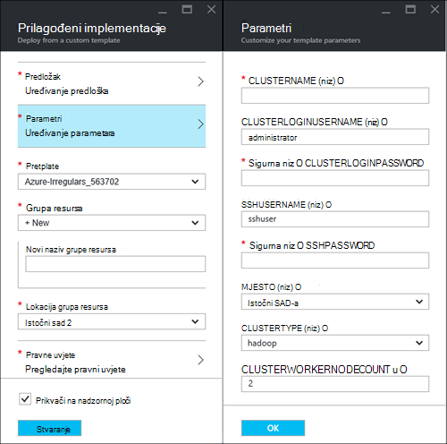
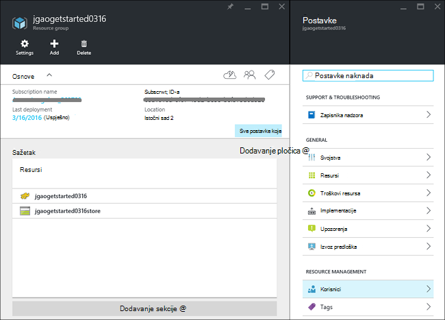
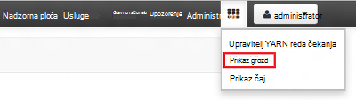
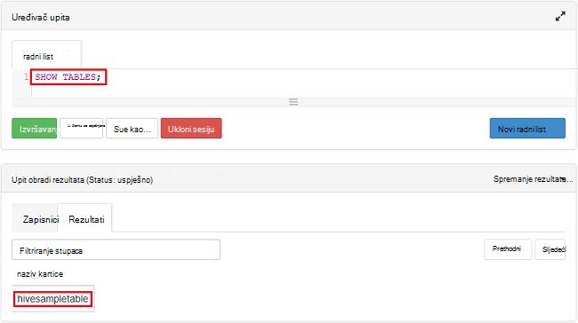

<properties
    pageTitle="Praktični vodič Linux: početak rada s Hadoop i grozd | Microsoft Azure"
    description="Slijedite ovaj Praktični vodič Linux da biste počeli koristiti Hadoop u HDInsight. Saznajte kako Dodjela resursa za klastere Linux i podataka pomoću grozd za upite."
    services="hdinsight"
    documentationCenter=""
    authors="mumian"
    manager="jhubbard"
    editor="cgronlun"
    tags="azure-portal"/>

<tags
    ms.service="hdinsight"
    ms.devlang="na"
    ms.topic="hero-article"
    ms.tgt_pltfrm="na"
    ms.workload="big-data"
    ms.date="09/14/2016"
    ms.author="jgao"/>

# Hadoop Praktični vodič: početak rada s operacijskim sustavom Linux Hadoop u HDInsight

> [AZURE.SELECTOR]
- [Sustavom Linux](hdinsight-hadoop-linux-tutorial-get-started.md)
- [Utemeljen na sustavu Windows](hdinsight-hadoop-tutorial-get-started-windows.md)

Saznajte kako stvoriti klastere sustavom Linux [Hadoop](http://hadoop.apache.org/) u HDInsight i pokretanje grozd zadacima u HDInsight. [Vrste Hive Apache](https://hive.apache.org/) je komponentu najčešće korištene u zajednici Hadoop. Trenutno HDInsight isporučuje se s 4 različite vrste: [Hadoop](hdinsight-hadoop-introduction.md), [Spark](hdinsight-apache-spark-overview.md), [HBase](hdinsight-hbase-overview.md) i [oluja](hdinsight-storm-overview.md).  Svaka vrsta klaster podržava drugi skup komponenti. Podržavaju sve vrste 4 klaster grozd. Popis podržanih komponente servisa HDInsight potražite u članku [što je novo u verzijama klaster Hadoop nudi HDInsight?](hdinsight-component-versioning.md)  

[AZURE.INCLUDE [delete-cluster-warning](../../includes/hdinsight-delete-cluster-warning.md)]

## Preduvjeti

Prije početka ovog praktičnog vodiča, morate imati:

- **Azure pretplatu**: da biste stvorili besplatan račun probne jedan mjesec, otiđite do [azure.microsoft.com/free](https://azure.microsoft.com/free).

### Preduvjeti za kontrolu pristupa

[AZURE.INCLUDE [access-control](../../includes/hdinsight-access-control-requirements.md)]

## Stvaranje klaster

Većinu zadataka Hadoop su obrade. Stvaranje klaster, pokrenite neke zadatke, a zatim izbrišite klaster. U ovom ćete odjeljku stvarate klaster sustavom Linux Hadoop u HDInsight pomoću [predloška Azure Voditelj resursa](../resource-group-template-deploy.md). Voditelj resursa predložak nije u potpunosti prilagoditi; omogućuje jednostavno stvaranje Azure resurse kao što su HDInsight. Voditelj resursa predložak sučelje nije potrebna za praćenje ovog praktičnog vodiča. Drugi načini stvaranja klaster i razumijevanje svojstvima koji se koriste u ovom ćete praktičnom vodiču, potražite u članku [Stvaranje HDInsight klastere](hdinsight-hadoop-provision-linux-clusters.md). Voditelj resursa predložak koji se koristi u ovom ćete praktičnom vodiču nalazi se u javnom blob spremnika [https://hditutorialdata.blob.core.windows.net/armtemplates/create-linux-based-hadoop-cluster-in-hdinsight.json](https://hditutorialdata.blob.core.windows.net/armtemplates/create-linux-based-hadoop-cluster-in-hdinsight.json). 

1. Kliknite na sljedećoj slici se prijaviti Azure i otvorite predložak Voditelj resursa na portalu za Azure. 

    

2. Iz plohu **parametara** unesite sljedeće:

    .

    - **ClusterName**: Unesite naziv klaster Hadoop koje ćete stvoriti.
    - **Klaster korisničko ime i lozinku**: ime za prijavu zadani je **administrator**.
    - **SSH korisničko ime i lozinku**: korisničko ime zadani je **sshuser**.  Možete je preimenovati. 
    
    Drugi parametri obavezno za praćenje ovog praktičnog vodiča. Ostavite ih kao što su. 
    
    Svaki klaster ima ovisnost za računa spremišta blobova platforme Azure. Obično naziva kao zadani račun za pohranu. HDInsight klaster i njegov zadani prostor za pohranu račun mora biti Suradnja smještena u istom Azure regiji. Brisanje klastere će izbrisati račun za pohranu. U predlošku, zadani naziv računa spremišta definirana je kao naziv klaster pomoću "store" dodan. 
    
3. Kliknite **u redu** da biste spremili parametre.
4. Iz plohu **implementacije Prilagođeno** unesite **novi naziv grupe resursa** da biste stvorili novu grupu resursa.  Grupa resursa je spremnik koje grupira klaster, račun zavisne prostora za pohranu i drugi s. Lokacija grupu resursa može se razlikovati od klaster mjesto.
5. Kliknite **pravne uvjete**, a zatim kliknite **Stvori**.
6. Provjerite je li **Prikvači na nadzornoj ploči** potvrdni okvir odabran, a zatim kliknite **Stvori**. Prikazat će se novi pločicu pod naslovom **implementacije uvođenje predloška**. Potrebno je oko oko 20 minuta da biste stvorili klaster. 
7.  Nakon stvaranja klaster opisa pločicu mijenja se naziv grupe resursa koje ste naveli. I portalu automatski se otvara i prikazuje dva blades klaster te postavke klaster. 

    .

    Postoje dva resursa, klaster i zadani račun za pohranu.

##Pokretanje grozd upita

[Vrste Hive Apache](hdinsight-use-hive.md) je najpopularnijih komponenta koristi u HDInsight. Da biste pokrenuli grozd zadacima u HDInsight na više načina. U ovom ćete praktičnom vodiču će koristiti prikaz Ambari grozd s portala sustava da biste pokrenuli neke zadatke grozd. Druge načine za slanje grozd zadacima potražite u članku [Korištenje vrste Hive u HDInsight](hdinsight-use-hive.md).

1. Pronađite **https://&lt;ClusterName >. azurehdinsight.net**, pri čemu &lt;ClusterName > je skupine koju ste stvorili u prethodnom odjeljku da biste otvorili Ambari.
2. Unesite Hadoop korisničko ime i lozinku koju ste naveli u prethodnom odjeljku. Korisničko ime zadani je **administrator**.
3. Otvorite **Prikaz vrste Hive** kao što je prikazano u sljedećim snimku zaslona:

    .
4. U odjeljku __Uređivača upita__ na stranici zalijepite sljedeće naredbe HiveQL u radnom listu:

        SHOW TABLES;

    >[AZURE.NOTE] Točka-zarez zahtijeva grozd.       
        
5. Kliknite __izvršiti__. __Rezultati upita postupak__ sekcije treba pojaviti ispod uređivača upita i prikazivati informacije o posao. 

    Po dovršetku upita u odjeljku __Rezultati upita postupak__ će prikazati rezultate operacije. Prikazat će jedne tablice pod nazivom **hivesampletable**. Primjer tablice grozd isporučuje se s sve klastere HDInsight.

    .

6. Ponovite korake 4 i 5 da biste pokrenuli sljedeći upit:

        SELECT * FROM hivesampletable;

    > [AZURE.TIP] Imajte na umu __spremiti rezultate__ padajući popis u gornjem lijevom kutu odjeljka __Rezultata upita postupak__ ; To možete koristiti da biste preuzeli rezultate ili ih spremiti na HDInsight prostora za pohranu u CSV datoteku.

7. Kliknite **Povijest** da biste dobili popis zadataka.

Nakon dovršetka posla grozd, možete [Izvoz rezultata baze podataka Azure SQL ili baze podataka SQL Server](hdinsight-use-sqoop-mac-linux.md), možete učiniti i [vizualizacija rezultata pomoću programa Excel](hdinsight-connect-excel-power-query.md). Dodatne informacije o korištenju grozd u HDInsight potražite u članku [korištenje vrste Hive i HiveQL s Hadoop u HDInsight da biste analizirali oglednu datoteku za log4j Apache](hdinsight-use-hive.md).

##Čišćenje vodič

Kada dovršite vodič, preporučujemo vam da biste izbrisali klaster. S HDInsight, vaši podaci se pohranjuju u Azure prostor za pohranu, da biste mogli sigurno izbrisati klaster kada se ne koristi. Također se naplatiti klaster programa HDInsight čak i ako se ne koristi. Budući da su naknade za klaster više puta veći od naknade za pohranu, je li bolje Ekonomske da biste izbrisali klastere kada se ne nalaze u upotrebi. 

>[AZURE.NOTE] Pomoću [Tvorničke Azure podatke](hdinsight-hadoop-create-linux-clusters-adf.md), možete stvoriti HDInsight klastere na zahtjev i konfiguriranje TimeToLive postavke da biste izbrisali skupina automatski. 

**Da biste izbrisali klaster i/ili zadani račun za pohranu**

1. Prijavite se na [portal za Azure](https://portal.azure.com).
2. S portala nadzorne ploče, kliknite naziv grupe resursa koji ste koristili kada ste stvorili klaster.
3. Kliknite **Izbriši** plohu resursa da biste izbrisali grupu resursa koji sadrži klaster i zadani račun za pohranu; ili kliknite naziv klaster pločicu **Resursi** , a zatim kliknite **Izbriši** plohu klaster. Bilješke i brisanje grupa resursa će izbrišite račun za pohranu. Ako želite zadržati račun za pohranu, odaberite da biste izbrisali samo klaster.

## Daljnji koraci

U ovom ćete praktičnom vodiču ste naučili kako stvoriti sustavom Linux HDInsight klaster pomoću predloška Voditelj resursa i upute za izvođenje osnovnih grozd upita.

Dodatne informacije o analiza podataka sa servisa HDInsight potražite u sljedećim člancima:

- Da biste saznali više o korištenju grozd s HDInsight, uključujući upute za izvođenje upita grozd iz Visual Studio potražite u članku [Korištenje vrste Hive s HDInsight][hdinsight-use-hive].

- Da biste saznali više o Svinja, jezik koji se koristi za pretvaranje podataka, potražite u članku [Korištenje Svinja s HDInsight][hdinsight-use-pig].

- Da biste saznali više o MapReduce, način pisati programe koji obrada podataka na Hadoop, potražite u članku [Korištenje MapReduce s HDInsight][hdinsight-use-mapreduce].

- Dodatne informacije o korištenju alata za HDInsight za Visual Studio da biste analizirali podatke na HDInsight, potražite u članku [Prvi koraci pri korištenju alata Visual Studio Hadoop za HDInsight](hdinsight-hadoop-visual-studio-tools-get-started.md).

Ako ste spremni za početak rada s vlastitim podacima i dodatne informacije o načinu HDInsight sprema podatke ili upute za preuzimanje podataka u HDInsight potražite u sljedećim člancima:

- Informacije o načinu HDInsight koristi spremište blobova platforme Azure, potražite u članku [Korištenje Azure blobova s HDInsight](hdinsight-hadoop-use-blob-storage.md).

- Informacije o tome kako prenijeti podatke servisa HDInsight potražite u članku [prijenos podataka HDInsight][hdinsight-upload-data].

Ako želite da biste saznali više o stvaranju ili upravljanje programa HDInsight klaster, pogledajte sljedeće:

- Informacije o upravljanju svoj klaster sustavom Linux HDInsight potražite u članku [Upravljanje HDInsight klastere pomoću Ambari](hdinsight-hadoop-manage-ambari.md).

- Da biste saznali više o mogućnostima možete odabrati prilikom stvaranja programa HDInsight klaster, potražite u članku [Stvaranje HDInsight na Linux pomoću prilagođenih mogućnosti](hdinsight-hadoop-provision-linux-clusters.md).

- Ako su vam već poznati Linux i Hadoop, ali želite saznati pojedinosti o Hadoop na na HDInsight potražite u članku [Rad s HDInsight na Linux](hdinsight-hadoop-linux-information.md). To su navedeni opisi kao što su:

    * URL-ova za usluga klaster, kao što su Ambari i WebHCat
    * Mjesto datoteke Hadoop i primjeri na lokalnom sustavu datoteka
    * Korištenje programa Azure prostora za pohranu (WASB) umjesto HDFS kao zadane podatke pohrana

[1]: ../HDInsight/hdinsight-hadoop-visual-studio-tools-get-started.md

[hdinsight-provision]: hdinsight-provision-clusters.md
[hdinsight-admin-powershell]: hdinsight-administer-use-powershell.md
[hdinsight-upload-data]: hdinsight-upload-data.md
[hdinsight-use-mapreduce]: hdinsight-use-mapreduce.md
[hdinsight-use-hive]: hdinsight-use-hive.md
[hdinsight-use-pig]: hdinsight-use-pig.md

[powershell-download]: http://go.microsoft.com/fwlink/p/?linkid=320376&clcid=0x409
[powershell-install-configure]: powershell-install-configure.md
[powershell-open]: powershell-install-configure.md#Install

[img-hdi-dashboard]: ./media/hdinsight-hadoop-tutorial-get-started-windows/HDI.dashboard.png
[img-hdi-dashboard-query-select]: ./media/hdinsight-hadoop-tutorial-get-started-windows/HDI.dashboard.query.select.png
[img-hdi-dashboard-query-select-result]: ./media/hdinsight-hadoop-tutorial-get-started-windows/HDI.dashboard.query.select.result.png
[img-hdi-dashboard-query-select-result-output]: ./media/hdinsight-hadoop-tutorial-get-started-windows/HDI.dashboard.query.select.result.output.png
[img-hdi-dashboard-query-browse-output]: ./media/hdinsight-hadoop-tutorial-get-started-windows/HDI.dashboard.query.browse.output.png
[image-hdi-clusterstatus]: ./media/hdinsight-hadoop-tutorial-get-started-windows/HDI.ClusterStatus.png
[image-hdi-gettingstarted-powerquery-importdata]: ./media/hdinsight-hadoop-tutorial-get-started-windows/HDI.GettingStarted.PowerQuery.ImportData.png
[image-hdi-gettingstarted-powerquery-importdata2]: ./media/hdinsight-hadoop-tutorial-get-started-windows/HDI.GettingStarted.PowerQuery.ImportData2.png
