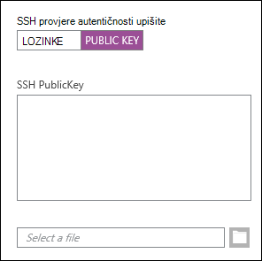
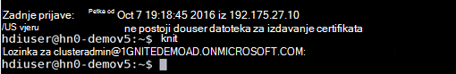
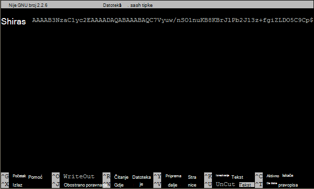

<properties
   pageTitle="Koristite tipke SSH sa sustavom Linux Hadoop iz Linux, Unix ili OS X | Microsoft Azure"
   description=" Možete pristupiti sustavom Linux HDInsight pomoću sigurne ljuske (SSH). Ovaj dokument pruža informacije o korištenju SSH s HDInsight klijenata Linux, Unix ili OS X."
   services="hdinsight"
   documentationCenter=""
   authors="Blackmist"
   manager="jhubbard"
   editor="cgronlun"
    tags="azure-portal"/>

<tags
   ms.service="hdinsight"
   ms.devlang="na"
   ms.topic="get-started-article"
   ms.tgt_pltfrm="na"
   ms.workload="big-data"
   ms.date="09/13/2016"
   ms.author="larryfr"/>

#<a name="use-ssh-with-linux-based-hadoop-on-hdinsight-from-linux-unix-or-os-x"></a>Koristite SSH sa sustavom Linux Hadoop na HDInsight iz Linux, Unix ili OS X

> [AZURE.SELECTOR]
- [Windows](hdinsight-hadoop-linux-use-ssh-windows.md)
- [Linux, Unix, OS X](hdinsight-hadoop-linux-use-ssh-unix.md)

[Sigurne ljuske (SSH)](https://en.wikipedia.org/wiki/Secure_Shell) omogućuje daljinski izvođenje operacije na vašem klastere sustavom Linux HDInsight pomoću sučelja naredbenog retka. Ovaj dokument pruža informacije o korištenju SSH s HDInsight klijenata Linux, Unix ili OS X.

> [AZURE.NOTE] Koraci u ovom članku pretpostavljaju korištenje Linux, Unix ili OS X klijent. Ove korake može se izvesti na klijent sa sustavom Windows ako ste instalirali paket koji pruža `ssh` i `ssh-keygen`, primjerice [tulum Ubuntu na Windows](https://msdn.microsoft.com/commandline/wsl/about).
>
> Ako nije instaliran Windows klijent SSH, koristite korake u [Koristiti SSH sa sustavom Linux HDInsight (Hadoop) iz sustava Windows](hdinsight-hadoop-linux-use-ssh-windows.md) za informacije o instaliranju i korištenju PuTTY.

##<a name="prerequisites"></a>Preduvjeti

* **ssh-keygen** i **ssh** za klijente Linux, Unix i OS X. Ovaj uslužni programi obično su obezbeđeni s operacijski sustav ili dostupna kroz sustav upravljanja paket.

* Moderna web-preglednik koji podržava HTML5.

ILI

* [Azure CLI za Defragmentaciju](../xplat-cli-install.md).

    [AZURE.INCLUDE [use-latest-version](../../includes/hdinsight-use-latest-cli.md)] 

##<a name="what-is-ssh"></a>Što je SSH?

SSH je uslužni program za prijavljivanje na i daljinski izvršavanja naredbi na udaljenom poslužitelju. Sa sustavom Linux HDInsight SSH uspostavlja šifrirana veza s headnode klastera i pruža naredbenog retka koji koristite upišite naredbe. Naredbe zatim izvršiti izravno na poslužitelju.

###<a name="ssh-user-name"></a>SSH korisničko ime

SSH korisničko ime je naziv koju koristite za provjeru HDInsight klastera. Kada odredite SSH korisničko ime tijekom stvaranja klastera ovog korisnika stvara se na svim čvorovima klastera. Nakon kreiranja klastera korisničko ime možete koristiti za povezivanje s headnodes HDInsight klastera. Iz headnodes, zatim možete povezati pojedinačnih radnih čvorova.

###<a name="ssh-password-or-public-key"></a>SSH lozinku ili javni ključ

SSH korisnika možete koristiti lozinku ili javni ključ za provjeru autentičnosti. Lozinka je upravo niza teksta napravite gore, dok je javni ključ dio kriptografskog ključa par generira za jedinstvenu identifikaciju.

Ključ je sigurniji od lozinku, međutim zahtijeva dodatne korake za stvaranje ključa i morate zadržati datoteke koja sadrži ključ na sigurno mjesto. Svatko dobitka pristup datotekama ključa, oni dobiti pristup vašem računu. Ili ako izgubite ključ datoteke neće moći Prijava na vaš račun.

Ključ par sastoji se od javni ključ (koji se šalje poslužitelju HDInsight) i privatni ključ (koji se čuvaju na klijentskom računalu.) Kada se povezati s HDInsight poslužiteljem pomoću SSH, klijent SSH će koristiti privatni ključ na vašem računalu za provjeru autentičnosti s poslužiteljem.

##<a name="create-an-ssh-key"></a>Stvaranje ključa SSH

Koristite sljedeće informacije ako planirate na SSH tipke pomoću vaše klastera. Ako planirate na korištenje lozinke, možete preskočiti ovu sekciju.

1. Otvorite terminalske sesije i koristite sljedeću naredbu da biste vidjeli ako imate sve postojeće SSH tipke:

        ls -al ~/.ssh

    Potražite sljedeće datoteke u imenik unos. Te su uobičajena imena za javne ključeve SSH.

    * ID\_dsa.pub
    * ID\_ecdsa.pub
    * ID\_ed25519.pub
    * ID\_rsa.pub

2. Ako ne želite koristiti postojeće datoteke ili ste nema postojeće SSH ključeva, koristite sljedeće da biste generirali novu datoteku:

        ssh-keygen -t rsa

    Zatražit će se sljedeće informacije:

    * Mjesto datoteke - mjesto zadano za ~/.ssh/id\_rsa.
    * Pristupni izraz - a od vas će se zatražiti ponovno unesite to.

        > [AZURE.NOTE] Preporučujemo da koristite sigurnu pristupni izraz za ključ. Međutim, ako se zaboravi pristupni izraz ne postoji način za oporavak ga.

    Po završetku naredba će imati dvije nove datoteke, privatni ključ (na primjer, **id\_rsa**) i javni ključ (Ako, na primjer, **id\_rsa.pub**).

##<a name="create-a-linux-based-hdinsight-cluster"></a>Stvaranje klastera sustavom Linux HDInsight

Kada stvarate klastera sustavom Linux HDInsight, morate navesti javni ključ prethodno stvoreno. Postoje dva načina za stvaranje klastera HDInsight iz Linux, Unix ili OS X klijenata:

* Za stvaranje klastera **Azure portala** - koristi portal temeljene na webu.

* **CLI za Defragmentaciju azure za Mac, Linux i Windows** - koristi naredbenog retka naredbe za stvaranje klastera.

Svaki od tih metoda će zahtijevati lozinku ili javni ključ. Potpune informacije o stvaranju klastera sustavom Linux HDInsight potražite [klastere sustavom Linux dodjele resursa HDInsight](hdinsight-hadoop-provision-linux-clusters.md).

###<a name="azure-portal"></a>Azure Portal

Prilikom korištenja [Portala Azure] [ preview-portal] da biste stvorili klastera sustavom Linux HDInsight, morate unijeti **SSH KORISNIČKO ime**, i odaberite unesite **lozinku** ili **SSH JAVNI KLJUČ**.

Ako odaberete **SSH JAVNI KLJUČ**, možete zalijepiti javni ključ (sadržani u datoteku s nastavkom **.pub** ) u polje __SSH PublicKey__ , ili odaberite Pregledaj i odaberite javni ključ datoteke __Odaberite datoteku__ .



> [AZURE.NOTE] Ključna datoteka je jednostavno datoteka teksta. Sadržaj trebala bi se pojaviti sličnu sljedećoj:
> ```
ssh-rsa AAAAB3NzaC1yc2EAAAADAQABAAABAQCelfkjrpYHYiks4TM+r1LVsTYQ4jAXXGeOAF9Vv/KGz90pgMk3VRJk4PEUSELfXKxP3NtsVwLVPN1l09utI/tKHQ6WL3qy89WVVVLiwzL7tfJ2B08Gmcw8mC/YoieT/YG+4I4oAgPEmim+6/F9S0lU2I2CuFBX9JzauX8n1Y9kWzTARST+ERx2hysyA5ObLv97Xe4C2CQvGE01LGAXkw2ffP9vI+emUM+VeYrf0q3w/b1o/COKbFVZ2IpEcJ8G2SLlNsHWXofWhOKQRi64TMxT7LLoohD61q2aWNKdaE4oQdiuo8TGnt4zWLEPjzjIYIEIZGk00HiQD+KCB5pxoVtp user@system
> ```

Ovo stvara prijava za navedeni korisnik pomoću lozinke ili javni ključ pružite.

###<a name="azure-command-line-interface-for-mac-linux-and-windows"></a>Azure sučelje naredbenog retka za Mac, Linux i Windows

[CLI za Defragmentaciju Azure za Mac, Linux i Windows](../xplat-cli-install.md) možete koristiti za stvaranje nove klastera korištenjem u `azure hdinsight cluster create` naredba.

Dodatne informacije o korištenju ovu naredbu potražite [klastere dodjele Hadoop Linux u HDInsight pomoću prilagođene mogućnosti](hdinsight-hadoop-provision-linux-clusters.md).

##<a name="connect-to-a-linux-based-hdinsight-cluster"></a>Povezivanje s HDInsight sustavom Linux klastera

Iz sesije terminalskog koristite naredbu SSH za povezivanje klastera headnode pružanjem adresa i korisničko ime:

* **Adresa SSH** - postoje dvije adrese mogu se koristiti za povezivanje klastera pomoću SSH:

    * **Povezivanje na headnode**: naziv klastera popraćen **-ssh.azurehdinsight.net**. Na primjer, **mycluster ssh.azurehdinsight.net**.
    
    * **Povezivanje s ruba čvor**: Ako vaše klastera je R poslužitelj na HDInsight, klastera također sadržavati čvor rubu koji može se pristupiti pomoću **RServer.CLUSTERNAME.ssh.azurehdinsight.net**, gdje je __CLUSTERNAME__ naziv klastera.

* **Korisničko ime** - u SSH korisničko ime koje ste naveli kada ste stvorili klastera.

Sljedeći primjer će povezati primarni headnode **mycluster** kao korisnik **me**:

    ssh me@mycluster-ssh.azurehdinsight.net

Ako se koristi lozinku za korisnički račun, sustav će zatražiti unos lozinke.

Ako se koristi SSH ključ koji je osigurana s pristupni izraz, sustav će zatražiti unesite pristupni izraz. U suprotnom, SSH će pokušati automatski provjeriti autentičnost koristeći jedan od lokalnog privatnih ključeva na vašem klijentskom računalu.

> [AZURE.NOTE] SSH nije automatski provjeru autentičnosti s ispravnom privatni ključ, koristite parametar **-i** i odredite put do privatnog ključa. Sljedeći primjer učitavanje privatni ključ iz `~/.ssh/id_rsa`:
>
> `ssh -i ~/.ssh/id_rsa me@mycluster-ssh.azurehdinsight.net`

Ako se povezujete pomoću adrese za u headnode, a priključak nije naveden, SSH će zadani priključak 22, koji će se povezati s primarnog headnode na HDInsight klastera. Ako koristite priključak 23 će povezati sekundarne. Dodatne informacije o u headnodes potražite [Raspoloživost i pouzdanosti klastere Hadoop u HDInsight](hdinsight-high-availability-linux.md).

###<a name="connect-to-worker-nodes"></a>Povezivanje s čvorove radnika

Čvorovi radnika nisu izravno pristupiti iz izvan Azure datacenter, ali se može pristupiti iz klastera headnode putem SSH.

Ako koristite SSH ključ za provjeru autentičnosti korisnički račun na vaš klijent morate dovršiti sljedeće korake:

1. Pomoću uređivača teksta, otvorite `~/.ssh/config`. Ako ta datoteka ne postoji, možete je stvoriti unosom `touch ~/.ssh/config` u na terminal.

2. Dodajte sljedeće datoteke. Zamijeniti *CLUSTERNAME* s nazivom HDInsight klastera.

        Host CLUSTERNAME-ssh.azurehdinsight.net
          ForwardAgent yes

    Konfigurira SSH agent prosljeđivanje HDInsight klastera.

3. Testiranje SSH agent prosljeđivanje pomoću sljedeće naredbe iz na terminal:

        echo "$SSH_AUTH_SOCK"

    To treba vratiti informacije slične sljedećima:

        /tmp/ssh-rfSUL1ldCldQ/agent.1792

    Ako ništa nije vratio označava **ssh agent** nije pokrenut. U dokumentaciji operacijskog sustava za određene korake na instaliranje i konfiguriranje **ssh agent**ili pogledajte [pomoću ssh agent s ssh](http://mah.everybody.org/docs/ssh).

4. Nakon što ste provjerili je pokrenut **ssh agent** za dodavanje privatni ključ SSH agenta koristite sljedeće:

        ssh-add ~/.ssh/id_rsa

    Ako se privatni ključ spremljen u drugu datoteku, zamijeniti `~/.ssh/id_rsa` s put do datoteke.

Koristite sljedeće korake za povezivanje radnika čvorova za vaše klastera.

> [AZURE.IMPORTANT] Ako koristite ključ SSH provjeriti autentičnost vašeg računa, morate dovršiti prethodne korake da biste provjerili radi li taj agent za prosljeđivanje.

1. Povezivanje klastera HDInsight pomoću SSH kao što je prethodno opisano.

2. Kada ste povezani, koristite sljedeće dohvatiti popis čvorova u vašem klastera. Zamijenite *ADMINPASSWORD* lozinku administratorskog računa klastera. Zamijenite *CLUSTERNAME* naziv vaše klastera.

        curl --user admin:ADMINPASSWORD https://CLUSTERNAME.azurehdinsight.net/api/v1/hosts

    To će vratiti informacije u obliku JSON za čvorove klastera, uključujući `host_name`, koji sadrži i potpuno kvalificirani naziv domene (FQDN) za svaki čvor. Sljedeći primjer je na `host_name` stavka vraćene naredbom **curl** :

        "host_name" : "workernode0.workernode-0-e2f35e63355b4f15a31c460b6d4e1230.j1.internal.cloudapp.net"

3. Kada imate popis radnih čvorova koji želite povezati, koristite sljedeću naredbu iz sesije SSH na poslužitelj da biste otvorili vezu radnika čvor:

        ssh USERNAME@FQDN

    *Korisničko ime* zamijeniti SSH korisničko ime i *FQDN* s FQDN radnika čvor. Na primjer, `workernode0.workernode-0-e2f35e63355b4f15a31c460b6d4e1230.j1.internal.cloudapp.net`.

    > [AZURE.NOTE] Ako koristite lozinku za provjeru autentičnosti SSH sesiju, zatražit će se da unesete lozinku. Ako koristite ključ SSH vezu treba Završi bez upita.

4. Nakon što je uspostavljena je na sesiju, terminal upit promijenit će se iz `username@hn#-clustername` na `username@wk#-clustername` da biste naznačili da su povezani s radnika čvor. Naredbe u ovom trenutku pokretanje će se izvoditi na radnika čvor.

4. Kada završite izvođenje akcije na čvoru radnika koristiti u `exit` naredba zatvoriti sesiju radnika čvor. To će vratiti da u `username@hn#-clustername` upit.

## <a name="connect-to-a-domain-joined-hdinsight-cluster"></a>Povezivanje pridruženo domeni HDInsight klastera

[Pridruženo domeni HDInsight](hdinsight-domain-joined-introduction.md) integrira Kerberos Hadoop HDInsight. Jer korisnik SSH nije se korisnik domene aktivnog Direcotry, korisnički račun ne može pokrenuti Hadoop naredbe iz ljuske SSH na klastera pridruženo domeni izravno. Prvo morate pokrenuti *kinit* . 

**Da biste pokrenuli grozd upiti klastera pridruženo domeni HDInsight pomoću SSH**

1. Povezivanje pridruženo domeni HDInsight klastera pomoću SSH.  Instrocutions, u odjeljku [Povezivanje s HDInsight sustavom Linux klastera](#connect-to-a-linux-based-hdinsight-cluster).
2. Pokrenite kinit. On će vas upitati za domene korisničko ime i lozinku korisnika domene. Dodatne informacije o konfigurirati korisnici domene za domenu pridruženo klastere HDInsight, pogledajte [klastere pridruženo domeni konfiguriranje HDInisight](hdinsight-domain-joined-configure.md).

    
3. Otvorite grozd unesite konzole po:

        hive

    Zatim pokrenite naredbe grozd.

##<a name="add-more-accounts"></a>Dodajte dodatne račune

1. Generiraj novi javni ključ i privatni ključ za novi korisnički račun kao što je opisano u sekciji [Stvaranje ključa SSH](#create-an-ssh-key-optional) .

    > [AZURE.NOTE] Privatni ključ treba ili generira na klijentskom računalu koje će se koristiti za povezivanje s klastera korisnika ili sigurno prenose takve klijenta nakon stvaranja.

1. Iz SSH sesije za klastera, dodajte novi korisnik s sljedeću naredbu:

        sudo adduser --disabled-password <username>

    To će stvoriti novi korisnički račun, ali će onemogućiti provjere autentičnosti lozinke.

2. Stvaranje direktorija i datoteke držite tipku pomoću sljedeće naredbe:

        sudo mkdir -p /home/<username>/.ssh
        sudo touch /home/<username>/.ssh/authorized_keys
        sudo nano /home/<username>/.ssh/authorized_keys

3. Kada se Otvori uređivač nano, kopirajte i zalijepite u sadržaj javni ključ za novi korisnički račun. Konačno, koristite **Ctrl X** spremite datoteku i zatvorite uređivač.

    

4. Da biste promijenili vlasništvo nad .ssh mapu i sadržaj u novi korisnički račun, koristite sljedeću naredbu:

        sudo chown -hR <username>:<username> /home/<username>/.ssh

5. Sada trebali biste moći provjeriti autentičnost poslužitelj s novog korisničkog računa i privatni ključ.

##<a id="tunnel"></a>SSH tuneliranja

SSH se može koristiti za Tunel lokalne zahtjeve, poput web-zahtjevi za HDInsight klastera. Za traženi resurs zatim usmjeravaju zahtjev kao ako imao potječe na headnode HDInsight klastera.

> [AZURE.IMPORTANT] SSH tunela je zahtjev za pristup web korisničkog Sučelja za neke usluge Hadoop. Na primjer, UI povijest posla ili upravitelj resursa korisničkog Sučelja može pristupiti samo pomoću SSH tunela.

Dodatne informacije o stvaranju i korištenju SSH tunela pogledajte [Korištenje SSH tuneliranja pristup Ambari mrežnog Sučelja, ResourceManager, JobHistory, NameNode, Oozie, i druge web-Sučelja 's](hdinsight-linux-ambari-ssh-tunnel.md).

##<a name="next-steps"></a>Sljedeći koraci

Sada kada razumijete kako provjeriti autentičnost korištenjem SSH ključa, Naučite koristiti MapReduce s Hadoop na HDInsight.

* [Korištenje grozd s HDInsight](hdinsight-use-hive.md)

* [Korištenje Pig s HDInsight](hdinsight-use-pig.md)

* [Korištenje MapReduce poslove s HDInsight](hdinsight-use-mapreduce.md)

[preview-portal]: https://portal.azure.com/
