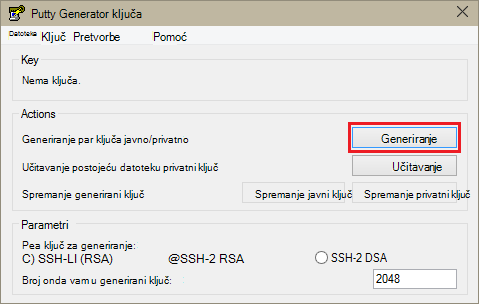
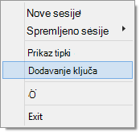

<properties
   pageTitle="Pomoću tipki SSH s Hadoop na klastere Linux operacijskim sustavom Windows | Microsoft Azure"
   description="Saznajte kako stvoriti i pomoću tipki SSH za provjeru autentičnosti utemeljenu na Linux HDInsight klastere. Povezati klastere klijenata utemeljen na sustavu Windows putem PuTTY SSH klijent."
   services="hdinsight"
   documentationCenter=""
   authors="Blackmist"
   manager="jhubbard"
   editor="cgronlun"
    tags="azure-portal"/>

<tags
   ms.service="hdinsight"
   ms.devlang="na"
   ms.topic="get-started-article"
   ms.tgt_pltfrm="na"
   ms.workload="big-data"
   ms.date="08/30/2016"
   ms.author="larryfr"/>

#Korištenje SSH sa sustavom Linux Hadoop na HDInsight iz sustava Windows

> [AZURE.SELECTOR]
- [Windows](hdinsight-hadoop-linux-use-ssh-windows.md)
- [Linux, Unix, OS X](hdinsight-hadoop-linux-use-ssh-unix.md)

[Sigurne ljuske (SSH)](https://en.wikipedia.org/wiki/Secure_Shell) omogućuje daljinski izvođenje operacije na vašem klastere sustavom Linux HDInsight pomoću sučelja naredbenog retka. Ovaj dokument sadrži podatke za povezivanje sa servisom HDInsight klijenata utemeljen na sustavu Windows pomoću PuTTY SSH klijent.

> [AZURE.NOTE] Koraci u ovom članku pretpostavlja da koristite klijent utemeljen na sustavu Windows. Ako koristite Linux, Unix ili OS X klijent, potražite u članku [Korištenje SSH s operacijskim sustavom Linux Hadoop na HDInsight Linux, Unix, ili OS X](hdinsight-hadoop-linux-use-ssh-unix.md).
>
> Ako imate Windows 10 i koristite [tulum na Ubuntu u sustavu Windows](https://msdn.microsoft.com/commandline/wsl/about), možete koristiti korake [Koristite SSH sa sustavom Linux Hadoop na HDInsight Linux, Unix, ili OS X](hdinsight-hadoop-linux-use-ssh-unix.md) dokumenta.

##Preduvjeti

* **PuTTY** i **PuTTYGen** za klijente utemeljen na sustavu Windows. U [http://www.chiark.greenend.org.uk/~sgtatham/putty/download.html](http://www.chiark.greenend.org.uk/~sgtatham/putty/download.html)dostupne su sljedeće uslužni programi.

* Moderna web-pregledniku koji podržava HTML5.

OR

* [Azure EŽA](../xplat-cli-install.md).

    [AZURE.INCLUDE [use-latest-version](../../includes/hdinsight-use-latest-cli.md)] 

##Što je SSH?

SSH je utility za prijave u i daljinsko izvršavanja naredbi na udaljeni poslužitelj. Sa sustavom Linux HDInsight SSH uspostavlja šifriranu vezu čvor glavni klaster i njihovi naredbenog retka koji koristite za unos teksta na naredbi. Naredbe pa se provode izravno na poslužitelju.

###SSH korisničko ime

Korisničko ime na SSH je ime koje koristite za provjeru autentičnosti klaster HDInsight. Kada se SSH korisničko ime koje ste naveli prilikom stvaranja klaster, taj korisnik stvara se na sve čvorove u klasteru. Nakon stvaranja klaster, poslužite se ovo korisničko ime za povezivanje s čvorove glavni HDInsight klaster. Iz čvorove glavni pa možete povezati s čvorove pojedinačne tempiranja.

###SSH lozinke ili javni ključ

Korisnik sustava SSH možete koristiti lozinku ili javni ključ za provjeru autentičnosti. Lozinka je samo niz teksta koji se sastoje, dok je javni ključ dio šifriranja ključa par generira za jedinstvenu identifikaciju.

Ključ je dodatno zaštititi od lozinkom, no bit će potrebno dodatne korake da biste generirali tipku i morate održavanje datoteka koja sadrži ključ na sigurnom mjestu. Ako svi poboljšava pristup datotekama ključa, oni dobiti pristup računu. Ili ako izgubite ključ datoteke neće moći Prijava na račun.

Ključni par sastoji se od javni ključ (koja se šalje na poslužitelj za HDInsight) i privatni ključ (koja se drži na klijentskom računalu.) Kada se povežete s poslužiteljem HDInsight pomoću SSH, klijent SSH će koristiti privatni ključ na vašem računalu za provjeru autentičnosti s poslužiteljem.

##Stvaranje ključa SSH

Ako planirate na pomoću tipke SSH svoj klaster, poslužite se sljedećim informacijama. Ako planirate korištenjem lozinke, možete preskočiti ovaj odjeljak.

1. Otvorite PuTTYGen.

2. Za **vrstu ključ za generiranje**, odaberite **RSA SSH 2**, a zatim **Generiraj**.

    

3. Kretanje miša u području ispod trake tijeku dok se ne ispunjava na traci. Pomicanje miša generira slučajni podataka koji se koriste za generiranje tipku.

    

    Kada je generiran ključ, prikazat će se javni ključ.

4. Radi dodatne sigurnosti možete unesite pristupni izraz u polju **ključ pristupni izraz** , a zatim unesite iste vrijednosti u polje **Potvrdi pristupni izraz** .

    

    > [AZURE.NOTE] Preporučujemo da koristite sigurne pristupni izraz za ključ. No ako zaboravite pristupni izraz, ne postoji način da je vratite.

5. Kliknite da biste spremili tipku **.ppk** datoteku **spremite privatni ključ** . Ovaj ključ će se koristiti za provjeru autentičnosti svoj klaster sustavom Linux HDInsight.

    > [AZURE.NOTE] Pohranite ovaj ključ na sigurnom mjestu, kao što je koristi za pristup svoj klaster sustavom Linux HDInsight.

6. Kliknite **Spremi javni ključ** da biste spremili tipku kao **.txt** datoteke. Omogućuje u budućnosti ponovno korištenje javni ključ prilikom stvaranja dodatne klastere sustavom Linux HDInsight.

    > [AZURE.NOTE] Javni ključ također se prikazuje pri vrhu PuTTYGen. Možete desnom tipkom miša kliknite polje, kopirajte vrijednost i zatim ga zalijepite u obrazac prilikom stvaranja klaster pomoću portala za Azure.

##Stvaranje sustavom Linux HDInsight klaster

Prilikom stvaranja sustavom Linux HDInsight klaster, morate navesti javni ključ stvoreno. Klijenata utemeljen na sustavu Windows, dva su načina za stvaranje sustavom Linux HDInsight klaster:

* **Portal za azure** - koristi portal utemeljen na webu za stvaranje klaster.

* **Azure EŽA za Mac i Linux Windows** – koristi naredbenog retka naredbe za stvaranje klaster.

Svaki od ovih metoda potrebno javni ključ. Potpune informacije o stvaranju sustavom Linux HDInsight klaster potražite u članku [klastere sustavom Linux dodjele resursa HDInsight](hdinsight-hadoop-provision-linux-clusters.md).

###Portal za Azure

Kada se koristi za [Portal za Azure] [ preview-portal] da biste stvorili sustavom Linux HDInsight klaster, morate unijeti **SSH korisničko ime**i odaberite da biste unijeli **lozinku** ili **SSH JAVNI KLJUČ**.

Ako ste odabrali **SSH JAVNI KLJUČ**, možete zalijepiti javni ključ (prikazan u na __javni ključ za lijepljenje u OpenSSH ovlašteni\_tipke datoteke__ u PuttyGen,) u polje __SSH PublicKey__ ili odaberite __Odaberite datoteku__ za pregled, a zatim odaberite datoteku koja sadrži javni ključ.

Prijava za navedeni korisnik stvara i omogućuje provjeru autentičnosti lozinke ili ključ za provjeru autentičnosti SSH.

###Azure sučelje naredbenog retka za Mac i Linux sustava Windows

[Azure EŽA za Mac i Linux Windows](../xplat-cli-install.md) možete koristiti da biste stvorili novi klaster pomoću na `azure hdinsight cluster create` naredbe.

Dodatne informacije o korištenju ove naredbe potražite u članku [Dodjeljivanje Hadoop Linux klastere u HDInsight pomoću prilagođene mogućnosti](hdinsight-hadoop-provision-linux-clusters.md).

##Povezivanje sa sustavom Linux HDInsight klaster

1. Otvorite PuTTY.

    

2. Ako ste unijeli ključa SSH stvaranja korisnički račun, morate izvršiti sljedeće korake da biste odabrali privatni ključ za provjeru autentičnosti skupine:

    U **kategoriji**, proširite **veza**, proširite **SSH**pa odaberite **provjere autentičnosti**. Na kraju, kliknite **Pregledaj** i odaberite .ppk datoteku koja sadrži privatni ključ.

    

3. U odjeljku **kategorije**odaberite **sesiju**. Na zaslonu **osnovnih mogućnosti za sesiju PuTTY** unesite adresu SSH poslužitelja HDInsight u polje **naziv glavnog računala (ili IP adresa)** . Postoje dva moguća SSH adrese mogu koristiti pri povezivanju s klaster:

    * __Lakši čvor adresa__: da biste povezali čvor glavni klaster, koristi vaš naziv klaster zatim **-ssh.azurehdinsight.net**. Na primjer, **mycluster ssh.azurehdinsight.net**.
    
    * __Adresa čvor rub__: Ako se povezujete s poslužiteljem R na HDInsight klaster, možete se povezati s čvor rub R poslužitelja adrese __RServer.CLUSTERNAME.ssh.azurehdinsight.net__, pri čemu je CLUSTERNAME svoj klaster. Na primjer, __RServer.mycluster.ssh.azurehdinsight.net__.

    

4. Da biste spremili podatke o vezi za buduću upotrebu, unesite naziv za ovu vezu u odjeljku **Spremiti sesije**, a zatim **Spremi**. Dodaje se veza na popis spremljenu sesije.

5. Kliknite **Otvori** da biste se povezali s klaster.

    > [AZURE.NOTE] Ako je ovo prvi put ste povezali s klaster, primit ćete sigurnosno upozorenje. To je normalno. Odaberite **da** u predmemoriju na poslužitelj RSA2 ključ da biste nastavili.

6. Kada se to od vas zatraži, unesite korisnika koje ste unijeli prilikom stvaranja klaster. Ako upišete lozinku za korisnika, zatražit će se da biste ga i unijeli.

> [AZURE.NOTE] Gore navedeni koraci pretpostavlja da koristite priključak 22, koji će se povezati s primarni headnode na klasteru HDInsight. Ako koristite priključak 23, će se povezati sekundarnom. Dodatne informacije o glavni čvorove potražite u članku [dostupnosti i pouzdanost klastere Hadoop u HDInsight](hdinsight-high-availability-linux.md).

###Povezivanje s čvorove tempiranja

Čvorovi tempiranja nisu izravno pristupiti iz izvan Azure podatkovnog centra, ali se može pristupiti iz čvor klaster glavni putem SSH.

Ako ste unijeli ključa SSH stvaranja korisnički račun, morate poduzeti sljedeće korake da biste koristili privatni ključ prilikom provjere autentičnosti klaster ako se želite povezati čvorove radnih.

1. Instalirajte Pageant iz [http://www.chiark.greenend.org.uk/~sgtatham/putty/download.html](http://www.chiark.greenend.org.uk/~sgtatham/putty/download.html). Uslužni koristi se za predmemoriranje SSH tipke za PuTTY.

2. Pokrenite Pageant. Minimiziranje će na veličinu ikone u paleti status. Desnom tipkom miša kliknite ikonu, a zatim odaberite **Dodaj ključ**.

    

3. Kada se pojavi dijaloški okvir Pregledaj, odaberite .ppk datoteku koja sadrži tipku, a zatim kliknite **Otvori**. To dodaje tipku Pageant koja je da biste PuTTY prilikom povezivanja s klaster.

    > [AZURE.IMPORTANT] Ako ste koristili ključa SSH za osiguranje računa, morate dovršiti prethodne korake prije nego što se može povezati čvorove tempiranja.

4. Otvorite PuTTY.

5. Ako koristite ključa SSH za provjeru autentičnosti, u odjeljku **kategorije** proširite **vezu**, proširite **SSH**, a zatim odaberite **provjere autentičnosti**.

    U odjeljku **Provjera autentičnosti parametara** omogućiti **Dopusti agent prosljeđivanje**. Time se omogućuje PuTTY za automatsko prosljeđivanje potvrda autentičnosti putem veze čvor glavni klaster prilikom povezivanja s čvorove radnih.

    

6. Povežite se s klaster kao što je prethodno navedenih. Ako koristite ključa SSH za provjeru autentičnosti, morate odabrati ključ – SSH ključ dodaje Pageant će se koristiti za provjeru autentičnosti klaster.

7. Kada je uspostavljena veza, koristite sljedeće da biste dohvatili popis čvorove u svoj klaster. Zamijenite *ADMINPASSWORD* lozinka za račun administrator klaster. Zamijenite *CLUSTERNAME* naziv svoj klaster.

        curl --user admin:ADMINPASSWORD https://CLUSTERNAME.azurehdinsight.net/api/v1/hosts

    To će vratiti podatke u obliku JSON za čvorove u skupini, uključujući `host_name`, koja sadrži na potpuno kvalificirani naziv domene (FQDN) za svaki čvor. Slijedi primjer na `host_name` stavka vraćene naredbom **curl** :

        "host_name" : "workernode0.workernode-0-e2f35e63355b4f15a31c460b6d4e1230.j1.internal.cloudapp.net"

8. Nakon što dodate popis čvorove tempiranja koji se želite povezati, koristite sljedeću naredbu iz PuTTY sesije da biste otvorili veza radnih čvor:

        ssh USERNAME@FQDN

    *Korisničko ime* zamijenite SSH korisničko ime i *FQDN* s FQDN za čvor tempiranja. Na primjer, `workernode0.workernode-0-e2f35e63355b4f15a31c460b6d4e1230.j1.internal.cloudapp.net`.

    > [AZURE.NOTE] Ako koristite lozinke za provjeru autentičnosti sesiju SSH, zatražit će se da biste ponovno unesite lozinku. Ako koristite ključa SSH vezu treba završiti bez upita.

9. Kada je uspostavljena sesiju, Zatraži PuTTY sesiju promijenit će se iz `username@hn#-clustername` da biste `username@wn#-clustername` da biste naznačili da ste povezani s čvor tempiranja. Naredbe pokrenete sada će se izvoditi na čvor tempiranja.

10. Kada završite s izvođenje akcija na čvor tempiranja, koristite na `exit` naredbu da biste zatvorili sesiju čvor tempiranja. To će se želite vratiti na `username@hn#-clustername` upit.

##Dodavanje dodatnih računa

Ako je potrebno dodati dodatne račune za svoj klaster, učinite sljedeće:

1. Stvaranje nove javnim ključem i privatni ključ za novog korisničkog računa kao što je prethodno opisano.

2. Iz SSH sesije u klaster, dodavanje novog korisnika s sljedeću naredbu:

        sudo adduser --disabled-password <username>

    To će stvaranje novog korisničkog računa, ali će onemogućiti provjeru autentičnosti lozinke.

3. Stvaranje direktorija i datoteka na držite tipku pomoću sljedeće naredbe:

        sudo mkdir -p /home/<username>/.ssh
        sudo touch /home/<username>/.ssh/authorized_keys
        sudo nano /home/<username>/.ssh/authorized_keys

4. Kad se Otvori uređivač nano, kopirajte i zalijepite u sadržaju javni ključ za novi korisnički račun. Naposljetku, koristiti **CTRL + X** da biste spremili datoteku, a zatim izađite iz uređivaču.

    

5. Da biste promijenili vlasništvo nad .ssh mapu i sadržaj u novog korisničkog računa, koristite sljedeću naredbu:

        sudo chown -hR <username>:<username> /home/<username>/.ssh

6. Sada mora biti moguće provjeriti autentičnost poslužitelj s novog korisničkog računa i privatni ključ.

##SSH tuneliranja

SSH može se koristiti za Tunel lokalne zahtjeve, kao što je web-zahtjeva klaster HDInsight. Traženom resursu zatim usmjerena zahtjev kao da je prodao potječe na glavni čvor klaster HDInsight.

> [AZURE.IMPORTANT] U tunelom SSH je zahtjeva za pristup webu korisničkog Sučelja za neke Hadoop usluge. Na primjer, korisničkog Sučelja povijest posao ili Voditelj resursa korisničkog Sučelja može pristupiti samo pomoću programa tunelom SSH.

Dodatne informacije o stvaranju i korištenju programa tunelom SSH potražite u članku [Korištenje SSH tuneliranje da biste pristupili web Ambari korisničkog Sučelja, ResourceManager, JobHistory, NameNode, Oozie, i druge web-mjesta korisničkog Sučelja](hdinsight-linux-ambari-ssh-tunnel.md).

##Daljnji koraci

Sada kada razumijete upute za provjeru autentičnosti pomoću ključa za SSH, Saznajte kako koristiti MapReduce s Hadoop na HDInsight.

* [Korištenje grozd s HDInsight](hdinsight-use-hive.md)

* [Korištenje Svinja s HDInsight](hdinsight-use-pig.md)

* [Korištenje MapReduce poslove s HDInsight](hdinsight-use-mapreduce.md)

[preview-portal]: https://portal.azure.com/
