<properties
   pageTitle="Nadzor i upravljanje klastere HDInsight pomoću korisničkog Sučelja Web Ambari Apache | Microsoft Azure"
   description="Saznajte kako koristiti Ambari za nadzor i upravljanje sustavom Linux HDInsight klastere. U ovom dokumentu će Saznajte kako koristiti korisničko Sučelje Web Ambari uključene klastere HDInsight."
   services="hdinsight"
   documentationCenter=""
   authors="Blackmist"
   manager="jhubbard"
   editor="cgronlun"
    tags="azure-portal"/>

<tags
   ms.service="hdinsight"
   ms.devlang="na"
   ms.topic="article"
   ms.tgt_pltfrm="na"
   ms.workload="big-data"
   ms.date="09/27/2016"
   ms.author="larryfr"/>

#Upravljanje klastere HDInsight pomoću korisničkog Sučelja Web Ambari

[AZURE.INCLUDE [ambari-selector](../../includes/hdinsight-ambari-selector.md)]

Apache Ambari pojednostavnjuje upravljanje i nadzor klastere Hadoop unosom lako da biste koristili web korisničkog Sučelja i REST API-JA. Ambari nalazi se na klastere sustavom Linux HDInsight i služi za praćenje klaster i unijeli promjene konfiguracije.

U ovom dokumentu će Saznajte kako pomoću korisničkog Sučelja Web Ambari pomoću programa klaster HDInsight.

##Što je Ambari?

<a href="http://ambari.apache.org" target="_blank">Apache Ambari</a> zahvaljujući Hadoop upravljanja jednostavniji omogućuje jednostavno se koristi web korisničkog Sučelja koje je moguće koristiti za dodjelu resursa, upravljanje i praćenje klastere Hadoop. Razvojni inženjeri možete integrirati te mogućnosti u svojim aplikacijama pomoću <a href="https://github.com/apache/ambari/blob/trunk/ambari-server/docs/api/v1/index.md" target="_blank">Ambari REST API -ji</a>.

Korisničko Sučelje Web Ambari navedeni su po zadanom sa sustavom Linux HDInsight klastere. 

##Povezivanje

Korisničko Sučelje Web Ambari dostupna je na svoj klaster HDInsight pri HTTPS://CLUSTERNAME.azurehdidnsight.net, pri čemu je __CLUSTERNAME__ svoj klaster. 

> [AZURE.IMPORTANT] Povezivanje s Ambari na HDInsight zahtijeva HTTPS. Morate autentičnost i da biste Ambari koristi naziv računa za administratore (zadano je __administrator__) i lozinku koje ste naveli prilikom stvaranja klaster.

##SSH proxy

> [AZURE.NOTE] Dok Ambari za svoj Klaster se može pristupiti izravno putem Interneta, neke veze iz Ambari korisničko Sučelje Web (primjerice JobTracker,) ne prikazuje na Internetu. Tako će primiti pogreške "poslužitelj nije pronađen" prilikom pokušaja pristup tim značajkama, osim ako ne koristite Secure ljuske (SSH) tunelom da biste promet web proxy čvor glavni klaster.

Informacije o stvaranju programa tunelom SSH da biste radili s Ambari potražite u članku [Korištenje SSH tuneliranje da biste pristupili web Ambari korisničkog Sučelja, ResourceManager, JobHistory, NameNode, Oozie, i druge web-mjesta korisničkog Sučelja](hdinsight-linux-ambari-ssh-tunnel.md).

##Ambari Web korisničkog Sučelja

Prilikom povezivanja s korisničko Sučelje Web Ambari, zatražit će se za provjeru autentičnosti na stranicu. Korištenje klaster administrator korisnika (zadano administrator) i lozinke koje ste koristili prilikom stvaranja klaster.

Prilikom otvaranja stranice, obratite pažnju na traci pri vrhu. Sadrži sljedeće informacije i kontrole:

* **Logotip Ambari** - otvorit će se na nadzornoj ploči koji se može koristiti za praćenje klaster.

* **Klaster naziv # ops** - prikazuje se broj svakodnevnog Ambari. Odabir klaster ime ili **# ops** prikazat će se popis operacija pozadine.

* **upozorenja #** - ključnih upozorenja za klaster ako postoje. To odaberete prikazat će se popis upozorenja.

* **Nadzorna ploča** - prikazuje na nadzornoj ploči.

* **Usluge** – podaci i konfiguracija postavki za servise u klasteru.

* **Glavno računalo** - informacije i konfiguracija postavki za čvorove u klasteru.

* **Upozorenja** - zapisnik informacija, upozorenja i ključnih upozorenja.

* **Administrator** - softver stogu/servise koji su instalirani na klaster, podatke o računu usluge i sigurnost Kerberos.

* **Gumb za administratore** – upravljanje Ambari, korisničkih postavki i odjavite.

##Nadzor

###Upozorenja

Ambari nudi brojne upozorenja koji će imati jedan od sljedećih kao status:

* **ok**

* **Upozorenje**

* **OD KLJUČNE VAŽNOSTI**

* **NEPOZNATO**

Upozorenja koji nije **u redu** uzrokovat će stavku **# upozorenja** pri vrhu stranice da biste prikazali broj upozorenja. Odaberite tu stavku prikazat će se upozorenja i njihovo stanje.

Upozorenja su organizirane u nekoliko zadane grupe koje je moguće je prikazati na stranici **upozorenja** .

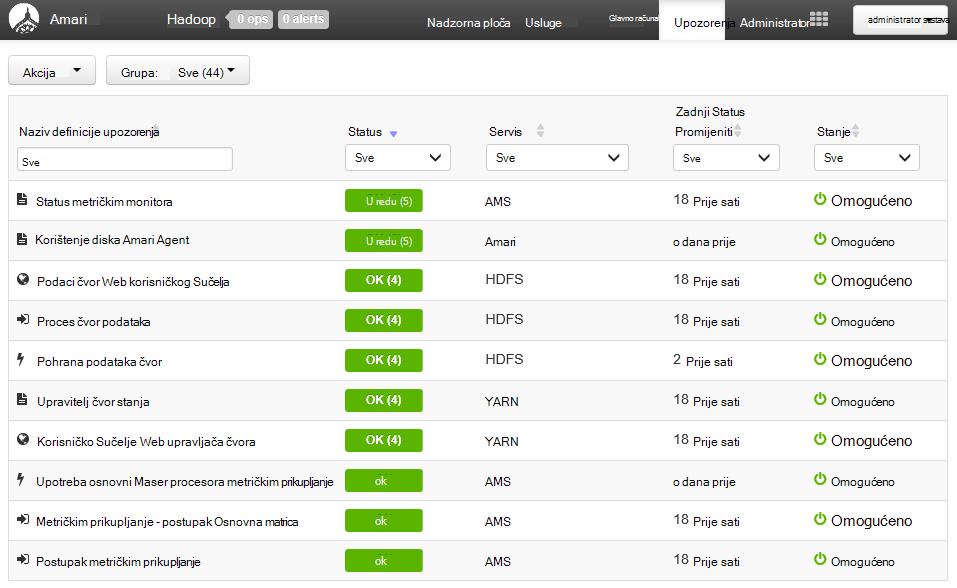

Grupe možete upravljati tako da pomoću izbornika **Akcije** , a zatim odaberete **Upravljanje grupama za upozorenja**. Time da biste izmijenili postojeće grupe ili stvoriti nove grupe.

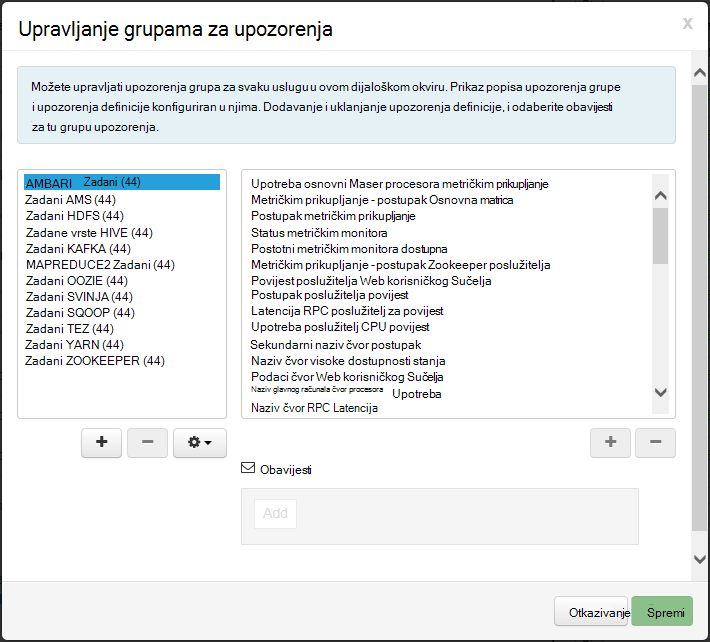

Upozorenja možete stvoriti i na izborniku **Akcije** . Omogućuje stvaranje okidača koji slanje obavijesti putem **e-pošte** ili **SNMP** kada se dogodi kombinacije određene upozorenje/težinu. Ako, na primjer, možete poslati upozorenja kada bilo koji od upozorenja u grupi **YARN zadani** je postavljeno na **od ključne važnosti**.

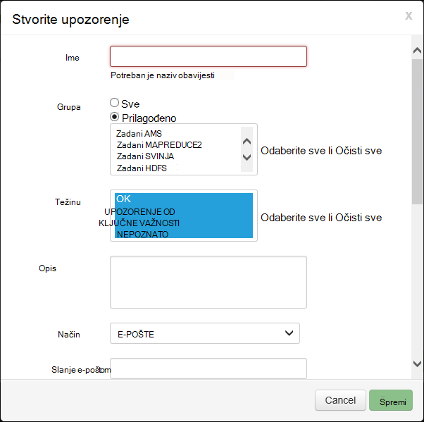

###Klaster

Kartica **metriku** nadzorne ploče sadrži niz miniaplikacije koje olakšavaju praćenje stanja svoj klaster na prvi pogled. Nekoliko miniaplikacije, kao što su **Procesora**navedite dodatne podatke kada je kliknete.

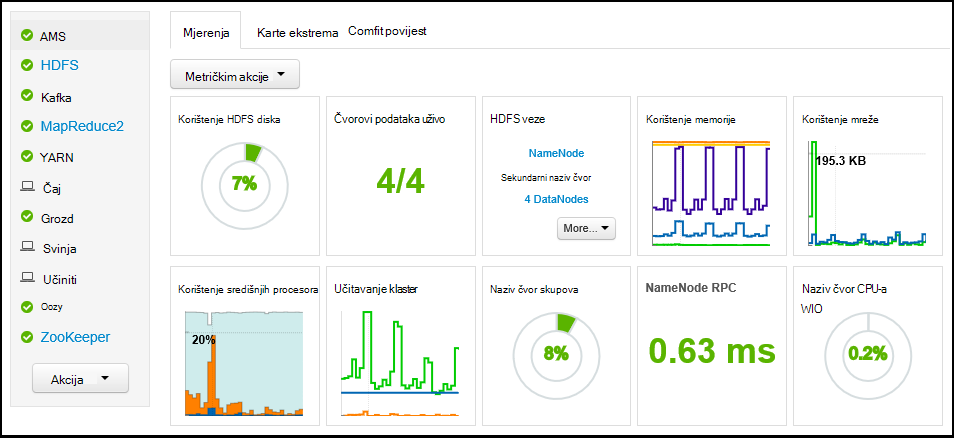

Na kartici **Heatmaps** prikazuje metriku kao boja heatmaps, prijelaz s zeleno na crvene boje.

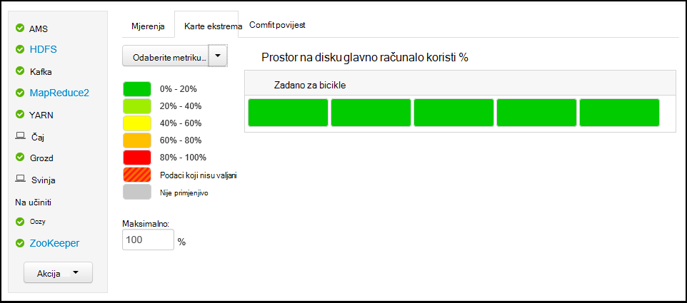

Detaljnije informacije o čvorove unutar klaster odaberite **domaćini**, a zatim čvor određene koja vas zanima.

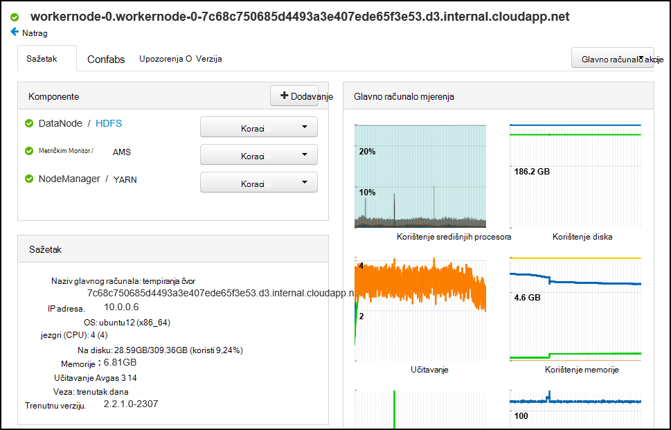

###Usluge

Bočna traka sustava **usluge** na nadzornoj ploči omogućuje brzi uvid u status servise klaster. Različite ikone koriste se za označavanje stanja i akcije koje treba poduzeti, kao što su žuta koš za smeće simbol ako usluge mora biti brisanja.

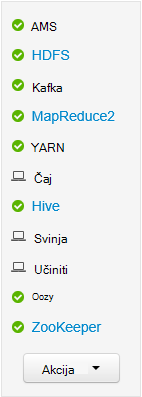

Odabir servisa će prikazati detaljnije informacije na servis.

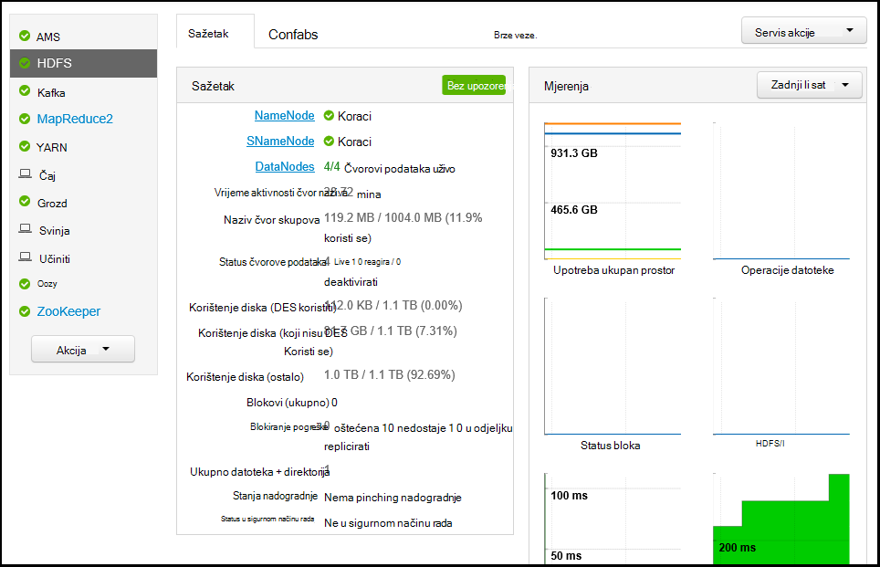

####Brze veze

Neki servisi prikazati vezu **Brze veze** pri vrhu stranice. To se može koristiti za pristup web specifične za servis UIs, kao što su:

* **Dosadašnje iskustvo** - MapReduce dosadašnje iskustvo.

* **Voditelj resursa** – YARN ResourceManager UI.

* **NameNode** - Hadoop Distributed NameNode korisničkog Sučelja za datoteke sustava (HDFS).

* **Oozie Web UI** - Oozie korisničkog Sučelja.

Odaberite neki od ovih veza će se otvoriti na novoj kartici u pregledniku koji će se prikazivati odabrane stranice.

> [AZURE.NOTE] Odabirom veze **Brze veze** za bilo koji servis rezultirat će o pogrešci "poslužitelj nije pronađen" osim ako ne koristite Secure Sockets Layer (SSL) tunelom da biste promet web proxy klaster. To je jer web-aplikacije služi za prikaz ove informacije ne pojavljuje se na Internetu.
>
> Informacije o korištenju programa SSL tunelom s HDInsight potražite u članku [Korištenje SSH tuneliranje da biste pristupili web Ambari korisničkog Sučelja, ResourceManager, JobHistory, NameNode, Oozie, i druge web-mjesta korisničkog Sučelja](hdinsight-linux-ambari-ssh-tunnel.md)

##Upravljanje

###Ambari korisnike, grupe i dozvole

Upravljanje korisnicima, grupe i dozvolama ne treba koristiti s klastere HDInsight.

###Glavno računalo

Stranica za **domaćini** sadrži popis svih domaćini u klasteru. Da biste upravljali domaćini, slijedite ove korake.

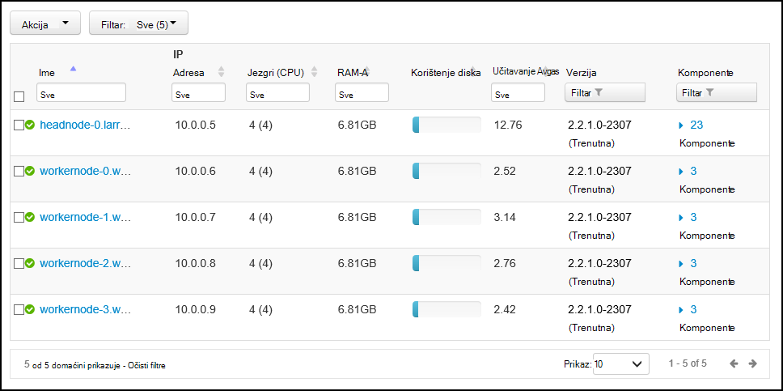

> [AZURE.NOTE] Dodavanje, deaktivirati ili recommissioning glavno računalo ne treba koristiti s klastere HDInsight.

1. Odaberite host(s) koju želite upravljati.

2. Pomoću izbornika **Akcije** odaberite akciju koju želite izvesti:

    * **Pokretanje svih komponenti** – pokretanje svih komponenti na glavnom računalu.

    * **Zaustavljanje svih komponenti** – Prekini sve komponente na glavnom računalu.

    * **Ponovno pokrenite sve komponente** - tabulatora i počnite sve komponente na glavnom računalu.

    * **Uključivanje načina održavanja** - ukida upozorenja za glavno računalo. To želite omogućiti ako izvodite akcije koje će generirati upozorenja, kao što je ponovno pokrenuti servis koji se oslanjate pokrenuti servisi.

    * **Isključivanje načina održavanja** - vraća normalni upozorenjem glavno računalo.

    * **Zaustavljanje** - DataNode tabulatora ili NodeManagers na glavnom računalu.

    * **Pokretanje** - pokreće DataNode ili NodeManagers na glavnom računalu.

    * **Ponovno pokrenite** - tabulatora i pokreće DataNode ili NodeManagers na glavnom računalu.

    * **Decommission** - uklanja glavno računalo iz skupine.

        > [AZURE.NOTE] Pomoću ove akcije na klastere HDInsight.

    * **Recommission** - dodaje prethodno decommissioned glavno računalo za klaster.

        > [AZURE.NOTE] Pomoću ove akcije na klastere HDInsight.

###Usluge

Sa stranice **nadzorne ploče** ili **usluge** pomoću **Akcije** gumba pri dnu popisa servisi zaustaviti i pokrenuti sve servise.

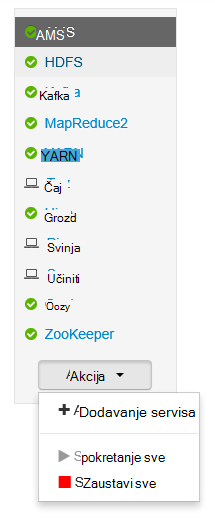

> [AZURE.WARNING] Dok __Dodavanje servisa__ nalazi se u izborniku, ona se ne smiju koristiti za dodavanje servisa HDInsight klaster. Nove servise koje treba dodati akcija skripte tijekom dodjeljivanja klaster. Dodatne informacije o korištenju akcije skripte potražite u članku [Prilagodba HDInsight klastere pomoću skripte akcije](hdinsight-hadoop-customize-cluster-linux.md).

Dok je gumb **Akcije** možete ponovno pokrenite sve servise, često želite započeti, prekinuti ili ponovno pokrenite servis za određene. Za izvođenje akcija na pojedinačne servisa, poduzmite sljedeće korake:

1. Sa stranice **nadzorne ploče** ili **usluge** odaberite uslugu.

2. Od vrha kartica **Sažetak** , poslužite se gumbom **Servisa akcije** , a zatim odaberite akcija koja se izvodi. To će se pokrenuti servis sve čvorove.

    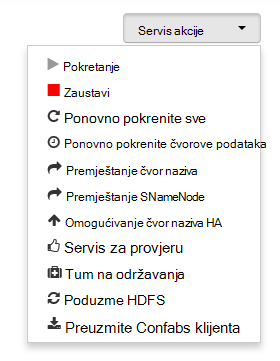

    > [AZURE.NOTE] Ponovno pokretanje neke usluge dok se izvodi klaster može generirati upozorenja. Da biste izbjegli ovo, možete koristiti gumb **Akcije servisa** da biste omogućili **održavanja** servisa prije izvođenja ponovno pokretanje.

3. Kada je odabrana akcija, stavka **# op** pri vrhu stranice će povećali da bi se prikazala se pojavljuje pozadinska operacija. Ako je konfiguriran za prikaz, prikazat će se popis operacije pozadine.

    > [AZURE.NOTE] Ako ste omogućili **održavanja** servisa, imajte na umu da biste onemogućili pomoću gumba **Akcije servisa** nakon dovršetka postupka.

Da biste konfigurirali servisa, slijedite ove korake:

1. Sa stranice **nadzorne ploče** ili **usluge** odaberite uslugu.

2. Odaberite karticu **Configs** . Prikazat će se trenutna konfiguracija. Također prikazuje se popis prethodne konfiguracije.

    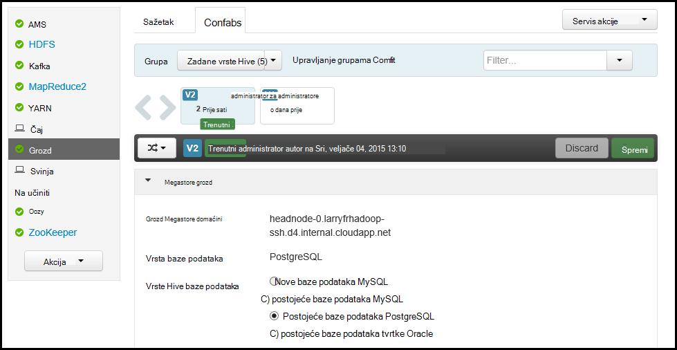

3. Pomoću polja prikazuje da biste izmijenili konfiguraciju, a zatim odaberite **Spremi**. Ili odaberite prethodne konfiguracije, a zatim odaberite **aktivirati** vratiti na prethodne postavke.

##Prikazi Ambari

Prikazi Ambari razvojnim inženjerima priključiti elemente korisničkog Sučelja u korisničko Sučelje Web Ambari pomoću [Framework Ambari prikaza](https://cwiki.apache.org/confluence/display/AMBARI/Views). HDInsight omogućuje sljedeće prikaza s vrstama klaster Hadoop:

* Yarn Upravitelj reda čekanja: Upravitelj reda čekanja omogućuje jednostavno korisničkog Sučelja za prikaz i izmjenu YARN redova.
* Prikaz grozd: Prikaz vrste Hive omogućuje pokretanje upita grozd izravno iz web-preglednika. Možete spremiti upita, prikaz rezultata, spremiti rezultate klaster za pohranu ili preuzmite rezultata na lokalnom sustavu. Dodatne informacije o korištenju vrste Hive prikaza potražite u članku [Korištenje vrste Hive prikaze s HDInsight](hdinsight-hadoop-use-hive-ambari-view.md).
* Prikaz Tez: U prikazu Tez omogućuje bolje razumijevanje i prikaz informacija na kako se izvode Tez zadataka i resursima koriste posao optimizira zadatke.
