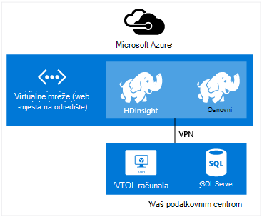

<properties
    pageTitle="Stvaranje Hadoop, HBase, oluja ili Spark klastere na Linux u HDInsight | Microsoft Azure"
    description="Saznajte kako stvoriti Hadoop, HBase, oluja ili povećati klastere na Linux za HDInsight pomoću preglednika, EŽA Azure, Azure PowerShell, OSTALE, ili putem programa SDK."
    services="hdinsight"
    documentationCenter=""
    authors="mumian"
    manager="jhubbard"
    editor="cgronlun"
    tags="azure-portal"/>

<tags
    ms.service="hdinsight"
    ms.devlang="na"
    ms.topic="article"
    ms.tgt_pltfrm="na"
    ms.workload="big-data"
    ms.date="10/18/2016"
    ms.author="jgao"/>

# Stvaranje klastere sustavom Linux Hadoop u HDInsight

[AZURE.INCLUDE [selector](../../includes/hdinsight-selector-create-clusters.md)]

Hadoop klaster sastoji se od nekoliko virtualnim strojevima (čvorove) koji se koriste za raspodijeljeno obrada zadataka na klaster. Azure sažecima Detalji o implementaciji instalacije i konfiguracije pojedinačne čvorove pa samo morate unijeti informacije o konfiguraciji Općenito. U ovom se članku informacije o tim postavkama konfiguracije.

## Preduvjeti za kontrolu pristupa

[AZURE.INCLUDE [access-control](../../includes/hdinsight-access-control-requirements.md)]

## Vrste klaster

Trenutno Azure HDInsight sadrži pet različitih vrsta klastere, svaka s skup komponente da biste dobili određene radovi.

| Vrsta klaster | Funkcija |
| ------------ | ----------------------------- |
| Hadoop       | Upit i analize (obrada)     |
| HBase        | Pohrana podataka NoSQL            |
| Oluja        | Obrada događaja u stvarnom vremenu |
| Spark        | Obrada u memoriji, interaktivne upite grupe za micro strujanje obrada |
| [Interaktivni grozd (pretpregled)](hdinsight-hadoop-use-interactive-hive.md) | Predmemoriranje u memoriji za interaktivni i brže grozd upita|
| R Normalni prikaz na Spark (pretpregled) | Raznih Statistika velikih skupova podataka, predvidljivu Modeliranje i strojnog učenja mogućnosti |

Svaka vrsta klaster ima vlastitu broj čvorove unutar klaster, terminologija upravljanja čvorove unutar klaster, a zadana veličina VM za svaku vrstu čvor. U sljedećoj tablici je broj čvorove za svaku vrstu čvor u zagradama.

| Vrsta| Čvorovi | Dijagram|
|-----|------|--------|
|Hadoop| Lakši čvor (2), čvor podataka (1 +)||
|HBase|Lakši server (2), regija poslužitelj (1 +), Matrica/Zookeeper čvor (3)||
|Oluja|Nimbus čvor (2), nadzornik server (1 +), Zookeeper čvor (3)||
|Spark|Lakši čvor (2), čvor tempiranja (1 +), Zookeeper čvor (3) (besplatno za veličina A1 Zookeepers VM)||

U sljedećoj su tablici navedene zadane veličine VM za HDInsight:

- Sve regije osim Brazil Južnu i Zapadnu Japan:

  	|Vrsta klaster                     | Hadoop               | HBase                | Oluja                | Spark                                                                 | R poslužitelja |
  	|---------------------------------|----------------------|----------------------|----------------------|-----------------------------------------------------------------------|-----------------------------------------------------------------------|
  	|Lakši – Zadana veličina VM           | D3 v2                | D3 v2                | A3                   | D12 v2                                                                | D12 v2                                                                |
  	|Lakši – preporučuje VM veličine      | D3 v2, D4 v2, a zatim D12 v2 | D3 v2, D4 v2, a zatim D12 v2 | A3, A4, A5           | D12 v2, D13 v2, a zatim D14 v2                                                | D12 v2, D13 v2, a zatim D14 v2                                                |
  	|Tempiranja – Zadana veličina VM         | D3 v2                | D3 v2                | D3 v2                | Windows: D12 v2; Linux: V2 D4                                         | Windows: D12 v2; Linux: V2 D4                                         |
  	|Tempiranja – preporučuje VM veličine    | D3 v2, D4 v2, a zatim D12 v2 | D3 v2, D4 v2, a zatim D12 v2 | D3 v2, D4 v2, a zatim D12 v2 | Windows: D12 v2, D13 v2, D14 v2; Linux: D4 v2, D12 v2, D13 v2, D14 v2 | Windows: D12 v2, D13 v2, D14 v2; Linux: D4 v2, D12 v2, D13 v2, D14 v2 |
  	|Zookeeper – Zadana veličina VM      |                      | A3                   | A2                   |                                                                       |
  	|Zookeeper – preporučuje VM veličine |                      | A3, A4, A5           | A2, A3, A4           |                                                                       |
  	|Ruba - Zadana veličina VM           |                      |                      |                      |                                                                       | Windows: D12 v2; Linux: V2 D4                                         |
  	|Rub - preporučeno veličina VM       |                      |                      |                      |                                                                       | Windows: D12 v2, D13 v2, D14 v2; Linux: D4 v2, D12 v2, D13 v2, D14 v2 |

- Brazil Južna i Japan Zapad samo (bez v2 veličine ovdje):

  	|Vrsta klaster                     | Hadoop      | HBase       | Oluja      | Spark                                          |R poslužitelja|
  	|---------------------------------|-------------|-------------|------------|------------------------------------------------|--------|
  	|Lakši – Zadana veličina VM           | D3          | D3          | A3         | D12                                            | D12|
  	|Lakši – preporučuje VM veličine      | D3, D4, D12 | D3, D4, D12 | A3, A4, A5 | D12, D13, D14                                  | D12, D13, D14|
  	|Tempiranja – Zadana veličina VM         | D3          | D3          | D3         | Windows: D12; Linux: D4                        | Windows: D12; Linux: D4|
  	|Tempiranja – preporučuje VM veličine    | D3, D4, D12 | D3, D4, D12 | D3, D4, D12| Windows: D14 D12, D13, Linux: D4, D12, D13, D14| Windows: D14 D12, D13, Linux: D4, D12, D13, D14|
  	|Zookeeper – Zadana veličina VM      |             | A2          | A2         |                                                | |
  	|Zookeeper – preporučuje VM veličine |             | A2, A3, A4  | A2, A3, A4 |                                                | |
  	|Ruba – Zadana veličina VM          |             |             |            |                                                | Windows: D12; Linux: D4 |
  	|Rub – preporučuje VM veličine      |             |             |            |                                                | Windows: D14 D12, D13, Linux: D4, D12, D13, D14 |

Imajte na umu da glave zove *Nimbus* za vrstu klaster oluja. Tempiranja poznato je kao *područja* za vrstu klaster HBase i kao *nadzornik* za vrstu klaster oluja.

> [AZURE.IMPORTANT] Ako planirate na imate više od 32 čvorove tempiranja, pri klaster stvaranja ili tako da skaliranje skupine nakon stvaranja, morate odabrati glavni čvor veličina s najmanje 8 jezgri i 14 GB RAM-a.

Možete dodati druge komponente, kao što su nijanse ili R ove osnovne vrste pomoću [Skripte akcije](#customize-clusters-using-script-action).

> [AZURE.IMPORTANT] HDInsight klastere Dođite na razne vrste koji odgovara radno opterećenje ni tehnologija koja klaster postavljen je za. Ne postoji podržani način da biste stvorili klaster koji kombinira više vrsta, kao što su oluja i HBase na jedan klaster. 

Ako rješenje zahtijeva tehnologije koje se šire preko više vrsta HDInsight klaster, trebali biste stvarate Azure virtualne mreže te vrste potrebnih klaster unutar virtualne mreže. Time se omogućuje skupina i implementirati na njima možete izravno komunicirati s međusobno povezani s kodom.

Dodatne informacije o korištenju Azure virtualne mreže s HDInsight potražite u članku [Proširivanje servisa HDInsight s Azure virtualne mreže](hdinsight-extend-hadoop-virtual-network.md).

Primjer korištenja dvije vrste klaster unutar Azure virtualne mreže, potražite u članku [Analiza podataka senzor s oluja i HBase](hdinsight-storm-sensor-data-analysis.md).

## Razine klaster

Azure HDInsight nudi ponude oblaka velikih skupova podataka u dvije kategorije: standardno i [Premium](hdinsight-component-versioning.md#hdinsight-standard-and-hdinsight-premium). HDInsight Premium uključuje R i druge dodatne komponente. HDInsight Premium podržana je samo na HDInsight verziju 3.4.

U sljedećoj su tablici navedeni HDInsight klaster vrsta i HDInsight Premium podršku matrice.

| Vrsta klaster | Standardna | Premium  |
|--------------|---------------|--------------|
| Hadoop       | Da           | Da          |
| Spark        | Da           | Da          |
| HBase        | Da           | ne           |
| Oluja        | Da           | ne           |
| R Normalni prikaz na Spark | ne | Da |

U ovoj su tablici ažurirat će se kao što je više vrsta klaster obuhvaćeni HDInsight Premium. Sljedeće snimka zaslona prikazuje Azure portala informacije za odabir vrste klaster.

## Osnovne mogućnosti konfiguracije

Slijedi popis mogućnosti osnovni konfiguracije koji se koriste za stvaranje programa klaster HDInsight.

### Naziv klaster ###

Naziv klaster koristi se za identificiranje klaster. Klaster naziv mora biti globalno jedinstven i moraju biti imenovanja smjernice za sljedeće:

- Polje mora biti niz koji sadrži između 3 i 63 znakova.
- Polje može sadržavati samo slova, brojeve i spojnice.

### Vrsta klaster###

U odjeljku [vrste klaster](#cluster-types) i [klaster razine](#cluster-tiers).

### Operacijski sustav ###

HDInsight klastere možete stvoriti na jedan od sljedeća dva operacijskih sustava:

- HDInsight na Linux.  HDInsight pruža mogućnost konfiguriranja Linux klastere na Azure. Konfiguriranje Linux klaster ako ste upoznati s Linux ili Unix, migriranja iz postojećeg sustavom Linux Hadoop rješenja ili želite jednostavna Integracija s Hadoop zajednici komponente za Linux. Dodatne informacije potražite u članku [Početak rada s Hadoop na Linux u HDInsight](hdinsight-hadoop-linux-tutorial-get-started.md).
- HDInsight u sustavu Windows (Windows Server 2012 R2 podatkovnog centra).

### HDInsight verzija###

Koristi se za određivanje verzije HDInsight koja su potrebna za ovaj klaster. Dodatne informacije potražite u članku [Hadoop klaster verzije i komponente HDInsight](https://go.microsoft.com/fwLink/?LinkID=320896&clcid=0x409).

### Naziv pretplate###

Svaki HDInsight klaster je uz jedan Azure pretplate.

### Naziv grupe resursa ###

[Voditelj resursa Azure](../azure-resource-manager/resource-group-overview.md) olakšava rad s resursima u aplikaciji grupe se nazivaju i grupu resursa Azure. Možete implementirati, ažuriranje, praćenje i izbrisati sve resurse za aplikaciju u jednoj usklađenih operaciji.

### Vjerodajnice###

Pomoću klastere HDInsight možete konfigurirati dva korisničke račune tijekom stvaranja klaster:

- HTTP korisnika. Zadano korisničko ime je *administrator* pomoću osnovnih konfiguracije portala za Azure. Ponekad se zove "Skupine korisnika".
- Korisnik SSH (Linux klastere). Koristi se za povezivanje s klaster pomoću SSH. Možete stvoriti dodatne SSH korisničke račune nakon stvaranja skupine prema uputama u [Koristi SSH sa sustavom Linux Hadoop na HDInsight Linux, Unix, ili OS X](hdinsight-hadoop-linux-use-ssh-unix.md) ili [Korištenje SSH sa sustavom Linux Hadoop na HDInsight iz sustava Windows](hdinsight-hadoop-linux-use-ssh-unix.md).

    >[AZURE.NOTE] Za klastere utemeljen na sustavu Windows, možete stvoriti korisnik sustava RDP povezati klaster pomoću RDP.

### Izvor podataka###

Izvornu datoteku sustava Hadoop distributed (HDFS) na klaster koristi mnogo lokalni disk. HDInsight koristi spremište blobova platforme Azure za pohranu podataka. Azure blobova je rješenje robusne, općenite namjene prostora za pohranu koji se jednostavno integrira s HDInsight. Putem sučelja HDFS, potpunog skupa komponente HDInsight možete raditi izravno na strukturirane i nestrukturirane podatke u spremište blobova platforme. Spremanje podataka u spremište blobova platforme vam omogućuje sigurno brisanje klastere HDInsight koji se koriste za izračunavanje ne izgubite podatke o korisniku.

Vrijeme konfiguraciju, morate navesti račun za Azure prostora za pohranu i programa spremnik spremište blobova platforme Azure na račun za Azure prostora za pohranu. Neke procesa stvaranja potreban je račun za Azure prostor za pohranu i spremnik spremište blobova platforme će biti stvoren prije toga. Spremnik spremišta blobova platforme koristi kao zadano mjesto za pohranu klaster. Po želji možete navesti dodatne Azure prostora za pohranu račune (povezane spremište) koji će biti dostupni su klaster. Klaster možete pristupiti i sve Blob potpisu konfiguriranih s puno javno pristup za čitanje ili javno pristup za čitanje za samo blob-ova.  Dodatne informacije potražite u članku [Upravljanje pristupom resursa za pohranu Azure](../storage/storage-manage-access-to-resources.md).

>[AZURE.NOTE] Spremnik za spremište blobova platforme nudi grupiranja skupa blob polja kao što je prikazano na sljedećoj slici.

Ne preporučujemo korištenje spremnik zadani blobova platforme za pohranu za pohranu poslovnih podataka. Brisanje spremnik za pohranu Blob zadani nakon svakog korištenje smanjiti resursa za pohranu nije dobro. Napomena da sadrži spremnik zadane aplikacije i sustava zapisnika. Provjerite je li za dohvaćanje zapisnike prije brisanja spremnik.

>[AZURE.WARNING] Zajedničko korištenje jedan spremnik blobova platforme za pohranu za klastere više nisu podržane.

Dodatne informacije o korištenju sekundarne blobova potražite u članku [Korištenje spremište blobova platforme Azure s HDInsight](hdinsight-hadoop-use-blob-storage.md).

Osim spremište blobova platforme Azure vam može poslužiti [Lake spremišta podataka za Azure](../data-lake-store/data-lake-store-overview.md) kao zadani račun za pohranu za klaster HBase u HDInsight i kao povezane prostora za pohranu za sve četiri vrste HDInsight klaster. Dodatne informacije potražite u članku [Stvaranje programa HDInsight klaster s trgovinom Lake podataka pomoću portala za Azure](../data-lake-store/data-lake-store-hdinsight-hadoop-use-portal.md).

### Mjesto (regija) ###

HDInsight klaster i njegov zadanog računa za pohranu moraju biti nalazi na istom mjestu Azure.

Popis podržanih regija, kliknite **područje** padajućeg popisa na [HDInsight cijene](https://go.microsoft.com/fwLink/?LinkID=282635&clcid=0x409).

### Čvor cijene razine###

Korisnici su naplatiti za korištenje tih čvorove trajanja život na klaster. Naplata pokreće stvaranja klaster i tabulatora nakon brisanja klaster. Klastere ne poništite dodijeliti ili staviti na čekanje.

Različite vrste imaju različite čvor vrste brojeva čvorove i čvor veličine. Na primjer, vrstu klaster Hadoop ima dvije _glavni čvorove_ i zadanu vrijednost od četiri _čvorove podataka_, dok je vrsta klaster oluja dva _nimbus čvorove_, tri _zookeeper čvorove_i zadanu vrijednost od četiri _nadzornik čvorove_. Trošak HDInsight klastere ovisi o broju čvorove i veličine virtualnim strojevima za čvorove. Ako, na primjer, ako znate da ste izvoditi operacije koje je potrebno mnogo memorije, trebali biste odaberite resurs računalnim s više memorije. Za učenju, preporučuje se da biste koristili jedan čvor podataka. Dodatne informacije o HDInsight cijene potražite u članku [HDInsight cijene](https://go.microsoft.com/fwLink/?LinkID=282635&clcid=0x409).

>[AZURE.NOTE] Ograničenje veličine klaster razlikuje se među Azure pretplate. Obratite se podršci za naplatu da biste povećali ograničenje.

>Čvorovi koristi svoj klaster broje se kao virtualnim strojevima jer virtualnog računala slike koje se koriste za čvorove implementaciju o detaljima servisa HDInsight. Jezgri računalnim koristi čvorove smanjuju raspoloživu ukupan broj jezgri računalnim dostupan za vašu pretplatu. Vidjet ćete broj dostupnih jezgri i jezgri koja će se koristiti tako da skupine u odjeljku sažetak plohu razine cijena čvor prilikom stvaranja programa klaster HDInsight.

Kada pomoću portala za Azure da biste konfigurirali klaster, čvor je dostupan putem plohu __Čvor cijene sloju__ . Možete pogledati i trošak povezan s različitim čvor veličine. Sljedeće snimka zaslona prikazuje mogućnosti za Linux osnovni Hadoop klaster.

U sljedećoj tablici prikazane veličine podržava klastere HDInsight i kapaciteta pružaju.

#### Standardni sloju: A niza####

U modelu uvođenje klasičnog malo drugačije u PowerShell i EŽA su neke VM količine.
* Standard_A3 je veliko
* Standard_A4 je ExtraLarge

|Veličina |Jezgri procesora|Memorije|NIC-ovi (Max)|Max. Veličina diska|Max. diskova podataka (1023 GB svaki)|Max. IOPS (500 po na disku)|
|---|---|---|---|---|---|---|
|Standard_A3\Large|4|7 GB|2|Privremeni = 285 GB |8|8 x 500|
|Standard_A4\ExtraLarge|8|14 GB|4|Privremeni = 605 GB |16|16 x 500|
|Standard_A6|4|28 GB|2|Privremeni = 285 GB |8|8 x 500|
|Standard_A7|8|56 GB|4|Privremeni = 605 GB |16|16 x 500|

#### Standardni sloju: D niza####

|Veličina |Jezgri procesora|Memorije|NIC-ovi (Max)|Max. Veličina diska|Max. diskova podataka (1023 GB svaki)|Max. IOPS (500 po na disku)|
|---|---|---|---|---|---|---|
|Standard_D3 |4|14 GB|4|Privremeno (SSD) = 200 GB |8|8 x 500|
|Standard_D4 |8|28 GB|8|Privremeno (SSD) = 400 GB |16|16 x 500|
|Standard_D12 |4|28 GB|4|Privremeno (SSD) = 200 GB |8|8 x 500|
|Standard_D13 |8|56 GB|8|Privremeno (SSD) = 400 GB |16|16 x 500|
|Standard_D14 |16|112 GB|8|Privremeno (SSD) = 800 GB |32|32 x 500|

#### Standardni sloju: Dv2 niza####

|Veličina |Jezgri procesora|Memorije|NIC-ovi (Max)|Max. Veličina diska|Max. diskova podataka (1023 GB svaki)|Max. IOPS (500 po na disku)|
|---|---|---|---|---|---|---|
|Standard_D3_v2 |4|14 GB|4|Privremeno (SSD) = 200 GB |8|8 x 500|
|Standard_D4_v2 |8|28 GB|8|Privremeno (SSD) = 400 GB |16|16 x 500|
|Standard_D12_v2 |4|28 GB|4|Privremeno (SSD) = 200 GB |8|8 x 500|
|Standard_D13_v2 |8|56 GB|8|Privremeno (SSD) = 400 GB |16|16 x 500|
|Standard_D14_v2 |16|112 GB|8|Privremeno (SSD) = 800 GB |32|32 x 500|    

Okolnosti uvođenja morate imati na umu prilikom koju namjeravate koristiti u sljedećim resursima potražite u članku [veličine za virtualnih računala](../virtual-machines/virtual-machines-windows-sizes.md). Informacije o cijenama raznih veličina potražite u članku [HDInsight cijene](https://azure.microsoft.com/pricing/details/hdinsight).   

> [AZURE.IMPORTANT] Ako planirate na imate više od 32 čvorove tempiranja, pri klaster stvaranja ili tako da skaliranje skupine nakon stvaranja, morate odabrati glavni čvor veličina s najmanje 8 jezgri i 14 GB RAM-a.

Naplata pokreće stvaranja klaster, a prekide nakon brisanja klaster. Dodatne informacije o cijenama, potražite u članku [informacije o cijenama HDInsight](https://azure.microsoft.com/pricing/details/hdinsight/).

## Korištenje dodatnog prostora za pohranu

U nekim slučajevima možda želite dodati dodatni prostor za pohranu klaster. Ako, na primjer, možda imate više računa Azure prostor za pohranu za različite zemljopisnim područjima ili različitim servisima, ali želite analizirati ih sve sa servisa HDInsight.

Možete dodati račune za pohranu prilikom stvaranja programa HDInsight klaster ili nakon stvaranja klaster.  Potražite u članku [Prilagodba Linux sustavom HDInsight klastere pomoću skripte akcije](hdinsight-hadoop-customize-cluster-linux.md).

Dodatne informacije o sekundarne blobova potražite u članku [Korištenje Azure blobova s HDInsight](hdinsight-hadoop-use-blob-storage.md). Dodatne informacije o sekundarne pohrana Lake podataka potražite u članku [Stvaranje HDInsight klastere s spremišta Lake podataka pomoću portala za Azure](../data-lake-store/data-lake-store-hdinsight-hadoop-use-portal.md).

## Korištenje metastore grozd/Oozie

Preporučujemo da koristite prilagođene metastore ako želite da biste zadržali grozd tablice nakon što izbrišete svoj klaster HDInsight. Moći priložiti toj metastore drugi klaster HDInsight.

> [AZURE.IMPORTANT] HDInsight metastore napravljen za jednu HDInsight klaster, nije moguće zajednički koristiti različitim verzijama klaster HDInsight. Popis HDInsight verzija, potražite u članku [podržane HDInsight verzije](hdinsight-component-versioning.md#supported-hdinsight-versions).

Na metastore sadrži grozd i Oozie metapodatke, kao što su tablice grozd, particije, sheme i stupce. Na metastore pomaže vam da biste zadržali grozd i Oozie metapodaci, pa ne morate ponovno stvoriti grozd tablice ili Oozie poslove prilikom stvaranja novog klaster. Prema zadanim postavkama, grozd koristi ugrađenu baze podataka Azure SQL pohrane tih podataka. Ugrađeni bazu podataka ne možete zadržati metapodatke nakon brisanja klaster. Kada stvorite tablicu vrste Hive u skupini programa HDInsight s grozd metastore konfigurirana, tim tablicama će biti zadržani kada ponovno stvorite klaster koristeći istu metastore grozd.

Konfiguracija Metastore nije dostupna za HBase klaster vrste.

> [AZURE.IMPORTANT] Prilikom stvaranja prilagođenih metastore, koristite naziv baze podataka koja sadrži crtice ili crtice. To može uzrokovati postupak stvaranja klaster uvoza.

## Korištenje Azure virtualne mreže

Sa sustava [Azure virtualne mreže](https://azure.microsoft.com/documentation/services/virtual-network/), možete stvoriti sigurne, stalni mreže koja sadrži resurse potrebnih za rješenje. Virtualna mrežu, možete učiniti sljedeće:

* Povezivanje oblaka resursa zajedno u privatne mreže (samo za oblak).

    

* Povezati resursa u oblak lokalne podatkovnog centra mrežom (web-mjesto ili točke na mjestu) putem virtualne privatne mreže (VPN-a).

| Konfiguriranje web-mjesto | Konfiguracija točke stranice |
| -------------------------- | --------------------------- |
| S konfiguracijom web-mjesto, možete se povezati višestrukih resursa iz vaše podatkovnog centra za Azure virtualne mreže pomoću hardvera VPN-a ili usmjeravanja i servis za daljinski pristup.  | S konfiguracijom točke web možete povezati određeni resurs Azure virtualne mreže pomoću softvera VPN-a.  |

Klastere utemeljen na sustavu Windows potreban je v1 (klasični) virtualne mreže, dok sustavom Linux klastere zahtijevaju v2 virtualne mreže (Azure Voditelj resursa). Ako nemate odgovarajuće vrste mreže, neće biti moguće koristiti prilikom stvaranja klaster.

Dodatne informacije o korištenju servisa HDInsight s virtualne mreže, uključujući određenu konfiguraciju preduvjeti za virtualne mreže potražite u članku [Mogućnosti proširivanje servisa HDInsight pomoću Azure virtualne mreže](hdinsight-extend-hadoop-virtual-network.md).

## Prilagodba klastere pomoću HDInsight klaster prilagodbe (Samopokretanje)

Ponekad želite konfigurirati sljedeće konfiguracijske datoteke:

- clusterIdentity.xml
- Osnovni site.xml
- Gateway.XML
- hbase env.xml
- hbase site.xml
- hdfs site.xml
- Grozd env.xml
- Grozd site.xml
- mapred web-mjesta
- oozie site.xml
- oozie env.xml
- oluja site.xml
- tez site.xml
- webhcat site.xml
- yarn site.xml

Da biste zadržali promjene putem vijek klaster, možete koristiti HDInsight klaster prilagodbu tijekom procesa stvaranja ili Ambari možete koristiti u klastere sustavom Linux. Dodatne informacije potražite u članku [Prilagodba HDInsight klastere pomoću samopokretanja programa](hdinsight-hadoop-customize-cluster-bootstrap.md).

>[AZURE.NOTE] Skupina utemeljen na sustavu Windows nije moguće zadržati promjene zbog ponovno slike. Dodatne informacije potražite u članku [Uloga Instance pokreće zbog nadogradnje OS](http://blogs.msdn.com/b/kwill/archive/2012/09/19/role-instance-restarts-due-to-os-upgrades.aspx).  Da biste zadržali promjene putem na klastere vijek, morate koristiti HDInsight klaster prilagodbu tijekom procesa stvaranja.

## Prilagodba klastere pomoću skripte akcije

Možete instalirati dodatne komponente ili Prilagodba konfiguracije klaster putem skripti tijekom stvaranja. Takve skripte su pozvati putem **Skripte akciju**, što je mogućnost konfiguracije koje je moguće koristiti s portala za Azure, HDInsight Windows PowerShell cmdleti ili HDInsight .NET SDK. Dodatne informacije potražite u članku [Prilagodba HDInsight klaster pomoću skripte akcije](hdinsight-hadoop-customize-cluster-linux.md).

Neke nativni Java komponente, kao što su Mahout i kaskadnog, mogu se izvoditi na klaster kao datoteke Java arhiva (POSUDU). Te datoteke POSUDU možete distribuirati spremište blobova platforme Azure i poslati HDInsight klastere kroz mehanizme za predavanje posla Hadoop. Dodatne informacije potražite u članku [Slanje Hadoop programski zadaci](hdinsight-submit-hadoop-jobs-programmatically.md).

>[AZURE.NOTE] Ako imate problema implementacije POSUDU datoteka za klastere HDInsight ili pozivanja POSUDU datoteka na HDInsight klastere, obratite se [Microsoftovoj službi za podršku](https://azure.microsoft.com/support/options/).

> Kaskadno ne podržava HDInsight i ne ispunjava uvjete za Microsoft Support. Popis podržanih komponente, potražite u članku [što je novo u verzijama klaster nudi HDInsight?](hdinsight-component-versioning.md)

## Korištenje rub čvor

 U prazan rub čvor je Linux virtualnog računala s klijentskih alata instalacije i konfiguracije kao u headnodes. Čvor rub možete koristiti za pristup klaster klijentske aplikacije i testiranje hosting klijentske aplikacije. Dodatne informacije potražite u članku [Korištenje prazan rub čvorove u HDInsight](hdinsight-apps-use-edge-node.md).
 
## Načini stvaranja klaster

U ovom se članku ste naučili osnovne informacije o stvaranju sustavom Linux HDInsight klaster. U sljedećoj su tablici koristite da biste pronašli konkretne informacije o stvaranju klaster metodom koji najbolje odgovara vašim potrebama.

| Klastere koje su stvorene pomoću | Web-pregledniku | Naredbenog retka | REST API-JA | SDK | Linux, Mac OS X ili Unix | Windows |
| ------------------------------- |:----------------------:|:--------------------:|:------------------:|:------------:|:-----------------------------:|:------------:|
| [Portal za Azure](hdinsight-hadoop-create-linux-clusters-portal.md) | ✔     | &nbsp; | &nbsp; | &nbsp; | ✔      | ✔ |
| [Tvorničke Azure podataka](hdinsight-hadoop-create-linux-clusters-adf.md) | ✔     | ✔  | ✔  |✔  | ✔      | ✔ |
| [Azure EŽA](hdinsight-hadoop-create-linux-clusters-azure-cli.md)         | &nbsp; | ✔     | &nbsp; | &nbsp; | ✔      | ✔ |
| [Azure PowerShell](hdinsight-hadoop-create-linux-clusters-azure-powershell.md) | &nbsp; | ✔     | &nbsp; | &nbsp; | ✔ | ✔ |
| [Zakretanja](hdinsight-hadoop-create-linux-clusters-curl-rest.md) | &nbsp; | ✔     | ✔ | &nbsp; | ✔      | ✔ |
| [.NET SDK](hdinsight-hadoop-create-linux-clusters-dotnet-sdk.md) | &nbsp; | &nbsp; | &nbsp; | ✔ | ✔      | ✔ |
| [Predlošci Azure Voditelj resursa](hdinsight-hadoop-create-linux-clusters-arm-templates.md) | &nbsp; | ✔     | &nbsp; | &nbsp; | ✔      | ✔ |
