<properties
   pageTitle="Početak rada s poslužiteljem R na HDInsight (pretpregled) | Azure"
   description="Saznajte kako stvoriti Apache Spark na klasteru HDInsight (Hadoop) koji sadrži R Server (pretpregled), a zatim poslati skripte R na klaster."
   services="HDInsight"
   documentationCenter=""
   authors="jeffstokes72"
   manager="jhubbard"
   editor="cgronlun"
/>

<tags
   ms.service="HDInsight"
   ms.devlang="R"
   ms.topic="article"
   ms.tgt_pltfrm="na"
   ms.workload="data-services"
   ms.date="08/19/2016"
   ms.author="jeffstok"
/>

# Prvi koraci pri korištenju R poslužitelja na HDInsight (pretpregled)

Razina premium koja nudi za HDInsight obuhvaća R poslužitelju kao dio svoj klaster HDInsight (pretpregled). Time se omogućuje skripte R da biste koristili MapReduce i Spark da biste pokrenuli raspodijeljeno computations. U ovom dokumentu će Saznajte kako stvoriti novi poslužitelj R na HDInsight, a zatim pokrenite skripte R koji pokazuje pomoću Spark za raspodijeljeno R computations.

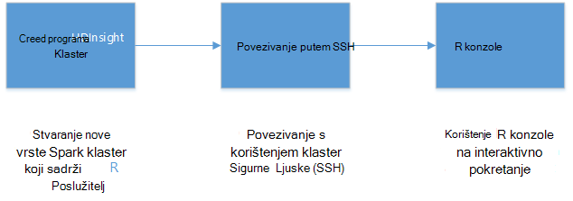

## Preduvjeti

* __Mogući Azure pretplatu__: prije početka ovog praktičnog vodiča, morate imati pretplatu na Azure. Dodatne informacije potražite u članku [Početak Azure besplatnu probnu verziju](https://azure.microsoft.com/documentation/videos/get-azure-free-trial-for-testing-hadoop-in-hdinsight/) .

* __Klijent ljuske sigurne odgovora (SSH)__: programa SSH klijenta za daljinski povezati klaster HDInsight i pokrenuti naredbe izravno klaster. Sustavi Linux, Unix i OS X pružaju klijent za SSH kroz na `ssh` naredbe. Za sustave Windows, preporučujemo da [PuTTY](http://www.chiark.greenend.org.uk/~sgtatham/putty/download.html).

    * __Tipke SSH (neobavezno)__: možete zaštititi SSH računa koji se koristi za povezivanje s klaster pomoću lozinke ili javni ključ. Pomoću lozinke jednostavnije je i omogućuje vam da biste započeli bez potrebe da biste stvorili javno/privatno ključa paru; Međutim, pomoću tipke je sigurnije.
    
        U ovom dokumentu pretpostavlja da koristite lozinku. Informacije o stvaranju i korištenju SSH tipke sa servisa HDInsight potražite u članku sljedeće dokumente:
        
        * [Korištenje SSH s HDInsight klijenata Linux, Unix ili OS X](hdinsight-hadoop-linux-use-ssh-unix.md)
        
        * [Korištenje SSH s HDInsight klijenata za Windows](hdinsight-hadoop-linux-use-ssh-windows.md)

### Preduvjeti za kontrolu pristupa

[AZURE.INCLUDE [access-control](../../includes/hdinsight-access-control-requirements.md)]

## Stvaranje klaster

> [AZURE.NOTE] Koraci u ovom dokumentu stvorite poslužitelj za R na HDInsight pomoću informacije o konfiguraciji osnovni. Ostale postavke konfiguracije klaster (kao što su dodavanje računa za dodatni prostor za pohranu, korištenje Azure virtualne mreže ili stvoriti na metastore grozd) potražite u članku [Stvaranje Linux sustavom HDInsight klastere](hdinsight-hadoop-provision-linux-clusters.md).

1. Prijavite se na [portal za Azure](https://portal.azure.com).

2. Odaberite __NOVO__, __podataka + analize__, a zatim __HDInsight__.

    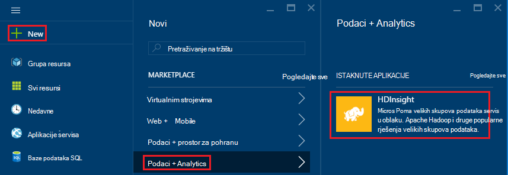

3. Unesite naziv za klaster u polje __Naziv klaster__ . Ako imate više pretplata Azure, pomoću stavku __pretplate__ odaberite onaj koji želite koristiti.

    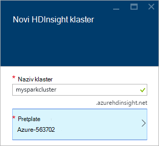

4. Odaberite __vrstu klaster__. Na plohu __Klaster vrsta__ odaberite sljedeće mogućnosti:

    * __Vrsta klaster__: R Normalni prikaz na Spark
    
    * __Klaster sloju__: Premium

    Ostavite ostale mogućnosti na zadane vrijednosti, a zatim pomoću gumba __Odaberite__ da biste spremili vrstu klaster.
    
    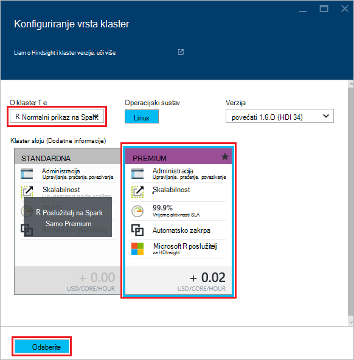
    
    > [AZURE.NOTE] Možete dodati i R poslužitelja s drugim vrstama klaster HDInsight (primjerice ili HBase, Hadoop) tako da odaberete vrstu klaster, a zatim odaberete __Premium__.

5. Odaberite **Grupu resursa** da biste vidjeli popis postojeće grupe resursa, a zatim odaberite jednu da biste stvorili klaster u. Ili možete odaberite **Stvori novo** , a zatim unesite naziv nove grupe resursa. Zelena kvačica pojavit će se da biste naznačili da je dostupan novi naziv grupe.

    > [AZURE.NOTE] Stavka će prema zadanim postavkama neke postojeće grupe resursa, ako su neki dostupni.
    
    Pomoću gumba __Odaberite__ da biste spremili grupu resursa.

6. Odaberite **vjerodajnice**, a zatim unesite **Korisničko ime za prijavu klaster** i **Lozinka za prijavu klaster**.

    Unesite __korisničko ime SSH__.  SSH koristi se za daljinsko povezivanje klaster klijenti za __Sigurnu ljuske (SSH)__ . SSH korisnika ili možete odrediti u dijaloškom okviru ili nakon klaster stvaranja (karticu konfiguracija za klaster). R Server konfiguriran je očekivati __SSH korisničko ime__ "remoteuser".  Ako koristite drugu korisničko ime, morat ćete izvršiti dodatni korak nakon stvaranja klaster.
    
    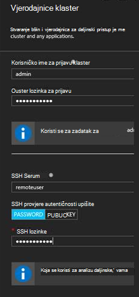

    __SSH vrsta provjere autentičnosti__: odaberite __LOZINKE__ kao vrsta provjere autentičnosti, osim ako radije koristite javni ključ.  Morat ćete par ključa javno/privatno ako želite pristupiti poslužitelju R na klasteru putem udaljene klijent, primjerice RTVS, RStudio ili neki drugi radnu površinu IDE.   

    Stvaranje i korištenje javno/privatni ključ para odaberite JAVNIM KLJUČEM i prijeđite na sljedeći način.  Ove upute pretpostavimo da imate Cygwin ssh-keygen ili ekvivalent instaliran.

    -    Generiranje javno/privatno ključa par iz naredbenog retka na prijenosnom računalu:
      
            ssh-keygen - t rsa -b 2048 – f < privatno-ključ-filename >
      
    -    To će stvoriti datoteku s privatnim ključem i javni ključ datoteku pod .pub naziv < privatno-ključ-filename > npr.  davec i davec.pub.  Odredite javni ključ datoteke (* .pub) prilikom dodjele HDI klaster vjerodajnice:
      
        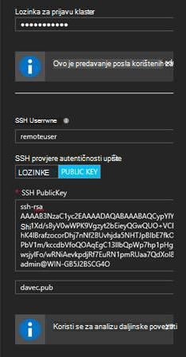  
      
    -    Promjena dozvola na privatne keyfile na prijenosnom računalu
      
            chmod 600 < privatno-ključ-filename >
      
    -    Korištenje datoteka privatnog ključa s SSH za daljinsko prijavljivanje, npr.
      
            ssh – i < privatno-ključ-filename >remoteuser@<hostname public ip>
      
      ili kao dio definicije kontekstu računalnim Hadoop Spark za poslužitelj R na klijentskom računalu (pogledajte korištenje Microsoft Server R kao Hadoop klijenta u odjeljku [Stvaranje izračunati kontekst za Spark](https://msdn.microsoft.com/microsoft-r/scaler-spark-getting-started#creating-a-compute-context-for-spark) online [RevoScaleR Hadoop Spark priručnik za početak rada](https://msdn.microsoft.com/microsoft-r/scaler-spark-getting-started)).

7. Odaberite **Izvor podataka** za odabir izvora podataka za klaster. Odaberite postojeći račun za pohranu tako da odaberete __Odaberite račun za pohranu__ , a zatim odaberite račun ili stvorite novi račun putem veze za __Novo__ u odjeljku __Odaberite račun za pohranu__ .

    Ako odaberete __Novo__, morate unijeti naziv za novi račun za pohranu. Zelena kvačica pojavit će se ako naziv je korisnik prihvati.

    __Spremnik zadana__ će zadani naziv klaster. Ostavite kao vrijednost.
    
    Odaberite __mjesto__ odaberite područje da biste stvorili račun za pohranu u.
    
    > [AZURE.IMPORTANT] Odabir mjesta za zadani izvor podataka i postavljanje mjesta klaster HDInsight. Izvor podataka za klaster i zadane moraju nalaziti u istom području.

    Pomoću gumba **Odaberite** da biste spremili konfiguracije izvora podataka.
    
    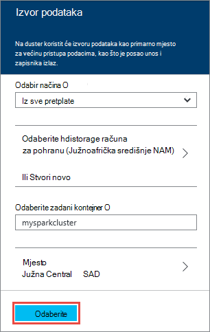

8. Odaberite **Čvor cijene razine** za prikaz informacija o čvorove za ovaj klaster stvorit će se. Ako ne znate da morate veće klaster, ostavite broj radnih čvorove po zadanom od `4`. Procijenjena trošak klaster prikazat će se unutar na plohu.

    > [AZURE.NOTE] Ako je potrebno, možete ponovno veličina svoj klaster kasnije putem portala sustava (klaster -> Postavke -> klaster skaliranje) da biste povećali ili smanjili broj čvorove tempiranja.  To može biti korisno za idling dolje klaster kada niste u upotrebu ili za dodavanje kapaciteta potrebama veći zadaci.

    Nekoliko čimbenika treba imati na umu prilikom promjene veličine svoj klaster, čvorove podataka i čvor rub obuhvaćaju sljedeće:  
   
    - Performanse raspodijeljeno analize R poslužitelja na Spark proporcionalna broja radnih čvorove kada se podaci nalaze velike.  
    - Performanse analize poslužitelja R je linearni veličina podataka analiziraju. Ako, na primjer:  
        - Za male da biste modest podatke performanse bit će najbolje kada analizirati u kontekstu lokalne računalnim na rub čvor.  Dodatne informacije o scenariji pod kojim lokalne i Spark računalnim konteksta najbolje funkcioniraju potražite u članku računalnim kontekst mogućnosti za poslužitelj R na HDInsight. 
        - Ako prijavite čvor rub i pokrenuti skriptu R postoji, a zatim sve, ali će ScaleR rx-funkcije <strong>lokalno</strong> izvršiti na rub čvor pa memorije i broj jezgri čvor rub mora biti veličine sukladno tome. Isto vrijedi i ako koristite R poslužitelja na HDI kao kontekstu udaljene računalnim na prijenosnom računalu.
    
    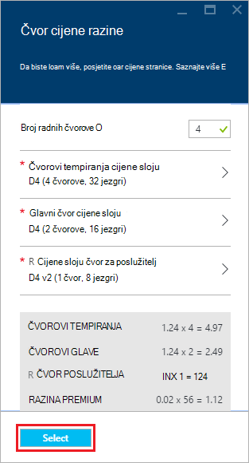

    Pomoću gumba **Odaberite** da biste spremili čvor cijene konfiguracije.
    
9. Na plohu **Novi HDInsight klaster** provjerite je li **Prikvači na Startboard** , a zatim **Stvori**. To će stvoriti klaster i dodavanje pločice za njega Startboard portalom Azure. Ikona označava stvara klaster, a promijenit će se prikazati ikonu HDInsight nakon stvaranja je dovršena.

  	| Prilikom stvaranja | Stvaranje dovršeno |
  	| ------------------ | --------------------- |
  	|  |  |

    > [AZURE.NOTE] To će potrajati nekoliko klaster će biti stvoren obično oko 15 minuta. Provjera postupak stvaranja pomoću pločicu na Startboard ili stavku **obavijesti** na lijevoj strani stranice.

## Povezivanje s ruba čvor R poslužitelja

Povezivanje s poslužitelja R rub čvora klaster HDInsight pomoću SSH:

    ssh USERNAME@r-server.CLUSTERNAME-ssh.azurehdinsight.net
    
> [AZURE.NOTE] Možete pronaći i u `R-Server.CLUSTERNAME-ssh.azurehdinsight.net` adresu na portalu Azure tako da odaberete klaster, a zatim __Sve postavke__, __aplikacije__i __RServer__. Time će se prikazati podatke SSH krajnja točka za čvor ruba.
>
> 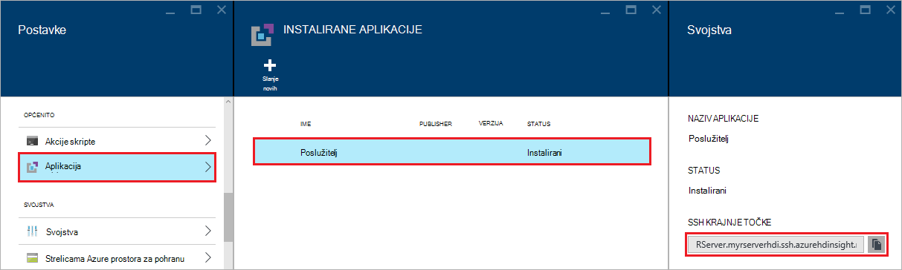
    
Ako ste koristili lozinku radi zaštite SSH korisnički račun, morat ćete unijeti. Ako ste koristili javni ključ, možda ćete morati koristiti u `-i` parametar da biste odredili koji se podudaraju privatni ključ. Na primjer, `ssh -i ~/.ssh/id_rsa USERNAME@R-Server.CLUSTERNAME-ssh.azurehdinsight.net`.
    
Dodatne informacije o korištenju SSH s operacijskim sustavom Linux HDInsight potražite u sljedećim člancima:

* [Korištenje SSH sa sustavom Linux Hadoop na HDInsight Linux, Unix ili OS X](hdinsight-hadoop-linux-use-ssh-unix.md)

* [Korištenje SSH sa sustavom Linux Hadoop na HDInsight iz sustava Windows](hdinsight-hadoop-linux-use-ssh-windows.md)

Nakon uspostave dođete na upit otprilike ovako.

    username@ed00-myrser:~$

## R konzole

1. Iz sesije SSH, koristite sljedeću naredbu da biste pokrenuli konzolu R.

        R
    
    Prikazat će se izlazni otprilike ovako.
    
        R version 3.2.2 (2015-08-14) -- "Fire Safety"
        Copyright (C) 2015 The R Foundation for Statistical Computing
        Platform: x86_64-pc-linux-gnu (64-bit)

        R is free software and comes with ABSOLUTELY NO WARRANTY.
        You are welcome to redistribute it under certain conditions.
        Type 'license()' or 'licence()' for distribution details.

        Natural language support but running in an English locale

        R is a collaborative project with many contributors.
        Type 'contributors()' for more information and
        'citation()' on how to cite R or R packages in publications.

        Type 'demo()' for some demos, 'help()' for on-line help, or
        'help.start()' for an HTML browser interface to help.
        Type 'q()' to quit R.

        Microsoft R Server version 8.0: an enhanced distribution of R
        Microsoft packages Copyright (C) 2016 Microsoft Corporation

        Type 'readme()' for release notes.

        >

2. Iz na `>` upita, možete unijeti R kod. R server sadrži pakete koje vam omogućuju da jednostavno interakciju s Hadoop i pokretanje raspodijeljeno computations. Ako, na primjer, koristite sljedeću naredbu da biste pogledali korijenu zadani datotečni sustav za klaster HDInsight.

        rxHadoopListFiles("/")
    
    Možete koristiti i adresiranja WASB stil.
    
        rxHadoopListFiles("wasbs:///")

## Korištenje poslužitelja R na HDI iz udaljene instance web-mjesto Microsoft R poslužitelja ili u okvir za klijentski R

U odjeljku iznad vezane uz korištenje parova javno/privatno ključeva za pristup klaster moguće je u programu access postavljanje računalnim kontekst HDI Hadoop Spark iz udaljene instance Microsoft R Server ili Microsoft R klijenta radi na stolnom ili prijenosnom (pogledajte korištenje Microsoft Server R kao Hadoop klijenta u odjeljku [Stvaranje izračunati kontekst za Spark](https://msdn.microsoft.com/microsoft-r/scaler-spark-getting-started#creating-a-compute-context-for-spark) online [RevoScaleR Hadoop Spark priručnik za početak rada](https://msdn.microsoft.com/microsoft-r/scaler-spark-getting-started)).  Da biste to napravili morat ćete odrediti sljedeće mogućnosti prilikom definiranja na RxSpark izračunati kontekst na prijenosnom računalu: hdfsShareDir, shareDir, sshUsername, sshHostname, sshSwitches, i sshProfileScript. Ako, na primjer:

    
    myNameNode <- "default"
    myPort <- 0 
 
    mySshHostname  <- 'rkrrehdi1-ssh.azurehdinsight.net'  # HDI secure shell hostname
    mySshUsername  <- 'remoteuser'# HDI SSH username
    mySshSwitches  <- '-i /cygdrive/c/Data/R/davec'   # HDI SSH private key
 
    myhdfsShareDir <- paste("/user/RevoShare", mySshUsername, sep="/")
    myShareDir <- paste("/var/RevoShare" , mySshUsername, sep="/")
 
    mySparkCluster <- RxSpark(
      hdfsShareDir = myhdfsShareDir,
      shareDir     = myShareDir,
      sshUsername  = mySshUsername,
      sshHostname  = mySshHostname,
      sshSwitches  = mySshSwitches,
      sshProfileScript = '/etc/profile',
      nameNode     = myNameNode,
      port         = myPort,
      consoleOutput= TRUE
    )

    
 
## Korištenje računalnim kontekstu

Kontekst računalnim omogućuje kontrolu li izračuni provest će se lokalno na rub čvor ili li ga će biti raspodijeliti čvorove u skupini HDInsight.
        
1. S konzole R, koristite sljedeće da biste učitali oglednim podacima u zadani prostor za pohranu za HDInsight.

        # Set the HDFS (WASB) location of example data
        bigDataDirRoot <- "/example/data"
        # create a local folder for storaging data temporarily
        source <- "/tmp/AirOnTimeCSV2012"
        dir.create(source)
        # Download data to the tmp folder
        remoteDir <- "http://packages.revolutionanalytics.com/datasets/AirOnTimeCSV2012"
        download.file(file.path(remoteDir, "airOT201201.csv"), file.path(source, "airOT201201.csv"))
        download.file(file.path(remoteDir, "airOT201202.csv"), file.path(source, "airOT201202.csv"))
        download.file(file.path(remoteDir, "airOT201203.csv"), file.path(source, "airOT201203.csv"))
        download.file(file.path(remoteDir, "airOT201204.csv"), file.path(source, "airOT201204.csv"))
        download.file(file.path(remoteDir, "airOT201205.csv"), file.path(source, "airOT201205.csv"))
        download.file(file.path(remoteDir, "airOT201206.csv"), file.path(source, "airOT201206.csv"))
        download.file(file.path(remoteDir, "airOT201207.csv"), file.path(source, "airOT201207.csv"))
        download.file(file.path(remoteDir, "airOT201208.csv"), file.path(source, "airOT201208.csv"))
        download.file(file.path(remoteDir, "airOT201209.csv"), file.path(source, "airOT201209.csv"))
        download.file(file.path(remoteDir, "airOT201210.csv"), file.path(source, "airOT201210.csv"))
        download.file(file.path(remoteDir, "airOT201211.csv"), file.path(source, "airOT201211.csv"))
        download.file(file.path(remoteDir, "airOT201212.csv"), file.path(source, "airOT201212.csv"))
        # Set directory in bigDataDirRoot to load the data into
        inputDir <- file.path(bigDataDirRoot,"AirOnTimeCSV2012") 
        # Make the directory
        rxHadoopMakeDir(inputDir)
        # Copy the data from source to input
        rxHadoopCopyFromLocal(source, bigDataDirRoot)

2. Nakon toga stvorite neke informacije podataka i definirali dva izvora podataka tako da se ne možemo možete raditi s podacima.

        # Define the HDFS (WASB) file system
        hdfsFS <- RxHdfsFileSystem()
        # Create info list for the airline data
        airlineColInfo <- list(
            DAY_OF_WEEK = list(type = "factor"),
            ORIGIN = list(type = "factor"),
            DEST = list(type = "factor"),
            DEP_TIME = list(type = "integer"),
            ARR_DEL15 = list(type = "logical"))

        # get all the column names
        varNames <- names(airlineColInfo)

        # Define the text data source in hdfs
        airOnTimeData <- RxTextData(inputDir, colInfo = airlineColInfo, varsToKeep = varNames, fileSystem = hdfsFS)
        # Define the text data source in local system
        airOnTimeDataLocal <- RxTextData(source, colInfo = airlineColInfo, varsToKeep = varNames)

        # formula to use
        formula = "ARR_DEL15 ~ ORIGIN + DAY_OF_WEEK + DEP_TIME + DEST"

3. Pogledajmo pokrenuti logistika regresije iznad podataka pomoću lokalnoj izračunati kontekst.

        # Set a local compute context
        rxSetComputeContext("local")
        # Run a logistic regression
        system.time(
            modelLocal <- rxLogit(formula, data = airOnTimeDataLocal)
        )
        # Display a summary 
        summary(modelLocal)

    Trebali biste vidjeti izlaza koji završava s crtama otprilike ovako.

        Data: airOnTimeDataLocal (RxTextData Data Source)
        File name: /tmp/AirOnTimeCSV2012
        Dependent variable(s): ARR_DEL15
        Total independent variables: 634 (Including number dropped: 3)
        Number of valid observations: 6005381
        Number of missing observations: 91381
        -2*LogLikelihood: 5143814.1504 (Residual deviance on 6004750 degrees of freedom)

        Coefficients:
                        Estimate Std. Error z value Pr(>|z|)
        (Intercept)   -3.370e+00  1.051e+00  -3.208  0.00134 **
        ORIGIN=JFK     4.549e-01  7.915e-01   0.575  0.56548
        ORIGIN=LAX     5.265e-01  7.915e-01   0.665  0.50590
        ......
        DEST=SHD       5.975e-01  9.371e-01   0.638  0.52377
        DEST=TTN       4.563e-01  9.520e-01   0.479  0.63172
        DEST=LAR      -1.270e+00  7.575e-01  -1.676  0.09364 .
        DEST=BPT         Dropped    Dropped Dropped  Dropped
        ---
        Signif. codes:  0 ‘***’ 0.001 ‘**’ 0.01 ‘*’ 0.05 ‘.’ 0.1 ‘ ’ 1

        Condition number of final variance-covariance matrix: 11904202
        Number of iterations: 7

4. Dalje, recimo pokrenuli isti logistika regresije pomoću Spark kontekst. Kontekst Spark će raspodjelu obrada svih radnih čvorove klaster HDInsight.

        # Define the Spark compute context 
        mySparkCluster <- RxSpark()
        # Set the compute context 
        rxSetComputeContext(mySparkCluster)
        # Run a logistic regression 
        system.time(  
            modelSpark <- rxLogit(formula, data = airOnTimeData)
        )
        # Display a summary
        summary(modelSpark)

    > [AZURE.NOTE] MapReduce možete koristiti i za izračunavanje raspodijelite klaster čvorove. Dodatne informacije o kontekstu računalnim potražite u članku [izračunati kontekst mogućnosti za poslužitelj R HDInsight premium](hdinsight-hadoop-r-server-compute-contexts.md).

## Distribucija kod R da biste više čvorove

S poslužiteljem R možete jednostavno iskoristite postojeći kod R i pokrenite preko više čvorovi u klasteru pomoću `rxExec`. To je korisno kada način parametar Počisti ili simulations. Slijedi primjer kako koristiti `rxExec`.

    rxExec( function() {Sys.info()["nodename"]}, timesToRun = 4 )
    
Ako i dalje koristite Spark ili MapReduce u kontekstu, to će vratiti vrijednost nodename za čvorove radnih koji kod (`Sys.info()["nodename"]`) je pokrenut. Ako, na primjer, na četiri čvor klaster, možete dobiti izlaz otprilike ovako.

    $rxElem1
        nodename
    "wn3-myrser"

    $rxElem2
        nodename
    "wn0-myrser"

    $rxElem3
        nodename
    "wn3-myrser"

    $rxElem4
        nodename
    "wn3-myrser"

## Instaliranje paketa R

Ako želite instalirati dodatne R paketa na rub čvor, možete koristiti `install.packages()` izravno iz unutar nakon R konzole kada ste povezani s čvor rub kroz SSH. Međutim, ako je potrebno instalirati R paketa na čvorove tempiranja klaster morate koristiti skripte akcija.

Akcije skripte su tulumu skripte koje se koriste da biste unijeli promjene konfiguracije klaster HDInsight ili da biste instalirali dodatnog softvera. U ovom slučaju, da biste instalirali dodatne R paketi. Da biste instalirali dodatne paketa pomoću skripte Akcije, poduzmite sljedeće korake.

> [AZURE.IMPORTANT] Korištenje akcije skripte pri instalaciji paketa dodatne R može se koristiti samo nakon stvaranja klaster. To ne treba koristiti tijekom stvaranja klaster, kao što je skripta ovisi R poslužitelja koja se potpuno instalacije i konfiguracije.

1. [Portal za Azure](https://portal.azure.com), odaberite poslužitelj R na klasteru HDInsight.

2. Odaberite __Sve postavke__, a zatim __Akcije skripte__plohu klaster. Plohu __Akcije skripte__ odaberite __Pošalji nove__ slanje nove akcije skripte.

    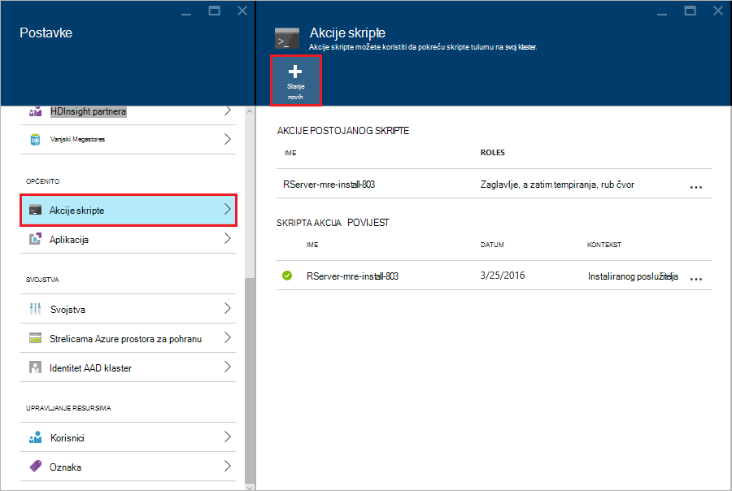

3. Iz plohu __akcija slanja skripte__ navedite sljedeće podatke.

  - __Naziv__: neslužbeni naziv za identifikaciju Ova skripta
  - __Tulum skripte URI__:`http://mrsactionscripts.blob.core.windows.net/rpackages-v01/InstallRPackages.sh`
  - __Lakši__: to bi trebalo biti __poništen__
  - __Tempiranja__: to mora biti __potvrđen okvir__
  - __Zookeeper__: to bi trebalo biti __poništen__
  - __Parametri__: U R paketi za instalaciju. Na primjer,`bitops stringr arules`
  - __Persist ovaj script...__: to bi trebalo biti __uključen__  

    > [AZURE.NOTE] 1. po zadanom sve pakete R instaliraju iz snimke usklađene s verzije R poslužitelja koji je instaliran Microsoft MRAN spremište.  Ako želite da biste instalirali noviju verziju paketa, a zatim postoji neki rizik nekompatibilnost programa, no to je moguće navođenjem `useCRAN` kao prvi element paketa popisa, npr.  `useCRAN bitops, stringr, arules`.  
    > 2. Neki paketi R je potrebno dodatne biblioteke sustava Linux. Pogodnost, ne možemo unaprijed instaliran ovisnosti potrebne za gornje 100 najpopularnijih R paketa. Međutim, ako pakete R instalirate zahtijeva biblioteke izvan te, pa morate preuzeti osnovni skripta koja se koristi u nastavku i dodajte korake da biste instalirali biblioteke sustava. Zatim morate prijenos izmijenjene skripte u spremniku javno blobova platforme Azure pohrane u i koristiti izmijenjenu skriptu da biste instalirali pakete.
    > Dodatne informacije o razvoju akcije skripte, potražite u članku [razvoj skripte akcija](hdinsight-hadoop-script-actions-linux.md).  

    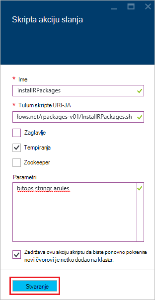

4. Odaberite __Stvori__ da biste pokrenuli skriptu. Nakon dovršetka skriptu paketa R bit će dostupni na sve čvorove tempiranja.
    
## Daljnji koraci

Sad kad znate kako stvoriti novi HDInsight klaster koja sadrži R poslužitelja i osnove korištenja konzole R iz sesiju SSH, koristite sljedeće da biste otkrili drugi načini rada s poslužiteljem R na HDInsight.

- [Dodavanje poslužitelja RStudio HDInsight premium](hdinsight-hadoop-r-server-install-r-studio.md)

- [Izračunavanje kontekst mogućnosti R poslužitelja na HDInsight premium](hdinsight-hadoop-r-server-compute-contexts.md)

- [Azure mogućnosti prostora za pohranu za poslužitelj R na HDInsight premium](hdinsight-hadoop-r-server-storage.md)

### Predlošci Azure Voditelj resursa

Ako vas zanima Automatizacija stvaranja R Normalni prikaz na HDInsight pomoću predložaka Azure Voditelj resursa, potražite u članku sljedeći predlošci primjera.

* [Stvaranje poslužitelj za R na klaster HDInsight pomoću SSH javni ključ](http://go.microsoft.com/fwlink/p/?LinkID=780809)
* [Stvaranje poslužitelj za R na klaster HDInsight pomoću programa SSH lozinke](http://go.microsoft.com/fwlink/p/?LinkID=780810)

Oba predlošci stvorite novi HDInsight klaster i račun povezan prostora za pohranu i može se koristiti s EŽA Azure, Azure PowerShell ili portala za Azure.

Generički informacije o korištenju predložaka Azure upravljanja resursima potražite u članku [utemeljen na stvaranje Linux Hadoop klaster u HDInsight pomoću predložaka Azure Voditelj resursa](hdinsight-hadoop-create-linux-clusters-arm-templates.md).
