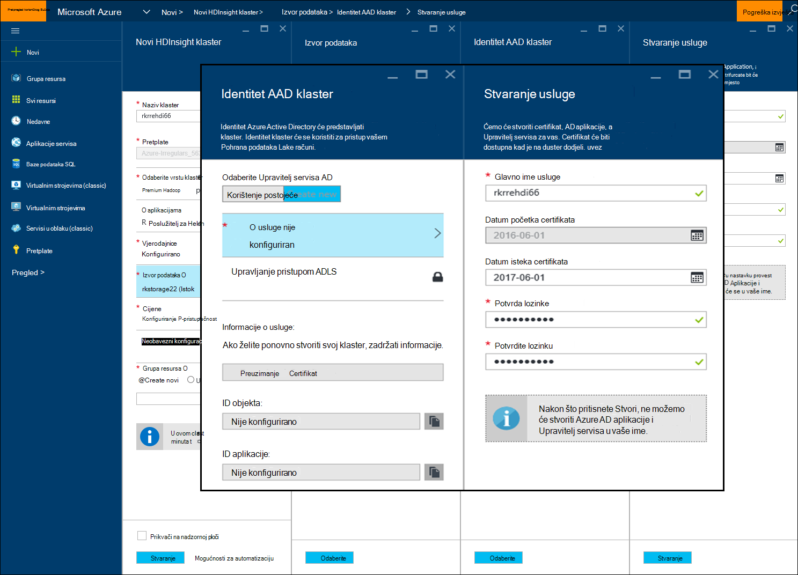
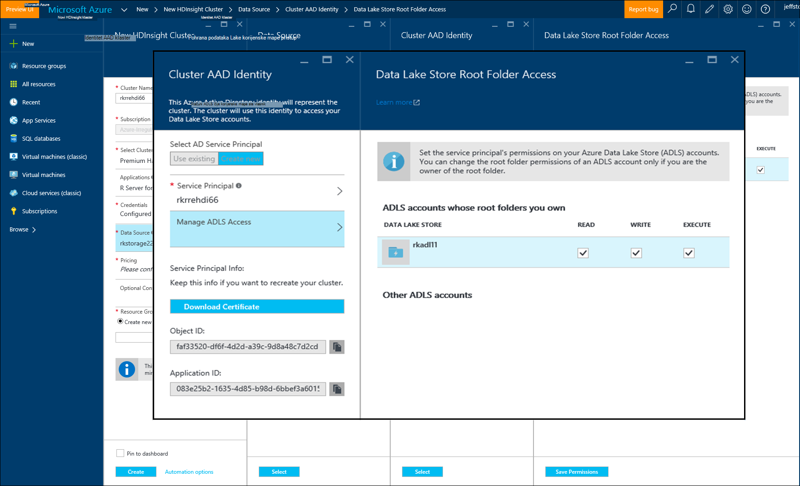

<properties
   pageTitle="Azure mogućnosti prostora za pohranu za poslužitelj R na HDInsight (pretpregled) | Microsoft Azure"
   description="Dodatne informacije o mogućnostima različite prostora za pohranu na raspolaganje korisnicima s poslužiteljem R na HDInsight (pretpregled)"
   services="HDInsight"
   documentationCenter=""
   authors="jeffstokes72"
   manager="jhubbard"
   editor="cgronlun"
/>

<tags
   ms.service="HDInsight"
   ms.devlang="R"
   ms.topic="article"
   ms.tgt_pltfrm="na"
   ms.workload="data-services"
   ms.date="09/01/2016"
   ms.author="jeffstok"
/>

# <a name="azure-storage-options-for-r-server-on-hdinsight-preview"></a>Azure mogućnosti prostora za pohranu za poslužitelj R na HDInsight (pretpregled)

Microsoft R Server na HDInsight (pretpregled) ima pristup oba blobova platforme Azure i [Azure podataka Lake prostora za pohranu](https://azure.microsoft.com/services/data-lake-store/), kao sredstvo održavanju podataka, kod, rezultat objekte iz analizu i tako dalje.

Kada stvorite Hadoop klaster u HDInsight, navedite račun za Azure prostora za pohranu. Određene spremnik spremišta blobova platforme s tog računa navedena datotečni sustav za klaster stvorite (na primjer, u Hadoop Distributed File System). Performanse svrhe klaster HDInsight se stvara u centru za iste podatke kao račun primarni prostora za pohranu koji navedete. Dodatne informacije potražite u članku [Korištenje Azure blobova s HDInsight](hdinsight-hadoop-use-blob-storage.md "Korištenje Azure blobova s HDInsight").   


## <a name="use-multiple-azure-blob-storage-accounts"></a>Pomoću više računa spremišta blobova platforme Azure

Ako je potrebno, možete pristupiti više računa Azure prostora za pohranu ili spremnika svoj klaster HDI. Da biste to učinili, morate navesti račune dodatni prostor za pohranu u korisničkom Sučelju kada stvorite klaster, a zatim slijedite ove korake da biste ih koristiti u R.  

1.  Stvaranje programa HDInsight klaster s nazivom računa za pohranu **storage1** i zadane spremnika koji se naziva **container1**.
2. Odredite naziva **storage2**račun dodatnog prostora za pohranu.  
3. Kopirajte datoteku mycsv.csv direktorij/Share i tema na toj datoteci.  

    ````
    hadoop fs –mkdir /share
    hadoop fs –copyFromLocal myscsv.scv /share  
    ````

3.  U kodu R čvor naziva **zadanom** i upravljanje direktorija i datoteke za obradu.  

    ````
    myNameNode <- "default"
    myPort <- 0
    ````

  Mjesto podataka:  

    bigDataDirRoot <-"/ share"  

  Definiranje Spark računalnim konteksta:

    mySparkCluster <-RxSpark(consoleOutput=TRUE)

  Postavljanje računalnim kontekst:

    rxSetComputeContext(mySparkCluster)

  Definiranje sustava Hadoop Distributed datoteka sustava (HDFS) datoteka:

    hdfsFS <-RxHdfsFileSystem (naziv glavnog računala = myNameNode, priključak = myPort)

  Odredite Ulazna datoteka radi analize u HDFS:

    inputFile <-file.path(bigDataDirRoot,"mycsv.csv")

Sve reference direktorija i datoteke pokažite na račun za pohranu wasbs://container1@storage1.blob.core.windows.net. To je **zadani prostor za pohranu račun** pridružen klaster HDInsight.

Sada, pretpostavimo da želite obrađivati datoteku s nazivom mySpecial.csv koja se nalazi u na /private imeničkog od **container2** u **storage2**.

U kodu R pokažite referenca čvor naziva na račun za pohranu **storage2** .

    myNameNode <- "wasbs://container2@storage2.blob.core.windows.net"
    myPort <- 0

  Mjesto podataka:

    bigDataDirRoot <- "/private"

  Definiranje Spark računalnim konteksta:

    mySparkCluster <- RxSpark(consoleOutput=TRUE, nameNode=myNameNode, port=myPort)

  Postavljanje računalnim kontekst:

    rxSetComputeContext(mySparkCluster)

  Definiranje datotečnim sustavom HDFS:

    hdfsFS <- RxHdfsFileSystem(hostName=myNameNode, port=myPort)

  Odredite Ulazna datoteka radi analize u HDFS:

    inputFile <-file.path(bigDataDirRoot,"mySpecial.csv")

Sve reference direktorija i datoteke sada pokažite na račun za pohranu wasbs://container2@storage2.blob.core.windows.net. To je **Naziv čvor** koje ste naveli.

Bilješke koje ćete morati konfiguriranje /user/RevoShare/<SSH username> imeničkog na **storage2** na sljedeći način:

    hadoop fs -mkdir wasbs://container2@storage2.blob.core.windows.net/user
    hadoop fs -mkdir wasbs://container2@storage2.blob.core.windows.net/user/RevoShare
    hadoop fs -mkdir wasbs://container2@storage2.blob.core.windows.net/user/RevoShare/<RDP username>

## <a name="use-an-azure-data-lake-store"></a>Korištenje programa iz trgovine Azure podataka Lake

Da biste koristili Lake podatke trgovine s računa za HDInsight, morate dati pristup klaster svaki trgovina Azure podataka Lake koji želite koristiti. Koristite u trgovini u skriptu R slično kao da koristite račun sekundarne prostora za pohranu (kao što je opisano u prethodnom postupku).

## <a name="add-cluster-access-to-your-azure-data-lake-stores"></a>Dodavanje klaster pristup služi za pohranu Lake Azure podataka

Pristupite Lake podatke trgovine pomoću upravitelja servisa za Azure Active Directory (Azure AD) koji je pridružen svoj klaster HDInsight.

### <a name="to-add-a-service-principal"></a>Da biste dodali glavni servisa
1. Kada stvorite svoj klaster HDInsight, odaberite **Klaster AAD identiteta** na kartici **Izvora podataka** .
2. U dijaloškom okviru **Klaster AAD identiteta** u odjeljku **Odaberite Upravitelj servisa AD**, odaberite **Stvori novi**.

Nakon što imenujte glavnicu servisa i stvoriti lozinku, otvorit će se na novoj kartici gdje možete pridružiti glavnicu servisa služi za pohranu podataka Lake.

Napomena da možete dodati pristup podacima Lake spremište kasnije tako da otvorite trgovinu Lake podataka na portalu za Azure i namjeravate **Explorer podataka** > **pristup**.  Slijedi primjer dijaloškog okvira koji pokazuje kako stvoriti glavni servisa i povezivanje s trgovinom Lake podataka "rkadl11".






## <a name="use-the-data-lake-store-with-r-server"></a>Korištenje spremišta Lake podataka s poslužiteljem R
Nakon što ste dali pristup Lake podatke trgovine, možete koristiti u spremište na poslužitelju R na HDInsight način kao i račun za sekundarne Azure prostora za pohranu. Jedina razlika koje je prefiks **wasb: / /** mijenja **adl: / /** na sljedeći način:

````
# Point to the ADL store (e.g. ADLtest)
myNameNode <- "adl://rkadl1.azuredatalakestore.net"
myPort <- 0

# Location of the data (assumes a /share directory on the ADL account)
bigDataDirRoot <- "/share"  

# Define Spark compute context
mySparkCluster <- RxSpark(consoleOutput=TRUE, nameNode=myNameNode, port=myPort)

# Set compute context
rxSetComputeContext(mySparkCluster)

# Define HDFS file system
hdfsFS <- RxHdfsFileSystem(hostName=myNameNode, port=myPort)

# Specify the input file in HDFS to analyze
inputFile <-file.path(bigDataDirRoot,"AirlineDemoSmall.csv")

# Create factors for days of the week
colInfo <- list(DayOfWeek = list(type = "factor",
               levels = c("Monday", "Tuesday", "Wednesday", "Thursday",
                          "Friday", "Saturday", "Sunday")))

# Define the data source
airDS <- RxTextData(file = inputFile, missingValueString = "M",
                    colInfo  = colInfo, fileSystem = hdfsFS)

# Run a linear regression
model <- rxLinMod(ArrDelay~CRSDepTime+DayOfWeek, data = airDS)
````

Slijede naredbama koje se koriste za konfiguriranje računa za pohranu podataka Lake s direktorijem RevoShare i dodavanje oglednu .csv datoteku iz prethodnog primjera:

````
hadoop fs -mkdir adl://rkadl1.azuredatalakestore.net/user
hadoop fs -mkdir adl://rkadl1.azuredatalakestore.net/user/RevoShare
hadoop fs -mkdir adl://rkadl1.azuredatalakestore.net/user/RevoShare/<user>

hadoop fs -mkdir adl://rkadl1.azuredatalakestore.net/share

hadoop fs -copyFromLocal /usr/lib64/R Server-7.4.1/library/RevoScaleR/SampleData/AirlineDemoSmall.csv adl://rkadl1.azuredatalakestore.net/share

hadoop fs –ls adl://rkadl1.azuredatalakestore.net/share
````

## <a name="use-azure-files-on-the-edge-node"></a>Korištenje datoteka Azure na rub čvor

Postoji mogućnost podataka za pohranu za korištenje na rub čvor naziva [Datoteke Azure](../storage/storage-how-to-use-files-linux.md "Azure datoteke"). Omogućuje postavljanje programa Azure prostora za pohranu za zajedničko korištenje datoteka u datotečni sustav Linux. To može biti korisno za pohranu podatkovne datoteke, R skripte i rezultat objekata koje će možda biti potrebno kasnije kada je li bolje koristiti izvorni datotečni sustav na HDFS čvor rub, a ne.

Glavna prednost Azure datoteke jest da zajedničke datoteke mogu postaviti i koristi sistemske podržani OS kao što je Windows i Linux. Ako, na primjer, možete se koristiti tako da drugi HDInsight klaster koje vi ili netko iz vašeg tima ima, tako da se VM Azure ili čak ni uz pomoć s lokalnim sustavom.


## <a name="next-steps"></a>Daljnji koraci

Sada kada razumijete osnove korištenju konzole R iz sesiju SSH i kako stvoriti novi klaster HDInsight koji uključuje R Server, koristite sljedeće veze da biste otkrili drugi načini rada s poslužiteljem R na HDInsight.

- [Pregled R Normalni prikaz na HDInsight](hdinsight-hadoop-r-server-overview.md)
- [Početak rada s poslužiteljem R na Hadoop](hdinsight-hadoop-r-server-get-started.md)
- [Dodavanje poslužitelja RStudio HDInsight premium](hdinsight-hadoop-r-server-install-r-studio.md)
- [Izračunavanje kontekst mogućnosti R poslužitelja na HDInsight](hdinsight-hadoop-r-server-compute-contexts.md)
