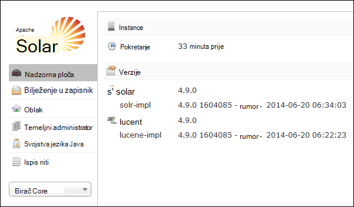
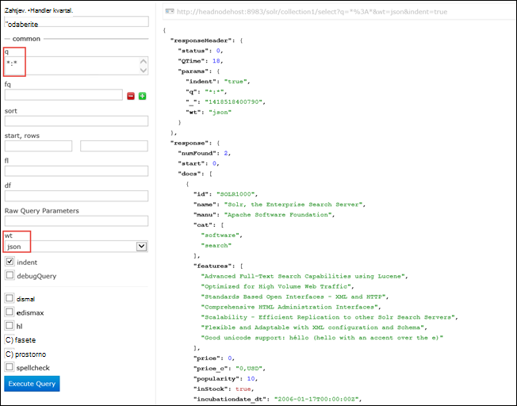

<properties
    pageTitle="Akcijom skriptu da biste instalirali Solr na sustavom Linux HDInsight | Microsoft Azure"
    description="Saznajte kako instalirati Solr na klastere sustavom Linux HDInsight Hadoop pomoću skripte akcije."
    services="hdinsight"
    documentationCenter=""
    authors="Blackmist"
    manager="jhubbard"
    editor="cgronlun"
    tags="azure-portal"/>

<tags
    ms.service="hdinsight"
    ms.workload="big-data"
    ms.tgt_pltfrm="na"
    ms.devlang="na"
    ms.topic="article"
    ms.date="10/03/2016"
    ms.author="larryfr"/>

# Instaliranje i korištenje Solr na klastere HDInsight Hadoop

U ovoj se temi će Saznajte kako instalirati Solr na Azure HDInsight pomoću skripte akcija. Solr je napredna pretraživanja i pruža mogućnosti pretraživanja na razini tvrtke na podacima upravlja Hadoop. Nakon instalacije Solr na HDInsight klaster, ćete saznati i pretraživanje podataka pomoću Solr.

> [AZURE.NOTE] Koraci u ovom dokumentu zahtijevaju sustavom Linux HDInsight klaster. Informacije o korištenju Solr s klaster utemeljen na sustavu Windows potražite u članku [Instalacija i korištenje Solr na klastere HDinsight Hadoop (Windows)](hdinsight-hadoop-solr-install.md)

Ogledna skripta koja se koristi u ovoj temi stvara Solr klaster s određenu konfiguraciju. Ako želite da biste konfigurirali klaster Solr različite skupove shards, sheme, replike, itd., morate izmijeniti skripte i binarne datoteke Solr sukladno tome.

## Što je Solr?

[Apache Solr](http://lucene.apache.org/solr/features.html) je platforme enterprise pretraživanje koji omogućuje napredna pretraživanja cijelog teksta na podacima. Dok Hadoop omogućuje pohranu i upravljanje veliku količine podataka, Apache Solr pruža mogućnosti pretraživanja za brzo dohvaćanje podataka. Ova tema sadrži upute o prilagodbi programa HDInsight klaster da biste instalirali Solr.

> [AZURE.WARNING] Komponente dao klaster HDInsight potpuno podržane, a Microsoft Support pomoći će vam da biste izdvojili i rješavanje problema vezanih uz te komponente.
>
> Prilagođene komponente, kao što su Solr, dobili komercijalno pametnije podršku radi daljnje rješavanje problema. To može rezultirati rješavanju problema ili s pitanjem želite li sudjelovati dostupnih kanala tehnologija Otvori izvor gdje se nalazi niže stručna znanja za taj tehnologiju. Na primjer, postoje mnogo web-mjesta zajednice koje je moguće koristiti, npr.: [MSDN forum za HDInsight](https://social.msdn.microsoft.com/Forums/azure/en-US/home?forum=hdinsight), [http://stackoverflow.com](http://stackoverflow.com). Projekti Apache imaju web-mjesta projekta na [http://apache.org](http://apache.org), na primjer: [Hadoop](http://hadoop.apache.org/).

## Funkcija skripta

Ova skripta će sljedeće promjene klaster HDInsight:

* Instalira Solr u`/usr/hdp/current/solr`
* Stvara novi korisnik __solrusr__, koji se koristi za pokretanje servisa Solr
* Postavlja __solruser__ kao vlasnika`/usr/hdp/current/solr`
* Dodaje programa [Upstart](http://upstart.ubuntu.com/) konfiguracije koji započinje Solr klaster čvor pokreće. Solr se automatski pokrenuti na čvorove klaster nakon instalacije

## Instalacija Solr pomoću akcije skripte

Ogledne skripte da biste instalirali Solr na programa HDInsight klaster dostupna je na sljedećem mjestu.

    https://hdiconfigactions.blob.core.windows.net/linuxsolrconfigactionv01/solr-installer-v01.sh

U ovom se odjeljku daju upute o tome kako koristiti ogledne skripte prilikom stvaranja novog klaster pomoću portala za Azure. 

> [AZURE.NOTE] Azure PowerShell, EŽA Azure, HDInsight .NET SDK ili Voditelj resursa Azure predložaka također se poslužite da biste primijenili akcije skripte. Akcije skripte možete primijeniti i na već pokrenut klastere. Dodatne informacije potražite u članku [Prilagodba HDInsight klastere s akcijama skripte](hdinsight-hadoop-customize-cluster-linux.md).

1. Pokretanje dodjeljivanje klaster pomoću koraka u [klastere HDInsight sustavom Linux dodjele resursa](hdinsight-hadoop-create-linux-clusters-portal.md), ali dovršiti dodjele resursa.

2. Na plohu **Neobavezno konfiguracije** odaberite **Akcije skripte**i unijeti podatke u nastavku:

    * __Naziv__: Upišite neslužbeni naziv za skripte akciju.
    * __SKRIPTA URI__: https://hdiconfigactions.blob.core.windows.net/linuxsolrconfigactionv01/solr-installer-v01.sh
    * __LAKŠI__: Odaberite ovu mogućnost
    * __TEMPIRANJA__: Odaberite ovu mogućnost
    * __ZOOKEEPER__: Odaberite ovu mogućnost da biste instalirali na čvor Zookeeper
    * __Parametri__: to polje ostavite prazno

3. Pri dnu **Akcije skripte**, pomoću gumba **Odaberite** spremanje konfiguracije. Na kraju, pomoću gumba **Odaberite** pri dnu plohu **Neobavezno konfiguracije** da biste spremili informacije o konfiguraciji nije obavezno.

4. Nastavite dodjele resursa klaster, kao što je opisano u [klastere sustavom Linux dodjele resursa HDInsight](hdinsight-hadoop-create-linux-clusters-portal.md).

## Kako koristiti Solr u HDInsight?

### Indeksiranje podataka

Morate pokrenuti s indeksiranje Solr s nekim podatkovnim datotekama. Pokretanje upita za pretraživanje na indeksiranih podataka možete koristiti Solr. Poduzmite sljedeće korake da biste dodali neki oglednim podacima Solr, a zatim je upit:

1. Povezivanje s klaster HDInsight pomoću SSH:

        ssh USERNAME@CLUSTERNAME-ssh.azurehdinsight.net

    Dodatne informacije o korištenju SSH sa servisa HDInsight potražite u sljedećim člancima:

    * [Korištenje SSH sa sustavom Linux Hadoop na HDInsight Linux, Unix ili OS X](hdinsight-hadoop-linux-use-ssh-unix.md)

    * [Korištenje SSH sa sustavom Linux Hadoop na HDInsight iz sustava Windows](hdinsight-hadoop-linux-use-ssh-windows.md)

    > [AZURE.IMPORTANT] Koraci kasnije u ovom dokumentu stvaranjem od programa tunelom SSL povezati pomoću Solr web-mjestu korisničkog Sučelja. Da biste pomoću ovih koraka, morate uspostaviti programa tunelom SSL i konfiguriranje vaš preglednik da biste ga koristiti.
    >
    > Dodatne informacije potražite u članku [Korištenje SSH tuneliranje da biste pristupili web Ambari korisničkog Sučelja, ResourceManager, JobHistory, NameNode, Oozie, i druge web-mjesta korisničkog Sučelja](hdinsight-linux-ambari-ssh-tunnel.md)

2. Da bi Solr indeks ogledne podatke, koristite sljedeće naredbe:

        cd /usr/hdp/current/solr/example/exampledocs
        java -jar post.jar solr.xml monitor.xml

    Primijetit ćete sljedeće Izlaz na konzoli sustava:

        POSTing file solr.xml
        POSTing file monitor.xml
        2 files indexed.
        COMMITting Solr index changes to http://localhost:8983/solr/update..
        Time spent: 0:00:01.624

    Uslužni post.jar indeksi Solr s dva uzorka dokumente, **solr.xml** i **monitor.xml**. Te će se spremati __collection1__ unutar Solr.

3. Upit REST API-JA koji prikazuje Solr, koristite sljedeće:

        curl "http://localhost:8983/solr/collection1/select?q=*%3A*&wt=json&indent=true"

    To problemi upita na temelju __collection1__ za sve dokumente koji se podudaraju __ \*:\* __ (kodira kao \*% 3A\* u nizu upita) te odgovor bi trebala biti vraćena kao JSON. Odgovor trebao izgledati otprilike ovako:

            "response": {
                "numFound": 2,
                "start": 0,
                "maxScore": 1,
                "docs": [
                  {
                    "id": "SOLR1000",
                    "name": "Solr, the Enterprise Search Server",
                    "manu": "Apache Software Foundation",
                    "cat": [
                      "software",
                      "search"
                    ],
                    "features": [
                      "Advanced Full-Text Search Capabilities using Lucene",
                      "Optimized for High Volume Web Traffic",
                      "Standards Based Open Interfaces - XML and HTTP",
                      "Comprehensive HTML Administration Interfaces",
                      "Scalability - Efficient Replication to other Solr Search Servers",
                      "Flexible and Adaptable with XML configuration and Schema",
                      "Good unicode support: héllo (hello with an accent over the e)"
                    ],
                    "price": 0,
                    "price_c": "0,USD",
                    "popularity": 10,
                    "inStock": true,
                    "incubationdate_dt": "2006-01-17T00:00:00Z",
                    "_version_": 1486960636996878300
                  },
                  {
                    "id": "3007WFP",
                    "name": "Dell Widescreen UltraSharp 3007WFP",
                    "manu": "Dell, Inc.",
                    "manu_id_s": "dell",
                    "cat": [
                      "electronics and computer1"
                    ],
                    "features": [
                      "30\" TFT active matrix LCD, 2560 x 1600, .25mm dot pitch, 700:1 contrast"
                    ],
                    "includes": "USB cable",
                    "weight": 401.6,
                    "price": 2199,
                    "price_c": "2199,USD",
                    "popularity": 6,
                    "inStock": true,
                    "store": "43.17614,-90.57341",
                    "_version_": 1486960637584081000
                  }
                ]
              }

### Korištenje Solr nadzorne ploče

Nadzorna ploča za Solr je web-mjesto korisničkog Sučelja koja omogućuje rad s Solr putem web-preglednika. Na nadzornoj ploči Solr ne pojavljuje se izravno na Internetu na svoj klaster HDInsight, ali morate pristupiti pomoću programa tunelom SSH. Dodatne informacije o korištenju programa tunelom SSH potražite u članku [Korištenje SSH tuneliranje da biste pristupili web Ambari korisničkog Sučelja, ResourceManager, JobHistory, NameNode, Oozie, i druge web-mjesta korisničkog Sučelja](hdinsight-linux-ambari-ssh-tunnel.md)

Nakon što ste uspostavili programa tunelom SSH, poduzmite sljedeće korake da biste koristili na nadzornoj ploči Solr:

1. Odredite naziv glavnog računala za primarni headnode:

    1. Korištenje SSH za povezivanje s klaster na priključak 22. Na primjer, `ssh USERNAME@CLUSTERNAME-ssh.azurehdinsight.net` pri čemu je __korisničko ime__ SSH korisničko ime, a __CLUSTERNAME__ naziv svoj klaster.

        Dodatne informacije o korištenju SSH potražite u članku sljedeće dokumente:

        * [Korištenje SSH sa sustavom Linux HDInsight od klijenta Linux, Unix ili Mac OS X](hdinsight-hadoop-linux-use-ssh-unix.md)

        * [Korištenje SSH sa sustavom Linux HDInsight iz klijenta za Windows](hdinsight-hadoop-linux-use-ssh-windows.md)
    
    3. Da biste potpuno kvalificiran naziv glavnog računala, koristite sljedeću naredbu:

            hostname -f

        To će vratiti naziv sličnu ovoj:

            hn0-myhdi-nfebtpfdv1nubcidphpap2eq2b.ex.internal.cloudapp.net
    
        To je naziv glavnog računala na koje želite koristiti u sljedećim koracima.
    
1. U pregledniku povezati __solr/http://HOSTNAME:8983 / #/__, pri čemu __naziv glavnog računala__ je određeno u prethodnim koracima. 

    Zahtjev usmjeravati do tunelom SSH glavni čvor za svoj klaster HDInsight. Trebali biste vidjeti stranicu koja je slična sljedećoj:

    

2. U lijevom oknu pomoću **Core odabir** padajućeg popisa odaberite **collection1**. Nekoliko stavki ih prikazivati ispod __collection1__.

3. Stavke ispod __collection1__, odaberite __upit__. Popunite stranicu za pretraživanje pomoću sljedeće vrijednosti:

    * U tekstni okvir **pitanja** unesite ** \*:**\*. To će vratiti u svim dokumentima indeksiranih Solr. Ako želite da biste potražili određeni niz unutar dokumenta, možete unijeti tog niza.

    * U tekstni okvir **wt** odaberite izlazni oblik. Zadana vrijednost je **json**.

    Na kraju, odaberite gumb **Za izvršavanje upita** pri dnu pate pretraživanja.

    

    Izlaz vraća dva dokumente koji se koristi za indeksiranje Solr. Rezultat izgleda otprilike ovako:

            "response": {
                "numFound": 2,
                "start": 0,
                "maxScore": 1,
                "docs": [
                  {
                    "id": "SOLR1000",
                    "name": "Solr, the Enterprise Search Server",
                    "manu": "Apache Software Foundation",
                    "cat": [
                      "software",
                      "search"
                    ],
                    "features": [
                      "Advanced Full-Text Search Capabilities using Lucene",
                      "Optimized for High Volume Web Traffic",
                      "Standards Based Open Interfaces - XML and HTTP",
                      "Comprehensive HTML Administration Interfaces",
                      "Scalability - Efficient Replication to other Solr Search Servers",
                      "Flexible and Adaptable with XML configuration and Schema",
                      "Good unicode support: héllo (hello with an accent over the e)"
                    ],
                    "price": 0,
                    "price_c": "0,USD",
                    "popularity": 10,
                    "inStock": true,
                    "incubationdate_dt": "2006-01-17T00:00:00Z",
                    "_version_": 1486960636996878300
                  },
                  {
                    "id": "3007WFP",
                    "name": "Dell Widescreen UltraSharp 3007WFP",
                    "manu": "Dell, Inc.",
                    "manu_id_s": "dell",
                    "cat": [
                      "electronics and computer1"
                    ],
                    "features": [
                      "30\" TFT active matrix LCD, 2560 x 1600, .25mm dot pitch, 700:1 contrast"
                    ],
                    "includes": "USB cable",
                    "weight": 401.6,
                    "price": 2199,
                    "price_c": "2199,USD",
                    "popularity": 6,
                    "inStock": true,
                    "store": "43.17614,-90.57341",
                    "_version_": 1486960637584081000
                  }
                ]
              }

### Pokretanje i zaustavljanje Solr

Ako vam je potrebna za ručno pokretanje ili zaustavljanje Solarni, koristite sljedeće naredbe:

    sudo stop solr

    sudo start solr

## Indeksirana polja

Kao dobro, trebali biste sigurnosno kopirajte indeksiranih podataka iz čvorove klaster Solr na spremište blobova platforme Azure. Poduzmite sljedeće korake da biste to učinili:

1. Povezivanje s klaster pomoću SSH, a zatim koristite sljedeću naredbu da biste dobili naziv glavnog računala za glavni čvor:

        hostname -f
        
2. Koristite sljedeće da biste stvorili brzu snimku indeksiranih podataka. __Naziv glavnog računala__ zamijenite nazivom vratio prethodne naredbe:

        curl http://HOSTNAME:8983/solr/replication?command=backup

    Trebali biste vidjeti odgovor ovako:

        <?xml version="1.0" encoding="UTF-8"?>
        <response>
          <lst name="responseHeader">
            <int name="status">0</int>
            <int name="QTime">9</int>
          </lst>
          <str name="status">OK</str>
        </response>

2. Nakon toga promijenite direktorija __/usr/hdp/current/solr/example/solr__. Pojavit će se u podimeniku za svaku zbirku. Svaki imenik zbirke sadrži direktoriju __podataka__ koji je gdje je snimka za tu zbirku nalazi.

    Ako, na primjer, ako ste koristili korake ranije indeksirati oglednih dokumenata, direktorija __/usr/hdp/current/solr/example/solr/collection1/data__ sada bi trebala sadržavati direktorij pod nazivom __snimke. ###__ gdje se # 's su datum i vrijeme snimke.

3. Stvaranje sažete arhive snimke mape pomoću naredbe koja je slična sljedećoj:

        tar -zcf snapshot.20150806185338855.tgz snapshot.20150806185338855

    To će se stvoriti nova arhiva pod nazivom __snapshot.20150806185338855.tgz__, koja sadrži sadržaja __snapshot.20150806185338855__ imenika.

3. Zatim možete spremiti u arhivu na klaster primarni za pohranu pomoću sljedeće naredbe:

    hadoop snapshot.20150806185338855.tgz u - copyFromLocal fs/primjer/podataka

    > [AZURE.NOTE] Preporučujemo vam da biste stvorili namjenski direktorija za pohranu snimke Solr. Na primjer, `hadoop fs -mkdir /solrbackup`.

Dodatne informacije o radu s Solr sigurnosnu kopiju i vraća potražite u članku [upućivanje i vraćanje sigurnosne kopije SolrCores](https://cwiki.apache.org/confluence/display/solr/Making+and+Restoring+Backups+of+SolrCores).

## Vidi također

- [Instalacija i korištenje klaster nijanse na HDInsight](hdinsight-hadoop-hue-linux.md). Nijanse je korisničkog Sučelja koja olakšava stvaranje, pokrenuti i spremanje Svinja i grozd zadataka, kao i pregled zadani prostor za pohranu za vaše HDInsight skupine web-mjesto.

- [Kliknite pločicu R klastere HDInsight][hdinsight-install-r]. Instalirajte R na klastere HDInsight Hadoop pomoću klaster prilagodbe. R je Otvori izvor jezik i okruženje za računalstvo Statistika. Pruža stotine ugrađene statističke funkcije i vlastitu programski jezik koji kombinira aspekte funkcionirati i vezanima uz objekt programiranje. Također nudi proširenom grafička mogućnosti.

- [Instalacija Giraph na klastere HDInsight](hdinsight-hadoop-giraph-install-linux.md). Da biste instalirali Giraph na HDInsight Hadoop klastere pomoću klaster prilagodbe. Giraph omogućuje izvođenje grafikonu obrade pomoću Hadoop, a mogu koristiti u sklopu Azure HDInsight.

- [Instalacija nijanse na klastere HDInsight](hdinsight-hadoop-hue-linux.md). Instalirajte nijanse na klastere HDInsight Hadoop pomoću klaster prilagodbe. Nijanse je skup web-aplikacije koje se koriste za interakciju s Hadoop klaster.

[hdinsight-install-r]: hdinsight-hadoop-r-scripts-linux.md
[hdinsight-cluster-customize]: hdinsight-hadoop-customize-cluster-linux.md
