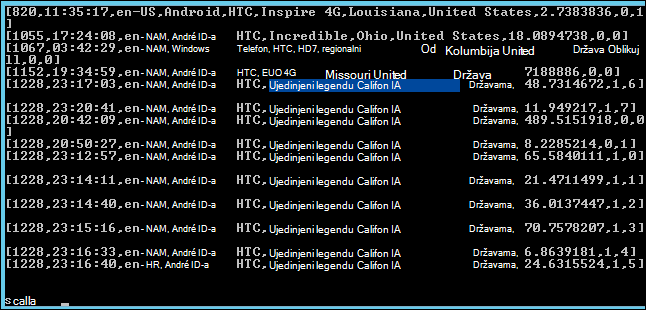

<properties
    pageTitle="Akcijom skriptu da biste instalirali Spark na Hadoop klaster | Microsoft Azure"
    description="Saznajte kako prilagoditi programa HDInsight klaster Spark pomoću skripte akcije."
    services="hdinsight"
    documentationCenter=""
    authors="nitinme"
    manager="jhubbard"
    editor="cgronlun"/>

<tags
    ms.service="hdinsight"
    ms.workload="big-data"
    ms.tgt_pltfrm="na"
    ms.devlang="na"
    ms.topic="article"
    ms.date="02/05/2016"
    ms.author="nitinme"/>

# Instaliranje i korištenje Spark na klastere HDInsight Hadoop pomoću skripte akcije

> [AZURE.IMPORTANT] U ovom se članku sada je zastario. HDInsight sada nudi Spark u obliku jednostavno prva liga klaster utemeljen na sustavu Windows klastere, što znači da je sada možete izravno stvoriti Spark klaster bez izmjene Hadoop klaster pomoću skripte akcije. Pomoću vrsta klaster Spark, dobit ćete je klaster verziju 3,2 HDInsight s Spark verzija 1.3.1.  Da biste instalirali različite verzije sustava Spark, možete koristiti skripte akciju. HDInsight nudi skriptu ogledne skripte akcija.

Saznajte kako instalirati Spark na Windows temelji HDInsight pomoću akcije skripte i pokretanje upita Spark na HDInsight klaster.

**Povezani članci**

- [Stvaranje Hadoop klastere u HDInsight](hdinsight-provision-clusters.md): opće informacije o stvaranju klastere HDInsight.

- [Početak rada s Apache Spark na HDInsight](hdinsight-apache-spark-jupyter-spark-sql.md): Stvaranje programa klaster HDInsight Spark.

- [Prilagodba klaster HDInsight pomoću skripte akcije][hdinsight-cluster-customize]: opće informacije o prilagođavanju klastere HDInsight pomoću skripte akcije.

- [Razvoj akcija skripte skripte za HDInsight](hdinsight-hadoop-script-actions.md).

## Što je Spark?

<a href="http://spark.apache.org/docs/latest/index.html" target="_blank">Apache Spark</a> je programa paralelno Otvori izvor obrade framework koji podržava obrada u memoriji da biste uvećali performanse velikih skupova podataka analitički aplikacije. Mogućnosti izračuna u memoriji Spark na ga činite dobar izbor za izračun s iteracijama algoritama computations strojnog učenja i grafikonu.

Spark može se koristiti i za izvođenje običan temeljenog na disku obradu podataka. Spark poboljšava tradicionalni framework MapReduce po izbjegavanje zapisivanja na disk u Srednja faza. Osim toga, Spark kompatibilan sa pohranu Hadoop Distributed datoteka sustava (HDFS) i blobova platforme Azure tako postojeće podatke možete jednostavno obrađuju putem Spark.

Ova tema sadrži upute o prilagodbi programa HDInsight klaster da biste instalirali Spark.

## Instalacija Spark pomoću portala za Azure

Ogledne skripte da biste instalirali Spark na programa HDInsight klaster dostupna samo za čitanje Azure spremišta blobova na [https://hdiconfigactions.blob.core.windows.net/sparkconfigactionv03/spark-installer-v03.ps1](https://hdiconfigactions.blob.core.windows.net/sparkconfigactionv03/spark-installer-v03.ps1). Ova skripta možete instalirati Spark 1.2.0 ili Spark 1.0.2 ovisno o verziji klaster HDInsight koji ste stvorili.

- Ako koristite skriptu prilikom stvaranja programa **HDInsight 3,2** klaster, instalirat će se **Spark 1.2.0**.
- Ako koristite skriptu prilikom stvaranja programa **HDInsight 3.1** klaster, instalirat će se **Spark 1.0.2**.

Možete izmijeniti ovu skriptu ili stvaranje vlastite skripte instalirati druge verzije programa Spark.

> [AZURE.NOTE] Ogledne skripte funkcionira samo s HDInsight 3.1 i 3.2 klastere. Dodatne informacije o verzijama klaster servisa HDInsight potražite u članku [HDInsight klaster verzije](hdinsight-component-versioning.md).

1. Stvaranje klaster pomoću mogućnosti za **Stvaranje PRILAGOĐENE** kao što je opisano na [Stvaranje Hadoop klastere u HDInsight](hdinsight-provision-clusters.md#portal). Odaberite verziju klaster ovisno o sljedeće:

    - Ako želite instalirati **Spark 1.2.0**stvorite programa klaster 3,2 HDInsight.
    - Ako želite instalirati **Spark 1.0.2**stvorite programa klaster HDInsight 3.1.

2. Na stranici čarobnjaka **Akcije skripte** kliknite **dodajte akciju skripte** možete unijeti detalje o akciju skripte kao što je prikazano u nastavku:

    ![Korištenje akcija skriptu da biste prilagodili klaster] (./media/hdinsight-hadoop-spark-install/HDI.CustomProvision.Page6.png "Korištenje akcija skriptu da biste prilagodili klaster")

    <table border='1'>
        <tr><th>Svojstvo</th><th>Vrijednost</th></tr>
        <tr><td>Ime</td>
            <td>Unesite naziv za skripte akciju. Na primjer, <b>Instalirajte Spark</b>.</td></tr>
        <tr><td>Skripta URI-JA</td>
            <td>Navedite Uniform Resource Identifier (URI) da biste skriptu koja se poziva da biste prilagodili klaster. Na primjer, <i>https://hdiconfigactions.blob.core.windows.net/sparkconfigactionv03/spark-installer-v03.ps1</i></td></tr>
        <tr><td>Vrsta čvora</td>
            <td>Navedite čvorove na kojem se izvodi skriptu prilagodbe. Možete odabrati <b>sve čvorove</b>, <b>samo čvorove glave</b>ili <b>samo čvorove tempiranja</b>.
        <tr><td>Parametri</td>
            <td>Navedite parametre, ako je potrebno skripta. Skripta za instalaciju Spark ne zahtijeva parametre tako da možete ostaviti to prazno.</td></tr>
    </table>

    Možete dodati više akcija skriptu da biste instalirali više komponenti na klaster. Nakon što dodate skripte, kliknite kvačicu da biste započeli stvarati klaster.

Možete koristiti i skriptu da biste instalirali Spark na HDInsight pomoću Azure PowerShell i HDInsight .NET SDK. Upute za ove postupke su navedene u nastavku ovog članka.

## Korištenje Spark u HDInsight
Spark nudi API-ji Scala, Python i Java. Da biste pokrenuli Spark upite možete koristiti i interaktivnih ljuske Spark. U ovom se odjeljku daju upute o tome kako koristiti različitih pristupa za rad s Spark:

- [Pomoću ljuske Spark pokretanje interaktivne upita](#sparkshell)
- [Pomoću ljuske Spark pokretanje Spark SQL upita](#sparksql)
- [Korištenje programa Scala samostalni](#standalone)

###Pomoću ljuske Spark pokretanje interaktivne upita
Izvršite sljedeće korake da biste pokrenuli Spark upiti s interaktivne ljuske za Spark. U ovom odjeljku ne možemo pokrenuti Spark upit na datoteku s oglednim podacima (/ example/data/gutenberg/davinci.txt) koji je dostupan na klastere HDInsight prema zadanim postavkama.

1. Na portalu Azure klaster stvorena pomoću Spark instalirati, a zatim daljinski u klaster omogućite udaljene radne površine. Upute potražite u članku [Povezivanje s klastere HDInsight pomoću RDP](hdinsight-administer-use-management-portal.md#rdp).

2. U sesiji protokola udaljene radne površine (RDP) s radne površine, otvorite naredbeni redak Hadoop (iz prečac na radnoj površini), a zatim otvorite mjesto na kojem je instaliran Spark; na primjer, **C:\apps\dist\spark-1.2.0**.

3. Pokrenite sljedeću naredbu da biste pokrenuli ljuske Spark:

         .\bin\spark-shell --master yarn

    Kada se naredba završi s radom, na Scala moraju se upita:

         scala>

5. Na upit Scala unesite upita Spark prikazano u nastavku. Ovaj upit broji pojavljivanja svaku riječ u datoteci davinci.txt koja je dostupna na/primjer/podataka/gutenberg/lokaciji spremišta blobova platforme Azure pridružene klaster.

        val file = sc.textFile("/example/data/gutenberg/davinci.txt")
        val counts = file.flatMap(line => line.split(" ")).map(word => (word, 1)).reduceByKey(_ + _)
        counts.toArray().foreach(println)

6. Izlaz trebali biste otprilike ovako:

    

7. Unesite: pitanja da biste izašli iz Scala upit.

        :q

###Pomoću ljuske Spark pokretanje Spark SQL upita

Spark SQL ne omogućuje korištenje Spark da biste pokrenuli relacijskih upita izražena u Structured Query Language (SQL), HiveQL ili Scala. U ovom ćete odjeljku smo potražite pomoću Spark da biste pokrenuli upit grozd na tablicu vrste Hive uzorka. Tablicu vrste Hive koja se koristi u ovom odjeljku (pod nazivom **hivesampletable**) dostupna po zadanom kada stvarate klaster.

>[AZURE.NOTE] Ogledna ispod stvorena protiv **povećati 1.2.0**, koji se instalira ako pokrenete akciju skripte prilikom stvaranja klaster 3,2 HDInsight.

1. Na portalu Azure klaster stvorena pomoću Spark instalirati, a zatim daljinski u klaster omogućite udaljene radne površine. Upute potražite u članku [Povezivanje s klastere HDInsight pomoću RDP](hdinsight-administer-use-management-portal.md#rdp).

2. U sesiji RDP s radne površine, otvorite naredbeni redak Hadoop (iz prečac na radnoj površini), a zatim otvorite mjesto na kojem je instaliran Spark; na primjer, **C:\apps\dist\spark-1.2.0**.

3. Pokrenite sljedeću naredbu da biste pokrenuli ljuske Spark:

         .\bin\spark-shell --master yarn

    Kada se naredba završi s radom, na Scala moraju se upita:

         scala>

4. Na upit Scala postavite grozd kontekstu. Ovo je obavezan za rad s upitima grozd pomoću Spark.

        val hiveContext = new org.apache.spark.sql.hive.HiveContext(sc)

    Imajte na umu **sc** je zadani Spark kontekst koja se postavlja prilikom pokretanja ljuske Spark.

5. Izvođenje upita grozd pomoću kontekstnog grozd i ispišite Izlaz na konzoli sustava. Upit dohvaća podatke na uređajima sa stvaranjem određene i ograničava broj zapisa koje dohvaćaju 20.

        hiveContext.sql("""SELECT * FROM hivesampletable WHERE devicemake LIKE "HTC%" LIMIT 20""").collect().foreach(println)

6. Trebali biste vidjeti na Izlaz kao što je sljedeća:

    

7. Unesite: pitanja da biste izašli iz Scala upit.

        :q

### Korištenje programa Scala samostalni

U ovom ćete odjeljku pisanju Scala aplikacije koje se broji retke koji sadrže slova "a i b u datoteku s oglednim podacima (/ example/data/gutenberg/davinci.txt) koji je dostupan na klastere HDInsight prema zadanim postavkama. Pisanje i korištenje samostalni program Scala s klaster prilagoditi s instalacijom Spark, morate poduzeti sljedeće korake:

- Napišite Scala program
- Sastavljanje Scala program da biste dobili .jar datoteka
- Pokreni na klaster

#### Napišite Scala program
U ovom ćete odjeljku pišete Scala program koji broji retke koji sadrže "a i b u datoteke s oglednim podacima.

1. Otvorite uređivač teksta, a zatim zalijepite sljedeći kod:

        /* SimpleApp.scala */
        import org.apache.spark.SparkContext
        import org.apache.spark.SparkContext._
        import org.apache.spark.SparkConf

        object SimpleApp {
          def main(args: Array[String]) {
            val logFile = "/example/data/gutenberg/davinci.txt"         //Location of the sample data file on Azure Blob storage
            val conf = new SparkConf().setAppName("SimpleApplication")
            val sc = new SparkContext(conf)
            val logData = sc.textFile(logFile, 2).cache()
            val numAs = logData.filter(line => line.contains("a")).count()
            val numBs = logData.filter(line => line.contains("b")).count()
            println("Lines with a: %s, Lines with b: %s".format(numAs, numBs))
          }
        }

2. Spremite datoteku pod nazivom **SimpleApp.scala**.

#### Sastavljanje Scala program
U ovom odjeljku koristite <a href="http://www.scala-sbt.org/0.13/docs/index.html" target="_blank">Jednostavan alat za sastavljanje</a> (ili sbt) da biste sastavili Scala program. sbt zahtijeva Java 1,6 ili noviji, pa provjerite je li odgovarajuću verziju Java instaliran prije nastavka ovaj odjeljak.

1. Instalirajte sbt iz http://www.scala-sbt.org/0.13/tutorial/Installing-sbt-on-Windows.html.
2. Stvorite mapu naziva **SimpleScalaApp**pa u ovu mapu stvoriti datoteku s nazivom **simple.sbt**. Ovo je konfiguracijska datoteka koja sadrži informacije o Scala verziju, ovisnosti biblioteke, itd. Zalijepite sljedeće u simple.sbt datoteku i spremite je:

        name := "SimpleApp"

        version := "1.0"

        scalaVersion := "2.10.4"

        libraryDependencies += "org.apache.spark" %% "spark-core" % "1.2.0"

    >[AZURE.NOTE] Provjerite je li zadržati praznih redaka u datoteci.

3. U mapi **SimpleScalaApp** stvaranje strukture direktorija **\src\main\scala** i zalijepite koju ste stvorili ranije u mapi \src\main\scala program Scala (**SimpleApp.scala**).
4. Otvorite naredbeni redak, idite u direktorij SimpleScalaApp i unesite sljedeću naredbu:

        sbt package

    Kada aplikacija ne Sastavi, vidjet ćete **simpleapp_2.10 1.0.jar** datoteke stvorene u imenik **\target\scala-2.10** u korijenskoj mapi SimpleScalaApp.

#### Pokreni na klaster
U ovom ćete odjeljku vam udaljene u klaster koja ima Spark instaliran i kopirajte projekta SimpleScalaApp ciljne mape. Zatim pomoću naredbe **spark slanje** slanja zadatka na klaster.

1. Alat za analizu daljinske u klaster koja ima Spark instaliran. S računala gdje ste napisali i ugrađena SimpleApp.scala program, mapu **SimpleScalaApp\target** kopirati i zalijepiti na mjesto na klaster.
2. U sesiji RDP s radne površine, otvorite naredbeni redak Hadoop, a zatim otvorite na mjesto gdje ste zalijepili **ciljnu** mapu.
3. Unesite sljedeću naredbu da biste pokrenuli SimpleApp.scala program:

        C:\apps\dist\spark-1.2.0\bin\spark-submit --class "SimpleApp" --master local target/scala-2.10/simpleapp_2.10-1.0.jar

4. Kada program završi s radom, rezultat se prikazuje na konzoli sustava.

        Lines with a: 21374, Lines with b: 11430

## Instalacija Spark pomoću komponente PowerShell Azure

U ovom ćete odjeljku cmdlet za **<a href = "http://msdn.microsoft.com/library/dn858088.aspx" target="_blank">Dodavanje AzureHDInsightScriptAction</a>** koristimo za pozivanje skripte korištenjem akcije skriptu da biste prilagodili klaster. Prije nego što nastavite, provjerite je li ste instalirali i konfigurirali Azure PowerShell. Informacije o konfiguriranju radne stanice da biste pokrenuli Azure PowerShell cmdleti za HDInsight potražite u članku [instalirati i konfigurirati Azure PowerShell](../powershell-install-configure.md).

Poduzmite sljedeće korake:

1. Otvorite prozor programa Azure PowerShell i deklarirati sljedeće varijable:

        # Provide values for these variables
        $subscriptionName = "<SubscriptionName>"        # Name of the Azure subscription
        $clusterName = "<HDInsightClusterName>"         # HDInsight cluster name
        $storageAccountName = "<StorageAccountName>"    # Azure Storage account that hosts the default container
        $storageAccountKey = "<StorageAccountKey>"      # Key for the Storage account
        $containerName = $clusterName
        $location = "<MicrosoftDataCenter>"             # Location of the HDInsight cluster. It must be in the same data center as the Storage account.
        $clusterNodes = <ClusterSizeInNumbers>          # Number of nodes in the HDInsight cluster
        $version = "<HDInsightClusterVersion>"          # For example, "3.2"

2. Navedite konfiguracijskih vrijednosti kao što su čvorovi u klasteru i pohranu zadana će se koristiti.

        # Specify the configuration options
        Select-AzureSubscription $subscriptionName
        $config = New-AzureHDInsightClusterConfig -ClusterSizeInNodes $clusterNodes
        $config.DefaultStorageAccount.StorageAccountName="$storageAccountName.blob.core.windows.net"
        $config.DefaultStorageAccount.StorageAccountKey=$storageAccountKey
        $config.DefaultStorageAccount.StorageContainerName=$containerName

3. Pomoću cmdleta **Dodaj AzureHDInsightScriptAction** da biste dodali akciju za skripte klaster konfiguracije. Kasnije, pri stvaranju klaster je akcija skripte dobiva izvršiti.

        # Add a script action to the cluster configuration
        $config = Add-AzureHDInsightScriptAction -Config $config -Name "Install Spark" -ClusterRoleCollection HeadNode -Uri https://hdiconfigactions.blob.core.windows.net/sparkconfigactionv03/spark-installer-v03.ps1

    Cmdlet za **Dodavanje AzureHDInsightScriptAction** uzima sljedećih parametara:

    <table style="border-color: #c6c6c6; border-width: 2px; border-style: solid; border-collapse: collapse;">
    <tr>
    <th style="border-color: #c6c6c6; border-width: 2px; border-style: solid; border-collapse: collapse; width:90px; padding-left:5px; padding-right:5px;">Parametar</th>
    <th style="border-color: #c6c6c6; border-width: 2px; border-style: solid; border-collapse: collapse; width:550px; padding-left:5px; padding-right:5px;">Definicija</th></tr>
    <tr>
    <td style="border-color: #c6c6c6; border-width: 2px; border-style: solid; border-collapse: collapse; padding-left:5px;">Konfiguracija</td>
    <td style="border-color: #c6c6c6; border-width: 2px; border-style: solid; border-collapse: collapse; padding-left:5px; padding-right:5px;">Konfiguriranje objekt koji skriptu akcija dodaju.</td></tr>
    <tr>
    <td style="border-color: #c6c6c6; border-width: 2px; border-style: solid; border-collapse: collapse; padding-left:5px;">Ime</td>
    <td style="border-color: #c6c6c6; border-width: 2px; border-style: solid; border-collapse: collapse; padding-left:5px;">Naziv akcije skripte.</td></tr>
    <tr>
    <td style="border-color: #c6c6c6; border-width: 2px; border-style: solid; border-collapse: collapse; padding-left:5px;">ClusterRoleCollection</td>
    <td style="border-color: #c6c6c6; border-width: 2px; border-style: solid; border-collapse: collapse; padding-left:5px;">Određuje čvorove na kojem se izvodi skriptu prilagodbe. Valjane vrijednosti su HeadNode (da biste instalirali na glavni čvora) ili DataNode (da biste instalirali na sve čvorove podataka). Možete koristiti jedan ili oba vrijednosti.</td></tr>
    <tr>
    <td style="border-color: #c6c6c6; border-width: 2px; border-style: solid; border-collapse: collapse; padding-left:5px;">URI-ja</td>
    <td style="border-color: #c6c6c6; border-width: 2px; border-style: solid; border-collapse: collapse; padding-left:5px;">Određuje URI skriptu koja se izvršava.</td></tr>
    <tr>
    <td style="border-color: #c6c6c6; border-width: 2px; border-style: solid; border-collapse: collapse; padding-left:5px;">Parametri</td>
    <td style="border-color: #c6c6c6; border-width: 2px; border-style: solid; border-collapse: collapse; padding-left:5px;">Parametri potrebnih skriptu. Ogledna skripta koja se koristi u ovoj temi ne zahtijeva parametre i zato ne vidite taj parametar u isječak iznad.
    </td></tr>
    </table>

4. Na kraju, početi stvarati prilagođene klaster s Spark instaliran.  

        # Start creating a cluster with Spark installed
        New-AzureHDInsightCluster -Config $config -Name $clusterName -Location $location -Version $version

Kada se to od vas zatraži, unesite vjerodajnice za klaster. To može potrajati nekoliko minuta prije stvaranja klaster.

## Instalacija Spark pomoću komponente PowerShell

U odjeljku [Prilagodba HDInsight klastere pomoću skripte akcije](hdinsight-hadoop-customize-cluster.md#call_scripts_using_powershell).

## Instalacija Spark pomoću .NET SDK-a

U odjeljku [Prilagodba HDInsight klastere pomoću skripte akcije](hdinsight-hadoop-customize-cluster.md#call_scripts_using_azure_powershell).

## Vidi također

- [Stvaranje Hadoop klastere u HDInsight](hdinsight-provision-clusters.md): Stvaranje klastere HDInsight.
- [Početak rada s Apache Spark na HDInsight](hdinsight-apache-spark-jupyter-spark-sql.md): početak rada s Spark na HDInsight.
- [Prilagodba klaster HDInsight pomoću skripte akcije][hdinsight-cluster-customize]: Prilagodba klastere HDInsight pomoću skripte akcije.
- [Razvoj akcija skripte skripte za HDInsight](hdinsight-hadoop-script-actions.md): Razvoj skripti skripte akcija.
- [Kliknite pločicu R klastere HDInsight] [ hdinsight-install-r] sadrži upute o korištenju klaster prilagodbe za instalaciju i korištenje R na klastere HDInsight Hadoop. R je Otvori izvor jezik i okruženje za računalstvo Statistika. Pruža stotine ugrađene statističke funkcije i vlastitu programski jezik koji kombinira aspekte funkcionirati i vezanima uz objekt programiranje. Također nudi proširenom grafička mogućnosti.
- [Instalacija Giraph na klastere HDInsight](hdinsight-hadoop-giraph-install.md). Da biste instalirali Giraph na HDInsight Hadoop klastere pomoću klaster prilagodbe. Giraph omogućuje izvođenje grafikonu obrade pomoću Hadoop, a mogu koristiti u sklopu Azure HDInsight.
- [Instalacija Solr na klastere HDInsight](hdinsight-hadoop-solr-install.md). Da biste instalirali Solr na HDInsight Hadoop klastere pomoću klaster prilagodbe. Solr omogućuje izvođenje operacija napredna pretraživanja na podataka koji su pohranjeni.

[hdinsight-provision]: hdinsight-provision-clusters.md
[hdinsight-install-r]: hdinsight-hadoop-r-scripts.md
[hdinsight-cluster-customize]: hdinsight-hadoop-customize-cluster.md
[powershell-install-configure]: powershell-install-configure.md
