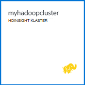

<properties
   pageTitle="Hadoop Praktični vodič: početak rada s Hadoop u sustavu Windows | Microsoft Azure"
   description="Početak rada s Hadoop u HDInsight. Saznajte kako stvoriti klastere Hadoop u sustavu Windows, podacima pokrenuli upit grozd i analizirati Izlaz u programu Excel."
   keywords="hadoop ćete praktičnom vodiču hadoop u sustavu windows, hadoop klaster, Saznajte hadoop, grozd upita"
   services="hdinsight"
   documentationCenter=""
   authors="nitinme"
   manager="jhubbard"
   editor="cgronlun"
   tags="azure-portal"/>

<tags
   ms.service="hdinsight"
   ms.devlang="na"
   ms.topic="article"
   ms.tgt_pltfrm="na"
   ms.workload="big-data"
   ms.date="03/07/2016"
   ms.author="nitinme"/>

# Hadoop Praktični vodič: početak rada s Hadoop u HDInsight u sustavu Windows

> [AZURE.SELECTOR]
- [Sustavom Linux](../hdinsight-hadoop-linux-tutorial-get-started.md)
- [Utemeljen na sustavu Windows](../hdinsight-hadoop-tutorial-get-started-windows.md)

Da biste lakše saznali Hadoop u sustavu Windows i početak korištenja HDInsight, pomoću ovog praktičnog vodiča objašnjava da biste pokrenuli upit grozd nestrukturirane podatke klasteru Hadoop i analiza rezultata u programu Microsoft Excel.

>[AZURE.NOTE] Informacije u ovom dokumentu je za klastere HDInsight utemeljen na sustavu Windows. Informacije o operacijskim sustavom Linux klastere potražite u članku [Hadoop Praktični vodič: početak rada s operacijskim sustavom Linux Hadoop u HDInsight](hdinsight-hadoop-linux-tutorial-get-started.md).

Pretpostavimo da imate veliki nestrukturirane skupom podataka i želite pokrenuti grozd upita da biste izvlačenje smisleni informacija. To je točno što ćete učiniti pomoću ovog praktičnog vodiča. Evo kako postići sljedeće:

   !["Hadoop Praktični vodič: Stvaranje poslovnog subjekta Stvaranje Hadoop klaster; slanje upita grozd; Analiza podataka u programu Excel.][image-hdi-getstarted-flow]

Pogledajte pokazni videozapis ovog praktičnog vodiča da biste saznali Hadoop na HDInsight:

![Video prvi vodiča za Hadoop: izvršavanja upita grozd na Hadoop klaster i analiza rezultata u programu Excel.][img-hdi-getstarted-video]

**[Pogledajte vodič Hadoop za HDInsight na servisu YouTube](https://www.youtube.com/watch?v=Y4aNjnoeaHA&list=PLDrz-Fkcb9WWdY-Yp6D4fTC1ll_3lU-QS)**

U kombinaciji s Općenito dostupan Azure HDInsight Microsoft pruža HDInsight Emulator za Azure, prijašnji *Pretpregled programa Microsoft HDInsight za razvojne inženjere*. Na Emulator pronalaze scenariji za razvojne inženjere i podržava samo jedan čvor implementacije. Informacije o korištenju Emulator servisa HDInsight potražite u članku [Početak rada s HDInsight Emulator][hdinsight-emulator].

[AZURE.INCLUDE [delete-cluster-warning](../../includes/hdinsight-delete-cluster-warning.md)]

## Preduvjeti

Prije početka ovog praktičnog vodiča za Hadoop u sustavu Windows, morate imati sljedeće:

- **Mogući Azure pretplate**. Pogledajte [Početak Azure besplatnu probnu verziju](https://azure.microsoft.com/documentation/videos/get-azure-free-trial-for-testing-hadoop-in-hdinsight/).
- **A radne stanice računala** za Office 2013 Professional Plus, Office 365 Pro Plus, samostalno izdanje programa Excel 2013 ili Office 2010 Professional Plus.

### Preduvjeti za kontrolu pristupa

[AZURE.INCLUDE [access-control](../../includes/hdinsight-access-control-requirements.md)]

##Stvaranje klastere Hadoop

Kada stvorite klaster, stvorite Azure računalnim resursi koji sadrže Hadoop i povezane aplikacije. U ovom ćete odjeljku stvoriti programa klaster verziju 3,2 HDInsight. Možete stvoriti i Hadoop klastere za druge verzije. Upute potražite u članku [Stvaranje HDInsight klastere pomoću prilagođene mogućnosti][hdinsight-provision]. Informacije o verzijama HDInsight i njihovih SLA potražite u članku [HDInsight komponente verzijama](hdinsight-component-versioning.md).

**Da biste stvorili Hadoop klaster**

1. Prijava na [Portal za Azure](https://portal.azure.com/).
2. Kliknite **NOVO**, kliknite **Analize podataka**, a zatim **HDInsight**. Na portalu otvorit će se **Novi HDInsight klaster** plohu.

    ![Stvaranje nove klaster na portalu za Azure] (./media/hdinsight-hadoop-tutorial-get-started-windows/HDI.CreateCluster.1.png "Stvaranje nove klaster na portalu za Azure")

3. Unesite ili odaberite sljedeće:

    ![Unesite klaster naziv i vrsta] (./media/hdinsight-hadoop-tutorial-get-started-windows/HDI.CreateCluster.2.png "Unesite klaster naziv i vrsta")
    
  	|Naziv polja| Vrijednost|
  	|----------|------|
  	|Naziv klaster| Jedinstveni naziv za označavanje klaster|
  	|Vrsta klaster| Odaberite **Hadoop** za ovog praktičnog vodiča. |
  	|Klaster operacijski sustav| Odaberite **Windows Server 2012 R2 podatkovnog centra** za ovog praktičnog vodiča.|
  	|HDInsight verzija| Odaberite najnoviju verziju za ovog praktičnog vodiča.|
  	|Pretplate| Odaberite Azure pretplatu koja će se koristiti za klaster.|
  	|Grupa resursa | Odaberite postojeću grupu Azure resursa ili stvorite novu grupu resursa. Osnovni HDInsight klaster sadrži klaster i njegov zadanog računa za pohranu.  Možete grupirati dvije u grupu resursa za jednostavno upravljanje.|
  	|Vjerodajnice| Unesite korisničko ime za prijavu klaster i lozinku. Klaster Windows temelji mogu sadržavati 2 korisničke račune.  Korisnik klaster (ili korisnik HTTP) koristi se za upravljanje klaster i slanje zadataka.  Po želji možete stvoriti udaljene radne površine (RDP) korisničkog računa radi alat za analizu daljinske povezati klaster. Ako odaberete da biste omogućili udaljene radne površine, stvorite RDP korisnički račun.|
  	|Izvor podataka| Kliknite Stvori novo da biste stvorili novi zadani račun za Azure prostor za pohranu. Naziv klaster koristiti kao zadani naziv kontejner. Svaki klaster HDinsight ima spremniku Blob zadani na accont programa Azure prostora za pohranu.  Mjesto zadani račun za Azure pohranu određuje mjesto klaster HDInsight.|
  	|Čvor cijene razine| 1 ili 2 tempiranja čvorove pomoću zadane tempiranja čvora i lakši bilješke cijene sloju za ovog praktičnog vodiča.|
  	|Neobavezni konfiguracija| Preskoči ovaj dio.|

9. Na plohu **Novi HDInsight klaster** provjerite je li odabran **Prikvači na Startboard** , a zatim kliknite **Stvori**. To će stvoriti klaster i dodavanje pločice za njega Startboard portalom Azure. Ikona označava stvara klaster, a promijenit će se prikazati ikonu HDInsight nakon stvaranja je dovršena.

  	| Tijekom stvaranja | Stvaranje dovršeno |
  	| ------------------ | --------------------- |
  	|  |  |

    > [AZURE.NOTE] To će potrajati nekoliko klaster će biti stvoren obično oko 15 minuta. Provjera postupak stvaranja pomoću pločicu na Startboard ili stavku **obavijesti** na lijevoj strani stranice.

10. Nakon stvaranja dovrši, kliknite pločicu za klaster iz Startboard da biste pokrenuli plohu klaster.

## Izvođenje upita grozd s portala
Sad kad ste stvorili za HDInsight klaster, sljedeći je korak da biste pokrenuli posao grozd upita za tablicu vrste Hive uzorka. Koristit ćemo *hivesampletable*, koja se isporučuje s klastere HDInsight. Tablica sadrži podatke o proizvođači mobilni uređaj, platforme i modela. Grozd upita na tablici dohvaća podatke za mobilne uređaje određenog proizvođača.

> [AZURE.NOTE] HDInsight alate za Visual Studio u sklopu Azure SDK za .NET verzije 2.5 ili noviji. Pomoću alata za Visual Studio možete povezati HDInsight klaster, stvaranje grozd tablice i pokretanje upita grozd. Dodatne informacije potražite u članku [Prvi koraci pri korištenju HDInsight Hadoop alate za Visual Studio][1].

**Da biste pokrenuli grozd posla na nadzornoj ploči klaster**

1. Prijava na [Portal za Azure](https://portal.azure.com/).
2. Kliknite **PREGLEDAJ sve** , a zatim kliknite **HDInsight klastere** da biste vidjeli popis klastere, uključujući klaster koji ste upravo stvorili u prethodnom odjeljku.
3. Kliknite naziv klaster koji želite koristiti da biste pokrenuli grozd posla, a zatim **nadzorne ploče** na vrhu na plohu.
4. Otvorit će se web-stranice na kartici drugi preglednik. Unesite Hadoop korisnički račun i lozinku. Zadano korisničko ime je **administrator**; Lozinka je što ste unijeli prilikom stvaranja klaster.
5. Na nadzornoj ploči karticu **Vrste Hive uređivač** . Otvorit će se sljedeće web-mjesto.

    ![Kartica uređivač grozd na nadzornoj ploči klaster HDInsight.][img-hdi-dashboard]

    Postoji nekoliko kartica pri vrhu stranice. Zadanu karticu je **Vrste Hive uređivač**i druge kartice su **Dosadašnje iskustvo** i **Preglednik datoteka**. Putem nadzorne ploče za slanje upita grozd, Hadoop zapisnicima posla, a pregledavanje datoteka u prostor za pohranu.

    > [AZURE.NOTE] Imajte na umu da je URL web-stranice * &lt;ClusterName&gt;. azurehdinsight.net*. Tako da umjesto otvaranja nadzornu ploču s portala sustava, možete otvoriti na nadzornoj ploči u web-pregledniku pomoću URL-a.

6. Na kartici **Vrste Hive uređivača** za **Naziv upita**, unesite **HTC20**.  Naziv upita je naziv radnog mjesta. U oknu upita upišite upit za grozd kao što je prikazano na slici:

    ![Vrste Hive upit unesen u oknu upita u uređivaču vrste Hive.][img-hdi-dashboard-query-select]

4. Kliknite **Pošalji**. U svega nekoliko sekundi dok se da biste se vratili na rezultate. Na zaslonu Osvježi svakih 30 sekundi. Možete kliknuti i **Osvježi** da biste osvježili zaslona.

    ![Rezultati upita grozd u navedene pri dnu zaslona nadzornu ploču klaster.][img-hdi-dashboard-query-select-result]

5. Nakon što status pokazuje da je zadatak dovršen, kliknite naziv upita na zaslonu da biste vidjeli rezultat. Zabilježite **Vrijeme pokretanje posla (UTC)**. Jer će vam kasnije.

    ![Zadatak vrijeme početka naveden na kartici dosadašnje iskustvo HDInsight klaster nadzorne ploče.][img-hdi-dashboard-query-select-result-output]

    Na stranici i prikazuje **Posao izlazne** i **Zapisnika posao**. Imate mogućnost da biste preuzeli Izlazna datoteka (\_stdout) i datoteka zapisnika \(_stderr).

**Da biste pronašli Izlazna datoteka**

1. Na nadzornoj ploči klaster kliknite **Preglednik datoteka**.
2. Kliknite naziv računa spremišta, kliknite naziv spremnik (što je isti kao naziv klaster), a zatim **korisnika**.
3. Kliknite **administrator** , a zatim kliknite GUID koji sadrži vrijeme zadnje izmjene (malo nakon posao početak ste ranije zabilježili). Kopirajte GUID. Potrebno je u sljedećem odjeljku.

    ![Upit grozd izlaz datoteke GUID naveden na kartici datoteka preglednika.][img-hdi-dashboard-query-browse-output]

##Povezivanje na Alati sustava Microsoft business intelligence za Excel

Dodatak za Power Query za Microsoft Excel možete koristiti da biste uvezli posao Izlaz iz servisa HDInsight u programu Excel, gdje se mogu koristiti Microsoft alata za poslovnu inteligenciju radi daljnje analize rezultate.

Morate imati Excel 2013 ili 2010 instaliran da biste dovršili ovaj dio vodiča.

**Da biste preuzeli Microsoft Power Query za Excel**

- Preuzmite Microsoft Power Query za Microsoft Excel iz [Microsoftova centra za preuzimanje](http://www.microsoft.com/download/details.aspx?id=39379) i instalirajte ga.

**Da biste uvezli podatke servisa HDInsight**

1. Otvorite Excel pa stvorite novu radnu knjigu.
3. Kliknite izbornik **Power Query** , kliknite **Iz drugih izvora**, a zatim **Iz servisa Azure HDInsight**.

    ![Uvoz PowerQuery Excel otvoren izbornik za Azure HDInsight.][image-hdi-gettingstarted-powerquery-importdata]

3. Unesite **Naziv računa** spremište blobova platforme Azure računa koji je pridružen svoj klaster, a zatim kliknite **u redu**. (To je prostor za pohranu računa koji ste stvorili ranije u ovom praktičnom vodiču.)
4. Unesite **Ključ računa** za spremište blobova platforme Azure račun, a zatim kliknite **Spremi**.
5. U desnom oknu dvokliknite naziv blob. Prema zadanim postavkama blob naziv je isti kao naziv klaster.

6. Pronađite **stdout** u stupcu **naziv** . Provjerite odgovara li GUID u odgovarajući stupac **Put do mape** GUID koju ste ranije kopirali. Podudaranje predlaže odgovara li posao koje ste poslali podatke. Kliknite **Binarni** u lijevom stupcu **stdout**.

    ![Traženje podataka izlaz po GUID na popisu sadržaja.][image-hdi-gettingstarted-powerquery-importdata2]

9. U gornjem lijevom kutu da biste uvezli posao grozd Izlaz u programu Excel kliknite **Zatvori i Učitaj** .

##Pokretanje uzorka

HDInsight klaster nudi konzole za upit koji sadrži galeriju početak rada da biste pokrenuli uzoraka izravno na portalu. Primjere možete koristiti da biste saznali kako raditi s HDInsight tako prolaska kroz neke osnovne scenarije. Ta uzorka isporučuje se s sve potrebne komponente, kao što su podatke koje želite analizirati i upite da biste pokrenuli na podacima. Da biste saznali više o uzoraka u galeriji početak rada, potražite u članku [Naučite Hadoop u HDInsight pomoću galerije HDInsight početak rada](hdinsight-learn-hadoop-use-sample-gallery.md).

**Da biste pokrenuli uzorka**

1. Startboard Azure Portal kliknite pločicu za klaster koji ste upravo stvorili.
 
2. Na novu plohu klaster kliknite **nadzorna ploča**. Kada se to od vas zatraži, unesite administratore korisničko ime i lozinku za klaster.

    ![Pokretanje klaster nadzorne ploče] (./media/hdinsight-hadoop-tutorial-get-started-windows/HDI.Cluster.Dashboard.png "Pokretanje klaster nadzorne ploče")
 
3. Iz web-stranice koji će se otvoriti, kliknite karticu **Galerija početak rada** , a zatim kategoriji **rješenja s oglednim podacima** kliknite uzorak koji želite pokrenuti. Slijedite upute na web-stranicu da biste dovršili uzorka. U sljedećoj su tablici navedeni nekoliko primjera i navedene su dodatne informacije o svaki uzorak ne.

Uzorak | Što to radi?
------ | ---------------
[Senzor analiza podataka][hdinsight-sensor-data-sample] | Saznajte kako koristiti HDInsight za obradu povijesnim podataka prvenstveno zagrijavanje, ventilacije i sustavi uređaja (HVAC) da biste odredili sustavima koji se ne mogu kvalitetno održavanje skup temperatura.
[Analiza zapisnik web-mjesta][hdinsight-weblogs-sample] | Saznajte kako koristiti HDInsight da biste analizirali web-mjesta datoteke zapisnika da biste dobili uvid u učestalost posjeta web-mjestu dana s vanjskih web-mjesta i sažetak pogrešaka web-mjesto koje korisnici će se pojaviti.
[Analiza trend twitter](hdinsight-analyze-twitter-data.md) | Saznajte kako pomoću servisa HDInsight analizi trendova u Twitter.

##Brisanje klaster

[AZURE.INCLUDE [delete-cluster-warning](../../includes/hdinsight-delete-cluster-warning.md)]

##Daljnji koraci
Pomoću ovog praktičnog vodiča Hadoop naučili kako stvoriti Hadoop klaster u sustavu Windows u HDInsight, izvođenje upita grozd podataka i uvoz rezultate u Excel, pri čemu se može biti daljnje obrade i grafički prikazati pomoću alata za poslovnu inteligenciju. Da biste saznali više, pogledajte sljedeće upute:

- [Prvi koraci pri korištenju HDInsight Hadoop Alati za Visual Studio][1]
- [Početak rada s HDInsight Emulator][hdinsight-emulator]
- [Pomoću spremište blobova platforme Azure HDInsight][hdinsight-storage]
- [Administriranje HDInsight pomoću komponente PowerShell][hdinsight-admin-powershell]
- [Prijenos podataka HDInsight][hdinsight-upload-data]
- [Korištenje MapReduce s HDInsight][hdinsight-use-mapreduce]
- [Korištenje grozd s HDInsight][hdinsight-use-hive]
- [Korištenje Svinja s HDInsight][hdinsight-use-pig]
- [Korištenje Oozie s HDInsight][hdinsight-use-oozie]
- [Razvoj Java MapReduce programe za HDInsight][hdinsight-develop-mapreduce]

[1]: ../HDInsight/hdinsight-hadoop-visual-studio-tools-get-started.md

[hdinsight-versions]: hdinsight-component-versioning.md

[hdinsight-provision]: hdinsight-provision-clusters.md
[hdinsight-admin-powershell]: hdinsight-administer-use-powershell.md
[hdinsight-upload-data]: hdinsight-upload-data.md
[hdinsight-use-mapreduce]: hdinsight-use-mapreduce.md
[hdinsight-use-hive]: hdinsight-use-hive.md
[hdinsight-use-pig]: hdinsight-use-pig.md
[hdinsight-use-oozie]: hdinsight-use-oozie.md
[hdinsight-storage]: hdinsight-hadoop-use-blob-storage.md
[hdinsight-emulator]: hdinsight-hadoop-emulator-get-started.md
[hdinsight-develop-mapreduce]: hdinsight-develop-deploy-java-mapreduce-linux.md
[hadoop-hdinsight-intro]: hdinsight-hadoop-introduction.md
[hdinsight-weblogs-sample]: hdinsight-hive-analyze-website-log.md
[hdinsight-sensor-data-sample]: hdinsight-hive-analyze-sensor-data.md

[azure-purchase-options]: http://azure.microsoft.com/pricing/purchase-options/
[azure-member-offers]: http://azure.microsoft.com/pricing/member-offers/
[azure-free-trial]: http://azure.microsoft.com/pricing/free-trial/
[azure-management-portal]: https://portal.azure.com/
[azure-create-storageaccount]: ../storage-create-storage-account.md

[apache-hadoop]: http://go.microsoft.com/fwlink/?LinkId=510084
[apache-hive]: http://go.microsoft.com/fwlink/?LinkId=510085
[apache-mapreduce]: http://go.microsoft.com/fwlink/?LinkId=510086
[apache-hdfs]: http://go.microsoft.com/fwlink/?LinkId=510087
[hdinsight-hbase-custom-provision]: hdinsight-hbase-tutorial-get-started.md

[powershell-download]: http://go.microsoft.com/fwlink/p/?linkid=320376&clcid=0x409
[powershell-install-configure]: powershell-install-configure.md
[powershell-open]: powershell-install-configure.md#step-1-install

[img-hdi-dashboard]: ./media/hdinsight-hadoop-tutorial-get-started-windows/HDI.dashboard.png
[img-hdi-dashboard-query-select]: ./media/hdinsight-hadoop-tutorial-get-started-windows/HDI.dashboard.query.select.png
[img-hdi-dashboard-query-select-result]: ./media/hdinsight-hadoop-tutorial-get-started-windows/HDI.dashboard.query.select.result.png
[img-hdi-dashboard-query-select-result-output]: ./media/hdinsight-hadoop-tutorial-get-started-windows/HDI.dashboard.query.select.result.output.png
[img-hdi-dashboard-query-browse-output]: ./media/hdinsight-hadoop-tutorial-get-started-windows/HDI.dashboard.query.browse.output.png

[img-hdi-getstarted-video]: ./media/hdinsight-hadoop-tutorial-get-started-windows/hdi-get-started-video.png

[image-hdi-storageaccount-quickcreate]: ./media/hdinsight-hadoop-tutorial-get-started-windows/HDI.StorageAccount.QuickCreate.png
[image-hdi-clusterstatus]: ./media/hdinsight-hadoop-tutorial-get-started-windows/HDI.ClusterStatus.png
[image-hdi-quickcreatecluster]: ./media/hdinsight-hadoop-tutorial-get-started-windows/HDI.QuickCreateCluster.png
[image-hdi-getstarted-flow]: ./media/hdinsight-hadoop-tutorial-get-started-windows/HDI.GetStartedFlow.png

[image-hdi-gettingstarted-powerquery-importdata]: ./media/hdinsight-hadoop-tutorial-get-started-windows/HDI.GettingStarted.PowerQuery.ImportData.png
[image-hdi-gettingstarted-powerquery-importdata2]: ./media/hdinsight-hadoop-tutorial-get-started-windows/HDI.GettingStarted.PowerQuery.ImportData2.png
 
