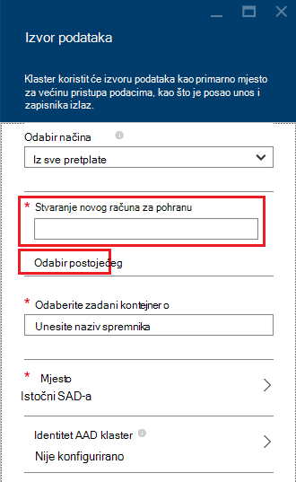

<properties
    pageTitle="Upit podatke iz spremišta blobova kompatibilnom sa sustavom HDFS | Microsoft Azure"
    description="Spremište blobova platforme Azure HDInsight koristi kao spremište velikih skupova podataka za HDFS. Saznajte kako tražiti podatke iz spremišta blobova i spremiti rezultate analize."
    keywords="bloba prostora za pohranu, hdfs, strukturiranih podataka, nestrukturirane podatke"
    services="hdinsight,storage"
    documentationCenter=""
    tags="azure-portal"
    authors="mumian"
    manager="jhubbard"
    editor="cgronlun"/>

<tags
    ms.service="hdinsight"
    ms.workload="big-data"
    ms.tgt_pltfrm="na"
    ms.devlang="na"
    ms.topic="get-started-article"
    ms.date="09/06/2016"
    ms.author="jgao"/>

# Korištenje spremište blobova platforme Azure HDFS kompatibilnog s Hadoop u HDInsight

Saznajte kako koristiti najniža trošak Azure blobova s HDInsight, stvorite račun za Azure prostora za pohranu i spremnik spremište blobova platforme i adresa podataka u.

Azure blobova je rješenje robusne, općenite namjene prostora za pohranu koji se jednostavno integrira s HDInsight. Putem sučelja sustava (HDFS) datoteka raspodijeljeno Hadoop, potpunog skupa komponente HDInsight možete raditi izravno na strukturirane i nestrukturirane podatke u spremište blobova platforme.

Spremanje podataka u spremište blobova platforme omogućuje sigurno brisanje klastere HDInsight koji se koriste za izračunavanje ne izgubite podatke o korisniku.

> [AZURE.IMPORTANT] HDInsight podržava samo bloka blob-ova. Ga ne podržava stranica ili dodati blob-ova.

Informacije o stvaranju programa klaster servisa HDInsight potražite u članku [Početak rada s HDInsight] [ hdinsight-get-started] ili [Stvaranje HDInsight klastere][hdinsight-creation].

## Arhitektura HDInsight prostora za pohranu
Na sljedećem su dijagramu omogućuje Apstraktni prikaz prostora za pohranu arhitektura HDInsight:

![Hadoop klastere pomoću HDFS API-JA za pristup i spremiti strukturirane i nestrukturirane podatke u spremište blobova platforme.] (./media/hdinsight-hadoop-use-blob-storage/HDI.WASB.Arch.png "Prostor za pohranu HDInsight arhitekture")

HDInsight omogućuje pristup raspodijeljeno datotečnom sustavu priložene lokalno čvorove računalnim. Tim datotečnim sustavom se može pristupiti pomoću potpuno kvalificiran URI, na primjer:

    hdfs://<namenodehost>/<path>

Osim toga, HDInsight omogućuje pristup podacima pohranjenima u spremište blobova platforme Azure. Vidjet ćete da sintaksa je:

    wasb[s]://<containername>@<accountname>.blob.core.windows.net/<path>

> [AZURE.NOTE] U verzijama programa HDInsight starija od 3.0, `asv://` koristila umjesto `wasb://`. `asv://`ne treba koristiti s HDInsight klastere 3.0 ili noviji, kao što je on će uzrokovati pogrešku.

Hadoop podržava notion zadani datotečni sustav. Zadani datotečni sustav podrazumijeva zadanu shemu i za izdavanje certifikata. Može se koristiti i da biste riješili relativni putovi. Tijekom procesa stvaranja HDInsight, račun za Azure prostora za pohranu i određene spremište blobova platforme Azure kontejner s tog računa je označen kao zadani datotečni sustav.

Uz ovaj račun za pohranu, možete dodati račune za dodatni prostor za pohranu iz iste pretplate na Azure ili različite Azure pretplate tijekom procesa stvaranja ili nakon stvaranja klaster. Upute o dodavanju računa dodatni prostor za pohranu potražite u člancima [Stvaranje HDInsight klastere][hdinsight-creation].

- **Spremnika u računi za pohranu koji su povezani s klaster:** Budući da naziv računa i ključ pridružen klaster tijekom stvaranja, imali puni pristup blob-ova u tim spremnika.

- **Javno spremnika ili javno blob-ova u računi za pohranu koji su povezani s klaster:** Imate dozvolu blob-ova u spremnike samo za čitanje.

    > [AZURE.NOTE]
        > Javni spremnika omogućuju vam pristup popis svih blob-ova koji su dostupni u njih te se spremnik metapodataka. Javni blob-ova omogućuju pristup s blob-ova samo ako znate točan URL. Dodatne informacije potražite u članku <a href="http://msdn.microsoft.com/library/windowsazure/dd179354.aspx">Ograniči pristup spremnika i blob-ova</a>.

- **Privatne spremnika u računi za pohranu koji su povezani s klaster:** Ne možete pristupiti blob-ova u spremnike osim ako definirate račun za pohranu kada pošaljete WebHCat zadatke. To je objašnjeno u nastavku ovog članka.

Računi za pohranu koji su definirani u postupak stvaranja i ključ spremaju se u %HADOOP_HOME%/conf/core-site.xml na čvorove klaster. Zadano ponašanje HDInsight je pomoću računa za pohranu definirana u datoteci core site.xml. Ne preporučuje se da biste uredili datoteku core site.xml jer node(master) glavni klaster možda reimaged ili migrirati u bilo kojem trenutku i izgubit će se sve promjene te datoteke.

Više WebHCat zadataka, uključujući grozd, MapReduce, Hadoop strujanje i Svinja, mogu prenositi opis račune za pohranu i metapodataka s njima. (To trenutno funkcionira Svinja s računima za pohranu, ali ne i za metapodatke.) U odjeljku [pristup blob-ova pomoću komponente PowerShell Azure](#powershell) ovog članka postoji uzorak ovu značajku. Dodatne informacije potražite u članku [Korištenje programa HDInsight klaster s zamjenski račune za pohranu i Metastores](http://social.technet.microsoft.com/wiki/contents/articles/23256.using-an-hdinsight-cluster-with-alternate-storage-accounts-and-metastores.aspx).

Spremište blobova platforme može se koristiti za strukturirane i nestrukturirane podatke. Blob potpisu pohrane podataka kao parove ključa vrijednosti, a postoji bez hijerarhija direktorija. No znak kosa crta (/) mogu se unutar naziv ključa da bi se prikazala kao da je datoteka pohranjena unutar strukturu direktorija. Na primjer, s blob ključ možda *input/log1.txt*. Nema stvarni *unos* direktorijem, ali zbog prisutnosti znak kose crte u nazivu ključa, ima izgled put datoteke.

###Prednosti spremište blobova platforme
Trošak izričitu performanse ne Suradnja pronalaženja izračunati klastere i resursa za pohranu je mitigated na koji se stvaraju klastere računalnim blizu račun resursa za pohranu unutar Azure područja na mjesto na mreži olakšava vrlo učinkovitog za čvorove računalnim za pristup podacima u spremište blobova platforme Azure.

Postoji nekoliko prednosti pridružene spremanje podataka iz spremišta blobova platforme Azure umjesto HDFS:

* **Ponovnog korištenja podataka i zajedničko korištenje:** Podaci u HDFS nalazi se u računalnim klasterima. Programi koji imaju pristup računalnim klasterima možete koristiti podatke pomoću HDFS API-ji. Podatke u spremište blobova platforme Azure možete pristupiti putem HDFS API-ji ili putem [Blob prostora za pohranu REST API -ji][blob-storage-restAPI]. Dakle, veći skup aplikacije (uključujući druge HDInsight klastere) i alate može koristiti za stvaranje i korištenje podataka.
* **Arhiviranje podataka:** Spremanje podataka u spremište blobova platforme Azure omogućuje klastere HDInsight koji se koristi za izračunavanje sigurno izbrisati bez gubitka podataka korisnika.
* **Trošak prostora za pohranu podataka:** Spremanje podataka u DFS dugo termina je više skup od pohrana podataka u spremište blobova platforme Azure jer je veće od trošak je spremnika spremišta blobova platforme Azure trošak računalnim klasterima. Osim toga, jer se podaci ne mora ponovno učitati za svaku generacije računalni klaster, i spremate podataka učitavanja troškove.
* **Elastic mjerilo odgovaranjem:** Iako HDFS nudi skalirana iz datotečnog sustava, skale određen broj čvorove koje ste stvorili za svoj klaster. Promjena skale može postati složenije postupak od potrebe za oslanjanjem na elastic skaliranje mogućnosti koje se automatski u spremište blobova platforme Azure.
* **Zemlj replikacije:** Potpisu blobova platforme Azure može biti zemlj replicirati. Iako to vam zemljopisno oporavak i redundanciju podataka jer, prebacivanje na mjesto zemlj replicirati uzrokuje utječe na performanse, a zatim ga mogu uzrokovati dodatne troškove. Da bi Naša je preporuka pametan odabir replikacije zemlj i samo ako je vrijednost podataka vrijedi dodatni trošak.

Za određene zadatke MapReduce i paketa mogu stvoriti Srednja rezultate koje zaista želite pohraniti u spremište blobova platforme Azure. U tom slučaju možete odaberite spremanje podataka u lokalnom HDFS. Zapravo, HDInsight koristi DFS nekoliko te Srednja rezultate u grozd zadacima i drugih procesa.

> [AZURE.NOTE] Većina naredbi HDFS (na primjer, <b>ls</b>, <b>copyFromLocal</b> i <b>mkdir</b>) i dalje funkcioniraju. Naredbe koje su specifične za izvorni HDFS implementacije (koji se naziva DFS), kao što su <b>fschk</b> i <b>dfsadmin</b>, prikazat će se različito ponašanje u spremište blobova platforme Azure.

## Stvaranje spremnika blobova platforme

Da biste koristili blob-ova, najprije stvorite [račun za Azure pohranu][azure-storage-create]. Kao dio ovoga, navedite Azure područja koja će sadržavati objekte koji stvarate pomoću ovog računa. Klaster i račun za pohranu mora se nalaziti na istom području. Baze podataka za SQL Server metastore Hive i baze podataka za SQL Server metastore Oozie moraju također nalaziti u istom području.

Gdje se nalazi, svaki blob stvorite pripada kontejnera s vašim računom Azure prostora za pohranu. Ovaj spremnik možda postojeće blob stvorenu izvan HDInsight ili može biti spremniku koji je stvoren za programa klaster HDInsight.

Spremnik Blob zadani pohranjuje klaster specifične podatke kao što su Zapisnici i dosadašnje iskustvo. Ne objavljuj spremniku Blob zadani s više klastere HDInsight. To može oštećena dosadašnje iskustvo pa će misbehave klaster. Preporučuje se da biste koristiti neki drugi kontejner za svaki klaster i pohranili podataka za zajedničko korištenje povezanih pohranu račun naveden u implementaciju sve relevantne klastere umjesto zadanog računa za pohranu. Dodatne informacije o konfiguriranju računi povezani prostora za pohranu potražite u članku [Stvaranje HDInsight klastere][hdinsight-creation]. No pa je možete koristiti zadani prostor za pohranu spremnik nakon brisanja izvorne klaster HDInsight. Za klastere HBase zapravo možete zadržati shemu tablica HBase i podataka tako da stvorite novi HBase klaster pomoću zadane spremnik blob prostora za pohranu koji se koristi u HBase klaster koji je izbrisan.

### Pomoću portala za Azure

Prilikom stvaranja programa HDInsight klaster s portala sustava, imate mogućnosti da biste koristili postojeći račun za pohranu ili stvorite novi prostor za pohranu račun:

###Korištenje Azure EŽA

[AZURE.INCLUDE [use-latest-version](../../includes/hdinsight-use-latest-cli.md)]

Ako ste [instalirali i konfigurirali EŽA Azure](../xplat-cli-install.md), sljedeća naredba mogu se računa za pohranu i spremnik.

    azure storage account create <storageaccountname> --type LRS

> [AZURE.NOTE] Na `--type` parametar pokazuje kako je replicirati na račun za pohranu. Dodatne informacije potražite u članku [Replikacije Azure prostora za pohranu](../storage/storage-redundancy.md). Nemojte koristiti ZRS kao ZRS ne podržava blob stranice, datoteke, tablice ili red.

Zatražit će se da biste odredili koji će se nalaziti na račun za pohranu u regiji. Stvorite račun za pohranu na istom području koje namjeravate o stvaranju svoj klaster HDInsight.

Nakon stvaranja računa za pohranu za dohvaćanje tipki račun za pohranu koristite sljedeću naredbu:

    azure storage account keys list <storageaccountname>

Da biste stvorili spremniku, koristite sljedeću naredbu:

    azure storage container create <containername> --account-name <storageaccountname> --account-key <storageaccountkey>

### Pomoću Azure komponente PowerShell

Ako ste [instalirali i konfigurirali Azure PowerShell][powershell-install], sljedeće iz Azure PowerShell upit možete koristiti za stvaranje računa za pohranu i spremnik:

[AZURE.INCLUDE [upgrade-powershell](../../includes/hdinsight-use-latest-powershell.md)]

    $SubscriptionID = "<Your Azure Subscription ID>"
    $ResourceGroupName = "<New Azure Resource Group Name>"
    $Location = "EAST US 2"
    
    $StorageAccountName = "<New Azure Storage Account Name>"
    $containerName = "<New Azure Blob Container Name>"
    
    Add-AzureRmAccount
    Select-AzureRmSubscription -SubscriptionId $SubscriptionID
    
    # Create resource group
    New-AzureRmResourceGroup -name $ResourceGroupName -Location $Location
    
    # Create default storage account
    New-AzureRmStorageAccount -ResourceGroupName $ResourceGroupName -Name $StorageAccountName -Location $Location -Type Standard_LRS 
    
    # Create default blob containers
    $storageAccountKey = (Get-AzureRmStorageAccountKey -ResourceGroupName $resourceGroupName -StorageAccountName $StorageAccountName)[0].Value
    $destContext = New-AzureStorageContext -StorageAccountName $storageAccountName -StorageAccountKey $storageAccountKey  
    New-AzureStorageContainer -Name $containerName -Context $destContext

## Datoteka u spremište blobova platforme

Shema URI za pristup datotekama u spremište blobova platforme iz servisa HDInsight je:

    wasb[s]://<BlobStorageContainerName>@<StorageAccountName>.blob.core.windows.net/<path>

Sheme URI omogućuje pristup šifrirane (s na *wasb:* prefiks) i SSL šifrirane pristup (s *wasbs*). Preporučujemo korištenje *wasbs* gdje god je to moguće, čak i kad je pristup podacima koji se nalazi unutar iste područja u Azure.

U &lt;BlobStorageContainerName&gt; predstavlja naziv spremnika u spremište blobova platforme Azure.
U &lt;StorageAccountName&gt; označava naziv računa spremišta Azure. Potreban je na potpuno kvalificirani naziv domene (FQDN).

Ako nijedan &lt;BlobStorageContainerName&gt; ni &lt;StorageAccountName&gt; nije naveden, koristi se zadani datotečni sustav. Datoteke na zadani datotečni sustav, poslužite se relativni put ili apsolutni put. Na primjer, *hadoop mapreduce examples.jar* datoteku koja se dobiva sa servisa HDInsight klastere se može uputiti pomoću nešto od sljedećeg:

    wasbs://mycontainer@myaccount.blob.core.windows.net/example/jars/hadoop-mapreduce-examples.jar
    wasbs:///example/jars/hadoop-mapreduce-examples.jar
    /example/jars/hadoop-mapreduce-examples.jar

> [AZURE.NOTE] Naziv datoteke je <i>hadoop examples.jar</i> u klastere verzija 2.1 i 1.6 HDInsight.

Na &lt;put&gt; je naziv datoteke ili direktorija HDFS put. Budući da spremnika u spremište blobova platforme Azure trgovine jednostavno ključa vrijednosti, postoji bez true hijerarhijski datoteka sustava. Znak kosa crta (/) unutar ključa blob tumači se kao razdjelnik direktorija. Na primjer, naziv blob *hadoop mapreduce examples.jar* je:

    example/jars/hadoop-mapreduce-examples.jar

> [AZURE.NOTE] Kada radite s blob-ova izvan HDInsight, većina uslužni programi ne prepoznaje WASB oblik, a umjesto kao što mogu očekivati obliku basic put `example/jars/hadoop-mapreduce-examples.jar`.

## Pristup blob-ova pomoću EŽA Azure

Da biste popis naredbi vezane uz blob, koristite sljedeću naredbu:

    azure storage blob

**Primjer korištenja Azure EŽA da biste prenijeli datoteku**

    azure storage blob upload <sourcefilename> <containername> <blobname> --account-name <storageaccountname> --account-key <storageaccountkey>

**Primjer korištenja Azure EŽA za preuzimanje datoteke**

    azure storage blob download <containername> <blobname> <destinationfilename> --account-name <storageaccountname> --account-key <storageaccountkey>

**Primjer korištenja Azure EŽA da biste izbrisali datoteku**

    azure storage blob delete <containername> <blobname> --account-name <storageaccountname> --account-key <storageaccountkey>

**Primjer korištenja Azure EŽA da biste popis datoteka**

    azure storage blob list <containername> <blobname|prefix> --account-name <storageaccountname> --account-key <storageaccountkey>

## Pristup blob-ova pomoću komponente PowerShell Azure

> [AZURE.NOTE] Naredbe u ovom odjeljku navedite osnovni primjera pomoću komponente PowerShell za pristup podacima koji se pohranjuju u BLOB-ova. Više punu primjer koja je prilagođena za rad s HDInsight, potražite u odjeljku [Alati za HDInsight](https://github.com/Blackmist/hdinsight-tools).

Da biste dobili popis cmdleta vezane uz blob, koristite sljedeću naredbu:

    Get-Command *blob*

![Popis vezane uz blob cmdleta ljuske PowerShell.][img-hdi-powershell-blobcommands]

###Prijenos datoteka

Potražite u članku [prijenos podataka HDInsight][hdinsight-upload-data].

###Preuzimanje datoteka

Sljedeće scrip preuzima blob bloka u trenutnu mapu. Prije pokretanja skriptu promijeniti direktorij u mapu na kojem imate dozvolu za zapisivanje.

    $resourceGroupName = "<AzureResourceGroupName>"
    $storageAccountName = "<AzureStorageAccountName>"   # The storage account used for the default file system specified at creation.
    $containerName = "<BlobStorageContainerName>"  # The default file system container has the same name as the cluster.
    $blob = "example/data/sample.log" # The name of the blob to be downloaded.
    
    # Use Add-AzureAccount if you haven't connected to your Azure subscription
    Login-AzureRmAccount 
    Select-AzureRmSubscription -SubscriptionID "<Your Azure Subscription ID>"
    
    Write-Host "Create a context object ... " -ForegroundColor Green
    $storageAccountKey = (Get-AzureRmStorageAccountKey -ResourceGroupName $resourceGroupName -Name $storageAccountName)[0].Value
    $storageContext = New-AzureStorageContext -StorageAccountName $storageAccountName -StorageAccountKey $storageAccountKey  
    
    Write-Host "Download the blob ..." -ForegroundColor Green
    Get-AzureStorageBlobContent -Container $ContainerName -Blob $blob -Context $storageContext -Force
    
    Write-Host "List the downloaded file ..." -ForegroundColor Green
    cat "./$blob"

Pružanje naziv grupe resursa i klaster, možete koristiti sljedeći kod:

    $resourceGroupName = "<AzureResourceGroupName>"
    $clusterName = "<HDInsightClusterName>"
    $blob = "example/data/sample.log" # The name of the blob to be downloaded.
    
    $cluster = Get-AzureRmHDInsightCluster -ResourceGroupName $resourceGroupName -ClusterName $clusterName
    $defaultStorageAccount = $cluster.DefaultStorageAccount -replace '.blob.core.windows.net'
    $defaultStorageAccountKey = (Get-AzureRmStorageAccountKey -ResourceGroupName $resourceGroupName -Name $defaultStorageAccount)[0].Value
    $defaultStorageContainer = $cluster.DefaultStorageContainer
    $storageContext = New-AzureStorageContext -StorageAccountName $defaultStorageAccount -StorageAccountKey $defaultStorageAccountKey 
    
    Write-Host "Download the blob ..." -ForegroundColor Green
    Get-AzureStorageBlobContent -Container $defaultStorageContainer -Blob $blob -Context $storageContext -Force

###Brisanje datoteka

    Remove-AzureStorageBlob -Container $containerName -Context $storageContext -blob $blob

###Popis datoteka

    Get-AzureStorageBlob -Container $containerName -Context $storageContext -prefix "example/data/"

###Pokretanje grozd upita pomoću računa sustava definirana za pohranu

U ovom se primjeru pokazuje kako sadržaj mape s računa za pohranu koji je definiran tijekom postupka stvaranja.
$clusterName = "<HDInsightClusterName>"

    $undefinedStorageAccount = "<UnboundedStorageAccountUnderTheSameSubscription>"
    $undefinedContainer = "<UnboundedBlobContainerAssociatedWithTheStorageAccount>"

    $undefinedStorageKey = Get-AzureStorageKey $undefinedStorageAccount | %{ $_.Primary }

    Use-AzureRmHDInsightCluster $clusterName

    $defines = @{}
    $defines.Add("fs.azure.account.key.$undefinedStorageAccount.blob.core.windows.net", $undefinedStorageKey)

    Invoke-AzureRmHDInsightHiveJob -Defines $defines -Query "dfs -ls wasbs://$undefinedContainer@$undefinedStorageAccount.blob.core.windows.net/;"

## Daljnji koraci

U ovom se članku ste naučili kako koristiti spremište blobova platforme Azure HDFS kompatibilnog s HDInsight i naučili je spremište blobova platforme Azure komponentu bitno HDInsight. To omogućuje stvaranje rješenja za nabavu prilagodljivi, Dugoročne, arhiviranja podataka s spremište blobova platforme Azure i koristiti HDInsight da biste otključali podataka iz spremljene strukturirane i nestrukturirane podatke.

Dodatne informacije potražite u članku:

* [Početak rada s Azure HDInsight][hdinsight-get-started]
* [Prijenos podataka HDInsight][hdinsight-upload-data]
* [Korištenje grozd s HDInsight][hdinsight-use-hive]
* [Korištenje Svinja s HDInsight][hdinsight-use-pig]
* [Korištenje Azure prostora za pohranu zajednički pristup potpise ograničiti pristup podacima s HDInsight][hdinsight-use-sas]

[hdinsight-use-sas]: hdinsight-storage-sharedaccesssignature-permissions.md
[powershell-install]: ../powershell-install-configure.md
[hdinsight-creation]: hdinsight-provision-clusters.md
[hdinsight-get-started]: hdinsight-hadoop-tutorial-get-started-windows.md
[hdinsight-upload-data]: hdinsight-upload-data.md
[hdinsight-use-hive]: hdinsight-use-hive.md
[hdinsight-use-pig]: hdinsight-use-pig.md

[blob-storage-restAPI]: http://msdn.microsoft.com/library/windowsazure/dd135733.aspx
[azure-storage-create]: ../storage/storage-create-storage-account.md

[img-hdi-powershell-blobcommands]: ./media/hdinsight-hadoop-use-blob-storage/HDI.PowerShell.BlobCommands.png
[img-hdi-quick-create]: ./media/hdinsight-hadoop-use-blob-storage/HDI.QuickCreateCluster.png
[img-hdi-custom-create-storage-account]: ./media/hdinsight-hadoop-use-blob-storage/HDI.CustomCreateStorageAccount.png  
