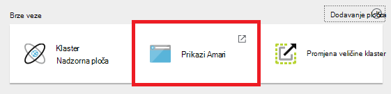
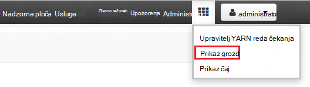
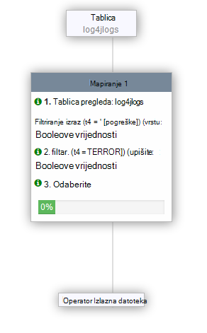

<properties
   pageTitle="Korištenje prikaza Ambari za rad s Hive na HDInsight (Hadoop) | Microsoft Azure"
   description="Saznajte kako koristiti prikaz vrste Hive iz web-preglednika za slanje grozd upita. Prikaz vrste Hive je dio korisničkog Sučelja Web Ambari dao svoj klaster sustavom Linux HDInsight."
   services="hdinsight"
   documentationCenter=""
   authors="Blackmist"
   manager="jhubbard"
   editor="cgronlun"
    tags="azure-portal"/>

<tags
   ms.service="hdinsight"
   ms.devlang="na"
   ms.topic="article"
   ms.tgt_pltfrm="na"
   ms.workload="big-data"
   ms.date="10/28/2016"
   ms.author="larryfr"/>

#Korištenje prikaza grozd s Hadoop u HDInsight

[AZURE.INCLUDE [hive-selector](../../includes/hdinsight-selector-use-hive.md)]

Ambari je upravljanje i nadzor utility dao klastere sustavom Linux HDInsight. Jedna od značajke omogućene putem Ambari jest Web korisničkog Sučelja koje je moguće koristiti za pokretanje grozd upita. Ovo je __Prikaz vrste Hive__, dio prikaza Ambari dao svoj klaster HDInsight.

> [AZURE.NOTE] Ambari ima mnogo mogućnosti koje se neće se spominju u ovom dokumentu. Dodatne informacije potražite u članku [Upravljanje HDInsight klastere pomoću korisničkog Sučelja Web Ambari](hdinsight-hadoop-manage-ambari.md).

##Preduvjeti

- Klaster sustavom Linux HDInsight. Informacije o stvaranju nove klaster potražite u članku [Početak rada sa sustavom Linux HDInsight](hdinsight-hadoop-linux-tutorial-get-started.md).

##Otvorite prikaz grozd

Možete Ambari prikaza na portalu Azure Odaberite svoj klaster HDInsight, a zatim odaberite __Ambari prikazima__ u odjeljku __Brze veze__ .

Možete i izravno prijeći u Ambari tako da odaberete https://CLUSTERNAME.azurehdinsight.net u web-pregledniku (gdje je __CLUSTERNAME__ naziv svoj klaster HDInsight), a zatim niz kvadrata na izborniku stranice (pokraj veza za __administratora__ i gumba na lijevoj strani stranice) na popisu dostupnih prikaza. Odaberite __vrste Hive prikaz__.

.

> [AZURE.NOTE] Prilikom pristupanja Ambari, zatražit će se za provjeru autentičnosti web-mjesta. Unesite administrator (zadani `admin`,) računa ime i lozinku koje se koriste prilikom stvaranja klaster.

Trebali biste vidjeti stranicu koja je slična sljedećoj:

##Prikaz tablice

U odjeljku __Explorer baze podataka__ na stranici odaberite __zadani__ unos na kartici __baze podataka__ . To će prikazati popis tablica u zadanu bazu podataka. Za novi HDInsight klaster, samo jedna tablica trebala bi postojati; __hivesampletable__.

Kako se nove tablice dodaju se kroz korake u ovom dokumentu, možete koristiti ikona osvježavanja u gornjem desnom kutu programa Explorer baze podataka da biste osvježili popis dostupnih tablica.

##Uređivač upita

Da biste pokrenuli upit grozd podataka u sklopu klaster, poduzmite sljedeće korake iz prikaza grozd.

1. U odjeljku __Uređivača upita__ na stranici zalijepite sljedeće naredbe HiveQL u radnom listu:

        DROP TABLE log4jLogs;
        CREATE EXTERNAL TABLE log4jLogs(t1 string, t2 string, t3 string, t4 string, t5 string, t6 string, t7 string)
        ROW FORMAT DELIMITED FIELDS TERMINATED BY ' '
        STORED AS TEXTFILE LOCATION 'wasbs:///example/data/';
        SELECT t4 AS sev, COUNT(*) AS cnt FROM log4jLogs WHERE t4 = '[ERROR]' GROUP BY t4;

    Te naredbe izvoditi sljedeće radnje:

    - **DROP TABLE** – brisanje tablice i podatkovne datoteke u slučaju da već postoji u tablici.
    - **Stvaranje VANJSKE TABLICE** – stvara novu tablicu "vanjski" u grozd. Vanjski tablice pohranjuju samo definiciju tablice u grozd; Podaci ostaje na izvornom mjestu.
    - **OBLIKOVANJE REDAKA** - govori vrste Hive kako će se podaci oblikovani. U ovom slučaju odvojenih zarezom polja u svakom zapisnika.
    - **POHRANJUJU mjesto kao TEXTFILE** - govori vrste Hive gdje se nalazi podatke pohranjene (imenik oglednim podacima), a da je pohranjenih kao tekst.
    - **Odaberite** – odabir ukupan broj sve retke gdje t4 stupac sadrži vrijednost [pogreške].

    >[AZURE.NOTE] Vanjski tablice treba koristiti kada očekujete podatke u podlozi ažurirati iz vanjskog izvora, kao što su prijenos proces automatiziranog podataka ili pak tako da drugi MapReduce postupak, ali uvijek želite grozd upita da biste koristili najnovije podatke. Odbacivanje vanjska tablica ne *ne* Izbriši podatke, samo definiciju tablice.

2. Pomoću gumba __izvršavanje__ pri dnu uređivača upita da biste pokrenuli upit. Ga treba uključivanje narančastu, a tekst će se promijeniti da biste __zaustavili izvršavanje__. __Rezultati upita postupak__ sekcije treba pojaviti ispod uređivača upita i prikazivati informacije o posao.

    > [AZURE.IMPORTANT] Nekim se preglednicima nije ispravno tijeka rada osvježava informacije zapisnika ili rezultata. Ako pokušate pokrenuti posla, a čini se da biste pokrenuli zauvijek bez ažuriranje zapisnik ili daje rezultate, pokušajte umjesto toga koristite Mozilla FireFox ili Google Chrome.

3. Po dovršetku upita u odjeljku __Rezultati upita postupak__ će prikazati rezultate operacije. Gumb __Zaustavi izvođenja__ promijenit će vratiti zeleni gumb __izvrši__ . Kartica __rezultata__ mora sadržavati sljedeće informacije:

        sev       cnt
        [ERROR]   3

    Na kartici __Zapisnici__ može se koristiti za prikaz zapisivanje podataka stvorio posao. To možete koristiti za otklanjanje poteškoća ako postoje problemi s upitom.

    > [AZURE.TIP] Imajte na umu __spremiti rezultate__ padajućeg izbornika dijaloški okvir u gornjem lijevom kutu odjeljka __Rezultata upita postupak__ ; To možete koristiti da biste preuzeli rezultate ili ih spremiti na HDInsight prostora za pohranu u CSV datoteku.

3. Odaberite prva četiri retka ovaj upit, a zatim odaberite __izvrši__. Imajte na umu da nema rezultata nakon dovršetka posla. To je zato pomoću gumba za __izvršavanje__ kada je odabrana dio upit se pokreće samo odabrane naredbe. U ovom slučaju odabira niste uključili konačni naredbi koja se dohvaća redaka iz tablice. Ako odaberete samo tom retku i koristiti __izvrši__, trebali biste vidjeti očekivane rezultate.

3. Pomoću gumba __Novi radni list__ na dnu __Uređivača upita__ da biste stvorili novi radni list. U novom radnom listu, unesite sljedeće naredbe HiveQL:

        CREATE TABLE IF NOT EXISTS errorLogs (t1 string, t2 string, t3 string, t4 string, t5 string, t6 string, t7 string) STORED AS ORC;
        INSERT OVERWRITE TABLE errorLogs SELECT t1, t2, t3, t4, t5, t6, t7 FROM log4jLogs WHERE t4 = '[ERROR]';

    Te naredbe izvoditi sljedeće radnje:

    - **Stvaranje TABLICA ako ne postoji** - stvara tablicu, ako se još ne postoji. Budući da ne koristi **VANJSKI** ključnu riječ, to je interni tablice, koja je pohranjena u skladištu Hive podataka i potpuno upravlja Hive. Za razliku od vanjskih tablice ispuštanje Interna tablica će izbrisati podatke u podlozi kao i.
    - **SPREMLJENI kao ORC** - sprema podatke u obliku Optimizirano retka stupčastu (ORC). Ovo je vrlo optimizirana i učinkovito oblik za spremanje grozd podataka.
    - PREBRIŠI **Umetanje... Odaberite** - odabire redaka iz tablice **log4jLogs** koja sadrži [pogreške], a zatim umeće podatke u tablici **errorLogs** .

    Pomoću gumba za __izvršavanje__ za izvođenje ovog upita. Kartice __rezultata__ ne sadrži podatke o nema redaka koji je vratio upit, no status treba prikazati kao __je uspio__.

###Postavke grozd

Odaberite ikonu __Postavke__ s desne strane uređivaču.

Postavke poslužite da biste promijenili različite postavke grozd, kao što su promjena izvođenja modul za grozd iz Tez (po zadanom,) za MapReduce.

###Visual objašnjavaju

Odaberite ikonu __Vizualne objašnjavaju__ s desne strane uređivaču.

Ovo je prikaz __Vizualne objašnjavaju__ upita, što može biti korisno za razumijevanje tijek složene upite. Pomoću gumba __Objasni__ u uređivaču upita možete pogledati tekstnih ekvivalent ovaj prikaz.

###Tez

Odaberite ikonu __Tez__ s desne strane uređivaču.

Time će se prikazati u usmjereni Acyclic grafikon (DAG) koristi Tez za ovaj upit, ako je dostupna. Ako želite prikazati DAG za upite ste ste pokrenuli koristi prošle i ispravljanje pogrešaka postupka Tez [Prikaz Tez](hdinsight-debug-ambari-tez-view.md) umjesto toga.

###Obavijesti

Odaberite ikonu __obavijesti__ s desne strane uređivaču.

Obavijesti su poruke koje su generirani prilikom pokretanja upita. Na primjer, primit ćete obavijest kada šalje se upit ili kada dođe do pogreške.

##Spremljene upite

1. U uređivaču upita, stvorite novi radni list i unesite sljedeći upit:

        SELECT * from errorLogs;

    Izvršavanje upita da biste provjerili funkcionira li. Rezultati će se na sljedeći način:

        errorlogs.t1    errorlogs.t2    errorlogs.t3    errorlogs.t4    errorlogs.t5    errorlogs.t6    errorlogs.t7
        2012-02-03  18:35:34    SampleClass0    [ERROR]     incorrect   id  
        2012-02-03  18:55:54    SampleClass1    [ERROR]     incorrect   id  
        2012-02-03  19:25:27    SampleClass4    [ERROR]     incorrect   id

2. Pri dnu uređivaču, poslužite se gumbom __Spremi kao__ . U ovom upitu __Errorlogs__ naziv, a zatim odaberite __u redu__. Imajte na umu da se naziv radnog lista se mijenja u __Errorlogs__.

3. Odaberite karticu __Spremljene upite__ pri vrhu stranice vrste Hive prikaz. Imajte na umu da __Errorlogs__ sada prikazuju u obliku spremljenog upita. Na popisu će ostati dok ga ukloniti. Odaberite naziv te će se otvoriti upita u uređivaču upita.

##Povijest upita

Gumb __Povijest__ pri vrhu prikaza vrste Hive omogućuje vam prikaz upita koji ste prethodno pokrenuli. Koristite now i odaberite neki od upita koji ste već pokrenuli. Kad odaberete upita, otvara se u uređivaču upita.

##Korisnički definirane funkcije (UDF)

Grozd mogu se proširiti i putem **korisnički definirane funkcije (UDF)**. Na UDF omogućuje implementirati funkcionalnost ili logiku koja nije katalog jednostavno modeliran u HiveQL.

Možete dodati na UDF kao dio naredbe HiveQL u upitu, karticu UDF pri vrhu prikaza vrste Hive omogućuje deklarirati i spremite skup UDF-ovi koji se može koristiti pomoću __Uređivača upita__.

Kada dodate na UDF prikaz vrste Hive, pri dnu __Uređivača upita__pojavit će se gumb za __Umetanje UDF-ove__ . To odaberete prikazat će se padajući popis korisnički definiranih funkcija definirano u prikazu vrste Hive. Odabir na UDF će dodati HiveQL izjave upit želite li omogućiti na UDF.

Na primjer, ako ste definirali UDF s sljedeća svojstva:

* Naziv resursa: myudfs
* Put resursa: wasbs:///myudfs.jar
* Naziv UDF: myawesomeudf
* Naziv klase UDF: com.myudfs.Awesome

Pomoću gumba __Umetni UDF-ove__ prikazat će se stavka s nazivom __myudfs__, s drugom padajućeg izbornika za svaki UDF definirali za resursa. U ovom slučaju __myawesomeudf__. Odaberite tu stavku, dodat će sljedeće početak upita:

    add jar wasbs:///myudfs.jar;

    create temporary function myawesomeudf as 'com.myudfs.Awesome';

Na UDF možete koristiti u upitu. Na primjer, `SELECT myawesomeudf(name) FROM people;`.

Dodatne informacije o korištenju UDF-ovi s grozd na HDInsight potražite u sljedećim člancima:

* [Pomoću Python grozd i Svinja u HDInsight](hdinsight-python.md)

* [Kako dodati prilagođene vrste Hive UDF HDInsight](http://blogs.msdn.com/b/bigdatasupport/archive/2014/01/14/how-to-add-custom-hive-udfs-to-hdinsight.aspx)

##Daljnji koraci

Općenite informacije o grozd u HDInsight:

* [Korištenje grozd s Hadoop na HDInsight](hdinsight-use-hive.md)

Dodatne informacije o drugim načinima možete raditi s Hadoop na HDInsight:

* [Korištenje Svinja s Hadoop na HDInsight](hdinsight-use-pig.md)

* [Korištenje MapReduce s Hadoop na HDInsight](hdinsight-use-mapreduce.md)
