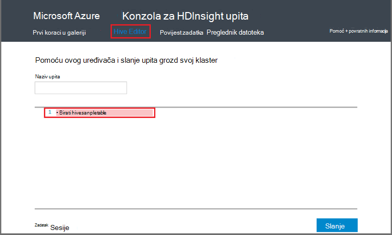

<properties
   pageTitle="Korištenje Hadoop grozd na konzoli za upit u HDInsight | Microsoft Azure"
   description="Saznajte kako koristiti konzole za koji se temelji na web upit pokrenuti grozd upita programa HDInsight Hadoop klaster iz preglednika."
   services="hdinsight"
   documentationCenter=""
   authors="Blackmist"
   manager="jhubbard"
   editor="cgronlun"
    tags="azure-portal"/>

<tags
   ms.service="hdinsight"
   ms.devlang="na"
   ms.topic="article"
   ms.tgt_pltfrm="na"
   ms.workload="big-data"
   ms.date="09/20/2016"
   ms.author="larryfr"/>

# Pokretanje upita grozd korištenju konzole za upit

[AZURE.INCLUDE [hive-selector](../../includes/hdinsight-selector-use-hive.md)]

U ovom se članku će Saznajte kako koristiti konzolu za upit HDInsight pokrenuti grozd upita programa HDInsight Hadoop klaster iz preglednika.

> [AZURE.IMPORTANT] Konzola za upit HDInsight dostupan je samo na klastere HDInsight utemeljen na sustavu Windows. Ako koristite sustavom Linux HDInsight klaster, potražite u članku [pokretanje vrste Hive upita pomoću prikaza vrste Hive](hdinsight-hadoop-use-hive-ambari-view.md).

##Preduvjeti

Da biste dovršili korake u ovom članku, morate sljedeće.

* Utemeljen na sustavu Windows HDInsight Hadoop klaster

* Moderna web-pregledniku

##Pokretanje upita grozd korištenju konzole za upit

1. Otvorite web-preglednik i idite na __https://CLUSTERNAME.azurehdinsight.net__, pri čemu je __CLUSTERNAME__ svoj klaster HDInsight. Ako se to od vas zatraži, unesite korisničko ime i lozinku koje koristite prilikom stvaranja klaster.

2. Veza na vrhu stranice odaberite **Vrste Hive uređivač**. Prikazat će se obrazac koji se mogu koristiti za unos HiveQL izraza koji želite pokrenuti u skupini HDInsight.

    

    Zamjena teksta na `Select * from hivesampletable` pomoću naredbe HiveQL sljedeće:

        set hive.execution.engine=tez;
        DROP TABLE log4jLogs;
        CREATE EXTERNAL TABLE log4jLogs (t1 string, t2 string, t3 string, t4 string, t5 string, t6 string, t7 string)
        ROW FORMAT DELIMITED FIELDS TERMINATED BY ' '
        STORED AS TEXTFILE LOCATION 'wasbs:///example/data/';
        SELECT t4 AS sev, COUNT(*) AS count FROM log4jLogs WHERE t4 = '[ERROR]' AND INPUT__FILE__NAME LIKE '%.log' GROUP BY t4;

    Te naredbe izvoditi sljedeće radnje:

    * **DROP TABLE**: brisanje tablice i podatkovne datoteke ako već postoji u tablici.
    * **Stvaranje VANJSKE TABLICE**: stvara novu tablicu 'vanjskih u grozd. Vanjski tablice pohranjuju samo definiciju tablice u grozd; Podaci ostaje na izvornom mjestu.

    > [AZURE.NOTE] Vanjski tablice treba koristiti kada očekujete podatke u podlozi ažurirati iz vanjskog izvora (kao što su prijenos proces automatiziranog podataka) ili drugim postupkom MapReduce, ali želite uvijek grozd upita da biste koristili najnovije podatke.
    >
    > Odbacivanje vanjska tablica ne **ne** Izbriši podatke, samo definiciju tablice.

    * **OBLIKOVANJE REDAKA**: govori vrste Hive kako će se podaci oblikovani. U ovom slučaju odvojenih zarezom polja u svakom zapisnika.
    * **SPREMLJENI mjesto kao TEXTFILE**: govori vrste Hive gdje se nalazi podatke pohranjene (oglednim podacima imenik) i koji su pohranjeni kao tekst
    * **Odaberite**: Odaberite broj sve retke u kojima je stupac **t4** sadrže vrijednost **[pogreške]**. Budući da postoje tri retke koji sadrže vrijednost to mora vratiti vrijednost **3** .
    * **INPUT__FILE__NAME kao što su "%.log"** - govori vrste Hive koje ćemo samo mora vratiti podatke iz datoteka u. zapisnika. Ovo pretraživanje ograničava sample.log datoteku koja sadrži podatke, a zadržava iz podatkovne datoteke koje odgovaraju shemi definirali vraća podatke iz druge primjera.

2. Kliknite **Pošalji**. **Sesiju posao** pri dnu stranice treba prikazati detalje za posao.

3. Kada se polje **Status** mijenja u **Dovršeno**, odaberite **Prikaz detalja** za posao. Na stranici Detalji o sadrži **Posao izlazna** `[ERROR]   3`. Gumb za **Preuzimanje** možete koristiti u odjeljku ovo polje za preuzimanje datoteke koja sadrži izlaz posla.

##Sažetak

Kao što vidite, konzole za upit omogućuje jednostavnu pokretanje grozd upita u programa HDInsight klaster, praćenje stanja zadatka i dohvaćanje izlaz.

Da biste saznali više o korištenju konzole upit za vrste Hive da biste pokrenuli poslovi grozd, odaberite **Prvi koraci** pri vrhu konzole za upit, a zatim pomoću uzorke koje su unijeli. Svaki uzorak vodi kroz postupak korištenja grozd da biste analizirali podatke, uključujući objašnjenja o HiveQL izraza koji se koriste u uzorku.

##Daljnji koraci

Opće informacije o grozd u HDInsight:

* [Korištenje grozd s Hadoop na HDInsight](hdinsight-use-hive.md)

Informacije o drugim načinima možete raditi s Hadoop na HDInsight:

* [Korištenje Svinja s Hadoop na HDInsight](hdinsight-use-pig.md)

* [Korištenje MapReduce s Hadoop na HDInsight](hdinsight-use-mapreduce.md)

Ako koristite Tez grozd, pogledajte sljedeće dokumente za ispravljanje pogrešaka informacije:

* [Korištenje Tez korisničko Sučelje na HDInsight utemeljen na sustavu Windows](hdinsight-debug-tez-ui.md)

* [Korištenje prikaza Ambari Tez na Linux temelje HDInsight](hdinsight-debug-ambari-tez-view.md)

[1]: ../HDInsight/hdinsight-hadoop-visual-studio-tools-get-started.md

[hdinsight-sdk-documentation]: http://msdnstage.redmond.corp.microsoft.com/library/dn479185.aspx

[azure-purchase-options]: http://azure.microsoft.com/pricing/purchase-options/
[azure-member-offers]: http://azure.microsoft.com/pricing/member-offers/
[azure-free-trial]: http://azure.microsoft.com/pricing/free-trial/

[apache-tez]: http://tez.apache.org
[apache-hive]: http://hive.apache.org/
[apache-log4j]: http://en.wikipedia.org/wiki/Log4j
[hive-on-tez-wiki]: https://cwiki.apache.org/confluence/display/Hive/Hive+on+Tez
[import-to-excel]: http://azure.microsoft.com/documentation/articles/hdinsight-connect-excel-power-query/

[hdinsight-use-oozie]: hdinsight-use-oozie.md
[hdinsight-analyze-flight-data]: hdinsight-analyze-flight-delay-data.md

[hdinsight-storage]: hdinsight-hadoop-use-blob-storage.md

[hdinsight-provision]: hdinsight-provision-clusters.md
[hdinsight-submit-jobs]: hdinsight-submit-hadoop-jobs-programmatically.md
[hdinsight-upload-data]: hdinsight-upload-data.md
[hdinsight-get-started]: hdinsight-hadoop-linux-tutorial-get-started.md

[Powershell-install-configure]: powershell-install-configure.md
[powershell-here-strings]: http://technet.microsoft.com/library/ee692792.aspx

[img-hdi-hive-powershell-output]: ./media/hdinsight-use-hive/HDI.Hive.PowerShell.Output.png
