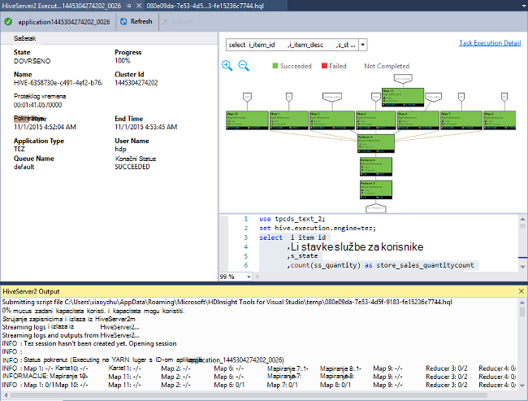
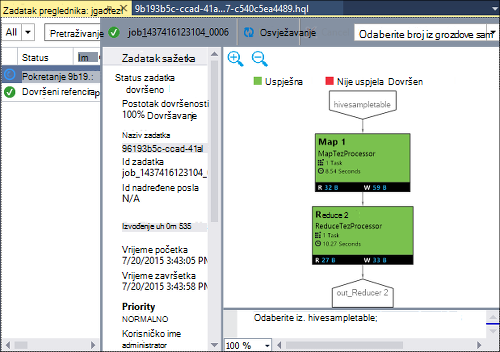

<properties
    pageTitle="Saznajte kako pomoću alata za Visual Studio Hadoop za HDInsight | Microsoft Azure"
    description="Saznajte kako instalirati i koristiti alate za Visual Studio Hadoop za HDInsight za povezivanje s Hadoop klaster i pokretanje upita za grozd."
    keywords="hadoop Alati upita grozd visual studio"
    services="HDInsight"
    documentationCenter=""
    tags="azure-portal"
    authors="mumian"
    manager="jhubbard"
    editor="cgronlun"/>

<tags
    ms.service="hdinsight"
    ms.devlang="na"
    ms.topic="get-started-article"
    ms.tgt_pltfrm="na"
    ms.workload="big-data"
    ms.date="08/10/2016"
    ms.author="jgao"/>

# Prvi koraci pri korištenju alata Visual Studio Hadoop za HDInsight da biste pokrenuli upit grozd

Saznajte kako pomoću alata za HDInsight za Visual Studio za povezivanje s HDInsight klastere i slanje grozd upita. Dodatne informacije o korištenju servisa HDInsight potražite u članku [Uvod u HDInsight] [ hdinsight.introduction] i [Početak rada s HDInsight][hdinsight.get.started]. Dodatne informacije o povezivanju s oluja klaster potražite u članku [razviti C# topologija za Apache oluja na HDInsight pomoću Visual Studio][hdinsight.storm.visual.studio.tools].

**Preduvjeti**

Da biste dovršili ovaj Praktični vodič i pomoću alata za Hadoop u Visual Studio, potrebno je sljedeće:

- Programa Azure HDInsight klaster: ili sustavom Linux ili utemeljen na sustavu Windows klaster funkcioniraju s koracima iz ovog dokumenta. Pročitajte sljedeće informacije o stvaranju klaster:

    - [Početak rada s operacijskim sustavom Linux HDInsight](hdinsight-hadoop-linux-tutorial-get-started.md)
    - [Prvi koraci pri korištenju HDInsight utemeljen na sustavu Windows](hdinsight-hadoop-tutorial-get-started-windows.md)

- Radne stanice uz sljedeći softver:

    - Windows 8.1, Windows 8 ili Windows 7
    - Visual Studio (jedan od sljedećih verzija):
        - Visual Studio 2013 zajednice/Professional/Premium/Ultimate s [obnove 4](https://www.microsoft.com/download/details.aspx?id=44921)
        - Visual Studio 2015 (zajednice na Enterprise)

    >[AZURE.NOTE] Trenutno HDInsight alate za Visual Studio samo isporučuje englesku verziju.

## Instalacija alata za HDInsight za Visual Studio

Alati za HDInsight za Visual Studio i Microsoft vrste Hive ODBC upravljački program su zapakirani s Microsoft Azure SDK za .NET verziju 2.5.1 ili noviji. Možete instalirati pomoću [Installer platformu za Web](http://go.microsoft.com/fwlink/?LinkId=255386). Morate odabrati onu koja odgovara verziji programa Visual Studio. Ako nemate ugrađen Visual Studio, možete instalirati najnoviju Visual Studio zajednice i SDK Azure pomoću [Installer platformu Web](http://go.microsoft.com/fwlink/?LinkId=255386) ili pomoću sljedećih veza:

- [Zajednica korisnika Visual Studio 2015 s SDK Microsoft Azure](https://www.microsoft.com/web/handlers/webpi.ashx/getinstaller/VS2015CommunityAzurePack.appids)
- [Zajednica korisnika Visual Studio 2013 s SDK Microsoft Azure](https://www.microsoft.com/web/handlers/webpi.ashx/getinstaller/VS2013CommunityAzurePack.appids)
- [Microsoft Azure SDK za .NET (Dodavanje veze za VANJSKIH 2015)](https://www.microsoft.com/web/handlers/webpi.ashx/getinstaller/VWDOrVs2015AzurePack.appids)
- [Microsoft Azure SDK za .NET (Dodavanje veze za VANJSKIH 2013)](https://www.microsoft.com/web/handlers/webpi.ashx/getinstaller/VWDOrVs2013AzurePack.appids)

![Alati za Hadoop: HDinsight alate za Visual Studio Web platformu installer.][1]

## Povezivanje s Azure pretplate
HDInsight alata za Visual Studio omogućuje povezivanje vašeg klastere HDInsight izvršiti neke osnovne upravljanje operacije i pokretanje upita grozd.

>[AZURE.NOTE] Informacije o povezivanju generički Hadoop klaster, potražite u članku [pisanje i slanje upita grozd pomoću Visual Studio](http://blogs.msdn.com/b/xiaoyong/archive/2015/05/04/how-to-write-and-submit-hive-queries-using-visual-studio.aspx).

**Da biste se povezali u pretplatu za Azure**

1.  Otvorite Visual Studio.
2.  Na izborniku **Prikaz** kliknite **Server Explorer** da biste otvorili prozor programa Explorer poslužitelja.
3.  Proširite **Azure**, a zatim **HDInsight**.

    >[AZURE.NOTE]Obratite pozornost na **Popis zadataka HDInsight** prozora mora biti otvoren. Ako ga ne vidite, kliknite **Ostale Windows** na izborniku **Prikaz** , a zatim **Prozor Popis zadataka za HDInsight**.  
4.  Unesite vjerodajnice za Azure pretplate, a zatim kliknite **Prijava**. To je samo potreban ako ste nikad ne povezali Azure pretplate s Visual Studio na ove radne stanice.
5.  U programu Explorer poslužitelju, vidjet ćete popis postojeće klastere HDInsight. Ako nemate sve klastere, možete ga Dodjela pomoću portala za Azure, Azure PowerShell ili HDInsight SDK. Dodatne informacije potražite u članku [Dodjeljivanje HDInsight klastere][hdinsight-provision].

    ![Alati za Hadoop: HDInsight alate za Visual Studio poslužitelja Explorer klaster popisa][5]
6.  Proširite programa klaster HDInsight. Vidjet ćete **Vrste Hive baze podataka**, zadani račun za pohranu, računi povezani prostora za pohranu i **Evidencija Hadoop usluge**. Dodatno možete proširiti entiteti.

Kada ste povezani u pretplatu za Azure, ćete moći učinite sljedeće:

**Povezivanje s portala za Azure iz Visual Studio**

- Iz programa Explorer poslužitelja proširite **Azure** > **HDInsight**, desnom tipkom miša kliknite programa HDInsight klaster, a zatim kliknite **Upravljanje klaster Azure portalu**.

**Postavljanje pitanja i povratne informacije iz Visual Studio**

- Na izborniku **Alati** kliknite **HDInsight**i **MSDN Forum** za postavljanje pitanja, ili kliknite **Pošaljite povratne informacije**.

## Pronađite povezani resursi

Iz programa Explorer poslužitelju, vidjet ćete zadani račun za pohranu i svih povezanih prostora za pohranu računa. Ako proširite zadani račun za pohranu, vidjet ćete spremnike na računu za pohranu. Označeni su zadani račun za pohranu i spremnik zadani. Koje možete i desnom tipkom miša kliknite bilo koji od spremnika da biste pogledali sadržaj.

![Alati za HDInsight za Visual Studio poslužitelja explorer klaster popis][2]

Nakon openning spremniku, možete pomoću sljedećih gumba da biste prenijeli, brisanje i preuzmite blob-ova:

## Izvođenje upita grozd
[Vrste Hive Apache] [ apache.hive] je infrastrukture u skladištu podataka utemeljena na Hadoop za dohvat podataka summarization, upita i analize. Alati za HDInsight za Visual Studio podržava izvodi grozd upita iz Visual Studio. Dodatne informacije o grozd potražite u članku [Korištenje vrste Hive s HDInsight][hdinsight.hive].

Nije dosta vremena da biste testirali grozd skripte protiv programa klaster HDInsight. Može potrajati nekoliko minuta ili više njih. Alati za HDInsight za Visual Studio se može lokalno Provjera valjanosti grozd skripte bez povezivanja uživo klaster.

Alati za HDInsight za Visual Studio korisnicima omogućuje da biste vidjeli što je unutar posla grozd prikupljanje i pojavljivanje zapisnike YARN određene vrste Hive zadataka.

### Prikaz **hivesampletable**
Sve HDInsight klastere isporučuje se s ogledne tablice grozd pod nazivom *hivesampletable*. Da biste prikazali popis grozd tablica, prikaz sheme tablice i popis redaka u tablicu vrste Hive ćemo koristiti tu tablicu.

**Da biste dobili popis grozd tablice i prikaz grozd tablice sheme**

1.  Iz programa **Explorer poslužitelja**proširite **Azure** > **HDInsight** > klaster po izboru > **Vrste Hive baza podataka** > **zadani** > **hivesampletable** da biste vidjeli shema tablice.
4.  Desnom tipkom miša kliknite **hivesampletable**, a zatim kliknite **Prikaz redaka s vrha 100** popis retke. Nije jednako pokrenete sljedeći upit grozd pomoću vrste Hive ODBC upravljački program:

        SELECT * FROM hivesampletable LIMIT 100

    Možete prilagoditi i broj redaka.

    ![Alati za Hadoop: HDinsight vrste Hive Visual Studio sheme upita][6]

### Stvaranje tablica grozd

Da biste stvorili tablicu vrste Hive ili koristiti grozd upite možete koristiti u GUI. Informacije o korištenju upita grozd, potražite u članku [pokretanje vrste Hive upita](#run.queries).

**Da biste stvorili tablicu vrste Hive**

1. Iz programa **Explorer poslužitelja**proširite **Azure** > **HDInsight klastere** programa HDInsight klaster > **Vrste Hive baze podataka**, zatim desnom tipkom miša kliknite **zadanu**pa kliknite **Create Table**.
2. Konfiguriranje tablice.
3. Kliknite **Stvaranje tablice** da biste poslali posao da biste stvorili novu tablicu vrste Hive.

    ![Alati za Hadoop: Alati servisa hdinsight programa visual studio stvaranje tablicu vrste hive][7]

### Provjerite valjanost i pokretanje upita grozd
Stvaranje i pokretanje upita grozd na dva načina:

- Stvaranje upita za ad hoc
- Stvaranje aplikacije grozd

**Da biste stvorili, provjerite valjanost i pokretanje upita za ad hoc**

1. Iz programa **Explorer poslužitelja**proširite **Azure**, a zatim **Klastere HDInsight**.
2. Desnom tipkom miša kliknite klaster mjesto na koje želite da biste pokrenuli upit, a zatim kliknite **Pisanje vrste Hive upita**.
3. Unesite grozd upita. Obratite pozornost na uređivač grozd podržava IntelliSense. Alati za HDInsight za Visual Studio podržava učitavanje udaljene metapodataka prilikom uređivanja grozd skriptu. Na primjer, kada upišete "Odaberite * iz", na IntelliSense popisi svi nazivi predloženih tablica. Ako je naveden naziv tablice, tako da na IntelliSense navedene su nazivi stupaca. Alat za podržava gotovo sve vrste Hive DML izjave, podupiti i ugrađene korisnički definiranih funkcija.

    ![Alati za Hadoop: Alati IntelliSense za Visual Studio HDInsight][13]

    ![Alati za Hadoop: Alati IntelliSense za Visual Studio HDInsight][14]

    > [AZURE.NOTE] Će se predlagati samo metapodatke skupina koji je odabran na alatnoj traci HDInsight.
4. (Neobavezno): kliknite **Provjera valjanosti skriptu** da biste provjerili pogreške sintakse skripte.

    ![Alati za Hadoop: hdinsight alate za Visual Studio lokalne provjere valjanosti][10]

4. Kliknite **Pošalji** ili **Slanje (Dodatno)**. Pomoću mogućnosti Napredno Pošalji ćete konfigurirati **Naziv zadatka**, **argumente**, **Dodatna konfiguracija**i **Status direktorija** skripte:

    ![hdinsight hadoop grozd upita][9]

    Kada pošaljete posla, vidjet ćete prozor **Vrste Hive sažetak zadatka** .

    ![Sažetak vrste Hive HDInsight Hadoop upita][8]
5. Pomoću gumba **Osvježi** da biste ažurirali status dok se ne promijeni status zadatka **dovršiti**.
6. Kliknite veze pri dnu da biste vidjeli na sljedeći način: **Posao upita**, **Izlazna posla**, **zapisnika posao**ili **Yarn zapisnika**.

**Stvaranje i pokretanje grozd rješenja**

1. Na izborniku **datoteka** kliknite **Novo**, a zatim **projekta**.
2. U lijevom oknu odaberite **HDInsight** , odaberite **Aplikaciju za vrste Hive** u srednjem oknu, unesite svojstva, a zatim **u redu**.

    ![Alati za Hadoop: hdinsight visual studio tools novi projekt grozd][11]
3. U **Pregledniku rješenja**, dvokliknite **Script.hql** da biste ga otvorili.
4. Da biste provjerili valjanost skripte grozd, kliknite gumb **Provjeri valjanost skripte** ili desnom tipkom miša kliknite skripte u uređivaču grozd, a zatim na kontekstnom izborniku **Skripte za provjeru valjanosti** .

### Prikaz grozd poslova
Možete pogledati posao upita, izlazna posla, posao zapisnika i Yarn zapisnicima grozd poslove. Dodatne informacije potražite u članku prethodne snimku zaslona.

Najnovije izdanje alata omogućuje vam da biste vidjeli što je unutar poslova grozd prikupljanje i pojavljivanje YARN zapisnika. Zapisnik YARN omogućuju istražuje probleme s performansama. Dodatne informacije o načinu na koji HDInsight prikuplja YARN zapisnike, u odjeljku [Pristup HDInsight aplikacije zapisnika programski][hdinsight.access.application.logs].

**Da biste pogledali grozd poslova**

1. Iz programa **Explorer poslužitelja**proširite **Azure**, a zatim **HDInsight**.
2. Desnom tipkom miša kliknite programa HDInsight klaster, a zatim kliknite **Prikaz poslova**. Vidjet ćete popis zadataka grozd pokrenuli na klaster.
3. Kliknite zadatak na popisu zadatak da biste je odabrali, a zatim prozor **Vrste Hive sažetak zadatka** koristite da biste otvorili **Posao upita**, **Izlazna posla**, **Zapisnika posao**ili **Yarn zapisnika**.

    ![Alati za Hadoop: HDInsight Visual Studio Tools prikaz grozd poslova][12]

### Brže put grozd izvođenja putem HiveServer2

>[AZURE.NOTE] Ta značajka funkcionira samo na HDInsight klaster verzije 3.2 i noviji.

HDInsight alata koji se koriste za slanje grozd poslove putem [WebHCat](https://cwiki.apache.org/confluence/display/Hive/WebHCat) (poznat i kao Templeton). Ga traje predugo da biste se vratili zadatak pojedinosti i informacije o pogrešci.
Da biste riješili taj problem s performansama, Alati za HDInsight izvršava grozd poslove izravno u skupini putem HiveServer2, tako da ga zaobilazi RDP/SSH.
Osim bolje performanse, korisnici mogu vidjeti i grozd na Tez grafikonima i detalje o zadatku.

Za HDInsight klaster 3.2 ili novija verzija, vidjet ćete gumb **izvrši putem HiveServer2** :

A možete vidjeti zapisnike strujanjem vratite se u Realno vrijeme i pogledajte grafova posao ako grozd upit se izvršava u Tez.

**Razlika između izvršavanja upita putem HiveServer2 i slanje upita putem WebHCat**

Iako izvršavanja upita putem HiveServer2 ima mnoge prednosti performanse, ima nekoliko ograničenja. Neka od ograničenja nisu prikladna za korištenje proizvodnje. U sljedećoj su tablici prikazane su razlike:

| |Izvođenje putem HiveServer2 |Slanje putem WebHCat|
|---|---|---|
|Izvršavanje upita|Uklanja indirektnog u WebHCat (koji pokreće MapReduce zadatak pod nazivom "TempletonControllerJob").|Pod uvjetom da se upit izvršava putem WebHCat, WebHCat će se pokrenuti MapReduce posla koji predstavlja dodatne Latencija.|
|Ponovno strujanje zapisnika|U blizu u stvarnom vremenu.|Izvršavanje zapisnike posla dostupne su samo kad dovršetka posla.|
|Prikaži Povijest zadatka|Ako se upit izvršava putem HiveServer2, njegova dosadašnje iskustvo (posao zapisnik, izlazna posla) nije sačuvan. Aplikaciju moguće je prikazati u korisničkom Sučelju YARN s ograničeni podaci.|Ako se upit izvršava putem WebHCat, njegova dosadašnje iskustvo (posao zapisnik, izlazna posla) zadržava se i moguće je prikazati pomoću Visual Studio/HDInsight SDK/komponente PowerShell. |
|Zatvaranje prozora|  Izvođenje putem HiveServer2 je "sinkrono" način da windows morate zadržati otvorena; Ako zatvorite prozore zatim izvršavanje upita će se otkazati.|Slanje putem WebHCat je "asinkronog" način da biste mogli slati upita putem WebHCat i zatvorite Visual Studio. Možete vratiti i prikazali rezultate u bilo kojem trenutku.|

### Grafikon performansi posao Tez grozd

Podrška za HDInsight Visual Studio Tools prikazuje grafikoni performansi za zadatke grozd pokrenuli koje modul izvođenja Tez. Upute za omogućivanje Tez, potražite u članku [Korištenje grozd u HDInsight][hdinsight.hive]. Kada pošaljete grozd posla u Visual Studio, Visual Studio prikazuje grafikon nakon dovršetka posla.  Možda ćete morati kliknite gumb **Osvježi** da biste dobili najnovije stanja zadatka.

> [AZURE.NOTE] Ova značajka dostupna je samo za HDInsight klaster verziju iznad 3.2.4.593 i možete samo posla za dovršene poslove (Ako šalje vaš posao putem WebHCat; ovaj grafikon će se prikazati kada izvršavanje upita putem HiveServer2). To funkcionira za oba prozora i Linux temelji klastere.

Da biste bolje razumijevanje grozd upit bolje, alat za dodajte prikazu vrste Hive Operator u ovom izdanju. Samo želite dvaput kliknite vrhovi grafikonu posla, a možete vidjeti sve operatore unutar vrh. Također možete zadržite pokazivač na određeni operator da biste vidjeli dodatne detalje Ovaj operator.

### Zadatak izvođenja prikaza grozd na Tez poslove

Zadatak izvođenja prikaza grozd na Tez poslove koje se može koristiti za dohvaćanje strukturirane i vizualizirati informacije o zadacima grozd i pristup dodatnim informacijama za posao. Kada postoje problemi s performansama, prikaz možete koristiti da biste vidjeli dodatne detalje. Na primjer, kako se svaki zadatak pristajete i detaljne informacije o svakom zadatku (podataka čitanje/pisanje, raspored/početak i završetak itd.), tako da možete ugađanje konfiguracije posao ili arhitektura sustava na temelju visualized informacija.

## Pokretanje Svinja skripti

Alati za HDInsight za Visual Studio podržava stvaranje i slanje Svinja skripti klastere HDInsight. Korisnici mogu stvoriti Svinja projekta iz predloška i slanje skripta za klastere HDInsight.

## Feedbacks & Poznati problemi

- Trenutno HiveServer2 Rezultati prikazuju se u način čisto tekst koji nije idealna. Radimo na rješavanje koji.

- Ako su rezultata rada s vrijednosti NULL, trenutno rezultati nisu prikazani. Ne možemo nepromjenjivim taj problem i ako su blokirane na taj problem, slobodno padajući nam poruku e-pošte ili obratite se timu za podršku.

- Skripta HQL koji je stvorio Visual Studio kodira se ovisno o korisnikovoj lokalne regionalnim postavkama. To nije moguće izvršiti pravilno ako korisnik prenese skripta za skupine kao binarni.

Ako imate prijedloge ili feedbacks ili Ako naiđete na probleme prilikom korištenja tog alata, slobodno ispustite nam poruku e-pošte na hdivstool na microsoft točka com.

## Daljnji koraci
U ovom se članku naučili kako se povezati sa servisa HDInsight klastere iz Visual Studio, pomoću značajke pakiranja Alati Hadoop i pokretanje upita grozd. Dodatne informacije potražite u članku:

- [Korištenje Hadoop grozd u HDInsight][hdinsight.hive]
- [Početak rada s Hadoop u HDInsight][hdinsight.get.started]
- [Slanje Hadoop zadataka u HDInsight][hdinsight.submit.jobs]
- [Analiza podataka Twitter pomoću Hadoop u HDInsight][hdinsight.analyze.twitter.data]

<!--Anchors-->
[Installation]: #installation
[Connect to your Azure subscription]: #connect-to-your-azure-subscription
[Navigate the linked resources]: #navigate-the-linked-resources
[Run Hive queries]: #run-hive-queries
[Next steps]: #next-steps

<!--Image references-->
[1]: ./media/hdinsight-hadoop-visual-studio-tools-get-started/hdinsight.visual.studio.tools.wpi.png
[2]: ./media/hdinsight-hadoop-visual-studio-tools-get-started/hdinsight.visual.studio.tools.linked.resources.png
[5]: ./media/hdinsight-hadoop-visual-studio-tools-get-started/hdinsight.visual.studio.tools.server.explorer.png
[6]: ./media/hdinsight-hadoop-visual-studio-tools-get-started/hdinsight.visual.studio.tools.hive.schema.png
[7]: ./media/hdinsight-hadoop-visual-studio-tools-get-started/hdinsight.visual.studio.tools.create.hive.table.png
[8]: ./media/hdinsight-hadoop-visual-studio-tools-get-started/hdinsight.visual.studio.tools.run.hive.job.summary.png
[9]: ./media/hdinsight-hadoop-visual-studio-tools-get-started/hdinsight.visual.studio.tools.submit.jobs.advanced.png
[10]: ./media/hdinsight-hadoop-visual-studio-tools-get-started/hdinsight.visual.studio.tools.validate.hive.script.png
[11]: ./media/hdinsight-hadoop-visual-studio-tools-get-started/hdinsight.visual.studio.tools.new.hive.project.png
[12]: ./media/hdinsight-hadoop-visual-studio-tools-get-started/hdinsight.visual.studio.tools.view.hive.jobs.png
[13]: ./media/hdinsight-hadoop-visual-studio-tools-get-started/hdinsight.visual.studio.tools.intellisense.table.names.png
[14]: ./media/hdinsight-hadoop-visual-studio-tools-get-started/hdinsight.visual.studio.tools.intellisense.column.names.png

<!--Link references-->
[hdinsight-provision]: hdinsight-provision-clusters.md
[hdinsight.introduction]: hdinsight-hadoop-introduction.md
[hdinsight.get.started]: hdinsight-hadoop-linux-tutorial-get-started.md
[hdinsight.hive]: hdinsight-use-hive.md
[hdinsight.submit.jobs]: hdinsight-submit-hadoop-jobs-programmatically.md
[hdinsight.analyze.twitter.data]: hdinsight-analyze-twitter-data.md
[hdinsight.storm.visual.studio.tools]: hdinsight-storm-develop-csharp-visual-studio-topology.md
[hdinsight.access.application.logs]: hdinsight-hadoop-access-yarn-app-logs.md

[apache.hive]: http://hive.apache.org
