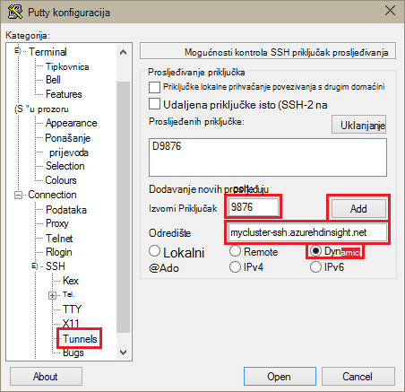
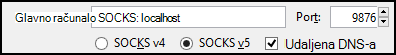
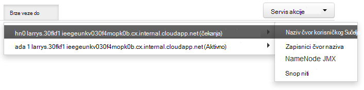

<properties
pageTitle="Koristite SSH tuneliranje da biste pristupili web Ambari korisničkog Sučelja, ResourceManager, JobHistory, NameNode, Oozie i druge weba korisničkog Sučelja"
description="Saznajte kako pomoću programa tunelom SSH sigurno pregledavanje web-resurse hostirane na vaše čvorove sustavom Linux HDInsight."
services="hdinsight"
documentationCenter=""
authors="Blackmist"
manager="jhubbard"
editor="cgronlun"/>

<tags
ms.service="hdinsight"
ms.devlang="na"
ms.topic="article"
ms.tgt_pltfrm="na"
ms.workload="big-data"
ms.date="10/17/2016"
ms.author="larryfr"/>

# Koristite SSH tuneliranje da biste pristupili web Ambari korisničkog Sučelja, JobHistory, NameNode, Oozie i druge weba korisničkog Sučelja

Sustavom Linux HDInsight klastere omogućuju pristup webu Ambari korisničkog Sučelja putem Interneta, ali neke značajke korisničkog sučelja nisu. Na primjer, na webu korisničkog Sučelja za druge servise koji su kada povučete do Ambari. Za punu funkcionalnost telefona Ambari web-mjesta korisničkog Sučelja, morate koristiti programa tunelom SSH u zaglavlje klaster.

## Što potreban je tunelom SSH?

Nekoliko izbornika u Ambari će nije potpuno popuniti bez programa tunelom SSH, kao što su ovise o web-mjesta i servise koji prikazuje drugim Hadoop servise klaster. Često tih web-mjesta su nesigurnog, tako da nije sigurno izravno izlažu na Internetu. Ponekad servis pokreće na web-mjestu na drugi čvor klaster kao što su Zookeeper čvor.

Slijede servise koji koristi Ambari web korisničko Sučelje, koje nije moguće pristupiti bez programa tunelom SSH:

* JobHistory,
* NameNode,
* Snop niti
* Oozie web korisničkog Sučelja
* Matrica HBase i zapisnike korisničkog Sučelja

Ako koristite akcije skriptu da biste prilagodili svoj klaster, usluge ni uslužnim programima koje se instaliraju Izloži korisničko Sučelje web-mjesto potrebno je tunelom SSH. Ako, na primjer, ako instalirate nijanse pomoću skripte Akcije, morate koristiti programa tunelom SSH pristup webu nijanse korisničkog Sučelja.

## Što je programa tunelom SSH?

[Sigurne ljuske (SSH) tuneliranje](https://en.wikipedia.org/wiki/Tunneling_protocol#Secure_Shell_tunneling) usmjerava promet poslana s priključkom na vaše lokalne radne stanice, putem SSH veze na svoje HDInsight klaster glavni čvor, gdje zahtjev zatim riješen kao da je potječe na glavni čvor. Odgovor pa usmjerena unatrag kroz tunelom za vaše radne stanice.

## Preduvjeti

Prilikom korištenja programa tunelom SSH za promet web, morate imati sljedeće:

* Klijent za SSH. Distribucija Linux i Unix ili Macintosh OS X na `ssh` naredba navedeni su s operacijskim sustavom. Za Windows, preporučujemo da [PuTTY](http://www.chiark.greenend.org.uk/~sgtatham/putty/download.html)

    > [AZURE.NOTE] Ako želite koristiti klijent za SSH osim `ssh` ili PuTTY, potražite u dokumentaciji za vaš klijent za uspostavljanje programa tunelom SSH.

* Web-pregledniku koji mogu konfigurirati da biste koristili SOCKS proxy

## Stvaranje tunelom pomoću naredbe za SSH

Koristite sljedeću naredbu da biste stvorili programa SSH Tunel pomoću na `ssh` naredbe. Zamjena __korisničko ime__ s korisnikom SSH za svoj klaster HDInsight i zamijeni __CLUSTERNAME__ pod nazivom svoj klaster HDInsight

    ssh -C2qTnNf -D 9876 USERNAME@CLUSTERNAME-ssh.azurehdinsight.net

Time ste stvorili veze koja usmjerava promet na lokalni priključak 9876 klaster putem SSH. Su sljedeće mogućnosti:

* **D 9876** - lokalnog priključka koji će usmjeravanje prometa u tunelom.

* **C** - komprimirati sve podatke, budući da je promet web uglavnom tekst.

* **2** – prisilno SSH pokušati protokol verzija 2 samo.

* **pitanja** - Tihi način rada.

* **T** - Onemogući pomoćni tty dodijeljeni, jer smo prosljeđujete samo priključak.

* **n** - sprječavanje čitanja STDIN, jer smo prosljeđujete samo priključak.

* **N** - izvršavanje udaljene naredbe, jer smo prosljeđujete samo priključak.

* **f** - izvoditi u pozadini.

Ako ste konfigurirali klaster pomoću ključa SSH, morat ćete koristi u `-i` parametar i navedite put do privatni ključ SSH.

Nakon naredba završi, promet poslana s priključkom 9876 na lokalnom računalu će biti proslijeđene putem Secure Sockets Layer (SSL) da biste klaster glavni čvor i čini se da postoji potiče.

## Stvaranje tunelom pomoću PuTTY

Poduzmite sljedeće korake da biste stvorili programa tunelom SSH pomoću PuTTY.

1. Otvorite PuTTY pa unesite podatke za povezivanje. Ako niste upoznati s PuTTY, potražite u članku [Korištenje SSH sa sustavom Linux Hadoop na HDInsight iz sustava Windows](hdinsight-hadoop-linux-use-ssh-windows.md) da biste saznali kako ga koristiti uz HDInsight.

2. U odjeljku **kategorija** na lijevoj strani dijaloškog okvira proširivanje **veza**, proširite **SSH**, a zatim odaberite **Tunnels**.

3. Na obrascu **Mogućnosti kontroliranje prosljeđivanje priključka SSH** navedite sljedeće podatke:

    * **Izvorni Priključak** - priključak na klijentskom računalu koju želite proslijediti. Na primjer, **9876**.

    * **Odredište** - u SSH adrese za klaster sustavom Linux HDInsight. Na primjer, **mycluster ssh.azurehdinsight.net**.

    * **Dinamični** - omogućuje dinamički SOCKS proxy usmjeravanja.

    

4. Kliknite **Dodaj** da biste dodali postavke, a zatim kliknite **Otvori** da biste otvorili vezu s SSH.

5. Kada se to od vas zatraži, prijavite se na poslužitelj. To će uspostaviti sesiju SSH i omogućite na tunelom.

## Korištenje tunelom iz preglednika

> [AZURE.NOTE] Koraci u ovom odjeljku pomoću preglednika FireFox, kao što je besplatno sustavima Linux, Unix, Macintosh OS X i Windows. Ostale Moderna preglednici s podrškom za korištenje SOCKS proxy funkcioniraju kao i.

1. Konfiguriranje web-pregledniku da biste upotrijebili **localhost:9876** **SOCKS v5** proxy poslužitelj. Evo što postavke Firefox izgledati. Ako ste koristili drugi priključak od 9876, promijenili priključak onome koji ste koristili:

    

    > [AZURE.NOTE] Odabir **Udaljene DNS** će riješiti zahtjeva za upravljanje pravima na informacije (DNS-Domain Name System) pomoću klaster HDInsight. Ako nije odabrana, DNS će se lokalno razriješiti.

2. Provjerite da promet usmjeruje kroz na tunelom po vising web-mjestu kao što su [http://www.whatismyip.com/](http://www.whatismyip.com/) za postavke proxyja omogućuje i onemogućuje u pregledniku Firefox. Dok su postavke omogućena, IP adresa će se na računalu u podatkovnim centrom za Microsoft Azure.

##Provjerite je li s weba Ambari korisničkog Sučelja

Kada je uspostavljena klaster, poduzmite sljedeće korake da biste provjerili mogu pristupiti web servisa UIs s Ambari web-mjesta:

1. U pregledniku idite na http://headnodehost:8080. Na `headnodehost` adresu će se slati putem na tunelom klaster i riješili headnode Ambari na kojoj se izvršava. Kada se to od vas zatraži, unesite korisničko ime za administratore (administratora) i lozinku za svoj klaster. Možda ćete morati unijeti drugi put tako da na webu Ambari korisničkog Sučelja. Ako je tako, ponovno unesite podatke.
    
    > [AZURE.NOTE] Kada koristite adresu http://headnodehost:8080 povezati klaster, povezujete izravno putem tunelom glavni čvor koji Ambari radi putem HTTP i komunikacije zaštićen je tunelom SSH. Prilikom povezivanja putem interneta bez upotrebe programa tunelom, komunikacije zaštićen je HTTPS. Da biste povezali putem interneta pomoću HTTPS, koristite https://CLUSTERNAME.azurehdinsight.net, pri čemu je __CLUSTERNAME__ klaster.

2. Korisničko Sučelje Web Ambari, odaberite HDFS s popisa na lijevoj strani stranice.

    

3. Kada se prikaže podatke o usluzi HDFS, odaberite __Brze veze__. Pojavit će se popis čvorove glavni klaster. Odaberite jednu od čvorove glavni, a zatim odaberite __NameNode korisničkog Sučelja__.

    

    > [AZURE.NOTE] Ako imate sporu vezu s Internetom ili čvor glavni zauzet vrlo, možda ćete dobiti pokazatelj čekanja umjesto izbornika kada odaberete __Brze veze__. Ako je tako, pričekajte nekoliko minuta ili dvije za podatke koji se dobiva s poslužitelja, a zatim ponovno pokušajte na popisu.
    >
    > Ako imate nižu razlučivost monitora ili nije maksimiziran prozor preglednika, neke stavke na izborniku __Brze veze__ možda biti odrezan po desnoj strani zaslona. Ako je tako, proširite izbornik pomoću miša, a zatim pomoću tipke strelica desno da biste se pomicali zaslon udesno da biste vidjeli ostale izbornika.

4. Trebao izgledati stranicu koja je slična sljedećoj:

    

    > [AZURE.NOTE] Obratite pozornost na URL-ova stranica mora biti sličan __http://hn1-CLUSTERNAME.randomcharacters.cx.internal.cloudapp.net:8088/klaster__. Koristi se interna potpuno kvalificirani naziv domene (FQDN) čvora i nije moguće pristupiti bez upotrebe programa tunelom SSH.

## Daljnji koraci

Sad kad ste naučili kako stvoriti i pomoću programa tunelom SSH, pogledajte sljedeće informacije na nadzor i upravljanje njima svoj klaster pomoću Ambari:

* [Upravljanje klastere HDInsight pomoću Ambari](hdinsight-hadoop-manage-ambari.md)

Dodatne informacije o korištenju SSH sa servisa HDInsight potražite u sljedećim člancima:

* [Korištenje SSH sa sustavom Linux Hadoop na HDInsight Linux, Unix ili OS X](hdinsight-hadoop-linux-use-ssh-unix.md)

* [Korištenje SSH sa sustavom Linux Hadoop na HDInsight iz sustava Windows](hdinsight-hadoop-linux-use-ssh-windows.md)
