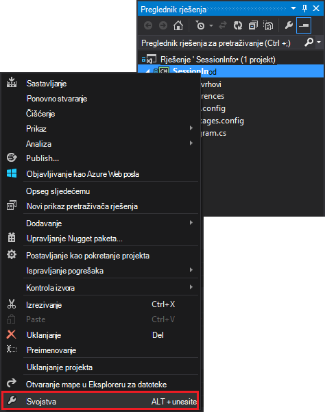
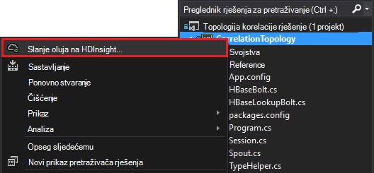

<properties
 pageTitle="Povezivanje događaji tijekom vremena s oluja i HBase na HDInsight"
 description="Saznajte kako povezivanje događaja koji dolaze različite vremenske pomoću oluja i HBase na HDInsight."
 services="hdinsight"
 documentationCenter=""
 authors="Blackmist"
 manager="jhubbard"
 editor="cgronlun"
 tags="azure-portal"/>

<tags
 ms.service="hdinsight"
 ms.devlang="dotnet"
 ms.topic="article"
 ms.tgt_pltfrm="na"
 ms.workload="big-data"
 ms.date="10/27/2016"
 ms.author="larryfr"/>

# Povezivanje događaji tijekom vremena s oluja i HBase na HDInsight

Pomoću spremišta stalni podataka Apache oluja možete povezivanje unose podatke koji dolaze različite vremenske. Na primjer, povezivanje prijava i odjavite događaje za sesiju korisnika da biste izračunali koliko lasted sesiju.

U ovom dokumentu će Saznajte kako stvoriti osnovni topologije C# oluja koji prati prijava i odjavite događaje za korisničke sesije i izračunava trajanje sesije. Topologije koristi HBase kao spremište stalni podataka. HBase omogućuje izvođenje obrade upita na povijesnim podacima čime se dobiva dodatne uvide, kao što su koliko sesija rada ili je završen tijekom određenog vremenskog razdoblja.

## Preduvjeti

- Visual Studio i Alati za HDInsight za Visual Studio: informacije potražite u odjeljku [Prvi koraci pri korištenju alata za HDInsight za Visual Studio](../HDInsight/hdinsight-hadoop-visual-studio-tools-get-started.md) instalacije.

- Apache oluja na HDInsight skupine (utemeljen na sustavu Windows). To će pokrenuti topologije oluja koji obrađuje dolazne podatke i pohranjuje HBase.

    > [AZURE.IMPORTANT] Dok SCP.NET topologija podržani su na klastere sustavom Linux oluja stvorene nakon 28/10/2016, SDK HBase paketa .NET dostupna od 28/10/2016 neće pravilno funkcionirati na Linux.

- Apache HBase na HDInsight klaster (Linux ili utemeljen na sustavu Windows). Ovo je spremište podataka u ovom primjeru.

## Arhitektura

Correlating događaje zahtijeva zajednički identifikator za izvor događaja. For example, korisnički ID, ID sesije ili neku drugu informaciju podatke koji su u) jedinstven i b) uvršteno na sve podataka koji se šalju oluja. U ovom se primjeru koristi vrijednost GUID za predstavljanje ID sesije.

U ovom se primjeru sastoji se od dva klastere HDInsight:

-   HBase: spremište stalni podataka prošli podataka

-   Oluja: služi za ingest ulazne podatke

Podaci slučajno generira topologije oluja i sastoji se od sljedećih stavki:

-   ID sesije: GUID koji služi kao jedinstvena identifikacija svaku sesiju

-   Događaj: u POČETKA ili ZAVRŠETKA događaj. U ovom primjeru START uvijek pojavljuje prije ZAVRŠETKA

-   Vrijeme: vrijeme događaja.

U ovom se obrađuju i spremanje podataka u HBase.

### Topologija oluja

Prilikom pokretanja sesije u događaj **pokretanje** je primio topologije i prijavljen HBase. Primljena događaja **ZAVRŠI** , topologije dohvaća događaja **pokretanje** i izračunava vremena između dva događaja. Ta vrijednost **trajanje** pohranjuje HBase uz podatke za događaj **ZAVRŠETKA** .

> [AZURE.IMPORTANT] Dok je ovaj topologije pokazuje temeljni obrazac, rješenje radnog potrebni dizajna za sljedeće scenarije:
>
> - Događaji stiže iz narudžbe
> - Dupliciranje događaja
> - Izostavljanje događaja

Topologija uzorka sastoji se od sljedeće komponente:

-   Session.CS: simulira sesije korisnika tako da stvorite ID slučajni sesije, start vrijeme i koliko će zadnji sesiju

-   Spout.CS: stvara 100 sesije, emits POČETNI događaj, čeka slučajni vremenskog ograničenja za svaku sesiju i emits događaja ZAVRŠI. Zatim recycles je završen sesije da biste generirali nove.

-   HBaseLookupBolt.cs: koristi ID sesije da biste potražili sesije informacije iz HBase. Kada događaja ZAVRŠETKA obrađuje, pronalazi odgovarajuće POČETNI događaj i izračunava trajanje sesiju.

-   HBaseBolt.cs: Pohranjuje informacije u HBase.

-   TypeHelper.cs: Da biste pretvorbi vrsta kada iz za čitanje / pisanje HBase.

### HBase sheme

U HBase, pohrane podataka u tablici s sljedeće sheme/postavke:

-   Redak ključ: sesiju ID se koristi kao ključ za retke u tablici

-   Stupac obitelji: naziv obitelji je "CW". Stupci koji se pohranjuju u ovom obitelji su:

    -   događaj: POČETKA ili ZAVRŠETKA

    -   vrijeme: vrijeme u milisekundama nastalih događaja

    -   Trajanje: duljinu između POČETKA i ZAVRŠETKA događaja

-   VERZIJA: "CW" Obitelj postavljen da biste zadržali 5 verzije svakog retka

    > [AZURE.NOTE] Verzije su zapisnik prethodne vrijednosti pohranjene za određeni redak ključ. Prema zadanim postavkama HBase samo vraća vrijednost za najnoviju verziju retka. U ovom slučaju isti redak koristi se za sve događaje (početak, KRAJNJI.) u svakoj verziji retka određuje vrijednost vremenske oznake. To nudi povijesne prikaz događaja traje određene ID-a.

## Preuzimanje projekta

Ogledna projekta mogu se preuzeti sa [https://github.com/Azure-Samples/hdinsight-storm-dotnet-event-correlation](https://github.com/Azure-Samples/hdinsight-storm-dotnet-event-correlation).

Preuzimanje sadrži sljedeće C# projekata:

-   CorrelationTopology: C# oluja topologije koji slučajno emits događaje početka i završetka za korisničke sesije. Svaku sesiju traje između 1 i 5 minuta.

-   SessionInfo: C# konzole za aplikaciju koja stvara tablicu HBase problema te nude primjer upita da biste se vratili informacije o podacima spremljene sesiju.

## Stvaranje tablice

1. Otvaranje projekta **SessionInfo** u Visual Studio.

2. U **Pregledniku rješenja**, desnom tipkom miša kliknite **SessionInfo** projekta, a zatim odaberite **Svojstva**.

    

3. Odaberite **Postavke**, a zatim postavite sljedeće vrijednosti:

    -   HBaseClusterURL: URL-a za svoj klaster HBase. Na primjer, https://myhbasecluster.azurehdinsight.net

    -   HBaseClusterUserName: administrator/HTTP korisnički račun za svoj klaster

    -   HBaseClusterPassword: lozinke za administratore/HTTP korisnički račun

    -   HBaseTableName: naziv tablice će se koristiti za ovaj primjer

    -   HBaseTableColumnFamily: Obitelj naziv stupca

    

5. Pokrenite rješenja. Kada se to od vas zatraži, odaberite tipku "c" da biste stvorili tablicu na svoj klaster HBase.

## Stvorite i implementirajte topologije oluja

1.  Otvorite rješenje **CorrelationTopology** u Visual Studio.

2.  U **Pregledniku rješenja**, desnom tipkom miša kliknite projekt **CorrelationTopology** , a zatim odaberite Svojstva.

3.  U prozoru svojstva odaberite **Postavke** , a zatim navedite sljedeće podatke. Prvi 5 mora biti iste vrijednosti koristi **SessionInfo** projekta:

    -   HBaseClusterURL: URL-a za svoj klaster HBase. Na primjer, https://myhbasecluster.azurehdinsight.net

    -   HBaseClusterUserName: administrator/HTTP korisnički račun za svoj klaster

    -   HBaseClusterPassword: lozinke za administratore/HTTP korisnički račun

    -   HBaseTableName: naziv tablice za uporabu u ovom primjeru. To mora sadržavati isti naziv tablice u kojoj se koristi u programu project SessionInfo

    -   HBaseTableColumnFamily: Obitelj naziv stupca. To mora sadržavati isti naziv stupca obitelji u kojoj se koristi u programu project SessionInfo

    > [AZURE.IMPORTANT] Promijenite HBaseTableColumnNames, kao što je zadane su nazivi koji se koriste **SessionInfo** za dohvaćanje podataka.

4.  Spremanje svojstva, a zatim Stvaranje projekta.

5.  U **Pregledniku rješenja**, desnom tipkom miša kliknite projekt, a zatim odaberite **Pošalji da biste oluja na HDInsight**. Ako se to od vas zatraži, unesite vjerodajnice za pretplatu Azure.

    

6.  U dijaloškom okviru **Slanje topologije** odaberite klaster oluja koji će se izvoditi ovu topologije.

    > [AZURE.NOTE] Kada prvi put pošaljete topologije, može proći nekoliko sekundi prije nego što dohvatiti naziv vaše klastere HDInsight.

7.  Kada u topologija prenijeli te je poslao klaster, **Prikaz topologije oluja** će otvorili i prikazali izvodi topologije. Odaberite **CorrelationTopology** i poslužite se gumbom Osvježi u gornjem desnom kutu stranice da biste osvježili podatke topologije.

    

    Kada topologije započne generiranje podataka, vrijednost u stupcu **Emitted** će povećali.

    > [AZURE.NOTE] Ako **Prikaz topologije oluja** automatski otvori, poduzmite sljedeće korake da biste ga otvorili:
    >
    > 1. U **Pregledniku rješenja**proširite **Azure**, a zatim **HDInsight**.
    >
    > 2. Desnom tipkom miša kliknite klaster oluja topologije na kojoj se izvršava, a zatim odaberite **Prikaz oluja topologija**

## Upit s podacima

Kada je omogućeno čuje podataka, poduzmite sljedeće korake za postavljanje upita za podatke.

1. Vratite se u **SessionInfo** projekta. Ako nije pokrenut, pokrenite novu instancu.

2. Kada se to od vas zatraži, odaberite **s** da biste potražili POČETNI događaj. Koje će se zatražiti da unesete vrijeme početka i završetka za definiranje vremenski raspon – samo događaje između tih dvaju vremena će vratiti.

    Koristite sljedeći oblik pri unosu vremena početka i završetka: hh i "am" ili "pm". Na primjer, 11 20 poslijepodne.

    Budući da topologije samo pokrene, koristite vremena početka prije nego što je uveden i vrijeme završetka od sada. To treba snimite Većina POČETKA događaja koji se pojavile su se kada se pokrene. Pri pokretanju upita, trebali biste vidjeti popis stavki sličnu ovoj:

        Session e6992b3e-79be-4991-afcf-5cb47dd1c81c started at 6/5/2015 6:10:15 PM. Timestamp = 1433527820737

Traženje ZAVRŠETKA događaja radi na isti način kao POČETKA događaja. Međutim, događaji ZAVRŠETKA generiraju slučajno između 1 i 5 minuta nakon POČETKA događaja. Stoga možda ćete morati pokušajte nekoliko vremenski raspon da biste pronašli ZAVRŠETKA događaja. Kraj događaje će sadržavati trajanje sesije - razlika između vrijeme POČETKA događaja i vrijeme ZAVRŠETKA događaja. Evo primjera podataka za kraj događaja:

    Session fc9fa8e6-6892-4073-93b3-a587040d892e lasted 2 minutes, and ended at 6/5/2015 6:12:15 PM

> [AZURE.NOTE] Dok su vremenske vrijednosti koje unesete u lokalno vrijeme, vrijeme koji je vratio upit će biti UTC-a.

##Zaustavljanje topologije

Kada ste spremni da biste prestali topologije, vratite se na **CorrelationTopology** projekta u Visual Studio. U **Prikazu topologije oluja**odaberite topologije, a zatim pri vrhu prikaza topologije poslužite se gumbom **Ukloni** .

##Brisanje svoj klaster

[AZURE.INCLUDE [delete-cluster-warning](../../includes/hdinsight-delete-cluster-warning.md)]

##Daljnji koraci

Još primjera oluja potražite u članku [primjer topologija za oluja na HDInsight](hdinsight-storm-example-topology.md).
 
