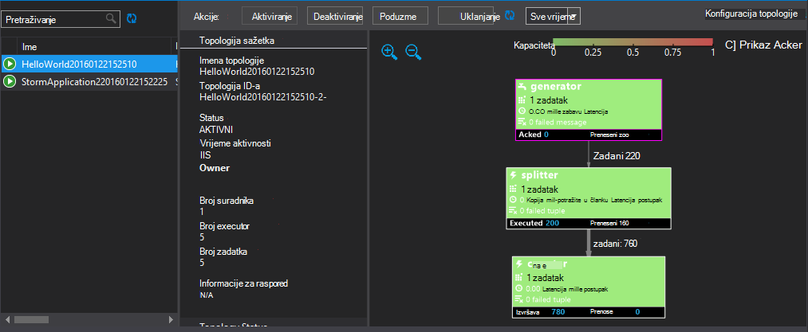

<properties
   pageTitle="Upravljanje Apache oluja topologija na HDInsight i | Microsoft Azure"
   description="Saznajte kako implementirati, praćenje i upravljanje Apache oluja topologija pomoću oluja nadzorne ploče na HDInsight. Pomoću alata za Hadoop za Visual Studio."
   services="hdinsight"
   documentationCenter=""
   authors="Blackmist"
   manager="jhubbard"
   editor="cgronlun"
    tags="azure-portal"/>

<tags
   ms.service="hdinsight"
   ms.devlang="java"
   ms.topic="article"
   ms.tgt_pltfrm="na"
   ms.workload="big-data"
   ms.date="10/11/2016"
   ms.author="larryfr"/>

#Uvođenje i upravljanje Apache oluja topologija na HDInsight utemeljen na sustavu Windows

Na nadzornoj ploči oluja omogućuje jednostavno implementacije i pokrenite Apache oluja topologija za svoj klaster HDInsight pomoću web-preglednika. Na nadzornoj ploči možete koristiti i za nadzor i upravljanje izvodi topologija. Ako koristite Visual Studio, HDInsight alate za Visual Studio sadrže slične se značajke u Visual Studio.

Na nadzornoj ploči oluja i značajke oluja u alatima za HDInsight oslanjate oluja REST API-JA, koji se može koristiti za stvaranje vlastitog nadzor i upravljanje rješenja.

> [AZURE.IMPORTANT] Koraci u ovom dokumentu potreban je utemeljen na sustavu Windows oluja na klasteru HDInsight. Informacije o korištenju klaster sa sustavom Linux potražite u članku [uvođenje i upravljanje Apache oluja topologija na sustavom Linux HDInsight](hdinsight-storm-deploy-monitor-topology-linux.md)

##Preduvjeti

* **Apache oluja na HDInsight** – pogledajte <a href="../hdinsight-storm-getting-started/" target="_blank">Početak rada s Apache oluja na HDInsight</a> upute o stvaranju klaster

* Za **Nadzornu ploču oluja**: Moderna web-pregledniku koji podržava HTML5

* Za **Visual Studio** - Azure SDK 2.5.1 ili novija verzija i HDInsight alate za Visual Studio. Pročitajte članak <a href="../hdinsight-hadoop-visual-studio-tools-get-started/" target="_blank">Prvi koraci pri korištenju HDInsight alate za Visual Studio</a> instaliranja i konfiguriranja HDInsight alate za Visual Studio.

    Jedan od sljedećih verzija programa Visual Studio:

    * Visual Studio 2012 s <a href="http://www.microsoft.com/download/details.aspx?id=39305" target="_blank">obnove 4</a>

    * Visual Studio 2013 <a href="http://www.microsoft.com/download/details.aspx?id=44921" target="_blank">ažuriranje 4</a> ili <a href="http://go.microsoft.com/fwlink/?LinkId=517284" target="_blank">Visual Studio 2013 zajednice</a>

    * <a href="http://visualstudio.com/downloads/visual-studio-2015-ctp-vs" target="_blank">CTP6 2015 za Visual Studio</a>

    > [AZURE.NOTE] Alati za HDInsight za Visual Studio samo podržavamo oluja HDInsight klaster verzije 3,2.

##Oluja nadzorne ploče

Nadzorna ploča za oluja je na web-stranicu na svoj klaster oluja. URL je **https://&lt;clustername >.azurehdinsight.net/**, pri čemu je **clustername** vaše oluja na klasteru HDInsight.

Na vrhu nadzorne ploče oluja odaberite **Pošalji topologije**. Slijedite upute na stranici da biste pokrenuli topologiju uzorak ili da biste prenijeli i pokrenite topologije koju ste stvorili.

![na stranicu topologije Pošalji][storm-dashboard-submit]

###Oluja korisničkog Sučelja

Na nadzornoj ploči oluja odaberite vezu **Oluja korisničkog Sučelja** . Time će se prikazati informacije o klaster, uz sve pokrenute topologija.

![korisničko sučelje oluja][storm-dashboard-ui]

> [AZURE.NOTE] S nekim verzijama preglednika Internet Explorer možda otkrijete da korisničkog Sučelja oluja osvježavanje kada je najprije ste posjetili. Na primjer, je možda neće prikazati novi topologija koje ste poslali ili topologije kao aktivnu se pojavljuje kada ste prethodno deaktivirali. Microsoft zna taj problem i radi na rješenje.

####Glavne stranice

Glavne stranice korisničkog sučelja oluja nalaze se sljedeće informacije:

* **Klaster sažetak**: osnovne informacije o klaster oluja.

* **Topologija sažetak**: popis izvodi topologija. Da biste pogledali dodatne informacije o određenim topologija pomoću veze u ovoj sekciji.

* **Nadzornik sažetak**: informacije o nadzornik oluja.

* **Konfiguriranje nimbus**: Nimbus konfiguracije za klaster.

####Topologija sažetka

Odabir veze u odjeljku **Topologija sažetka** prikazuje sljedeće informacije o topologiji:

* **Topologija sažetak**: osnovne informacije o topologije.

* **Topologija akcije**: Upravljanje akcije koje možete izvršiti za topologije.

    * **Aktiviraj**: Obrada životopise deaktiviran topologije.

    * **Deaktiviranje**: zaustavlja izvodi topologije.

    * **Poduzme**: prilagođava parallelism topologije. Izvodi topologija treba poduzme kada ste promijenili broj čvorovi u klasteru. Time se omogućuje topologije da biste prilagodili parallelism za vaše za poboljšani ili smanjiti broj čvorovi u klasteru.

        Dodatne informacije potražite u članku <a href="http://storm.apache.org/documentation/Understanding-the-parallelism-of-a-Storm-topology.html" target="_blank">objašnjenje parallelism oluja topologije</a>.

    * **Ukloni**: prekida oluja topologije nakon u navedenom vremenskom roku.

* **Topologija stat**: statističkih podataka o topologije. Postavljanje vremenskog razdoblja za preostale stavke na stranici pomoću veze u stupcu **prozora** .

* **Spouts**: spouts koristi topologije. Da biste pogledali dodatne informacije o određenim spouts pomoću veze u ovoj sekciji.

* **Vijci s maticama**: Vijci koristi topologije. Da biste pogledali dodatne informacije o određenim Vijci pomoću veze u ovoj sekciji.

* **Konfiguracija topologije**: konfiguracija topologije odabranog.

####Spout i sažetak munje

Odabirom s spout **Spouts** ili **Vijci s Maticama** sekcija prikazuje sljedeće informacije o odabrane stavke:

* **Komponenta sažetak**: osnovne informacije o spout ili munje.

* **Spout/munje stat**: statističkih podataka o spout ili munje. Postavljanje vremenskog razdoblja za preostale stavke na stranici pomoću veze u stupcu **prozora** .

* **Unos stat** (samo za munje): informacije o unos strujanja troše na munje.

* **Izlaz stat**: informacije o strujanja čuje tako da to spout ili munje.

* **Executors**: informacije o slučajevima spout ili munje. Odaberite stavku **priključak** za određene executor da biste pogledali evidenciju dijagnostičke informacije za tu instancu.

* **Pogreške**: pogreška za to spout ili munje.

##Alati za HDInsight za Visual Studio

Alati za HDInsight može se koristiti za slanje C# ili hibridnog topologija za svoj klaster oluja. Sljedećim se koracima koristi Ogledna aplikacije. Informacije o stvaranju vlastite topologija pomoću alata za HDInsight potražite u članku [razviti C# topologija pomoću alata za HDInsight za Visual Studio](hdinsight-storm-develop-csharp-visual-studio-topology.md).

Poduzmite sljedeće korake da biste implementirati uzorka za vaše oluja na HDInsight klaster, a zatim prikaz i upravljanje njima topologije.

1. Ako već niste instalirali najnoviju verziju HDInsight alate za Visual Studio, potražite u članku <a href="../hdinsight-hadoop-visual-studio-tools-get-started/" target="_blank">Prvi koraci pri korištenju HDInsight alate za Visual Studio</a>.

2. Otvorite Visual Studio, odaberite **datoteku** > **Novo** > **projekta**.

3. U dijaloškom okviru **Novi projekt** proširite **instalirani** > **Predlošci**, a zatim odaberite **HDInsight**. Popis predložaka, odaberite **Oluja uzorka**. Pri dnu dijaloškog okvira, upišite naziv aplikacije.

    

1. U **Pregledniku rješenja**, desnom tipkom miša kliknite projekt, a zatim odaberite **Pošalji da biste oluja na HDInsight**.

    > [AZURE.NOTE] Ako se to od vas zatraži, unesite vjerodajnice za prijavu za pretplatu Azure. Ako imate više pretplata, prijavite se u onu koja sadrži vaše oluja na klasteru HDInsight.

2. Odaberite vaše oluja na HDInsight klaster s padajućeg popisa **Oluja klaster** , a zatim odaberite **Pošalji**. Možete nadzirati li predavanje posla ne uspije pomoću u **izlaznom** prozoru.

3. Kada topologije uspješno je poslana, **Topologija oluja** za klaster prikazivati. Odaberite topologije s popisa da biste vidjeli informacije o topologiji izvodi.

    

    > [AZURE.NOTE] **Topologija oluja** iz **Programa Explorer Server** možete prikazati i proširenjem **Azure** > **HDInsight**, zatim desnom tipkom miša kliknete oluja na HDInsight klaster i odaberete **Prikaz oluja topologija**.

    Odaberite oblik za spouts ili Vijci za prikaz informacija o te komponente. Otvorit će se novi prozor za svaki odabrani.
    
    > [AZURE.NOTE] Imena topologije je naziv klase topologije (u tom slučaju `HelloWord`,) s vremenske oznake dodan.

4. U prikazu **Sažetka topologije** odaberite **Ukloni** da biste prestali topologije.

    > [AZURE.NOTE] Topologija oluja nastaviti s izvođenjem dok se oni su zaustavljena ili Klaster se briše.

##REST API-JA

Korisničko Sučelje oluja ugrađena je pri vrhu REST API-JA, pa možete izvršiti slične upravljanje i nadzor funkcionalnost pomoću REST API-JA. REST API-JA možete koristiti za stvaranje prilagođenih alata za Upravljanje projektom i nadzor topologija oluja.

Dodatne informacije potražite u članku [Oluja korisničkog Sučelja REST API -JA](https://github.com/apache/storm/blob/0.9.3-branch/STORM-UI-REST-API.md). Sljedeće informacije je za korištenje REST API-JA s Apache oluja na HDInsight.

###Osnovni URI-JA

Osnovni URI za REST API-JA na klastere HDInsight je **https://&lt;clustername >.azurehdinsight.net/stormui/api/v1/**, pri čemu je **clustername** vaše oluja na klasteru HDInsight.

###Provjera autentičnosti

Zahtjevi za REST API-JA morate koristiti **osnovnu provjeru autentičnosti**pa koristite HDInsight klaster administrator ime i lozinku.

> [AZURE.NOTE] Budući da se osnovna provjera autentičnosti pošalje pomoću običnog teksta, trebali biste **uvijek** koristi HTTPS za zaštitu komunikacije s klaster.

###Vraćanje vrijednosti

Informacije koje je vratio REST API-JA možda samo moći koristiti iz unutar klaster ili virtualnim strojevima na istoj mreži virtualne Azure kao klaster. Na primjer, na potpuno kvalificirani naziv domene (FQDN) vraća za poslužitelje Zookeeper neće biti dostupno putem Interneta.

##Daljnji koraci

Sad kad ste naučili kako uvesti i praćenje topologija putem nadzorne ploče za oluja, Saznajte kako:

* [Razvoj C# topologija pomoću alata za HDInsight za Visual Studio](hdinsight-storm-develop-csharp-visual-studio-topology.md)

* [Razvoj utemeljena na topologija pomoću Maven](hdinsight-storm-develop-java-topology.md)

Popis više topologija primjer, potražite u članku [primjer topologija za oluja na HDInsight](hdinsight-storm-example-topology.md).

[hdinsight-dashboard]: ./media/hdinsight-storm-deploy-monitor-topology/dashboard-link.png
[storm-dashboard-submit]: ./media/hdinsight-storm-deploy-monitor-topology/submit.png
[storm-dashboard-ui]: ./media/hdinsight-storm-deploy-monitor-topology/storm-ui-summary.png
