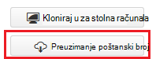
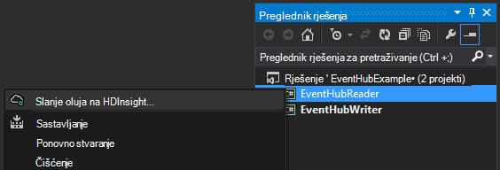
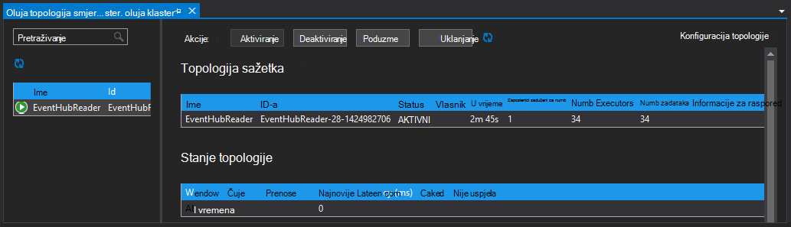

<properties
   pageTitle="Obrada događaje iz koncentratora događaj s oluja na HDInsight | Microsoft Azure"
   description="Saznajte kako obrada podataka događaja koncentratora pomoću topologije C# oluja stvorene u Visual Studio pomoću alata za HDInsight za Visual Studio."
   services="hdinsight,notification hubs"
   documentationCenter=""
   authors="Blackmist"
   manager="jhubbard"
   editor="cgronlun"/>

<tags
   ms.service="hdinsight"
   ms.devlang="dotnet"
   ms.topic="article"
   ms.tgt_pltfrm="na"
   ms.workload="big-data"
   ms.date="10/27/2016"
   ms.author="larryfr"/>

# Postupak događaje iz koncentratora događaj Azure s oluja na HDInsight (C#)

Azure događaj koncentratora omogućuje vam da obradi pretraživanje velikog količine podataka iz web-mjesta, aplikacije i uređaje. Spout događaj koncentratora omogućuje jednostavno je za korištenje Apache oluja na HDInsight da biste analizirali podatke u stvarnom vremenu. Možete unijeti podatke s koncentratorima događaj iz oluja pomoću munje koncentratora za događaj.

U ovom ćete praktičnom vodiču će Saznajte kako koristiti predloške Visual Studio instaliran pomoću alata za HDInsight za Visual Studio stvaranje dva topologija koji rade s koncentratorima Azure događaj.

* **EventHubWriter**: slučajno stvara podatke i piše s koncentratorima događaja

* **EventHubReader**: čita podatke iz koncentratora za događaj i zapisuje podatke u zapisnicima oluja

> [AZURE.NOTE] Dok je korake u ovom dokumentu za razvojno okruženje za Windows s Visual Studio, kompilirane projekta može poslati klaster Linux ili HDInsight utemeljen na sustavu Windows. Samo sustavom Linux klastere stvorene nakon 28/10/2016 podršku topologija SCP.NET.
>
> Da biste koristili C# topologije sa sustavom Linux klaster, morate ažurirati paket Microsoft.SCP.Net.SDK NuGet koristi projekta verziju 0.10.0.6 ili noviji. Verziju paketa mora odgovarati i glavna verzija oluja instalirana na HDInsight. Primjerice, koristite oluja u verzijama HDInsight 3,3 i 3.4 oluja verzija 0.10.x dok HDInsight 3,5 koristi oluja 1.0.x.
> 
> C# topologija na sustavom Linux klastere morate koristiti .NET 4,5 i koristiti Mono pokrenuti klaster HDInsight. Većina značajki funkcioniraju, no treba provjeriti [Kompatibilnost Mono](http://www.mono-project.com/docs/about-mono/compatibility/) dokument za potencijalne nekompatibilnosti.
>
> Java verziju projektu, a koji će funkcionirati i na sustavom Linux ili utemeljen na sustavu Windows klaster, potražite u članku [postupak događaje iz koncentratora događaj Azure s oluja na HDInsight (Java)](hdinsight-storm-develop-java-event-hub-topology.md).

## Preduvjeti

* [Apache oluja na HDInsight klaster](hdinsight-apache-storm-tutorial-get-started.md)

* [Koncentrator Azure događaja](../event-hubs/event-hubs-csharp-ephcs-getstarted.md)

* [Azure .NET SDK](http://azure.microsoft.com/downloads/)

* [Alati za HDInsight za Visual Studio](hdinsight-hadoop-visual-studio-tools-get-started.md)

## Dovršeni projekta

Možete preuzeti potpunu verziju projekt stvoren pomoću ovog praktičnog vodiča iz GitHub: [eventhub oluja hibridnog](https://github.com/Azure-Samples/hdinsight-dotnet-java-storm-eventhub). Međutim, i dalje morate unijeti konfiguracijske postavke slijedeći korake ovog praktičnog vodiča.

## Spout koncentratora za događaj i munje

Koncentratora događaja spout i bolt su Java komponente koje vam omogućuju da olakšan rad sa koncentratora događaj iz Apache oluja. Iako su te komponente pisane Java, HDInsight alate za Visual Studio omogućuju stvaranje topologija hibridnog koji kombinirati i C# Java komponente.

Spout i munje distributed kao jedan Java arhiva (.jar) datoteku pod nazivom **eventhubs-storm-spout-#.#-jar-with-dependencies.jar**, gdje #. # je verzija datoteke.

### Preuzimanje datoteke .jar

Najnoviju verziju datoteke posudu uvrštava u programu project [HDInsight oluja primjerima](https://github.com/hdinsight/hdinsight-storm-examples) u mapi **biblioteke/eventhubs** . Da biste preuzeli datoteke, koristite neku od sljedećih metoda.

> [AZURE.NOTE] Spout i munje su poslani za uključivanje u programu project Apache oluja. Dodatne informacije potražite u članku [OLUJA 583: prijava za oluja događaj koncentratora velikim početnim](https://github.com/apache/storm/pull/336/files) u GitHub.

* **Preuzimanje datoteke ZIP**: [primjeri oluja HDInsight](https://github.com/hdinsight/hdinsight-storm-examples) web-mjesta odaberite **Preuzimanje ZIP** u desnom oknu da biste preuzeli .zip datoteku koja sadrži projekt.

    

    Kada preuzmete datoteku, možete izdvojiti u arhivu, a datoteka će biti u imeniku **Biblioteka** .

* **Kloniraj projekta**: Ako imate instaliran [brojka](http://git-scm.com/) , koristite sljedeću naredbu Kloniraj lokalno spremište, a zatim pronađite datoteku u imeniku **Biblioteka** .

        git clone https://github.com/hdinsight/hdinsight-storm-examples

## Konfiguriranje događaja koncentratora

Događaj koncentratora je izvor podataka u ovom primjeru. Pomoću informacija u odjeljku __Stvaranje koncentratora za događaj__ dokumenta za [Početak rada s koncentratorima događaj](../event-hubs/event-hubs-csharp-ephcs-getstarted.md) .

3. Nakon stvaranja središtu događaj prikaz plohu EventHub portalu Azure i odaberite __zajednički se koristi access pravila__. Koristite stavku __+ Dodaj__ da biste dodali sljedeća pravila:

  	| Ime | Dozvole |
  	| ----- | ----- |
  	| pisanje | Pošalji |
  	| čitač | Slušanje |

    

5. Odaberite pravila za __čitanje__ i __Pisanje__ . Kopiranje i spremite vrijednost __PRIMARNOG ključa__ za oba pravila, kao što je to će se koristiti kasnije.

## Konfiguriranje na EventHubWriter

1. Ako već niste instalirali najnoviju verziju HDInsight alate za Visual Studio, potražite u članku [Prvi koraci pri korištenju HDInsight alate za Visual Studio](hdinsight-hadoop-visual-studio-tools-get-started.md).

2. Preuzmite rješenje s [eventhub oluja hibridnog](https://github.com/Azure-Samples/hdinsight-dotnet-java-storm-eventhub). Otvorite rješenje, a zatim potrajati nekoliko sekundi dok se potražite putem koda za projekt __EventHubWriter__ .

4. U programu project __EventHubWriter__ otvorite datoteku __App.config__ . Pomoću informacija u središtu događaj ste prethodno konfigurirali unesite vrijednost za sljedeći ključevi:

  	| Ključ | Vrijednost |
  	| ----- | ----- |
  	| EventHubPolicyName | pisanje (Ako ste koristili neki drugi naziv za pravila s dozvolom za _Slanje_ njegovo korištenje.) |
  	| EventHubPolicyKey | Ključ za pisanje pravila |
  	| EventHubNamespace | Prostor za naziv koji sadrži koncentratora za događaj |
  	| EventHubName | Naziv događaja koncentratora |
  	| EventHubPartitionCount | Broj particije u koncentratora za događaj |

4. Spremite i zatvorite datoteku **App.config** .

## Konfiguriranje na EventHubReader

1. Otvaranje projekta __EventHubReader__ i poduzeti nekoliko momoents potražite putem koda.

2. Otvorite __App.config__ __EventHubWriter__. Pomoću informacija u središtu događaj ste prethodno konfigurirali unesite vrijednost za sljedeći ključevi:

  	| Ključ | Vrijednost |
  	| ----- | ----- |
  	| EventHubPolicyName | čitač (Ako ste koristili neki drugi naziv za pravila s dozvolom za _Slušanje_ njegovo korištenje.) |
  	| EventHubPolicyKey | Ključ za čitanje pravila |
  	| EventHubNamespace | Prostor za naziv koji sadrži koncentratora za događaj |
  	| EventHubName | Naziv događaja koncentratora |
  	| EventHubPartitionCount | Broj particije u koncentratora za događaj |

3. Spremite i zatvorite datoteku **App.config** .

## Implementacija u topologija

1. **Preglednik rješenja**, desnom tipkom miša kliknite projekt **EventHubReader** i odaberite **Pošalji da biste oluja na HDInsight**.

    

2. Na zaslonu za **Slanje topologije** odaberite svoj **Klaster oluja**. Proširite **Dodatna konfiguracija**, odaberite **Java puta datoteke**, odaberite **...** , a zatim direktorij koji sadrži **eventhubs-storm-spout-0.9-jar-with-dependencies.jar** datoteku koju ste preuzeli neke starije verzije. Na kraju, kliknite **Pošalji**.

    

3. Kada je poslana topologije, pojavit će se **Oluja topologija preglednik** . Odaberite topologije **EventHubReader** u lijevom oknu da biste pogledali statistiku topologije. Trenutno ništa mora biti događa jer nema događaje napisan s koncentratorima događaj još.

    

4. **Preglednik rješenja**, desnom tipkom miša kliknite projekt **EventHubWriter** i odaberite **Pošalji da biste oluja na HDInsight**.

2. Na zaslonu za **Slanje topologije** odaberite svoj **Klaster oluja**. Proširite **Dodatna konfiguracija**, odaberite **Java puta datoteke**, odaberite **...** , a zatim direktorija s datotekom **eventhubs-storm-spout-0.9-jar-with-dependencies.jar** prethodno preuzeti. Na kraju, kliknite **Pošalji**.

5. Kada je poslana topologije, osvježite popis topologije u **Oluja topologija preglednik** da biste potvrdili da su oba topologija pokrenuti na klaster.

6. U **Pregledniku topologija oluja**, odaberite **EventHubReader** topologije.

4. U prikazu na grafikonu, dvokliknite komponentu __LogBolt__ . Otvorit će se na stranicu __Sažetak komponenta__ za na munje.

3. U odjeljku __Executors__ odaberite jednu od veza u stupcu __priključak__ . Time će se prikazati informacije zapisuje komponentu. Zabilježeni podaci je slična sljedećoj:

        2016-10-20 13:26:44.186 m.s.s.b.ScpNetBolt [INFO] Processing tuple: source: com.microsoft.eventhubs.spout.EventHubSpout:7, stream: default, id: {5769732396213255808=520853934697489134}, [{"deviceId":3,"deviceValue":1379915540}]
        2016-10-20 13:26:44.234 m.s.s.b.ScpNetBolt [INFO] Processing tuple: source: com.microsoft.eventhubs.spout.EventHubSpout:7, stream: default, id: {7154038361491319965=4543766486572976404}, [{"deviceId":3,"deviceValue":459399321}]
        2016-10-20 13:26:44.335 m.s.s.b.ScpNetBolt [INFO] Processing tuple: source: com.microsoft.eventhubs.spout.EventHubSpout:6, stream: default, id: {513308780877039680=-7571211415704099042}, [{"deviceId":5,"deviceValue":845561159}]
        2016-10-20 13:26:44.445 m.s.s.b.ScpNetBolt [INFO] Processing tuple: source: com.microsoft.eventhubs.spout.EventHubSpout:7, stream: default, id: {-2409895457033895206=5479027861202203517}, [{"deviceId":8,"deviceValue":2105860655}]

## Zaustavljanje na topologija

Da biste prestali s topologija, odaberite svaki topologije **Oluja topologije preglednika**, a zatim kliknite **Ukloni**.

## Brisanje svoj klaster

[AZURE.INCLUDE [delete-cluster-warning](../../includes/hdinsight-delete-cluster-warning.md)]

## Bilješke

### Checkpointing

Na EventHubSpout povremeno checkpoints stanje čvor Zookeeper, čime se štedi trenutni pomak za poruke čitati iz reda. Time se omogućuje komponente da biste pokrenuli primanje poruka pri spremljenu pomak u sljedećim scenarijima:

* Instance komponente ne uspijeva te je ponovno pokrenuti.

* Povećaj ili Smanji klaster dodavanjem ili uklanjanjem čvorove.

* Topologije je i drugom procesu ponovno pokrenuti **s istim nazivom**.

Izvoz i uvoz postojanog checkpoints WASB (Azure prostora za pohranu koriste svoj klaster HDInsight.) Skripta za to nalaze se na oluja na HDInsight klaster, pri **c:\apps\dist\storm-0.9.3.2.2.1.0-2340\zkdatatool-1.0\bin**.

>[AZURE.NOTE] Broj verzije u put može se razlikovati, kao što je verzija oluja instalirano klaster u budućnosti može promijeniti.

U ovom direktoriju su:

* **stormmeta_import.cmd**: Uvoz sve oluja metapodataka iz spremnik klaster zadani prostor za pohranu u Zookeeper.

* **stormmeta_export.cmd**: izvoz sve oluja metapodataka iz Zookeeper spremniku klaster zadani prostor za pohranu.

* **stormmeta_delete.cmd**: brisanje svih oluja metapodataka iz Zookeeper.

Izvoz uvoza omogućuje zadržava kontrolne točke podataka kada je potrebno da biste izbrisali klaster, no da biste nastavili obradu iz trenutne pomak u središtu kada vam se srušiti mrežni način Nova grupa.

> [AZURE.NOTE] Budući da se podaci je ista i spremniku zadani prostor za pohranu, u nove klaster **morate** koristiti isti račun za pohranu i spremnik kao prethodne klaster.

## Daljnji koraci

U ovom dokumentu ste naučili kako koristiti Java događaj koncentratora Spout i munje iz topologije C# za rad s podacima u središte Azure događaj. Da biste saznali više o stvaranju C# topologija, pogledajte sljedeće.

* [Razvoj C# topologija za Apache oluja na HDInsight pomoću Visual Studio](hdinsight-storm-develop-csharp-visual-studio-topology.md)

* [Vodič za programiranje Pronađenim](hdinsight-storm-scp-programming-guide.md)

* [Primjer topologija za oluja na HDInsight](hdinsight-storm-example-topology.md)
 
