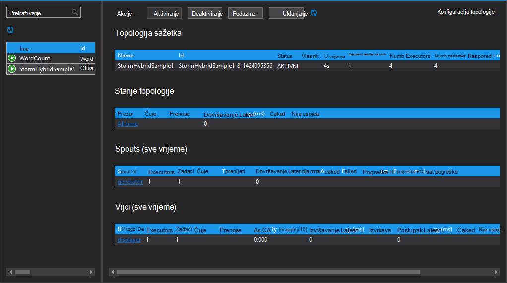
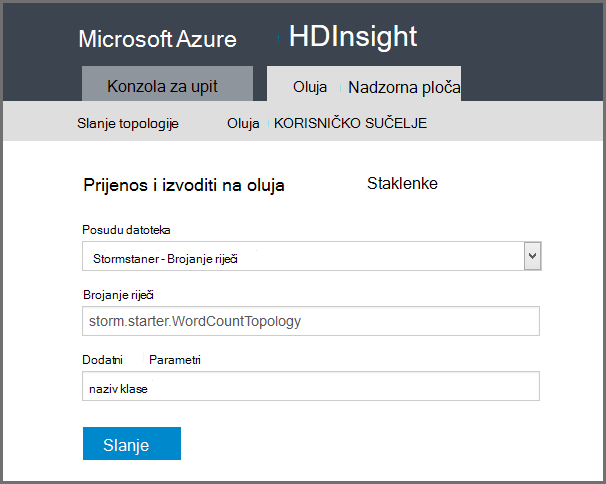

<properties
    pageTitle="Uvod u Apache oluja na HDInsight | Microsoft Azure"
    description="Početak Uvod u Apache oluja te Saznajte kako možete koristiti oluja na HDInsight da biste sastavili rješenja analize podataka u stvarnom vremenu u oblaku."
    services="hdinsight"
    documentationCenter=""
    authors="Blackmist"
    manager="jhubbard"
    editor="cgronlun"
    tags="azure-portal"/>

<tags
   ms.service="hdinsight"
   ms.devlang="na"
   ms.topic="get-started-article"
   ms.tgt_pltfrm="na"
   ms.workload="big-data"
   ms.date="10/11/2016"
   ms.author="larryfr"/>

#Uvod u Apache oluja na HDInsight: u stvarnom vremenu analize Hadoop

Apache oluja na HDInsight omogućuje vam stvaranje rješenja analize raspodijeljeno, u stvarnom vremenu u okruženje za Azure pomoću [Apache Hadoop](http://hadoop.apache.org).

##Što je Apache oluja?

Apache oluja je sustav raspodijeljeno pogreške, otvorite izvorni izračuni koji vam omogućuje da obrada podataka u stvarnom vremenu s Hadoop. Rješenja oluja također pružaju sigurno obrada podataka, uz mogućnost ponavljanje podataka koji nije obrađen uspješno prvi put.

##Zašto koristiti oluja na HDInsight?

Apache oluja na HDInsight je upravljanih klaster integriran u okruženje za Azure. Pruža sljedeće prednosti ključa:

* Izvodi kao servis za upravljane pomoću programa SLA 99.9% aktivan

* Korištenje jezika po izboru: pruža podršku za komponente oluja pisane **Java**, **C#**i **Python**

    * Podržava kombinacije programskog jezika: čitanje podataka pomoću Java, a zatim obrade pomoću C#
    
        > [AZURE.NOTE] C# topologija podržani su samo na klastere HDInsight utemeljen na sustavu Windows.

    * Korištenje Java sučelja **Trident** da biste stvorili topologija oluja koji podržavaju "točno kada" obrada poruka, "transakcijskih" datastore postojanost i skup uobičajenih operacija strujanje analytics

* Uključuje ugrađene značajke skaliranje gore i skaliranje dolje: skaliranje programa HDInsight klaster s bez utjecaja na pokrenut topologija oluja

* Integracija s drugih Azure servisa, uključujući koncentrator događaj, Azure virtualne mreže, SQL baze podataka, blobova i DocumentDB

    * Spajanje mogućnosti više klastere HDInsight pomoću Azure virtualne mreže: Stvaranje analitičkih kanali koje koriste HDInsight, HBase ili Hadoop klastere

Popis tvrtkama koje koriste Apache oluja za njihova rješenja u stvarnom vremenu analize, potražite u članku [Oluja Apache pomoću tvrtke](https://storm.apache.org/documentation/Powered-By.html).

Da biste počeli koristiti oluja, potražite u članku [Početak rada s oluja na HDInsight][gettingstarted].

###Dodjela resursa za olakšani

Novi oluja na HDInsight klaster možete Dodjela resursa u minutama. Navedite naziv klaster, veličinu, administratorski račun i račun za pohranu. Azure će stvoriti klaster, uključujući ogledne Topologija i nadzorne ploče na web-upravljanje.

> [AZURE.NOTE] Možete i dodjela resursa oluja klastere pomoću [Azure EŽA](../xplat-cli-install.md) ili [Azure PowerShell](../powershell-install-configure.md).

Unutar 15 minuta slanja zahtjeva, imat ćete novu oluja klaster pokrenut i jeste li spremni za prve u stvarnom vremenu analize kanal.

###Lakoća korištenja

__Oluja za Linux utemeljen na HDInsight klastere__, možete se povezati s klaster pomoću SSH i njihovo korištenje u `storm` naredba za pokretanje i upravljanje topologija. Osim toga, možete koristiti Ambari praćenje servis oluja i oluja korisničko Sučelje za nadzor i upravljanje izvodi topologija.

Dodatne informacije o radu sa sustavom Linux oluja klastere potražite u članku [Početak rada s Apache oluja na sustavom Linux HDInsight](hdinsight-apache-storm-tutorial-get-started-linux.md).

__Utemeljen na sustavu Windows za oluja na klastere HDInsight__HDInsight alate za Visual Studio omogućuju stvaranje C# i hibridnog C# / topologija Java i zatim ih poslati svoje oluja na klasteru HDInsight.  

Alati za HDInsight za Visual Studio nudi i sučelje koja omogućuje praćenje i upravljanje oluja topologija na klaster.

Primjer korištenja alata za HDInsight da biste stvorili oluja aplikacije, potražite u članku [razviti C# oluja topologija pomoću alata za HDInsight za Visual Studio](hdinsight-storm-develop-csharp-visual-studio-topology.md).

Dodatne informacije o alatima servisa HDInsight za Visual Studio, potražite u članku [Prvi koraci pri korištenju alata za HDInsight za Visual Studio](../HDInsight/hdinsight-hadoop-visual-studio-tools-get-started.md).

Svaki oluja na HDInsight klaster omogućuje utemeljen na webu oluja nadzorne ploče koja omogućuje slanje, praćenje i upravljanje oluja topologija sustavom klaster.

Dodatne informacije o korištenju oluja nadzorne ploče potražite u članku [uvođenje i upravljanje Apache oluja topologija na HDInsight](hdinsight-storm-deploy-monitor-topology.md).

Oluja na HDInsight omogućuje i jednostavan integraciju sa Azure događaj koncentratora kroz **Spout koncentrator za događaj**. Najnoviju verziju komponente dostupan je na [https://github.com/hdinsight/hdinsight-storm-examples/tree/master/lib/eventhubs](https://github.com/hdinsight/hdinsight-storm-examples/tree/master/lib/eventhubs). Dodatne informacije o korištenju ove komponente potražite u članku sljedećim dokumentima.

* [Razvoj C# topologije koja koristi Azure događaj koncentratora](hdinsight-storm-develop-csharp-event-hub-topology.md)

* [Razvoj Java topologije koja koristi Azure događaj koncentratora](hdinsight-storm-develop-java-event-hub-topology.md)

###Pouzdanost

Apache oluja uvijek jamčiti da svaku ulaznu poruku potpuno obrađuju, čak i kad je analiza podataka šire stotine čvorove.

**Nimbus čvor** omogućuje sličnu funkciju Hadoop JobTracker, a dodjeljuje zadatke ostale čvorove u skupini kroz **Zookeeper**. Čvorovi zookeeper navedite koordinaciji za klaster i olakšavaju komunikaciju između Nimbus i proces **nadzornik** na čvorove tempiranja. Ako funkcionira jedan čvor obrada, čvor Nimbus se obavještavaju, a drugi čvor dodjeljuje zadatak i pridruženih podataka.

Zadanu konfiguraciju za Apache oluja je imati samo jedan čvor Nimbus. Oluja na HDInsight pokreće dva Nimbus čvorove. Primarni čvor ne uspije, klaster HDInsight će se prebaciti čvor sekundarne dok je primarni čvor oporaviti.

###Promjena veličine

Iako možete navesti broj čvorove u svoj klaster tijekom stvaranja, trebali biste Povećaj ili Smanji klaster tako da odgovara radno opterećenje. Sve HDInsight klastere omogućuju da biste promijenili broj čvorovi u klasteru, čak i tijekom obrade podataka.

> [AZURE.NOTE] Da biste iskoristili novi čvorovi dodati putem mogućnosti skaliranja, morat ćete poduzme topologija rada prije nego što je povećati klaster.

###Podrška

Oluja na HDInsight isporučuje se s podrškom za tvrtke za razinu 24-7. Oluja na HDInsight ima programa SLA 99.9%. To znači da ne možemo jamči da klaster će imati vanjskih povezivanje najmanje 99.9% od vremena.

##Uobičajena slučaja koristi za analizu u stvarnom vremenu

Slijede neki uobičajeni scenariji za koje možete koristiti Apache oluja na HDInsight. Informacije o stvarnog života scenariji, pročitajte [kako tvrtki koriste oluja](https://storm.apache.org/documentation/Powered-By.html).

* Internet stvari (IoT)
* Otkrivanje prijevara
* Društvene analytics
* Izdvajanje, pretvaranje učitavanja (ETL)
* Nadzor mreže
* Pretraživanje
* Mobilni radnje

##Kako se obrađuju podataka u HDInsight oluja?

Apache oluja pokreće **Topologija** umjesto MapReduce poslove koje bi vas mogle poznajete iz servisa HDInsight ili Hadoop. Oluja na HDInsight klaster sadrži dvije vrste čvorove: glavni čvorove koji se izvode **Nimbus** i tempiranja čvorove koji se izvode **nadzornik**.

* **Nimbus**: slično JobTracker u Hadoop, je odgovoran za distribucija kod cijeloj klaster, dodjeljivanje zadataka virtualnim strojevima i nadzor za pogreške. HDInsight nudi dva čvorove Nimbus, tako da ne postoji jedan točka kvara za oluja na HDInsight

* **Nadzornik**: nadzornik za svaki čvor tempiranja je zadužen za pokretanje i zaustavljanje **radnih procesa** na čvor.

* **Procesu**: pokreće podskup **topologije**. Izvodi topologije raspodijeliti je mnogo radnih procesa cijeloj klaster.

* **Topologija**: definira grafikon izračuni koji obrađuje **strujanja** podataka. Za razliku od poslove MapReduce topologija se izvoditi dok ne zatvorite ih.

* **Strujanje**: slobodne skup **redni**. Strujanja koje je stvorio **spouts** i **Vijci s maticama**, a oni troše **Vijci s maticama**.

* **N-torke**: imenovani popisa dinamički upisani vrijednosti.

* **Spout**: troši podatke iz izvora podataka i emits jedan ili više **strujanja**.

    > [AZURE.NOTE] U mnogim slučajevima podataka je za čitanje iz reda, kao što su Kafka, Bus servisa Azure redova ili koncentratora za događaj. Red čekanja osigurava da podataka je ista i ako se prekida.

* **Munje**: troši **strujanja**, provodi obrada **redni**i možda šalji **strujanja**. Vijci su odgovorni za snimanje podataka na vanjskim prostor za pohranu, kao što su reda, HDInsight, HBase, blob ili druge spremišta podataka.

* **Apache Thrift**: framework softver za razvoj skalabilni servis za više jezika. Omogućuje stvaranje servise koji funkcioniraju između C++, jezika Java, Python, PHP, Ruby, Erlangova, Perl, Haskell, C#, Cocoa, JavaScript, Node.js, Smalltalk i druge jezike.

    * **Nimbus** Thrift servisa, a **topologije** definiciju Thrift tako da bude moguće za razvoj topologija pomoću raznih programskog jezika.

Dodatne informacije o komponenti oluja potražite u članku [vodič oluja] [ apachetutorial] na apache.org.

##Koje jezike programiranje mogu koristiti?

Oluja na HDInsight klaster pruža podršku za C#, Java i Python.

### C i #35;

Alati za HDInsight za Visual Studio razvojnim inženjerima .NET dizajniranje i implementacija topologije u C#. Možete stvoriti i hibridnog topologija koje koriste Java i C# komponente.

Dodatne informacije potražite u članku [razviti C# topologija za Apache oluja na HDInsight pomoću Visual Studio](hdinsight-storm-develop-csharp-visual-studio-topology.md).

###Java

Većina Java Primjeri naiđete bit će običan Java ili Trident. Trident je više razine apstrakcije koji olakšava radnje kao što su spojeva zbrajanja, grupiranja i filtriranja. Međutim, Trident bavi serijama od redni, dok neobrađenog rješenje Java obrađuje jedan n-torke strujanje odjednom.

Dodatne informacije o Trident potražite u članku [vodič Trident](https://storm.apache.org/documentation/Trident-tutorial.html) pri apache.org.

Primjeri Java i Trident topologija, potražite u članku na [popisu primjer oluja topologija](hdinsight-storm-example-topology.md) ili Primjeri oluja starter na svoj klaster HDInsight.

Primjeri oluja starter nalaze se u direktoriju __/usr/hdp/current/storm-client/contrib/storm-starter__ na sustavom Linux klastere i imenik **%storm_home%\contrib\storm-starter** na klastere utemeljen na sustavu Windows.

##Što su neke uobičajene uzorke razvoj?

###Obrada sigurno poruke

Oluja unijeti različite razine obrade sigurno poruke. Na primjer, osnovne oluja aplikacije možete jamči obrada pri najmanjih-jednom i Trident možete točno jamči-jednom obrade.

Dodatne informacije potražite u člancima [jamstva na obradu podataka](https://storm.apache.org/about/guarantees-data-processing.html) apache.org.

###IBasicBolt

Uzorak za unos n-torke, emitira nula ili više redni, a zatim acking unos n-torke odmah na kraju metoda za čitanje je vrlo uobičajeni, te oluja sadrži sučelje [IBasicBolt](https://storm.apache.org/apidocs/backtype/storm/topology/IBasicBolt.html) da biste automatizirali ovaj uzorak.

###Spaja

Pridruživanje dva strujanja podataka razlikuju se između aplikacija. Na primjer, svake n-torke iz većeg broja strujanja može uključiti u jednu novu strujanje ili spajanje samo serijama od redni za određeni prozor. U svakom slučaju, pridruživanje je moguće napraviti pomoću [fieldsGrouping](http://javadox.com/org.apache.storm/storm-core/0.9.1-incubating/backtype/storm/topology/InputDeclarer.html#fieldsGrouping%28java.lang.String,%20backtype.storm.tuple.Fields%29)koji je način koji definira kako se redni usmjeriti Vijci.

U sljedećem primjeru Java fieldsGrouping služi za usmjeravanje redni koja proizlazi iz komponente "1", "2" i "3" u munje **MyJoiner** .

    builder.setBolt("join", new MyJoiner(), parallelism) .fieldsGrouping("1", new Fields("joinfield1", "joinfield2")) .fieldsGrouping("2", new Fields("joinfield1", "joinfield2")) .fieldsGrouping("3", new Fields("joinfield1", "joinfield2"));

###Grupno slanje promjena

Grupno slanje promjena je moguće napraviti nekoliko načina. Pomoću osnovnih topologije oluja Java, možda pomoću jednostavne brojač redni broj serije X prije nego što ih emitira ili pomoću naziva "crtičnih n-torke" grupu za slanje svakih sekundi X mehanizam za interne tempiranja.

Primjer korištenja redni na osi, potražite u članku [analiziranje podataka senzor s oluja i HBase na HDInsight](hdinsight-storm-sensor-data-analysis.md).

Ako koristite Trident temelji se na obradu serijama od redni.

###Predmemoriranje

Predmemoriranje u memoriji često se koristi kao mehanizam za ubrzavanja obrade jer zadržava često koristi imovine u memoriji. Jer topologije distribuira preko više čvorove i više procesa unutar svake čvor, razmislite o korištenju [fieldsGrouping](http://javadox.com/org.apache.storm/storm-core/0.9.1-incubating/backtype/storm/topology/InputDeclarer.html#fieldsGrouping%28java.lang.String,%20backtype.storm.tuple.Fields%29) da biste bili sigurni da redni koji sadrži polja koja se koriste za predmemoriju pretraživanja su uvijek usmjeriti na isti način. Izbjegava se dupliciranje predmemorije stavki na svim procesa.

###N najgornjih strujanje.

Kada topologiji ovisi o izračunu vrijednosti "najvećih N", primjerice gornje 5 trendova na Twitteru, trebali biste izračun vrijednosti najvećih N paralelno i zatim Izlaz iz tih izračuna spojiti globalni vrijednost. To možete učiniti pomoću [fieldsGrouping](http://javadox.com/org.apache.storm/storm-core/0.9.1-incubating/backtype/storm/topology/InputDeclarer.html#fieldsGrouping%28java.lang.String,%20backtype.storm.tuple.Fields%29) usmjeravanje prema polju za paralelne Vijci (koji partitions podatke prema vrijednosti polja), a zatim rute do munje koji globalno određuje vrijednost najvećih N.

Na primjer ovog, pogledajte primjer [RollingTopWords](https://github.com/nathanmarz/storm-starter/blob/master/src/jvm/storm/starter/RollingTopWords.java) .

##Koje vrste zapisivanje ne oluja koristi?

Oluja koristi Apache Log4j za zapisivanje podataka. Prema zadanim postavkama prijavljen je veliku količinu podataka, a može biti teško sortirati podatke. Konfiguracijska datoteka za zapisivanje možete uključiti kao dio topologiji oluja kontrolu zapisivanje ponašanje.

Primjer topologije koji pokazuje kako konfigurirati zapisivanje, potražite u članku [WordCount utemeljena na](hdinsight-storm-develop-java-topology.md) primjer za oluja na HDInsight.

##Daljnji koraci

Dodatne informacije o rješenja u stvarnom vremenu analize s Apache oluja u HDInsight:

* [Uvod u oluja na HDInsight][gettingstarted]

* [Primjer topologija za oluja na HDInsight](hdinsight-storm-example-topology.md)

[stormtrident]: https://storm.apache.org/documentation/Trident-API-Overview.html
[samoa]: http://yahooeng.tumblr.com/post/65453012905/introducing-samoa-an-open-source-platform-for-mining
[apachetutorial]: https://storm.apache.org/documentation/Tutorial.html
[gettingstarted]: hdinsight-apache-storm-tutorial-get-started-linux.md
