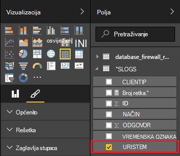

<properties
 pageTitle="Korištenje oluja Apache s dodatkom Power BI | Microsoft Azure"
 description="Stvaranje izvješća dodatka Power BI pomoću podataka iz C# topologije sustavom programa klaster Apache oluja u HDInsight."
 services="hdinsight"
 documentationCenter=""
 authors="Blackmist"
 manager="jhubbard"
 editor="cgronlun"
    tags="azure-portal"/>

<tags
 ms.service="hdinsight"
 ms.devlang="dotnet"
 ms.topic="article"
 ms.tgt_pltfrm="na"
 ms.workload="big-data"
 ms.date="10/27/2016"
 ms.author="larryfr"/>

# Vizualizirajte podatke iz topologija Apache oluja pomoću dodatka Power BI

Power BI omogućuje vam da biste vizualno prikazali podatke kao izvješća. Pomoću predložaka za Visual Studio oluja na HDInsight, možete koristiti podatke iz topologije sustavom programa oluja Apache na HDInsight klaster u SQL Azure i vizualiziranje podataka pomoću dodatka Power BI.

U ovom dokumentu će Saznajte kako koristiti Power BI za stvaranje izvješća iz podataka generira topologija oluja Apache i pohranjuju u bazi podataka SQL Azure.

> [AZURE.NOTE] Dok je korake u ovom dokumentu za razvojno okruženje za Windows s Visual Studio, kompilirane projekta može poslati klaster Linux ili HDInsight utemeljen na sustavu Windows. Samo sustavom Linux klastere stvorene nakon 28/10/2016 podršku topologija SCP.NET.
>
> Da biste koristili C# topologije sa sustavom Linux klaster, morate ažurirati paket Microsoft.SCP.Net.SDK NuGet koristi projekta verziju 0.10.0.6 ili noviji. Verziju paketa mora odgovarati i glavna verzija oluja instalirana na HDInsight. Primjerice, koristite oluja u verzijama HDInsight 3,3 i 3.4 oluja verzija 0.10.x dok HDInsight 3.5 koristi oluja 1.0.x.
> 
> C# topologija na sustavom Linux klastere morate koristiti .NET 4,5 i koristiti Mono pokrenuti klaster HDInsight. Većina značajki funkcioniraju, no treba provjeriti [Kompatibilnost Mono](http://www.mono-project.com/docs/about-mono/compatibility/) dokument za potencijalne nekompatibilnosti.
>
> Java verziju projektu, a koji će funkcionirati i na sustavom Linux ili utemeljen na sustavu Windows klaster, potražite u članku [postupak događaje iz koncentratora događaj Azure s oluja na HDInsight (Java)](hdinsight-storm-develop-java-event-hub-topology.md).

## Preduvjeti

- Azure pretplate. Pogledajte [Početak Azure besplatnu probnu verziju](https://azure.microsoft.com/documentation/videos/get-azure-free-trial-for-testing-hadoop-in-hdinsight/).

* Korisnik sustava Azure Active Directory pomoću programa access za [Power BI](https://powerbi.com)

* Visual Studio (jedan od sljedećih verzija)

    * Visual Studio 2012 s [obnove 4](http://www.microsoft.com/download/details.aspx?id=39305)

    * Visual Studio 2013 [ažuriranje 4](http://www.microsoft.com/download/details.aspx?id=44921) ili [Visual Studio 2013 zajednice](http://go.microsoft.com/fwlink/?linkid=517284&clcid=0x409)

    * [Visual Studio 2015.](https://www.visualstudio.com/downloads/download-visual-studio-vs.aspx)

* Alati za HDInsight za Visual Studio: informacije potražite u odjeljku [Prvi koraci pri korištenju alata za HDInsight za Visual Studio](../HDInsight/hdinsight-hadoop-visual-studio-tools-get-started.md) na informacije o instalaciji.

## Kako funkcionira

U ovom se primjeru sadrži C# oluja topologije koji slučajno generira podaci iz zapisnika Internet Information Services (IIS). Ove podatke pa zapisan s bazom podataka SQL i iz njega se koristi za generiranje izvješća dodatka Power BI.

Slijedi popis datoteka koje implementirati glavni funkcionalnost u ovom primjeru.

* **SqlAzureBolt.cs**: zapisuje informacije proizvodi u topologiji oluja SQL bazu podataka.

* **IISLogsTable.sql**: U Transact-SQL izraza koji se koriste za stvaranje baze podataka koji se podaci spremaju u.

> [AZURE.WARNING] Morate stvoriti tablicu u bazi podataka SQL prije pokretanja topologije na svoj klaster HDInsight.

## Preuzimanje primjera

Preuzmite [primjer HDInsight C# oluja Power BI](https://github.com/Azure-Samples/hdinsight-dotnet-storm-powerbi). Da biste preuzeli, o ogranku/Kloniraj pomoću [brojka](http://git-scm.com/)ili pomoću veza za **Preuzimanje** možete preuzeti na .zip u arhivu.

## Stvaranje baze podataka

1. Slijedite korake u dokumentu [baze podataka SQL Praktični vodič](../sql-database/sql-database-get-started.md) da biste stvorili novu bazu podataka za SQL.

2. Povezivanje s bazom podataka prema uputama u dokumentu [za povezivanje s bazom podataka SQL s Visual Studio](../sql-database/sql-database-connect-query.md) da biste se povezali s bazom podataka.

4. Desnom tipkom miša kliknite bazu podataka u programu Explorer objekt, a zatim stvorite __Novi upit__. Lijepljenje sadržaja __IISLogsTable.sql__ datoteku u preuzete projekta u prozor za upit, a zatim koristite Ctrl + Shift + E za izvršavanje upita. Trebali biste dobiti poruku uspješno dovršena na command(s).

    Kada se to završi, pojavit će se nova tablica s nazivom __IISLOGS__ u bazi podataka.

## Konfiguriranje uzorka

1. Odaberite baze podataka sustava SQL [Azure portal](https://portal.azure.com). Iz odjeljka __Essentials__ plohu baze podataka SQL odaberite __Prikaži nizu za povezivanje baze podataka__. Na popisu koji će se prikazati, kopirajte informacije __ADO.NET (SQL provjera autentičnosti)__ .

1. Otvorite uzorka u Visual Studio. U **Pregledniku rješenja**, otvorite datoteku **App.config** , a zatim sljedeće stavke:

        <add key="SqlAzureConnectionString" value="##TOBEFILLED##" />
    
    Zamijenite vrijednost __## TOBEFILLED ##__ niz za povezivanje baze podataka kopiraju u prethodnom koraku. Zamjena __{vaše\_korisničko ime}__ i __{vaše\_lozinku}__ korisničkog imena i lozinke za bazu podataka.

2. Spremite i zatvorite datoteke.

## Implementacija uzorka

1. **Preglednik rješenja**, desnom tipkom miša kliknite projekt **StormToSQL** i odaberite **Pošalji da biste oluja na HDInsight**. U dijaloškom okviru **Oluja klaster** padajućeg izbornika odaberite klaster HDInsight.

    > [AZURE.NOTE] Može proći nekoliko sekundi prije nego što za padajući popis **Oluja klaster** popuniti nazive poslužitelja.
    >
    > Ako se to od vas zatraži, unesite vjerodajnice za prijavu za pretplatu Azure. Ako imate više pretplata, prijavite se u onu koja sadrži vaše oluja na klasteru HDInsight.

2. Kada topologije uspješno je poslana, topologija oluja za klaster prikazivati. Odaberite SqlAzureWriterTopology stavku s popisa da biste vidjeli informacije o topologiji izvodi.

    

    Da biste vidjeli informacije na topologije ili dvokliknite na stavke (primjerice SqlAzureBolt) da biste vidjeli informacije specifične za komponentu u topologiji možete koristiti ovaj prikaz.

3. Kada je topologije pokrenuli za nekoliko minuta, vratite prozoru SQL upita koji se koriste za stvaranje baze podataka. Zamijenite postojeće naredbe sljedeće.

        select * from iislogs;
    
    Koristi Ctrl + Shift + E za izvršavanje upita, a trebale primiti rezultate otprilike ovako.
    
        1   2016-05-27 17:57:14.797 255.255.255.255 /bar    GET 200
        2   2016-05-27 17:57:14.843 127.0.0.1   /spam/eggs  POST    500
        3   2016-05-27 17:57:14.850 123.123.123.123 /eggs   DELETE  200
        4   2016-05-27 17:57:14.853 127.0.0.1   /foo    POST    404
        5   2016-05-27 17:57:14.853 10.9.8.7    /bar    GET 200
        6   2016-05-27 17:57:14.857 192.168.1.1 /spam   DELETE  200

    Ovo je podataka koji sadrži zapisan s topologije oluja.

## Stvaranje izvješća

1. Povezivanje s [bazom podataka SQL Azure poveznik](https://app.powerbi.com/getdata/bigdata/azure-sql-database-with-live-connect) za Power BI.

2. U __bazama podataka__, odaberite __Početak__.

3. Odaberite __Baze podataka SQL Azure__, a zatim odaberite __Poveži__.

4. Unesite podatke za povezivanje s bazom podataka Azure SQL. Ne možete pronaći posjeta [Azure portal](https://portal.azure.com) i odabirom baze podataka sustava SQL.

    > [AZURE.NOTE] Interval osvježavanja i prilagođene filtre možete postaviti i pomoću __Omogućiti dodatne mogućnosti__ u dijaloškom okviru za povezivanje.

5. Kada ste povezani, vidjet ćete novi skup podataka s istim nazivom kao baza podataka povezan s. Odaberite skup podataka da biste započeli dizajniranje izvješća.

3. Iz __polja__proširite stavku __IISLOGS__ . Potvrdite okvir za __URISTEM__. Time stvarate novo izvješće s popisom korijene riječi za URI (/ odnožje, / traci itd.) u bazi podataka.

    

5. Nakon toga povucite __način__ u izvješće. Izvješće će se ažurirati na korijene riječi i odgovarajuće načina HTTP koji se koristi za HTTP zahtjev.

    

4. Iz stupca __vizualizacije__ odaberite ikonu __polja__ , a zatim odaberite strelicu prema dolje uz __način__ u odjeljku __vrijednosti__ . Na popisu koji će se prikazati odaberite __Count__. To će se promijeniti izvješću budu navedeni broj koliko je puta određeni URI pristupanja.

    

6. Nakon toga odaberite __Složeni stupčasti grafikon__ da biste promijenili način prikaza podataka.

    

7. Nakon što dodate izvješće kako želite, pomoću unos __spremili__ na izborniku unesite naziv, a zatim spremite izvješće.

## Zaustavljanje topologije

Topologije će i dalje da biste pokrenuli dok ne zaustavite ili brisanje oluja na klasteru HDInsight. Izvršite sljedeće korake da biste zaustavili topologije.

1. U Visual Studio, vratite se u pregledniku Topologija i odaberite topologije.

2. Odaberite gumb **Ukloni** da biste prestali topologije.

    

## Brisanje svoj klaster

[AZURE.INCLUDE [delete-cluster-warning](../../includes/hdinsight-delete-cluster-warning.md)]

## Daljnji koraci

U ovom dokumentu naučili kako poslati podatke iz oluja topologije SQL baze podataka, a zatim vizualni prikaz podataka pomoću dodatka Power BI. Informacije o radu s druge tehnologije za Azure HDInsight pomoću oluja potražite u sljedećim člancima:

* [Primjer topologija za oluja na HDInsight](hdinsight-storm-example-topology.md)
