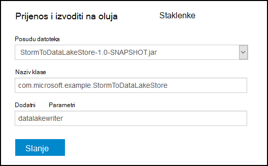

<properties
pageTitle="Pohrana podataka koristi Azure Lake s Apache oluja na Azure HDInsight"
description="Saznajte kako zapisivanje podataka Lake spremišta podataka za Azure s topologija Apache oluja na HDInsight. Ovaj dokument, a pridruženi primjer prikazuju kako koristiti komponentu HdfsBolt pisati u spremištu Lake podataka."
services="hdinsight"
documentationCenter="na"
authors="Blackmist"
manager="jhubbard"
editor="cgronlun"/>

<tags
ms.service="hdinsight"
ms.devlang="na"
ms.topic="article"
ms.tgt_pltfrm="na"
ms.workload="big-data"
ms.date="09/06/2016"
ms.author="larryfr"/>

#Pohrana podataka koristi Azure Lake s oluja Apache s HDInsight

Azure podataka Lake spremište je programa HDFS kompatibilne prostora za pohranu u oblaku koji omogućuje visoke propusnost, dostupnost, rok trajanja i pouzdanost za vaše podatke. U ovom dokumentu će Saznajte kako koristiti utemeljena na oluja topologije zapisivanje podataka Lake spremišta podataka za Azure pomoću komponente [HdfsBolt](http://storm.apache.org/javadoc/apidocs/org/apache/storm/hdfs/bolt/HdfsBolt.html) koji prikazuje se kao dio Apache oluja.

> [AZURE.IMPORTANT] Topologija primjer koristi u ovom dokumentu ovisi o komponente koje su uključeni oluja na klastere HDInsight i možda ćete morati izmjene za rad s Azure Lake spremišta podataka kada se koristi s drugim klastere Apache oluja.

##Preduvjeti

* [Java JDK 1.7](https://www.oracle.com/technetwork/java/javase/downloads/jdk7-downloads-1880260.html) ili noviji
* [Maven 3.x](https://maven.apache.org/download.cgi)
* Azure pretplate
* Oluja HDInsight klaster verzije 3,2. Da biste stvorili novi oluja na HDInsight klaster, slijedite korake u dokumentu [pomoću HDInsight s trgovinom Lake podataka pomoću Azure](../data-lake-store/data-lake-store-hdinsight-hadoop-use-portal.md) . Koraci u ovom dokumentu će vas voditi kroz stvaranje nove HDInsight klaster i Lake spremišta podataka za Azure.  

    > [AZURE.IMPORTANT] Kada stvorite HDInsight klaster, morate odabrati __oluja__ kao vrstu klaster i __3,2__ kao verzija. OS-a može biti Windows i Linux.  

###Konfiguriranje varijable okruženja

Sljedeće varijable okruženja možda je postavljen prilikom instalacije programskog jezika Java i u JDK na vaše radne stanice razvoj. Međutim, trebali biste provjerite da postoje i sadrže odgovarajuće vrijednosti za sustav.

* __JAVA_HOME__ – moraju pokazivati direktoriju u kojem je instaliran okruženje za izvođenje Java (JRE). Ako, na primjer, u raspodjelom Unix ili Linux je potrebno vrijednost koja je slična `/usr/lib/jvm/java-7-oracle`. U sustavu Windows, želite imati vrijednost koja je slična `c:\Program Files (x86)\Java\jre1.7`.

* __Put__ – mora sadržavati sljedeće putovi:

    * __JAVA\_HOME__ (ili ekvivalentne puta)
    
    * __JAVA\_HOME\bin__ (ili ekvivalentne puta)
    
    * Direktoriju u kojem je instaliran Maven

##Topologija implementacije

Primjer koristi u ovom dokumentu napisan Java i koristi sljedeće komponente:

* __TickSpout__: generira podaci koji se koriste druge komponente u topologiji.

* __PartialCount__: broji događaje koje generira TickSpout.

* __FinalCount__: zbrajanja brojanja podataka iz PartialCount.

* __ADLStoreBolt__: zapisuje podataka iz trgovine Azure podataka na Lake pomoću komponente [HdfsBolt](http://storm.apache.org/javadoc/apidocs/org/apache/storm/hdfs/bolt/HdfsBolt.html) .

Projekt koji sadrži ovu topologije nije dostupan kao preuzeti iz [https://github.com/Azure-Samples/hdinsight-storm-azure-data-lake-store](https://github.com/Azure-Samples/hdinsight-storm-azure-data-lake-store).

###Razumijevanje ADLStoreBolt

U ADLStoreBolt je naziv koji se koristi za instancu HdfsBolt u topologiji zapisuje Lake Azure podataka. Ovo nije posebnu verziju HdfsBolt stvorio Microsoft; No ga je za web-mjesta core konfiguracijskih vrijednosti, kao i komponente Hadoop u sklopu Azure HDInsight za komunikaciju s Lake podataka.

Konkretno, prilikom stvaranja programa HDInsight klaster možete pridružiti ga je iz trgovine Azure podataka Lake. To piše unose u core web-mjesta za spremište Lake podataka koji ste odabrali, koji se koriste komponente kao što su hadoop klijenta i hadoop hdfs da biste omogućili komunikaciju s spremišta Lake podataka.

> [AZURE.NOTE] Microsoft je pridonio kod Apache Hadoop i projektima oluja koja omogućuje komunikaciju s Lake spremišta podataka za Azure i blobova platforme Azure prostora za pohranu, ali ta je funkcija možda nije uključeno po zadanom u drugim Hadoop i oluja distribucije.

Konfiguracija za HdfsBolt u topologiji je na sljedeći način:

    // 1. Create sync and rotation policies to control when data is synched
    //    (written) to the file system and when to roll over into a new file.
    SyncPolicy syncPolicy = new CountSyncPolicy(1000);
    FileRotationPolicy rotationPolicy = new FileSizeRotationPolicy(0.5f, Units.KB);
    // 2. Set the format. In this case, comma delimited
    RecordFormat recordFormat = new DelimitedRecordFormat().withFieldDelimiter(",");
    // 3. Set the directory name. In this case, '/stormdata/'
    FileNameFormat fileNameFormat = new DefaultFileNameFormat().withPath("/stormdata/");
    // 4. Create the bolt using the previously created settings,
    //    and also tell it the base URL to your Data Lake Store.
    // NOTE! Replace 'MYDATALAKE' below with the name of your data lake store.
    HdfsBolt adlsBolt = new HdfsBolt()
        .withFsUrl("adl://MYDATALAKE.azuredatalakestore.net/")
        .withRecordFormat(recordFormat)
        .withFileNameFormat(fileNameFormat)
        .withRotationPolicy(rotationPolicy)
        .withSyncPolicy(syncPolicy);
    // 4. Give it a name and wire it up to the bolt it accepts data
    //    from. NOTE: The name used here is also used as part of the
    //    file name for the files written to Data Lake Store.
    builder.setBolt("ADLStoreBolt", adlsBolt, 1)
      .globalGrouping("finalcount");
      
Ako ste upoznati s komponentom HdfsBolt, primijetit ćete da je sve vrlo standardne konfiguracije osim URL-a. URL-a nudi put do korijenske Lake spremišta podataka Azure.

Budući da pisanja u spremištu Lake podataka koristi HdfsBolt i samo promjenama URL-a, moći da biste snimili bilo koje postojeće topologije koji se piše HDFS ili WASB pomoću HdfsBolt i jednostavno promijeniti da koristi spremište Lake za Azure podataka.

##Stvaranje i pakiranje topologije

1. Preuzimanje primjer projekta iz [https://github.com/Azure-Samples/hdinsight-storm-azure-data-lake-store](https://github.com/Azure-Samples/hdinsight-storm-azure-data-lake-store
) razvojno okruženje.

2. Otvaranje u `StormToDataLake\src\main\java\com\microsoft\example\StormToDataLakeStore.java` datoteku u uređivaču i pronađite redak koji sadrži `.withFsUrl("adl://MYDATALAKE.azuredatalakestore.net/")`. Promjena __MYDATALAKE__ naziv spremištu Lake podataka za Azure koja se koristi pri stvaranju poslužitelj za HDInsight.

3. Naredbe upit, terminal ili sesije ljuske promjena direktorija u korijenskom direktoriju preuzete projekta i izvršite sljedeće naredbe za stvaranje i pakiranje topologije.

        mvn compile
        mvn package
    
    Kada se dovrši Sastavljanje i pakiranje, prikazat će se novi direktorij pod nazivom `target`, koja sadrži datoteku pod nazivom `StormToDataLakeStore-1.0-SNAPSHOT.jar`. Sadrži kompilirani topologije.

##Implementacija i pokrenuti sustavom Linux HDInsight

Ako ste stvorili oluja sa sustavom Linux na HDInsight klaster, slijedeći korake u nastavku implementacije i pokretanja topologije.

1. Koristite sljedeću naredbu da biste kopirali topologije klaster HDInsight. Zamijenite __korisnika__ koji ste koristili prilikom stvaranja klaster korisničko ime SSH. Zamijenite __CLUSTERNAME__ naziv klaster.

        scp target\StormToDataLakeStore-1.0-SNAPSHOT.jar USER@CLUSTERNAME-ssh.azurehdinsight.net:StormToDataLakeStore-1.0-SNAPSHOT.jar
    
    Kada se to od vas zatraži, unesite lozinku za koristiti prilikom stvaranja korisnika SSH klaster. Ako ste koristili javni ključ umjesto lozinke, možda ćete morati koristiti u `-i` parametar da biste odredili put do podudaranja privatni ključ.
    
    > [AZURE.NOTE] Ako koristite Windows klijent za razvoj, možda nemate programa `scp` naredbe. Ako je tako, možete koristiti `pscp`, koji je dostupan iz [http://www.chiark.greenend.org.uk/~sgtatham/putty/download.html](http://www.chiark.greenend.org.uk/~sgtatham/putty/download.html).

2. Kada prijenos završi, koristite sljedeće da biste se povezali klaster HDInsight pomoću SSH. Zamijenite __korisnika__ koji ste koristili prilikom stvaranja klaster korisničko ime SSH. Zamijenite __CLUSTERNAME__ naziv klaster.

        ssh USER@CLUSTERNAME-ssh.azurehdinsight.net

    Kada se to od vas zatraži, unesite lozinku za koristiti prilikom stvaranja korisnika SSH klaster. Ako ste koristili javni ključ umjesto lozinke, možda ćete morati koristiti u `-i` parametar da biste odredili put do podudaranja privatni ključ.
    
    > [AZURE.NOTE] Ako koristite Windows klijent za razvoj, slijedite informacije u [Povezivanje sa sustavom Linux HDInsight s SSH iz sustava Windows](hdinsight-hadoop-linux-use-ssh-windows.md) informacije na pomoću klijentskog programa PuTTY povezati klaster.
    
3. Nakon uspostave, koristite sljedeće da biste pokrenuli topologije:

        storm jar StormToDataLakeStore-1.0-SNAPSHOT.jar com.microsoft.example.StormToDataLakeStore datalakewriter
    
    To će pokrenuti topologije uz neslužbeni naziv `datalakewriter`.

##Implementacija i pokrenuti HDInsight utemeljen na sustavu Windows

1. Otvorite web-preglednik i idite na HTTPS://CLUSTERNAME.azurehdinsight.net, pri čemu je __CLUSTERNAME__ svoj klaster HDInsight. Kada se to od vas zatraži, navedite korisničko ime za administratore (`admin`) i lozinku koju ste koristili za ovaj račun prilikom stvaranja klaster.

2. Na nadzornoj ploči oluja __Posudu datoteke__ padajući popis odaberite __Pregledaj__ , a zatim odaberite datoteku StormToDataLakeStore 1.0 SNAPSHOT.jar iz na `target` direktorija. Za ostale stavke na obrascu, koristite sljedeće vrijednosti:

    * Klase naziv: com.microsoft.example.StormToDataLakeStore
    * Dodatni parametri: datalakewriter
    
    

3. Odaberite gumb __Pošalji__ da biste prenijeli i pokretanje topologije. Polje rezultat ispod gumba __Pošalji__ treba prikazuju se podaci otprilike ovako kada je pokrenut topologije:

        Process exit code: 0
        Currently running topologies:
        Topology_name        Status     Num_tasks  Num_workers  Uptime_secs
        -------------------------------------------------------------------
        datalakewriter       ACTIVE     68         8            10        

##Prikaz podataka za izlaz

Prikaz podataka na nekoliko načina. U ovom odjeljku koristimo Portal za Azure i `hdfs` naredba za prikaz podataka.

> [AZURE.NOTE] Dopustite topologija pokrenuti za nekoliko minuta prije traženja za izlazne podatke da bi se podaci sadrži su sinkronizirani na nekoliko datoteka za Azure podataka Lake spremište.

* __S [Portala za Azure](https://portal.azure.com)__: na portalu odaberite Azure Lake spremišta podataka koji se koristi s HDInsight.

    > [AZURE.NOTE] Ako ne uspijete prikvačili spremišta podataka Lake Azure portala nadzorne ploče, možete je pronaći tako da odaberete __potražite__ pri dnu popisa s lijeve strane, zatim __Spremišta Lake podataka__, a na kraju odabira u trgovini.
    
    Ikona pri vrhu Lake spremišta podataka, odaberite __Explorer podataka__.
    
    
    
    Nakon toga odaberite mapu __stormdata__ . Popis tekstnih datoteka trebala bi se prikazati.
    
    
    
    Odaberite jednu od datoteke da biste vidjeli njezin sadržaj.

* __Iz skupine__: Ako ste se povezali s klaster HDInsight pomoću SSH (Linux klaster) ili udaljene radne površine (Windows klaster) na sljedeći način možete koristiti za prikaz podataka. __DATALAKE__ zamijenite nazivom Lake spremišta podataka

        hdfs dfs -cat adl://DATALAKE.azuredatalakestore.net/stormdata/*.txt

    To će spajanje tekstnih datoteka pohranjenih u imeniku i prikaz podataka za otprilike ovako:
    
        406000000
        407000000
        408000000
        409000000
        410000000
        411000000
        412000000
        413000000
        414000000
        415000000
        
##Zaustavljanje topologije

Topologija oluja će se izvoditi dok se ne zaustavi ili Klaster se briše. Da biste prestali s topologija, poslužite se sljedećim informacijama.

__Za HDInsight koji se temelji na Linux__:

Iz SSH sesije u klaster, koristite sljedeću naredbu:

    storm kill datalakewriter

__Za HDInsight utemeljen na sustavu Windows__:

1. Oluja nadzorne ploče (https://CLUSTERNAME.azurehdinsight.net), odaberite vezu __Korisničkog Sučelja oluja__ pri vrhu stranice.

2. Kada korisničkog Sučelja oluja učita, odaberite vezu __datalakewriter__ .

    

3. U odjeljku __Topologija akcije__ odaberite __Ukloni__ , a zatim odaberite u redu u dijaloškom okviru koji će se prikazati.

    

## Brisanje svoj klaster

[AZURE.INCLUDE [delete-cluster-warning](../../includes/hdinsight-delete-cluster-warning.md)]

##Daljnji koraci

Sad kad ste naučili kako koristiti oluja za pisanje Azure podataka Lake Store, otkrijte još [oluja primjeri za HDInsight](hdinsight-storm-example-topology.md).
