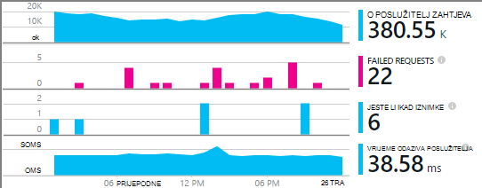

<properties
    pageTitle="Primjer MyDriving Azure IoT: je | Microsoft Azure"
    description="Sastavljanje aplikaciju koja nije potpun pokazni o mijenjanje arhitekture u sustavu IoT pomoću Microsoft Azure, uključujući strujanje analize, strojnog učenja i koncentratora za događaj."
    services=""
    documentationCenter=".net"
    suite=""
    authors="harikmenon"
    manager="douge"/>

<tags
    ms.service="multiple"
    ms.workload="tbd"
    ms.tgt_pltfrm="ibiza"
    ms.devlang="dotnet"
    ms.topic="article"
    ms.date="03/25/2016"
    ms.author="harikm"/>


# <a name="build-and-deploy-the-mydriving-solution-to-your-environment"></a>Stvaranje i njegova implementacija rješenja MyDriving svoje radno okruženje

MyDriving je rješenje Internet stvari (IoT) prikuplja podatke iz automobil, obrađuje pomoću strojnog učenja i prikazuje ih na mobilnom telefonu. Pozadinska sastoji se od brojnih usluge Microsoft Azure. Klijente može biti telefone sa sustavom Android, iOS ili Windows 10.

Koju smo stvorili rješenje MyDriving da bi se dobilo jumpstart u stvaranju IoT sustav. [Spremište MyDriving na GitHub](https://github.com/Azure-Samples/MyDriving), možete dobiti Voditelj resursa Azure skripte za implementaciju arhitektura pozadinske vlastite Azure račun. Od tog trenutka možete konfigurirajte u različitim servisima, mijenjati upite da bi odgovarao vašim podacima i tako dalje. Možete pronaći te skripte – uz kod za mobilne aplikacije, API Azure aplikacije servisa za projekt i drugo – u spremištu MyDriving.

Ako još niste pokušali aplikaciju, pogledajte [Vodič za početak rada](iot-solution-get-started.md).

Postoji detaljan opis arhitektura [MyDriving vodič](http://aka.ms/mydrivingdocs). Ukratko, postoji nekoliko dijelova koje ćemo postavili, a da biste postavili do stvaranje slične projekta:

* **Aplikacije klijenta** pokreće na telefonima sa sustavom Android, iOS i Windows 10. Koristimo platformu Xamarin da biste zajednički koristili velik dio kod koji je pohranjen na GitHub u odjeljku `src/MobileApp`. Aplikaciju zapravo izvodi dvije različite funkcije:
 * Ga preusmjeri telemetrijskih iz uređaja ploči Dijagnostika (OBD) i vlastitu mjesto servisa u sustavu oblaka pozadinskih.
 * To je korisničko sučelje koje korisnici mogu izvršavati upite o njihovim trips snimljena cesta.
* **Servis u oblaku** ingests-krenuti podatke u stvarnom vremenu te ga obrađuje. Glavnom radnom stvaranja taj servis je odaberite, parameterize i žičani gore različite Azure usluge. Neki dijelovi zahtijevaju skripti filtar i proces ulazne podatke. Da biste konfigurirali svi dijelovi koristimo predložak Azure Voditelj resursa.
* **Servis za mobilne uređaje aplikacije** je web-servisa iza dio korisničkog sučelja aplikaciju uređaja. Njegov glavni posao je baza podataka spremljena, obrađeni podataka za upite. Njegov kod je na GitHub u odjeljku `src/MobileAppService`.
* **Visual Studio sa Xamarin** je naš razvojno okruženje. Xamarin koji postoji kao komponentu Visual Studio i kao samostalni integrirano razvojno okruženje (IDE), koristi se za sastavljanje kod različite platforme uređaja. Da biste sastavili kod iOS je potrebno da bi instance komponente Xamarin koji se izvodi na računalu sustava OS X. Ako je potrebno, možete pokrenuti kao agent upravlja se putem Visual Studio.
* **Testiranje jedinica** aplikacija uređaj provodi u oblak Test Xamarin.
* **GitHub** je spremište kojemu ne možemo pohraniti sve kod, skripte i predloške.
* **Team Services za Visual Studio** je servis u oblaku koja se koristi za upravljanje neprekinuti Sastavi i testiranje web-aplikacije servisa i uređaja.
* **HockeyApp** koristi se za raspodjelu izdanja šifre uređaja. Također prikuplja rušenje i korištenje izvješća i povratne informacije korisnika.
* **Uvid aplikacije za Visual Studio** nadzire mobilne web-servisa.

Stoga Pogledajmo kako možemo postaviti svega toga. Imajte na umu da mnoge koraci nisu obavezni.

## <a name="sign-up-for-accounts"></a>Registracija za račune

-   [Osnove razvojni visual Studio](https://www.visualstudio.com/products/visual-studio-dev-essentials-vs.aspx). Ovaj besplatni program omogućuje pristup mnoge alate za razvojne inženjere i servisa, uključujući Visual Studio, Visual Studio Team Services i Azure. Pruža 25 USD/mjesec kreditne kartice na Azure za 12 mjeseci. Obuhvaća i pretplate Pluralsight obuka i Xamarin University. Koje možete se prijaviti zasebno za besplatne razine [Azure](https://azure.com) i [Visual Studio Team Services](https://www.visualstudio.com/products/visual-studio-team-services-vs.aspx), ali ih ne nudi Azure kredita.

-   [HockeyApp](https://rink.hockeyapp.net/) (neobavezno), za upravljanje test distribucija mobilne aplikacije i prikupljanje telemetrijskih.

-   [Xamarin](https://xamarin.com/) (obavezno), za stvaranje aplikacije za mobilne uređaje i pokretanje pokreće ispravljanje pogrešaka i testira na [Xamarin Test oblaka](https://xamarin.com/test-cloud).

-   [GitHub](https://github.com/Azure-Samples/MyDriving/) (neobavezno), da biste stvorili besplatne javno spremištima za vlastitog koda (plaćene privatne spremištima). Osim toga, možete koristiti osnovni plan u Visual Studio Team Services za privatne spremišta.

-   [Power BI](https://powerbi.microsoft.com/) (neobavezno), da biste stvorili obogaćenim vizualizacijama podataka preko cijelog sustava.

> [AZURE.NOTE] Ne morate GitHub račun radi pristupa MyDriving kod u [spremištu GitHub MyDriving](https://github.com/Azure-Samples/MyDriving).

## <a name="install-development-tools"></a>Instalacija alata za razvoj

Sljedeće Instalacija je za razvoj cijelog rješenja: sustava iOS, Android i Windows 10 Mobile aplikaciju za različite platforme, pomoću programa Azure sigurnosno Završi.

Umjesto toga, možete koristiti Xamarin Studio na Mac ili Windows za razvoj mobilne aplikacije ako ne radite na na Azure sigurnosno Završi.

Nema [više opis ovaj će instalacijski program](https://msdn.microsoft.com/library/mt613162.aspx).

### <a name="windows-development-machine"></a>Strojno razvoj sustava Windows

Visual Studio je alat za središnju u sustavu Windows za rad s MyDriving aplikacija za Android i Windows, API aplikacije servisa za projekt i proširenja microservice.

Xamarin, brojka, Emulatora i druge komponente korisne su sve integriran s Visual Studio.

Instalirajte:

-   [Visual Studio 2015 s Xamarin](https://www.visualstudio.com/products/visual-studio-community-vs) (bilo koje izdanje – zajednice je besplatno).

-   [SQLite za platformu univerzalni sustava Windows](https://visualstudiogallery.msdn.microsoft.com/4913e7d5-96c9-4dde-a1a1-69820d615936). Potrebne da biste sastavili kod za Windows 10 Mobile.

-   [Azure SDK za Visual Studio 2015](https://go.microsoft.com/fwlink/?linkid=518003&clcid=0x409). Nudi SDK za pokretanje aplikacije u Azure, zajedno s alati naredbenog retka za upravljanje Azure.

-   [Servis za azure tkanina SDK](http://www.microsoft.com/web/handlers/webpi.ashx?command=getinstallerredirect&appid=MicrosoftAzure-ServiceFabric). Potrebne da biste sastavili [microservice](../service-fabric/service-fabric-get-started.md) nastavak.

Osim toga, provjerite je li imate desnom proširenja za Visual Studio. Provjerite je li u odjeljku **Alati za**vidite **Android, iOS, Xamarin...**. Ako nije, otvorite upravljačku ploču, a zatim odaberite **Programi i značajke** > **Microsoft** > **Visual Studio 2015** > **Izmijeni**. U odjeljku **razvoj različite platforme**, odaberite **C\#/.Net (Xamarin)**. Dok vas nema, provjerite je li instaliran **Brojka za Windows** .

### <a name="mac-development-machine"></a>Mac računala za razvoj

Mac (Yosemite ili noviji) potreban je ako želite razviti za iOS. Premda smo pomoću programa Visual Studio s Xamarin u sustavu Windows za razvoj i upravljanje sav kod, Xamarin koristi agent instalacije na Mac da biste mogli Sastavljanje i prijavite se kod iOS.


(Umjesto toga, koristite Xamarin Studio izravno na računalu Mac razvoju aplikacija za različite platforme.)

Ako ne želite uključiti iOS kao ciljne platforme nije potrebno na Mac

Instalirajte:

-   [Xamarin Studio za iOS](https://developer.xamarin.com/guides/ios/getting_started/installation/mac/). Možete i postaviti Visual Studio i Xamarin na Macu sa sustavom Windows virtualnog računala. Potražite u članku [Postavljanje, instalacija, i verifications za korisnike Mac](https://msdn.microsoft.com/library/mt488770.aspx) na MSDN-u.

-   [Alati za Azure razvoj](https://azure.microsoft.com/downloads/) (neobavezno).

Omogućivanje daljinska prijava za Mac. Otvorite **Mapu postavke sustava** > **zajedničko korištenje**, a zatim **Daljinska prijava**.

Kada otvorite projekt programa iOS u Visual Studio u sustavu Windows, dodatak Xamarin će vas ID-a za Mac.

## <a name="fetch-the-github-repository"></a>Dohvaćanje GitHub spremište

Dohvaćanje lokalnu kopiju [spremište GitHub MyDriving](https://github.com/Azure-Samples/MyDriving) pomoću gumba **Preuzmi ZIP** GitHub i Visual Studio ili u drugi klijent brojka.

Raspakiraj datoteku u mapu pod nazivom kratki put, kao što su C:\\kod.

Osim toga, ako želite zadržati u tijeku s ili zapisuju u našem kod Kloniraj spremište na sljedeći način:

**brojka Kloniraj https://github.com/Azure-Samples/MyDriving.git**

## <a name="get-a-bing-maps-api-key"></a>Ključ u Bing karte API-JA

[Registrirajte se za ključ za API Bing karte](https://msdn.microsoft.com/library/ff428642.aspx).

Morate zamijeniti to u retku 22 u `src/MobileApps/MyDriving/MyDriving.Utils/Logger.cs`.


## <a name="build-the-demo-app"></a>Stvaranje aplikacije pokazni videozapis

Otvorite ova rješenja u Visual Studio:

-   src\MobileApps\MyDriving.SLN

-   src\MobileAppService\MyDrivingService.SLN

-   src\Extensions\ServiceFabric\VINLookUpApplication\VINLookUpApplication.SLN

Prikazat će se traži da:

-   Vjeruj neka potencijalno nepouzdan projekata. Odaberite da biste otvorili ako želite nastaviti.

-   Ako radite na Osvježi računala za Windows 10, postavite programerskom načinu.

-   Unesite vjerodajnice za Xamarin.

-   Povezivanje s Xamarin Mac. Ako nemate Mac, desnom tipkom miša kliknite projekt iOS u Visual Studio, a zatim odaberite **Ukloni iz memorije projekta**.

Ponovno stvaranje rješenja.

Ako imate poteškoća s sastavnih, isprobajte rješenja za quirks koji ste naišli:

-   *Ne učitava se VINLookupApplication projekta*: Provjerite je li instaliran [Azure SDK za Visual Studio 2015](https://go.microsoft.com/fwlink/?linkid=518003&clcid=0x409).

-   *Servis tkanina projekta ne Sastavi*: prvo stvaraju sučelja projekata i provjerite je li instaliran tkanina SDK servisa.

-   *Ne sastavljanje aplikacija za android*:

    -   Otvorite **alate** > **Android** > **Upravitelj SDK za Android**i provjerite je li taj Android 6 (API 23) / SDK Platform je instaliran.

    -   Izbrišite taj imenik, a zatim ponovno stvaranje:<br/>
        `%LocalAppData%\Xamarin\zips`

## <a name="get-to-know-the-code"></a>Upoznavanje s kodom

U rješenje, pronaći ćete:

-   Azure proširenja: tkanina servisa.

-   Azure HDInsight: Skripte za obradu podataka putovanja u Azure.

-   Mobilne aplikacije: Uređaj aplikacije.

-   MobileAppsService/MyDrivingService: Završiti natrag na webu.

-   Power BI: Izvješće definiciju.

-   Skripte:

    -   Voditelj resursa: predlošci da biste sastavili Azure resursi.

    -   PowerShell: Pokretanje skripti predložaka Voditelj resursa.

    -   Azure SQL baze podataka: Ispravljanje pogrešaka baze podataka.

-   SQL baza podataka: CreateTables: definicija sheme.

-   Azure Analytics strujanje: Upite koji transformacija dolazne toka podataka.

## <a name="run-the-apps-in-development-mode"></a>Pokretanje aplikacije u načinu rada za razvoj

Poduzeti da biste pokrenuli aplikacijama, ovisno o uređaju koji koristite:

-  Pozadinska: postavljanje MyDrivingService kao pokretanje projekta i pritisnite F5 da biste pokrenuli web-pozadinskoj usluge. Otvorit će se prikaz preglednika unos API-JA.

-  Mobilni klijenti: [su mobilne aplikacije razvijene u Xamarin](https://developer.xamarin.com/guides/cross-platform/deployment,_testing,_and_metrics/debugging_with_xamarin/).
 -  Android: Detalje potražite u članku [Ispravljanje pogrešaka sa sustavom Android u Xamarin](http://developer.xamarin.com/guides/android/deployment,_testing,_and_metrics/debugging_with_xamarin_android/).

 -  iOS: detalje potražite u članku [značajka ispravljanja pogrešaka u iOS](http://developer.xamarin.com/guides/ios/deployment,_testing,_and_metrics/debugging_in_xamarin_ios/).

 -  Windows Phone: Detalje potražite u članku [Xamarin + Windows Phone](https://developer.xamarin.com/guides/cross-platform/windows/phone/).

## <a name="upload-the-mobile-app-to-hockeyapp"></a>Prijenos aplikacije za mobilne uređaje na HockeyApp

HockeyApp upravlja raspodjele aplikacijom Android, iOS ili Windows da biste testirali korisnika, obavješćivati korisnike nova izdanja. Također prikuplja korisne rušenje izvješća, povratne informacije korisnika s snimke zaslona i korištenje metriku.

[Najprije prijenos](http://support.hockeyapp.net/kb/app-management-2/how-to-create-a-new-app) aplikacije Sastavi. Zatim prijavite [HockeyApp](https://rink.hockeyapp.net) s vašeg računala razvoj. Na nadzornoj ploči za razvojne inženjere, kliknite **Nova aplikacija**, a zatim odvucite ugrađeni datoteke u prozor. (Noviju verziju, možete automatizirati usluge Sastavi da biste to učinili.)

Sada ste u aplikaciji nadzorne ploče.


Ponovite postupak za svaki platformu koja pokreće se aplikacije. Zatim možete učiniti sljedeće:

-  Koristite [ID aplikacije](http://support.hockeyapp.net/kb/app-management-2/how-to-find-the-app-id) na nadzornoj ploči za slanje rušenje podataka i povratne informacije iz aplikacije. U MyDriving, ažurirajte ID-a u src/MobileApps/MyDriving/MyDriving.Utils/Logger.cs.

-  [Pozovi testnih korisnika](http://support.hockeyapp.net/kb/app-management-2/how-to-invite-beta-testers). Dohvaćanje URL-a recruit mogućnost korisnika. Ćete moći registrirati za vaš tim, preuzmite aplikaciju i pošaljite povratne informacije.

-  Ako biste radije više otvorenih beta-izdanje, postavite raspodjele na javno. Kliknite **aplikacija za upravljanje** > **raspodjele** > **Preuzimanje = javno**. Sada svi mogu preuzeti aplikaciju i pošaljite povratne informacije, a oni prikazat će obavijest kada objave novu verziju. Mogla bi vam se neka rušenje izvješća iz njih previše.

    

-  [Veza rušenje izvješća za Visual Studio Team Services](http://support.hockeyapp.net/kb/third-party-bug-trackers-services-and-webhooks/how-to-use-hockeyapp-with-visual-studio-team-services-vsts-or-team-foundation-server-tfs). Kliknite **aplikacija za upravljanje** > **Visual Studio Team Services**. HockeyApp možete automatski stvoriti njegove stavke u tim usluge kad postoje rušenje izvješća ili kada se prima povratne informacije.

Dodatno se informirajte na [web-mjesta HockeyApp](https://hockeyapp.net).

## <a name="test-the-mobile-app-on-xamarin-test-cloud"></a>Testiranje mobilne aplikacije na Xamarin Test oblaka

[Oblak Test Xamarin](https://developer.xamarin.com/guides/testcloud/introduction-to-test-cloud/) automatizira korisničkog Sučelja testirate na uređajima realni u oblaku. Pomoću okvira NUnit pišete testova koji se izvode aplikaciju putem korisničkog sučelja.

Da biste koristili Xamarin, ugraditi [Xamarin.UITests](https://developer.xamarin.com/guides/testcloud/uitest/intro-to-uitest/) SDK u aplikaciju programa, koja se nalazi kao paket NuGet. Pronaći ćete ga u aplikaciji pokazni videozapis pa je uključen prilikom stvaranja novih projekata test s predlošcima Xamarin.


U primjeru test projekt nalazi se u sklopu aplikacije u spremištu. U [MyDriving](https://github.com/Azure-Samples/MyDriving/tree/master/src/MobileAppService)potražite u odjeljku [src](https://github.com/Azure-Samples/MyDriving/tree/master/src)/MobileApps/[MyDriving](https://github.com/Azure-Samples/MyDriving/tree/master/src/MobileApps/MyDriving)/MyDriving.UITests/.

Ako koristite Visual Studio Team Services Sastavi, jednostavno je za pisanje korisničkog Sučelja Xamarin testova jedinica i pokretanje ih kao dio sustava Sastavi.

## <a name="deploy-azure-services"></a>Implementirali servise za Azure

Da biste izvršili automatsko implementacije Azure i Team Services Sastavi services, pročitajte detaljne upute u **scripts/README.md**.

Microsoft Azure nudi mnoštvo različite servise koje možete koristiti da biste sastavili oblaka aplikacije. Iako mnoge se može koristiti pojedinačno (kao što su servis/web-aplikacija), oni se na njih najbolje kada ih se povezana obrazac kao što su integrirani sustava koristimo u MyDriving.

Moguće je stvoriti i ručno interconnect Azure services, ali je mnogo brže i više pouzdane Azure resursa upravitelja predložaka. [Voditelj resursa](../azure-resource-manager/resource-group-overview.md) automatizira implementacije rješenja u resursa i upućivanje interconnections između njih.

Pronaći ćete predložak za sustav MyDriving u spremištu GitHub u odjeljku [Skripte/OKVIRA](https://github.com/Azure-Samples/MyDriving/tree/master/scripts/ARM). Pruža potpun i sažet prikaz kako se u različitim servisima u našem arhitekturi međusobno. Smo sve to detaljno [MyDriving Referentni vodič kroz](http://aka.ms/mydrivingdocs)objašnjavaju, ali možete saznati mnogo samo tako da pročitate kroz sam predložak.

> [AZURE.NOTE] Većina Azure usluga imati pridružene trošak, ovisno o cijenama sloju. Ako ste novi korisnik Azure, možete [ga besplatno pokušajte](https://azure.microsoft.com/free/). Međutim, ako ne namjeravate koristiti neke komponente u sustavu MyDriving, obavezno ih da biste izbjegli povećavanja troškova ukloniti. U odjeljku "Procjenu radu troškove" u nastavku ovog članka sažetka troškova tipičnog servisa.

### <a name="edit-the-template"></a>Uređivanje predloška

Da biste prilagodili svoju implementaciju možda da biste uklonili nepotrebne komponente ili da biste dodali druge sudionike, najprije provjerite kopije scenarij\_complete.params.json i scenarij\_complete.json u koju želite promijeniti.

Možete koristiti scenarij\_complete.params.json datoteku da biste nadjačali zadane vrijednosti, kao što je servis SKU ili vrsti replikacije prostora za pohranu, kao što je opisano u sljedećoj tablici. Zadane vrijednosti odaberite željene mogućnosti najniže trošak.

| **Parametar**         | **Opis**                | **Zadana vrijednost** |
|--------|---------|-------|
| Koncentrator IoT SKU           | Razina servisa Azure IoT koncentratora | F1                |
| Vrsta računa za pohranu  | Vrsta replikacije prostora za pohranu       | Standardni LRS      |
| Cilj servisa SQL | Potrošnje istodobnosti vremensko razdoblje   | DW100             |
| Hostinga Plan SKU      | Plan usluge za aplikacije servisa   | F1                |

U slučaju\_complete.json:

-   Potražite "baseName" i promijenite naziv koje vam se sviđa.

-   Traženje "Stvaranje". Svaki od tih sekcija stvara resurs.

-   Postavite sqlServerAdminLogin i sqlServerAdminPassword odgovarajuće vrijednosti.

-   Prije brisanja sekcije koju stvara resursa, potvrdite je ima li zavisne traženjem nazivu neko drugo mjesto u datoteci. Imajte na umu da svaku sekciju koju stvara servisa sadrži *dependsOn* odjeljak s popisom njezine ovisnosti.

Evo što konfigurira predložak. Pojedinosti nalaze se u [Vodič](http://aka.ms/mydrivingdocs).

| **Servis**                 | **Opis i detalja**  
|---|----
| Računi za pohranu            | Predložak se stvara tri računa:                                                                                                                                                                       
|| -Bazom podataka SQL koja prima pridružuje telemetrijskih strujanje analize i služi kao spremište sigurnosnom za aplikacije servisa za Azure tablice koji izlažu te podatke putem krajnje točke API-JA.                      
|| -Blobova koji akumulira povijesne podatke iz Promijeni posao strujanje analize obraditi HDInsight.                                                                                         
|| -Bazom podataka SQL koja prima rezultate obradili HDInsight za korištenje s dodatkom Power BI.                                                                                                                 
| Azure IoT koncentratora                     | Uspostavlja dvosmjernu vezu za svaki povezani uređaj. U rješenje MyDriving mobilne aplikacije ponaša se kao polje pristupnika slanje podataka Azure IoT koncentrator. Azure IoT koncentrator zatim služi kao ulaz strujanje analize. |
| Azure događaj koncentratora                   | Izlaz za strujanje analize zadatak koji redovi Izlaz na proširenja koje su stvorene pomoću tkanina servisa Azure.                                                                                               
| Data Warehouse Azure SQL          |                                                                                                                                                                                                            
| Strujanje Analitika poslova | Povezivanje unosa i izlaza pomoću upita koji se koristi za zbrajanje i podataka u stvarnom vremenu i povijesnim aplikacije API servisa Azure strojnog učenja, proširenja te Power BI.                               
| Upoznavanje radnog prostora na računalu  | Obuhvaća eksperimenata, R kod i API servisa.                                                                                                                                                              
| Tvorničke Azure podataka                | Zakazano retraining strojnog učenja.                                                                                                                                                                     
| Tkanina usluge hostinga plan | Za nastavak.                                                                                                                                                                                            
| Aplikacije servisa ("mobilne aplikacije")  | Glavno računalo API mobilne aplikacije za project koja omogućuje krajnje točke za aplikacije za mobilne uređaje. Kod API mora biti implementirano u aplikacije servisa iz Visual Studio.                                                         
| Upozorenja pravila                 | Šalje vam e-pošte ako odgovore aplikacije odredite pogreške.                                                                                                                                            
| Aplikacija uvida        | Za praćenje performansi API-ji aplikacije servisa. Morate konfigurirati vezu u Visual Studio.                                                                                          
| Azure sigurnog ključa                   | Za spremanje certifikat za klaster web servisa.                                                                                                                                                                

### <a name="run-the-template"></a>Pokretanje predloška

U **scripts/README.md**postoje detaljne upute za izvođenje predložak.

Dodjela tih servisa vlastiti račun za Azure pomoću skripte, učinite nešto od sljedećeg:

-   Korištenje ljuske PowerShell:

    ```

    cd scripts/PowerShell;
    deploy.ps1 *location* *resourceGroupName*
    ```

 -   *mjesto* je [Azure mjesto](https://azure.microsoft.com/regions/), kao što su `North Europe` ili `West US`. Korištenje `Get-AzureLocation` da biste pronašli popis dostupnih mjesta.

 -   *resourceGroupName* je naziv koji želite dati grupi kojoj će pripadati svih resursa. Kada ste gotovi s resursima, možete ih izbrisati sve zajedno tako da izbrišete ovu grupu.

-   Pokretanje DeploymentScripts/Bash/deploy.sh s tulumu.

-   Otvaranje i stvaranje rješenja za Visual Studio DeploymentScripts/VS/DeployARM.sln.

Imajte na umu da svaki put kada se pokrene predložak, stvara novi skup resursa s novim nazivima. Da biste izbrisali resursa, otvorite portal i brisanje grupa resursa.

Ne uspijete skriptu iz bilo kojeg razloga, možete ponovno ga pokrenuti.

Skripta daje mogućnost konfiguriranja neprekinuti integracija u Visual Studio Team Services. Ako ste postavili Team Services projekta, morat ćete URL: https://yourAccountName.visualstudio.com. Kad se pojavi upit, unesite cijeli URL. Možete joj dodijeliti naziv novi ili postojeći projekt Team Services.

## <a name="set-up-build-and-test-definitions-in-visual-studio-team-services"></a>Postavljanje međuverzije i testiranje definicije u Visual Studio Team Services

Koristimo Team Services na taj projekt uglavnom za njegov Sastavi i testirati značajke. No pruža podršku za suradnju izvrstan, kao što je upravljanje zadacima sa Kanban ploče, kod pregled integrirane sa zadacima i kontrola izvora i gated sastavlja. Integrira s druge alate kao što su GitHub, Xamarin, HockeyApp i Naravno, Visual Studio. Možete joj pristupiti putem web-sučelja ili Visual Studio, što god bilo praktičnije u bilo kojem trenutku.

Koraci u definicije Sastavi i ispustite pomoću raznih dodatak koje su usluge dostupne Team Services [trgovine](https://marketplace.visualstudio.com/VSTS). Uz osnovne uslužnih pokretanja naredbe ili kopiranja postoje servisa koji pozivanje izgradi Xamarin, Android i drugi proizvođači i povezati HockeyApp.


### <a name="build-definitions"></a>Sastavljanje definicije

Imamo Sastavi definicije za svaku glavni ciljeve. Imamo i varijacija za značajku i testiranje regresije. Koji daje nam:

-   MyDriving.Services (web-pozadinskoj aplikaciju za mobilne aplikacije)

-   MyDriving.Xamarin.Android

    -   MyDriving.Xamarin.Android značajki

    -   MyDriving.Xamarin.Android regresije

-   MyDriving.Xamarin.iOS

    -   MyDriving.Xamarin.iOS značajki

    -   MyDriving.Xamarin.iOS regresije

-   MyDriving.Xamarin.UWP

    -   MyDriving.Xamarin.UWP značajki

    -   MyDriving.Xamarin.UWP regresije

Ako želite vidjeti sve detalje naš konfiguracije potražite u odjeljku 4,7 [MyDriving Referentni vodič kroz](http://aka.ms/mydrivingdocs)"Sastavi i konfiguracija izdanje." Slijede isti uzorak Općenito. Skripta:

1.  Vraća NuGet paketa. Ne možemo Nemoj čuvati kompilirani kod u spremištu, pa su prvi koraci svaki Sastavi da biste vratili potrebna NuGet paketa.

2.  Aktivira licencu. Sastavljanje provodi u oblaku, tako da pri čemu je potrebna licenca – posebno servisa za sastavljanje Xamarin – imamo da biste aktivirali naš licence na trenutnom računalu Sastavi. Zatim ćemo ga deaktivirati odmah nakon toga dopustili koristiti na nekom drugom računalu.

3.  Sastavlja pomoću odgovarajuće usluge. Koristimo izgradi Xamarin za mobilne aplikacije i Visual Studio sastavlja za web-pozadinskoj usluge.

4.  Sastavlja testira.

5.  Pokreće se testira. Ne možemo pokrenuti testove mobilne aplikacije u oblak Test Xamarin.

6.  Rezultat Sastavi objavljuje na odredišno mjesto.

Okidača za glavnog izdanja postavljen je na Neprekinuti integracije. To jest, sastavljanje se pokreće svaki put kod prijavljene na glavni grani.


### <a name="release-definitions"></a>Definicija izdanje

Definicija izdanje postavljaju na približno na isti način.

Za web-servisa ne možemo postaviti implementacije kao Azure web-aplikaciju programa:


I ne možemo postaviti okidača izdanje neprekinuti implementacije. To jest, svaka prijavi slijedi uspješno Sastavi rezultira ažuriranje web App.


Za mobilne aplikacije ćemo uvesti HockeyApp:


## <a name="explore-telemetry-by-using-application-insights"></a>Istražite telemetrijskih pomoću aplikacije uvida

[Aplikacija uvide](../application-insights/app-insights-overview.md) prikuplja telemetrijskih o performansama i korištenje web-servisa. SDK uvida aplikacije šalje telemetrijskih iz servisa resursa aplikacije uvida u Azure.

Otvorite aplikaciju uvida resurs koji predložak postavljanje. Postoji, možete istražiti grafikoni performansi [mobilne aplikacije servisa za projekt](https://github.com/Azure-Samples/MyDriving/tree/master/src/MobileAppService). Prikazane poslužitelj zahtjeva i odgovora vremena, pogrešaka, te broji iznimke. Postoje i grafikoni ovisnost odgovor puta – odnosno pozivi u bazu podataka i REST API-ji kao što su strojnog učenja. Ako postoje problemi performanse, ćete moći vidjeti što dio sustava uzrokuje ih.



Ako imate web-servisa koji ste postavili ručno, je jednostavno dobiti isti grafikona. Na servis plohu web kliknite **Alati** > **proširenja** > **Dodaj**. Odaberite **aplikaciju uvide**.


Ta značajka funkcionira po instrumenting aplikacije s uvide SDK aplikacije.

Dodavanjem [Uvida SDK aplikacije](../application-insights/app-insights-asp-net.md) trenutku razvoj možete dodati prilagođene telemetriju (ili instrument aplikacije koja se izvodi negdje izvan Azure). To je korisno za metriku zapisnika koja ovisi o aplikaciji, kao što su korisnika putovanja Prosječna duljina ili ukupni iznos. U Visual Studio, desnom tipkom miša kliknite projekt, a zatim **Dodavanje aplikacije uvide**.


Uvida aplikacija će poslati upozorenja e-pošte ako ne vidi neobično brojeva odgovora nije uspjelo. Možete postaviti i vlastitu upozorenja na razne metrika, kao što su vrijeme odaziva.

Samo da biste bili sigurni da web-servisa uvijek prema gore i pokrenuti, možete postaviti [testira dostupnost](../application-insights/app-insights-monitor-web-app-availability.md). Te se testira pomoću naredbe ping web-mjesta s različitih mjesta diljem svijeta svakih 15 minuta. Ponovno, dobit ćete poruku e-pošte ako postoji čini se da je problem.

## <a name="estimate-operational-costs"></a>Procjena radu troškovi

To je remarkably jeftini da biste pokrenuli aplikaciju poput ove pri small mjerilo. Mnoge usluga da bi razvoja i manjih razmjera operacija cijena vrlo malo imati besplatne entry-level razine. A Naravno, vlastite aplikacije ne morate koristiti sve značajke planirati MyDriving.

Evo gruba Procjena naš troškova u odjeljku Postavljanje konfiguracija razvoj za MyDriving. Ne možemo Imajte na umu i neke alternative koje ćemo jeste li *ne* koristi. Ove informacije možda biti korisno prilikom procjene vlastite troškove.

Pretpostavimo da:

-   Tim više od pet (plus opažanja zainteresiranih strana).

-   Pokrenut o mjesec.

-   100 korisnika s četiri trips prema danu.

>[AZURE.NOTE] Ako ste novi korisnik Azure, postoji [besplatan račun](https://azure.microsoft.com/free/).

| **Komponenta/servis**  | **Bilješke** | **Trošak/mjesec** |
|--------|--------|----------------|
| [Visual Studio 2015 zajednice](https://www.visualstudio.com/products/visual-studio-community-vs) s [Xamarin](https://visualstudiogallery.msdn.microsoft.com/dcd5b7bd-48f0-4245-80b6-002d22ea6eee) <br/>Različite platforme razvojni okruženje| Visual Studio zajednice. (Morate [Visual Studio Professional](https://www.visualstudio.com/vs-2015-product-editions) za [Xamarin.Forms](https://xamarin.com/forms), za dizajniranje više platformi iz jedne kod osnovni.)  | 0 kn   |
| [Azure IoT koncentratora](https://azure.microsoft.com/pricing/details/iot-hub/) <br/>Dvosmjerna podatkovne veze na uređaje | + 0,5 KB/poruke besplatne 8.000 poruke. | 0 kn             |
| [Strujanje Analytics](https://azure.microsoft.com/pricing/details/stream-analytics/)  <br/>   Obrada podataka strujanje visoku glasnoću                                                                                                                                                              | Trošak $0.031 po strujanje jedinica sat, dok je omogućena. Odaberite broj strujanje jedinice u kojima želite. Dodatne informacije skaliranja. | $23            |
| [Upoznavanje s računala](https://azure.microsoft.com/documentation/services/machine-learning/)<br/> Prilagodljivo odgovore                                                                                                                                                                              |  $10/licenci/mjesec. <br/>                                                                                                                                                                                 + 3 sata eksperiment \* $1 / Poigrajte sat. <br/>                                                                                                                                                           + 3.5-satnom API procesora \* $2 / radnog procesora sat. <br/>                                                                                                                                                          Vrijeme procesora API pretpostavlja 5 min/dan retraining, iako to činite pokazivači s više ulaznih podataka.                   <br/>                                                                                                                                                                     + 2 min /-dnevna bilježenje rezultata za obradu 400 trips/dan.  | 20 USD            |
| [Aplikacije servisa](https://azure.microsoft.com/pricing/details/app-service/)  <br/> Glavno računalo za mobilne pozadinskih                                                                                                                                                                              | Razina B1 – radnog web-aplikacije. | $56            |
| [Visual Studio Team Services](https://azure.microsoft.com/pricing/details/visual-studio-team-services/)  <br/> Sastavljanje test jedinica i upravljanje izdanje; Upravljanje zadacima | Privatni agenata pet korisnika.| 0 kn             |
| [Aplikacija uvida](https://azure.microsoft.com/pricing/details/application-insights/) <br/>Praćenje performansi i način korištenja web-servisima i web-mjesta| Besplatni sloju.  | 0 kn             |
| [HockeyApp](http://hockeyapp.net/pricing/) <br/> Distribucija aplikacija beta plus skup povratne informacije, korištenje i pad podataka                                                                                                                                      | Dva besplatne aplikacije za nove korisnike.<br/> $30/ mjesec nakon toga.  | 0 kn    |
| [Xamarin](https://store.xamarin.com/)<br/> Kod na uniform platformu za više uređaja | Besplatnu probnu verziju. <br/>25 USD/mjesec nakon toga.| 0 kn    |
| [Baze podataka SQL](https://azure.microsoft.com/pricing/details/sql-database/) Azure servisa za aplikaciju| Osnovni sloju. jedan model baze podataka. | $5             |
| [Tkanina servisa](https://azure.microsoft.com/pricing/details/service-fabric/) (neobavezno)  | Pokrenite lokalne klaster. | 0 kn             |
| [Power BI](https://powerbi.microsoft.com/pricing/)<br/> Svestrane prikazuje i istrage strujanjem i statične podataka| Besplatni sloju: 1 GB, 10 000 redaka/h, dnevno osvježavanja. <br/> $10/korisnik/mjesec za [veća ograničenja](https://powerbi.microsoft.com/documentation/powerbi-power-bi-pro-content-what-is-it/), dodatne mogućnosti povezivanja, suradnju.    | 0 kn             |
| [Prostor za pohranu](https://azure.microsoft.com/pricing/details/storage/)   | L (lokalno suvišnih) &lt; $0.024 GB 100 G.  | $3             |
| [Tvorničke podataka](https://azure.microsoft.com/pricing/details/data-factory/)                                                                                                                       | $0.60 po aktivnosti \* (FOC 8-5).| $2             |
| [HDInsight](https://azure.microsoft.com/pricing/details/hdinsight/) <br/>  Klaster na zahtjev za dnevni retraining   | Tri čvorove A3 pri $0.32/ sata dnevno 1 h * 31 dan. | 30 USD            |
| [Događaj koncentratora](https://azure.microsoft.com/pricing/details/event-hubs/)  | Osnovni putem jedinica propusnost $11/ mjesec + $0.028 ingress. | $11            |
| OBD dongle  || $12            |
| **Ukupni zbroj**|    | **157 $**       |

Dodatne informacije potražite u članku:

-   Sažetak [Azure service kvotama i ograničenja](../azure-subscription-service-limits.md#iot-hub-limits)

-   [Cijene Kalkulator](https://azure.microsoft.com/pricing/calculator/) Azure

## <a name="send-us-your-feedback"></a>Pošaljite nam povratne informacije

Budući da ne možemo vlastitu sustavi IoT stvorili MyDriving da biste lakše jumpstart, certainly želimo mišljenje o koliko će se dobro funkcionira. Javite nam ako:

-  Naiđete na poteškoće ili izazove.

-  Postoji točku proširenje da bi neka prikladniji za vaš scenarij.

-  Pronađite učinkovitiji način da biste izvršili određenim potrebama.

-  Imate sve prijedloge za poboljšanje MyDriving ili ove dokumentacije.

Da biste poslali povratne informacije, datoteku [problem na GitHub] ili ostavite komentar ispod (en-us edition).

Ne možemo izgled naprijed sluha od vas!

## <a name="next-steps"></a>Daljnji koraci

Preporučujemo [MyDriving Referentni vodič kroz](http://aka.ms/mydrivingdocs)koje je potpun opis dizajna sustava i njegove komponente.
