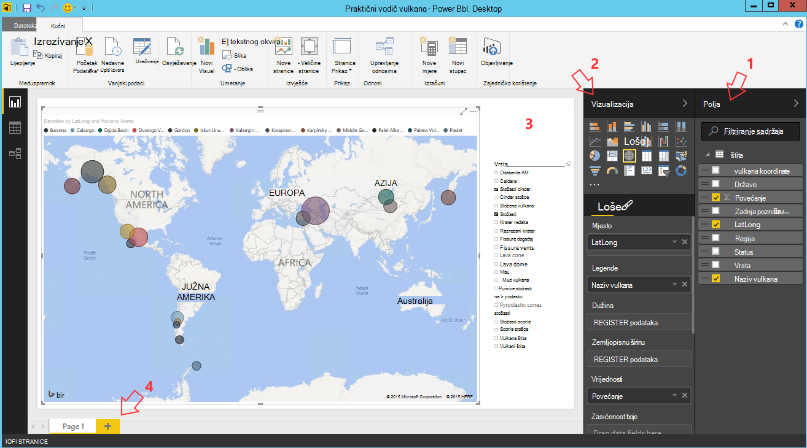

<properties
    pageTitle="Deset stvari koje možete obaviti na znanstvenog podataka virtualnog računala | Microsoft Azure"
    description="Izvršiti razne Istraživanje podataka i Modeliranje zadatka znanstvenog podataka virtualnog računala."
    services="machine-learning"
    documentationCenter=""
    authors="bradsev"
    manager="jhubbard"
    editor="cgronlun"  />

<tags
    ms.service="machine-learning"
    ms.workload="data-services"
    ms.tgt_pltfrm="na"
    ms.devlang="na"
    ms.topic="article"
    ms.date="08/29/2016"
    ms.author="gokuma;weig;bradsev" />

# <a name="ten-things-you-can-do-on-the-data-science-virtual-machine"></a>Deset stvari koje možete obaviti na znanstvenog podataka virtualnog računala

Microsoft podatke znanstvenog virtualnog računala (DSVM) je Napredna razvojno okruženje znanstvenog koji omogućuje izvođenje različite podataka Istraživanje i Modeliranje zadatke. Okruženje već isporučuje ugrađeni i paketu sa nekoliko alata analize popularne podataka koje olakšavaju brzi početak s analize na lokalnom oblaka ili hibridnoj implementaciji. Na DSVM usko surađuje s mnogo servisa Azure i može pročitati i obrada podataka koji je već pohranjena na Azure, u Azure SQL Data Warehouse, Lake Azure podataka, a zatim Azure prostora za pohranu ili DocumentDB. Možete koristiti i druge alate za analize, kao što su Azure strojnog učenja i tvorničke Azure podataka.


U ovom članku vodit ćemo vas kroz kako koristiti svoje DSVM za izvođenje različite zadatke znanstvenog podataka te interakcije s drugih servisa za Azure. Evo nekoliko stvari koje možete učiniti na na DSVM:

1. Istraživanje podataka i razvoj modelima lokalno na DSVM pomoću Python Microsoft R Server
2. Korištenje bilježnice Jupyter eksperimentiranje s podacima o pregledniku pomoću Python 2, Python 3 Microsoft R i enterprise spreman verziju R namijenjen skalabilnost i performanse
3. Operationalize modela izgrađene pomoću R i Python na Azure strojnog učenja da klijentskim aplikacijama mogli pristupati vaše modelima koristeći sučelje jednostavne web services
4. Administriranje Azure pomoću portala za Azure ili Powershell resursi
5. Proširivanje prostora za pohranu i zajedničko korištenje velikih skupova podataka / kod preko cijele tim stvaranjem programa Azure pohrani kao pretvoriti pogon na vašem DSVM
6. Isti broj s timom pomoću Github i pristup vašem spremište pomoću unaprijed instaliranih brojka klijente - tulumu brojka brojka GUI.
7. Pristup različite Azure podataka i analitiku servise kao što su spremište blobova platforme Azure Lake Azure podataka, Azure HDInsight (Hadoop), a zatim Azure DocumentDB Azure SQL Data Warehouse & baze podataka
8. Stvaranje izvješća i nadzorne ploče pomoću dodatka Power BI Desktop unaprijed instalirano u DSVM i uvesti ih u oblak
9. Dinamički skaliranje vaše DSVM potrebama projekta
10. Kliknite pločicu dodatne alate virtualnog računala   


>[AZURE.NOTE] Naknade za korištenje dodatnih će se primijeniti za mnoge dodatnih podataka za pohranu i analitiku usluge navedeni u ovom članku. Pogledajte na stranicu [Azure cijene](https://azure.microsoft.com/pricing/) detalje.


**Preduvjeti**

- Trebat će vam Azure pretplate. Možete se prijaviti za na besplatnu probnu [ovdje](https://azure.microsoft.com/free/).

- Upute za dodjelu resursa podataka znanstvenog virtualnog računala na portalu za Azure dostupne su na [Stvaranje virtualnog računala](https://portal.azure.com/#create/microsoft-ads.standard-data-science-vmstandard-data-science-vm).

## <a name="1-explore-data-and-develop-models-using-microsoft-r-server-or-python"></a>1. istraživati podatke i razvoj modela pomoću Microsoft R Server ili Python

Jezike poput R i Python možete koristiti da biste učinili vaše analize podataka na desno na DSVM.

Za R, možete koristiti za IDE pod nazivom "Revolucija R Enterprise 8.0" koje možete pronaći na izborniku start ili na radnu površinu. Microsoft nudi dodatne biblioteke pri vrhu na Otvori izvor/CRAN-R da biste omogućili skalabilni analize i mogućnost da biste analizirali podatke veća od veličine memorije dopušteno tako da učinite paralelno chunked analizu. Možete instalirati i programa IDE R po izboru kao što je [RStudio](https://www.rstudio.com/products/rstudio-desktop/).

Za Python, možete koristiti na IDE kao što su Visual Studio zajednice Edition koja ima Python alate za proširenje za Visual Studio (PTVS) unaprijed instalirano. Prema zadanim postavkama, samo osnovne 2.7 Python konfiguriran na PTVS (bez bilo koje biblioteke analitičke podatke kao što su SciKit, Pandas). Da biste omogućili Anaconda Python 2.7 i 3.5, trebali biste učiniti sljedeće:

* Stvaranje prilagođene okruženja za svaku verziju tako da odete **Alati** -> **Python Alati** -> **Python okruženja** , a zatim kliknete "**+ prilagođene**" u Visual Studio 2015 zajednice izdanju
* Dati opis i postavite prefiks putova okruženje kao *c:\anaconda* za Anaconda Python 2.7 ili *c:\anaconda\envs\py35* za Anaconda Python 3.5
* Kliknite **Automatsko prepoznavanje** , a zatim **Primijeni** da biste spremili u okruženju.

Evo kako postavljanje prilagođene okruženje izgleda u Visual Studio.


Potražite u [dokumentaciji PTVS](https://github.com/Microsoft/PTVS/wiki/Selecting-and-Installing-Python-Interpreters#hey-i-already-have-an-interpreter-on-my-machine-but-ptvs-doesnt-seem-to-know-about-it) dodatne informacije o stvaranju Python okruženja.

Sada su postavljate da biste stvorili novi projekt Python. Dođite do **datoteke** -> **Novo** -> **projekta** -> **Python** i odaberite vrstu aplikacije Python su sastavljanjem. Možete postaviti Python okruženja za trenutni projekt u željenoj verziji (Anaconda 2.7 ili 3.5): desnom tipkom miša kliknite **Python okruženja**, odaberite **Dodaj/Ukloni Python okruženja**, a zatim odaberite željeni okruženje za pridruživanje projekta. Možete pronaći dodatne informacije o radu s PTVS na stranici [dokumentaciju](https://github.com/Microsoft/PTVS/wiki) proizvoda.

## <a name="2-using-a-jupyter-notebook-to-explore-and-model-your-data-with-python-or-r"></a>2. korištenju bilježnica Jupyter Istraživanje i Modeliranje podataka pomoću Python ili R

Bilježnica Jupyter je Napredna okruženju u kojem se nudi na utemeljenima na pregledniku "IDE" za istraživanje podataka i Modeliranje. U bilježnici Jupyter možete koristiti Python 2, Python 3 ili R (Otvori izvor i Microsoft R Server).

Da biste pokrenuli Jupyter bilježnice klikom na ikonu izbornika start / ikone na radnoj površini pod naslovom **Jupyter bilježnice**. Na na DSVM možete pregledavati na "https://localhost:9999 /" da biste pristupili Jupiter bilježnice. Ako se to od vas traži lozinku, stvorite jaku lozinku za pristup bilježnici Jupyter pomoću upute u odjeljku ***Stvaranje neprobojne lozinke na poslužitelju bilježnice Jupyter*** teme [dodjele Microsoft podataka znanstvenog virtualnog računala](machine-learning-data-science-provision-vm.md) . 

Kada ste otvorili bilježnicu, vidjet ćete direktorij koja sadrži nekoliko primjera bilježnice koje su unaprijed zapakirani u na DSVM. Sada možete učiniti sljedeće:

- Kliknite bilježnicu da biste vidjeli šifru.
- izvršavanje svaku ćeliju pritiskom na kombinaciju tipki **SHIFT ENTER**.
- Klikom na cijele bilježnice na **ćeliju** -> **pokretanje**
- Stvaranje nove bilježnice klikom na ikonu Jupyter (lijevom gornjem kutu) i klikom na gumb **Novo** na desnoj strani, a odabir jezika za bilježnicu (poznat i kao jezgre).   


>[AZURE.NOTE] Trenutačno podržavamo Python 2.7, Python 3.5 i R. Otklanjanje R podržava programiranje i Otvori izvor R kao i tvrtki skalabilni Microsoft R Server.   


Kad se nalazite u bilježnici možete istraživati podatke, sastavljanje model, testirajte modela pomoću izboru biblioteka.


## <a name="3-build-models-using-r-or-python-and-operationalize-them-using-azure-machine-learning"></a>3. Unaprjeđivanje modela pomoću R ili Python i Operationalize ih Azure strojnog učenja

Nakon što u komponenti i provjeriti modela sljedeći je korak obično za implementaciju u radnog. Aplikacija za pozivanje modela predviđanja u stvarnom vremenu ili na temelju način obrade time vaš klijent. Azure strojnog učenja nudi mehanizam za operationalize modela ugrađena R ili Python.

Kada operationalize modela u Azure strojnog učenja, prikazuje se web-servisa koji omogućuje klijenata za OSTALE pozive koje prenesite ulazne parametre i primate predviđanja iz modela kao izlaza.   


>[AZURE.NOTE] Ako niste prijavili za AzureML, možete dobiti slobodnog prostora standardne radnog prostora posjetite početnu stranicu [AzureML Studio](https://studio.azureml.net/) i klikom na "Započnite rad".   


### <a name="build-and-operationalize-python-models"></a>Sastavljanje i Operationalize Python modeli

Ovdje se nalazi isječak koda razvijene u bilježnici Jupyter Python koji unapređuje jednostavne modela pomoću SciKit Saznajte biblioteku.

    #IRIS classification
    from sklearn import datasets
    from sklearn import svm
    clf = svm.SVC()
    iris = datasets.load_iris()
    X, y = iris.data, iris.target
    clf.fit(X, y)

Način koji se koristi za implementaciju sustava python modela Azure strojnog učenja prelama predviđanje modela u funkciji i decorates atribute koje ste dobili od unaprijed instaliranih Azure strojnog učenja python biblioteke, a koje označavanje Azure strojnog učenja radni prostor ID-a, ključ za API-JA i unos i vratili se parametri.  

    from azureml import services
    @services.publish(workspaceid, auth_token)
    @services.types(sep_l = float, sep_w = float, pet_l=float, pet_w=float)
    @services.returns(int) #0, or 1, or 2
    def predictIris(sep_l, sep_w, pet_l, pet_w):
    inputArray = [sep_l, sep_w, pet_l, pet_w]
    return clf.predict(inputArray)

Klijent sada možete upućivati pozive na web-servisa. Postoje wrappers praktičnost koji sastavljanje zahtjeva za REST API-JA. Evo uzorak koda za web-servisa.

    # Consume through web service URL and keys
    from azureml import services
    @services.service(url, api_key)
    @services.types(sep_l = float, sep_w = float, pet_l=float, pet_w=float)
    @services.returns(float)
    def IrisPredictor(sep_l, sep_w, pet_l, pet_w):
    pass

    IrisPredictor(3,2,3,4)


>[AZURE.NOTE] Biblioteka Azure strojnog učenja podržano je samo na Python 2.7 trenutno.   


### <a name="build-and-operationalize-r-models"></a>Sastavljanje i Operationalize R modeli

Možete implementirati R modela koji se temelji na podataka znanstvenog virtualnog računala ili nekog drugog mjesta na Azure strojnog učenja na način koji je slična kako to učiniti za Python. Svoj su navedeni koraci:

- Stvaranje datoteke settings.json kao ispod radni prostor ID-a i provjeru autentičnosti tokena.
- pisanje na omot za u model predviđanje (opis funkcije).
- pozivanje ```publishWebService``` u biblioteci Azure strojnog učenja prenesite omot (opis funkcije).  

Evo isječci postupak i kod koji se mogu koristiti za postavljanje, sastavljanje, objavljivanje i zauzeti model kao web-servisa u Azure strojnog učenja.

#### <a name="setup"></a>Postavljanje

1.  Instalirajte paket AzureML R tako da upišete ```install.packages("AzureML")``` Revolucija R Enterprise 8.0 IDE ili vaše IDE R.
2.  Preuzmite RTools iz [ovdje](https://cran.r-project.org/bin/windows/Rtools/). Potreban vam je uslužni zip u put (i imenovani zip.exe) na vašem paketu R operationalize u AzureML.
3.  Stvaranje datoteke settings.json u odjeljku direktorij pod nazivom ```.azureml``` u odjeljku osnovne mape, a zatim unesite parametre iz Azure ML radnog prostora:

Settings.JSON struktura datoteke:

    {"workspace":{
    "id"                  : "ENTER YOUR AZUREML WORKSPACE ID",
    "authorization_token" : "ENTER YOUR AZUREML AUTH TOKEN"
    }}


#### <a name="build-a-model-in-r-and-publish-it-in-azure-ml"></a>Stvaranje modela u R i objava u Azure ML

    library(AzureML)
    ws <- workspace(config="~/.azureml/settings.json")

    if(!require("lme4")) install.packages("lme4")
    library(lme4)
    set.seed(1)
    train <- sleepstudy[sample(nrow(sleepstudy), 120),]
    m <- lm(Reaction ~ Days + Subject, data = train)

    # Define a prediction function to publish based on the model:
    sleepyPredict <- function(newdata){
        predict(m, newdata=newdata)
    }

    ep <- publishWebService(ws, fun = sleepyPredict, name="sleepy lm", inputSchema = sleepstudy, data.frame=TRUE)

#### <a name="consume-the-model-deployed-in-azure-ml"></a>Korištenje model implementiran u Azure ML

Trošiti modela iz klijentska aplikacija koristimo Azure strojnog učenja biblioteke da biste potražili objavljenu web-servisa pomoću naziva u `services` API poziva da biste odredili krajnju točku. Zatim jednostavno zovete u `consume` funkcija i prenesite okvir podataka da biste se predviđati.
Sljedeći kod koristi se za zauzeti modela objavljena kao na web-servisa Azure strojnog učenja.


    library(AzureML)
    library(lme4)
    ws <- workspace(config="~/.azureml/settings.json")

    s <-  services(ws, name = "sleepy lm")
    s <- tail(s, 1) # use the last published function, in case of duplicate function names

    ep <- endpoints(ws, s)

    # OK, try this out, and compare with raw data
    ans = consume(ep, sleepstudy)$ans

Dodatne informacije o biblioteci Azure strojnog učenja R moguće je pronaći [u nastavku](https://cran.r-project.org/web/packages/AzureML/AzureML.pdf).


## <a name="4-administer-your-azure-resources-using-azure-portal-or-powershell"></a>4. administriranje Azure pomoću portala za Azure ili Powershell resursi

U DSVM ne samo omogućuje sastavljanje rješenje analize lokalno na virtualnog računala, ali omogućuje vam pristup servisima na tvrtke Microsoft Azure oblaka. Azure nudi nekoliko računalnim, za pohranu, usluge analize podataka i ostale servise koje možete upravljati i pristupiti iz vaše DSVM.

Za administraciju Azure resursi web-mjesto pretplata i u okvir za oblak pomoću preglednika i pokažite na [portal za Azure](https://portal.azure.com). Azure Powershell možete koristiti i za administraciju Azure pretplate i resursima putem skripte.
Azure Powershell možete pokrenuti iz prečac na radnoj površini ili na izborniku start pod naslovom "Microsoft Azure Powershell". Pogledajte [dokumentaciju Microsoft Azure Powershell](../powershell-azure-resource-manager.md) dodatne informacije o načinu možete upravljati Azure pretplate i resurse pomoću skripte komponente Windows Powershell.


## <a name="5-extend-your-storage-space-with-a-shared-file-system"></a>5. proširivanje prostor za pohranu sustavom zajedničke datoteke

Fizičari podataka možete zajednički koristiti velikih skupova podataka, kod ili drugih resursa unutar tima. DSVM sam sadrži oko 70GB prostora. Da biste proširili prostora za pohranu, možete upotrijebiti servis za Azure datoteke i ili ga postaviti na na DSVM ili joj pristupiti putem REST API-JA.   


>[AZURE.NOTE] Maksimalna prostora servisa Azure datoteke koji se zajednički koristi je 5 Terabajta i ograničenje veličine pojedinačne datoteke je 1TB.   


Azure Powershell možete koristiti da biste stvorili zajedničko korištenje programa servisa Azure datoteke. Evo skripte za pokretanje u odjeljku Azure PowerShell da biste stvorili programa za zajedničko korištenje datoteka Azure servisa.

    # Authenticate to Azure.
    Login-AzureRmAccount
    # Select your subscription
    Get-AzureRmSubscription –SubscriptionName "<your subscription name>" | Select-AzureRmSubscription
    # Create a new resource group.
    New-AzureRmResourceGroup -Name <dsvmdatarg>
    # Create a new storage account. You can reuse existing storage account if you wish.
    New-AzureRmStorageAccount -Name <mydatadisk> -ResourceGroupName <dsvmdatarg> -Location "<Azure Data Center Name For eg. South Central US>" -Type "Standard_LRS"
    # Set your current working storage account
    Set-AzureRmCurrentStorageAccount –ResourceGroupName "<dsvmdatarg>" –StorageAccountName <mydatadisk>

    # Create a Azure File Service Share
    $s = New-AzureStorageShare <<teamsharename>>
    # Create a directory under the FIle share. You can give it any name
    New-AzureStorageDirectory -Share $s -Path <directory name>
    # List the share to confirm that everything worked
    Get-AzureStorageFile -Share $s


Sad kad ste stvorili Azure zajedničkom, možete ga postaviti u bilo kojem virtualnog računala u Azure. Preporučuje se u VM se Azure podatkovnog centra u isti kao račun za pohranu radi izbjegavanja naknada za prijenos Latencija i podatke. Evo naredbe postavljanja pogon na DSVM koji mogu se izvoditi na Azure Powershell.


    # Get storage key of the storage account that has the Azure file share from Azure portal. Store it securely on the VM to avoid prompted in next command.
    cmdkey /add:<<mydatadisk>>.file.core.windows.net /user:<<mydatadisk>> /pass:<storage key>

    # Mount the Azure file share as Z: drive on the VM. You can chose another drive letter if you wish
    net use z:  \\<mydatadisk>.file.core.windows.net\<<teamsharename>>


Sada možete pristupiti pogonu, kao i na bilo kojem normalni pogonu na VM.

## <a name="6-share-code-with-your-team-using-github"></a>6. isti broj s timom pomoću Github

Github je gdje možete pronaći mnogo uzorak koda i izvore za različite alate pomoću različite tehnologije dijeli zajednica razvojnih programera spremište kod. Koristi brojka kao tehnologija za praćenje i spremanje verzija datoteka kod. Github je i gdje možete stvoriti vlastite spremište pohranu zajedničke kod i dokumentaciju svog tima, implementirati kontrolu verzije te kontrolirati tko ima pristup da biste prikazali i suradnju kod. Posjetite [Github pomoći stranice](https://help.github.com/) da biste saznali više o korištenju brojka. Github možete koristiti kao jedan od načina za suradnju s timom, pomoću koda razvio zajednice i sudjelovati u radu kod vratite se u zajednicu.

Na DSVM već dolazi učitati pomoću alata za klijenta na oba naredbenog retka kao dobro GUI da biste pristupili Github spremište. Alat naredbenog retka za rad s brojka i Github zove brojka tulumu. Visual Studio instalirano na DSVM sadrži proširenja brojka. Ikona pokretanja možete pronaći za te alate na izborniku start i stolna računala.

Da biste preuzeli kod iz spremišta Github ćete koristiti u ```git clone``` naredbe. Na primjer da biste preuzeli spremište znanstvenog podataka objavljuje Microsoft u trenutnog direktorija možete pokrenite sljedeću naredbu kada radite u ```git-bash```.

    git clone https://github.com/Azure/Azure-MachineLearning-DataScience.git

U Visual Studio, to možete učiniti isti postupak Kloniraj. Na-snimci zaslona ispod prikazano kako pristupiti brojka i Github Alati u Visual Studio.


Možete pronaći dodatne informacije o korištenju brojka za rad sa svoje Github spremište iz nekoliko resurse koji su dostupni na github.com. [Cheat list](https://training.github.com/kit/downloads/github-git-cheat-sheet.pdf) je korisno referencu.


## <a name="7-access-various-azure-data-and-analytics-services"></a>7. pristup različite Azure servisima i analize podataka

### <a name="azure-blob"></a>Blobova platforme Azure

Blobova platforme Azure je pouzdan, najekonomičniji oblaka prostora za pohranu podataka velika i mala. Javite nam pogledajte kako možete premjestiti podataka blobova platforme Azure i pristup podataka pohranjenih u programa blobova platforme Azure.

**Preduvjeta**

- **Stvaranje računa za spremište blobova platforme Azure s [portala za Azure](https://portal.azure.com).**


- Potvrda AzCopy alat instalirana naredbenog retka nalazi na ```C:\Program Files (x86)\Microsoft SDKs\Azure\AzCopy\azcopy.exe```. Možete dodati direktorij koji sadrži azcopy.exe u varijablu okruženja put da biste izbjegli pravopisne naredba cijeli put kada se pokrene ovaj alat. Dodatne informacije o alatu AzCopy potražite u dokumentaciji [AzCopy](../storage/storage-use-azcopy.md)

- Pokrenite alat Explorer Azure prostora za pohranu. Možete preuzeti iz [Programa Explorer sustava Microsoft Azure prostora za pohranu](http://storageexplorer.com/). 


**Premještanje podataka iz VM blobova platforme Azure: AzCopy**

Premještanje podataka s lokalne datoteke i spremište blobova platforme, možete koristiti AzCopy u naredbenom retku ili PowerShell:

    AzCopy /Source:C:\myfolder /Dest:https://<mystorageaccount>.blob.core.windows.net/<mycontainer> /DestKey:<storage account key> /Pattern:abc.txt

Zamjena **C:\myfolder** put gdje je datoteka pohranjena, **mystorageaccount** blob naziv računa spremišta, **mycontainer** spremnik naziv, **ključ računa spremišta** blobova platforme ključa za pohranu programa access. Vjerodajnice za pohranu račun možete pronaći [Azure](https://portal.azure.com)portalu.


Pokretanje naredbe AzCopy PowerShell ili iz naredbenog retka Evo nekih primjera korištenje naredbe AzCopy:


    # Copy *.sql from local machine to a Azure Blob
    "C:\Program Files (x86)\Microsoft SDKs\Azure\AzCopy\azcopy" /Source:"c:\Aaqs\Data Science Scripts" /Dest:https://[ENTER STORAGE ACCOUNT].blob.core.windows.net/[ENTER CONTAINER] /DestKey:[ENTER STORAGE KEY] /S /Pattern:*.sql

    # Copy back all files from Azure Blob container to Local machine

    "C:\Program Files (x86)\Microsoft SDKs\Azure\AzCopy\azcopy" /Dest:"c:\Aaqs\Data Science Scripts\temp" /Source:https://[ENTER STORAGE ACCOUNT].blob.core.windows.net/[ENTER CONTAINER] /SourceKey:[ENTER STORAGE KEY] /S


Kada pokrenete naredbu AzCopy da biste kopirali blobova platforme Azure vidjet ćete datoteka prikazuje se u Exploreru pohranu Azure uskoro.


**Premještanje podataka iz VM blobova platforme Azure: Explorer prostora za pohranu za Azure**

U vašem VM pomoću programa Explorer Azure prostora za pohranu možete prenijeti i podataka iz lokalne datoteke:

- Da biste podatke u spremniku, odaberite ciljni spremnik i kliknite gumb **Prenesi** .
- Kliknite na **…** desno od okvira **datoteka** , odaberite jednu ili više datoteka da biste prenijeli iz datotečnog sustava, a zatim kliknite **Prenesi** da biste započeli s prijenosom datoteka.


**Čitanje podataka iz blobova platforme Azure: Modul AML reader**

U Azure strojnog učenja Studio **modul za uvoz podataka** možete koristiti za čitanje podataka iz vaše blob.


**Čitanje podataka iz blobova platforme Azure: Python ODBC**

Da biste pročitali podatke izravno iz blob u programu Jupyter bilježnice ili Python, poslužite se **BlobService** biblioteke.

Najprije uvoz potrebna paketa:

    import pandas as pd
    from pandas import Series, DataFrame
    import numpy as np
    import matplotlib.pyplot as plt
    from time import time
    import pyodbc
    import os
    from azure.storage.blob import BlobService
    import tables
    import time
    import zipfile
    import random

Zatim priključite vjerodajnice za račun blobova platforme Azure i pročitati podatke s Blob:

    CONTAINERNAME = 'xxx'
    STORAGEACCOUNTNAME = 'xxxx'
    STORAGEACCOUNTKEY = 'xxxxxxxxxxxxxxxx'
    BLOBNAME = 'nyctaxidataset/nyctaxitrip/trip_data_1.csv'
    localfilename = 'trip_data_1.csv'
    LOCALDIRECTORY = os.getcwd()
    LOCALFILE =  os.path.join(LOCALDIRECTORY, localfilename)

    #download from blob
    t1 = time.time()
    blob_service = BlobService(account_name=STORAGEACCOUNTNAME,account_key=STORAGEACCOUNTKEY)
    blob_service.get_blob_to_path(CONTAINERNAME,BLOBNAME,LOCALFILE)
    t2 = time.time()
    print(("It takes %s seconds to download "+BLOBNAME) % (t2 - t1))

    #unzipping downloaded files if needed
    #with zipfile.ZipFile(ZIPPEDLOCALFILE, "r") as z:
    #    z.extractall(LOCALDIRECTORY)

    df1 = pd.read_csv(LOCALFILE, header=0)
    df1.columns = ['medallion','hack_license','vendor_id','rate_code','store_and_fwd_flag','pickup_datetime','dropoff_datetime','passenger_count','trip_time_in_secs','trip_distance','pickup_longitude','pickup_latitude','dropoff_longitude','dropoff_latitude']
    print 'the size of the data is: %d rows and  %d columns' % df1.shape

Podatke je za čitanje u kao okvira podataka:


### <a name="azure-data-lake"></a>Lake Azure podataka

Azure pohrana podataka Lake je spremište hyper skaliranje radnih opterećenja analize velikih skupova podataka i kompatibilan s Hadoop Distributed datoteka sustava (HDFS). Funkcionira s zajednici Hadoop i Lake Analytics za Azure podataka. Pokazat ćemo kako možete premjestiti podatke u spremište Lake Azure podataka i pokrenuti analize pomoću Azure podataka Lake analize.

**Preduvjeta**

- Stvaranje vaše analize Azure podataka Lake [Azure](https://portal.azure.com)portalu.


- **Alati za Lake Azure podataka** u **Visual Studio** pronaći ćete na sljedeću [vezu](https://www.microsoft.com/download/details.aspx?id=49504) već instalirana na Edition zajednice Visual Studio koja se nalazi na virtualnog računala. Nakon pokretanja Visual Studio i zapisivanje u pretplatu za Azure, vidjet ćete račun analize podataka Azure i prostor za pohranu u lijevom oknu programa Visual Studio.


**Premještanje podataka iz VM Lake podataka: Azure podataka Lake Explorer**

Možete koristiti **Azure podataka Lake Explorer** za prijenos podataka iz lokalne datoteke u virtualnog računala Lake podataka za pohranu.


Možete izraditi kanal podataka da biste productionize premještanje podataka u ili iz Lake Azure podataka pomoću [Factory(ADF) Azure podataka](https://azure.microsoft.com/services/data-factory/). Ne možemo vam potražite u ovom se [članku](https://azure.microsoft.com/blog/creating-big-data-pipelines-using-azure-data-lake-and-azure-data-factory/) će vas voditi kroz korake da biste sastavili kanali podataka.

**Čitanje podataka iz blobova platforme Azure Lake podataka: U SQL**

Ako se vaši podaci nalaze u spremište blobova platforme Azure, možete izravno čitanje podataka iz blobova platforme Azure prostora za pohranu u U SQL upita. Prije nego što U SQL upita za sastavljanje poruke, provjerite je li računa za spremište blobova platforme vezan uz vaše Lake Azure podataka. Idite na **portal za Azure**, pronađite Lake analize podataka za Azure nadzorne ploče, kliknite **Dodaj izvor podataka**, odaberite vrstu prostora za pohranu za pohranu **Azure** i dodatak naziv računa spremišta Azure i ključ. Zatim moći referentni podatke pohranjene u račun za pohranu.


U Visual Studio, možete čitati podatke iz spremišta blobova, učiniti rukovanje neke podatke, značajka inženjerska i izlazne podatke rezultata Lake Azure podataka ili spremište blobova platforme Azure. Kada se odnose na podatke u spremište blobova platforme, koristite **wasb: / /**; Kada se odnose na podatke u Lake Azure podataka, koristite **swbhdfs: / /**


Možete koristiti sljedeće U SQL upitima u Visual Studio:

    @a =
        EXTRACT medallion string,
                hack_license string,
                vendor_id string,
                rate_code string,
                store_and_fwd_flag string,
                pickup_datetime string,
                dropoff_datetime string,
                passenger_count int,
                trip_time_in_secs double,
                trip_distance double,
                pickup_longitude string,
                pickup_latitude string,
                dropoff_longitude string,
                dropoff_latitude string

        FROM "wasb://<Container name>@<Azure Blob Storage Account Name>.blob.core.windows.net/<Input Data File Name>"
        USING Extractors.Csv();

    @b =
        SELECT vendor_id,
        COUNT(medallion) AS cnt_medallion,
        SUM(passenger_count) AS cnt_passenger,
        AVG(trip_distance) AS avg_trip_dist,
        MIN(trip_distance) AS min_trip_dist,
        MAX(trip_distance) AS max_trip_dist,
        AVG(trip_time_in_secs) AS avg_trip_time
        FROM @a
        GROUP BY vendor_id;

    OUTPUT @b   
    TO "swebhdfs://<Azure Data Lake Storage Account Name>.azuredatalakestore.net/<Folder Name>/<Output Data File Name>"
    USING Outputters.Csv();

    OUTPUT @b   
    TO "wasb://<Container name>@<Azure Blob Storage Account Name>.blob.core.windows.net/<Output Data File Name>"
    USING Outputters.Csv();


Nakon upita šalje se na poslužitelj, prikazat će se dijagram s prikazom stanje vašeg posla.


**Upit podatke u Lake podataka: U SQL**

Nakon što je skup podataka ingested u Lake Azure podataka, pomoću [jezika U SQL](../data-lake-analytics/data-lake-analytics-u-sql-get-started.md) upita, a zatim Istraživanje podataka. U SQL jezika je slična T SQL, ali kombinira neke značajke programa C# tako da korisnici možete upisati prilagođeni module, korisnički definirane funkcije i Dr. Možete koristiti skripte u prethodnom koraku.

Nakon upita se šalje na poslužitelju, tripdata_summary. CSV pronaći ćete uskoro u **Programu Explorer Lake za Azure podataka**, možda pregleda podataka tako da desnom tipkom miša kliknite datoteku.


Da biste vidjeli informacije o datoteci:


### <a name="hdinsight-hadoop-clusters"></a>HDInsight Hadoop klaster

Azure HDInsight je upravljanih Apache Hadoop, Spark, HBase i oluja servis u oblaku. Možete raditi jednostavno Azure HDInsight klastere iz podataka znanstvenog virtualnog računala.

**Preduvjeta**

- Stvaranje računa za spremište blobova platforme Azure s [portala za Azure](https://portal.azure.com). Taj račun za pohranu služi za pohranu podataka za klastere HDInsight.


- Prilagodba Azure HDInsight Hadoop klastere s [portala za Azure](machine-learning-data-science-customize-hadoop-cluster.md)

  - Morate povezati s računom za pohranu stvorene pomoću svoj klaster HDInsight prilikom stvaranja. Taj račun za pohranu koristi se za pristup podacima koje možete obraditi unutar klaster.


  - Nakon stvaranja, čvor glavni klaster morate Omogućivanje **Daljinskog pristupa** . Imajte na umu vjerodajnice za daljinski pristup koje navedete (razlikuju od onih za klaster pri njegova stvaranja): ćete ih ispod.


  - Stvaranje radnog prostora programa Azure ML. Vaše računalo učenje eksperimenata će se spremiti u radni prostor ML. Odaberite istaknuti mogućnosti portalu kao što je prikazano u nastavku snimku zaslona.


  - Zatim unesite parametre Azure ML radnog prostora


  - Prijenos podataka pomoću IPython bilježnice. Najprije uvesti potrebna paketa, priključite vjerodajnice, stvaranje na db na vašem računu za pohranu, a zatim učitati podatke za klastere HDI.


        #Import required Packages
        import pyodbc
        import time as time
        import json
        import os
        import urllib
        import urllib2
        import warnings
        import re
        import pandas as pd
        import matplotlib.pyplot as plt
        from azure.storage.blob import BlobService
        warnings.filterwarnings("ignore", category=UserWarning, module='urllib2')


        #Create the connection to Hive using ODBC
        SERVER_NAME='xxx.azurehdinsight.net'
        DATABASE_NAME='nyctaxidb'
        USERID='xxx'
        PASSWORD='xxxx'
        DB_DRIVER='Microsoft Hive ODBC Driver'
        driver = 'DRIVER={' + DB_DRIVER + '}'
        server = 'Host=' + SERVER_NAME + ';Port=443'
        database = 'Schema=' + DATABASE_NAME
        hiveserv = 'HiveServerType=2'
        auth = 'AuthMech=6'
        uid = 'UID=' + USERID
        pwd = 'PWD=' + PASSWORD
        CONNECTION_STRING = ';'.join([driver,server,database,hiveserv,auth,uid,pwd])
        connection = pyodbc.connect(CONNECTION_STRING, autocommit=True)
        cursor=connection.cursor()


        #Create Hive database and tables
        queryString = "create database if not exists nyctaxidb;"
        cursor.execute(queryString)

        queryString = """
                        create external table if not exists nyctaxidb.trip
                        (
                            medallion string,
                            hack_license string,
                            vendor_id string,
                            rate_code string,
                            store_and_fwd_flag string,
                            pickup_datetime string,
                            dropoff_datetime string,
                            passenger_count int,
                            trip_time_in_secs double,
                            trip_distance double,
                            pickup_longitude double,
                            pickup_latitude double,
                            dropoff_longitude double,
                            dropoff_latitude double)  
                        PARTITIONED BY (month int)
                        ROW FORMAT DELIMITED FIELDS TERMINATED BY ',' lines terminated by '\\n'
                        STORED AS TEXTFILE LOCATION 'wasb:///nyctaxidbdata/trip' TBLPROPERTIES('skip.header.line.count'='1');
                    """
        cursor.execute(queryString)

        queryString = """
                        create external table if not exists nyctaxidb.fare
                        (
                            medallion string,
                            hack_license string,
                            vendor_id string,
                            pickup_datetime string,
                            payment_type string,
                            fare_amount double,
                            surcharge double,
                            mta_tax double,
                            tip_amount double,
                            tolls_amount double,
                            total_amount double)
                        PARTITIONED BY (month int)
                        ROW FORMAT DELIMITED FIELDS TERMINATED BY ',' lines terminated by '\\n'
                        STORED AS TEXTFILE LOCATION 'wasb:///nyctaxidbdata/fare' TBLPROPERTIES('skip.header.line.count'='1');
                    """
        cursor.execute(queryString)


        #Upload data from blob storage to HDI cluster
        for i in range(1,13):
            queryString = "LOAD DATA INPATH 'wasb:///nyctaxitripraw2/trip_data_%d.csv' INTO TABLE nyctaxidb2.trip PARTITION (month=%d);"%(i,i)
            cursor.execute(queryString)
            queryString = "LOAD DATA INPATH 'wasb:///nyctaxifareraw2/trip_fare_%d.csv' INTO TABLE nyctaxidb2.fare PARTITION (month=%d);"%(i,i)  
            cursor.execute(queryString)


- Umjesto toga možete slijediti ovaj [vodič](machine-learning-data-science-process-hive-walkthrough.md) za prijenos podataka taksi NEW HDI klaster. Važnih koraka obuhvaćaju sljedeće:

    - AzCopy: preuzimanje zipane CSV iz javne blob u lokalnu mapu
    - AzCopy: prijenos raspakiranu datoteku paketa CSV-iz lokalne mape HDI klaster
    - Prijavite se u glavni čvor Hadoop klaster i Priprema za analizu exploratory podataka

Nakon klaster HDI učita je podatke, možete provjeriti podataka u programu Explorer Azure prostora za pohranu. Te se baze podataka nyctaxidb stvorene u HDI klaster.


**Istraživanje podataka: grozd upita u Python**

Budući da se podaci nalaze u Hadoop klaster, možete koristiti pyodbc paket za povezivanje s Hadoop klastere i upita baze podataka pomoću grozd učiniti Istraživanje i značajka inženjering. Možete pogledati postojeće tablice koju smo stvorili u pripremni korak.

    queryString = """
        show tables in nyctaxidb2;
        """
    pd.read_sql(queryString,connection)


Pogledajmo broj zapisa u mjesecu i učestalosti od zakrenut ili se ne nalazi u tablici putovanja:

    queryString = """
        select month, count(*) from nyctaxidb.trip group by month;
        """
    results = pd.read_sql(queryString,connection)

    %matplotlib inline

    results.columns = ['month', 'trip_count']
    df = results.copy()
    df.index = df['month']
    df['trip_count'].plot(kind='bar')


    queryString = """
        SELECT tipped, COUNT(*) AS tip_freq
        FROM
        (
            SELECT if(tip_amount > 0, 1, 0) as tipped, tip_amount
            FROM nyctaxidb.fare
        )tc
        GROUP BY tipped;
        """
    results = pd.read_sql(queryString,connection)

    results.columns = ['tipped', 'trip_count']
    df = results.copy()
    df.index = df['tipped']
    df['trip_count'].plot(kind='bar')


Radimo i izračunati udaljenost između prikupljanja mjesto i dropoff mjesta i usporedite udaljenost putovanja.

    queryString = """
                    select pickup_longitude, pickup_latitude, dropoff_longitude, dropoff_latitude, trip_distance, trip_time_in_secs,
                        3959*2*2*atan((1-sqrt(1-pow(sin((dropoff_latitude-pickup_latitude)
                        *radians(180)/180/2),2)-cos(pickup_latitude*radians(180)/180)
                        *cos(dropoff_latitude*radians(180)/180)*pow(sin((dropoff_longitude-pickup_longitude)*radians(180)/180/2),2)))
                        /sqrt(pow(sin((dropoff_latitude-pickup_latitude)*radians(180)/180/2),2)
                        +cos(pickup_latitude*radians(180)/180)*cos(dropoff_latitude*radians(180)/180)*
                        pow(sin((dropoff_longitude-pickup_longitude)*radians(180)/180/2),2))) as direct_distance
                        from nyctaxidb.trip
                        where month=1
                            and pickup_longitude between -90 and -30
                            and pickup_latitude between 30 and 90
                            and dropoff_longitude between -90 and -30
                            and dropoff_latitude between 30 and 90;
                """
    results = pd.read_sql(queryString,connection)
    results.head(5)


    results.columns = ['pickup_longitude', 'pickup_latitude', 'dropoff_longitude',
                       'dropoff_latitude', 'trip_distance', 'trip_time_in_secs', 'direct_distance']
    df = results.loc[results['trip_distance']<=100] #remove outliers
    df = df.loc[df['direct_distance']<=100] #remove outliers
    plt.scatter(df['direct_distance'], df['trip_distance'])


Sada ćemo Modeliranje Priprema dolje uzorkovanja (1%) skupa podataka. Ove podatke možete koristiti u modulu čitač AML.


        queryString = """
        create  table if not exists nyctaxi_downsampled_dataset_testNEW (
        medallion string,
        hack_license string,
        vendor_id string,
        rate_code string,
        store_and_fwd_flag string,
        pickup_datetime string,
        dropoff_datetime string,
        pickup_hour string,
        pickup_week string,
        weekday string,
        passenger_count int,
        trip_time_in_secs double,
        trip_distance double,
        pickup_longitude double,
        pickup_latitude double,
        dropoff_longitude double,
        dropoff_latitude double,
        direct_distance double,
        payment_type string,
        fare_amount double,
        surcharge double,
        mta_tax double,
        tip_amount double,
        tolls_amount double,
        total_amount double,
        tipped string,
        tip_class string
        )
        row format delimited fields terminated by ','
        lines terminated by '\\n'
        stored as textfile;
        """
        cursor.execute(queryString)

        --- now insert contents of the join into the above internal table

        queryString = """
        insert overwrite table nyctaxi_downsampled_dataset_testNEW
        select
        t.medallion,
        t.hack_license,
        t.vendor_id,
        t.rate_code,
        t.store_and_fwd_flag,
        t.pickup_datetime,
        t.dropoff_datetime,
        hour(t.pickup_datetime) as pickup_hour,
        weekofyear(t.pickup_datetime) as pickup_week,
        from_unixtime(unix_timestamp(t.pickup_datetime, 'yyyy-MM-dd HH:mm:ss'),'u') as weekday,
        t.passenger_count,
        t.trip_time_in_secs,
        t.trip_distance,
        t.pickup_longitude,
        t.pickup_latitude,
        t.dropoff_longitude,
        t.dropoff_latitude,
        t.direct_distance,
        f.payment_type,
        f.fare_amount,
        f.surcharge,
        f.mta_tax,
        f.tip_amount,
        f.tolls_amount,
        f.total_amount,
        if(tip_amount>0,1,0) as tipped,
        if(tip_amount=0,0,
        if(tip_amount>0 and tip_amount<=5,1,
        if(tip_amount>5 and tip_amount<=10,2,
        if(tip_amount>10 and tip_amount<=20,3,4)))) as tip_class
        from
        (
        select
        medallion,
        hack_license,
        vendor_id,
        rate_code,
        store_and_fwd_flag,
        pickup_datetime,
        dropoff_datetime,
        passenger_count,
        trip_time_in_secs,
        trip_distance,
        pickup_longitude,
        pickup_latitude,
        dropoff_longitude,
        dropoff_latitude,
        3959*2*2*atan((1-sqrt(1-pow(sin((dropoff_latitude-pickup_latitude)
        radians(180)/180/2),2)-cos(pickup_latitude*radians(180)/180)
        *cos(dropoff_latitude*radians(180)/180)*pow(sin((dropoff_longitude-pickup_longitude)*radians(180)/180/2),2)))
        /sqrt(pow(sin((dropoff_latitude-pickup_latitude)*radians(180)/180/2),2)
        +cos(pickup_latitude*radians(180)/180)*cos(dropoff_latitude*radians(180)/180)*pow(sin((dropoff_longitude-pickup_longitude)*radians(180)/180/2),2))) as direct_distance,
        rand() as sample_key

        from trip
        where pickup_latitude between 30 and 90
            and pickup_longitude between -90 and -30
            and dropoff_latitude between 30 and 90
            and dropoff_longitude between -90 and -30
        )t
        join
        (
        select
        medallion,
        hack_license,
        vendor_id,
        pickup_datetime,
        payment_type,
        fare_amount,
        surcharge,
        mta_tax,
        tip_amount,
        tolls_amount,
        total_amount
        from fare
        )f
        on t.medallion=f.medallion and t.hack_license=f.hack_license and t.pickup_datetime=f.pickup_datetime
        where t.sample_key<=0.01
        """
        cursor.execute(queryString)

Nakon nekog vremena možete vidjeti podatke učitan je u klastere Hadoop:

    queryString = """
        select * from nyctaxi_downsampled_dataset limit 10;
        """
    cursor.execute(queryString)
    pd.read_sql(queryString,connection)


**Čitanje podataka iz HDI pomoću AML: Modul reader**

Modul za **čitanje** je možda koristi u AML studio pristup bazi podataka u skupini Hadoop. Priključite vjerodajnice klastere HDI i račun za Azure prostora za pohranu i moći ćete sastavljanje strojnog učenja modela korištenja baze podataka HDI klastere.


Zatim moguće je prikazati scored skup podataka:


### <a name="azure-sql-data-warehouse--databases"></a>Azure SQL Data Warehouse & baze podataka

Azure SQL Data Warehouse je na skladištu elastic podataka kao servis doživljaj sustava SQL Server enterprise predmete.

Azure SQL Data Warehouse možete Dodjela slijedeći upute u ovom [članku](../sql-data-warehouse/sql-data-warehouse-get-started-provision.md). Nakon dodjele resursa skladištu podataka SQL Azure, možete koristiti ovaj [vodič](machine-learning-data-science-process-sqldw-walkthrough.md) za prijenos podataka, istraživanje i Modeliranje pomoću podataka unutar SQL Data Warehouse.

#### <a name="azure-documentdb"></a>Azure DocumentDB

Azure DocumentDB je NoSQL baze podataka u oblaku. Omogućuje rad s dokumentima kao što su JSON i omogućuje vam pohranu i upit dokumente.

Trebali biste učiniti sljedeće korake po requisites pristup DocumentDB s na DSVM.

1. Instalacija DocumentDB Python SDK (Pokreni ```pip install pydocumentdb``` iz naredbenog retka)
1. Stvaranje DocumentDB računa i baza podataka DB dokumenta s [portala za Azure](https://portal.azure.com)
1. Preuzmite "DocumentDB alata za migraciju" iz [ovdje](http://www.microsoft.com/downloads/details.aspx?FamilyID=cda7703a-2774-4c07-adcc-ad02ddc1a44d) i izdvojiti direktorij po izboru
1. Uvoz JSON podatke (vulkana) pohranjene na [javno blob](https://cahandson.blob.core.windows.net/samples/volcano.json) u DocumentDB s pratim naredba parametara da biste alata za migraciju (dtui.exe iz imenika koje ste instalirali alata za migraciju DocumentDB). Unesite izvorišnog web-mjesta, a zatim dolje odredišnog mjesta parametara.

    /s:JsonFile /s.Files:https://cahandson.blob.core.windows.net/samples/volcano.json /t:DocumentDBBulk /t.ConnectionString:AccountEndpoint=https://[DocDBAccountName].documents.azure.com:443/; AccountKey = [[ključa]; baza podataka = /t.Collection:volcano1 vulkana

Kada uvezete podatke, možete i otvoriti Jupyter i otvorite bilježnicu s naslovom *DocumentDBSample* koja sadrži python kod da biste pristupili DocumentDB i učinite neki osnovni upita. Dodatne informacije o DocumentDB u web-mjestu servisa [dokumentaciju stranice](https://azure.microsoft.com/documentation/learning-paths/documentdb/)


## <a name="8-build-reports-and-dashboard-using-the-power-bi-desktop"></a>8. stvaranja izvješća i nadzorne ploče pomoću Power BI Desktop

Javite nam vizualizacija datoteke vulkana JSON smo vidjeli u DocumentDB gornjem primjeru u dodatku Power BI da bi se dobio vizualne uvida u podatke. Detaljne upute dostupne su u [članku Power BI](../documentdb/documentdb-powerbi-visualize.md). Više razine koraci su ispod:

1. Otvorite Power BI Desktop, a zatim učinite "Dohvati podatke". Određivanje URL-a kao: https://cahandson.blob.core.windows.net/samples/volcano.json
2. Trebali biste vidjeti JSON zapisi uvezeni kao popis
3. Pretvaranje popisa u tablicu da PowerBI mogli raditi s istim
4. Proširite stupce klikom na ikonu za proširivanje (jedan s ikonom "strelica lijevo i desno strelica" s desne strane stupca)
5. Obratite pozornost na to mjesto je je polje "Zapisa". Proširite zapis i odaberite samo koordinate. Koordinate je stupca popisa
6. Dodavanje novog stupca da biste pretvorili koordinata stupac popisa u zarez zaseban LatLong stupac Ulančavanje dva elementi u polju koordinata popisa pomoću formule ```Text.From([coordinates]{1})&","&Text.From([coordinates]{0})```.
7. Na kraju pretvoriti u ```Elevation``` stupac decimale i odaberite **Zatvori** i **Zatvori**.

Umjesto gore navedene korake, možete zalijepiti sljedeći kod skripte Odjava je korake navedene u naprednom uređivaču u PowerBI koja omogućuje pisanje transformacije podataka u jezika za upite.


    let
        Source = Json.Document(Web.Contents("https://cahandson.blob.core.windows.net/samples/volcano.json")),
        #"Converted to Table" = Table.FromList(Source, Splitter.SplitByNothing(), null, null, ExtraValues.Error),
        #"Expanded Column1" = Table.ExpandRecordColumn(#"Converted to Table", "Column1", {"Volcano Name", "Country", "Region", "Location", "Elevation", "Type", "Status", "Last Known Eruption", "id"}, {"Volcano Name", "Country", "Region", "Location", "Elevation", "Type", "Status", "Last Known Eruption", "id"}),
        #"Expanded Location" = Table.ExpandRecordColumn(#"Expanded Column1", "Location", {"coordinates"}, {"coordinates"}),
        #"Added Custom" = Table.AddColumn(#"Expanded Location", "LatLong", each Text.From([coordinates]{1})&","&Text.From([coordinates]{0})),
        #"Changed Type" = Table.TransformColumnTypes(#"Added Custom",{{"Elevation", type number}})
    in
        #"Changed Type"


Sada imate podatke u podatkovni model dodatka Power BI. Radnu površinu Power BI trebao izgledati kao što je prikazano u nastavku.


Možete početi stvaranje izvješća i vizualizacija pomoću podatkovnog modela. Slijedite korake u [članku Power BI](../documentdb/documentdb-powerbi-visualize.md#build-the-reports) za izradu izvješća. Rezultat će biti izvješća koji izgleda ovako.



## <a name="9-dynamically-scale-your-dsvm-to-meet-your-project-needs"></a>9. dinamički skaliranje vaše DSVM potrebama projekta

Mogu se mijenjati veličinu gore i dolje DSVM potrebama projekta. Ako ne trebate koristiti u VM večer ili vikenda, možete isključiti samo VM s [portala za Azure](https://portal.azure.com).

>[AZURE.NOTE]  Ako koristite samo na gumb zatvaranja operacijski sustav na na VM će doći do računalnim troškove.  

Ako vam je potrebna rukovati neke analiza velikih skaliranje i potreban vam je više procesora i/ili memorije i/ili disk kapaciteta možete pronaći veliki izbor veličina VM jezgri procesora, kapacitet memorije i vrste disk (uključujući pune stanje pogona) koji zadovoljavaju računalnim i budgetary potrebama. Cijeli popis VMs zajedno sa svojim hourly izračun cijene dostupna je na stranici [Azure virtualnim strojevima cijene](https://azure.microsoft.com/pricing/details/virtual-machines/) .

Isto tako, ako vam kapaciteta obrada VM smanjuje (na primjer: premjestili glavne radno opterećenje s Hadoop ili Spark klaster), mogu mijenjati veličinu dolje klaster s [portala za Azure](https://portal.azure.com) i prijelaz na postavke instance VM. Evo snimke zaslona.


## <a name="10-install-additional-tools-on-your-virtual-machine"></a>10. instalirati dodatne alate na virtualnog računala

Ne možemo ste pakirat nekoliko alata koji smo smatrate će moći adresa brojne uobičajene podatke analize mora i koje treba uštedjeti vrijeme tako da izbjegavanje potrebe za instaliranje i konfiguriranje okruženja jedan po jedan i uštedjeti novac plaćanjem samo za resurse koji koristite.

Možete koristiti druge Azure podataka i analitiku usluge profiled u ovom članku da biste poboljšali okruženje za analize. Uviđamo da u nekim slučajevima vašim potrebama možda zatražiti dodatnog alata, uključujući neke Alati vlasničkih drugih proizvođača. Potpuni Administrativni pristup uključeno virtualnog računala da biste instalirali novih alata koji vam je potrebna. Možete instalirati i dodatne paketa u Python i R da unaprijed nije instaliran. Za Python možete koristiti ```conda``` ili ```pip```. R možete koristiti u ```install.packages()``` nakon R konzole ili koristite na IDE i odaberite "**paketa** -> **Instalacije paketa...**".

## <a name="summary"></a>Sažetak
To su samo neke stvari koje možete učiniti na Microsoft podataka znanstvenog virtualnog računala. Postoje mnoge dodatne stvari koje možete učiniti da biste ga okruženju učinkovitih analize.
