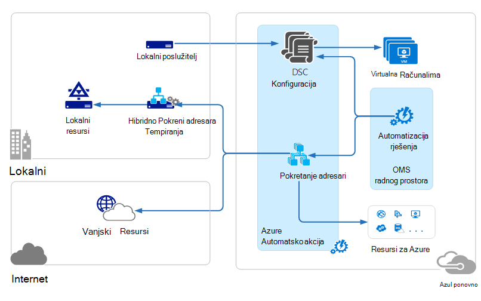

<properties 
   pageTitle="Postupci upravljanja paket (OMS) arhitektura | Microsoft Azure"
   description="Microsoft operacije upravljanja paket (OMS) je Microsoftov oblaku IT rješenja upravljanja koji olakšava upravljanje i zaštita lokalnih i infrastrukture u oblaku.  U ovom se članku prepoznaje u različitim servisima obuhvaćen OMS i navode veze na detaljne sadržaja."
   services="operations-management-suite"
   documentationCenter=""
   authors="bwren"
   manager="jwhit"
   editor="tysonn" />
<tags 
   ms.service="operations-management-suite"
   ms.devlang="na"
   ms.topic="get-started-article"
   ms.tgt_pltfrm="na"
   ms.workload="infrastructure-services"
   ms.date="10/27/2016"
   ms.author="bwren" />

# OMS arhitekture

[Postupci upravljanja paket (OMS)](https://azure.microsoft.com/documentation/services/operations-management-suite/) je zbirka oblaku servisa za upravljanje lokalnih podataka i okruženja u oblaku.  U ovom se članku opisuju različitih lokalnih i komponente oblaka OMS i njihove arhitektura računalno visoke razine oblaka.  Možete se referirati potražite u dokumentaciji za svaki servis za dodatne pojedinosti.

## Zapisnik Analytics

Sve podatke prikupljene putem [Prijava analitiku](https://azure.microsoft.com/documentation/services/log-analytics/) pohranjen u spremištu OMS koji se nalazi u Azure.  Povezani izvora generirati podaci prikupljeni u spremištu OMS.  Trenutno postoje tri vrste povezanim izvorima podržana.

- Agent instalirani na računalu sa sustavom [Windows](../log-analytics/log-analytics-windows-agents.md) ili [Linux](../log-analytics/log-analytics-linux-agents.md) izravno povezani OMS.
- Na sustav centar operacije Manager (SCOM) upravljanja grupe [povezani zapisnika analize](../log-analytics/log-analytics-om-agents.md) .  SCOM agenata i dalje možete komunicirati s poslužiteljima upravljanja koji događaja i podataka o performansama proslijediti zapisnika analize.
- [Račun za Azure prostora za pohranu](../log-analytics/log-analytics-azure-storage.md) koji prikuplja [Azure Dijagnostika](../cloud-services/cloud-services-dotnet-diagnostics.md) podatke iz ulogu suradnika, uloga web ili virtualnog računala u Azure.

Izvori podataka definirajte podatke koje prijava analitiku prikuplja iz povezanih izvora, uključujući zapisnika događaja i mjerača performansi.  Rješenja dodavanje funkcionalnosti OMS i mogu jednostavno dodati radnog prostora iz [Galerije rješenja OMS](../log-analytics/log-analytics-add-solutions.md).  Neka rješenja može zahtijevati izravne veze da biste prijava analitiku iz SCOM agenata dok drugim korisnicima biti potrebna dodatna agent za instalaciju.

Prijava analitiku je utemeljen na webu portal koje možete koristiti za upravljanje OMS resursi, dodavanje i konfiguriranje rješenja OMS i prikaz i analiza podataka u spremište OMS.

## Automatizacija Azure

[Automatizacija Azure runbooks](http://azure.microsoft.com/documentation/services/automation) se izvode u oblaku Azure i možete pristupiti resurse koji su u Azure u druge servise u oblaku ili dostupno putem Interneta javno.  U centru za lokalne podatke pomoću [Tempiranja Runbook hibridnog](../automation/automation-hybrid-runbook-worker.md) tako da runbooks mogu pristupiti lokalnom resursa možete označiti i lokalnog računala.

[Konfiguracija DSC](../automation/automation-dsc-overview.md) pohranjene u automatizaciji Azure možete izravno primjenjuju na Azure virtualnih računala.  Druge fizičke i virtualnih računala možete zatražiti konfiguracije s poslužitelja istaknuti DSC Automatizacija Azure.

Azure Automatizacija je rješenje za OMS koji prikazuje statistika i veze da biste pokrenuli Azure portal za sve operacije.

## Azure sigurnosnog kopiranja

Zaštićeni podaci u [Azure sigurnosne kopije](http://azure.microsoft.com/documentation/services/backup) pohranjena u sigurnosno kopiranje zbirke ključeva koja se nalazi u određenom regiji.  Podaci se replicirati unutar iste područja i, ovisno o vrsti sigurnog, možda također je replicirati na drugoj regiji za daljnje zalihosti.

Azure sigurnosne kopije ima tri osnovna scenarija.

- Windows računalo s Azure Backup agent.  To vam omogućuje da biste datoteke sigurnosne kopije i mape iz bilo koje Windows server ili klijentu izravno Azure sigurnosno kopiranje zbirke ključeva.  
- Upravitelj podataka zaštite u Centar za sustav (DPM) ili poslužitelj za sigurnosne kopije Microsoft Azure. Omogućuje vam korištenje DPM ili poslužitelj za Microsoft Azure sigurnosne kopije sigurnosna kopija datoteke i mape uz aplikacije radnih opterećenja kao što su SQL i sustava SharePoint da biste lokalno spremište, a zatim replicirati za Azure sigurnosno kopiranje zbirke ključeva.
- Dodaci za Azure virtualnog računala.  Omogućuje sigurnosno kopiranje Azure virtualnim strojevima Azure sigurnosno kopiranje zbirke ključeva.

Azure sigurnosne kopije je rješenje za OMS koji prikazuje statistika i veze da biste pokrenuli Azure portal za sve operacije.

## Oporavak Azure web-mjesta

[Oporavak web-mjesta Azure](http://azure.microsoft.com/documentation/services/site-recovery) orchestrates replikacije, prebacivanje i failback virtualnim strojevima i fizičke poslužiteljima. Replikacija podataka se razmjenjuju među domaćini Hyper-V, VMware hypervisors i fizičke poslužitelji u podatkovnim centrima primarnih i sekundarnih ili podatkovnog centra i Azure prostora za pohranu.  Oporavak web-mjesta pohranjuje metapodataka sefovi koja se nalazi u određenom zemljopisnom Azure regiji. Nema repliciranu podaci se pohranjuju servis oporavak web-mjesta.

Oporavak Azure web-mjesta ima tri osnovna replikacije scenarija.

**Replikacija virtualnim strojevima Hyper-V**
- Ako Hyper-V virtualnim strojevima upravlja se u VMM oblaka, možete je replicirati centar za sekundarne podatkovne ili Azure prostora za pohranu.  Replikacija za Azure je putem sigurne internetske veze.  Replikaciju sekundarnu podatkovnim centrom je putem LAN-a.
- Ako Hyper-V virtualnim strojevima ne upravlja VMM, možete je replicirati Azure spremište.  Replikacija za Azure je putem sigurne internetske veze.
 
**Replikacija VMWare virtualnih računala**
- VMware virtualnim strojevima možete replikaciju sekundarnu podatkovnog centra pokretanja VMware ili Azure prostora za pohranu.  Replikacija za Azure može dogoditi putem web-mjesto VPN-a ili Azure ExpressRoute putem sigurne internetske veze. Pojavljuje se replikaciju sekundarnu podatkovnim centrom putem kanala podataka InMage Scout.
 
**Replikacija fizičke Windows i Linux poslužitelja** 
- Fizička poslužitelja možete replicirati sekundarne podatkovnim centrom ili Azure prostora za pohranu. Replikacija za Azure može dogoditi putem web-mjesto VPN-a ili Azure ExpressRoute putem sigurne internetske veze. Pojavljuje se replikaciju sekundarnu podatkovnim centrom putem kanala podataka InMage Scout.  Oporavak Azure web-mjesta sadrži rješenja programa OMS koji se prikazuje neki Statistika, no morate koristiti Azure portal za sve operacije.

## Daljnji koraci

- Saznajte više o [zapisnika analize](http://azure.microsoft.com/documentation/services/log-analytics).
- Saznajte više o [Azure automatizaciju](https://azure.microsoft.com/documentation/services/automation).
- Saznajte više o [Azure sigurnosnu kopiju](http://azure.microsoft.com/documentation/services/backup).
- Saznajte više o [oporavak Azure web-mjesta](http://azure.microsoft.com/documentation/services/site-recovery).
