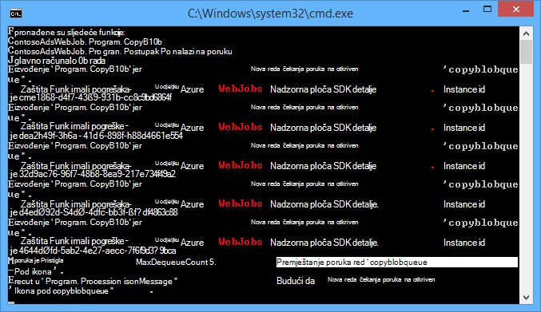
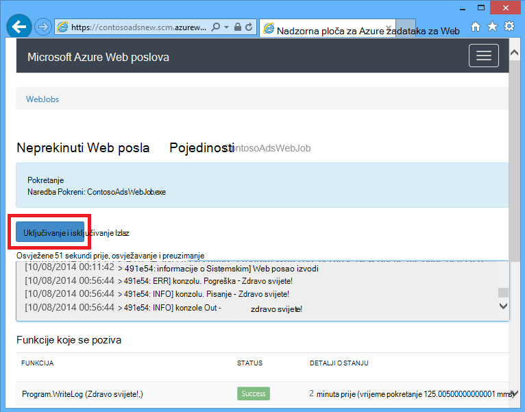
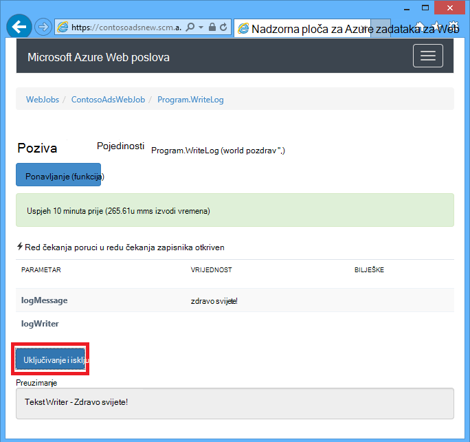
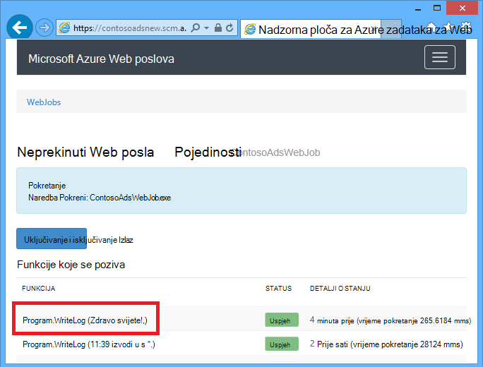
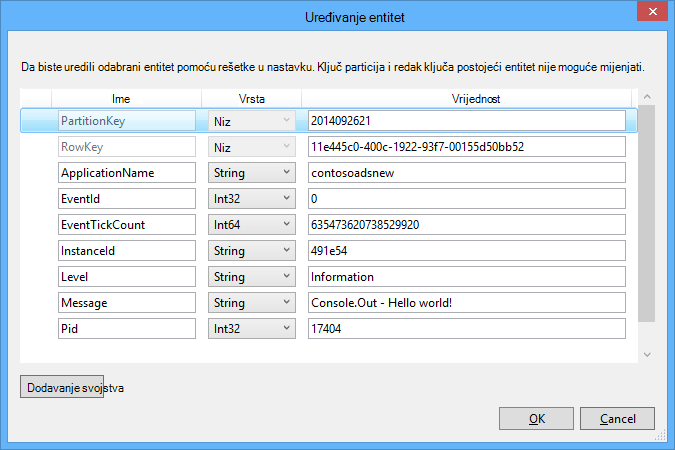
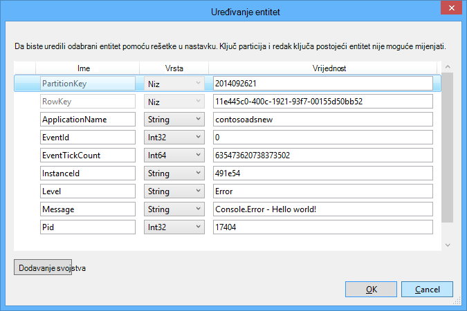

<properties
    pageTitle="Uvod u redu čekanja za pohranu i Visual Studio povezani servisi (WebJob projekti) | Microsoft Azure"
    description="Kako započeti rad sa sustavom reda čekanja Azure prostora za pohranu u programu project WebJob nakon povezivanja s računom za pohranu pomoću Visual Studio povezani servisi."
    services="storage"
    documentationCenter=""
    authors="TomArcher"
    manager="douge"
    editor=""/>

<tags
    ms.service="storage"
    ms.workload="web"
    ms.tgt_pltfrm="vs-getting-started"
    ms.devlang="na"
    ms.topic="article"
    ms.date="07/18/2016"
    ms.author="tarcher"/>

# Prvi koraci s web-mjesto za pohranu Azure red i u okvir za Visual Studio povezani servisi (WebJob projekti)

[AZURE.INCLUDE [storage-try-azure-tools-queues](../../includes/storage-try-azure-tools-queues.md)]

## Pregled

U ovom se članku opisuje kako početak rada s reda čekanja Azure prostora za pohranu u projekta za Visual Studio Azure WebJob nakon što ste stvorili ili poziva račun za Azure prostora za pohranu pomoću dijaloškog okvira Visual Studio **Dodavanje povezani servisi** . Kada dodate račun za pohranu WebJob projekt pomoću dijaloški okvir za Visual Studio **Dodavanje povezani servisi** , odgovarajući Azure prostora za pohranu NuGet paketa instaliranih odgovarajuće reference .NET dodaju se u projekt, a nizove veze za račun za pohranu ažuriraju u datoteci App.config.  

U ovom se članku navode C# kod primjere koji pokazuju kako pomoću verzije Azure WebJobs SDK 1.x sa servisom Azure red za pohranu.

Azure reda čekanja za pohranu je servis za pohranu velikog broja poruka koje je moguće pristupiti s bilo kojeg mjesta na svijetu putem čija je autentičnost provjerena poziva pomoću HTTP ili HTTPS. Jedan red poruka može biti najviše od 64 KB i reda čekanja mogu sadržavati milijune poruke do ukupni kapacitet ograničenje prostora za pohranu računa. Dodatne informacije potražite [Početak rada s spremištem reda čekanja Azure pomoću .NET](storage-dotnet-how-to-use-queues.md) . Dodatne informacije o ASP.NET potražite u članku [ASP.NET](http://www.asp.net).

## Kako pokrenuti funkcije primitku poruke reda čekanja

Da biste napisali funkcija koja se poziva WebJobs SDK primitku poruke reda čekanja, koristite atribut **QueueTrigger** . Atribut Graditelj vodi parametra niza koji određuje naziv čekanja za ankete. Da biste vidjeli kako postaviti naziv reda čekanja dinamički, pogledajte [kako postaviti mogućnosti konfiguracije](#how-to-set-configuration-options).

### Niz red čekanja poruke

U sljedećem primjeru red sadrži poruku niza, tako da se **QueueTrigger** primjenjuje se na niz parametar pod nazivom **logMessage** koje sadrži sadržaj poruke red. Na funkcija [piše poruka zapisnika na nadzornu ploču](#how-to-write-logs).

        public static void ProcessQueueMessage([QueueTrigger("logqueue")] string logMessage, TextWriter logger)
        {
            logger.WriteLine(logMessage);
        }

Osim **niz**parametar može biti raspon bajtova, **CloudQueueMessage** objekt ili POCO koju ste definirali.

### POCO [(običan stari objekt CLR](http://en.wikipedia.org/wiki/Plain_Old_CLR_Object)) red čekanja poruke

U sljedećem primjeru reda čekanja poruka sadrži JSON za **BlobInformation** objekt koji sadrži svojstvo **BlobName** . SDK automatski deserializes objekt.

        public static void WriteLogPOCO([QueueTrigger("logqueue")] BlobInformation blobInfo, TextWriter logger)
        {
            logger.WriteLine("Queue message refers to blob: " + blobInfo.BlobName);
        }

SDK koristi [Newtonsoft.Json NuGet paketa](http://www.nuget.org/packages/Newtonsoft.Json) Serijalizacija i ukloniti serijski broj poruka. Ako stvorite red poruke u programu koji ne koristi WebJobs SDK, možete napisati kod kao u sljedećem primjeru da biste stvorili poruku POCO reda čekanja mogu raščlaniti SDK-a.

        BlobInformation blobInfo = new BlobInformation() { BlobName = "log.txt" };
        var queueMessage = new CloudQueueMessage(JsonConvert.SerializeObject(blobInfo));
        logQueue.AddMessage(queueMessage);

### Funkcija asinkrone

Na sljedeći asinkrone funkcija [piše zapisnik nadzorne ploče](#how-to-write-logs).

        public async static Task ProcessQueueMessageAsync([QueueTrigger("logqueue")] string logMessage, TextWriter logger)
        {
            await logger.WriteLineAsync(logMessage);
        }

Funkcije asinkrone može potrajati [token otkazivanja](http://www.asp.net/mvc/overview/performance/using-asynchronous-methods-in-aspnet-mvc-4#CancelToken), kao što je prikazano u sljedećem primjeru koja se kopira blob. (Za objašnjenje **queueTrigger** rezerviranog mjesta, potražite u odjeljku [blob-ova](#how-to-read-and-write-blobs-and-tables-while-processing-a-queue-message) ).

        public async static Task ProcessQueueMessageAsyncCancellationToken(
            [QueueTrigger("blobcopyqueue")] string blobName,
            [Blob("textblobs/{queueTrigger}",FileAccess.Read)] Stream blobInput,
            [Blob("textblobs/{queueTrigger}-new",FileAccess.Write)] Stream blobOutput,
            CancellationToken token)
        {
            await blobInput.CopyToAsync(blobOutput, 4096, token);
        }

## Vrste surađuje atribut QueueTrigger

Možete koristiti **QueueTrigger** sa sljedećim vrstama:

* **niz**
* Vrsta POCO serijalizirani kao JSON
* **bajt]**
* **CloudQueueMessage**

## Algoritam ankete

SDK primjenjuje na slučajni eksponencijalnom natrag isključivanje algoritam da biste smanjili efekt neaktivno-reda čekanja provjere na troškovima transakcije prostora za pohranu.  Kada se pronađu poruke, SDK pričekati dvije sekunde i provjerava drugu poruku; Kada se poruke ne pronađe čeka oko četiri sekundi prije ponovnog pokušaja. Nakon kasnije nije uspjelo pokušaji reda čekanja poruka, vrijeme čekanja i dalje da biste povećali sve dok ne postignete vrijeme Maksimalna čekanja koji će jedne minute. [Vrijeme čekanja Maksimalna je konfigurirati](#how-to-set-configuration-options).

## Više instanci

Ako web-aplikaciju programa izvodi na više instanci, neprekinuti WebJobs pokreće na svakom računalu i svakom računalu će Pričekajte okidača i pokušate pokrenuti funkcije. U nekim slučajevima to može dovesti do neke funkcije dvaput obrade iste podatke pa funkcija mora biti idempotent (napisali tako da ih više puta pozivanje s istim podacima unos ne proizvesti dvostruke rezultate).  

## Paralelni izvođenja

Ako imate više funkcija slušanje na različitim redovi, SDK će nazovite ih paralelno kada istodobno primljene poruke.

Isto vrijedi se po primitku više poruka na jedan red. Prema zadanim postavkama SDK dobiva skupine 16 reda čekanja poruka istodobno i izvršava funkcija koja se obrađuje ih paralelno. [Veličina grupe nije moguće konfigurirati](#how-to-set-configuration-options). Kada je broj koji se obrađuju se prema dolje do polovice veličinu serije, SDK dobiva drugu seriju i pokreće obradu tih poruka. Stoga maksimalni broj Istodobni poruke obrade po funkciji je jedan na pola vremena i obradu veličina. Ovo ograničenje zasebno se primjenjuje na svaku funkciju koja ima atribut **QueueTrigger** . Ako ne želite da se paralelno izvođenja za poruke koje ste primili na jedan red, postavite veličinu serije na 1.

## Red čekanja ili reda čekanja poruka metapodataka

Sljedeća svojstva poruke možete dobiti dodavanjem parametara u potpis metoda:

* **DateTimeOffset** expirationTime
* **DateTimeOffset** insertionTime
* **DateTimeOffset** nextVisibleTime
* **niz** queueTrigger (sadrži tekst poruke)
* id **niza**
* **niz** popReceipt
* **Int** dequeueCount

Ako želite raditi izravno s Azure API-JA za pohranu, možete dodati i parametar **CloudStorageAccount** .

U sljedećem primjeru zapisuje sve ovo metapodataka zapisnik aplikacije informacije. U ovom primjeru sadrže sadržaj poruke reda čekanja logMessage i queueTrigger.

        public static void WriteLog([QueueTrigger("logqueue")] string logMessage,
            DateTimeOffset expirationTime,
            DateTimeOffset insertionTime,
            DateTimeOffset nextVisibleTime,
            string id,
            string popReceipt,
            int dequeueCount,
            string queueTrigger,
            CloudStorageAccount cloudStorageAccount,
            TextWriter logger)
        {
            logger.WriteLine(
                "logMessage={0}\n" +
            "expirationTime={1}\ninsertionTime={2}\n" +
                "nextVisibleTime={3}\n" +
                "id={4}\npopReceipt={5}\ndequeueCount={6}\n" +
                "queue endpoint={7} queueTrigger={8}",
                logMessage, expirationTime,
                insertionTime,
                nextVisibleTime, id,
                popReceipt, dequeueCount,
                cloudStorageAccount.QueueEndpoint,
                queueTrigger);
        }

Evo ogledne zapisnik napisao ogledni kod:

        logMessage=Hello world!
        expirationTime=10/14/2014 10:31:04 PM +00:00
        insertionTime=10/7/2014 10:31:04 PM +00:00
        nextVisibleTime=10/7/2014 10:41:23 PM +00:00
        id=262e49cd-26d3-4303-ae88-33baf8796d91
        popReceipt=AgAAAAMAAAAAAAAAfc9H0n/izwE=
        dequeueCount=1
        queue endpoint=https://contosoads.queue.core.windows.net/
        queueTrigger=Hello world!

## Graceful zatvaranja

Funkcija koja se pokreće se u neprekinuti WebJob možete prihvatiti **CancellationToken** parametar koji omogućuje operacijski sustav će obavijestiti funkciju kada se WebJob uskoro će se prekinuti. Koristite ovu obavijest da biste provjerili ne funkciju neočekivano prekinuti na način koji ostavlja podataka u kojima nisu dosljedno stanju.

Sljedeći primjer prikazuje način da biste provjerili skorom WebJob prekid u funkciji.

    public static void GracefulShutdownDemo(
                [QueueTrigger("inputqueue")] string inputText,
                TextWriter logger,
                CancellationToken token)
    {
        for (int i = 0; i < 100; i++)
        {
            if (token.IsCancellationRequested)
            {
                logger.WriteLine("Function was cancelled at iteration {0}", i);
                break;
            }
            Thread.Sleep(1000);
            logger.WriteLine("Normal processing for queue message={0}", inputText);
        }
    }

**Bilješke:** Na nadzornoj ploči možda neće pravilno prikazati stanje i rezultat funkcije koji imaju isključen.

Dodatne informacije potražite u članku [WebJobs Graceful zatvaranja](http://blog.amitapple.com/post/2014/05/webjobs-graceful-shutdown/#.VCt1GXl0wpR).   

## Kako stvoriti poruku reda čekanja tijekom obrade poruke reda čekanja

Da biste napisali funkcija koja se stvara novu poruku reda čekanja, koristite atribut **red** . Kao što su **QueueTrigger**, proslijedite u nazivu reda čekanja kao niz znakova ili možete [postaviti naziv reda čekanja dinamički](#how-to-set-configuration-options).

### Niz reda čekanja poruke

Sljedećim primjerom koda koji nisu asinkrone stvara novu poruku reda čekanja u redu čekanja pod nazivom "outputqueue" s istim sadržajem kao poruku reda čekanja primljene u redu čekanja pod nazivom "inputqueue". (Da biste postigli asinkrone koristite funkcije **IAsyncCollector<T> ** kao što je prikazano kasnije u ovom odjeljku.)

        public static void CreateQueueMessage(
            [QueueTrigger("inputqueue")] string queueMessage,
            [Queue("outputqueue")] out string outputQueueMessage )
        {
            outputQueueMessage = queueMessage;
        }

### POCO [(običan stari objekt CLR](http://en.wikipedia.org/wiki/Plain_Old_CLR_Object)) red čekanja poruke

Da biste stvorili red poruku koja sadrži na POCO umjesto niza, prenesite vrstu POCO kao izlazni parametar atribut Graditelj **red** .

        public static void CreateQueueMessage(
            [QueueTrigger("inputqueue")] BlobInformation blobInfoInput,
            [Queue("outputqueue")] out BlobInformation blobInfoOutput )
        {
            blobInfoOutput = blobInfoInput;
        }

SDK automatski serializes objekt JSON. Red čekanja poruka uvijek stvoriti čak i ako je objekt null.

### Stvaranje više poruka ili u funkcijama asinkrone

Da biste stvorili više poruka, upućivanje vrsta parametra red izlazna **ICollector<T> ** ili **IAsyncCollector<T>**, kao što je prikazano u sljedećem primjeru.

        public static void CreateQueueMessages(
            [QueueTrigger("inputqueue")] string queueMessage,
            [Queue("outputqueue")] ICollector<string> outputQueueMessage,
            TextWriter logger)
        {
            logger.WriteLine("Creating 2 messages in outputqueue");
            outputQueueMessage.Add(queueMessage + "1");
            outputQueueMessage.Add(queueMessage + "2");
        }

Svaku poruku reda čekanja stvara se odmah nakon naziva metode **Add** .

### Vrste kojima radi atribut reda čekanja

Atribut **reda čekanja** možete koristiti na sljedećim vrstama parametar:

* **odgovor niza** (stvara reda čekanja poruku ako je vrijednost parametra koje nisu null kada istekne funkcija)
* **odgovor bajt]** (funkcionira kao što je **niz**)
* **članak CloudQueueMessage** (funkcionira kao što je **niz**)
* **članak POCO** (vrstu serializable stvara poruku s objektom null ako je u parametru null kada istekne funkcija)
* **ICollector**
* **IAsyncCollector**
* **CloudQueue** (za stvaranje poruka ručno izravno pomoću Azure prostora za pohranu API-JA)

### Korištenje atributa WebJobs SDK u tijelu funkcija

Ako trebate neke nedovršenu funkcija prije korištenja WebJobs SDK atribut kao što su **reda čekanja**, **Blob**ili **tablice**, možete koristiti sučelje **IBinder** .

U sljedećem primjeru otvara poruku red čekanja i stvara novu poruku s istim sadržajem u redu čekanja za izlaz. Naziv reda čekanja izlaz je postaviti tako da kod u tijelu funkciju.

        public static void CreateQueueMessage(
            [QueueTrigger("inputqueue")] string queueMessage,
            IBinder binder)
        {
            string outputQueueName = "outputqueue" + DateTime.Now.Month.ToString();
            QueueAttribute queueAttribute = new QueueAttribute(outputQueueName);
            CloudQueue outputQueue = binder.Bind<CloudQueue>(queueAttribute);
            outputQueue.AddMessage(new CloudQueueMessage(queueMessage));
        }

Sučelje **IBinder** može se koristiti s atributima **tablice** i **Blob** .

## Način za čitanje i pisanje blob-ova i tablice tijekom obrade poruke reda čekanja

Atributi **Blob** i **tablice** omogućuju čitanje i pisanje blob-ova i tablice. Uzorci u ovom odjeljku odnose se na blob-ova. Primjere koda koji pokazuju kako pokretanje procesa kada su blob-ova Stvori ili ažurira, potražite u člancima [Korištenje blobova platforme Azure s WebJobs SDK](../app-service-web/websites-dotnet-webjobs-sdk-storage-blobs-how-to.md)te primjere koda koji za čitanje i pisanje tablice, potražite [u](../app-service-web/websites-dotnet-webjobs-sdk-storage-tables-how-to.md)članku korištenje spremište tablica platforme Azure s WebJobs SDK.

### Niz reda čekanja poruke pokretanje operacije blobova platforme

Red čekanja poruku koja sadrži niz, **queueTrigger** je rezervirano mjesto možete koristiti u parametru **blobPath** **Blob** atributa koji sadrži sadržaj poruke.

Sljedeći primjer koristi **strujanje** objekte za čitanje i pisanje blob-ova. Red čekanja poruka da je naziv blob koja se nalazi u spremniku textblobs. Kopiju blob s "– novi" dodan naziv se stvara u istom kontejner.

        public static void ProcessQueueMessage(
            [QueueTrigger("blobcopyqueue")] string blobName,
            [Blob("textblobs/{queueTrigger}",FileAccess.Read)] Stream blobInput,
            [Blob("textblobs/{queueTrigger}-new",FileAccess.Write)] Stream blobOutput)
        {
            blobInput.CopyTo(blobOutput, 4096);
        }

Atribut Graditelj **Blob** vodi **blobPath** parametar koji određuje spremnik i blob naziv. Dodatne informacije o ovom rezerviranom mjestu potražite u članku [upute za korištenje blobova platforme Azure s WebJobs SDK](../app-service-web/websites-dotnet-webjobs-sdk-storage-blobs-how-to.md).

Kada atribut decorates **strujanje** objekta, drugi Graditelj parametar određuje način **FileAccess** kao čitanje, pisanje ili čitanje/pisanje.

Sljedeći primjer koristi **CloudBlockBlob** objekt da biste izbrisali blob. Red čekanja poruka da je naziv blob-om.

        public static void DeleteBlob(
            [QueueTrigger("deleteblobqueue")] string blobName,
            [Blob("textblobs/{queueTrigger}")] CloudBlockBlob blobToDelete)
        {
            blobToDelete.Delete();
        }

### POCO [(običan stari objekt CLR](http://en.wikipedia.org/wiki/Plain_Old_CLR_Object)) red čekanja poruke

Za POCO pohranjenih kao JSON u redu čekanja poruku, možete koristiti rezerviranih mjesta za taj naziv svojstva objekta u parametru **blobPath** atribut **reda čekanja** . Nazivi svojstava metapodataka reda čekanja može poslužiti kao rezervirana mjesta. Potražite u članku [se red ili reda čekanja poruka metapodataka](#get-queue-or-queue-message-metadata).

U sljedećem primjeru kopira blob novi blob s nastavkom. Red čekanja poruka da je objekt **BlobInformation** koja obuhvaća svojstva **BlobName** i **BlobNameWithoutExtension** . Nazivi svojstava se koriste kao rezervirana mjesta na putu blobova platforme za atribute **Blob** .

        public static void CopyBlobPOCO(
            [QueueTrigger("copyblobqueue")] BlobInformation blobInfo,
            [Blob("textblobs/{BlobName}", FileAccess.Read)] Stream blobInput,
            [Blob("textblobs/{BlobNameWithoutExtension}.txt", FileAccess.Write)] Stream blobOutput)
        {
            blobInput.CopyTo(blobOutput, 4096);
        }

SDK koristi [Newtonsoft.Json NuGet paketa](http://www.nuget.org/packages/Newtonsoft.Json) Serijalizacija i ukloniti serijski broj poruka. Ako stvorite red poruke u programu koji ne koristi WebJobs SDK, možete napisati kod kao u sljedećem primjeru da biste stvorili poruku POCO reda čekanja mogu raščlaniti SDK-a.

        BlobInformation blobInfo = new BlobInformation() { BlobName = "boot.log", BlobNameWithoutExtension = "boot" };
        var queueMessage = new CloudQueueMessage(JsonConvert.SerializeObject(blobInfo));
        logQueue.AddMessage(queueMessage);

Ako trebate neke nedovršenu funkcija prije povezivanja blob objektu, možete koristiti atribut u tijelu funkcija, kao što je prikazano [Korištenje SDK WebJobs atribute u tijelu funkcije](#use-webjobs-sdk-attributes-in-the-body-of-a-function).

###Vrste možete koristiti Blob atribut s

Atribut **Blob** mogu koristiti i sa sljedećim vrstama:

* **Strujanje** (čitanje ili pisanje naveden pomoću Graditelj parametar FileAccess)
* **ZapisivačTeksta**
* **ZapisivačTeksta**
* **niz** (za čitanje)
* **odgovor niza** (pisanje; stvara blob samo ako je parametar niza koje nisu null kada funkcija vraća)
* POCO (za čitanje)
* izvan POCO (pisanje; uvijek stvara blob, stvara kao objekt null ako je parametar POCO null kada funkcija vraća)
* **CloudBlobStream** (pisanje)
* **ICloudBlob** (čitanje ili pisanje)
* **CloudBlockBlob** (čitanje ili pisanje)
* **CloudPageBlob** (čitanje ili pisanje)

##Kako rukovati poison porukama

Poruke čiji je sadržaj uzrokuje funkcija uvoza nazivaju *poison poruke*. Ako funkcija ne uspije, poruke reda čekanja neće se izbrisati naposljetku je sakrije i ponovno uzrokuje ciklusa se ponavljaju. SDK možete automatski prekinuti ciklusu nakon ograničeni broja iteracija ili to možete učiniti ručno.

### Rukovanje automatskog poison poruka

SDK će funkcije do 5 puta pozovete obraditi red čekanja poruke. Ako pete pokušajte ne uspije, poruke se premješta u poison red. Vidjet ćete kako konfigurirati maksimalan broj ponovne pokušaje u [kako postaviti mogućnosti konfiguracije](#how-to-set-configuration-options).

Red čekanja za poison pod nazivom *{originalqueuename}*-poison. Možete napisati potreban je funkcija postupak poruke iz poison reda čekanja tako da ih zapisivanje ili slanja obavijesti te ručno pozornost.

U sljedećem primjeru **CopyBlob** funkcija neće uspjeti kada reda čekanja poruka sadrži naziv blob koji ne postoji. Kada se to dogodi, poruke se premješta iz copyblobqueue reda čekanja za copyblobqueue poison. **ProcessPoisonMessage** zatim prijavi poison poruku.

        public static void CopyBlob(
            [QueueTrigger("copyblobqueue")] string blobName,
            [Blob("textblobs/{queueTrigger}", FileAccess.Read)] Stream blobInput,
            [Blob("textblobs/{queueTrigger}-new", FileAccess.Write)] Stream blobOutput)
        {
            blobInput.CopyTo(blobOutput, 4096);
        }

        public static void ProcessPoisonMessage(
            [QueueTrigger("copyblobqueue-poison")] string blobName, TextWriter logger)
        {
            logger.WriteLine("Failed to copy blob, name=" + blobName);
        }

Sljedeća ilustracija prikazuje konzole za izlaz iz ove funkcije kada poison poruke.

### Rukovanje ručno poison porukama

Koliko je puta poruke izdvojeni prema gore za obradu možete dobiti dodavanjem programa **int** parametar pod nazivom **dequeueCount** funkcija. Provjerite broj dequeue na kod funkcije pa izvođenje vlastite poison Rukovanje porukama kada broj premaši praga, kao što je prikazano u sljedećem primjeru.

        public static void CopyBlob(
            [QueueTrigger("copyblobqueue")] string blobName, int dequeueCount,
            [Blob("textblobs/{queueTrigger}", FileAccess.Read)] Stream blobInput,
            [Blob("textblobs/{queueTrigger}-new", FileAccess.Write)] Stream blobOutput,
            TextWriter logger)
        {
            if (dequeueCount > 3)
            {
                logger.WriteLine("Failed to copy blob, name=" + blobName);
            }
            else
            {
            blobInput.CopyTo(blobOutput, 4096);
            }
        }

## Kako postaviti mogućnosti konfiguracije

Vrsta **JobHostConfiguration** možete koristiti da biste postavili sljedeće mogućnosti konfiguracije:

* Postavite nizove veze SDK u kodu.
* Konfiguriranje **QueueTrigger** postavke kao što je najviše dequeue count.
* Red čekanja imena zatražite od konfiguracije.

###Postavite nizove SDK veze u kodu

Postavljanje SDK nizu za povezivanje u kodu omogućuje vam da biste koristili vlastite nazive niz veze u konfiguraciji datoteka ili varijable okruženja, kao što je prikazano u sljedećem primjeru.

        static void Main(string[] args)
        {
            var _storageConn = ConfigurationManager
                .ConnectionStrings["MyStorageConnection"].ConnectionString;

            var _dashboardConn = ConfigurationManager
                .ConnectionStrings["MyDashboardConnection"].ConnectionString;

            var _serviceBusConn = ConfigurationManager
                .ConnectionStrings["MyServiceBusConnection"].ConnectionString;

            JobHostConfiguration config = new JobHostConfiguration();
            config.StorageConnectionString = _storageConn;
            config.DashboardConnectionString = _dashboardConn;
            config.ServiceBusConnectionString = _serviceBusConn;
            JobHost host = new JobHost(config);
            host.RunAndBlock();
        }

### Konfiguriranje postavki QueueTrigger

Možete konfigurirati sljedeće postavke koje se odnose na obrade poruke red čekanja:

- Maksimalni broj reda čekanja poruke koje se izdvajaju gore istodobno izvršavanje paralelno (Zadana vrijednost je 16).
- Maksimalni broj ponovne pokušaje prije slanja poruke reda čekanja za poison (Zadana vrijednost je 5).
- Maksimalno vrijeme prije provjere ponovno kada je prazan red čekanja (Zadana vrijednost je 1 minute).

Sljedeći primjer pokazuje kako konfigurirati sljedeće postavke:

        static void Main(string[] args)
        {
            JobHostConfiguration config = new JobHostConfiguration();
            config.Queues.BatchSize = 8;
            config.Queues.MaxDequeueCount = 4;
            config.Queues.MaxPollingInterval = TimeSpan.FromSeconds(15);
            JobHost host = new JobHost(config);
            host.RunAndBlock();
        }

### Postavljanje vrijednosti za WebJobs SDK Graditelj parametara u kodu

Katkad je potrebno navesti naziv reda čekanja, naziv blob ili spremnik ili na naziv tablice u kod umjesto koda napravili ga. Na primjer, možda ćete morati reda čekanja za Navedite naziv **QueueTrigger** u konfiguraciji datoteku ili okruženje varijabli.

To možete učiniti tako da Prenos **NameResolver** objekta na vrstu **JobHostConfiguration** . Obuhvaćaju okruženo znak postotka (%) u WebJobs SDK atribut Graditelj parametara posebno rezerviranih mjesta i kod **NameResolver** određuje stvarnih vrijednosti koje će se koristiti umjesto te rezervirana mjesta.

Ako, na primjer, pretpostavimo da želite koristiti reda pod nazivom logqueuetest u okruženje za testiranje i jedan imenovani logqueueprod u radni. Umjesto naziva programiranih reda čekanja želite navesti naziv unosa u zbirci **appSettings** koja se promijenile naziv stvarni reda čekanja. Ako je ključ **appSettings** logqueue, funkcija može izgledati kao u sljedećem primjeru.

        public static void WriteLog([QueueTrigger("%logqueue%")] string logMessage)
        {
            Console.WriteLine(logMessage);
        }

Svojoj učionici **NameResolver** nije moguće dobiti naziv reda čekanja iz **appSettings** kao što je prikazano u sljedećem primjeru:

        public class QueueNameResolver : INameResolver
        {
            public string Resolve(string name)
            {
                return ConfigurationManager.AppSettings[name].ToString();
            }
        }

Prenesite klase **NameResolver** u **JobHost** objekt kao što je prikazano u sljedećem primjeru.

        static void Main(string[] args)
        {
            JobHostConfiguration config = new JobHostConfiguration();
            config.NameResolver = new QueueNameResolver();
            JobHost host = new JobHost(config);
            host.RunAndBlock();
        }

**Bilješke:** Red čekanja, tablice i nazivi blob su razriješiti svaki put kada se naziva funkcije, ali blob spremnik imena su razriješena samo prilikom pokretanja aplikacije. Ne možete promijeniti naziv spremnika blob dok se izvodi posao.

## Upute za ručno pokretanje funkcije

Da biste ručno pokretanje funkcije, upotrijebite metodu **poziva** ili **CallAsync** na **JobHost** objekta i atributa **NoAutomaticTrigger** na funkcija, kao što je prikazano u sljedećem primjeru.

        public class Program
        {
            static void Main(string[] args)
            {
                JobHost host = new JobHost();
                host.Call(typeof(Program).GetMethod("CreateQueueMessage"), new { value = "Hello world!" });
            }

            [NoAutomaticTrigger]
            public static void CreateQueueMessage(
                TextWriter logger,
                string value,
                [Queue("outputqueue")] out string message)
            {
                message = value;
                logger.WriteLine("Creating queue message: ", message);
            }
        }

## Kako napisati zapisnika

Na nadzornoj ploči zapisnici prikazuju se na dva mjesta: na stranicu za na WebJob i stranice za određeni WebJob poziva.

Izlaz iz načina konzole koje mogu pozivati funkcije ili metodu **Main()** pojavljuje se na stranici nadzorne ploče za u WebJob, a ne u stranicu za određeni način poziva. Izlaz iz ZapisivačTeksta objekta koji ste dobili od parametra u potpis način prikazuje se na stranicu nadzorne ploče za metodu poziva.

Izlaz konzole nije se moguće povezati na određeni način poziva jer konzolu jednom niti, pokrenutom mnoge funkcije posla može biti istodobno. Zbog SDK-a nudi svake funkcije poziva s vlastitom objektom writer jedinstveni zapisnika.

Da biste napisali [aplikacije praćenje zapisnike](web-sites-dotnet-troubleshoot-visual-studio.md#logsoverview), koristite **Console.Out** (stvara zapisnika označene kao informacije) i **Console.Error** (stvara zapisnika označena kao pogreška). Alternative jest korištenje [praćenja ili TraceSource](http://blogs.msdn.com/b/mcsuksoldev/archive/2014/09/04/adding-trace-to-azure-web-sites-and-web-jobs.aspx), koji omogućuje tekstni, upozorenja i kritično razine osim informacije i pogreške. Aplikacija praćenje zapisnika pojavi web app zapisničke datoteke, Azure tablice ili Azure blob-ova ovisno o tome kako konfigurirati Azure web-aplikaciju programa. Kao što je true sve konzole izlaza, zapisnike zadnjih 100 aplikacije i prikazati u stranicu nadzorne ploče WebJob, a ne na stranici za funkciju poziva.

Izlaz konzole pojavljuje se na nadzornoj ploči samo ako je program pokrenut u WebJob programa Azure ne ako program izvodi lokalno ili u nekim okruženju.

Zapisivanje možete onemogućiti tako da postavite niz za povezivanje nadzorne ploče na null. Dodatne informacije potražite u članku [kako postaviti mogućnosti konfiguracije](#how-to-set-configuration-options).

Sljedeći primjer prikazuje nekoliko načina pisanja zapisnika:

        public static void WriteLog(
            [QueueTrigger("logqueue")] string logMessage,
            TextWriter logger)
        {
            Console.WriteLine("Console.Write - " + logMessage);
            Console.Out.WriteLine("Console.Out - " + logMessage);
            Console.Error.WriteLine("Console.Error - " + logMessage);
            logger.WriteLine("TextWriter - " + logMessage);
        }

Nadzornoj ploči SDK WebJobs, Izlaz iz objekta **ZapisivačTeksta** se prikazuje kada otvorite stranicu za određene funkcije poziva i odaberite **Izlaz za uključivanje i isključivanje**:

Nadzornoj ploči SDK WebJobs, zadnjih 100 retke konzole za izlaz Prikaži gore kada otvorite stranicu za WebJob (ne i za pozivanje – opis funkcije) i odaberite **Izlaz uključivanja ili isključivanja**.

U neprekinuti WebJob, zapisnika aplikacije prikazivati u/podataka/poslova/neprekinuti /*{webjobname}*/job_log.txt u datotečnom sustavu web app.

        [09/26/2014 21:01:13 > 491e54: INFO] Console.Write - Hello world!
        [09/26/2014 21:01:13 > 491e54: ERR ] Console.Error - Hello world!
        [09/26/2014 21:01:13 > 491e54: INFO] Console.Out - Hello world!

U programa Azure bloba aplikacije zapisnika izgleda ovako: 2014.-09-26T21:01:13,Information,contosoadsnew,491e54,635473620738373502,0,17404,17,Console.Write - svijeta pozdrav!, 2014.-09-26T21:01:13,Error,contosoadsnew,491e54,635473620738373502,0,17404,19,Console.Error - svijeta pozdrav!, 2014.-09-26T21:01:13,Information,contosoadsnew,491e54,635473620738529920,0,17404,17,Console.Out - svijeta pozdrav!,

I u tablici programa Azure zapisnike **Console.Out** i **Console.Error** izgledaju ovako:

##Daljnji koraci

U ovom se članku nudi primjere koda koji pokazuju kako rukovati uobičajeni scenariji za rad s Azure redova. Dodatne informacije o korištenju Azure WebJobs i WebJobs SDK potražite u članku [Azure WebJobs dokumentaciju resursi](http://go.microsoft.com/fwlink/?linkid=390226).
