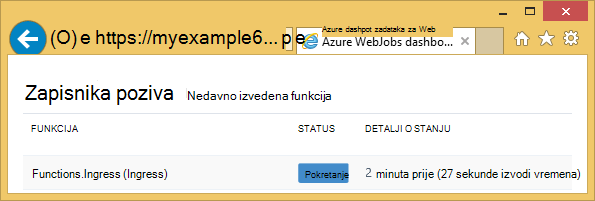
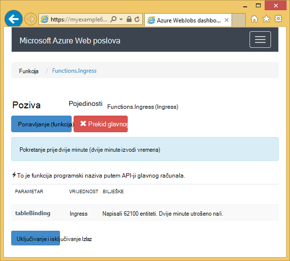
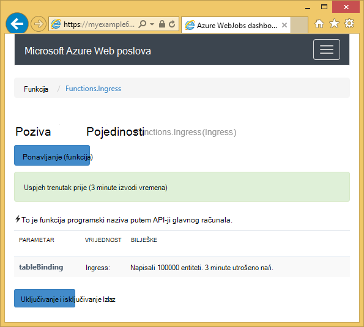

<properties
    pageTitle="Prvi koraci s Azure prostora za pohranu i Visual Studio povezani servisi (WebJob projekti)"
    description="Upute za početak rada s spremište tablica Azure u projektu programa Azure WebJobs u Visual Studio nakon povezivanja s računom za pohranu pomoću Visual Studio povezani servisi"
    services="storage"
    documentationCenter=""
    authors="TomArcher"
    manager="douge"
    editor=""/>

<tags
    ms.service="storage"
    ms.workload="web"
    ms.tgt_pltfrm="vs-getting-started"
    ms.devlang="na"
    ms.topic="article"
    ms.date="07/18/2016"
    ms.author="tarcher"/>

# Uvod u Azure prostora za pohranu (Azure WebJob projekti)

[AZURE.INCLUDE [storage-try-azure-tools-tables](../../includes/storage-try-azure-tools-tables.md)]

## Pregled

U ovom se članku navode C# kod primjere koji pokazuju pokazati kako koristiti verziju Azure WebJobs SDK 1.x sa servisom spremište tablica platforme Azure. Primjere koda pomoću verzije [WebJobs SDK](../app-service-web/websites-dotnet-webjobs-sdk.md) 1.x.

Servis za pohranu Azure tablice omogućuje pohranu velikih količina strukturiranih podataka. Servis je datastore NoSQL koje prihvaća čija je autentičnost provjerena pozive s unutrašnje i vanjske Azure oblaka. Azure tablice su idealna za pohranu strukturirane, koji nisu relacijskih podataka.  Dodatne informacije potražite [Početak rada sa spremištem tablica Azure pomoću .NET](storage-dotnet-how-to-use-tables.md#create-a-table) .

Neke se koda Prikaži atribut **tablice** koristiti u funkcijama koje se nazivaju ručno, odnosno ne pomoću neke od atribute okidača.

## Kako dodati entiteti u tablicu

Da biste dodali entiteti tablice, koristite atribut **tablice** pomoću programa **ICollector<T> ** ili **IAsyncCollector<T> ** parametar gdje **T** određuje sheme entiteti koju želite dodati. Atribut Graditelj vodi parametra niza koji određuje naziv tablice.

Sljedećim primjerom koda dodaje **osoba** entiteti tablice pod nazivom *Ingress*.

        [NoAutomaticTrigger]
        public static void IngressDemo(
            [Table("Ingress")] ICollector<Person> tableBinding)
        {
            for (int i = 0; i < 100000; i++)
            {
                tableBinding.Add(
                    new Person() {
                        PartitionKey = "Test",
                        RowKey = i.ToString(),
                        Name = "Name" }
                    );
            }
        }

Obično vrstu pomoću **ICollector** izvedena iz **TableEntity** ili implementira **ITableEntity**, ali ne morate. Bilo koji od sljedećih klase **osoba** radite s kôda prikazanog u prethodnom **Ingress** način.

        public class Person : TableEntity
        {
            public string Name { get; set; }
        }

        public class Person
        {
            public string PartitionKey { get; set; }
            public string RowKey { get; set; }
            public string Name { get; set; }
        }

Ako želite raditi izravno s Azure prostora za pohranu API **CloudStorageAccount** parametra možete dodati potpis metode.

## Nadzor u stvarnom vremenu

Jer funkcije ingress podataka često obrada velike količine podataka, na nadzornoj ploči WebJobs SDK sadrži podatke u stvarnom vremenu nadzora. U odjeljku **Zapisnika poziva** obavijestit će vas ako i dalje instaliran funkciju.

Stranicu s **Detaljima poziva** izvješća funkcije napretka (broj entiteti napisali) dok se izvodi i da bi vam omogućuje da ga je prekinuti.

Kada se dovrši funkciju, stranicu s **Detaljima poziva** izvješća broj redaka koji su napisali.

## Kako čitati više entiteti iz tablice

Da biste pročitali tablice, koristite atribut **tablice** pomoću programa **IQueryable<T> ** parametar koji vrsta **T** izvedena iz **TableEntity** ili implementira **ITableEntity**.

Sljedećim primjerom koda čita i zapisuje sve retke iz tablice **Ingress** :

        public static void ReadTable(
            [Table("Ingress")] IQueryable<Person> tableBinding,
            TextWriter logger)
        {
            var query = from p in tableBinding select p;
            foreach (Person person in query)
            {
                logger.WriteLine("PK:{0}, RK:{1}, Name:{2}",
                    person.PartitionKey, person.RowKey, person.Name);
            }
        }

### Kako čitati jedan entitet iz tablice

Postoji atribut Graditelj za **tablice** s dvije dodatne parametre koje omogućuju vam navođenje particija ključ i ključ retka kada želite povezati s jednom tablicom entitet.

Sljedećim primjerom koda čita redak tablice za entitet **osoba** na temelju particija ključ i redak vrijednosti ključa primljene u poruci reda čekanja:  

        public static void ReadTableEntity(
            [QueueTrigger("inputqueue")] Person personInQueue,
            [Table("persontable","{PartitionKey}", "{RowKey}")] Person personInTable,
            TextWriter logger)
        {
            if (personInTable == null)
            {
                logger.WriteLine("Person not found: PK:{0}, RK:{1}",
                        personInQueue.PartitionKey, personInQueue.RowKey);
            }
            else
            {
                logger.WriteLine("Person found: PK:{0}, RK:{1}, Name:{2}",
                        personInTable.PartitionKey, personInTable.RowKey, personInTable.Name);
            }
        }

Klasu **osoba** u ovom primjeru nema implementaciju **ITableEntity**.

## Kako koristiti za pohranu API .NET izravno za rad s tablicom

Atribut **tablice** možete koristiti i s objektom **CloudTable** radi dodatne fleksibilnosti pri radu s tablicom.

Sljedećim primjerom koda koristi **CloudTable** objekt da biste dodali jedan entitet *Ingress* tablicu.

        public static void UseStorageAPI(
            [Table("Ingress")] CloudTable tableBinding,
            TextWriter logger)
        {
            var person = new Person()
                {
                    PartitionKey = "Test",
                    RowKey = "100",
                    Name = "Name"
                };
            TableOperation insertOperation = TableOperation.Insert(person);
            tableBinding.Execute(insertOperation);
        }

Dodatne informacije o načinu korištenja **CloudTable** objekt potražite u članku [Početak rada sa spremištem tablica Azure pomoću .NET](storage-dotnet-how-to-use-tables.md).

## Povezane teme prekriveni članak s uputama reda čekanja

Da biste saznali kako rukovati obrada tablica koji se prikazuje po redu čekanja poruci ili WebJobs SDK scenarije nisu specifične za tablice obrada potražite u članku [Uvod u rad s Azure red prostora za pohranu i Visual Studio povezani servisi (WebJob projekti)](vs-storage-webjobs-getting-started-queues.md).

## Daljnji koraci

U ovom se članku nudi primjere koda koji pokazuju kako rukovati uobičajeni scenariji za rad s tablicama Azure. Dodatne informacije o korištenju Azure WebJobs i WebJobs SDK potražite u članku [Azure WebJobs dokumentaciju resursi](http://go.microsoft.com/fwlink/?linkid=390226).
