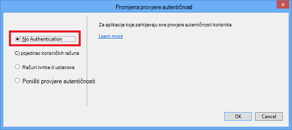

<properties
    pageTitle="Stvaranje slike u markdown"
    description="U članku se objašnjava kako stvoriti slike u markdown prema smjernice za Azure spremišta."
    services=""
    solutions=""
    documentationCenter=""
    authors="kenhoff"
    manager="ilanas"
    editor="tysonn"/>

<tags
    ms.service="contributor-guide"
    ms.devlang=""
    ms.topic="article"
    ms.tgt_pltfrm=""
    ms.workload=""
    ms.date="06/25/2015"
    ms.author="kenhoff" />

# <a name="create-images-in-markdown"></a>Stvaranje slike u markdown

## <a name="image-folder-creation-and-link-syntax"></a>Slika mape stvaranja i veza sintaksu

Za novi članak, morat ćete stvoriti mapu na sljedećem mjestu:

    /articles/<service-directory>/media/<article-name>/

Ako, na primjer:

    /articles/app-service/media/app-service-enterprise-multichannel-apps/

Kada stvorite mapu i slike dodane na nju, koristite sljedeću sintaksu za stvaranje slike u članku:

```

```
Primjer:

U odjeljku [predložak markdown](../markdown%20templates/markdown-template-for-new-articles.md) primjer.  Veza na referencu slike u ovom predlošku markdown su osmišljeni tako da vas se pri dnu predložak.

## <a name="guidelines-specific-to-azuremicrosoftcom"></a>Smjernice za azure.microsoft.com

Snimke se trenutno potiče ako nije moguće uključiti repro korake. Pisanje sadržaj tako da se sadržaj može stajati bez u snimke zaslona ako je potrebno.

Pridržavajte se sljedećih smjernica prilikom stvaranja i uključujući crteža datoteke:
- Dijeljenje datoteke crteža u dokumentu. Kopiranje datoteke potrebne i dodati ga u mapu medijskih sadržaja za određene teme. Zajedničko korištenje između datoteka discouraged jer je jednostavnija za uklanjanje ukinuta sadržaja i slike koje se zadržava u repo clean.

- Datotečni oblici: korištenje datoteka .png - su Viša kvaliteta i održavanje njihove kvalitete tijekom postupka lokalizaciju. Drugi oblici datoteka imaju njihove kvalitete. Oblikovanje .jpeg je dopušteno, ali ne Preferirani.  Nema animirane GIF datoteke.

- Koristite crvenu kvadrata zadane širine u Bojanju (5 piksela) da biste pozvali pažnje na određene elemente u snimke zaslona.  

    Primjer:

    

- Kada vam odgovara, slobodno Obrežite slike tako da se elementi korisničkog Sučelja prikazat će se u punoj veličini. Provjerite je li kontekstu Očisti korisnicima, no.

- Izbjegavajte razmak na rubovima snimke zaslona. Ako obrezali snimke zaslona na način koji ostavlja bijelom pozadinom na rubovima, dodajte jedan piksel sive obrub oko slike.  Ako koristite Bojanje, pomoću svjetlija sivo u boji pallete zadani (0xC3C3C3). Ako koristite neki drugi grafički aplikacije, RGB boje je R195, G195, 195. Možete jednostavno dodati sivi obrub oko slike u programu Visio – za to učinite, odaberite sliku, odaberite redak i provjerite na odgovarajuće boje postavljen, a zatim promijenite debljinu crte u pt 1 1/2.  Snimke zaslona moraju imati 1 piksel cijelu sivi obrub tako da se bijelim područjima snimku zaslona Zamagljenost u web-stranicu.

    Primjer:

    
    
    Alat da bi pridonio automatizaciji postupak dodavanja potrebna obrub slike, potražite u članku [AddACOMBorder alata – kako automatizirati postupak dodavanja potrebna 1 piksel sivom obrub slike ACOM](https://github.com/Azure/Azure-CSI-Content-Tools/tree/master/Tools/AddACOMImageBorder).

- Konceptualne slike s razmak nije potrebno sivi obrub.  

    Primjer:

    

- Pokušajte ne da biste sliku previše širok.  Slike će se automatski mijenja ako su previše širine. Međutim, promjenu veličine ponekad uzrokuje fuzziness, stoga preporučujemo da ograničite širinu slike da biste 780 piksela i ručno promijeniti veličinu slike prije slanja prema potrebi.

- Prikaz naredbe izlaze u snimke zaslona.  Ako je na članak sadrži korake koji će se korisniku radi unutar u ljusci, korisno je da bi se prikazala naredba Izlaz u snimke zaslona. U ovom slučaju obično ograničavanje širinu ljusci oko 72 znakova osigurava ostat će sliku unutar smjernica za širina 780 piksela. Prije nego što poduzmete snimke zaslona izlaza, promijenite veličinu prozora tako da samo odgovarajuću naredbu i izlazni je prikazan (po želji s praznom retku na obje strane).

- Iskoristite cijeli snimke zaslona sustava windows kada je to moguće. Kada se izvršava snimka zaslona prozora preglednika, promijenite veličinu prozoru preglednika da biste 780 piksela širok ili manje, a zadržati visinu prozora preglednika kao kratki moguće kao što su koja odgovara aplikacije unutar prozora.

    Primjer:

    

- Budite oprezni s informacijama koje će se površina prikazati u snimke zaslona.  Otkrivanje podataka o tvrtki interni ili osobne podatke.

- Hover-preusmjeravanje crteža ili dijagrami, slijedite službeni ikone u u oblak i Enterprise simbol i skupu ikona. Skup javno dostupna je na http://aka.ms/CnESymbols.

- Zamjena osobnih ili privatnih informacija snimke zaslona sa zamjenskim tekstom u uglate zagrade. To obuhvaća korisnička imena, ID-ove pretplate i ostale povezane informacije. Osobni nazivi mogu zamijeniti programa [odobrene fictious naziv](https://aka.ms/ficticiousnames)(samo za zaposlenika veza). Pomoću savjeta crayon ili oznaku u programu Bojanje prikriti ili Zamagljenost osobni i privatni podaci.

  Na sljedećoj slici pravilno je ažuriranje da biste zamijenili stvarni **ID pretplate** s podacima rezerviranog mjesta:

  

### <a name="contributors-guide-links"></a>Suradnici vodič veze

- [Članak](./../README.md)
- [Indeks članaka upute](./contributor-guide-index.md)
