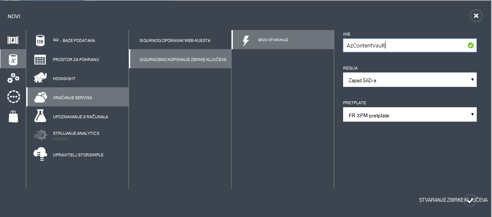
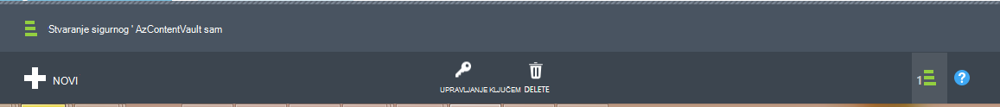

## Stvaranje sigurnosne kopije zbirke ključeva
Sigurnosne kopije datoteke i podatke iz Windows Server ili upravitelj podataka zaštitu (DPM) da biste Azure ili kada sigurnosno IaaS VMs na Azure, morate stvoriti sigurnosnu kopiju sigurnog u regiji mjesto na koje želite spremiti podatke.

Sljedeći koraci će vas voditi kroz stvaranje sigurnog koji se koristi za spremanje sigurnosne kopije.

1. Prijava na [Portal za upravljanje](https://manage.windowsazure.com/)
2. Kliknite **Novo** > **Data Services** > **Oporavak Services** > **Sigurnog sigurnosnu kopiju** , a zatim odaberite **Brzo stvaranje**.

    

3. **Naziv** parametra unesite neslužbeni naziv za identifikaciju sigurnosno kopiranje zbirke ključeva. To mora biti jedinstvena za svaku pretplatu.

4. Za parametar **regija** odaberite regiji za sigurnosno kopiranje zbirke ključeva. Što određuje regiji šalju podataka iz sigurnosne kopije. Odabirom regiji blizu svoju lokaciju možete smanjiti latenciju mreže kada sigurnosno Azure.

5. Kliknite na **Stvori sigurnog** da biste dovršili tijeka rada. Može potrajati neko vrijeme da sigurnosno kopiranje zbirke ključeva će biti stvoren. Da biste provjerili status, možete nadzirati obavijesti pri dnu portalu.

    

6. Nakon stvaranja sigurnosnih kopija sigurnog poruke obavijestit će vas na sigurnog uspješno je stvorena. Na sigurnog i nalazi se u resurse za oporavak servise kao **aktivnu**.

    

### Azure sigurnosne kopije - mogućnosti zalihosti pohrane

>[AZURE.IMPORTANT] Najbolje vrijeme za prepoznavanje zalihosti mogućnosti prostora za pohranu je desno nakon stvaranja zbirke ključeva, a prije jednom računalu registrirane da biste na zbirke ključeva. Kada stavku registrirani u sigurnog, zalihosti mogućnost pohrane je zaključan i ne može se mijenjati.

Poslovne potrebe morate utvrditi zalihosti spremanje sigurnosne kopije Azure pozadinska prostora za pohranu. Ako koristite Azure kao krajnja točka primarni sigurnosne kopije za pohranu (primjerice radite sigurnosne kopije za Azure s poslužiteljem Windows), razmislite o izdvajanju (zadano) zemlj suvišne mogućnost pohrane. To možete vidjeti u odjeljku mogućnost **Konfiguracija** sustava sigurnosno kopiranje zbirke ključeva.

#### Zemlj suvišnih prostora za pohranu (GRS)
GRS održava šest kopije vaših podataka. GRS, podataka je replicirati triput unutar primarni područja i i ponavlja se triput u sekundarni regiji stotine milja izvan primarni regiju, koja omogućuje najvišu razinu rok trajanja. U slučaju pogreške pri primarni regiju, spremanjem podataka u GRS, sigurnosno kopiranje Azure osigurava podataka durable u dva zasebna područja.

#### Lokalno suvišne za pohranu (LRS)
Lokalno suvišnih prostora za pohranu (LRS) održava tri kopije vaših podataka. LRS je replicirati triput unutar jednu funkciju u jednom području. LRS štiti podatke iz normalni hardverske pogreške, ali ne iz pogreške cijelu Azure funkcijom.

Ako koristite Azure kao krajnja točka tertiary sigurnosne kopije prostora za pohranu (npr koristite SCDPM da bi lokalnu sigurnosnu Kopiraj lokalnog & pomoću Azure za vaše dugoročnu zadržavanju mora), trebali biste odaberete lokalno suvišnih prostora za pohranu mogućnost **Konfiguracija** sustava sigurnog sigurnosnu kopiju. Tako ćete prikazati dolje trošak pohrana podataka u Azure, tijekom pružanja smanjiti razinu rok trajanja za podatke koji mogu biti prihvatljiva za tertiary kopije.

