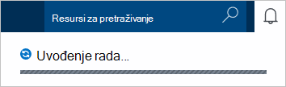
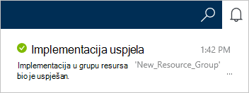
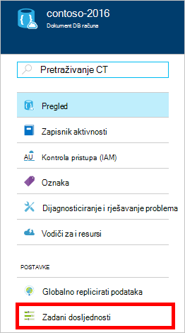
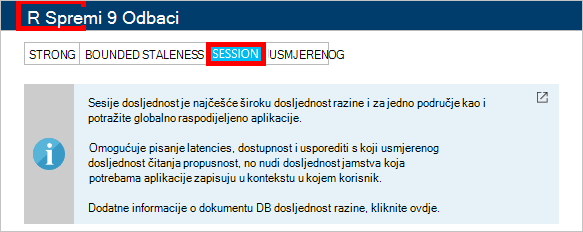

1.  Prijavite se na [portal za Azure](https://portal.azure.com/).
2.  U Jumpbar, kliknite **Novo**, kliknite **podataka + prostor za pohranu**, a zatim **DocumentDB (NoSQL)**.

      

3. U plohu **novog računa** navedite željena konfiguracija računa DocumentDB.

    

    - U okviru **ID-a** unesite naziv za identifikaciju DocumentDB računa.  Kada se provjerava **ID-a** , u okviru **ID** pojavit će se Zelena kvačica. Vrijednost za **ID-a** postaje naziv glavnog računala unutar URI. **ID-a** mogu sadržavati samo mala slova, brojeve i "-" znakova i mora biti između 3 i 50 znakova. Imajte na umu *documents.azure.com* dodaju se na krajnjoj točki naziv odaberete, rezultat koji postaje na krajnjoj točki računa DocumentDB.

    - U okviru **NoSQL API** odaberite **DocumentDB**.  

    - Za **pretplate**odaberite Azure pretplatu u koju želite koristiti za DocumentDB račun. Ako račun sadrži samo jedan pretplatu, taj račun nije odabrano po zadanom.

    - U **Grupi resursa**, odaberite ili stvorite grupu resursa za vaš račun DocumentDB.  Po zadanom stvara novu grupu resursa. Dodatne informacije potražite u članku [pomoću portala za Azure upravljanja Azure resurse](../articles/azure-portal/resource-group-portal.md).

    - Da biste odredili zemljopisnu lokaciju u kojem će biti DocumentDB račun koristiti **mjesto** . 

4.  Kada niste konfigurirali novim mogućnostima DocumentDB račun, kliknite **Stvori**. Da biste provjerili status implementacije, potvrdite okvir središtu obavijesti.  

      

    

5.  Nakon stvaranja računa DocumentDB spremna je za korištenje sa zadanim postavkama. Zadani dosljednost računa DocumentDB postavljen je na **sesiju**.  Zadani dosljednost možete prilagoditi tako da kliknete **Zadani dosljednost** na izborniku resursa. Da biste saznali više o razinama dosljednost nudi DocumentDB, potražite u članku [dosljednost razine u DocumentDB](../articles/documentdb/documentdb-consistency-levels.md).

      

      

[How to: Create a DocumentDB account]: #Howto
[Next steps]: #NextSteps
[documentdb-manage]:../articles/documentdb/documentdb-manage.md
