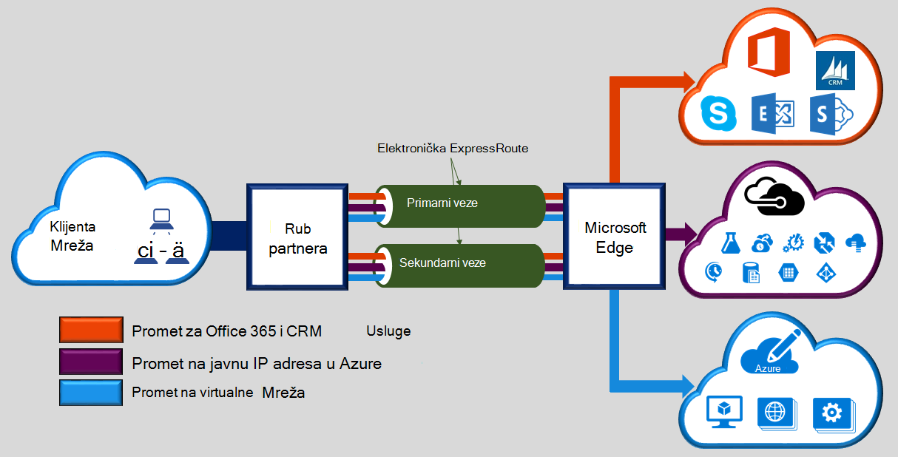

Microsoft Azure ExpressRoute omogućuje širenje vaše lokalne mreže Microsoft cloud putem namjenski privatne veze olakšano davatelj povezivanje. S ExpressRoute, možete uspostaviti veze s Microsoftovim servisima u oblaku, kao što je Microsoft Azure, Office 365 i CRM Online. Povezivanje može biti iz programa bilo koje-na-bilo koje mreže (VPN-a IP), point-to-point Ethernet mreže ili virtualne unakrsno-vezu putem davatelja povezivanja na funkciju zajednički mjesto. ExpressRoute veze ne otvorite putem javnog Interneta. Time se omogućuje ExpressRoute veze ponuditi dodatne pouzdanosti, brže brzine, donjem latencies i veću sigurnost od standardne veze putem Interneta.  

